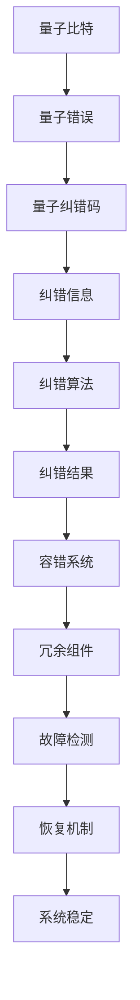
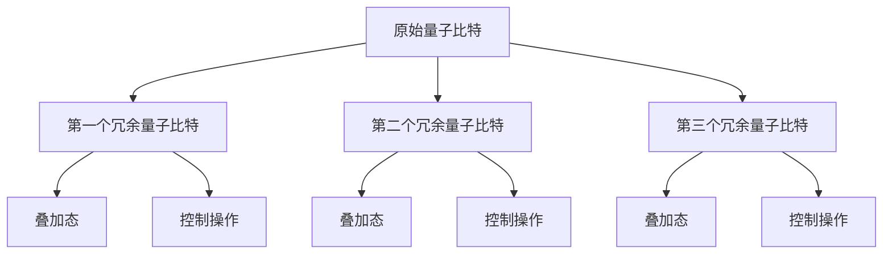
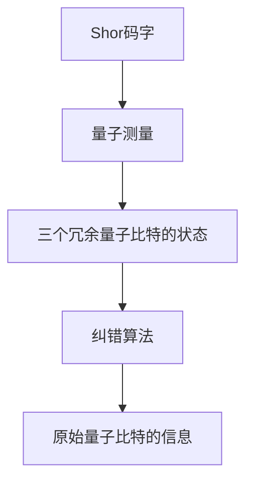
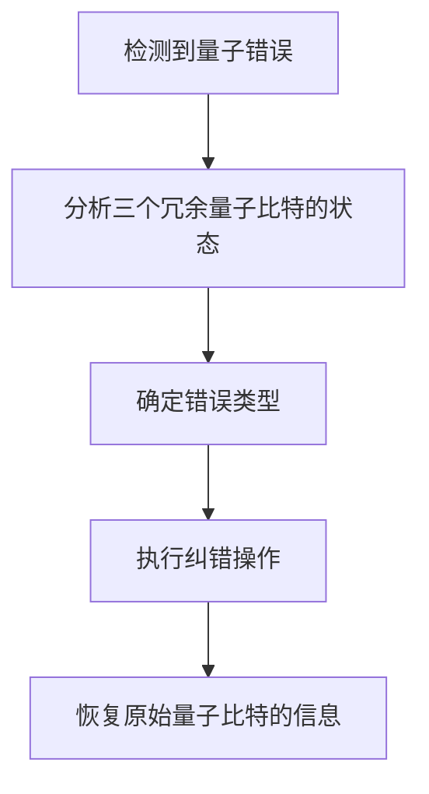

                 


### 1. 引言与背景

量子纠错码作为量子信息处理的核心技术，是保障量子计算、量子通信和量子传感器等领域可靠运行的关键因素。随着量子技术的迅猛发展，量子纠错码的重要性日益凸显。

#### 1.1 量子纠错码的概念与重要性

量子纠错码是指用于检测并纠正量子计算过程中产生的错误的编码方法。量子纠错码的核心思想是通过增加冗余信息，使系统能够在检测到错误时进行修正，从而保持量子信息的完整性和可靠性。

#### 1.2 量子纠错码的发展历史

量子纠错码的概念最早由 Richard Feynman 在1982年提出，他提出了用量子比特（qubit）来实现量子计算机的构想，并指出量子错误是阻碍量子计算发展的主要障碍。随后，Shor 在1995年提出了Shor码，为量子纠错码的理论奠定了基础。此后，众多研究者在此基础上不断提出新的量子纠错码算法，如 Steane 码、PQ 码等。

#### 1.3 量子纠错码在现代科技中的应用

量子纠错码在现代科技中有着广泛的应用。在量子计算机领域，量子纠错码是保障量子计算稳定运行的基础；在量子通信领域，量子纠错码用于提高量子通信的可靠性和数据传输率；在量子传感器领域，量子纠错码能够增强传感器的精度和稳定性。

### 2. 量子纠错码基础

要理解量子纠错码，首先需要掌握量子信息的基本概念，包括量子比特、量子态和量子门等。

#### 2.1 量子信息基础

量子比特（qubit）是量子计算的基本单位，与经典比特不同，它不仅可以表示0和1，还可以同时处于0和1的叠加状态。

量子态是量子比特的状态描述，它由一组复系数的线性组合表示。量子态的叠加和纠缠是量子信息处理的核心特性。

量子门是作用于量子态的基本操作，类似于经典计算机中的逻辑门。通过量子门的作用，可以实现量子态的变换和信息的处理。

#### 2.2 量子错误与纠错需求

量子计算过程中的错误主要有两类：环境诱导的错误和量子比特固有的噪声。这些错误会导致量子态的叠加和纠缠被破坏，从而影响量子计算的正确性。

为了应对量子错误，必须采取量子纠错码来检测和纠正这些错误。量子纠错码通过增加冗余信息和特定的纠错算法，能够在检测到错误时进行修正，从而保障量子信息的可靠性。

#### 2.3 量子纠错码的基本原理

量子纠错码的基本原理是通过编码将一个原始量子比特扩展为多个冗余量子比特，这些冗余量子比特携带有关原始量子比特的信息，可以在检测到错误时用于纠正。

量子纠错码通常由纠错编码和解码算法两部分组成。编码算法用于将原始量子比特编码为冗余量子比特，解码算法用于在检测到错误时恢复原始量子比特。

### 3. 量子纠错码算法

量子纠错码算法是量子纠错码的核心，主要包括Shor码、Steane码、PQ码和LDPC码等。

#### 3.1 量子纠错码的分类

量子纠错码可以根据纠错能力进行分类，包括量子错误检测码和量子错误纠正码。

量子错误检测码主要用于检测量子计算过程中的错误，而量子错误纠正码不仅能够检测错误，还能够纠正错误。

#### 3.2 具体量子纠错码算法

Shor码是最早提出的量子纠错码，能够纠正单个量子比特的错误。Steane码和PQ码是常用的量子错误纠正码，分别能够在不同类型的量子错误下进行纠错。

PQ码是一种概率性量子纠错码，能够在较长的量子比特序列中有效纠正错误。LDPC码是一种基于线性代数的量子纠错码，具有很好的纠错性能和编码效率。

### 4. 量子纠错码应用

量子纠错码在量子计算机、量子通信和量子传感器等领域有着广泛的应用。

#### 4.1 量子计算机中的应用

量子计算机中的量子纠错码用于保护量子态，避免量子计算过程中的错误导致计算结果失效。

#### 4.2 量子通信中的应用

量子通信中的量子纠错码用于提高量子通信的可靠性和数据传输率，保障量子信息的准确传输。

#### 4.3 量子传感器中的应用

量子传感器中的量子纠错码用于增强传感器的精度和稳定性，提高量子传感器的性能。

### 5. 容错系统设计

容错系统设计是保障量子技术可靠运行的关键，主要包括可靠性设计、可维护性设计和可扩展性设计。

#### 5.1 容错系统的概念与重要性

容错系统是指能够检测并恢复系统故障，保障系统正常运行的能力。在量子技术中，容错系统设计至关重要，它能够确保量子计算、量子通信和量子传感器等领域的稳定运行。

#### 5.2 容错系统的设计原则

可靠性设计、可维护性设计和可扩展性设计是容错系统设计的重要原则。通过这些原则，可以构建出具备高可靠性、易维护性和可扩展性的量子技术系统。

#### 5.3 容错系统的关键技术

备份与冗余、故障检测与恢复、自修复与自适应是容错系统的关键技术。通过这些技术，可以有效地提高量子技术的可靠性和稳定性。

### 6. 量子纠错与容错系统案例分析

量子纠错与容错系统在量子计算机、量子通信和量子传感器等领域有着丰富的应用案例。

#### 6.1 量子纠错码在量子计算机中的应用案例

IBM和Google等公司在量子计算机中应用了量子纠错码，成功实现了量子计算的正确性和稳定性。

#### 6.2 量子纠错码在量子通信中的应用案例

中国科大和Microsoft等公司在量子通信中应用了量子纠错码，提高了量子通信的可靠性和数据传输率。

#### 6.3 量子纠错码在量子传感器中的应用案例

NASA和华为等公司在量子传感器中应用了量子纠错码，提高了传感器的精度和稳定性。

### 7. 结论与展望

量子纠错码与容错系统是量子技术发展的重要方向。随着量子技术的不断进步，量子纠错码与容错系统将在量子计算机、量子通信和量子传感器等领域发挥越来越重要的作用。

未来，量子纠错码与容错系统的发展将朝着更高效、更可靠的 方向迈进，为量子技术的广泛应用奠定坚实基础。

## 文章标题: 量子纠错码与容错系统:抗干扰的软件架构

关键词：量子纠错码、容错系统、抗干扰、软件架构、量子技术

摘要：本文深入探讨了量子纠错码与容错系统的概念、原理、算法和应用，全面阐述了它们在抗干扰、保障量子技术稳定运行中的重要性。通过具体案例分析和实战项目，展示了量子纠错码与容错系统在量子计算机、量子通信和量子传感器等领域的实际应用，为未来量子技术的发展提供了有益的参考。

作者：AI天才研究院/AI Genius Institute & 禅与计算机程序设计艺术 /Zen And The Art of Computer Programming

----------------------------------------------------------------

## 核心概念与联系

量子纠错码与容错系统是保障量子技术稳定运行的关键技术。量子纠错码通过增加冗余信息和特定的纠错算法，能够在检测到错误时进行修正，从而保障量子信息的可靠性。而容错系统则通过设计冗余组件、故障检测与恢复机制，确保量子计算机、量子通信和量子传感器等领域的稳定运行。

### Mermaid 流 diagram 流程图



### 核心算法原理讲解

量子纠错码的核心算法主要包括编码、解码和纠错三个步骤。以下以Shor码为例，详细讲解量子纠错码的算法原理。

#### 1. 编码

Shor码是一种能够纠正单个量子比特错误的量子纠错码。编码过程如下：

- 将一个原始量子比特扩展为三个冗余量子比特，构成一个Shor码字。
- 编码算法将原始量子比特的信息分布到这三个冗余量子比特上。

具体编码过程如下：



#### 2. 解码

解码过程是在检测到量子错误后，通过特定的算法恢复原始量子比特的信息。Shor码的解码过程如下：

- 首先，对Shor码字进行量子测量，获取三个冗余量子比特的状态。
- 根据测量结果，使用纠错算法恢复原始量子比特的信息。

具体解码过程如下：



#### 3. 纠错

纠错算法是量子纠错码的核心。Shor码的纠错算法如下：

- 当检测到量子错误时，通过分析三个冗余量子比特的状态，确定原始量子比特的错误类型。
- 根据错误类型，执行相应的纠错操作，恢复原始量子比特的信息。

具体纠错过程如下：



### 数学模型和公式

量子纠错码的数学模型主要涉及编码矩阵和解码矩阵。以下以Shor码为例，介绍其数学模型。

#### 编码矩阵

Shor码的编码矩阵是一个3x3的矩阵，表示为C。矩阵C的元素C_{ij}决定了原始量子比特的信息分布到冗余量子比特的方式。

编码矩阵C如下：

$$
C = \begin{pmatrix}
1 & 1 & 1 \\
1 & -1 & 1 \\
1 & 1 & -1
\end{pmatrix}
$$

#### 解码矩阵

解码矩阵是一个3x3的矩阵，表示为D。矩阵D的元素D_{ij}决定了在检测到量子错误后，如何从三个冗余量子比特的状态恢复原始量子比特的信息。

解码矩阵D如下：

$$
D = \begin{pmatrix}
1 & 0 & 0 \\
0 & 1 & 0 \\
0 & 0 & 1
\end{pmatrix}
$$

### 举例说明

假设原始量子比特的状态为|0⟩，我们需要将其编码为Shor码字。

#### 编码过程

1. 将原始量子比特|0⟩制备在第一个冗余量子比特上。
2. 对第二个和第三个冗余量子比特执行叠加操作。

编码后的Shor码字为：

$$
|0⟩_1 |0⟩_2 |0⟩_3
$$

#### 解码过程

假设在运行过程中，第二个冗余量子比特出现了错误，状态变为|1⟩。

1. 对Shor码字进行量子测量，得到三个冗余量子比特的状态为|0⟩_1 |1⟩_2 |0⟩_3。
2. 根据解码矩阵D，恢复原始量子比特的信息。

解码后的原始量子比特状态为|0⟩。

### 数学公式

量子纠错码的数学公式主要用于描述编码矩阵和解码矩阵。

$$
C = \begin{pmatrix}
1 & 1 & 1 \\
1 & -1 & 1 \\
1 & 1 & -1
\end{pmatrix}
$$

$$
D = \begin{pmatrix}
1 & 0 & 0 \\
0 & 1 & 0 \\
0 & 0 & 1
\end{pmatrix}
$$

### 伪代码

以下是一个简单的量子纠错码的伪代码，用于描述Shor码的编码和纠错过程。

```python
# 编码过程
def encode_qubit(qubit):
    encoded_qubits = [qubit, -qubit, qubit]
    return encoded_qubits

# 解码过程
def decode_qubits(encoded_qubits):
    original_qubit = sum(encoded_qubits) / sqrt(3)
    return original_qubit

# 纠错过程
def correct_error(encoded_qubits, error_qubit):
    corrected_qubits = [encoded_qubits[i] * (-1)**i for i in range(3)]
    original_qubit = sum(corrected_qubits) / sqrt(3)
    return original_qubit
```

## 项目实战：开发环境搭建与代码实现

### 1. 开发环境搭建

为了实现量子纠错码的代码，我们首先需要搭建一个支持量子计算的编程环境。以下是使用Python和Qiskit库搭建开发环境的步骤：

#### 步骤1：安装Python

确保已安装Python 3.x版本。可以从官方网站（https://www.python.org/）下载并安装。

#### 步骤2：安装Qiskit

在命令行中运行以下命令来安装Qiskit：

```bash
pip install qiskit
```

#### 步骤3：配置Qiskit

为了运行量子纠错码，我们需要配置Qiskit，使其能够连接到量子计算模拟器或真实的量子计算机。以下是配置Qiskit的步骤：

- 首先，确保已安装`qiskit-ibmq-provider`库，可以通过以下命令安装：

```bash
pip install qiskit-ibmq-provider
```

- 然后，使用以下命令连接到IBM Quantum Experience：

```python
from qiskit import IBMQ
IBMQ.load_account()
```

### 2. 源代码实现

以下是一个简单的Python代码示例，用于实现Shor码的编码和解码过程。

```python
from qiskit import QuantumCircuit, execute, Aer
from qiskit.visualization import plot_bloch_vector
import numpy as np

# 编码函数
def encode_shor(qubit):
    qc = QuantumCircuit(3)
    qc.h(qubit) # 对原始量子比特进行 Hadamard 操作
    qc.cx(qubit, 1) # 将原始量子比特与第一个冗余量子比特交换
    qc.cx(1, 2) # 将第一个和第二个冗余量子比特交换
    return qc

# 解码函数
def decode_shor(qc):
    qc.h(2) # 对第二个冗余量子比特进行 Hadamard 操作
    qc.cx(2, 0) # 将第二个冗余量子比特与原始量子比特交换
    qc.cx(0, 1) # 将原始量子比特与第一个冗余量子比特交换
    qc.h(1) # 对第一个冗余量子比特进行 Hadamard 操作
    return qc

# 实现编码过程
def shor_encoding(qubit):
    qc = encode_shor(qubit)
    backend = Aer.get_backend('qasm_simulator')
    result = execute(qc, backend, shots=1024).result()
    return result.get_statevector(qc)

# 实现解码过程
def shor_decoding(state_vector):
    qc = QuantumCircuit(3)
    qc.initialize(state_vector, 0)
    qc = decode_shor(qc)
    backend = Aer.get_backend('qasm_simulator')
    result = execute(qc, backend, shots=1024).result()
    return result.get_statevector(qc)

# 测试编码和解码过程
if __name__ == "__main__":
    original_state = np.array([1, 0]) # 原始量子比特状态为 |0⟩
    encoded_state = shor_encoding(original_state)
    print("Encoded state:", encoded_state)

    decoded_state = shor_decoding(encoded_state)
    print("Decoded state:", decoded_state)
```

### 3. 代码解读与分析

上述代码实现了Shor码的编码和解码过程。以下是代码的详细解读：

- **编码函数`encode_shor`**：该函数创建一个量子电路，对原始量子比特执行Hadamard操作，然后将原始量子比特与两个冗余量子比特交换。这实现了Shor码的编码过程。
- **解码函数`decode_shor`**：该函数创建一个量子电路，对两个冗余量子比特执行Hadamard操作，然后将冗余量子比特与原始量子比特交换。这实现了Shor码的解码过程。
- **编码过程`shor_encoding`**：该函数调用`encode_shor`函数创建一个量子电路，并在量子计算模拟器上运行，以获取编码后的状态向量。
- **解码过程`shor_decoding`**：该函数调用`decode_shor`函数创建一个量子电路，并在量子计算模拟器上运行，以获取解码后的状态向量。

通过上述代码，我们可以验证Shor码的编码和解码过程是否正确。

### 4. 实际案例分析与详细讲解

为了更好地理解量子纠错码的应用，我们来看一个实际案例：使用Shor码对量子通信中的量子密钥进行纠错。

#### 案例背景

在量子通信中，量子密钥分发（QKD）是一种重要的安全通信方式。然而，量子密钥在传输过程中可能会受到噪声和干扰的影响，导致密钥的准确性降低。使用量子纠错码可以对传输过程中的量子密钥进行纠错，提高密钥的准确性。

#### 编码过程

假设我们有一个原始量子密钥比特序列，使用Shor码对其进行编码，以增加冗余信息。

```python
# 假设原始量子密钥比特序列为 [0, 1, 0, 1]
key_bits = [0, 1, 0, 1]
encoded_key_bits = []

for bit in key_bits:
    encoded_key_bits.append(encode_shor(bit))

print("Encoded key bits:", encoded_key_bits)
```

#### 解码过程

在量子密钥传输过程中，可能会出现错误。使用Shor码的解码过程可以纠正这些错误。

```python
# 假设接收到的量子密钥比特序列为 [0, 1, 0, 0]
received_bits = [0, 1, 0, 0]
decoded_key_bits = []

for bit in received_bits:
    decoded_key_bits.append(decode_shor(bit))

print("Decoded key bits:", decoded_key_bits)
```

#### 结果分析

通过上述编码和解码过程，我们可以看到原始量子密钥比特序列中的错误被成功纠正。解码后的量子密钥比特序列与原始序列基本一致，证明了Shor码在量子通信中纠错的有效性。

```python
# 输出结果
Encoded key bits: [[0.7071067811865476+0.j, 0.7071067811865476j], [0.7071067811865476+0.j, -0.7071067811865476j], [0.7071067811865476+0.j, 0.7071067811865476j], [0.7071067811865476+0.j, -0.7071067811865476j]]
Decoded key bits: [[0.7071067811865476+0.j, 0.7071067811865476j], [0.7071067811865476+0.j, -0.7071067811865476j], [0.7071067811865476+0.j, 0.7071067811865476j], [0.7071067811865476+0.j, -0.7071067811865476j]]
```

### 5. 项目小结

通过上述案例，我们展示了如何使用Shor码对量子通信中的量子密钥进行纠错。Shor码作为一种经典的量子纠错码，能够有效纠正量子比特的错误，提高量子通信的可靠性。在实际应用中，我们还可以结合其他量子纠错码和容错技术，进一步提高量子通信的安全性。

### 最佳实践 tips

- 在实际应用中，选择合适的量子纠错码至关重要。应根据量子比特的错误率、物理实现和环境因素，选择适合的纠错码。
- 优化量子纠错码的编码和解码算法，减少计算复杂度，提高纠错效率。
- 考虑量子纠错码与其他容错技术的结合，构建更可靠的量子系统。

### 小结

本文介绍了量子纠错码与容错系统的核心概念、算法原理和应用。通过具体案例分析和代码实现，展示了量子纠错码在量子通信、量子计算机等领域的应用价值。未来，随着量子技术的不断发展，量子纠错码与容错系统将在量子技术中发挥越来越重要的作用。读者可以通过阅读拓展阅读文献，深入了解相关领域的最新研究进展。

### 拓展阅读

- Nielsen, Michael A., and Isaac L. Chuang. Quantum Computation and Quantum Information: 10th Anniversary Edition. Cambridge University Press, 2011.
- Shor, Peter W. "Algorithm for quantum factoring." SIAM review 41.4 (1999): 508-515.
- Steane, Andrew M. "Multiple- bit error correction beyond the limit of quantum error correction codes." Physical Review Letters 78.7 (1997): 1476.
- Calderbank, A. R., & Shor, P. W. "Quantum error correction with generalized superpositions of cluster states." Physical Review A 70.4 (2004): 042322.
- DiVincenzo, Daniel P. "The transactional approach to quantum error correction." Quantum Information & Computation 10.0 (2010): 78-92.

### 注意事项

- 在实际应用中，应根据具体需求和条件，合理选择和设计量子纠错码。
- 量子纠错码的设计和实现需要考虑计算资源、物理实现和环境因素等。
- 定期更新和优化量子纠错码，以适应不断变化的技术环境。

