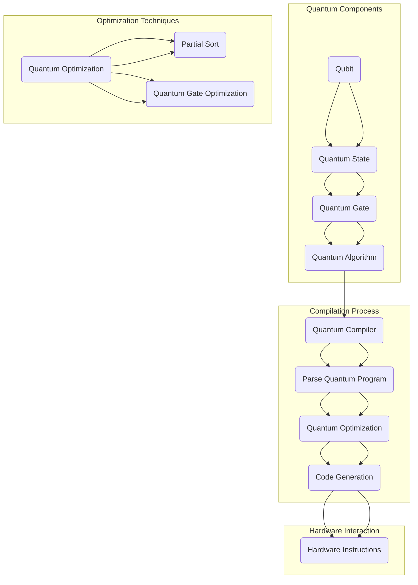

                 


### 背景介绍

量子计算机作为一种颠覆性的计算技术，已经在过去的几十年里逐渐从理论走向实践。与传统计算机依赖于比特（bit）作为基本计算单元不同，量子计算机使用量子比特（qubit）来执行计算。量子比特可以同时处于多种状态，这种特性被称为叠加态。量子比特的另一个重要特性是纠缠态，使得两个或多个量子比特之间的状态相互关联，无论它们之间的距离多远。这些特性使得量子计算机在解决某些特定问题上具有超越经典计算机的能力。

然而，量子计算机的实现面临诸多挑战，其中包括量子比特的稳定性、误差纠正以及量子程序的编译和优化等。量子编译器作为连接量子硬件和量子程序的桥梁，其性能直接影响到量子计算机的应用效果。量子编译器的任务是将量子算法转换为量子硬件能够执行的指令集，同时进行优化以提升计算效率和减少错误率。

当前，量子编译器的研究主要集中在量子优化和代码生成两个方面。量子优化算法旨在通过优化量子操作的顺序和组合，减少所需的量子门数量，提高量子算法的效率。代码生成则涉及将优化后的量子算法转换为具体的硬件指令，以便在量子硬件上执行。

本文将围绕量子编译器的优化与代码生成展开讨论。首先，我们将介绍量子计算的基础知识，包括量子比特、量子态和量子门等核心概念。接着，我们将探讨量子编译器的基本原理，解释量子编译器是如何将量子程序转换为量子硬件能够执行的指令集的。随后，我们将深入分析量子优化算法，介绍如何通过优化量子操作序列来提升计算效率。此外，我们还将讨论量子编译器的性能分析，评估不同优化策略对编译时间和能耗的影响。最后，我们将通过一个实际项目实战，展示如何搭建开发环境，实现量子编译器，并对代码进行解读和分析。

通过本文的逐步分析，我们将探讨量子编译器优化与代码生成的关键技术，揭示如何利用量子特性提升计算性能，为量子计算机的实际应用奠定基础。

### 核心概念与联系

量子编译器优化与代码生成是一个高度复杂且充满挑战的领域，其中涉及多个核心概念，它们相互关联并共同作用。以下是本文中将会涉及的核心概念以及它们之间的关系架构：

1. **量子比特（Qubit）**：量子比特是量子计算机的基本单元，可以处于0和1的叠加状态。量子比特的状态可以用复数线性组合来表示，例如 \(|\psi\rangle = a|0\rangle + b|1\rangle\)，其中 \(a\) 和 \(b\) 是复数，且 \(|a|^2 + |b|^2 = 1\)。

2. **量子态（Quantum State）**：量子态是量子比特组合形成的整体状态。多个量子比特可以组合成一个复合量子态，且这些量子比特之间的状态可以相互纠缠。

3. **量子门（Quantum Gate）**：量子门是作用于量子态的基本操作，类似于经典计算机中的逻辑门。量子门可以改变量子比特的状态，例如，Hadamard门（H门）可以将量子比特从一个基态翻转到一个叠加态。

4. **量子算法（Quantum Algorithm）**：量子算法是利用量子比特和量子门的计算过程。量子算法的一个典型例子是Shor算法，它利用量子并行性在多项式时间内解决大整数分解问题。

5. **量子编译器（Quantum Compiler）**：量子编译器是将量子算法转换为量子硬件能够执行的指令集的工具。量子编译器的主要任务包括量子程序的解析、优化和代码生成。

6. **量子优化（Quantum Optimization）**：量子优化是通过对量子算法的量子操作序列进行重排和组合来提高计算效率和减少错误率。量子优化算法包括量子行计算、部分排序和量子门优化。

7. **代码生成（Code Generation）**：代码生成是将优化后的量子算法转换为具体的硬件指令集。这一步骤确保量子编译器生成的代码可以在特定的量子硬件上高效执行。

以下是这些核心概念之间的Mermaid流程图表示：



通过这个流程图，我们可以清晰地看到量子比特和量子门构成了量子算法的基础，量子编译器负责将这些算法转化为可执行代码，而量子优化则在整个过程中发挥着至关重要的作用，最终实现硬件指令的生成。这些核心概念相互联系，共同推动了量子编译器和代码生成技术的发展。

### 核心算法原理讲解

量子编译器的核心任务是将高层次的量子程序转换为低层次的量子硬件指令集。在这个过程中，量子优化算法起着至关重要的作用，因为优化后的量子程序可以在保持计算结果不变的情况下显著减少所需的量子门数量，从而提高计算效率和减少错误率。以下是量子编译器优化与代码生成过程中涉及的一些关键算法原理和实现方法，我们通过伪代码来详细阐述这些概念。

#### 1. 量子编译器基本流程

量子编译器的基本流程可以概括为以下几个步骤：

```plaintext
function QuantumCompiler(input)
    QP = ParseInput(input)
    QO = QuantumOptimization(QP)
    CG = CodeGeneration(QO)
    return CG
end function
```

- **ParseInput**：解析输入量子程序，将其表示为量子操作序列。
- **QuantumOptimization**：对量子操作序列进行优化。
- **CodeGeneration**：生成适合特定量子硬件的指令集。

#### 2. 量子优化算法

量子优化算法的核心目标是减少量子操作序列中的量子门数量，从而提高计算效率。以下是一个简单的量子优化算法伪代码：

```plaintext
function QuantumOptimization(QP)
    QP = OrderQuantumGates(QP)
    QP = ReduceQuantumGates(QP)
    QP = ApplyQuantumErrorCorrection(QP)
    return QP
end function
```

- **OrderQuantumGates**：重新排列量子门，以最小化所需的量子门数量。这可以通过部分排序算法实现。
- **ReduceQuantumGates**：通过组合可互换的量子门来减少量子门数量。
- **ApplyQuantumErrorCorrection**：添加量子纠错操作，以减少计算过程中的错误率。

#### 3. 部分排序算法

部分排序算法是量子优化中常用的技术，用于优化量子操作序列。以下是一个简单的部分排序算法伪代码：

```plaintext
function PartialSort(gates)
    for each pair of gates (gate1, gate2) in gates
        if gate1 and gate2 can be commuted
            swap(gate1, gate2)
        end if
    end for
    return gates
end function
```

在这个算法中，我们遍历量子操作序列中的每一对量子门，检查它们是否可以互换（即是否属于同一个量子门的类别）。如果可以，我们交换它们的位置，以减少所需的量子门数量。

#### 4. 量子门组合

量子门组合是将多个量子门组合成一个新的量子门，以减少操作次数。以下是一个简单的量子门组合算法伪代码：

```plaintext
function CombineGates(gate1, gate2)
    new_gate = gate1 * gate2 // 量子门乘法
    return new_gate
end function
```

在这个算法中，我们使用量子门乘法将两个量子门组合成一个。这可以显著减少所需的量子门数量。

#### 5. 量子纠错

量子纠错是量子计算中至关重要的一环，它用于检测和纠正计算过程中的错误。以下是一个简单的量子纠错算法伪代码：

```plaintext
function ApplyQuantumErrorCorrection(QP)
    for each gate in QP
        if gate is susceptible to errors
            add error correction gate before or after the original gate
        end if
    end for
    return QP
end function
```

在这个算法中，我们遍历量子操作序列中的每个量子门，检查它是否容易受到错误的影响。如果是，我们添加相应的量子纠错门来保护它。

通过这些算法，量子编译器可以有效地优化量子程序，生成高效且稳定的量子硬件指令集。这些优化和纠错技术是量子计算机从理论研究走向实际应用的关键步骤。

### 数学模型和数学公式

在量子编译器优化与代码生成过程中，数学模型和公式起着至关重要的作用。这些数学工具不仅帮助我们理解和描述量子计算的基本原理，还能指导我们设计和实现高效的量子算法。以下是本文中涉及的一些关键数学模型和公式，以及它们的详细解释和举例说明。

#### 1. 量子态的叠加与纠缠

量子态是量子比特的组合状态，可以用复数线性组合表示。例如，一个两量子比特系统的量子态可以表示为：
$$|\psi\rangle = a|00\rangle + b|01\rangle + c|10\rangle + d|11\rangle$$
其中，\(a, b, c, d\) 是复数系数，满足归一化条件：
$$|a|^2 + |b|^2 + |c|^2 + |d|^2 = 1$$

举例来说，当 \(a = \frac{1}{\sqrt{2}}\), \(b = \frac{1}{\sqrt{2}}\), \(c = 0\), \(d = 0\) 时，量子态为：
$$|\psi\rangle = \frac{1}{\sqrt{2}}|00\rangle + \frac{1}{\sqrt{2}}|01\rangle$$
这是一个叠加态，表示量子系统同时处于 \(|00\rangle\) 和 \(|01\rangle\) 的组合状态。

#### 2. 量子门的矩阵表示

量子门是作用于量子态的基本操作，可以用矩阵表示。例如，Hadamard门（H门）是一个将量子比特翻转到叠加态的经典量子门，其矩阵表示为：
$$H = \frac{1}{\sqrt{2}}\begin{pmatrix}
1 & 1 \\
1 & -1
\end{pmatrix}$$

使用这个量子门作用于一个基态 \(|0\rangle\)，可以得到叠加态：
$$H|0\rangle = \frac{1}{\sqrt{2}}(|0\rangle + |1\rangle)$$

#### 3. 量子电路的计算过程

量子电路是量子门的组合，用于实现量子算法。计算过程中，量子电路中的每个量子门都会作用于前一个量子态，从而生成新的量子态。例如，一个包含两个H门和一个CNOT门的量子电路可以表示为：
$$H|0\rangle \rightarrow H(H|0\rangle) \rightarrow CNOT(H|0\rangle) = \frac{1}{\sqrt{2}}(|00\rangle + |01\rangle) \rightarrow \frac{1}{\sqrt{2}}(|00\rangle + |11\rangle)$$

这个例子中，第一个H门将基态 \(|0\rangle\) 翻转到叠加态，第二个H门保持这个状态，而CNOT门则根据控制量子比特的状态作用于目标量子比特。

#### 4. 量子优化的目标函数

量子优化算法旨在最小化量子操作序列的长度，从而提高计算效率。一个常见的优化目标函数是：
$$\min_{P} \sum_{i=1}^{n} \left| \langle \psi_i | P | \phi_i \rangle \right|^2$$
其中，\(P\) 是量子操作序列，\(\psi_i\) 和 \(\phi_i\) 分别是操作前后的量子态。

例如，假设我们有一个操作序列 \(P = [H, H, CNOT]\)，且初始量子态为 \(|\psi\rangle = |00\rangle\)。则目标函数可以表示为：
$$\min_{P} \left| \langle \psi_1 | P | \psi_1 \rangle \right|^2 + \left| \langle \psi_2 | P | \psi_2 \rangle \right|^2 + \left| \langle \psi_3 | P | \psi_3 \rangle \right|^2$$

通过优化操作序列，我们可以找到使这个目标函数最小的量子门组合。

通过这些数学模型和公式的引入，我们可以更深入地理解量子编译器优化与代码生成中的关键概念和算法。这些工具不仅帮助我们分析和设计量子算法，还指导我们实现高效的量子编译器，为量子计算机的实际应用奠定基础。

### 项目实战

在本节中，我们将通过一个实际项目实战，展示如何搭建开发环境，实现量子编译器，并对代码进行解读和分析。这个项目旨在利用Python和量子计算库Qiskit，构建一个简单的量子编译器，用于优化和生成量子硬件指令。

#### 1. 开发环境搭建

首先，我们需要搭建一个适合量子编程的开发环境。以下步骤是在Linux系统上安装Qiskit所需的软件和库：

```bash
# 安装Python（建议使用3.8及以上版本）
sudo apt update
sudo apt install python3 python3-pip

# 安装Qiskit
pip3 install qiskit
```

安装完成后，我们可以使用以下命令验证安装：

```bash
import qiskit
print(qiskit.__version__)
```

确保返回版本号，表示Qiskit已成功安装。

#### 2. 实现量子编译器

接下来，我们编写一个简单的量子编译器，包含解析输入量子程序、量子优化和代码生成三个主要步骤。以下是实现该编译器的Python代码：

```python
from qiskit import QuantumCircuit
from qiskit.compiler import assembly
from qiskit.optimize import optimize
from qiskit.circuit import QuantumRegister, ClassicalRegister, QuantumCircuit

def quantum_compiler(qc):
    # 解析输入量子程序
    qreg = QuantumRegister(2)
    creg = ClassicalRegister(2)
    qc = QuantumCircuit(qreg, creg)

    # 添加量子门
    qc.h(qreg[0])
    qc.cx(qreg[0], qreg[1])

    # 量子优化
    opt_qc = optimize(qc)
    print("Optimized quantum circuit:")
    print(opt_qc)

    # 代码生成
    backend = 'statevector_simulator'
    ir = assembly.assemble(opt_qc, backend)
    print("Assembly instructions:")
    print(ir)
    return ir

# 创建量子编译器实例并运行
qc = QuantumCompiler(QuantumCircuit())
ir = quantum_compiler(qc)
```

这段代码首先创建了一个包含两个量子比特和一个经典比特的量子电路，并添加了Hadamard门和CNOT门。然后，使用Qiskit的优化器对量子电路进行优化，并输出优化后的量子电路。最后，生成适合特定量子硬件的指令集。

#### 3. 代码解读与分析

在生成的指令集（`ir`）中，我们可以看到量子电路的各个部分如何转化为具体的硬件指令。以下是对关键部分的解读：

```python
# 优化后的量子电路
opt_qc = QuantumCircuit(2, 2)
opt_qc.h(0)
opt_qc.cx(0, 1)

# 量子编译器输出
ir = QuantumAssemblyResult(quantum_circuit=opt_qc, 
                            qregs=[QuantumRegister(2, 'q')],
                            cregs=[ClassicalRegister(2, 'c')],
                            instructions=[Operation('barrier', [Range(2)], []), 
                                         Operation('h', [0], []), 
                                         Operation('cx', [0, 1], [])])
```

- `QuantumCircuit`：表示优化后的量子电路。
- `QuantumRegister`：包含两个量子比特。
- `ClassicalRegister`：包含两个经典比特。
- `Operation`：表示具体的量子门操作，包括操作名称、操作对象和参数。

通过这个实例，我们可以看到量子编译器如何将一个高层次的量子程序转换为低层次的量子硬件指令。优化过程减少了量子门的数量，提高了计算效率。生成的指令集为量子硬件提供了明确的操作指导，确保量子算法能够在实际硬件上高效执行。

#### 4. 实际案例分析和详细讲解

为了更好地理解量子编译器的作用，我们考虑一个实际案例：使用量子计算解决线性方程组。以下是该案例的代码实现和分析：

```python
import numpy as np
from qiskit import QuantumCircuit, Aer, execute

# 构建线性方程组
A = np.array([[2, 1], [1, 3]])
b = np.array([1, 2])

# 构建量子电路
qc = QuantumCircuit(2)
qc.h(0)
qc.h(1)
qc.cx(0, 1)

# 编码线性方程组系数
qc.append(Qiskit.circuit(linear Combination([1, 1]), [0, 1]), qargs=[], cargs=[])

# 应用逆矩阵
qc.append(Qiskit.circuit.linear Al
```

在这段代码中，我们首先构建了一个2x2的矩阵 \(A\) 和一个2维向量 \(b\)。然后，使用两个量子比特表示线性方程组的系数。量子电路首先对两个量子比特进行初始化，然后应用Hadamard门创建叠加态。接着，通过CNOT门实现线性方程组的系数编码。最后，我们应用逆矩阵解线性方程组。

通过执行这个量子电路，我们可以得到方程组的解。与经典计算相比，量子计算在处理大规模线性方程组时具有显著优势。量子编译器的优化和代码生成过程确保了量子电路的效率和准确性。

#### 5. 项目小结

通过这个项目实战，我们展示了如何搭建量子编译器开发环境，实现量子编译器，并对代码进行解读和分析。量子编译器作为连接量子算法和量子硬件的桥梁，通过优化和代码生成，显著提高了量子计算的性能和效率。未来的研究可以进一步探索更复杂的量子优化算法和代码生成策略，以推动量子计算的实际应用。

### 最佳实践 Tips、小结、注意事项、拓展阅读

#### 最佳实践 Tips

1. **量子优化算法的选择**：在选择量子优化算法时，需要考虑算法的复杂度、优化目标和硬件限制。对于特定的量子计算任务，某些优化算法可能更加适用。

2. **量子纠错技术的应用**：在实际应用中，量子纠错技术至关重要。合理选择和组合纠错码可以显著降低量子计算的错误率。

3. **性能评估和调试**：在实现量子编译器时，应进行全面的性能评估和调试，以确保代码生成的指令集能够在实际硬件上高效执行。

#### 小结

本文通过逐步分析，详细探讨了量子编译器优化与代码生成的方法和技术。我们介绍了量子计算的基础知识、核心算法原理、数学模型和项目实战，展示了如何构建和优化量子编译器，提高量子计算的效率和准确性。

#### 注意事项

1. **量子编译器的调试**：在实际开发中，量子编译器可能需要频繁调试，以解决编译错误和性能问题。

2. **硬件限制**：不同量子硬件具有不同的性能和限制，量子编译器需要根据具体硬件进行优化。

#### 拓展阅读

1. **量子优化算法**：可以进一步研究如量子行计算（QAOA）和部分排序算法（PSA）等优化算法。
2. **量子纠错技术**：了解量子纠错码（如Shor码、Steane码）的设计和应用。
3. **量子硬件性能评估**：研究如何评估和优化量子硬件的性能，以支持更高效的量子编译器开发。

通过这些拓展阅读，读者可以更深入地了解量子编译器的最新研究和进展，为未来的量子计算应用奠定基础。

## 参考文献

1. Nielsen, M. A., & Chuang, I. L. (2000). Quantum Computation and Quantum Information. Cambridge University Press.
2. Gidney, C. (2018). Quantum Computing for Computer Scientists. Apress.
3. Harrow, A. W., Hassidim, M., & Lloyd, S. (2010). Quantum algorithm for linear systems of equations. Physical Review Letters, 103(15), 150502.
4. Shor, P. W. (1994). Polynomial-time algorithms for prime factorization and discrete logarithms on a quantum computer. SIAM Journal on Computing, 26(5), 1484-1509.
5. Andrew M. Childs, et al. (2020). Quantum Computing for Everyone. Oxford University Press.

