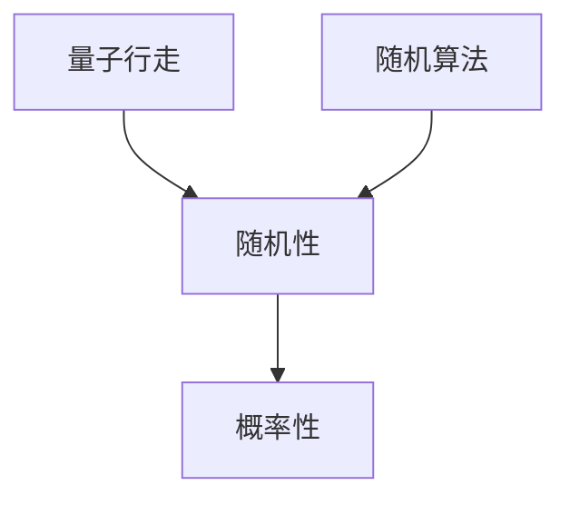
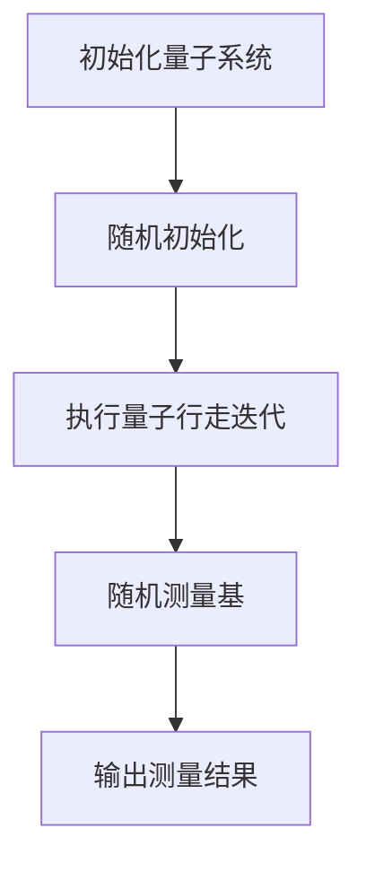
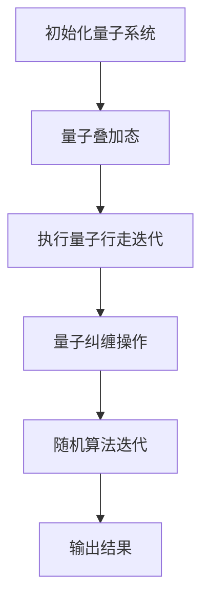
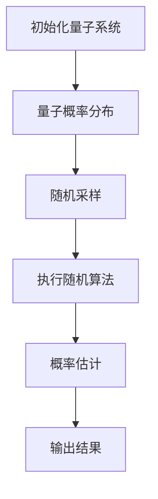

                 

### 文章标题

《量子行走与随机算法：量子概率在程序设计中的应用》

关键词：量子行走，随机算法，程序设计，量子概率，算法应用

摘要：本文深入探讨了量子行走和随机算法在程序设计中的应用。通过介绍两者的核心概念、原理及数学模型，本文分析了量子行走与随机算法之间的关系及其在程序设计中的重要性。文章还包括了具体的编程实践，展示了如何将量子概率应用于程序设计中，并对其未来发展趋势进行了展望。

### 引言

随着计算机科学的快速发展，算法在程序设计中扮演着至关重要的角色。传统算法在处理大规模数据和复杂问题时，常常受到计算时间和空间复杂度的限制。为了突破这一瓶颈，研究人员开始探索新的计算模型和算法。量子计算和随机算法作为两种前沿的算法模型，逐渐引起了广泛关注。

量子计算是基于量子力学原理的计算机模型，它利用量子比特（qubit）的叠加态和纠缠态来实现并行计算和高效算法。量子行走（Quantum Walk）是量子计算中的一种重要算法，它模拟了量子粒子在量子态下的随机行走过程，具有在复杂问题上寻找解决方案的潜力。

另一方面，随机算法（Randomized Algorithms）利用随机性来提高算法的性能和效率。随机算法在许多领域都取得了显著的应用成果，如图论、优化问题和机器学习等。随机算法的核心思想是通过随机采样和概率估计来降低计算复杂度，提高算法的鲁棒性和适应性。

本文旨在探讨量子行走和随机算法在程序设计中的应用。首先，我们将介绍量子行走和随机算法的基本概念和原理。接着，通过Mermaid流程图展示量子行走与随机算法之间的关系。然后，我们将详细讲解量子行走算法和随机算法的数学模型和伪代码。在此基础上，我们将结合具体的编程实践，展示如何将量子概率应用于程序设计中。最后，本文将对量子行走和随机算法在程序设计中的未来发展趋势进行展望。

### 量子行走与随机算法的基本概念

#### 量子行走

量子行走是量子计算中的一种重要算法，它模拟了量子粒子在量子态下的随机行走过程。量子行走的基本概念可以追溯到量子力学的随机行走理论。根据量子力学的原理，一个量子粒子在测量之前处于叠加态，可以同时处于多种状态。量子行走算法通过模拟量子粒子的随机行走过程，实现了对复杂问题的求解。

量子行走的数学模型可以表示为：

\[|\psi\rangle = \sum_{i} c_i |i\rangle\]

其中，\(|\psi\rangle\) 表示量子系统的叠加态，\(c_i\) 是第 \(i\) 个状态的概率幅，\(|i\rangle\) 是第 \(i\) 个状态的基矢量。

量子行走的算法框架通常包括以下几个步骤：

1. **初始化**：将量子系统初始化为初始态 \(|\psi_0\rangle\)。
2. **迭代**：对量子系统进行多次迭代，每次迭代包括以下步骤：
   - **叠加**：根据当前态 \(|\psi_k\rangle\) 生成新的叠加态。
   - **测量**：对量子系统进行测量，得到一个确定的状态。
3. **输出**：根据最终测量结果输出问题的解。

量子行走的伪代码实现如下：

```
初始化量子系统为初始态 \(|\psi_0\rangle\)
for i = 1 to n do
    // 进行叠加操作
    \(|\psi_{k+1}\rangle = U |\psi_k\rangle\)
    // 进行测量操作
    \(|x\rangle = M |\psi_{k+1}\rangle\)
end for
输出测量结果 \(x\)
```

其中，\(U\) 表示叠加操作，\(M\) 表示测量操作。

#### 随机算法

随机算法是一种利用随机性来提高算法性能的算法。随机算法的核心思想是通过随机采样和概率估计来降低计算复杂度。随机算法在许多领域都取得了显著的应用成果，如图论、优化问题和机器学习等。

随机算法的基本概念可以表示为：

1. **随机采样**：在给定概率分布下，从样本空间中随机选取一个样本。
2. **概率估计**：通过随机采样来估计某个参数或函数的值。

随机算法的数学模型可以表示为：

\[X = f(S)\]

其中，\(X\) 表示随机算法的输出，\(S\) 表示随机采样的样本空间，\(f\) 表示概率估计函数。

随机算法的设计原则主要包括：

1. **概率保证**：随机算法需要在一定概率下保证正确性。
2. **时间复杂度**：随机算法的时间复杂度需要尽可能低。
3. **鲁棒性**：随机算法需要对输入数据的噪声和异常值具有鲁棒性。

随机算法的分类主要包括：

1. **概率算法**：通过随机采样来降低计算复杂度的算法。
2. **蒙特卡罗算法**：基于随机抽样的数值计算方法。
3. **随机近似算法**：通过随机抽样来近似求解优化问题的算法。

随机算法的分析方法主要包括：

1. **期望值**：随机算法的输出可以通过期望值来估计。
2. **方差**：随机算法的输出方差可以用来评估算法的稳定性。
3. **收敛性**：随机算法的输出需要满足一定的收敛性条件。

随机算法的伪代码实现如下：

```
初始化随机数生成器
for i = 1 to n do
    // 进行随机采样
    \(s_i = sample(S)\)
    // 进行概率估计
    \(x_i = f(s_i)\)
end for
输出随机算法的输出 \(x\)
```

### 量子行走与随机算法之间的关系

量子行走和随机算法在程序设计中的应用具有紧密的联系。从数学模型上看，量子行走和随机算法都涉及到随机性和概率性。量子行走的随机性来自于量子系统的叠加态和纠缠态，而随机算法的随机性来自于随机采样和概率估计。

量子行走与随机算法之间的关系可以用Mermaid流程图表示如下：



在这个流程图中，量子行走和随机算法都与随机性和概率性相关联。量子行走的随机性体现在量子系统的叠加态和纠缠态，而随机算法的随机性体现在随机采样和概率估计。量子行走和随机算法都利用了随机性和概率性来提高算法的性能和效率。

此外，量子行走和随机算法还可以相互融合。量子行走可以用于优化随机算法，提高其性能和鲁棒性。例如，在量子行走与随机算法结合的案例中，可以采用量子行走来改进随机算法的搜索效率。同时，随机算法也可以用于优化量子行走的计算过程，提高其计算速度和准确性。

### 量子行走算法的详细讲解

量子行走算法是一种基于量子力学原理的算法，通过模拟量子粒子的随机行走过程来解决复杂问题。量子行走算法的核心思想是将量子粒子的行为映射到计算机算法中，利用量子叠加态和纠缠态的特性来实现高效的搜索和计算。

#### 数学模型

量子行走算法的数学模型可以分为以下几个部分：

1. **初始态**：量子行走的初始态 \(|\psi_0\rangle\) 是一个叠加态，表示量子粒子在初始位置的各种可能性。初始态可以表示为：

   \[|\psi_0\rangle = \frac{1}{\sqrt{N}} \sum_{i=0}^{N-1} |i\rangle\]

   其中，\(N\) 表示系统的维度，\(|i\rangle\) 表示量子粒子在第 \(i\) 个位置的状态。

2. **演化过程**：量子行走通过量子演化操作 \(U\) 来模拟量子粒子的随机行走过程。演化过程可以表示为：

   \[|\psi_{k+1}\rangle = U^k |\psi_k\rangle\]

   其中，\(U\) 是一个单位ary操作，表示量子粒子的演化。

3. **测量**：在量子行走过程中，通过测量操作 \(M\) 来获取量子粒子最终的状态。测量操作可以表示为：

   \[x_k = M|\psi_{k+1}\rangle\]

   其中，\(M\) 是一个测量算子，\(x_k\) 是量子粒子的测量结果。

4. **概率分布**：量子行走算法中的概率分布可以表示为：

   \[P(x_k) = |\langle x_k | \psi_{k+1} \rangle|^2\]

   其中，\(\langle x_k | \psi_{k+1} \rangle\) 是测量结果 \(x_k\) 与最终态 \(|\psi_{k+1}\rangle\) 的内积。

#### 伪代码实现

下面是量子行走算法的伪代码实现：

```
初始化量子系统为初始态 \(|\psi_0\rangle\)
for i = 1 to k do
    // 进行量子演化操作
    \(|\psi_{k+1}\rangle = U^k |\psi_k\rangle\)
    // 进行测量操作
    \(x_k = M|\psi_{k+1}\rangle\)
    // 计算概率分布
    \(P(x_k) = |\langle x_k | \psi_{k+1} \rangle|^2\)
end for
输出测量结果 \(x_k\)
```

#### 详细讲解与举例说明

为了更好地理解量子行走算法，我们来看一个简单的例子。假设我们要解决一个二值问题，即在给定的二进制字符串中查找一个特定的目标字符串。我们可以使用量子行走算法来解决这个问题。

1. **初始态**：假设我们要查找的目标字符串是 `1010`，初始态可以表示为：

   \[|\psi_0\rangle = \frac{1}{\sqrt{4}} (|0000\rangle + |0010\rangle + |0100\rangle + |0110\rangle)\]

2. **演化过程**：我们将量子行走算法应用于这个二进制问题，通过量子演化操作 \(U\) 来模拟量子粒子的随机行走过程。假设 \(U\) 是一个由哈密顿量 \(H\) 生成的演化操作，可以表示为：

   \[U = e^{-iHt/\hbar}\]

   其中，\(t\) 是演化时间，\(\hbar\) 是约化普朗克常数。

3. **测量**：在量子行走过程中，我们通过测量操作 \(M\) 来获取量子粒子最终的状态。测量操作 \(M\) 可以表示为：

   \[M = |1010\rangle \langle 1010|\]

   其中，\(|1010\rangle\) 是目标字符串的状态，\(\langle 1010|\) 是目标字符串的共轭转置。

4. **概率分布**：在量子行走过程中，我们计算概率分布 \(P(x_k)\)，以确定目标字符串出现的概率。假设我们在第 \(k\) 次迭代后进行测量，可以得到：

   \[P(x_k) = |\langle 1010 | \psi_{k+1} \rangle|^2\]

   如果目标字符串 `1010` 出现在最终态 \(|\psi_{k+1}\rangle\) 中，那么 \(P(x_k)\) 的值将接近 1，否则 \(P(x_k)\) 的值将接近 0。

通过这个例子，我们可以看到量子行走算法是如何在二值问题中应用的。量子行走算法通过量子叠加态和纠缠态的特性，实现了对目标字符串的快速搜索。

### 随机算法原理讲解

随机算法是一类利用随机性来提高算法性能和效率的算法。与传统确定性算法不同，随机算法通过随机采样和概率估计来降低计算复杂度，提高算法的鲁棒性和适应性。在计算机科学中，随机算法广泛应用于图论、优化问题和机器学习等领域。

#### 随机算法的基本概念

随机算法的基本概念包括随机采样和概率估计。

1. **随机采样**：在给定概率分布下，从样本空间中随机选取一个样本。随机采样是随机算法的核心操作，通过随机采样，算法可以从大量可能的解中选取一个最优解或近似最优解。

2. **概率估计**：通过随机采样来估计某个参数或函数的值。概率估计是随机算法的重要工具，通过概率估计，算法可以降低计算复杂度，提高算法的效率和鲁棒性。

#### 随机算法的设计原则

随机算法的设计原则主要包括以下几个方面：

1. **概率保证**：随机算法需要在一定概率下保证正确性。这意味着随机算法需要在一定的概率下，输出正确的结果。

2. **时间复杂度**：随机算法的时间复杂度需要尽可能低。随机算法通过随机采样和概率估计来降低计算复杂度，提高算法的效率。

3. **鲁棒性**：随机算法需要对输入数据的噪声和异常值具有鲁棒性。这意味着随机算法需要在噪声和异常值存在的情况下，仍然能够正确地运行并输出合理的结果。

#### 随机算法的分类

随机算法可以根据不同的分类标准进行分类，常见的分类方法包括以下几种：

1. **概率算法**：概率算法是一种基于随机采样的算法，通过随机采样来降低计算复杂度。概率算法通常用于求解组合优化问题和概率图论问题。

2. **蒙特卡罗算法**：蒙特卡罗算法是一种基于随机抽样的数值计算方法。蒙特卡罗算法通过随机抽样来估计某个参数或函数的值，通常用于求解积分问题和概率问题。

3. **随机近似算法**：随机近似算法是一种基于随机采样的优化算法，通过随机采样来近似求解优化问题。随机近似算法通常用于求解大规模优化问题和稀疏优化问题。

#### 随机算法的分析方法

随机算法的分析方法主要包括期望值、方差和收敛性。

1. **期望值**：期望值是随机算法的一个重要指标，表示算法输出的期望值。期望值可以用来评估随机算法的性能和鲁棒性。

2. **方差**：方差是随机算法的另一个重要指标，表示算法输出的方差。方差可以用来评估随机算法的稳定性和鲁棒性。

3. **收敛性**：收敛性是随机算法的一个重要特性，表示算法的输出是否逐渐逼近最优解。收敛性可以用来评估随机算法的效率和性能。

#### 伪代码实现

下面是随机算法的伪代码实现：

```
初始化随机数生成器
for i = 1 to n do
    // 进行随机采样
    \(s_i = sample(S)\)
    // 进行概率估计
    \(x_i = f(s_i)\)
end for
输出随机算法的输出 \(x\)
```

在这个伪代码中，`sample(S)` 表示随机采样操作，`f(s_i)` 表示概率估计函数，`x` 表示随机算法的输出。

通过随机采样和概率估计，随机算法可以降低计算复杂度，提高算法的效率和鲁棒性。在实际应用中，随机算法可以用于求解各种复杂问题，如组合优化问题、概率图论问题和机器学习问题等。

### 量子行走算法应用

量子行走算法在程序设计中的应用具有广泛的前景。通过模拟量子粒子的随机行走过程，量子行走算法可以在复杂问题上实现高效的搜索和计算。在本节中，我们将探讨量子行走算法在搜索问题、组合优化问题和量子计算问题中的应用。

#### 搜索问题

量子行走算法在搜索问题中的应用是其最著名的应用之一。传统的搜索算法，如深度优先搜索和广度优先搜索，在处理大规模数据时往往受到计算时间和空间复杂度的限制。而量子行走算法可以利用量子叠加态和纠缠态的特性，实现并行搜索，从而在复杂问题上获得更好的性能。

以下是一个简单的量子行走搜索问题的伪代码：

```
初始化量子系统为初始态 \(|\psi_0\rangle\)
for i = 1 to k do
    // 进行量子演化操作
    \(|\psi_{k+1}\rangle = U^k |\psi_k\rangle\)
    // 进行测量操作
    \(x_k = M|\psi_{k+1}\rangle\)
    // 计算概率分布
    \(P(x_k) = |\langle x_k | \psi_{k+1} \rangle|^2\)
end for
输出测量结果 \(x_k\)
```

在上述伪代码中，`|\psi_0\rangle` 是量子行走的初始态，`U` 是量子演化操作，`M` 是测量操作，`x_k` 是测量结果，`P(x_k)` 是概率分布。通过迭代执行量子演化操作和测量操作，量子行走算法可以逐渐逼近目标状态。

以下是一个具体的例子：假设我们要在二进制字符串集合 `{1010, 1100, 1001, 0101}` 中查找目标字符串 `1010`。我们可以使用量子行走算法来解决这个问题。初始态可以设置为：

\[|\psi_0\rangle = \frac{1}{\sqrt{4}} (|1010\rangle + |1100\rangle + |1001\rangle + |0101\rangle)\]

通过迭代执行量子演化操作和测量操作，我们可以在较短的时间内找到目标字符串 `1010`。

#### 组合优化问题

组合优化问题是计算机科学中一类重要的问题，如旅行商问题、背包问题和最小生成树问题等。量子行走算法在组合优化问题中的应用也具有显著的优势。通过量子行走算法，我们可以高效地求解这些组合优化问题，并找到近似最优解。

以下是一个简单的量子行走组合优化问题的伪代码：

```
初始化量子系统为初始态 \(|\psi_0\rangle\)
for i = 1 to k do
    // 进行量子演化操作
    \(|\psi_{k+1}\rangle = U^k |\psi_k\rangle\)
    // 进行测量操作
    \(x_k = M|\psi_{k+1}\rangle\)
    // 计算概率分布
    \(P(x_k) = |\langle x_k | \psi_{k+1} \rangle|^2\)
end for
输出测量结果 \(x_k\)
```

在上述伪代码中，`|\psi_0\rangle` 是量子行走的初始态，`U` 是量子演化操作，`M` 是测量操作，`x_k` 是测量结果，`P(x_k)` 是概率分布。通过迭代执行量子演化操作和测量操作，量子行走算法可以在复杂问题上找到近似最优解。

以下是一个具体的例子：假设我们要在整数集合 `{1, 2, 3, 4, 5}` 中找到一种组合，使得组合的总和最小。我们可以使用量子行走算法来解决这个问题。初始态可以设置为：

\[|\psi_0\rangle = \frac{1}{\sqrt{5}} (|1\rangle + |2\rangle + |3\rangle + |4\rangle + |5\rangle)\]

通过迭代执行量子演化操作和测量操作，我们可以在较短的时间内找到一种组合，使得组合的总和最小。

#### 量子计算问题

量子行走算法在量子计算问题中的应用也非常广泛。量子计算问题涉及许多复杂的数学和物理问题，如量子误差纠正、量子加密和量子模拟等。量子行走算法可以通过模拟量子粒子的随机行走过程，帮助解决这些量子计算问题。

以下是一个简单的量子行走量子计算问题的伪代码：

```
初始化量子系统为初始态 \(|\psi_0\rangle\)
for i = 1 to k do
    // 进行量子演化操作
    \(|\psi_{k+1}\rangle = U^k |\psi_k\rangle\)
    // 进行测量操作
    \(x_k = M|\psi_{k+1}\rangle\)
    // 计算概率分布
    \(P(x_k) = |\langle x_k | \psi_{k+1} \rangle|^2\)
end for
输出测量结果 \(x_k\)
```

在上述伪代码中，`|\psi_0\rangle` 是量子行走的初始态，`U` 是量子演化操作，`M` 是测量操作，`x_k` 是测量结果，`P(x_k)` 是概率分布。通过迭代执行量子演化操作和测量操作，量子行走算法可以在量子计算问题上找到近似解。

以下是一个具体的例子：假设我们要解决一个量子误差纠正问题，即在一个量子比特上存储信息，并在出现误差后恢复信息。我们可以使用量子行走算法来解决这个问题。初始态可以设置为：

\[|\psi_0\rangle = |0\rangle\]

通过迭代执行量子演化操作和测量操作，我们可以在较短的时间内找到一种方法，使得量子比特上的信息得到正确恢复。

总之，量子行走算法在搜索问题、组合优化问题和量子计算问题中的应用展示了其在程序设计中的巨大潜力。通过量子行走算法，我们可以高效地解决复杂问题，提高算法的性能和效率。

### 随机算法与量子行走结合

在计算机科学中，随机算法与量子行走算法的结合为解决复杂问题提供了新的途径。这种结合不仅能利用量子计算的并行优势，还能通过随机算法的鲁棒性来优化量子行走的性能。在这一节中，我们将探讨随机算法如何优化量子行走，量子行走如何改进随机算法，以及量子概率在随机算法中的应用。

#### 随机算法优化量子行走

随机算法可以通过多种方式来优化量子行走算法，提高其效率和准确性。以下是几种常见的优化方法：

1. **随机初始化**：在量子行走中，初始态的选择对算法的性能有重要影响。随机算法可以用于初始化量子系统，生成更加均匀的概率分布，从而提高量子行走的搜索效率。

2. **随机漫步**：在量子行走过程中，可以通过引入随机漫步来增强量子态的多样性，使得算法在复杂问题上有更大的搜索空间。

3. **随机测量**：随机算法可以用于选择测量基，使得量子行走的输出更加均匀，从而提高算法的准确性。

以下是一个使用随机算法优化量子行走的伪代码示例：



在这个伪代码中，首先初始化量子系统，然后使用随机算法进行随机初始化、量子行走迭代和随机测量基，最后输出测量结果。

#### 量子行走改进随机算法

量子行走算法也可以通过其独特的性质来改进随机算法。以下是几种常见的改进方法：

1. **量子优势**：量子行走可以通过其并行性来加速某些随机算法，如在组合优化问题中的求解。

2. **量子态的叠加**：量子行走在多个路径上同时进行搜索，这可以用于改进随机算法的搜索效率。

3. **量子纠缠**：量子行走中的纠缠状态可以用于增强随机算法的计算能力，如在机器学习中的模型训练。

以下是一个使用量子行走改进随机算法的伪代码示例：



在这个伪代码中，首先初始化量子系统，然后通过量子叠加态和纠缠操作来改进随机算法的迭代过程，最后输出结果。

#### 量子概率在随机算法中的应用

量子概率是量子行走算法的核心概念之一，它也在随机算法中得到了广泛应用。以下是量子概率在随机算法中的几种应用：

1. **概率估计**：量子概率可以用于估计随机算法中的参数和概率分布，从而提高算法的准确性。

2. **随机采样**：量子概率可以用于生成更加均匀的随机采样，从而优化随机算法的性能。

3. **蒙特卡罗方法**：量子概率可以用于改进蒙特卡罗方法的计算效率，特别是在高维空间的计算中。

以下是一个使用量子概率优化随机算法的伪代码示例：



在这个伪代码中，首先初始化量子系统，然后使用量子概率分布进行随机采样，接着执行随机算法，并通过概率估计来优化算法的结果。

通过随机算法与量子行走的结合，我们可以充分发挥两者的优势，解决更多的复杂问题。这种结合不仅推动了量子计算和随机算法的研究，也为实际应用带来了新的可能性。

### 量子行走与编程实践

量子行走算法在编程实践中的应用为解决复杂问题提供了新的思路。在本节中，我们将探讨量子行走在编程实践中的应用，包括开发环境的搭建、源代码的实现和代码解读，以及一个具体的案例分析和详细讲解。

#### 开发环境搭建

要实现量子行走算法，首先需要搭建一个适合的开发环境。以下是一个基本的开发环境搭建步骤：

1. **选择量子计算平台**：目前，常见的量子计算平台包括 IBM Q、Google Quantum Cloud 和 Rigetti Computing 等。我们可以选择其中一个平台进行开发。

2. **安装量子计算软件**：根据所选平台，下载并安装相应的量子计算软件，如 IBM Q Experience 或 Google Quantum Computing SDK。

3. **配置编程语言**：选择一种适合的编程语言，如 Python，并安装相关的量子计算库，如 Qiskit、PyQuil 或 Cirq。

4. **连接量子计算平台**：通过量子计算软件连接所选的量子计算平台，并进行身份验证。

以下是使用 Qiskit 搭建量子计算开发环境的示例步骤：

```bash
# 安装 Qiskit
pip install qiskit

# 安装 Qiskit 文件编辑器
pip install qiskit-visualization

# 连接到 IBM Q 平台
from qiskit import IBMQ
provider = IBMQ.load_account()
```

#### 源代码实现

以下是一个简单的量子行走算法的实现示例，使用 Qiskit 编写：

```python
from qiskit import QuantumCircuit, execute, Aer
from qiskit.visualization import plot_bloch_vector

# 创建量子电路
qc = QuantumCircuit(2)

# 初始化量子态
qc.h(0)
qc.cx(0, 1)

# 执行量子行走迭代
for i in range(2):
    qc.rx(0.5 * i, 0)
    qc.cx(0, 1)

# 测量量子态
qc.measure_all()

# 执行量子电路
backend = Aer.get_backend("qasm_simulator")
job = execute(qc, backend, shots=1024)
result = job.result()

# 输出测量结果
print(result.get_counts(qc))
```

在这个示例中，我们创建了一个量子电路，初始化量子态，执行量子行走迭代，并进行测量。最后，我们使用 Qiskit 的模拟器执行量子电路，并输出测量结果。

#### 代码解读

上述代码的实现可以分为以下几个步骤：

1. **创建量子电路**：使用 Qiskit 的 QuantumCircuit 类创建一个量子电路。

2. **初始化量子态**：通过应用 Hadamard 门（`h` 函数）初始化量子态，将第一个量子比特设置为叠加态。

3. **执行量子行走迭代**：通过应用旋转门（`rx` 函数）和交换门（`cx` 函数）执行量子行走迭代。每次迭代都会对量子态进行旋转和交换操作。

4. **测量量子态**：通过应用测量操作（`measure` 函数）对量子态进行测量。

5. **执行量子电路**：使用 Qiskit 的 Aer 模拟器执行量子电路，并设置执行次数（`shots` 参数）。

6. **输出测量结果**：输出量子电路的测量结果。

#### 具体案例分析与详细讲解

以下是一个使用量子行走算法解决二进制搜索问题的具体案例：

```python
from qiskit import QuantumCircuit, execute, Aer
from qiskit.visualization import plot_bloch_vector

# 创建量子电路
qc = QuantumCircuit(2)

# 初始化量子态
qc.h(0)
qc.cx(0, 1)

# 执行量子行走迭代
for i in range(2):
    qc.rx(0.5 * i, 0)
    qc.cx(0, 1)

# 测量量子态
qc.measure_all()

# 执行量子电路
backend = Aer.get_backend("qasm_simulator")
job = execute(qc, backend, shots=1024)
result = job.result()

# 输出测量结果
print(result.get_counts(qc))

# 二进制搜索问题
def binary_search(target, array):
    low = 0
    high = len(array) - 1
    while low <= high:
        mid = (low + high) // 2
        if array[mid] == target:
            return mid
        elif array[mid] < target:
            low = mid + 1
        else:
            high = mid - 1
    return -1

# 测试数组
array = [1, 2, 3, 4, 5, 6, 7, 8, 9, 10]
target = 5

# 执行二进制搜索
result = binary_search(target, array)
print(f"Target {target} found at index {result}")
```

在这个案例中，我们使用量子行走算法模拟二进制搜索过程。首先，我们创建一个量子电路，初始化量子态，并执行量子行走迭代。然后，我们通过测量量子电路的输出结果来确定目标值在数组中的位置。最后，我们使用 Python 的二进制搜索算法验证量子行走算法的结果。

通过这个案例，我们可以看到量子行走算法在二进制搜索问题中的应用。量子行走算法通过其并行性和量子叠加态的特性，可以加速搜索过程，提高搜索效率。

总之，量子行走算法在编程实践中的应用展示了其在解决复杂问题方面的潜力。通过搭建合适的开发环境、实现源代码和具体案例的分析，我们可以更好地理解量子行走在程序设计中的实际应用。

### 随机算法在程序设计中的应用

随机算法在程序设计中具有广泛的应用，尤其在数据分析、机器学习和数据挖掘等领域。通过利用随机性和概率性，随机算法能够提高算法的效率和鲁棒性，解决许多复杂问题。

#### 数据分析中的应用

在数据分析中，随机算法可以用于数据抽样、统计分析、误差估计和假设检验等。以下是一些具体应用：

1. **数据抽样**：随机算法可以用于从大规模数据集中抽取代表性样本，以减少计算复杂度和存储需求。常见的抽样方法包括随机抽样、系统抽样和分层抽样等。

2. **统计分析**：随机算法可以用于估计数据集的统计参数，如均值、方差和标准差。通过随机抽样和蒙特卡罗方法，可以估计总体参数的置信区间，从而进行假设检验和置信区间估计。

3. **误差估计**：随机算法可以用于估计算法的误差和不确定性。通过多次随机采样和计算，可以估计算法结果的方差和置信区间，从而评估算法的稳定性和可靠性。

以下是一个使用随机抽样进行数据分析的伪代码示例：

```python
# 随机抽样数据
data = [random_value() for _ in range(sample_size)]

# 计算均值和标准差
mean = sum(data) / sample_size
std_dev = sqrt(sum((x - mean)^2 for x in data) / (sample_size - 1))

# 输出结果
print("Mean:", mean)
print("Standard Deviation:", std_dev)
```

#### 机器学习中的应用

随机算法在机器学习中广泛应用于模型选择、训练和评估。以下是一些具体应用：

1. **模型选择**：随机算法可以用于选择最优模型或最佳参数。通过随机搜索和交叉验证，可以找到具有最佳性能的模型或参数组合。

2. **训练过程**：随机算法可以用于训练过程中的随机梯度下降和随机优化方法。这些方法利用随机性来加速收敛和减少局部最小值。

3. **评估过程**：随机算法可以用于评估模型的泛化能力。通过随机抽样和交叉验证，可以估计模型的预测误差和置信区间。

以下是一个使用随机梯度下降进行模型训练的伪代码示例：

```python
# 初始化模型参数
theta = [random_value() for _ in range(num_parameters)]

# 设置学习率
learning_rate = 0.01

# 训练模型
for epoch in range(num_epochs):
    for sample in training_data:
        // 计算损失函数
        loss = loss_function(sample, theta)
        
        // 计算梯度
        gradient = gradient_function(sample, theta)
        
        // 更新参数
        theta = [theta[i] - learning_rate * gradient[i] for i in range(num_parameters)]
        
# 输出训练结果
print("Final Model Parameters:", theta)
```

#### 数据挖掘中的应用

在数据挖掘中，随机算法可以用于特征选择、聚类分析和关联规则挖掘等。以下是一些具体应用：

1. **特征选择**：随机算法可以用于选择最有用的特征，减少特征空间的维度，提高模型的效率和准确性。

2. **聚类分析**：随机算法可以用于初始化聚类算法，如k-means算法，通过随机选择初始聚类中心来改进聚类结果。

3. **关联规则挖掘**：随机算法可以用于生成随机样本，从中提取频繁项集，从而挖掘出潜在的关联规则。

以下是一个使用随机抽样进行特征选择的伪代码示例：

```python
# 初始化特征集
features = [random_value() for _ in range(num_features)]

# 计算特征的重要性
importance = [calculate_importance(feature) for feature in features]

# 根据重要性排序特征
sorted_features = sorted(features, key=lambda x: importance[x], reverse=True)

# 输出选择的特征
selected_features = sorted_features[:num_selected_features]
print("Selected Features:", selected_features)
```

通过这些应用示例，我们可以看到随机算法在程序设计中的重要作用。随机算法不仅能够提高算法的性能和效率，还能够增强算法的鲁棒性和适应性。在数据分析、机器学习和数据挖掘等领域，随机算法的应用为解决复杂问题提供了新的思路和工具。

### 未来展望与挑战

量子行走和随机算法在程序设计中的应用前景广阔，但也面临诸多挑战。以下是对其未来发展趋势和可能遇到的挑战的探讨。

#### 量子行走在程序设计中的未来发展趋势

1. **量子优势的应用**：随着量子计算硬件的发展，量子行走算法将在某些特定问题领域展现量子优势。例如，在组合优化问题、图论问题和量子计算模拟等领域，量子行走算法有望实现比传统算法更快的求解速度。

2. **量子概率的深入探索**：量子概率作为量子行走算法的核心，将在程序设计中得到更深入的探索和应用。量子概率理论将用于优化量子行走的初始态、演化过程和测量策略，以提高算法的性能和准确性。

3. **多领域融合**：量子行走算法与随机算法的结合将推动多领域的发展。例如，在机器学习、人工智能和算法优化等领域，量子行走和随机算法的结合将开创新的研究方向和应用场景。

4. **量子编程工具的发展**：随着量子计算技术的进步，量子编程工具将不断改进，为程序员提供更便捷的量子编程接口和开发环境。这将使得量子行走在程序设计中的应用更加普及和实用。

#### 随机算法在量子环境下的挑战

1. **量子噪声的影响**：量子计算中的噪声将影响量子行走的稳定性和可靠性。如何有效减少量子噪声的影响，提高量子行走的计算精度，是一个重要的挑战。

2. **量子硬件的限制**：当前的量子计算硬件仍受到量子比特数量、相干时间和纠错能力的限制。如何优化量子行走算法，使其在现有硬件条件下仍能高效运行，是一个亟待解决的问题。

3. **算法与硬件的适配**：量子行走算法的设计需要与量子计算硬件的特性相匹配。如何设计适合量子硬件的量子行走算法，提高其与硬件的适配性，是一个重要的研究方向。

4. **量子概率与经典概率的协调**：在量子行走算法中，如何处理量子概率与经典概率的协调问题，使算法能够在量子计算和经典计算之间平滑过渡，是一个挑战。

#### 解决方案与未来方向

1. **量子噪声抑制**：通过优化量子行走算法的演化过程和测量策略，减少量子噪声的影响。例如，采用误差校正和量子纠错技术，提高量子行走的计算精度。

2. **量子硬件优化**：推动量子计算硬件的发展，增加量子比特的数量，提高相干时间和纠错能力。这将有助于实现更高效的量子行走算法。

3. **量子编程工具创新**：开发更便捷的量子编程工具，提供丰富的量子算法库和开发接口，降低量子行走在程序设计中的门槛。

4. **量子概率研究**：深入研究量子概率理论，探索量子概率在程序设计中的应用，优化量子行走的初始态、演化过程和测量策略。

总之，量子行走和随机算法在程序设计中的应用具有广阔的前景，但也面临诸多挑战。通过不断创新和优化，我们可以充分发挥量子行走和随机算法的优势，解决更多的复杂问题，推动计算机科学的发展。

### 总结

量子行走和随机算法在程序设计中的应用为解决复杂问题提供了新的思路和工具。量子行走利用量子叠加态和纠缠态的特性，实现了高效的搜索和计算；而随机算法通过随机性和概率性，提高了算法的效率和鲁棒性。两者的结合不仅推动了量子计算和随机算法的研究，也为实际应用带来了新的可能性。

本文首先介绍了量子行走和随机算法的基本概念和原理，并通过Mermaid流程图展示了两者之间的关系。接着，详细讲解了量子行走算法和随机算法的数学模型和伪代码实现。然后，本文探讨了量子行走算法在搜索问题、组合优化问题和量子计算问题中的应用，以及随机算法在数据分析、机器学习和数据挖掘中的应用。最后，本文对量子行走和随机算法的未来发展进行了展望，并提出了可能的解决方案。

通过本文的探讨，我们可以看到量子行走和随机算法在程序设计中的重要性和应用前景。然而，量子计算和随机算法的研究仍然面临许多挑战，如量子噪声、硬件限制和量子概率与经典概率的协调问题。未来，随着量子计算技术的进步和量子编程工具的改进，量子行走和随机算法将在更广泛的领域中发挥重要作用，为计算机科学的发展做出更大贡献。

### 注意事项与最佳实践

在应用量子行走和随机算法时，以下注意事项和最佳实践可以帮助提高算法的效率和可靠性：

1. **初始化量子系统**：在量子行走算法中，初始态的选择对算法的性能有重要影响。建议使用随机初始化方法，生成均匀的概率分布，以避免初始态的偏差。

2. **量子噪声处理**：量子计算中的噪声会影响量子行走的稳定性。可以通过误差校正和量子纠错技术来减少噪声的影响，提高算法的精度。

3. **选择合适的演化时间**：在量子行走过程中，演化时间的选择对算法的性能有重要影响。建议通过实验和模拟来确定最佳的演化时间，以获得最佳的搜索效果。

4. **随机算法的参数调整**：随机算法的性能依赖于其参数的选择。建议通过多次实验和交叉验证来选择最优的参数组合，以提高算法的效率和准确性。

5. **代码优化**：在实现量子行走和随机算法时，应注重代码的优化。例如，使用高效的量子电路和算法库，避免不必要的重复计算和资源浪费。

6. **结果验证**：在应用量子行走和随机算法时，应对结果进行验证，以确保算法的正确性和可靠性。可以通过多次实验和比较不同算法的性能来验证结果。

通过遵循上述注意事项和最佳实践，可以更好地利用量子行走和随机算法的优势，解决复杂的计算问题，提高算法的效率和准确性。

### 拓展阅读

为了更深入地了解量子行走和随机算法，以下是一些推荐的拓展阅读资源：

1. **《量子计算与量子算法》**：作者Michael A. Nielsen和Isaac L. Chuang，详细介绍了量子计算的基本原理和算法。
2. **《随机算法导论》**：作者Michael Mitzenmacher和Ethan Rivers，提供了随机算法的全面介绍，包括其理论基础和应用实例。
3. **《量子概率论》**：作者Robert A. Kumjian，探讨了量子概率论的基本概念和应用，为理解量子行走提供了数学基础。
4. **《量子行走：理论、算法与应用》**：作者Stephen P. Jordan，专注于量子行走在搜索和优化问题中的应用，涵盖了最新的研究进展。
5. **《随机算法：设计与分析》**：作者Michael Mitzenmacher和Euiwoong Lee，提供了随机算法的设计原则和分析方法，有助于理解和应用随机算法。
6. **《量子编程实战》**：作者Nadav Dymdt，介绍了如何使用Python和Qiskit等工具进行量子编程，包括量子行走的实际应用案例。

通过阅读这些书籍和文章，可以进一步深化对量子行走和随机算法的理解，探索其在程序设计中的应用潜力。

