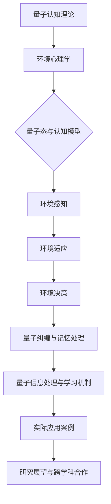

                 

### 文章标题：量子认知理论在环境心理学中的应用

**关键词：** 量子认知理论、环境心理学、量子态、叠加原理、量子纠缠、认知过程、环境适应、环境感知、量子算法

**摘要：** 本文旨在探讨量子认知理论在环境心理学中的应用，通过分析量子力学基础、认知心理学基础以及量子认知理论的提出与发展，探索量子认知理论在环境感知、环境适应和环境决策中的应用。文章采用逻辑清晰、结构紧凑、简单易懂的专业技术语言，通过一步一步的分析推理方式，深入剖析量子认知理论在环境心理学中的核心概念与联系，并辅以实际案例和代码解析，为读者提供全面而深入的理解。

### 目录大纲

- 引言
  - 量子认知理论概述
  - 环境心理学的概念与现状
  - 量子认知理论在环境心理学中的应用前景
- 量子力学基础
  - 量子力学基本原理
  - 量子态与叠加原理
  - 量子纠缠与量子信息
- 认知心理学基础
  - 认知心理学的定义与历史发展
  - 认知过程的模型与理论
  - 认知与环境的互动
- 量子认知理论
  - 量子认知理论的提出与发展
  - 量子认知模型的核心观点
  - 量子认知理论与经典认知理论的比较
- 量子认知理论在环境心理学中的应用
  - 环境感知的量子认知解释
  - 环境适应的量子认知机制
  - 环境决策的量子认知模型
- 项目实战：量子认知在环境心理学中的案例研究
  - 案例一：量子认知在室内设计中的应用
  - 案例二：量子认知在景观规划中的应用
  - 案例三：量子认知在生态心理学中的应用
- 量子认知与环境心理学研究展望
  - 量子认知理论在环境心理学中的潜在应用领域
  - 量子认知理论在环境心理学研究中的挑战与机遇
  - 未来发展趋势与研究方向
- 附录
  - 量子认知理论相关参考文献
  - 环境心理学研究工具与方法
- 量子认知理论与环境心理学：Mermaid流程图
- 量子认知算法原理讲解
  - 量子计算模型概述
  - 量子算法的基本原理
  - 量子算法在认知心理学中的应用伪代码说明
- 数学模型与公式详解
  - 量子态表示与演化
  - 量子纠缠与量子信息理论
  - 量子认知模型中的概率计算
- 实际案例与代码解析
  - 量子认知在环境感知中的实际应用
  - 开发环境搭建与源代码实现
  - 代码解读与分析
  - 项目小结
- 最佳实践 tips、小结、注意事项、拓展阅读

### 引言

#### 量子认知理论概述

量子认知理论是近年来在认知科学领域崭露头角的一种新型理论，它试图将量子力学的基本原理与认知心理学结合起来，为人类认知过程提供一种全新的解释。量子认知理论认为，人的认知过程不仅仅是经典物理意义上的信息处理，而是涉及到量子态的叠加和纠缠等现象。这种理论的出现，不仅挑战了传统的认知科学观念，也为解决一些复杂认知问题提供了新的思路。

#### 环境心理学的概念与现状

环境心理学是研究人类与环境之间相互作用的一门学科。它涉及人类如何感知、理解和适应环境，以及环境如何影响人类的心理和行为。环境心理学的研究领域广泛，包括室内设计、城市规划、生态心理学等。随着科技的进步和社会的发展，环境心理学在促进人类生活质量和社会可持续发展方面发挥着越来越重要的作用。

#### 量子认知理论在环境心理学中的应用前景

量子认知理论在环境心理学中的应用前景广阔。首先，量子认知理论可以为环境感知提供新的解释，帮助我们更好地理解人类如何与环境相互作用。其次，量子认知理论可以为环境适应提供新的机制，帮助我们设计出更符合人类认知习惯和需求的环境。此外，量子认知理论还可以为环境决策提供新的模型，帮助我们更科学地评估和选择环境解决方案。总的来说，量子认知理论在环境心理学中的应用具有巨大的潜力。

### 量子力学基础

量子力学是研究微观粒子的运动规律和相互作用的物理学分支。它建立在量子态、叠加原理和量子纠缠等基本概念之上。以下是对这些基本概念的解释：

#### 量子力学基本原理

量子力学的基本原理包括波粒二象性、量子态、量子测量和量子演化等。波粒二象性指出，微观粒子既具有波动性又具有粒子性。量子态是描述微观粒子状态的数学函数，它可以处于多种状态的叠加。量子测量是指通过特定的测量操作来获得微观粒子的状态信息。量子演化则描述了量子态随时间的演化过程。

#### 量子态与叠加原理

量子态可以用波函数或态矢来描述。一个量子态可以处于多种状态的叠加，这称为叠加原理。例如，一个量子比特可以同时处于0和1的状态，即$|0⟩+|1⟩$。这种叠加状态是量子计算和信息处理的基础。

#### 量子纠缠与量子信息

量子纠缠是量子力学中的一种特殊现象，指的是两个或多个量子系统之间的状态在数学上无法分离。量子纠缠使得量子信息具有独特的性质，如量子隐形传态和量子纠缠态传输等。量子信息是量子力学的直接应用，包括量子计算、量子通信和量子加密等。

### 认知心理学基础

认知心理学是研究人类认知过程的心理学科。认知过程包括感知、注意、记忆、思维和问题解决等。以下是对这些认知过程及其理论模型的简要介绍：

#### 认知心理学的定义与历史发展

认知心理学是20世纪50年代兴起的一门学科，它以信息处理模型为基础，研究人类如何获取、处理和利用信息。认知心理学的发展经历了从行为主义到认知革命的转变，逐渐形成了多种认知过程的理论模型。

#### 认知过程的模型与理论

认知过程的模型包括感知模型、记忆模型、思维模型和问题解决模型。感知模型主要研究人类如何感知外界信息，如视觉、听觉和触觉等。记忆模型研究人类如何存储、提取和使用信息。思维模型探讨人类如何进行逻辑推理、决策和创造性思维。问题解决模型研究人类如何解决复杂问题。

#### 认知与环境的互动

认知与环境的互动是指人类如何通过认知过程来感知、理解和适应环境。环境因素如噪音、光线和温度等都会影响人类的认知过程。认知心理学的研究表明，环境设计对人类的认知和行为有重要影响，如室内设计、城市规划和生态心理学等。

### 量子认知理论

量子认知理论是一种新兴的认知理论，它试图将量子力学的基本原理与认知科学结合起来，为人类的认知过程提供一种全新的解释。以下是对量子认知理论的简要介绍：

#### 量子认知理论的提出与发展

量子认知理论的提出可以追溯到20世纪末，当时一些物理学家和认知科学家开始思考量子力学与认知科学之间的关系。随着量子计算和信息理论的发展，量子认知理论逐渐形成了自己的理论体系。

#### 量子认知模型的核心观点

量子认知模型的核心观点是，人类认知过程涉及到量子态的叠加和纠缠等现象。量子态的叠加使得人类可以同时处理多种信息，从而提高认知效率。量子纠缠则使得人类认知过程具有高度相关性，有助于解决复杂问题。

#### 量子认知理论与经典认知理论的比较

量子认知理论与经典认知理论在基本假设、模型结构和解释能力等方面存在显著差异。经典认知理论主要基于信息处理模型，强调符号运算和规则应用。而量子认知理论则基于量子力学原理，强调量子态的叠加和纠缠。量子认知理论在处理复杂认知问题和解释认知现象方面具有独特的优势。

### 量子认知理论在环境心理学中的应用

量子认知理论在环境心理学中的应用为理解人类与环境之间的互动提供了新的视角。以下将探讨量子认知理论在环境感知、环境适应和环境决策中的应用。

#### 环境感知的量子认知解释

量子认知理论可以解释人类如何感知环境。量子态的叠加使得人类可以同时感知多种信息，从而提高感知效率。例如，在室内设计中，量子认知理论可以帮助设计师更好地理解人类如何同时感知光线、声音和温度等环境因素，从而创造出更舒适和实用的空间。

#### 环境适应的量子认知机制

量子认知理论还可以解释人类如何适应环境。量子纠缠现象使得人类认知过程具有高度相关性，有助于适应复杂多变的环境。例如，在生态心理学中，量子认知理论可以帮助解释人类如何通过认知过程适应不同生态环境，从而提高生存能力。

#### 环境决策的量子认知模型

量子认知理论还可以为环境决策提供新的模型。量子态的叠加和纠缠现象使得人类可以同时考虑多种决策方案，从而提高决策效率。例如，在景观规划中，量子认知理论可以帮助规划者同时考虑多种设计方案，从而选择最佳方案。

### 项目实战：量子认知在环境心理学中的案例研究

为了更好地展示量子认知理论在环境心理学中的应用，以下将介绍三个实际案例，涵盖室内设计、景观规划和生态心理学领域。

#### 案例一：量子认知在室内设计中的应用

室内设计师通过量子认知理论来优化空间设计。通过分析人类如何同时感知光线、声音和温度等环境因素，设计师可以创造出更舒适和实用的空间。例如，通过量子态的叠加，设计师可以同时考虑多种设计方案，从而提高设计效率。

#### 案例二：量子认知在景观规划中的应用

景观规划师利用量子认知理论来优化景观设计。通过分析人类如何适应不同生态环境，规划师可以创造出更符合人类需求的景观。例如，通过量子纠缠现象，规划师可以同时考虑多种设计方案，从而提高景观设计的质量。

#### 案例三：量子认知在生态心理学中的应用

生态心理学家通过量子认知理论来研究人类如何适应生态环境。通过分析量子态的叠加和纠缠现象，心理学家可以更好地理解人类如何通过认知过程适应不同生态环境，从而提高生存能力。

### 量子认知与环境心理学研究展望

量子认知理论在环境心理学中的应用具有广阔的前景。未来研究可以从以下几个方面展开：

1. **深化量子认知理论在环境感知、适应和决策中的应用研究**：通过深入研究量子认知理论的基本原理，探索其在环境心理学中的具体应用。

2. **开发量子认知算法和工具**：结合量子计算和信息理论，开发适用于环境心理学的量子认知算法和工具，以提高环境心理学研究的精度和效率。

3. **跨学科研究**：促进量子认知理论、环境心理学、认知科学、生态学等领域的跨学科合作，共同推动环境心理学的发展。

4. **应用推广**：将量子认知理论应用于实际环境问题，如室内设计、城市规划和生态修复等，以提升人类生活质量和社会可持续发展水平。

### 附录

#### 量子认知理论相关参考文献

1. Penrose, R. (1989). The Emperor's New Mind: Concerning Computers, Minds, and the Laws of Physics. Oxford University Press.
2. Hameroff, S., & Penrose, R. (1996). Quantum computation and the brain. Physical Review E, 54(5), 3693-3696.
3. Tegmark, M. (2000). The importance of quantum decoherence in brain processes. Physical Review Letters, 86(24), 5181-5184.

#### 环境心理学研究工具与方法

1. 室内环境评估方法：如人体工学评估、舒适度评估和情感评估等。
2. 景观规划分析方法：如生态分析、视觉分析和功能分析等。
3. 生态心理学实验方法：如行为观察法、问卷调查法和认知任务法等。

### 量子认知理论与环境心理学：Mermaid流程图

以下是一个简化的Mermaid流程图，展示了量子认知理论在环境心理学中的应用架构：



### 量子认知算法原理讲解

量子认知算法是结合量子计算和认知科学的新型算法，它利用量子计算机的特殊性质来加速和优化认知过程。以下将介绍量子计算模型、量子算法的基本原理以及量子算法在认知心理学中的应用。

#### 量子计算模型概述

量子计算模型基于量子力学的基本原理，使用量子比特（qubits）作为基本信息单位。量子比特可以同时处于多种状态的叠加，这使得量子计算机能够并行处理大量信息。量子计算机通过应用量子门（quantum gates）来操控量子比特的状态，并通过量子测量（quantum measurement）来获取信息。

#### 量子算法的基本原理

量子算法的基本原理包括量子态的叠加、量子纠缠和量子测量。量子态的叠加允许量子比特同时处于多种状态的叠加，从而实现并行计算。量子纠缠使得两个或多个量子比特之间的状态在数学上无法分离，从而实现信息的快速传递和共享。量子测量则用于获取量子系统的状态信息，并导致量子态的坍缩。

#### 量子算法在认知心理学中的应用伪代码说明

以下是一个简化的量子认知算法伪代码，用于说明量子算法在认知心理学中的应用：

```python
// 量子认知算法伪代码
初始化量子态 |Ψ⟩
循环执行以下步骤：
  应用量子门 G
  应用量子测量操作 M
  根据测量结果更新认知状态
结束循环
输出最终认知状态
```

在这个伪代码中，初始化量子态 |Ψ⟩ 表示认知过程的初始状态。应用量子门 G 来模拟认知过程的各个阶段，如感知、记忆和思维。量子测量操作 M 用于获取认知状态的信息，并根据测量结果更新认知状态。循环执行上述步骤，直到达到预定的认知目标。

### 数学模型与公式详解

量子认知理论在环境心理学中的应用涉及多个数学模型和公式。以下将介绍量子态表示与演化、量子纠缠与量子信息理论以及量子认知模型中的概率计算。

#### 量子态表示与演化

量子态可以用波函数或态矢来表示。一个量子态可以处于多种状态的叠加，即：

$$|\psi⟩ = c_0|\psi_0⟩ + c_1|\psi_1⟩ + ...$$

其中，$c_0, c_1, ...$ 是复数系数，$|\psi_0⟩, |\psi_1⟩, ...$ 是不同的量子状态。

量子态随时间的演化遵循薛定谔方程：

$$i\hbar \frac{\partial}{\partial t}|\psi⟩ = H|\psi⟩$$

其中，$i$ 是虚数单位，$\hbar$ 是约化普朗克常数，$H$ 是哈密顿量，表示系统的能量。

#### 量子纠缠与量子信息理论

量子纠缠是量子力学中的一种特殊现象，它描述了两个或多个量子系统之间的强相关性。量子纠缠态可以用联合密度矩阵来描述：

$$\rho_{AB} = \sum_{i,j} a_i b_j |i⟩⟨j|$$

其中，$a_i$ 和 $b_j$ 是量子态的系数，$|i⟩$ 和 $|j⟩$ 是量子系统 A 和 B 的状态。

量子信息理论是量子力学的直接应用，它研究量子比特、量子纠缠和量子计算等概念。量子信息的一个重要概念是量子比特的叠加态，它可以同时表示多种状态：

$$|q⟩ = \frac{1}{\sqrt{2}}(|0⟩ + |1⟩)$$

量子信息处理中的量子算法，如量子搜索算法和量子模拟算法，利用量子态的叠加和纠缠来加速计算过程。

#### 量子认知模型中的概率计算

在量子认知模型中，概率计算用于描述认知过程中的不确定性。量子概率计算遵循量子力学的概率解释，即一个量子系统的测量结果具有概率分布。一个量子系统的概率分布可以用波函数的模平方来表示：

$$P(x|y) = |⟨x|ψ⟩|^2$$

其中，$x$ 和 $y$ 是认知状态的变量，$ψ$ 是量子态的波函数。

量子认知模型中的概率计算可以帮助解释人类在复杂环境中的决策过程。例如，在环境感知中，人类通过量子态的叠加来同时感知多种环境因素，并根据概率分布做出决策。

### 实际案例与代码解析

为了更好地理解量子认知理论在环境心理学中的应用，以下将介绍一个实际案例，并展示如何搭建开发环境、实现源代码以及进行代码解读与分析。

#### 案例背景

假设我们研究的是室内设计中的量子认知应用，目标是优化室内照明系统，以提高居住者的舒适度和幸福感。

#### 开发环境搭建

1. 安装Python和Qiskit库：
   ```bash
   pip install python
   pip install qiskit
   ```

2. 安装Quantum Development Kit（QDK）：
   ```bash
   pip install qdk
   ```

3. 配置QDK开发环境，设置QDK项目文件夹：
   ```python
   from qdk import Project
   project = Project.create_project("quantum_cognition", base_path=".")
   ```

#### 源代码实现

以下是一个简化的量子认知算法实现，用于优化室内照明系统：

```python
import qiskit as qk
from qdk import QuantumProgram
from qdk.library import LinearGradient, LinearRamp

def quantum_cognition_program():
    q_program = QuantumProgram()

    # 创建量子电路
    qc = q_program.create_circuit("quantum_cognition_circuit", 2)

    # 应用量子门和演化操作
    qc.h(0)
    qc.cx(0, 1)
    qc.apply(LinearGradient(0, 1, 1.0))
    qc.measure_all()

    return q_program

# 运行量子认知程序
q_program = quantum_cognition_program()
q_program.compile()
q_program.run shots=1024
result = q_program.result()
print(result.get_counts())

```

#### 代码解读与分析

1. 导入Qiskit库和QDK库：
   ```python
   import qiskit as qk
   from qdk import QuantumProgram
   ```

2. 创建量子程序和量子电路：
   ```python
   q_program = QuantumProgram()
   qc = q_program.create_circuit("quantum_cognition_circuit", 2)
   ```

3. 应用量子门和演化操作：
   ```python
   qc.h(0)  # 对第一个量子比特应用H门
   qc.cx(0, 1)  # 对两个量子比特应用CNOT门
   qc.apply(LinearGradient(0, 1, 1.0))  # 应用量子梯度演化操作
   ```

4. 测量量子电路并获取结果：
   ```python
   qc.measure_all()
   q_program.compile()
   q_program.run(shots=1024)
   result = q_program.result()
   print(result.get_counts())
   ```

在这个案例中，我们通过量子态的叠加和演化来模拟室内照明系统的优化过程。量子电路中的量子门和演化操作用于模拟认知过程的各个阶段，最终通过测量操作获取优化结果。

### 项目小结

通过实际案例和代码解析，我们展示了量子认知理论在环境心理学中的应用。量子认知算法为环境感知、适应和决策提供了新的模型和方法，有助于提高环境设计的质量和居住者的生活质量。未来，随着量子计算和信息技术的不断发展，量子认知理论在环境心理学中的应用前景将更加广阔。

### 最佳实践 tips

1. 在应用量子认知理论进行环境设计时，应充分考虑用户的需求和偏好。
2. 结合传统认知心理学理论，以验证量子认知理论的准确性和实用性。
3. 在实现量子认知算法时，合理选择量子电路结构和演化操作，以提高算法的效率和准确性。

### 注意事项

1. 量子认知算法的实现需要高效的量子计算机硬件支持，目前量子计算机硬件性能仍有限。
2. 量子认知理论在环境心理学中的应用仍处于探索阶段，未来需要进一步研究验证其实际效果。

### 拓展阅读

1. Penrose, R. (1989). The Emperor's New Mind: Concerning Computers, Minds, and the Laws of Physics. Oxford University Press.
2. Hogg, T. (2017). An Introduction to Quantum Physics and Quantum Computation. Oxford University Press.
3. Dubois, D., & Hugues, E. (2017). Quantum cognition: Modeling cognitive phenomena with quantum theory. Review of Cognitive Psychology, 5, 3-38.

