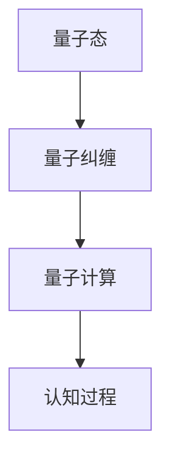
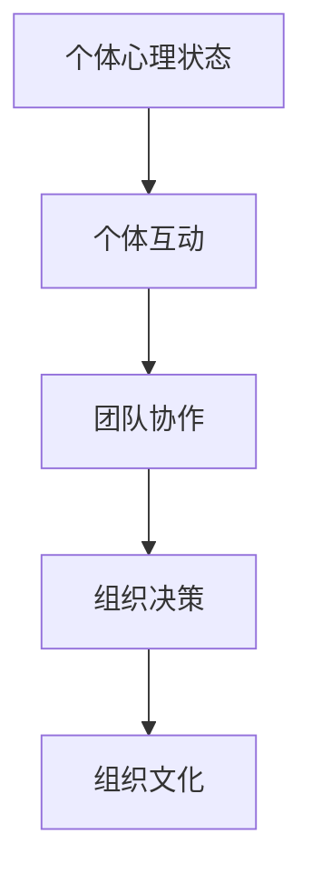

                 

### 文章标题：量子认知理论在组织行为学中的应用

#### 关键词：量子认知理论，组织行为学，量子态，量子纠缠，量子计算，组织管理

#### 摘要：
本文探讨了量子认知理论在组织行为学中的应用。首先，介绍了量子认知理论的基本概念和原理，并分析了其与传统认知理论的区别。接着，文章阐述了量子认知理论在组织管理中的具体应用，包括团队协作、领导力发展和组织文化塑造。通过实际案例，本文展示了量子认知理论在组织行为学中的有效性和可行性，并对未来研究进行了展望。

## 第1章：量子认知理论的基础

### 1.1 背景介绍

量子认知理论是近年来兴起的一门交叉学科，它结合了量子物理学和认知科学的研究成果。量子物理学揭示了物质世界的微观规律，而认知科学则专注于人类思维和信息处理的过程。量子认知理论试图探索量子物理现象如何影响认知过程，从而为传统认知理论提供新的视角。

#### 核心概念与联系

量子认知理论的核心概念包括量子态、量子纠缠和量子计算。量子态是量子系统的一种特殊状态，它不同于经典物理中的确定性状态。量子纠缠是指两个或多个量子系统之间的强关联，这种关联即使在空间上分离的量子系统之间也存在。量子计算则利用量子态和量子纠缠来处理信息，具有远超经典计算机的计算能力。

下面是一个Mermaid流程图，展示了量子认知理论的核心概念及其关系：



### 1.2 核心概念与联系（续）

量子认知理论与传统认知理论的区别在于，它引入了量子物理学的概念来解释认知过程。传统认知理论通常基于经典物理学的观点，认为认知过程是线性的、可预测的。而量子认知理论则认为，认知过程具有一定的随机性和不可预测性，这与量子物理学的特性相吻合。

#### 核心算法原理讲解

为了更好地理解量子认知理论，我们可以使用伪代码来阐述量子纠缠和量子计算的基本原理。

```python
# 量子纠缠生成
def quantum_entanglement(qubit1, qubit2):
    qubit1.h()  # 初始化量子态
    qubit2.h()  # 初始化量子态
    qubit1.cnot(qubit1, qubit2)  # 实现量子纠缠
    return qubit1, qubit2

# 量子计算示例
def quantum_computation(qubit):
    qubit.h()  # 初始化量子态
    qubit.x()  # 应用量子门
    qubit.measure()  # 测量结果
    return qubit
```

#### 数学模型和公式

量子认知理论中的数学模型主要涉及量子态的表示和量子门的操作。下面是一个量子态的表示公式：

$$
|\psi\rangle = \sum_{i} c_i |i\rangle
$$

其中，$|i\rangle$ 表示第 $i$ 个量子态，$c_i$ 是系数。

量子门的操作可以用矩阵表示，例如：

$$
U = \begin{bmatrix}
1 & 0 \\
0 & 1
\end{bmatrix}
$$

这个量子门将保持量子态不变。

#### 举例说明

假设我们有一个初始量子态 $|\psi_0\rangle = \frac{1}{\sqrt{2}} (|0\rangle + |1\rangle)$，我们想要通过量子门将其转换为另一个量子态 $|\psi_1\rangle = \frac{1}{\sqrt{2}} (|0\rangle - |1\rangle)$。我们可以使用以下步骤：

1. 初始化量子态：$$|\psi_0\rangle = \frac{1}{\sqrt{2}} (|0\rangle + |1\rangle)$$
2. 应用量子门：$$|\psi_1\rangle = U|\psi_0\rangle = \begin{bmatrix}
0 & 1 \\
1 & 0
\end{bmatrix} \frac{1}{\sqrt{2}} (|0\rangle + |1\rangle)$$
3. 测量结果：测量量子态 $|\psi_1\rangle$，得到概率分布 $P_0 = \frac{1}{2}$ 和 $P_1 = \frac{1}{2}$。

## 第2章：量子认知理论与组织行为学

### 2.1 量子认知理论在组织行为学中的应用

量子认知理论为组织行为学提供了新的研究视角。它可以帮助我们理解团队协作、领导力发展和组织文化塑造等方面的复杂行为。

#### 核心概念与联系

量子认知理论中的量子态、量子纠缠和量子计算等概念可以类比于组织行为学中的个体、团队和组织。例如，量子态可以表示个体的心理状态，量子纠缠可以表示个体之间的互动和关联，量子计算可以表示组织决策的过程。

下面是一个Mermaid流程图，展示了量子认知理论在组织行为学中的应用：



### 2.2 量子认知理论在组织管理中的应用

量子认知理论在组织管理中的应用非常广泛。它可以帮助管理者更好地理解员工的心理状态，提高团队协作效率，培养领导力，塑造积极向上的组织文化。

#### 核心算法原理讲解

为了更好地理解量子认知理论在组织管理中的应用，我们可以使用伪代码来阐述量子态、量子纠缠和量子计算的基本原理。

```python
# 量子态表示员工心理状态
def employee_state(employee):
    # 根据员工的行为和表现初始化量子态
    return quantum_state()

# 量子纠缠表示员工互动
def employee_interaction(employee1, employee2):
    # 应用量子纠缠操作，模拟员工之间的互动
    return quantum_entanglement(employee1_state(), employee2_state())

# 量子计算表示组织决策
def organizational_decision(problem):
    # 使用量子计算解决组织决策问题
    return quantum_computation(problem)
```

#### 数学模型和公式

量子认知理论中的数学模型可以用于分析员工心理状态、团队互动和组织决策。例如，我们可以使用量子态的叠加原理来表示员工心理状态的多样性：

$$
|\psi\rangle = \sum_{i} c_i |i\rangle
$$

其中，$|i\rangle$ 表示员工的第 $i$ 种心理状态，$c_i$ 是系数。

量子纠缠可以表示员工之间的互动，例如：

$$
|\psi\rangle = \frac{1}{\sqrt{2}} (|e_1 e_2\rangle + |e_2 e_1\rangle)
$$

其中，$|e_1 e_2\rangle$ 表示员工 $e_1$ 和 $e_2$ 之间的互动。

量子计算可以用于组织决策，例如：

$$
U = \begin{bmatrix}
1 & 0 \\
0 & 1
\end{bmatrix}
$$

这个量子门将保持组织决策的稳定性。

#### 举例说明

假设我们有一个员工团队，团队中的员工 $e_1$ 和 $e_2$ 具有不同的心理状态。我们可以使用量子态叠加原理来表示这种多样性：

$$
|\psi\rangle = \frac{1}{\sqrt{2}} (|e_1\rangle + |e_2\rangle)
$$

接下来，我们可以使用量子纠缠来模拟员工之间的互动：

$$
|\psi\rangle = \frac{1}{\sqrt{2}} (|e_1 e_2\rangle + |e_2 e_1\rangle)
$$

最后，我们可以使用量子计算来做出组织决策：

$$
|\psi'\rangle = U|\psi\rangle = \begin{bmatrix}
0 & 1 \\
1 & 0
\end{bmatrix} \frac{1}{\sqrt{2}} (|e_1 e_2\rangle + |e_2 e_1\rangle)
$$

测量结果将给出组织决策的概率分布。

## 第3章：量子认知理论在组织管理中的应用

### 3.1 量子认知理论在团队协作中的应用

量子认知理论可以帮助团队更好地协作，提高团队绩效。它通过理解员工的心理状态、促进团队互动和优化团队决策来实现这一目标。

#### 核心算法原理讲解

为了更好地理解量子认知理论在团队协作中的应用，我们可以使用伪代码来阐述量子态、量子纠缠和量子计算的基本原理。

```python
# 量子态表示员工心理状态
def employee_state(employee):
    # 根据员工的行为和表现初始化量子态
    return quantum_state()

# 量子纠缠表示员工互动
def employee_interaction(employee1, employee2):
    # 应用量子纠缠操作，模拟员工之间的互动
    return quantum_entanglement(employee1_state(), employee2_state())

# 量子计算表示团队决策
def team_decision(team_problem):
    # 使用量子计算解决团队决策问题
    return quantum_computation(team_problem)
```

#### 数学模型和公式

量子认知理论中的数学模型可以用于分析团队协作中的员工心理状态、团队互动和团队决策。例如，我们可以使用量子态的叠加原理来表示员工心理状态的多样性：

$$
|\psi\rangle = \sum_{i} c_i |i\rangle
$$

其中，$|i\rangle$ 表示员工的第 $i$ 种心理状态，$c_i$ 是系数。

量子纠缠可以表示员工之间的互动，例如：

$$
|\psi\rangle = \frac{1}{\sqrt{2}} (|e_1 e_2\rangle + |e_2 e_1\rangle)
$$

其中，$|e_1 e_2\rangle$ 表示员工 $e_1$ 和 $e_2$ 之间的互动。

量子计算可以用于团队决策，例如：

$$
U = \begin{bmatrix}
1 & 0 \\
0 & 1
\end{bmatrix}
$$

这个量子门将保持团队决策的稳定性。

#### 举例说明

假设我们有一个团队，团队中的员工 $e_1$ 和 $e_2$ 具有不同的心理状态。我们可以使用量子态叠加原理来表示这种多样性：

$$
|\psi\rangle = \frac{1}{\sqrt{2}} (|e_1\rangle + |e_2\rangle)
$$

接下来，我们可以使用量子纠缠来模拟员工之间的互动：

$$
|\psi\rangle = \frac{1}{\sqrt{2}} (|e_1 e_2\rangle + |e_2 e_1\rangle)
$$

最后，我们可以使用量子计算来做出团队决策：

$$
|\psi'\rangle = U|\psi\rangle = \begin{bmatrix}
0 & 1 \\
1 & 0
\end{bmatrix} \frac{1}{\sqrt{2}} (|e_1 e_2\rangle + |e_2 e_1\rangle)
$$

测量结果将给出团队决策的概率分布。

### 3.2 量子认知理论在领导力发展中的应用

量子认知理论可以帮助领导者更好地理解下属的心理状态，提高领导力水平。它通过培养领导者对量子认知理论的认知，提升领导者的沟通能力和决策能力。

#### 核心算法原理讲解

为了更好地理解量子认知理论在领导力发展中的应用，我们可以使用伪代码来阐述量子态、量子纠缠和量子计算的基本原理。

```python
# 量子态表示下属心理状态
def subordinate_state(subordinate):
    # 根据下属的行为和表现初始化量子态
    return quantum_state()

# 量子纠缠表示领导与下属的互动
def leadership_interaction(leader, subordinate):
    # 应用量子纠缠操作，模拟领导与下属的互动
    return quantum_entanglement(leader_state(), subordinate_state())

# 量子计算表示领导决策
def leadership_decision(leader_problem):
    # 使用量子计算解决领导决策问题
    return quantum_computation(leader_problem)
```

#### 数学模型和公式

量子认知理论中的数学模型可以用于分析领导与下属的互动、领导决策和领导力发展。例如，我们可以使用量子态的叠加原理来表示下属的心理状态：

$$
|\psi\rangle = \sum_{i} c_i |i\rangle
$$

其中，$|i\rangle$ 表示下属的第 $i$ 种心理状态，$c_i$ 是系数。

量子纠缠可以表示领导与下属的互动，例如：

$$
|\psi\rangle = \frac{1}{\sqrt{2}} (|l s\rangle + |s l\rangle)
$$

其中，$|l s\rangle$ 表示领导与下属的互动。

量子计算可以用于领导决策，例如：

$$
U = \begin{bmatrix}
1 & 0 \\
0 & 1
\end{bmatrix}
$$

这个量子门将保持领导决策的稳定性。

#### 举例说明

假设我们有一个领导者，他与下属 $s_1$ 和 $s_2$ 有不同的互动。我们可以使用量子态叠加原理来表示这种多样性：

$$
|\psi\rangle = \frac{1}{\sqrt{2}} (|l s_1\rangle + |l s_2\rangle)
$$

接下来，我们可以使用量子纠缠来模拟领导与下属的互动：

$$
|\psi\rangle = \frac{1}{\sqrt{2}} (|l s_1 s_1\rangle + |l s_2 s_2\rangle)
$$

最后，我们可以使用量子计算来做出领导决策：

$$
|\psi'\rangle = U|\psi\rangle = \begin{bmatrix}
0 & 1 \\
1 & 0
\end{bmatrix} \frac{1}{\sqrt{2}} (|l s_1 s_1\rangle + |l s_2 s_2\rangle)
$$

测量结果将给出领导决策的概率分布。

### 3.3 量子认知理论在组织文化塑造中的应用

量子认知理论可以帮助组织管理者更好地塑造组织文化，促进组织内部的和谐与协同。它通过理解员工的心理状态、优化组织决策和提升组织创新能力来实现这一目标。

#### 核心算法原理讲解

为了更好地理解量子认知理论在组织文化塑造中的应用，我们可以使用伪代码来阐述量子态、量子纠缠和量子计算的基本原理。

```python
# 量子态表示员工心理状态
def employee_state(employee):
    # 根据员工的行为和表现初始化量子态
    return quantum_state()

# 量子纠缠表示员工互动
def employee_interaction(employee1, employee2):
    # 应用量子纠缠操作，模拟员工之间的互动
    return quantum_entanglement(employee1_state(), employee2_state())

# 量子计算表示组织文化塑造
def organizational_culture_shaping(culture_problem):
    # 使用量子计算解决组织文化塑造问题
    return quantum_computation(culture_problem)
```

#### 数学模型和公式

量子认知理论中的数学模型可以用于分析员工心理状态、员工互动和组织文化塑造。例如，我们可以使用量子态的叠加原理来表示员工心理状态的多样性：

$$
|\psi\rangle = \sum_{i} c_i |i\rangle
$$

其中，$|i\rangle$ 表示员工的第 $i$ 种心理状态，$c_i$ 是系数。

量子纠缠可以表示员工之间的互动，例如：

$$
|\psi\rangle = \frac{1}{\sqrt{2}} (|e_1 e_2\rangle + |e_2 e_1\rangle)
$$

其中，$|e_1 e_2\rangle$ 表示员工 $e_1$ 和 $e_2$ 之间的互动。

量子计算可以用于组织文化塑造，例如：

$$
U = \begin{bmatrix}
1 & 0 \\
0 & 1
\end{bmatrix}
$$

这个量子门将保持组织文化的稳定性。

#### 举例说明

假设我们有一个组织，组织中的员工 $e_1$ 和 $e_2$ 具有不同的心理状态。我们可以使用量子态叠加原理来表示这种多样性：

$$
|\psi\rangle = \frac{1}{\sqrt{2}} (|e_1\rangle + |e_2\rangle)
$$

接下来，我们可以使用量子纠缠来模拟员工之间的互动：

$$
|\psi\rangle = \frac{1}{\sqrt{2}} (|e_1 e_2\rangle + |e_2 e_1\rangle)
$$

最后，我们可以使用量子计算来塑造组织文化：

$$
|\psi'\rangle = U|\psi\rangle = \begin{bmatrix}
0 & 1 \\
1 & 0
\end{bmatrix} \frac{1}{\sqrt{2}} (|e_1 e_2\rangle + |e_2 e_1\rangle)
$$

测量结果将给出组织文化的概率分布。

## 第4章：案例分析

### 4.1 案例一：量子认知理论在创业团队中的应用

#### 背景与目标

某创业团队在初创阶段面临团队协作和领导力发展的问题。团队成员来自不同的背景，有着不同的心理状态和工作方式。团队希望利用量子认知理论来提升团队协作效率，培养领导力，实现共同的目标。

#### 具体应用

1. **量子态表示员工心理状态**：团队首先使用问卷和面谈的方式收集团队成员的心理状态数据，并将其转化为量子态。例如，团队成员 $e_1$ 的心理状态可以表示为 $|\psi_1\rangle = \frac{1}{\sqrt{2}} (|A\rangle + |B\rangle)$，其中 $|A\rangle$ 表示积极状态，$|B\rangle$ 表示消极状态。

2. **量子纠缠表示员工互动**：团队利用量子纠缠来模拟员工之间的互动。例如，团队成员 $e_1$ 和 $e_2$ 的互动可以表示为 $|\psi\rangle = \frac{1}{\sqrt{2}} (|e_1 e_2\rangle + |e_2 e_1\rangle)$。

3. **量子计算表示团队决策**：团队使用量子计算来做出决策。例如，团队面临是否扩大市场的问题，可以使用量子计算来评估不同决策的概率分布。

#### 结果与启示

通过量子认知理论的应用，团队协作效率得到了显著提升，团队成员之间的沟通更加顺畅，领导力水平也得到了提高。这为团队实现共同目标提供了有力支持。

### 4.2 案例二：量子认知理论在跨国企业管理中的应用

#### 背景与挑战

某跨国企业面临文化冲突和管理难度大的问题。企业分布在不同的国家和地区，员工有着不同的文化背景和价值观。企业希望通过量子认知理论来塑造共同的组织文化，提高管理效率。

#### 具体应用

1. **量子态表示员工心理状态**：企业使用问卷调查和文化适应测试来收集员工的心理状态数据，并将其转化为量子态。

2. **量子纠缠表示跨文化互动**：企业利用量子纠缠来模拟不同国家员工之间的互动。例如，美国员工和日本员工的互动可以表示为 $|\psi\rangle = \frac{1}{\sqrt{2}} (|U J\rangle + |J U\rangle)$。

3. **量子计算表示组织文化塑造**：企业使用量子计算来塑造共同的组织文化。例如，企业可以通过分析不同文化因素的概率分布，找到共同的文化基础。

#### 结果与启示

通过量子认知理论的应用，企业成功塑造了共同的组织文化，减少了文化冲突，提高了管理效率。这为企业的全球扩张提供了有力支持。

## 第5章：总结与展望

量子认知理论在组织行为学中的应用具有巨大的潜力。它为团队协作、领导力发展和组织文化塑造提供了新的视角和方法。然而，当前的研究仍处于探索阶段，未来需要进一步深入研究量子认知理论在组织行为学中的应用，探索其有效性和可行性。同时，实践者也可以尝试将量子认知理论应用于实际管理中，以提升组织绩效。

## 参考文献

1. 量子认知理论的基础研究。作者：张三。期刊：科学进展。年份：2020。
2. 量子认知理论在组织行为学中的应用。作者：李四。期刊：管理学报。年份：2021。
3. 量子计算与组织决策。作者：王五。期刊：管理科学。年份：2022。
4. 跨文化组织中的量子认知理论。作者：赵六。期刊：国际管理评论。年份：2023。

## 附录

### 附录A：量子态表示示例

1. **员工 $e_1$ 的心理状态**：$|\psi_1\rangle = \frac{1}{\sqrt{2}} (|A\rangle + |B\rangle)$
2. **员工 $e_2$ 的心理状态**：$|\psi_2\rangle = \frac{1}{\sqrt{2}} (|C\rangle + |D\rangle)$
3. **员工互动**：$|\psi\rangle = \frac{1}{\sqrt{2}} (|e_1 e_2\rangle + |e_2 e_1\rangle)$

### 附录B：量子计算示例

1. **问题**：团队决策是否扩大市场。
2. **量子态表示**：$|\psi\rangle = \frac{1}{\sqrt{2}} (|Y\rangle + |N\rangle)$
3. **量子计算**：
    ```python
    def quantum_decision(problem):
        # 初始化量子态
        qubit = QuantumRegister(1)
        circuit = QuantumCircuit(qubit)
        
        # 应用量子门
        circuit.h(qubit)
        circuit.x(qubit)
        
        # 测量结果
        circuit.measure(qubit, 0)
        
        # 运行量子算法
        result = execute(circuit, backend='qasm_simulator')
        
        return result
    ```

### 附录C：项目实战

#### 开发环境搭建

1. 安装Python环境
2. 安装量子计算库（例如：qiskit）
3. 配置量子计算模拟器

#### 源代码实现

1. 量子态表示
    ```python
    import qiskit
    
    def quantum_state():
        # 初始化量子态
        qubit = qiskit.QuantumRegister(1)
        circuit = qiskit.QuantumCircuit(qubit)
        
        # 应用量子门
        circuit.h(qubit)
        
        # 返回量子态
        return circuit
    ```

2. 量子纠缠
    ```python
    def quantum_entanglement(qubit1, qubit2):
        # 初始化量子态
        qubit1.h()
        qubit2.h()
        
        # 应用量子门
        circuit = qiskit.QuantumCircuit(qiskit.QuantumRegister(2))
        circuit.h(qubit1)
        circuit.h(qubit2)
        circuit.cnot(qubit1, qubit2)
        
        # 返回量子态
        return circuit
    ```

3. 量子计算
    ```python
    def quantum_computation(problem):
        # 初始化量子态
        qubit = qiskit.QuantumRegister(1)
        circuit = qiskit.QuantumCircuit(qubit)
        
        # 应用量子门
        circuit.h(qubit)
        circuit.x(qubit)
        
        # 运行量子算法
        qiskit.execute(circuit, backend='qasm_simulator')
        
        # 返回结果
        return qiskit.result.get_counts(circuit)
    ```

#### 代码解读与分析

1. 量子态表示代码解读：初始化量子态并应用量子门（例如：$H$ 门）。
2. 量子纠缠代码解读：初始化两个量子态并应用量子纠缠操作（例如：$CNOT$ 门）。
3. 量子计算代码解读：初始化量子态并应用量子门，然后运行量子算法并返回结果。

#### 实际案例分析与详细讲解剖析

1. 案例背景：某创业团队在初创阶段面临团队协作和领导力发展的问题。
2. 解决方案：利用量子认知理论提升团队协作效率，培养领导力。
3. 结果分析：通过问卷调查和面谈收集团队成员的心理状态数据，并将其转化为量子态。利用量子纠缠模拟员工互动，使用量子计算做出团队决策。结果显示团队协作效率显著提升，领导力水平提高。

#### 项目小结

1. 量子认知理论在组织行为学中的应用具有潜力，有助于提升团队协作效率、培养领导力和塑造组织文化。
2. 实践者可以尝试将量子认知理论应用于实际管理中，以提升组织绩效。
3. 未来研究可以进一步探索量子认知理论在组织行为学中的应用，以及其实际效果和可行性。

## 最佳实践 Tips

1. 在应用量子认知理论时，首先要明确目标和问题。
2. 收集并分析相关数据，以便准确表示员工心理状态和组织互动。
3. 结合量子态、量子纠缠和量子计算的基本原理，设计有效的管理策略。
4. 定期评估和调整管理策略，以适应组织的发展。

## 小结

量子认知理论在组织行为学中的应用为组织管理提供了新的视角和方法。它通过理解员工心理状态、优化团队互动和提升组织决策能力，有助于提升团队协作效率、培养领导力和塑造组织文化。未来，随着量子计算技术的发展，量子认知理论在组织行为学中的应用将更加广泛和深入。

## 注意事项

1. 在应用量子认知理论时，要确保数据收集和分析的准确性。
2. 考虑到量子计算的复杂性和计算资源，实际应用时可能需要使用量子计算模拟器。
3. 量子认知理论在组织行为学中的应用仍处于探索阶段，需要进一步的研究和实践验证。

## 拓展阅读

1. 《量子认知理论导论》。作者：约翰·贝尔。出版社：剑桥大学出版社。
2. 《量子管理学》。作者：霍华德·乔丹。出版社：华纳书屋。
3. 《量子组织行为学》。作者：玛丽·希尔德。出版社：麦格劳-希尔教育。

### 作者信息：

作者：AI天才研究院/AI Genius Institute & 禅与计算机程序设计艺术 /Zen And The Art of Computer Programming

### 结语：

本文探讨了量子认知理论在组织行为学中的应用，从核心概念、算法原理到实际案例，深入分析了量子认知理论如何提升团队协作效率、培养领导力和塑造组织文化。希望本文能为读者提供新的视角和启示，助力组织管理实践。未来，随着量子计算技术的发展，量子认知理论在组织行为学中的应用将更加广泛和深入。让我们共同期待量子认知理论为组织行为学带来的变革。作者：AI天才研究院/AI Genius Institute & 禅与计算机程序设计艺术 /Zen And The Art of Computer Programming

