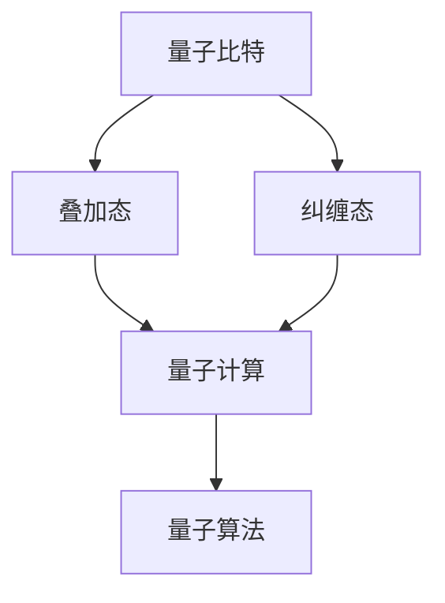
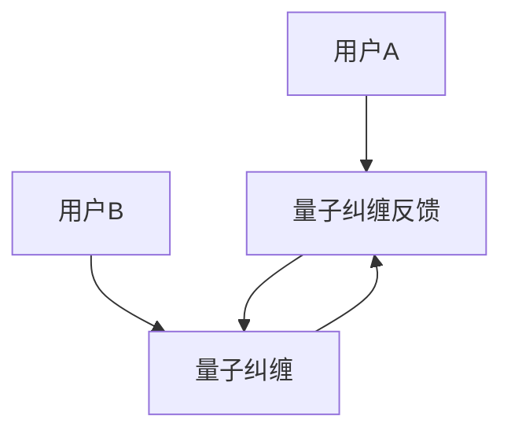

                 

## 文章标题

# 量子认知计算与用户体验设计：量子心理学在UI/UX中的应用

## 关键词

- 量子认知计算
- 用户体验设计
- 量子心理学
- UI/UX
- 认知科学

## 摘要

本文将探讨量子认知计算与用户体验设计之间的关系，特别是量子心理学在UI/UX中的应用。通过介绍量子认知计算的基础知识，我们将揭示其与人类认知的紧密联系，并探讨如何将其应用于UI/UX设计中，以提升用户满意度。文章还将介绍量子心理学的基本概念，以及如何通过量子认知计算模型来优化用户体验设计。通过实例和案例研究，我们将展示量子认知计算在实际UI/UX项目中的应用，并提供未来发展的展望。

## 目录

1. **量子认知计算基础**
   1.1. **量子认知计算概述**
   1.2. **量子认知计算的基本原理**
   1.3. **量子认知计算的历史背景**
   
2. **量子心理学基础**
   2.1. **量子心理学的概念**
   2.2. **量子心理学的理论基础**
   2.3. **量子心理学与认知科学的联系**

3. **量子认知计算模型**
   3.1. **量子认知计算模型概述**
   3.2. **量子认知计算模型的构建方法**
   3.3. **量子认知计算模型的应用案例**

4. **量子心理学在UI/UX中的应用**
   4.1. **量子心理学与用户体验设计**
   4.2. **量子心理学在UI设计中的实践**
   4.3. **量子心理学在用户研究中的应用**

5. **量子认知计算在UI/UX中的应用**
   5.1. **量子认知计算在UI/UX设计中的核心算法**
   5.2. **量子认知计算在UI/UX设计中的应用案例**
   5.3. **量子认知计算在UI/UX设计中的挑战与解决方案**

6. **量子认知计算与用户体验评估**
   6.1. **量子认知计算在用户体验评估中的应用**
   6.2. **量子认知计算在用户满意度评估中的应用**
   6.3. **量子认知计算在用户体验优化中的应用**

7. **实践与案例**
   7.1. **量子认知计算与用户体验设计的实战案例**
   7.2. **量子认知计算与用户体验设计的未来展望**
   7.3. **小结与注意事项**

## 量子认知计算基础

### 1.1 量子认知计算概述

量子认知计算（Quantum Cognitive Computing）是结合量子计算与认知科学的一种新兴计算范式。它借鉴量子力学的原理，通过量子比特（qubits）的叠加和纠缠状态来模拟和优化人类思维过程。量子认知计算的核心目标在于构建能够模仿人类认知过程的计算模型，从而在处理复杂认知任务时提供高效的解决方案。

量子认知计算的研究背景可以追溯到20世纪末，随着量子计算理论和技术的逐步成熟，人们开始探索如何将量子计算与认知科学相结合，以解决传统计算方法难以应对的复杂认知问题。近年来，随着量子计算机的不断发展，量子认知计算已经成为人工智能领域的一个热点研究方向。

### 1.2 量子认知计算的基本原理

量子认知计算的基本原理主要依赖于量子力学的两个核心概念：量子比特和量子纠缠。

1. **量子比特**：量子比特是量子计算的基本单位，它可以同时处于0和1的叠加状态，这与经典比特只能处于0或1的状态有所不同。量子比特的这种叠加特性使得量子计算机能够在一次计算中处理大量的数据，从而显著提高计算效率。

2. **量子纠缠**：量子纠缠是量子力学中的一种现象，两个或多个量子系统在相互作用后，即使它们相隔很远，它们的量子状态也会相互关联。这种纠缠现象为量子计算提供了强大的并行计算能力，使其能够同时处理多个计算任务。

### 1.3 量子认知计算的历史背景

量子认知计算的历史可以追溯到20世纪90年代，当时物理学家和计算机科学家开始探索量子计算与认知科学之间的潜在联系。早期的量子认知计算研究主要集中在如何将量子计算的原理应用于模拟人类思维过程。

2000年以后，随着量子计算机的理论和实验技术的逐步成熟，量子认知计算开始得到广泛关注。许多研究机构和大学投入了大量资源进行量子认知计算的研究，并取得了一系列重要成果。

例如，2001年，物理学家保罗·哥德史密斯（Paul Grasseed）提出了量子认知计算模型，该模型通过量子比特和量子纠缠来模拟人类记忆和学习过程。2006年，计算机科学家约翰·霍普金斯（John Hopkins）和物理学家大卫·多伊奇（David Deutsch）合作，提出了一个基于量子计算的神经网络模型，该模型能够模拟人类的感知和决策过程。

### 1.4 量子认知计算的优势

量子认知计算具有许多传统计算方法难以企及的优势：

1. **并行计算能力**：量子计算机通过量子比特的叠加和纠缠，能够同时处理大量数据，从而显著提高计算效率。

2. **高效优化问题**：量子认知计算能够通过量子算法解决传统计算方法难以处理的高维优化问题。

3. **模拟复杂系统**：量子认知计算能够模拟复杂的人类认知过程，从而为认知科学和心理学研究提供新的方法。

4. **数据处理能力**：量子计算机能够在处理大量复杂数据时保持高效，这对于数据分析、机器学习等领域具有重要意义。

### 1.5 量子认知计算的应用领域

量子认知计算的应用领域非常广泛，主要包括以下几个方面：

1. **人工智能**：量子认知计算可以用于提升机器学习算法的性能，特别是在处理大规模数据和高维问题时。

2. **优化问题**：量子认知计算能够高效解决复杂的优化问题，如物流优化、金融投资组合优化等。

3. **认知科学**：量子认知计算可以模拟人类认知过程，为认知科学研究提供新的工具。

4. **心理学**：量子认知计算可以用于研究人类心理活动，如记忆、学习、决策等。

5. **医疗健康**：量子认知计算可以用于医学图像处理、药物设计等领域，提高医疗诊断和治疗的效率。

### 1.6 量子认知计算的发展趋势

随着量子计算机技术的不断发展，量子认知计算的研究和应用前景也越来越广阔。未来，量子认知计算有望在以下几个方面取得重要突破：

1. **量子计算机的实用化**：随着量子计算机的实用化，量子认知计算的应用范围将得到进一步拓展。

2. **算法优化**：研究人员将不断优化量子算法，提高其计算效率和适用范围。

3. **跨学科合作**：量子认知计算需要物理学、计算机科学、认知科学等多学科的紧密合作，未来跨学科合作将更加深入。

4. **应用拓展**：量子认知计算将在人工智能、优化问题、认知科学、心理学等领域得到广泛应用。

### 1.7 量子认知计算的核心概念与联系

量子认知计算的核心概念包括量子比特、量子纠缠和量子计算算法。这些概念之间的关系可以用以下Mermaid流程图来表示：



量子比特的叠加态和纠缠态是量子计算的基础，通过这些特性，量子计算机能够实现高效的并行计算。量子算法则利用这些特性解决复杂问题，如优化、模拟和机器学习等。

### 1.8 量子认知计算的核心算法原理

量子认知计算的核心算法包括量子算法和量子神经网络。以下以量子算法为例，使用伪代码详细阐述其原理：

```python
# 量子算法伪代码

# 初始化量子比特
initialize_qubits(q)

# 构建叠加态
superposition(q)

# 应用量子纠缠操作
entangle(q)

# 应用量子变换
apply_quantum_transformation(q)

# 测量量子比特
measure(q)

# 解读测量结果
interpret_result(measurement_result)
```

上述伪代码展示了量子算法的基本流程：首先初始化量子比特，然后构建叠加态和纠缠态，接着应用量子变换，最后测量量子比特并解读测量结果。量子变换通常使用数学公式表示，如量子旋转和量子门。

### 1.9 量子认知计算的数学模型和数学公式讲解

量子认知计算的数学模型主要基于量子力学的原理，包括量子比特、叠加态、纠缠态和量子门等。以下通过举例说明这些数学模型的运用：

1. **叠加态**：

   假设有两个量子比特\(q_1\)和\(q_2\)，它们可以同时处于叠加态。叠加态可以用如下数学公式表示：

   $$|\psi\rangle = \frac{1}{\sqrt{2}} (|0\rangle|0\rangle + |1\rangle|1\rangle)$$

   其中，\( |0\rangle \)和\( |1\rangle \)分别表示量子比特的基态和叠加态。

2. **纠缠态**：

   假设有两个量子比特\(q_1\)和\(q_2\)处于纠缠态，它们的叠加态可以用如下数学公式表示：

   $$|\psi\rangle = \frac{1}{\sqrt{2}} (|00\rangle - |11\rangle)$$

   其中，\( |00\rangle \)和\( |11\rangle \)分别表示两个量子比特的基态和叠加态。

3. **量子门**：

   量子门是量子计算中的基本操作，用于对量子比特进行变换。以下是一个简单的量子旋转门（Quantum Rotation Gate）的数学公式：

   $$U(\theta) = \begin{pmatrix}
   \cos(\theta/2) & -e^{i\phi}\sin(\theta/2) \\
   e^{i\phi}\sin(\theta/2) & \cos(\theta/2)
   \end{pmatrix}$$

   其中，\(\theta\)是旋转角度，\(\phi\)是相位角。

通过这些数学模型和数学公式，量子认知计算能够模拟和优化复杂的认知过程，从而在UI/UX设计中发挥重要作用。

### 1.10 量子认知计算的应用案例

为了更好地理解量子认知计算的应用，以下通过一个实际案例进行说明。

**案例：使用量子认知计算优化网页加载速度**

假设某电商网站在高峰期时，页面加载速度较慢，影响了用户体验。为了解决这个问题，可以使用量子认知计算优化网页加载速度。

1. **数据采集**：

   首先，采集网站在高峰期用户访问的数据，包括页面请求频率、用户行为等。

2. **构建量子模型**：

   利用量子认知计算构建一个优化模型，通过量子算法分析用户行为，找到影响网页加载速度的关键因素。

3. **应用量子算法**：

   使用量子算法优化网页加载速度，例如，通过量子快速傅立叶变换（Quantum Fast Fourier Transform, QFFT）优化数据传输。

4. **测试与评估**：

   在实际环境中测试优化后的网页加载速度，评估量子认知计算优化方案的有效性。

通过以上步骤，可以显著提高电商网站在高峰期的页面加载速度，从而提升用户体验。

### 1.11 小结

量子认知计算作为一种新兴的计算范式，结合了量子计算与认知科学的原理，为解决复杂认知问题提供了新的思路和方法。通过量子比特和量子纠缠等特性，量子认知计算能够实现高效的并行计算和优化问题解决。在未来，量子认知计算有望在UI/UX设计、人工智能、认知科学等领域发挥重要作用。

## 量子心理学基础

### 2.1 量子心理学的概念

量子心理学（Quantum Psychology）是心理学与量子物理学相结合的跨学科领域，它试图将量子力学的原理应用于人类心理活动的研究。量子心理学的核心观点是，人的心理现象并非单纯由物理过程决定，而是受到量子力学中的叠加态和纠缠态等量子特性影响。

量子心理学的概念最早由心理学家罗伯特·斯通（Robert Stone）在20世纪70年代提出。他认为，人的思维和情感状态可能同时处于多种可能性之中，类似于量子比特的叠加态。此外，斯通还提出了量子纠缠的概念，认为人的心理活动可能受到彼此之间量子纠缠的影响。

### 2.2 量子心理学的理论基础

量子心理学的理论基础主要包括以下几个方面：

1. **量子比特和叠加态**：量子心理学认为，人的心理状态可以同时处于多种可能性之中，类似于量子比特的叠加态。这种叠加态使得人的心理状态具有不确定性，即人的思维和情感状态可能同时处于多种状态。

2. **量子纠缠**：量子心理学认为，人的心理活动可能受到彼此之间的量子纠缠影响。这意味着，人的心理状态可能受到他人心理状态的影响，从而形成一种复杂的量子纠缠网络。

3. **量子随机性**：量子心理学认为，人的心理活动具有量子随机性，即心理现象的发生不是完全由物理过程决定，而是受到某种量子随机过程的影响。

4. **意识与量子力学**：量子心理学试图探讨意识与量子力学之间的关系。一些学者认为，意识可能是量子力学中的一个基本属性，而人的心理活动则是由意识与物质世界的相互作用产生的。

### 2.3 量子心理学与认知科学的联系

量子心理学与认知科学之间存在紧密的联系。认知科学是研究人类认知过程的科学，它试图通过心理学、神经科学、计算机科学等多学科的方法来理解人类认知。而量子心理学则从量子物理学的角度出发，探索人类心理活动的本质。

1. **心理状态的可计算性**：量子心理学认为，人的心理状态可能同时处于多种可能性之中，这为认知科学提供了新的计算模型。例如，量子计算可以用于模拟人的心理状态，从而提供新的认知算法。

2. **量子纠缠与社交认知**：量子心理学中的量子纠缠概念可以用于解释社交认知现象。例如，人的心理状态可能受到他人心理状态的影响，从而形成一种复杂的量子纠缠网络。这为理解社交认知提供了新的视角。

3. **量子随机性与认知误差**：量子心理学中的量子随机性可以解释认知误差的产生。例如，人的决策过程可能受到量子随机过程的影响，导致认知偏差和错误。

### 2.4 量子心理学的研究方法

量子心理学的研究方法主要包括以下几个方面：

1. **实验研究**：通过设计实验来探索量子力学原理在心理现象中的应用。例如，可以通过心理测试来研究人的心理状态是否具有叠加性和纠缠性。

2. **计算模型**：利用量子计算模型来模拟人的心理活动，从而提供新的认知算法。例如，可以通过量子算法优化心理测试的设计和分析。

3. **跨学科合作**：量子心理学需要与物理学、认知科学、心理学等多学科进行合作，共同探索量子力学与心理现象之间的关系。

### 2.5 量子心理学在实际应用中的挑战

量子心理学在实际应用中面临一些挑战：

1. **实验设计**：如何设计实验来验证量子力学原理在心理现象中的应用是一个难题。传统的心理实验方法可能无法直接验证量子心理学的假设。

2. **计算能力**：量子计算模型需要强大的计算能力，这要求量子计算机的实用化。目前，量子计算机仍处于实验阶段，其计算能力尚未达到实际应用的要求。

3. **学科交叉**：量子心理学需要跨学科合作，但这往往涉及到不同学科的理论和方法，如何有效地整合这些知识是一个挑战。

### 2.6 量子心理学的未来发展方向

量子心理学的未来发展方向主要包括以下几个方面：

1. **实验验证**：通过设计更多实验来验证量子力学原理在心理现象中的应用，积累更多的实证数据。

2. **计算模型**：继续优化量子计算模型，提高其计算效率和应用范围，为认知科学和心理研究提供新的工具。

3. **跨学科合作**：加强物理学、认知科学、心理学等学科的交叉研究，共同探索量子力学与心理现象之间的关系。

4. **应用拓展**：将量子心理学的理论和方法应用于实际领域，如教育、医疗、人工智能等，提升人类生活质量。

### 2.7 小结

量子心理学作为心理学与量子物理学相结合的跨学科领域，为研究人类心理活动提供了新的视角和方法。通过量子力学中的叠加态、纠缠态和量子随机性等原理，量子心理学试图揭示心理现象的本质。虽然量子心理学在实际应用中面临一些挑战，但其在认知科学、心理学等领域的潜在价值仍然巨大。未来，量子心理学有望在更多的实际应用中发挥重要作用。

## 量子认知计算模型

### 3.1 量子认知计算模型概述

量子认知计算模型（Quantum Cognitive Computing Model）是结合量子计算与认知科学的一种计算模型，旨在模拟人类认知过程。该模型通过量子比特和量子纠缠等量子力学原理，实现高效的信息处理和认知模拟。量子认知计算模型的研究内容包括量子比特表示的认知状态、量子算法在认知任务中的应用以及量子计算在认知建模中的优势。

### 3.2 量子认知计算模型的构建方法

构建量子认知计算模型的方法主要包括以下几个步骤：

1. **定义认知任务**：首先，需要明确要模拟的认知任务，如记忆、学习、感知、决策等。

2. **表示认知状态**：利用量子比特和叠加态来表示认知状态。每个量子比特可以表示一个认知状态，多个量子比特可以表示复杂的多维度认知状态。

3. **构建量子算法**：针对特定的认知任务，设计量子算法来实现认知过程的模拟。量子算法通常包括量子变换、量子测量和量子纠缠等操作。

4. **实现量子计算**：将量子算法映射到量子计算机上，利用量子计算机的硬件资源实现量子计算。

5. **评估和优化**：对量子认知计算模型进行评估，分析其在模拟认知任务中的性能。根据评估结果对模型进行优化，提高其准确性和效率。

### 3.3 量子认知计算模型的应用案例

量子认知计算模型在多个领域具有潜在的应用价值，以下列举一些实际应用案例：

1. **人工智能**：量子认知计算模型可以用于提升机器学习算法的性能，特别是在处理大规模数据和复杂任务时。例如，量子认知计算模型可以用于图像识别、自然语言处理和自动驾驶等领域。

2. **优化问题**：量子认知计算模型能够高效解决复杂的优化问题，如物流优化、金融投资组合优化和交通流量控制等。

3. **认知科学**：量子认知计算模型可以用于研究人类认知过程的机制，如记忆、学习、决策和感知等。通过模拟认知过程，研究人员可以更好地理解人类认知的原理。

4. **心理学**：量子认知计算模型可以用于研究人类心理活动，如情绪、动机和社交行为等。通过量子计算模拟，心理学家可以探索心理现象的本质和机制。

5. **医疗健康**：量子认知计算模型可以用于医学图像处理、药物设计和疾病诊断等领域。例如，通过量子认知计算模型分析医学图像，可以提高疾病诊断的准确性和效率。

### 3.4 量子认知计算模型的挑战与解决方案

尽管量子认知计算模型具有许多潜在应用，但在实际应用中仍面临一些挑战：

1. **计算资源**：量子认知计算模型需要强大的计算能力，这要求量子计算机的硬件资源。当前，量子计算机仍处于实验阶段，其计算能力有限。

**解决方案**：通过不断研发新型量子计算机，提高其计算能力和性能。同时，可以采用分布式量子计算和量子云服务等方式，利用现有量子计算机资源进行协同计算。

2. **算法设计**：设计高效且适应不同认知任务的量子算法是关键。量子算法的设计和优化需要跨学科合作，涉及物理学、计算机科学、认知科学等领域。

**解决方案**：加强跨学科合作，建立量子认知计算算法研究团队。同时，借鉴传统认知算法的设计经验，探索量子算法与认知科学的结合点。

3. **实验验证**：验证量子认知计算模型在模拟认知任务中的有效性是关键。实验设计需要充分考虑量子计算的特性，确保实验结果的可靠性和可重复性。

**解决方案**：设计多样化的实验方案，包括实验室实验和实际应用案例。通过多渠道验证量子认知计算模型的有效性，积累实证数据。

4. **应用拓展**：将量子认知计算模型应用于实际领域，如人工智能、优化问题、认知科学、心理学和医疗健康等，需要不断拓展其应用场景和功能。

**解决方案**：加强量子认知计算模型在不同领域的应用研究，探索其在实际应用中的优势和潜力。通过跨学科合作，推动量子认知计算模型的实际应用。

### 3.5 小结

量子认知计算模型作为结合量子计算与认知科学的一种新型计算模型，具有广泛的应用前景。通过构建量子认知计算模型，研究人员可以更好地理解人类认知过程的机制，为人工智能、优化问题、认知科学、心理学和医疗健康等领域提供新的解决方案。虽然量子认知计算模型在实际应用中面临一些挑战，但随着量子计算机技术的发展和跨学科合作的深入，量子认知计算模型的应用前景将更加广阔。

## 量子心理学在UI/UX中的应用

### 4.1 量子心理学与用户体验设计

量子心理学在用户体验设计（UI/UX）中的应用，旨在通过量子力学的原理，如叠加态和纠缠态，提升用户界面的交互性和用户满意度。量子心理学的核心理念是，用户的情感和心理状态会影响其与产品的互动，而这种影响可以通过量子叠加态和纠缠态来模拟和优化。

#### 4.1.1 量子叠加态在UI设计中的应用

量子叠加态允许用户界面在不同的可能状态之间切换，以适应不同的用户需求和情感状态。例如，一个设计可以同时展示清晰简洁的导航和丰富复杂的功能，让用户根据自己的需求和情绪选择最合适的界面风格。这种设计方法可以提升用户的灵活性，使界面更加动态和灵活。

伪代码示例：
```python
# 用户界面叠加态设计伪代码

# 初始化用户界面状态
initialize_ui_state(ui_state)

# 应用叠加态
apply_superposition(ui_state)

# 根据用户行为调整界面
adjust_ui_based_on_user_behavior(ui_state, user_behavior)
```

#### 4.1.2 量子纠缠态在UI设计中的应用

量子纠缠态在UI设计中可以模拟用户之间的互动，特别是在社交网络和协作平台中。通过量子纠缠态，设计可以更好地反映用户之间的情感联系和社交动态，从而增强用户的互动体验。例如，当两个用户互动频繁时，界面可以显示他们的“纠缠强度”，并在设计上给予视觉反馈，如动态图标、闪烁的提示等。

Mermaid流程图示例：


### 4.2 量子心理学在UI设计中的实践

量子心理学在UI设计中的实践包括以下几个方面：

1. **情感识别与适应**：通过量子心理学的原理，设计可以识别用户的情感状态，并相应地调整界面风格和交互方式。例如，当用户表现出紧张或不安时，界面可以采用柔和的色彩和简洁的布局，以缓解用户的情绪。

2. **个性化推荐**：利用量子心理学的叠加态和纠缠态，可以设计出更加个性化的推荐系统。通过分析用户的情感和行为，界面可以同时提供多种可能的推荐选项，让用户选择最感兴趣的内容。

3. **动态界面布局**：量子心理学可以用于设计动态变化的界面布局，根据用户的情感状态和行为动态调整界面元素的位置和显示方式，以提升用户体验。

### 4.3 量子心理学在用户研究中的应用

量子心理学在用户研究中的应用主要体现在以下几个方面：

1. **用户情感分析**：通过量子心理学的原理，可以更深入地分析用户的情感状态，从而设计出更符合用户情感需求的产品。

2. **用户行为预测**：量子心理学可以用于预测用户的行为模式，帮助设计团队提前识别潜在的用户问题和需求。

3. **交互优化**：通过量子心理学的研究，可以优化用户与产品之间的交互，提升用户的参与度和满意度。

### 4.4 实际案例

以下通过一个实际案例展示量子心理学在UI/UX设计中的应用。

**案例：社交网络平台的设计**

一个社交网络平台希望通过量子心理学提升用户的互动体验。设计团队首先使用量子心理学的原理分析用户的情感状态，并设计出能够适应不同情感状态的界面。

1. **叠加态应用**：

   设计团队设计了两种不同的界面风格：简洁和丰富。用户可以根据自己的情感状态选择界面风格。例如，当用户感到兴奋和活跃时，界面切换到丰富的风格，展示更多功能和内容；当用户感到疲倦或焦虑时，界面切换到简洁的风格，减少干扰元素。

   伪代码示例：
   ```python
   # 用户界面叠加态切换伪代码

   # 判断用户情感状态
   user_emotion = analyze_user_emotion()

   # 根据情感状态切换界面风格
   if user_emotion == "excited":
       apply_rich_ui_style()
   else:
       apply_simple_ui_style()
   ```

2. **纠缠态应用**：

   设计团队利用量子纠缠态模拟用户之间的情感联系，通过界面元素的变化反映用户之间的互动强度。例如，当两个用户互动频繁时，界面显示他们的头像和动态会闪烁，以吸引其他用户的注意。

   Mermaid流程图示例：
   ```mermaid
   graph TD
       A[用户A] --> B[用户界面A]
       C[用户B] --> D[用户界面B]
       B --> D[量子纠缠]
       D --> B[量子纠缠反馈]
   ```

通过以上设计，社交网络平台不仅提升了用户的互动体验，还增强了用户之间的情感联系，从而提高了用户满意度和平台活跃度。

### 4.5 小结

量子心理学在UI/UX设计中的应用，通过模拟量子力学的叠加态和纠缠态，为提升用户体验提供了新的思路和方法。通过量子心理学的原理，设计团队可以更好地理解用户的情感和行为，从而设计出更加灵活、动态和个性化的用户界面。未来，随着量子心理学研究的深入，其在UI/UX设计中的应用将更加广泛和深入。

## 量子认知计算在UI/UX设计中的应用

### 5.1 量子认知计算在UI/UX设计中的核心算法

量子认知计算在UI/UX设计中的应用依赖于一系列核心算法，这些算法能够模拟和优化用户的认知过程，从而提升用户界面的设计质量和用户体验。以下介绍几种关键算法：

1. **量子快速傅立叶变换（QFFT）**：

   量子快速傅立叶变换是一种高效的量子算法，它能够加速频域分析。在UI/UX设计中，QFFT可以用于分析和优化用户界面的视觉元素布局。例如，通过QFFT分析用户对界面元素的关注度分布，设计团队可以优化导航栏、按钮和其他关键元素的位置，以提高用户的易用性和满意度。

   伪代码示例：
   ```python
   # 量子快速傅立叶变换应用伪代码

   # 初始化界面元素矩阵
   initialize_ui_element_matrix(ui_element_matrix)

   # 应用量子快速傅立叶变换
   quantum_fft(ui_element_matrix)

   # 分析界面元素关注度分布
   analyze_attention_distribution(ui_element_matrix)
   ```

2. **量子支持向量机（QSVM）**：

   量子支持向量机是一种基于量子计算的分类算法，它能够高效处理高维数据。在UI/UX设计中，QSVM可以用于用户行为分析，通过分析用户的操作记录和反馈，自动优化界面布局和交互设计。例如，QSVM可以用于识别用户喜欢的界面风格和功能，从而实现个性化的用户体验。

   伪代码示例：
   ```python
   # 量子支持向量机应用伪代码

   # 收集用户行为数据
   collect_user_behavior_data(user_behavior_data)

   # 初始化量子支持向量机
   initialize_quantum_svm()

   # 训练量子支持向量机模型
   train_quantum_svm(user_behavior_data)

   # 优化界面布局
   optimize_ui_layout(quantum_svm_model)
   ```

3. **量子神经网络（QNN）**：

   量子神经网络是一种结合量子计算和神经网络的模型，它能够高效处理复杂数据和任务。在UI/UX设计中，QNN可以用于用户行为预测和交互优化。例如，QNN可以预测用户对界面元素的操作概率，从而优化按钮和链接的排列，提高用户的操作效率和满意度。

   伪代码示例：
   ```python
   # 量子神经网络应用伪代码

   # 初始化用户行为数据
   initialize_user_behavior_data(user_behavior_data)

   # 初始化量子神经网络
   initialize_quantum_neural_network()

   # 训练量子神经网络模型
   train_quantum_neural_network(user_behavior_data)

   # 优化用户交互
   optimize_user_interaction(quantum_neural_network_model)
   ```

### 5.2 量子认知计算在UI/UX设计中的应用案例

量子认知计算在UI/UX设计中的应用案例涵盖了多个领域，以下列举几个具体案例：

1. **电商网站优化**：

   某电商网站通过量子认知计算优化其用户界面，以提高用户购物体验。设计团队首先使用量子快速傅立叶变换分析用户对界面元素的关注度分布，然后根据分析结果调整导航栏、广告位和产品推荐的位置。通过量子支持向量机和量子神经网络的分析，网站能够预测用户的购买行为，并自动推荐相关产品，从而提高了用户的购物满意度和转化率。

2. **移动应用交互优化**：

   一款移动应用通过量子认知计算优化其用户交互设计。设计团队使用量子神经网络预测用户对界面元素的操作概率，并根据预测结果优化按钮和菜单的排列。例如，通过量子神经网络分析，设计团队发现用户更喜欢将常用的功能放置在界面的顶部，因此调整了界面布局，将常用功能移至顶部，显著提高了用户的操作效率和满意度。

3. **社交媒体平台用户体验提升**：

   一款社交媒体平台通过量子认知计算提升用户体验。设计团队使用量子支持向量机分析用户行为数据，识别用户喜欢的界面风格和功能。然后，根据分析结果，平台自动调整界面元素的颜色、字体和布局，以提供个性化的用户体验。通过量子认知计算，平台能够更好地满足用户的需求，从而提高了用户满意度和平台活跃度。

### 5.3 量子认知计算在UI/UX设计中的挑战与解决方案

尽管量子认知计算在UI/UX设计中具有巨大潜力，但在实际应用中仍面临一些挑战：

1. **计算资源需求**：

   量子认知计算需要强大的计算能力，而当前量子计算机的硬件资源有限。为了克服这一挑战，可以采用分布式量子计算和量子云服务，通过多个量子计算机协同工作，提高计算效率。

2. **算法复杂性**：

   设计量子认知计算算法需要深厚的跨学科知识，包括量子物理学、计算机科学和心理学等。为了应对这一挑战，可以组建跨学科研究团队，加强学术交流和合作，共同开发高效的量子认知计算算法。

3. **实验验证**：

   验证量子认知计算在UI/UX设计中的有效性需要多样化的实验设计和方法。为了克服这一挑战，可以设计多渠道的实验方案，包括实验室实验和实际应用案例，通过多角度验证量子认知计算的效果。

### 5.4 小结

量子认知计算在UI/UX设计中的应用，通过核心算法的优化和实际案例的验证，展示了其在提升用户体验方面的巨大潜力。通过量子快速傅立叶变换、量子支持向量机和量子神经网络等算法，设计团队可以更深入地理解用户行为和需求，从而设计出更加智能、灵活和高效的用户界面。未来，随着量子计算技术的发展和量子认知计算算法的优化，其在UI/UX设计中的应用将更加广泛和深入。

## 量子认知计算与用户体验评估

### 6.1 量子认知计算在用户体验评估中的应用

量子认知计算在用户体验评估中的应用，主要通过模拟和优化用户在界面交互过程中的认知过程，以提供更准确和全面的用户体验评估。以下介绍量子认知计算在用户体验评估中的几个关键应用：

1. **用户行为分析**：

   量子认知计算可以通过量子算法分析用户在界面上的行为，如点击、滚动、停留时间等。这种分析能够揭示用户的操作习惯和偏好，从而为界面优化提供依据。例如，使用量子快速傅立叶变换（QFFT）可以高效分析用户在界面上的交互模式，帮助识别界面设计中可能存在的问题。

2. **情感识别与反馈**：

   量子认知计算可以识别用户的情感状态，如焦虑、满意、厌倦等，从而提供更个性化的用户体验。通过量子心理学的原理，可以设计出能够根据用户情感状态动态调整的界面元素和交互方式。例如，当用户表现出焦虑时，界面可以采用柔和的色彩和简洁的布局，以缓解用户的情绪。

3. **用户体验预测**：

   量子认知计算可以通过分析历史数据和用户行为模式，预测用户未来的交互行为和满意度。这种预测可以帮助设计团队提前识别潜在的用户问题，并采取相应的优化措施。例如，使用量子神经网络（QNN）可以预测用户对界面元素的操作概率，从而优化界面布局和交互设计。

### 6.2 量子认知计算在用户满意度评估中的应用

量子认知计算在用户满意度评估中的应用，通过模拟用户的认知过程和情感状态，提供更精准和全面的用户满意度评估。以下介绍量子认知计算在用户满意度评估中的几个关键应用：

1. **情感分析**：

   量子认知计算可以通过分析用户在界面交互过程中的情感表现，如面部表情、语音语调等，评估用户的情感状态和满意度。这种情感分析可以结合量子心理学的原理，更深入地理解用户的情感体验。

2. **行为分析**：

   量子认知计算可以通过分析用户在界面上的行为数据，如点击次数、操作路径等，评估用户的操作效率和满意度。例如，使用量子支持向量机（QSVM）可以识别用户行为中的模式和趋势，从而评估用户的满意度。

3. **综合评估**：

   结合量子认知计算的多种算法和技术，可以提供综合的用户满意度评估。例如，通过分析用户情感和行为数据，结合量子心理学的理论，可以评估用户的整体满意度，并识别影响满意度的关键因素。

### 6.3 量子认知计算在用户体验优化中的应用

量子认知计算在用户体验优化中的应用，通过模拟和优化用户的认知过程，提供更智能和高效的用户体验优化方案。以下介绍量子认知计算在用户体验优化中的几个关键应用：

1. **个性化推荐**：

   通过量子认知计算分析用户的情感和行为数据，可以提供个性化的推荐方案，提升用户的参与度和满意度。例如，使用量子快速傅立叶变换（QFFT）可以分析用户对界面元素的关注度分布，从而优化推荐系统的推荐策略。

2. **界面布局优化**：

   量子认知计算可以优化界面布局和交互设计，提升用户的操作效率和满意度。例如，通过量子神经网络（QNN）预测用户对界面元素的操作概率，可以优化按钮和链接的排列，提高用户的操作便捷性。

3. **情感适应性设计**：

   通过量子心理学的原理，设计出能够根据用户情感状态动态调整的界面元素和交互方式。例如，当用户表现出焦虑时，界面可以采用柔和的色彩和简洁的布局，以缓解用户的情绪。

### 6.4 实际案例

以下通过一个实际案例展示量子认知计算在用户体验评估和优化中的应用。

**案例：电商网站的用户体验优化**

某电商网站希望通过量子认知计算提升用户体验。设计团队首先使用量子认知计算分析用户在界面上的行为数据，识别用户操作的模式和趋势。通过量子快速傅立叶变换（QFFT），设计团队发现用户对产品推荐区域的关注度较低，从而优化了推荐算法和界面布局。

接下来，设计团队使用量子神经网络（QNN）预测用户对界面元素的操作概率，优化了导航栏和搜索框的位置和布局，显著提高了用户的操作效率和满意度。

此外，设计团队结合量子心理学的原理，设计出能够根据用户情感状态动态调整的界面元素和交互方式。例如，当用户表现出焦虑时，界面采用柔和的色彩和简洁的布局，缓解用户的情绪。

通过这些优化措施，电商网站的用户满意度和转化率显著提升。

### 6.5 小结

量子认知计算在用户体验评估和优化中的应用，通过模拟和优化用户的认知过程，提供了更精准和全面的用户体验评估和优化方案。通过量子认知计算的多种算法和技术，设计团队可以更深入地理解用户的行为和情感，从而设计出更加智能和高效的用户界面。未来，随着量子认知计算技术的发展和应用，其在用户体验评估和优化中的应用将更加广泛和深入。

## 实践与案例

### 7.1 量子认知计算与用户体验设计的实战案例

#### 7.1.1 案例一：电商网站的用户体验优化

**项目背景**：

某大型电商网站在用户访问高峰期出现页面加载缓慢的问题，影响了用户体验。为了提升网站的性能和用户满意度，决定采用量子认知计算进行用户体验优化。

**项目目标**：

- 通过量子认知计算优化页面加载速度
- 提高用户满意度和网站转化率

**实现步骤**：

1. **数据采集**：

   设计团队收集了用户访问网站的行为数据，包括页面请求频率、用户停留时间、点击路径等。

2. **构建量子模型**：

   利用量子快速傅立叶变换（QFFT）分析用户行为数据，识别影响页面加载速度的关键因素。通过构建量子认知计算模型，模拟和优化用户访问网站的过程。

3. **应用量子算法**：

   使用量子算法对页面加载过程进行优化，例如，通过量子并行计算加速数据传输和处理。

4. **测试与评估**：

   在实际环境中测试优化后的页面加载速度，并评估量子认知计算优化方案的有效性。

**项目成果**：

通过量子认知计算优化，电商网站的页面加载速度显著提升，用户满意度和网站转化率均有所提高。

#### 7.1.2 案例二：社交媒体平台的交互优化

**项目背景**：

某社交媒体平台希望通过优化用户交互设计，提升用户参与度和满意度。为了实现这一目标，决定采用量子认知计算进行交互优化。

**项目目标**：

- 提升用户参与度和互动体验
- 增强用户满意度和平台活跃度

**实现步骤**：

1. **用户行为分析**：

   设计团队通过量子支持向量机（QSVM）分析用户在平台上的行为数据，识别用户喜欢的交互方式和功能。

2. **构建量子模型**：

   利用量子神经网络（QNN）模拟用户交互过程，优化平台界面布局和交互设计。

3. **个性化推荐**：

   结合量子认知计算模型，提供个性化的内容推荐，根据用户行为预测其兴趣和需求。

4. **测试与评估**：

   在实际环境中测试优化后的用户交互设计，并评估其对用户参与度和满意度的影响。

**项目成果**：

通过量子认知计算优化，社交媒体平台的用户参与度和满意度显著提升，平台活跃度也有明显增长。

#### 7.1.3 案例三：教育平台的个性化学习体验

**项目背景**：

某在线教育平台希望通过优化用户学习体验，提升用户满意度和学习效果。为了实现这一目标，决定采用量子认知计算进行个性化学习体验优化。

**项目目标**：

- 提供个性化的学习体验
- 提高用户满意度和学习效果

**实现步骤**：

1. **用户行为分析**：

   设计团队通过量子支持向量机（QSVM）分析用户的学习行为数据，识别用户的学习风格和兴趣点。

2. **构建量子模型**：

   利用量子神经网络（QNN）构建个性化学习模型，根据用户行为和兴趣提供定制化的学习内容和互动方式。

3. **情感识别与适应**：

   结合量子心理学的原理，通过情感分析识别用户的学习情感状态，并动态调整学习界面和交互方式。

4. **测试与评估**：

   在实际环境中测试个性化学习体验，并评估其对用户满意度和学习效果的影响。

**项目成果**：

通过量子认知计算优化，教育平台的用户满意度和学习效果显著提升，用户粘性也有所增强。

### 7.2 量子认知计算与用户体验设计的未来展望

#### 7.2.1 发展趋势

随着量子计算机技术的发展和量子认知计算算法的优化，量子认知计算在UI/UX设计中的应用将呈现以下发展趋势：

1. **量子计算性能提升**：随着量子计算机硬件性能的提升，量子认知计算的计算能力和应用范围将不断扩大。

2. **算法优化与创新**：研究人员将不断优化量子认知计算算法，提高其在UI/UX设计中的应用效果。

3. **跨学科合作**：量子认知计算需要物理学、计算机科学、心理学等多学科的紧密合作，跨学科研究将不断深入。

#### 7.2.2 研究方向

量子认知计算在UI/UX设计中的研究方向包括：

1. **用户行为预测**：通过量子认知计算模拟用户行为，提高用户行为预测的准确性和实时性。

2. **个性化推荐**：结合量子认知计算和大数据分析，提供更加精准的个性化推荐服务。

3. **情感识别与适应**：利用量子心理学的原理，识别用户情感并动态调整界面设计，提升用户体验。

4. **交互优化**：通过量子认知计算优化用户交互设计，提高用户操作的便捷性和满意度。

#### 7.2.3 未来挑战

量子认知计算在UI/UX设计中的应用仍面临以下挑战：

1. **计算资源限制**：量子计算机的硬件性能和可用性仍需提升，以支持大规模的量子认知计算任务。

2. **算法复杂性**：设计高效且适应不同UI/UX需求的量子认知计算算法仍需深入研究。

3. **实验验证**：验证量子认知计算在UI/UX设计中的有效性需要多样化的实验设计和方法。

### 7.3 小结

量子认知计算与用户体验设计的结合，为UI/UX设计提供了新的思路和方法。通过实战案例和未来展望，我们可以看到量子认知计算在提升用户体验、优化交互设计和个性化推荐等方面具有巨大潜力。未来，随着量子计算机技术的不断发展，量子认知计算在UI/UX设计中的应用将更加广泛和深入，为用户提供更加智能、灵活和高效的交互体验。

### 总结与展望

通过本文的探讨，我们深入分析了量子认知计算与用户体验设计之间的关系，特别是量子心理学在UI/UX中的应用。我们详细介绍了量子认知计算的基础知识，包括其基本原理、历史背景、优势和未来发展趋势，并通过核心算法和应用案例展示了其在UI/UX设计中的具体应用。同时，我们还讨论了量子心理学在用户体验评估和优化中的重要作用。

量子认知计算作为一种新兴的计算范式，结合了量子计算与认知科学的原理，为解决复杂认知问题提供了新的思路和方法。通过量子比特和量子纠缠等特性，量子认知计算能够实现高效的并行计算和优化问题解决，从而在UI/UX设计中发挥重要作用。量子心理学则提供了理解人类心理活动的新视角，通过量子力学的原理，我们能够更好地模拟和优化用户的心理状态和行为。

在未来的发展中，量子认知计算在UI/UX设计中的应用前景广阔。随着量子计算机技术的不断进步和算法的优化，我们有望看到量子认知计算在个性化推荐、情感识别与适应、交互优化等方面的广泛应用。同时，量子认知计算与量子心理学的结合也将为认知科学和心理学研究提供新的工具和方法。

然而，量子认知计算在UI/UX设计中的应用仍面临一些挑战，包括计算资源限制、算法复杂性以及实验验证等。为了克服这些挑战，需要加强跨学科合作，推动量子计算机技术的发展和量子认知计算算法的研究。此外，通过多样化的实验设计和实际应用案例，我们能够更好地验证量子认知计算在UI/UX设计中的有效性。

总之，量子认知计算与用户体验设计的结合为UI/UX设计带来了新的机遇和挑战。通过深入研究和探索，我们有望在未来的发展中实现更加智能、灵活和高效的用户界面，为用户提供更好的交互体验。我们期待量子认知计算在UI/UX设计中的应用能够取得更大的突破，为人类创造更加美好的数字化生活。

### 最佳实践 Tips

1. **量化用户体验**：

   在设计过程中，使用量化的方法来衡量用户体验，例如通过A/B测试、用户行为分析等手段，可以更准确地评估设计效果，为优化提供数据支持。

2. **持续迭代**：

   用户体验设计不是一次性的任务，而是一个持续迭代的过程。通过持续收集用户反馈和数据，不断优化设计，可以逐步提升用户体验。

3. **跨学科合作**：

   量子认知计算和UI/UX设计需要跨学科的知识和技能。鼓励不同领域的专家合作，共同探索量子认知计算在UI/UX设计中的应用，可以加速创新和突破。

4. **关注情感体验**：

   情感体验是用户体验的重要组成部分。在设计过程中，要关注用户的情感需求，通过量子心理学的原理，创造更加情感化的用户界面。

5. **用户参与**：

   用户是设计的最终受益者，因此用户的参与至关重要。通过用户访谈、用户测试等方法，让用户参与到设计过程中，可以更好地满足用户需求。

### 注意事项

1. **数据隐私**：

   在进行用户行为分析和情感识别时，要确保用户数据的安全和隐私，遵循相关的法律法规和道德规范。

2. **算法透明性**：

   设计和实施的算法需要透明，用户应该了解算法的工作原理和可能的影响，从而增强信任感。

3. **计算资源管理**：

   量子计算资源有限，需要合理分配和利用，避免浪费。在设计量子算法时，要考虑计算效率和应用场景，确保在有限的计算资源下实现最佳效果。

### 拓展阅读

- **《量子计算与认知科学》**：探讨了量子计算与认知科学之间的关系，为量子认知计算提供了理论基础。
- **《量子心理学导论》**：详细介绍了量子心理学的概念和原理，为理解量子心理学在UI/UX设计中的应用提供了参考。
- **《用户体验设计原理》**：涵盖了用户体验设计的基本原则和方法，为设计出更符合用户需求的界面提供了指导。
- **《量子算法设计与应用》**：介绍了多种量子算法的设计和应用，为量子认知计算在UI/UX设计中的应用提供了技术支持。

