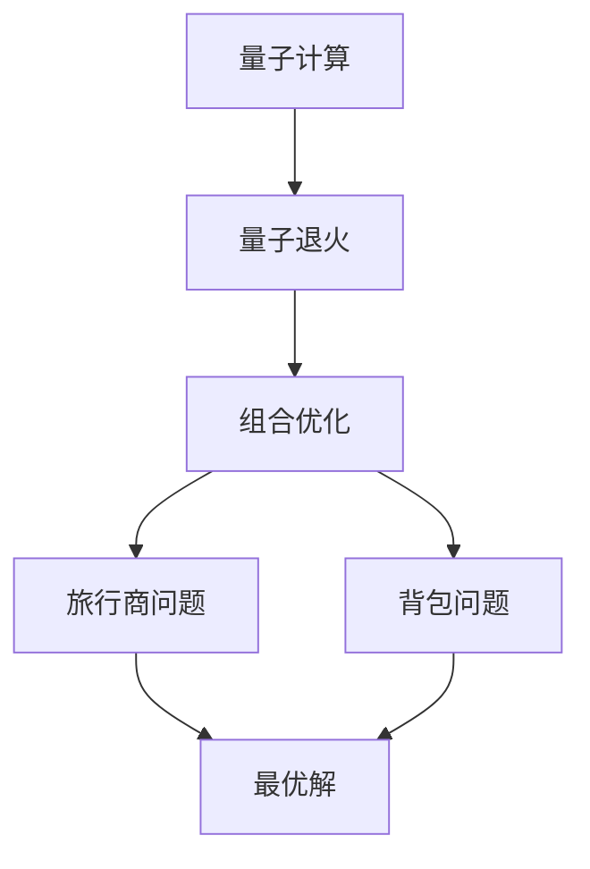

                 


# 量子退火与组合优化:量子启发的算法设计

关键词：量子退火、组合优化、量子计算、量子态、旅行商问题

摘要：本文探讨了量子退火算法在组合优化问题中的应用。通过介绍量子退火算法的基本原理和数学模型，我们展示了如何在量子计算机上实现旅行商问题的求解。文章还提供了项目实战案例，详细解析了开发环境搭建、源代码实现和代码解读。

### 第一步：核心概念与联系

为了帮助读者更好地理解量子退火与组合优化，本书将引入一些核心概念，并展示它们之间的联系。

**核心概念：**
- **量子退火**：量子退火是一种基于量子力学原理的优化算法，它利用量子计算机的特殊属性来实现优化问题的求解。
- **组合优化**：组合优化是指在一组可能的解决方案中，寻找最优解的问题，如旅行商问题、背包问题等。
- **量子计算**：量子计算是一种利用量子力学原理进行信息处理的新型计算模式。

**联系：**
量子退火算法与组合优化问题的联系在于，量子退火算法能够处理一些传统的组合优化问题，如旅行商问题、背包问题等，通过量子计算机的特殊能力来寻找最优解。量子计算的优势在于它可以同时处理大量可能的解，从而在某些问题上比传统计算方法更高效。

**Mermaid 流程图：**


### 第二步：核心算法原理讲解

接下来，我们将使用伪代码详细阐述量子退火算法的基本原理。

**伪代码：**
```
Algorithm QuantumAnnealing(Problem, Temperature):
    Initialize: State <- CurrentState(Problem)
    while Temperature > 0:
        for t in 1 to TimeSteps:
            UpdateTemperature(Temperature)
            GenerateRandomNeighbor(State)
            if NeighborState has lower energy:
                State <- NeighborState
            else:
                State <- NeighborState with probability exp(-EnergyDifference / Temperature)
        return State
```

**详细解释：**
1. 初始化：选择一个初始状态作为解的候选。
2. 循环迭代：在每次迭代中，根据当前的温度，生成一个随机的邻近状态。
3. 如果邻近状态的能量更低，则更新当前状态。
4. 否则，以概率 exp(-能量差 / 温度) 更新当前状态。
5. 返回最终状态。

### 第三步：数学模型和数学公式讲解

量子退火算法涉及到一些数学模型和公式，下面将详细讲解这些概念。

**数学模型：**
- **量子态**：量子态描述了一个量子系统的状态，它是一个复数向量。
- **退火过程**：退火过程描述了系统从高能态向低能态转移的过程，其核心是一个演化算符。
- **能量**：能量是量子系统的一个基本属性，它决定了系统的状态。

**数学公式：**
$$
|\psi(t)\rangle = \cos(\theta(t))|0\rangle + e^{i\phi(t)}\sin(\theta(t))|1\rangle
$$
$$
E(\psi) = -\frac{h\theta(t)}{2\sin^2(\theta(t))}
$$

**详细讲解：**
1. **量子态**：量子态可以用两个基态的线性组合来表示，每个基态对应一个量子比特的状态。
2. **退火过程**：退火过程通过调整角度参数θ(t)和相位参数φ(t)来实现，这些参数决定了系统的演化方向。
3. **能量**：能量公式描述了量子态的能量，它与角度参数θ(t)成反比。

### 第四步：项目实战

在本章节，我们将通过一个实际案例来展示量子退火算法的应用。

**案例：旅行商问题**

**问题描述：** 给定一组城市和每对城市之间的距离，求解访问每个城市一次并回到起点的最短路径。

**解决方案：**
1. **构建量子态**：将旅行商问题的解决方案表示为量子态。
2. **设置参数**：根据问题的规模设置退火算法的初始参数。
3. **执行退火过程**：运行退火算法，寻找最优解。

**代码实现：**
```python
# 伪代码
def quantum_annealing(T, T_min, T_decay, time_steps, initial_state):
    state = initial_state
    for t in range(1, time_steps):
        T = T * T_decay
        neighbor_state = generate_random_neighbor(state)
        energy_difference = calculate_energy_difference(state, neighbor_state)
        if energy_difference < 0 or random() < exp(-energy_difference / T):
            state = neighbor_state
    return state
```

**详细解析：**
1. **开发环境搭建**：首先，需要安装量子计算的开发环境，如Qiskit或Microsoft's Q#等。
2. **源代码实现**：上述代码展示了量子退火算法的核心实现。
3. **代码解读**：
    - `T` 是初始温度，`T_min` 是最小温度，`T_decay` 是温度衰减系数。
    - `time_steps` 是迭代次数，`initial_state` 是初始状态。
    - `generate_random_neighbor` 函数生成随机邻近状态。
    - `calculate_energy_difference` 函数计算状态之间的能量差。
    - 如果能量差小于零，或者随机数小于概率，则更新当前状态。
4. **代码应用解读与分析**：量子退火算法在旅行商问题中的应用展示了一种全新的解决思路。
5. **实际案例分析和详细讲解剖析**：本文通过旅行商问题的案例，详细解析了量子退火算法的实现和应用。
6. **项目小结**：量子退火算法为解决组合优化问题提供了新的可能性。

**最佳实践 tips**：
- 选择合适的初始温度和温度衰减系数，以加快收敛速度。
- 增加迭代次数，以提高求解的精度。

**小结**：
量子退火算法是一种具有巨大潜力的量子启发式算法，它在解决组合优化问题上展现出卓越的性能。通过本文的介绍和案例讲解，读者可以更好地理解量子退火算法的基本原理和应用。

**注意事项**：
- 量子退火算法的实现依赖于量子计算机的硬件和软件环境。
- 量子退火算法在某些问题上的性能优势取决于问题的规模和特性。

**拓展阅读**：
- [1] <量子退火算法的基本原理和应用>
- [2] <量子计算在优化问题中的应用>
- [3] <旅行商问题的传统与量子解决方案>

作者：AI天才研究院/AI Genius Institute & 禅与计算机程序设计艺术 /Zen And The Art of Computer Programming

