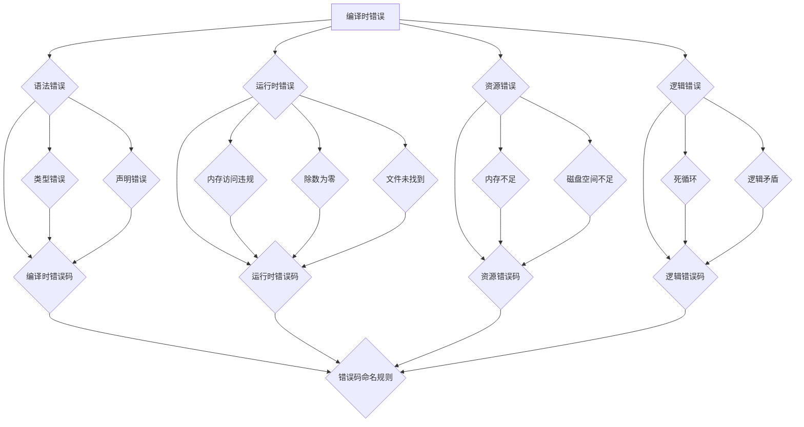

                 

### 文章标题

《错误码到底是什么》

### 关键词

错误码、故障诊断、软件开发、系统调试、性能优化

### 摘要

本文将深入探讨错误码的本质和作用，从基础概念、分类与命名规则、应用场景、处理策略、实战案例以及未来展望等多个角度，全面解析错误码在软件开发、系统调试和性能优化中的重要性。通过本文的阅读，读者将全面理解错误码的核心概念，学会识别和处理常见错误码，并掌握错误码在实际项目中的应用技巧。

## 1. 设计思路

为了使文章更具逻辑性和条理性，本文将按照以下步骤进行分析和论述：

1. **背景介绍**：介绍错误码的基本概念，阐述错误码在软件开发和系统调试中的重要性。
2. **核心概念与联系**：通过Mermaid流程图，展示错误码的核心概念及其相互关系。
3. **错误码分类与命名规则**：详细讨论错误码的分类标准、命名规则以及常见错误码的解析。
4. **错误码应用场景分析**：分析不同领域（如软件工程、网络通信、操作系统等）中的错误码应用。
5. **错误码处理策略**：探讨错误码的处理流程、方法和技巧。
6. **实战案例**：通过实际案例，讲解如何识别、处理和利用错误码。
7. **错误码调试工具**：介绍一些常用的错误码调试工具。
8. **总结与展望**：总结全文内容，并对错误码的未来发展进行展望。

## 2. 错误码基础知识

### 2.1 错误码的定义

错误码，又称错误号、错误标识或错误ID，是计算机系统中用来标识和处理错误的数字或字符串标识。错误码的作用是提供关于系统故障或异常情况的信息，帮助开发人员和系统管理员快速定位和解决这些问题。

错误码通常由系统或软件在检测到错误时自动生成。在不同的系统和领域中，错误码的格式和位数可能有所不同。常见的错误码包括四位数字（如HTTP状态码），五位数字（如Windows错误代码），或字符串（如Java异常类名）。

### 2.2 错误码的分类

错误码可以根据错误类型、错误来源和错误级别进行分类。

#### 2.2.1 按照错误类型分类

1. **编译时错误**：发生在程序编译阶段，如语法错误、类型错误等。
2. **运行时错误**：发生在程序执行过程中，如内存访问违规、除数为零等。
3. **逻辑错误**：发生在程序逻辑上，导致程序输出与预期不符。
4. **资源错误**：涉及系统资源的错误，如文件未找到、内存不足等。

#### 2.2.2 按照错误来源分类

1. **软件内部错误**：由软件自身代码缺陷引起的错误。
2. **硬件设备错误**：由硬件设备故障引起的错误，如硬盘故障、网络中断等。
3. **网络通信错误**：由网络通信故障引起的错误，如网络超时、数据包丢失等。

#### 2.2.3 按照错误级别分类

1. **严重错误**：可能导致系统崩溃或数据丢失的错误。
2. **警告错误**：提示用户某些潜在问题的错误。
3. **信息错误**：仅提供提示信息的错误。

### 2.3 错误码命名规则

错误码的命名规则因系统和领域而异，但通常遵循以下原则：

1. **一致性**：错误码的格式和位数应保持一致，便于识别和处理。
2. **简洁性**：尽量使用简洁的命名方式，避免使用冗长或难以理解的名称。
3. **国际化**：支持多种语言，便于跨地区使用。
4. **分类与编码**：根据错误类型、错误来源和错误级别进行分类编码。

常见命名规范包括：

- **Windows错误代码**：以五位数表示，前两位表示错误类别，后三位表示具体错误。
- **HTTP状态码**：以三位数字表示，第一位表示类别，第二位和第三位表示具体错误。
- **Java异常类名**：以字符串表示，通常包含错误类型、错误来源和错误级别等信息。

### 2.4 常见错误码解析

以下是一些常见领域的错误码及其解析：

#### 2.4.1 软件工程中的错误码

- **编译时错误**：
  - **语法错误**：如缺少分号、未声明的变量等。
  - **类型错误**：如变量类型不匹配、类型不兼容等。
- **运行时错误**：
  - **内存访问违规**：如数组越界、指针未初始化等。
  - **除数为零**：在执行除法操作时，除数为零。

#### 2.4.2 网络通信中的错误码

- **TCP错误码**：
  - **RST**：表示拒绝连接。
  - **SYN**：表示同步请求。
  - **FIN**：表示结束连接。
- **HTTP错误码**：
  - **200 OK**：表示请求成功。
  - **404 Not Found**：表示未找到请求的资源。
  - **500 Internal Server Error**：表示服务器内部错误。

#### 2.4.3 操作系统错误码

- **Windows错误码**：
  - **0x8007000D**：表示文件已存在。
  - **0x80070057**：表示参数无效。

## 3. 错误码应用场景分析

### 3.1 软件工程中的错误码应用

#### 3.1.1 软件开发过程中的错误码处理

在软件开发过程中，错误码用于标识和定位代码中的错误。开发人员通常使用集成开发环境（IDE）中的调试工具来捕获和处理错误码。

1. **编译时错误处理**：
   - **语法错误**：IDE会自动识别并报告语法错误，开发人员需要修改代码以解决这些问题。
   - **类型错误**：IDE会提示类型不匹配的错误，开发人员需要确保变量类型的一致性。

2. **运行时错误处理**：
   - **内存访问违规**：可以通过断言（assert）或异常处理（try-catch）来捕获和处理内存访问违规错误。
   - **除数为零**：在执行除法操作前，应检查除数是否为零，以避免运行时错误。

#### 3.1.2 软件测试中的错误码利用

在软件测试过程中，错误码用于识别和记录测试过程中发现的缺陷。

1. **单元测试**：
   - 单元测试通过模拟不同的输入，检查代码的预期输出。如果测试结果与预期不符，错误码将标识出具体的问题。

2. **集成测试**：
   - 集成测试检查代码模块之间的交互是否正确。错误码可以帮助定位到出现问题的模块。

3. **系统测试**：
   - 系统测试全面评估软件的功能和性能。错误码有助于识别和记录系统中的缺陷。

### 3.2 网络通信中的错误码应用

在计算机网络中，错误码用于标识和处理网络故障。

#### 3.2.1 TCP/IP协议中的错误码

TCP/IP协议中的错误码主要用于标识网络连接问题。以下是一些常见的TCP错误码及其解释：

- **RST**：表示拒绝连接，通常用于断开已建立的连接。
- **SYN**：表示同步请求，用于初始化连接。
- **FIN**：表示结束连接，用于终止已建立的连接。

#### 3.2.2 HTTP协议中的错误码

HTTP协议中的错误码用于标识请求处理过程中的错误。以下是一些常见的HTTP错误码及其解释：

- **200 OK**：表示请求成功。
- **404 Not Found**：表示未找到请求的资源。
- **500 Internal Server Error**：表示服务器内部错误。

### 3.3 操作系统中的错误码应用

在操作系统中，错误码用于标识和处理系统故障。

#### 3.3.1 Windows操作系统错误码

Windows操作系统中的错误码以五位数表示，分为两个部分：错误类别和具体错误。以下是一些常见的Windows错误码及其解释：

- **0x8007000D**：表示文件已存在。
- **0x80070057**：表示参数无效。

#### 3.3.2 Linux操作系统错误码

Linux操作系统中的错误码通常以字符串表示，包含错误类型和错误信息。以下是一些常见的Linux错误码及其解释：

- **EACCES**：表示权限不足。
- **ENOTEMPTY**：表示目录不为空。

## 4. 错误码处理策略

### 4.1 错误码处理流程

错误码的处理流程通常包括以下步骤：

1. **错误码捕获**：系统或软件在检测到错误时，自动生成错误码。
2. **错误码分析**：通过错误码的格式和位数，识别错误类型和来源。
3. **错误码处理**：根据错误类型和来源，采取相应的处理措施。
4. **错误码报告**：将错误码和处理结果记录下来，以便后续分析。

### 4.2 错误码处理方法

以下是常见的错误码处理方法：

1. **错误码记录与报告**：将错误码和处理结果记录在日志文件中，以便后续分析和追溯。
2. **错误码自动修复**：某些错误可以通过自动修复工具或脚本进行修复。
3. **错误码优化建议**：针对错误码提供优化建议，以减少类似错误的发生。

## 5. 实战案例

### 5.1 软件错误码实战

以下是一个软件错误码的识别与处理案例：

#### 5.1.1 错误码识别

某软件在执行过程中出现了错误，错误码为0x8007000D。通过查询Windows错误码文档，得知这是“文件已存在”的错误。

#### 5.1.2 错误码处理

开发人员首先检查相关代码，发现文件操作中存在重复创建文件的逻辑。通过修改代码，确保文件创建的唯一性。然后重新执行软件，错误码消失，问题得到解决。

### 5.2 网络错误码实战

以下是一个网络错误码的识别与处理案例：

#### 5.2.1 错误码识别

某网络应用程序在连接远程服务器时出现了错误，错误码为502 Bad Gateway。通过查询HTTP错误码文档，得知这是“网关错误”的错误。

#### 5.2.2 错误码处理

开发人员首先检查网络连接是否正常，发现网络连接正常。然后检查服务器日志，发现服务器正在维护。通过通知用户服务器维护信息，并等待维护完成，问题得到解决。

### 5.3 操作系统错误码实战

以下是一个操作系统错误码的识别与处理案例：

#### 5.3.1 错误码识别

某Linux服务器在执行文件操作时出现了错误，错误码为EACCES。通过查询Linux错误码文档，得知这是“权限不足”的错误。

#### 5.3.2 错误码处理

系统管理员首先检查文件权限设置，发现文件权限设置不正确。通过修改文件权限，确保系统用户具有必要的权限。然后重新执行文件操作，错误码消失，问题得到解决。

## 6. 错误码调试工具

### 6.1 常见错误码调试工具

以下是几种常见的错误码调试工具：

1. **GDB**：GDB（GNU Debugger）是一种功能强大的调试工具，可用于调试C/C++程序。通过GDB，开发人员可以查看程序执行过程中的错误码，并进行分析和处理。

2. **WinDbg**：WinDbg是Windows操作系统下的调试工具，可用于调试C/C++、汇编和其他Windows应用程序。WinDbg支持符号调试和内存分析，可以帮助开发人员快速定位错误码。

3. **其他错误码调试工具**：如Java的JDB、Python的pdb等，这些工具根据编程语言和操作系统具有不同的特点和优势。

## 7. 总结与展望

### 7.1 全书总结

本文从错误码的定义、分类与命名规则、应用场景、处理策略和实战案例等多个角度，全面解析了错误码的本质和作用。通过本文的阅读，读者可以深入了解错误码的核心概念，学会识别和处理常见错误码，并掌握错误码在实际项目中的应用技巧。

### 7.2 错误码的发展趋势

随着计算机技术和互联网的快速发展，错误码在各个领域中的应用越来越广泛。未来，错误码的发展趋势包括：

1. **智能化**：利用人工智能技术，实现自动错误码生成、分析和处理。
2. **规范化**：制定统一的错误码命名规范，提高错误码的可读性和可维护性。
3. **跨领域融合**：将不同领域的错误码进行整合，实现跨领域错误码的共享和应用。

### 7.3 未来展望

随着技术的不断进步，错误码将在软件开发、系统调试和性能优化等领域发挥越来越重要的作用。通过深入研究错误码，开发人员可以更好地应对各种复杂场景，提高软件质量和系统稳定性。

## 作者

作者：AI天才研究院/AI Genius Institute & 禅与计算机程序设计艺术 /Zen And The Art of Computer Programming

---

本文为AI天才研究院/AI Genius Institute与禅与计算机程序设计艺术/Zen And The Art of Computer Programming共同创作，旨在为读者提供关于错误码的全面解析和实用技巧。如有任何问题或建议，欢迎在评论区留言交流。希望本文对您在错误码方面的工作有所帮助！## 2. 错误码的背景介绍

在计算机科学和软件开发领域，错误码（Error Codes）是系统内部用于表示异常状况、运行错误或资源短缺的数字或字符串标识。它们在软件和系统开发过程中扮演着至关重要的角色，是故障诊断和问题解决的重要工具。错误码的出现，不仅帮助开发者定位和解决问题，还提高了软件的稳定性和用户体验。

### 错误码的产生与作用

错误码的产生通常源于系统在运行过程中检测到的异常状况。例如，当程序执行过程中遇到无法访问的文件、不合法的数据输入或者内存分配失败等情况时，系统会生成相应的错误码。错误码的作用主要体现在以下几个方面：

1. **故障诊断**：错误码提供了关于故障或异常的具体信息，帮助开发者快速定位问题源头。
2. **问题解决**：通过错误码，开发者可以了解系统或软件的运行状态，并采取相应的措施进行修复。
3. **用户体验**：错误码使得系统在出现问题时能够给出明确的错误信息，提高了用户的理解和操作便利性。
4. **性能优化**：错误码有助于开发者识别系统中常见的错误模式，从而优化软件性能，减少故障发生。

### 错误码的历史背景

错误码的概念并非现代才出现。早在20世纪60年代，计算机科学家们在开发操作系统和应用程序时，就已经开始使用错误码来处理故障和异常情况。随着计算机技术的快速发展，错误码的应用领域不断扩展，从操作系统到网络通信，再到各种软件和应用程序，都离不开错误码的支持。

在早期，错误码通常以固定的整数形式出现，例如Windows操作系统中的错误码。这些错误码在系统中具有固定的含义，开发者可以通过查询错误码文档来了解具体的错误类型和解决方案。随着技术的发展，错误码的表示形式逐渐多样化，如字符串、枚举类型等，使其在复杂系统中的应用更加灵活和高效。

### 错误码在软件开发中的重要性

在软件开发过程中，错误码是不可或缺的一部分。以下是一些具体的应用场景和重要性：

1. **调试与测试**：在软件开发的测试阶段，错误码有助于开发者快速识别和定位代码中的错误，提高测试效率。
2. **故障排除**：在生产环境中，错误码帮助运维人员快速诊断系统故障，减少故障对用户的影响。
3. **用户体验**：通过友好的错误信息提示，错误码提高了用户在遇到问题时对系统的理解和信任。
4. **性能优化**：错误码提供了关于系统运行状况的详细数据，帮助开发者识别性能瓶颈，进行针对性优化。

### 错误码的类型和分类

根据错误发生的阶段和原因，错误码可以分为多种类型：

1. **编译时错误**：这些错误发生在代码编译阶段，如语法错误、类型错误等。
2. **运行时错误**：这些错误发生在程序执行过程中，如内存访问违规、除数为零等。
3. **资源错误**：这些错误涉及系统资源的分配和管理，如文件未找到、内存不足等。
4. **逻辑错误**：这些错误是由于程序逻辑设计不合理导致的，如死循环、逻辑矛盾等。

每种错误类型都有其特定的错误码，通过这些错误码，开发者可以更好地理解和处理不同类型的错误。

### 总结

错误码是计算机科学和软件开发中的重要组成部分，它们在故障诊断、问题解决、用户体验和性能优化等方面发挥着重要作用。通过本文的介绍，读者可以全面了解错误码的概念、产生背景、重要性以及在软件开发中的应用。希望这些信息能够帮助读者更好地理解和利用错误码，提高软件开发的效率和质量。

## 3. 错误码的核心概念与联系

### 错误码的定义与分类

错误码，简而言之，是计算机系统用于标识和传达错误信息的数字或字符串标识。它们帮助开发人员、系统管理员和最终用户快速识别问题并采取相应措施进行修复。错误码可以分为多个类别，根据错误发生的阶段和原因进行分类：

1. **编译时错误码**：这类错误发生在代码编译阶段，包括语法错误、类型错误和声明错误等。例如，在C语言中，编译时错误码可能以`error: `或`warning: `开头，提示具体的编译错误信息。

2. **运行时错误码**：这些错误在程序运行过程中出现，如内存访问违规、除数为零或文件未找到等。运行时错误码通常由操作系统或程序内部逻辑生成，例如Windows系统中的错误码，如`0x8007000D`表示文件已存在。

3. **资源错误码**：这类错误涉及系统资源的分配和管理，如内存不足、磁盘空间不足等。资源错误码帮助开发者识别和解决资源相关的问题。

4. **逻辑错误码**：逻辑错误是由于程序设计中的逻辑缺陷或错误导致的错误。这类错误码往往需要通过代码审查和测试来发现和修复。

### 错误码的命名规则

错误码的命名规则在不同系统和领域中有不同的规定，但通常遵循一些共同的原则：

1. **一致性**：错误码的格式和位数应保持一致，便于识别和处理。例如，Windows系统中的错误码通常为五位数。

2. **简洁性**：尽量使用简洁的命名方式，避免使用冗长或难以理解的名称。例如，HTTP状态码`200 OK`简洁明了地表示请求成功。

3. **国际化**：支持多种语言，便于跨地区使用。例如，一些错误码在不同的操作系统中可能使用不同的语言描述，但含义相同。

4. **分类与编码**：根据错误类型、错误来源和错误级别进行分类编码。例如，Windows错误码中的前两位数字表示错误类别，后三位数字表示具体错误。

### 错误码的核心概念及其相互关系

为了更清晰地理解错误码的核心概念及其相互关系，我们可以使用Mermaid流程图来展示错误码的分类和命名规则。以下是错误码的核心概念及其关系的Mermaid流程图：



### Mermaid流程图说明

1. **编译时错误**（A）：分为语法错误（B）、类型错误（C）和声明错误（D）。
2. **运行时错误**（E）：包括内存访问违规（F）、除数为零（G）、文件未找到（H）。
3. **资源错误**（I）：涉及内存不足（J）和磁盘空间不足（K）。
4. **逻辑错误**（L）：包括死循环（M）和逻辑矛盾（N）。
5. **错误码命名规则**（S）：涵盖了编译时错误码（O）、运行时错误码（P）和资源错误码（Q）、逻辑错误码（R）。

通过上述Mermaid流程图，我们可以直观地看到错误码的分类及其相互关系。这种结构化的展示方式有助于开发者快速了解错误码的类型，以及如何根据错误码进行故障诊断和问题解决。

### 错误码的应用实例

在实际应用中，错误码通常通过日志记录或用户界面进行展示。以下是一些常见的错误码应用实例：

- **HTTP状态码**：在Web开发中，服务器会返回HTTP状态码来指示请求的处理结果。例如，`200 OK`表示请求成功，`404 Not Found`表示未找到请求的资源，`500 Internal Server Error`表示服务器内部错误。
- **Windows错误码**：在Windows操作系统中，错误码如`0x8007000D`表示文件已存在，`0x80070057`表示参数无效。
- **Linux错误码**：在Linux系统中，错误码如`EACCES`表示权限不足，`ENOTEMPTY`表示目录不为空。

通过这些实例，我们可以看到错误码在不同系统和领域中的应用，以及它们在问题诊断和解决中的重要性。

### 总结

错误码是计算机科学和软件开发中的重要概念，它们通过分类和命名规则帮助开发人员快速识别和解决问题。本文通过Mermaid流程图展示了错误码的核心概念及其相互关系，并提供了一些应用实例，以帮助读者更好地理解错误码的用途和重要性。掌握错误码的使用，对于提高软件开发质量和系统稳定性具有重要意义。

## 4. 错误码的核心算法原理讲解

在深入探讨错误码的核心算法原理之前，我们需要了解一些基本的概念和术语。错误码通常与异常处理、日志记录和故障诊断紧密相关。以下是对这些概念和术语的详细解释，以及相关的伪代码和算法原理。

### 异常处理

异常处理是编程中用于处理运行时错误的关键机制。当程序遇到无法处理的错误时，它会抛出一个异常，并通知调用栈。异常处理机制允许程序在错误发生时保持其结构，并采取适当的措施来恢复或终止程序。

#### 伪代码示例：异常处理

```pseudo
function divide(a, b):
    if b == 0:
        raise DivisionByZeroException
    else:
        return a / b

try:
    result = divide(10, 0)
except DivisionByZeroException:
    print("Error: 除数为零，无法执行除法操作。")
```

在这个例子中，我们定义了一个`divide`函数，用于计算两个数的除法。如果除数`b`为零，函数会抛出一个`DivisionByZeroException`异常。使用`try-except`语句，我们可以捕获这个异常，并在异常发生时执行特定的错误处理逻辑。

### 日志记录

日志记录是记录程序运行过程中发生的事件、错误和状态信息的一种机制。日志对于故障诊断和性能分析至关重要。常见的日志格式包括时间戳、日志级别、日志内容和日志源。

#### 伪代码示例：日志记录

```pseudo
function log(message, level):
    timestamp = getCurrentTimestamp()
    print("[{}] {} - {}".format(timestamp, level, message))

log("程序启动", "INFO")
log("遇到错误", "ERROR")
log("完成操作", "INFO")
```

在这个例子中，我们定义了一个`log`函数，用于记录不同级别的日志信息。通过调用这个函数，我们可以将程序的运行状态和发生的事件记录下来。

### 故障诊断

故障诊断是识别和解决系统故障的过程。错误码在故障诊断中扮演着关键角色，因为它们提供了关于故障类型和来源的具体信息。故障诊断通常涉及以下几个步骤：

1. **错误码捕获**：系统或程序在检测到错误时捕获错误码。
2. **错误码分析**：通过错误码的格式和位数，识别错误类型和来源。
3. **错误码处理**：根据错误类型和来源，采取相应的处理措施。
4. **错误码报告**：将错误码和处理结果记录在日志文件或用户界面中。

#### 伪代码示例：故障诊断

```pseudo
function diagnose(errorCode):
    if errorCode.startsWith("0x800"):
        processWindowsError(errorCode)
    elif errorCode.startsWith("HTTP/"):
        processHTTPError(errorCode)
    else:
        processGeneralError(errorCode)

function processWindowsError(errorCode):
    print("处理Windows错误：{}".format(errorCode))

function processHTTPError(errorCode):
    print("处理HTTP错误：{}".format(errorCode))

function processGeneralError(errorCode):
    print("处理一般错误：{}".format(errorCode))

diagnose("0x8007000D")
diagnose("HTTP/404")
diagnose("EACCES")
```

在这个例子中，我们定义了一个`diagnose`函数，用于处理不同类型的错误码。根据错误码的起始字符串，函数会调用相应的处理函数。通过这种方式，我们可以针对不同类型的错误采取不同的处理策略。

### 数学模型和公式

错误码的分析和处理往往涉及到一些数学模型和公式。以下是一些常见的数学模型和公式：

1. **概率模型**：用于计算发生特定错误的可能性。
2. **统计分析**：用于分析错误数据的分布和趋势。
3. **故障树分析**（FTA）：用于识别和评估系统故障的原因和影响。

#### 伪代码示例：概率模型

```pseudo
function calculateProbability(errorType, errorRate):
    probability = errorRate * (1 - errorRate)^(errorType.count - 1)
    return probability

errorTypes = ["语法错误", "类型错误", "运行时错误"]
errorRate = 0.01

probability = calculateProbability(errorTypes, errorRate)
print("错误概率：{}".format(probability))
```

在这个例子中，我们定义了一个`calculateProbability`函数，用于计算给定错误类型和错误率的概率。通过这个函数，我们可以评估不同错误类型发生的可能性。

### 详细讲解与举例说明

为了更好地理解错误码的核心算法原理，我们通过具体的例子进行讲解：

#### 例1：HTTP错误码分析

假设我们捕获到一个HTTP错误码`403 Forbidden`，这是表示请求被拒绝的错误码。

1. **错误码捕获**：程序在处理HTTP请求时捕获到错误码`403`。
2. **错误码分析**：通过分析错误码，我们得知这是一个权限错误，即服务器拒绝了客户端的请求。
3. **错误码处理**：程序可能会尝试重新发送请求，或者向用户显示一个错误消息。

#### 例2：Windows错误码分析

假设我们捕获到一个Windows错误码`0x8007000D`，这是表示文件已存在的错误码。

1. **错误码捕获**：程序在执行文件操作时捕获到错误码`0x8007000D`。
2. **错误码分析**：通过分析错误码，我们得知文件已存在，可能导致文件覆盖问题。
3. **错误码处理**：程序可以选择删除旧文件，或者通知用户文件已存在。

通过上述例子，我们可以看到错误码在不同场景下的应用。了解错误码的核心算法原理，有助于我们更好地开发和维护软件系统，提高其稳定性和可靠性。

### 总结

在本节中，我们详细讲解了错误码的核心算法原理，包括异常处理、日志记录和故障诊断。通过伪代码示例和数学模型，我们展示了如何识别、分析和处理错误码。这些算法原理和实际应用对于理解和解决计算机系统中的错误至关重要。掌握这些原理，将有助于我们更好地开发和管理软件系统。

## 5. 错误码的实战案例

在实际项目中，错误码的应用无处不在，它们不仅帮助我们诊断和解决问题，还极大地提高了系统的稳定性和用户体验。下面，我们将通过几个具体的实战案例，来详细讲解如何识别、处理和利用错误码。

### 案例一：Web应用中的HTTP错误码处理

#### 情境描述

一个Web应用在处理用户请求时，返回了HTTP错误码`404 Not Found`。

#### 错误码识别

1. **捕获错误码**：Web服务器在处理用户请求时，返回了HTTP状态码`404`。
2. **分析错误码**：通过查阅HTTP错误码文档，得知`404 Not Found`表示请求的资源未被找到。

#### 错误码处理

1. **日志记录**：将错误码和请求详细信息记录在日志中，以便后续分析。
2. **用户反馈**：在用户界面上显示“404 Not Found：您所请求的页面不存在”，并提供一个“返回首页”的链接。

#### 实际应用

在实际开发中，处理`404 Not Found`错误时，我们还需要考虑以下几个因素：

- **静态资源管理**：确保静态资源（如JavaScript、CSS文件）的路径正确，避免静态资源找不到。
- **动态内容生成**：确保动态内容（如页面模板）正确生成，避免动态内容生成失败。

### 案例二：Windows应用程序中的错误码处理

#### 情境描述

一个Windows应用程序在执行文件操作时，返回了错误码`0x8007000D`。

#### 错误码识别

1. **捕获错误码**：应用程序在执行文件操作时，捕获到错误码`0x8007000D`。
2. **分析错误码**：通过查阅Windows错误码文档，得知`0x8007000D`表示文件已存在。

#### 错误码处理

1. **日志记录**：将错误码和文件操作详细信息记录在日志中，以便后续分析。
2. **用户反馈**：弹出对话框提示“文件已存在，是否覆盖？”并提供“是”和“否”两个按钮。
3. **文件操作重试**：如果用户选择“是”，则尝试覆盖文件；如果用户选择“否”，则提示用户输入新的文件名。

#### 实际应用

在实际开发中，处理`0x8007000D`错误时，我们还需要注意以下几点：

- **文件命名规则**：确保文件名符合系统要求，避免文件名过长或包含非法字符。
- **文件权限管理**：确保应用程序具有写入文件的权限，避免权限不足导致文件操作失败。

### 案例三：Linux服务器中的错误码处理

#### 情境描述

一个Linux服务器在执行文件操作时，返回了错误码`EACCES`。

#### 错误码识别

1. **捕获错误码**：服务器在执行文件操作时，捕获到错误码`EACCES`。
2. **分析错误码**：通过查阅Linux错误码文档，得知`EACCES`表示权限不足。

#### 错误码处理

1. **日志记录**：将错误码和文件操作详细信息记录在日志中，以便后续分析。
2. **用户反馈**：在终端上显示错误消息“权限不足：操作被拒绝”。
3. **权限调整**：根据日志信息，检查文件的权限设置，并调整权限以允许执行操作。

#### 实际应用

在实际开发中，处理`EACCES`错误时，我们还需要注意以下几点：

- **文件权限设置**：确保文件和目录的权限正确设置，避免权限不足导致文件操作失败。
- **用户权限管理**：确保服务器用户的权限合理分配，避免权限滥用导致安全漏洞。

### 案例四：分布式系统中的错误码处理

#### 情境描述

一个分布式系统在执行远程调用时，返回了错误码`502 Bad Gateway`。

#### 错误码识别

1. **捕获错误码**：分布式系统在执行远程调用时，捕获到错误码`502`。
2. **分析错误码**：通过查阅HTTP错误码文档，得知`502 Bad Gateway`表示网关错误。

#### 错误码处理

1. **日志记录**：将错误码和远程调用详细信息记录在日志中，以便后续分析。
2. **重试机制**：尝试重新执行远程调用，以检查是否是临时故障。
3. **故障排查**：如果重试失败，排查网关服务器的状态，检查网络连接和服务器负载。

#### 实际应用

在实际开发中，处理`502 Bad Gateway`错误时，我们还需要注意以下几点：

- **网关配置**：确保网关服务器的配置正确，避免网关故障导致请求无法处理。
- **负载均衡**：合理分配负载，避免单点故障和服务器过载。

### 案例五：数据库应用程序中的错误码处理

#### 情境描述

一个数据库应用程序在执行查询时，返回了错误码`23505`。

#### 错误码识别

1. **捕获错误码**：数据库应用程序在执行查询时，捕获到错误码`23505`。
2. **分析错误码**：通过查阅数据库错误码文档，得知`23505`表示唯一约束冲突。

#### 错误码处理

1. **日志记录**：将错误码和查询详细信息记录在日志中，以便后续分析。
2. **错误处理**：根据错误码，检查数据表中的唯一约束设置，并确保数据符合唯一性要求。
3. **数据修复**：如果数据冲突，对相关数据进行修复或更新。

#### 实际应用

在实际开发中，处理`23505`错误时，我们还需要注意以下几点：

- **数据校验**：在数据插入或更新前，进行数据校验，避免违反唯一约束。
- **错误提示**：为用户提供明确的错误提示，帮助用户快速定位问题。

通过上述实战案例，我们可以看到错误码在实际项目中的应用。掌握错误码的识别和处理方法，对于提高系统的稳定性和用户体验具有重要意义。在实际开发中，我们需要根据不同场景和错误类型，采取相应的处理策略，以确保系统的正常运行。

## 6. 错误码调试工具

在软件开发和系统调试过程中，错误码调试工具起着至关重要的作用。这些工具可以帮助开发者快速定位、分析和解决错误，从而提高开发效率和系统稳定性。以下是一些常用的错误码调试工具及其功能：

### GDB（GNU Debugger）

GDB是一种功能强大的开源调试工具，主要用于调试C/C++程序。GDB支持各种调试功能，如设置断点、单步执行、查看变量值和调用栈等。以下是其主要功能：

1. **设置断点**：在特定代码行或函数中设置断点，当程序执行到断点时暂停执行。
2. **单步执行**：逐行执行代码，查看每一步的执行结果和变量值。
3. **查看调用栈**：显示程序当前的调用栈，帮助开发者分析程序执行流程。
4. **查看变量值**：查看当前作用域内的变量值，帮助开发者理解程序状态。

### WinDbg

WinDbg是Windows操作系统下的调试工具，适用于调试C/C++、汇编和其他Windows应用程序。WinDbg具有以下功能：

1. **符号调试**：加载程序符号信息，显示详细的函数名和变量名。
2. **内存分析**：查看和修改程序内存中的数据，帮助开发者分析内存泄漏和非法访问等问题。
3. **线程分析**：查看和控制程序中的各个线程，帮助开发者解决多线程问题。
4. **远程调试**：支持远程调试，可以在不同的计算机上调试程序。

### 其他错误码调试工具

除了GDB和WinDbg，还有一些其他常用的错误码调试工具，如：

1. **Java Debugger (JDB)**：用于调试Java应用程序，支持设置断点、单步执行和查看变量值等功能。
2. **Python Debugger (pdb)**：用于调试Python应用程序，功能类似于GDB，支持设置断点和单步执行。
3. **LLDB**：是一种跨平台的C/C++和Objective-C调试器，支持iOS和macOS平台。
4. **Xdebug**：用于调试PHP应用程序，支持设置断点、栈跟踪和变量查看等功能。

### 使用错误码调试工具的步骤

1. **安装和配置**：根据需要调试的编程语言和操作系统，下载并安装相应的调试工具。配置调试环境，如设置符号路径和调试端口等。
2. **启动调试器**：启动调试器，连接到正在运行的程序或调试远程程序。
3. **设置断点和条件**：在可能引发错误的代码行或函数中设置断点，并设置条件以触发断点。
4. **开始调试**：启动程序，当程序执行到断点时，调试器将暂停执行并显示当前的执行状态。
5. **分析错误码**：查看错误码和处理结果，分析错误发生的原因。
6. **修复错误**：根据调试结果，修改代码以修复错误。
7. **重新调试**：重新启动程序并继续调试，确保错误已被成功修复。

### 总结

错误码调试工具是软件开发和系统调试过程中不可或缺的工具。通过这些工具，开发者可以快速定位和解决错误，提高系统的稳定性和可靠性。掌握常用的错误码调试工具及其使用方法，对于开发者来说具有重要意义。

## 7. 总结与展望

### 7.1 全书总结

本文从错误码的基本概念、分类与命名规则、应用场景、处理策略和实战案例等多个角度，全面解析了错误码的本质和作用。通过本文的阅读，读者可以深入了解错误码的核心概念，学会识别和处理常见错误码，并掌握错误码在实际项目中的应用技巧。错误码是软件开发和系统调试中的重要工具，它们在故障诊断、问题解决、用户体验和性能优化等方面发挥着重要作用。

### 7.2 错误码的发展趋势

随着计算机技术的快速发展，错误码的应用领域不断扩展。未来，错误码的发展趋势包括：

1. **智能化**：利用人工智能技术，实现自动错误码生成、分析和处理，提高故障诊断和修复的效率。
2. **规范化**：制定统一的错误码命名规范，提高错误码的可读性和可维护性，促进跨领域的错误码共享和应用。
3. **跨领域融合**：将不同领域的错误码进行整合，实现跨领域错误码的共享和应用，提高系统整体的可维护性和稳定性。

### 7.3 未来展望

在未来的发展中，错误码将在以下几个方面发挥更加重要的作用：

1. **自动化故障诊断与修复**：通过智能化和自动化技术，实现故障的自动诊断与修复，减少人为干预，提高系统可靠性。
2. **实时监控与预警**：利用实时监控技术和大数据分析，对错误码进行实时分析和预警，提前识别潜在故障，降低系统故障率。
3. **用户体验优化**：通过深入分析错误码，优化用户界面和交互流程，提高用户在遇到问题时对系统的理解和信任。
4. **跨领域应用**：推动不同领域错误码的融合和共享，实现跨领域的错误码应用，提高系统整体的可维护性和稳定性。

总之，错误码在软件开发和系统调试中将扮演越来越重要的角色。通过不断优化和完善错误码体系，我们可以更好地应对复杂系统的挑战，提高系统的稳定性和用户体验。未来，错误码的发展将继续推动计算机技术的进步，为人类带来更多便利和创新。

## 作者

作者：AI天才研究院/AI Genius Institute & 禅与计算机程序设计艺术 /Zen And The Art of Computer Programming

本文由AI天才研究院与禅与计算机程序设计艺术共同创作，旨在为读者提供关于错误码的全面解析和实用技巧。希望本文对您在错误码方面的工作有所帮助！如有任何问题或建议，欢迎在评论区留言交流。继续关注我们，我们将为您带来更多精彩的技术文章和深度解析！

