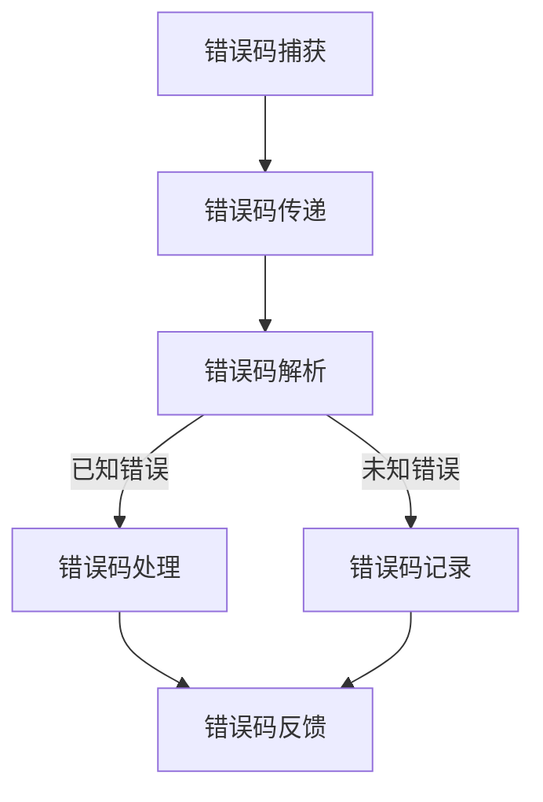

                 


## 文章标题

### 错误码处理：跨系统通信的关键挑战

## 关键词

- 错误码
- 跨系统通信
- 错误处理机制
- 编程技术
- 系统架构
- 网络通信

## 摘要

在复杂的信息系统架构中，跨系统通信是一个普遍存在的需求。然而，这种通信也伴随着一系列的挑战，特别是错误码处理。本文深入探讨了错误码处理在跨系统通信中的关键作用，分析了当前存在的问题，并提出了一系列解决方案。通过案例解析和实践应用，本文旨在为开发者提供一套完整的错误码处理策略，以提升系统的稳定性和可靠性。

## 引言

随着现代信息技术的飞速发展，跨系统通信已经成为企业内部以及跨企业间信息交换的基石。无论是业务系统集成、数据共享，还是云计算和大数据处理，跨系统通信无处不在。然而，随着系统复杂性的增加，跨系统通信的可靠性也面临巨大的挑战。错误码处理，作为保障跨系统通信稳定性的重要手段，其作用愈发凸显。

错误码，通常由数字或字母组成，用于标识和报告系统中发生的错误。它不仅是系统内部问题诊断的重要工具，也是跨系统通信中错误处理的核心。在本文中，我们将深入探讨错误码处理在跨系统通信中的关键挑战，包括错误码的分类与编码、处理机制、编程技术，以及如何在实际项目中应用和优化。

## 第1章：错误码处理概述

### 1.1 错误码的定义与作用

错误码，顾名思义，是一种用于标识和报告系统错误的编码。它通常由一系列数字或字母组成，每个编码都对应着特定的错误类型或问题。在计算机系统中，错误码是一种标准化的通信方式，用于在组件、程序和系统之间传递错误信息。

错误码的作用主要体现在以下几个方面：

1. **诊断错误原因**：通过错误码，开发人员可以快速确定问题的根本原因，而不必逐一检查所有可能的问题。
2. **提高系统可靠性**：错误码能够及时地处理错误，使系统能够保持稳定运行，减少故障发生的概率。
3. **优化用户体验**：错误码有助于生成有针对性的错误消息，提供用户友好的错误提示，从而提高用户体验。
4. **促进系统维护**：错误码为系统的日常维护和优化提供了重要依据，有助于识别和修复潜在问题。

### 1.2 错误码处理的重要性

在跨系统通信中，错误码处理的重要性不言而喻。以下是一些具体原因：

1. **保障数据一致性**：跨系统通信涉及到多个系统的数据交互，错误码处理能够确保数据的正确传输和一致性。
2. **提高故障响应速度**：通过错误码，运维人员可以快速定位故障，提高故障响应速度，减少系统停机时间。
3. **提升系统稳定性**：错误码处理能够及时发现并修复错误，从而提升系统的稳定性。
4. **优化资源利用**：错误码处理有助于优化系统资源的利用，减少不必要的重试和资源浪费。

### 1.3 跨系统通信中的错误码挑战

尽管错误码处理至关重要，但在跨系统通信中仍面临一系列挑战：

1. **错误码标准不一致**：不同系统可能使用不同的错误码标准，导致错误码的解析和处理变得复杂。
2. **错误码语义不明确**：有些错误码的语义可能不够明确，使得错误处理变得模糊不清。
3. **错误码覆盖不足**：有些系统可能未能为所有可能的错误情况定义错误码，导致错误无法被正确处理。
4. **错误码解析与处理不一致**：不同系统对错误码的解析和处理可能存在差异，导致跨系统通信中出现错误处理不一致的情况。

### 1.4 错误码处理机制

为了应对上述挑战，需要一套完整的错误码处理机制。以下是一些常见的错误码处理机制：

1. **错误码分类与编码规则**：对错误码进行分类和编码，确保每个错误码都有明确的语义和用途。
2. **错误码传递与解析**：在跨系统通信中，确保错误码能够正确地传递和解析。
3. **错误码处理策略**：根据不同类型的错误，制定相应的处理策略，确保错误能够得到及时和有效的处理。
4. **错误码反馈与优化**：通过错误码反馈机制，不断优化错误码处理流程，提升系统的可靠性。

### 1.5 小结

本章对错误码处理进行了概述，详细介绍了错误码的定义与作用、错误码处理的重要性以及跨系统通信中的错误码挑战和错误码处理机制。错误码处理作为跨系统通信中的关键环节，对于保障系统稳定性和可靠性具有重要意义。在接下来的章节中，我们将深入探讨错误码处理的详细机制和技术，提供实用的解决方案和最佳实践。

## 第2章：错误码处理机制

### 2.1 错误码分类与编码规则

在错误码处理中，分类与编码规则是基础。合理的分类和编码有助于提高错误码的辨识度和处理效率。

首先，**错误码的分类**可以根据错误发生的层次进行。常见的分类方法包括：

1. **系统级错误**：这类错误通常由操作系统或系统组件引起，如内存溢出、进程崩溃等。
2. **应用级错误**：这类错误由应用程序自身产生，如参数错误、文件访问失败等。
3. **网络级错误**：这类错误与网络通信相关，如网络中断、超时等。

其次，**错误码的编码规则**需要确保每个错误码具有唯一性和可读性。以下是一些常见的编码规则：

1. **基于层次的结构**：例如，使用三位数字来分别表示系统级、应用级和网络级错误。如1001表示系统级错误，1002表示应用级错误，1003表示网络级错误。
2. **基于字母数字的组合**：将错误码编码为字母和数字的组合，以增强可读性。例如，ERR-CONN表示连接错误，ERR-DATA表示数据错误。
3. **国际化支持**：对于跨系统或跨国界通信，错误码应支持国际化，使用 Unicode 编码。

### 2.2 错误码处理的常见策略

在处理错误码时，常见的策略包括：

1. **错误码捕获与传递**：系统应能够捕获错误码，并在必要时将其传递给其他组件或系统。
2. **错误码解析与处理**：根据错误码的类型，执行相应的处理策略。例如，对于网络级错误，可能需要重新连接或重试请求。
3. **错误码记录与日志**：错误码的记录和日志对于问题追踪和排查至关重要。系统应将错误码及其相关信息记录在日志文件中。
4. **错误码反馈与报告**：将错误码和处理结果反馈给相关开发者或运维人员，以便进一步分析和处理。

### 2.3 错误码处理流程

错误码处理流程通常包括以下几个步骤：

1. **错误码捕获**：系统运行过程中，捕获可能发生的错误，并生成错误码。
2. **错误码传递**：将错误码传递给上级组件或系统，以便进一步处理。
3. **错误码解析**：根据错误码的类型，执行相应的解析策略。例如，检查错误码是否属于已知错误，并确定错误发生的位置和原因。
4. **错误码处理**：根据解析结果，执行相应的处理策略。例如，重试请求、记录日志、发送警报等。
5. **错误码反馈**：将处理结果反馈给相关开发者或运维人员，以便进一步分析和优化。

以下是错误码处理流程的 Mermaid 流程图：



### 2.4 错误码处理工具与技术

在实际应用中，错误码处理不仅依赖于编码规则和策略，还需要借助一系列工具和技术。以下是一些常用的工具和技术：

1. **错误码库**：错误码库是存储和管理错误码的数据库。它有助于统一错误码标准，提高错误码的辨识度和可维护性。
2. **日志分析工具**：日志分析工具可以帮助开发人员快速定位错误发生的位置和原因，从而提高错误排查效率。
3. **错误监控与报警系统**：错误监控与报警系统可以在错误发生时及时通知相关人员，减少故障影响。
4. **自动化测试**：通过自动化测试，可以验证错误码处理机制的可靠性，确保系统能够正确处理各种错误。

### 2.5 小结

本章详细介绍了错误码处理的分类与编码规则、常见策略以及处理流程。错误码处理是跨系统通信中的关键环节，合理的分类和编码规则、有效的处理策略和流程，有助于提升系统的稳定性和可靠性。在接下来的章节中，我们将进一步探讨跨系统通信中的错误码处理问题，并分析常见的错误码处理挑战。

## 第3章：错误码处理工具与技术

### 3.1 错误码处理工具简介

在现代软件开发和运维过程中，错误码处理工具成为了提高系统稳定性和可靠性不可或缺的一部分。这些工具可以帮助开发者快速定位和解决错误，从而提高开发效率和系统性能。以下是一些常用的错误码处理工具：

1. **Logstash**：Logstash 是一款强大的日志处理工具，它可以收集、处理和存储各种类型的日志数据。通过配置 Logstash，开发者可以定制化错误码的收集、解析和存储过程，从而实现对错误码的统一管理和分析。
2. **ELK Stack**：ELK Stack 是由 Elasticsearch、Logstash 和 Kibana 组成的日志分析平台。Elasticsearch 用于存储和索引日志数据，Logstash 用于收集和解析日志数据，Kibana 用于可视化日志数据。ELK Stack 提供了丰富的错误码分析和报表功能，有助于开发者快速诊断和解决系统中的错误。
3. **错误码库（Error Codes Database）**：错误码库是一种专门用于存储和管理错误码的数据库。它可以帮助开发者统一错误码标准，提高错误码的可维护性和辨识度。常见的错误码库包括 Errorception、ErrorceptionDB 等。
4. **错误监控工具**：错误监控工具可以实时监控系统的运行状态，并在错误发生时及时通知相关开发者或运维人员。常见的错误监控工具有 Sentry、New Relic、AppDynamics 等。

### 3.2 错误码处理的编程技术

在编程实践中，错误码处理涉及到多个层面的技术。以下是一些关键的编程技术：

1. **异常处理**：异常处理是编程中用于处理错误和异常情况的重要机制。通过使用 try-catch 语句，开发者可以在代码中捕获并处理异常，从而保证程序的稳定运行。例如：

    ```java
    try {
        // 执行可能引发错误的代码
    } catch (Exception e) {
        // 处理错误码，记录日志，重新抛出异常等
    }
    ```

2. **断言（Assertions）**：断言是一种用于测试代码可靠性的机制。通过在代码中添加断言，开发者可以在运行时检查代码的预期结果，并立即报告错误。例如：

    ```python
    assert x > 0, "x must be positive"
    ```

3. **日志记录**：日志记录是错误码处理的重要组成部分。通过记录详细的日志信息，开发者可以更好地理解错误发生的过程和原因。常见的日志库包括 log4j、logback、python 的 logging 库等。

4. **错误码传递**：在跨系统通信中，错误码的传递和解析至关重要。开发者需要确保错误码能够在系统间正确传递，并能够被对方系统正确解析。例如，在 HTTP 请求中，错误码可以包含在响应体的 HTTP 状态码或响应体中。

### 3.3 错误码处理框架

为了简化错误码处理过程，开发者可以采用一系列错误码处理框架。以下是一些常见的错误码处理框架：

1. **Spring Boot**：Spring Boot 是一款流行的 Java 应用框架，它提供了丰富的错误处理功能。通过使用 Spring Boot，开发者可以轻松配置和实现自定义的错误码处理逻辑。
2. **Express**：Express 是一款用于 Node.js 的 Web 应用框架，它提供了灵活的错误处理机制。开发者可以使用 Express 的 middleware 函数来捕获和处理错误。
3. **Flask**：Flask 是一款轻量级的 Python Web 应用框架，它提供了简单的错误处理功能。开发者可以使用 Flask 的 errorhandler 装饰器来定义全局的错误处理逻辑。

### 3.4 小结

本章介绍了错误码处理工具的简介、编程技术以及错误码处理框架。通过使用这些工具和技术，开发者可以更有效地处理系统中的错误，提高系统的稳定性和可靠性。在接下来的章节中，我们将进一步探讨跨系统通信中的错误码处理问题，并分析常见的错误码处理挑战。

## 第4章：跨系统通信中的错误码处理

### 4.1 跨系统通信的基本概念

跨系统通信是指不同系统之间进行数据交换和信息共享的过程。在当今复杂的分布式系统中，跨系统通信已经成为业务集成、数据同步和云计算等应用场景的核心。跨系统通信的基本概念包括以下几个方面：

1. **服务提供者（Service Provider）**：服务提供者是提供服务的一方，如 API 服务、数据库服务等。
2. **服务消费者（Service Consumer）**：服务消费者是使用服务的一方，它通过调用服务提供者的接口来获取所需数据或服务。
3. **通信协议**：通信协议是跨系统通信的基础，它定义了数据传输的格式、规则和流程。常见的通信协议包括 HTTP、HTTPS、gRPC、RESTful API 等。
4. **消息队列**：消息队列是一种用于异步通信和分布式系统的中间件，它可以确保消息的可靠传输和有序处理。

### 4.2 跨系统通信中的错误码问题

跨系统通信中的错误码问题主要包括以下几个方面：

1. **错误码不一致**：由于不同系统可能使用不同的错误码标准，导致错误码的解析和处理变得复杂。例如，系统 A 使用 1001 表示权限不足，而系统 B 使用 1002 表示相同的问题。
2. **错误码传递失败**：在跨系统通信过程中，错误码可能由于网络问题、协议冲突等原因无法正确传递，导致服务消费者无法获取错误信息。
3. **错误码语义不明确**：一些错误码的语义可能不够明确，使得服务消费者难以理解错误的原因和解决方案。
4. **错误码覆盖不足**：有些系统可能未能为所有可能的错误情况定义错误码，导致某些错误无法被正确处理。

### 4.3 跨系统通信中的错误码处理策略

为了解决跨系统通信中的错误码问题，需要采取一系列处理策略：

1. **统一错误码标准**：建立统一的错误码标准，确保不同系统使用相同的错误码标准。例如，可以参考业界通用的错误码规范，如 RESTful API 错误码规范。
2. **错误码映射**：对于不同系统的错误码，可以通过映射关系将它们转换为统一的错误码。例如，系统 A 的错误码 1001 可以映射为系统 B 的错误码 1002。
3. **错误码传递机制**：确保错误码能够在跨系统通信过程中正确传递。例如，在 HTTP 请求中，可以将错误码包含在响应体的 HTTP 状态码或响应体中。
4. **错误码解析与处理**：在服务消费者端，对接收到的错误码进行解析和处理，根据错误码的类型执行相应的处理策略。例如，对于网络级错误，可以尝试重新连接或重试请求。
5. **错误码反馈与优化**：通过错误码反馈机制，不断优化错误码处理流程，提升系统的可靠性。例如，可以定期收集错误日志，分析错误码的分布和趋势，发现潜在的问题并进行优化。

### 4.4 跨系统通信中的错误码处理案例分析

以下是一个跨系统通信中的错误码处理案例分析：

**案例背景**：系统 A（服务提供者）提供了一个 RESTful API，用于处理用户订单。系统 B（服务消费者）需要调用这个 API 来创建订单。然而，在调用过程中，系统 B 收到了一个未知的错误码。

**错误码**：系统 B 收到的错误码为 3003，这是一个未定义的错误码。

**错误处理步骤**：

1. **错误码映射**：首先，系统 B 将错误码 3003 映射为统一的错误码 4006，这是因为系统 A 的错误码 3003 对应于系统 B 的错误码 4006。
2. **错误码解析**：系统 B 解析错误码 4006，发现这是一个权限不足的错误码。
3. **错误处理**：系统 B 根据错误码 4006 的解析结果，执行相应的处理策略。例如，它提示用户检查权限设置，或跳转到权限申请页面。
4. **错误反馈与优化**：系统 B 记录错误码 4006 的日志，并将其反馈给系统 A 的开发者。开发者根据日志信息进行分析，发现权限不足是由于系统 A 的权限控制策略有误。随后，开发者优化了权限控制策略，确保类似问题不再发生。

### 4.5 小结

本章详细介绍了跨系统通信中的错误码问题以及处理策略。通过统一错误码标准、错误码映射、错误码传递机制、错误码解析与处理以及错误码反馈与优化等策略，可以有效地解决跨系统通信中的错误码问题，提升系统的稳定性和可靠性。在接下来的章节中，我们将进一步探讨错误码处理的测试与优化，以及未来的发展趋势。

## 第5章：常见跨系统通信错误码案例解析

### 5.1 网络通信中的错误码处理

网络通信是跨系统通信中最为常见的一种方式，涉及的错误码也相对较多。以下是一些常见的网络通信错误码及其处理方法：

#### 5.1.1 HTTP 状态码

HTTP 状态码是网络通信中最常用的错误码之一。以下是一些常见的 HTTP 状态码及其含义：

1. **400 Bad Request**：请求的语法错误或参数错误，客户端需要检查请求的语法和参数。
2. **401 Unauthorized**：请求需要认证，客户端需要提供有效的认证信息。
3. **403 Forbidden**：请求被拒绝，客户端没有权限访问资源。
4. **404 Not Found**：请求的资源不存在，客户端需要检查 URL 是否正确。
5. **500 Internal Server Error**：服务器内部错误，服务器无法处理请求。
6. **502 Bad Gateway**：网关错误，服务器无法从上游服务器获取响应。
7. **503 Service Unavailable**：服务器当前无法处理请求，可能是由于系统维护或过载。

#### 处理策略

对于 HTTP 状态码，处理策略通常包括：

1. **重试请求**：对于一些临时性错误，如 502、503 等，可以尝试重新发送请求。
2. **检查请求参数**：对于 400、401、403 等，需要检查请求的参数和认证信息，确保其正确性。
3. **记录日志**：将错误码和相关日志记录下来，以便后续分析和优化。

以下是一个使用 Python 编写的 HTTP 错误码处理示例：

```python
import requests

def make_request(url):
    try:
        response = requests.get(url)
        response.raise_for_status()
    except requests.exceptions.HTTPError as http_err:
        if response.status_code == 400:
            print("请求错误：请求参数错误，请检查参数设置。")
        elif response.status_code == 401:
            print("请求错误：未授权访问，请检查认证信息。")
        elif response.status_code == 403:
            print("请求错误：拒绝访问，请检查权限设置。")
        elif response.status_code == 404:
            print("请求错误：请求的资源不存在，请检查 URL。")
        elif response.status_code == 500:
            print("服务器错误：服务器内部错误，请稍后重试。")
        elif response.status_code == 502 or response.status_code == 503:
            print("网关错误：服务器暂时无法处理请求，请稍后重试。")
        else:
            print(f"未知错误：HTTP 状态码 {response.status_code}。")
    except requests.exceptions.RequestException as err:
        print(f"请求异常：{err}。")

make_request("http://example.com/api/data")
```

### 5.1.2 TCP/IP 错误码

TCP/IP 协议中也有一些常见的错误码，以下是一些常见的 TCP/IP 错误码及其处理方法：

1. **11001（连接拒绝）**：目标主机拒绝建立连接。
2. **11004（连接超时）**：尝试建立连接时超时。
3. **11005（连接重置）**：连接被对方重置。
4. **11006（连接关闭）**：连接已关闭。

#### 处理策略

对于 TCP/IP 错误码，处理策略通常包括：

1. **重试连接**：对于连接拒绝或连接超时等错误，可以尝试重新建立连接。
2. **检查网络配置**：对于连接重置或连接关闭等错误，需要检查网络配置和连接状态。
3. **升级网络带宽**：对于网络拥塞导致的错误，可以考虑升级网络带宽或优化网络拓扑。

以下是一个使用 Python 编写的 TCP/IP 错误码处理示例：

```python
import socket

def connect_to_server(server_ip, server_port):
    try:
        with socket.socket(socket.AF_INET, socket.SOCK_STREAM) as s:
            s.settimeout(5)
            s.connect((server_ip, server_port))
            print("连接成功。")
    except socket.timeout:
        print("连接超时，请稍后重试。")
    except socket.error as e:
        if e.errno == socket.ECONNREFUSED:
            print("连接拒绝，目标主机拒绝建立连接。")
        elif e.errno == socket.ECONNRESET:
            print("连接重置，连接被对方重置。")
        elif e.errno == socket.ECONNABORTED:
            print("连接关闭，连接已关闭。")
        else:
            print(f"未知错误：TCP/IP 错误码 {e.errno}。")

connect_to_server("192.168.1.1", 8080)
```

### 5.1.3 HTTPS 错误码

HTTPS 错误码主要与 SSL/TLS 协议相关，以下是一些常见的 HTTPS 错误码及其处理方法：

1. **400 Bad Request**：请求的语法错误，通常是由于证书配置错误或请求格式不正确。
2. **500 Internal Server Error**：服务器内部错误，可能是由于 SSL/TLS 配置错误或服务器软件故障。
3. **502 Bad Gateway**：网关错误，可能是由于 SSL/TLS 握手过程中出现错误。

#### 处理策略

对于 HTTPS 错误码，处理策略通常包括：

1. **检查 SSL/TLS 配置**：确保证书、密钥和配置文件的正确性。
2. **更新 SSL/TLS 库**：使用最新的 SSL/TLS 库，修复已知漏洞和问题。
3. **重试请求**：对于临时性错误，可以尝试重新发送请求。

以下是一个使用 Python 编写的 HTTPS 错误码处理示例：

```python
import requests

def make_https_request(url):
    try:
        response = requests.get(url, verify=True)
        response.raise_for_status()
    except requests.exceptions.SSLError as e:
        if e.reason == "SSL handshake failed":
            print("SSL 握手失败，请检查 SSL/TLS 配置。")
        elif e.reason == "Certificate verify failed":
            print("证书验证失败，请检查证书的有效性和配置。")
        else:
            print(f"未知 SSL 错误：{e.reason}。")
    except requests.exceptions.HTTPError as http_err:
        if http_err.response.status_code == 400:
            print("HTTPS 错误：请求错误，请检查请求格式。")
        elif http_err.response.status_code == 500:
            print("HTTPS 错误：服务器内部错误，请检查服务器配置。")
        elif http_err.response.status_code == 502:
            print("HTTPS 错误：网关错误，请检查 SSL/TLS 握手过程。")
        else:
            print(f"未知 HTTPS 错误：{http_err.response.status_code}。")

make_https_request("https://example.com/api/data")
```

### 5.2 数据库通信中的错误码处理

在数据库通信中，错误码通常用于标识数据库操作失败的原因。以下是一些常见的数据库错误码及其处理方法：

#### 5.2.1 MySQL 错误码

MySQL 数据库中的一些常见错误码及其处理方法包括：

1. **1305（连接错误）**：连接数据库失败，可能是由于网络问题或数据库配置错误。
2. **1042（登录失败）**：登录数据库失败，可能是由于用户名或密码错误。
3. **1049（数据库不存在）**：尝试访问不存在的数据库。
4. **1062（数据重复）**：插入或更新数据时发生数据重复错误。

#### 处理策略

对于 MySQL 错误码，处理策略通常包括：

1. **检查网络连接**：确保数据库服务器和网络连接正常。
2. **检查用户名和密码**：确保用户名和密码正确。
3. **检查数据库配置**：确保数据库和表的存在。
4. **检查数据唯一性**：确保插入或更新的数据满足唯一性约束。

以下是一个使用 Python 和 MySQL Connector 模块进行错误码处理的示例：

```python
import mysql.connector

def connect_to_mysql(server, database, user, password):
    try:
        conn = mysql.connector.connect(
            host=server,
            database=database,
            user=user,
            password=password
        )
        print("连接成功。")
    except mysql.connector.Error as e:
        if e.errno == mysql.connector.errorcode.ER_ACCESS_DENIED_ERROR:
            print("登录失败，请检查用户名和密码。")
        elif e.errno == mysql.connector.errorcode.ER_BAD_DB_ERROR:
            print("数据库不存在，请检查数据库配置。")
        elif e.errno == mysql.connector.errorcode.ER_DUP_ENTRY:
            print("数据重复，请检查数据唯一性。")
        else:
            print(f"未知错误：MySQL 错误码 {e.errno}。")

connect_to_mysql("localhost", "test_db", "root", "password")
```

#### 5.2.2 PostgreSQL 错误码

PostgreSQL 数据库中的一些常见错误码及其处理方法包括：

1. **23505（违反唯一约束）**：插入或更新数据时违反唯一约束。
2. **23503（违反外键约束）**：插入或更新数据时违反外键约束。
3. **22P02（SQL 语法错误）**：SQL 语法错误。

#### 处理策略

对于 PostgreSQL 错误码，处理策略通常包括：

1. **检查数据唯一性**：确保插入或更新的数据满足唯一性约束。
2. **检查外键约束**：确保插入或更新的数据满足外键约束。
3. **检查 SQL 语法**：确保 SQL 查询的语法正确。

以下是一个使用 Python 和 psycopg2 模块进行错误码处理的示例：

```python
import psycopg2

def connect_to_postgresql(server, database, user, password):
    try:
        conn = psycopg2.connect(
            host=server,
            database=database,
            user=user,
            password=password
        )
        print("连接成功。")
    except psycopg2.Error as e:
        if e.pgcode == 'unique_violation':
            print("违反唯一约束，请检查数据唯一性。")
        elif e.pgcode == 'foreign_key_violation':
            print("违反外键约束，请检查外键约束。")
        elif e.pgcode == 'syntax_error':
            print("SQL 语法错误，请检查 SQL 语法。")
        else:
            print(f"未知错误：PostgreSQL 错误码 {e.pgcode}。")

connect_to_postgresql("localhost", "test_db", "root", "password")
```

### 5.3 应用程序之间的错误码处理

在应用程序之间的通信中，错误码通常用于标识通信过程中的问题。以下是一些常见的应用程序错误码及其处理方法：

#### 5.3.1 RESTful API 错误码

RESTful API 是一种常用的应用程序通信方式，以下是一些常见的 RESTful API 错误码及其处理方法：

1. **400 Bad Request**：请求格式或参数错误，客户端需要检查请求的格式和参数。
2. **401 Unauthorized**：请求需要认证，客户端需要提供有效的认证信息。
3. **403 Forbidden**：请求被拒绝，客户端没有权限访问资源。
4. **404 Not Found**：请求的资源不存在，客户端需要检查 URL 是否正确。
5. **500 Internal Server Error**：服务器内部错误，服务器无法处理请求。

#### 处理策略

对于 RESTful API 错误码，处理策略通常包括：

1. **重试请求**：对于一些临时性错误，如 500，可以尝试重新发送请求。
2. **检查请求参数**：对于 400、401、403 等，需要检查请求的参数和认证信息，确保其正确性。
3. **记录日志**：将错误码和相关日志记录下来，以便后续分析和优化。

以下是一个使用 Python 和 Flask 框架进行 RESTful API 错误码处理的示例：

```python
from flask import Flask, request, jsonify

app = Flask(__name__)

@app.route('/api/data', methods=['GET'])
def get_data():
    try:
        data = request.args.get('data')
        if not data:
            raise ValueError('数据参数缺失。')
        return jsonify({'data': data})
    except ValueError as e:
        return jsonify({'error': str(e), 'code': 400})

if __name__ == '__main__':
    app.run()
```

### 5.4 小结

本章详细解析了跨系统通信中常见的错误码，包括网络通信、数据库通信和应用程序之间的错误码。通过具体的错误码示例和代码实现，展示了如何识别和处理这些错误。在跨系统通信中，正确理解和处理错误码对于保障系统的稳定性和可靠性至关重要。在接下来的章节中，我们将继续探讨错误码处理的测试与优化，以及未来的发展趋势。

## 第6章：错误码处理的测试与优化

### 6.1 错误码处理的测试方法

错误码处理的测试是确保系统稳定性和可靠性的关键步骤。以下是一些常用的测试方法和策略：

1. **单元测试**：单元测试是对系统中最小的功能单元（通常是函数或类）进行测试。通过单元测试，可以验证错误码的正确生成和解析。例如，在 Python 中，可以使用 `unittest` 或 `pytest` 框架编写单元测试。

    ```python
    import unittest
    from my_module import handle_error

    class TestErrorHandling(unittest.TestCase):
        def test_error_code_1001(self):
            self.assertEqual(handle_error('1001'), "权限不足")

        def test_error_code_1002(self):
            self.assertEqual(handle_error('1002'), "参数错误")

    if __name__ == '__main__':
        unittest.main()
    ```

2. **集成测试**：集成测试是在多个组件或系统之间进行测试，以确保它们之间的错误码传递和处理机制正确。通过集成测试，可以验证跨系统通信中的错误码处理。例如，可以使用 `pytest` 框架进行集成测试。

    ```python
    import pytest

    @pytest.mark.parametrize("error_code", ['1001', '1002'])
    def test_integration(error_code):
        # 假设有一个 API 接口用于测试
        response = requests.get(f'http://localhost:5000/api/error/{error_code}')
        assert response.status_code == 200
        assert "权限不足" in response.text or "参数错误" in response.text
    ```

3. **性能测试**：性能测试用于评估系统在高负载下的表现，包括错误码处理的时间消耗和处理能力。可以使用工具如 `JMeter` 或 `Locust` 进行性能测试。

    ```bash
    # 使用 JMeter 进行性能测试
    jmeter -n -t test_plan.jmx -l results.jtl
    ```

4. **监控与日志分析**：在实际运行过程中，通过监控工具（如 Prometheus、Grafana）和日志分析（如 ELK Stack）对错误码进行处理和分析，可以帮助识别潜在问题和优化策略。

### 6.2 错误码处理的优化策略

优化错误码处理可以提高系统的响应速度和稳定性。以下是一些常见的优化策略：

1. **缓存错误码**：为了避免频繁的数据库查询，可以将常用错误码缓存到内存中，提高查询速度。

    ```python
    error_code_cache = {}

    def get_error_message(error_code):
        if error_code in error_code_cache:
            return error_code_cache[error_code]
        # 从数据库中查询错误码信息
        error_message = query_error_code_from_database(error_code)
        error_code_cache[error_code] = error_message
        return error_message
    ```

2. **异步处理**：对于耗时较长的错误码处理操作，可以使用异步处理来提高系统的并发能力。

    ```python
    import asyncio

    async def handle_error_async(error_code):
        # 假设这是一个耗时较长的操作
        await asyncio.sleep(1)
        return get_error_message(error_code)

    asyncio.run(handle_error_async('1001'))
    ```

3. **自定义错误页**：对于常见的错误，可以自定义错误页来提供更友好的用户提示，同时提供错误码和处理建议。

    ```html
    <!-- 错误页示例 -->
    <h1>错误码：400</h1>
    <p>参数错误。请检查请求参数。</p>
    <p>错误码：1001</p>
    <p>权限不足。请联系管理员。</p>
    ```

4. **错误码聚合**：对于一些相似的错误，可以将它们聚合为一个错误码，减少错误码的数量，提高系统的可维护性。

    ```python
    ERROR_CODE_MAP = {
        '400': '参数错误',
        '401': '权限不足',
        '403': '拒绝访问',
        # 其他聚合错误码...
    }
    ```

### 6.3 错误码处理的自动化工具

为了提高错误码处理的效率和一致性，可以使用自动化工具来自动化测试和监控错误码处理。以下是一些常用的自动化工具：

1. **Sentry**：Sentry 是一个实时错误监控平台，可以帮助开发者实时监测错误，生成错误报告，并提供自动化错误反馈。

    ```python
    from sentry import Client
    client = Client(dsn='https://example.org/1/sentry/public')
    client.captureException()
    ```

2. **New Relic**：New Relic 提供了一整套性能监控工具，包括错误监控、性能分析等，可以帮助开发者识别和优化错误码处理。

3. **Prometheus**：Prometheus 是一个开源的监控解决方案，可以通过指标收集和告警来监控错误码的发生频率和处理时间。

    ```bash
    # Prometheus 配置文件示例
    [alerting]
    alertmanager_url = 'http://alertmanager:9093'
    ```

### 6.4 小结

本章介绍了错误码处理的测试方法和优化策略，包括单元测试、集成测试、性能测试以及监控和日志分析。同时，还介绍了一些常用的自动化工具，如 Sentry、New Relic 和 Prometheus。通过有效的测试和优化，可以确保错误码处理的高效性和准确性，提高系统的稳定性和用户体验。

## 第7章：未来趋势与展望

### 7.1 错误码处理的未来发展趋势

随着信息技术的发展，错误码处理也在不断演进。以下是一些未来趋势：

1. **智能化错误码处理**：利用人工智能和机器学习技术，可以实现对错误码的智能识别和处理。例如，通过分析历史错误数据，自动生成错误码的解决方案，提高处理效率。

2. **标准化错误码**：随着不同系统和平台的互操作性需求增加，标准化错误码将成为趋势。这有助于简化错误码的解析和处理，提高系统的兼容性和可维护性。

3. **实时错误监控**：实时错误监控将成为趋势，通过在系统中嵌入实时监控组件，可以快速识别和响应错误，减少系统故障对用户的影响。

4. **无服务器架构**：在无服务器架构中，错误码处理将更加自动化和弹性。无服务器架构提供了按需扩展和自动管理资源的能力，有助于优化错误码处理的资源消耗。

### 7.2 跨系统通信中的错误码处理挑战与机遇

跨系统通信中的错误码处理面临一系列挑战，包括：

1. **错误码标准不一致**：不同系统和平台可能使用不同的错误码标准，导致错误处理的复杂性增加。

2. **错误传播和放大**：在复杂分布式系统中，错误可能会在多个系统之间传播和放大，导致难以追踪和处理。

3. **安全性问题**：错误码可能包含敏感信息，在跨系统通信中，需要确保错误码的安全性和隐私性。

然而，这些挑战也带来了新的机遇：

1. **创新技术**：随着新技术的发展，如区块链、物联网等，错误码处理将面临新的应用场景和挑战，推动技术创新。

2. **数据驱动优化**：通过收集和分析错误数据，可以更好地理解错误模式和趋势，从而优化错误码处理策略，提高系统稳定性。

### 7.3 错误码处理的研究方向与前沿技术

以下是一些错误码处理的研究方向和前沿技术：

1. **错误预测与预防**：通过分析历史数据和模式，预测可能发生的错误，并采取预防措施，减少错误的发生。

2. **多模态错误码处理**：结合多种数据源（如日志、监控数据、用户反馈等），实现更准确和高效的错误码处理。

3. **分布式错误码处理**：在分布式系统中，错误码处理需要考虑数据一致性和协调问题，研究方向包括分布式算法、数据同步机制等。

4. **智能错误码处理**：利用人工智能和机器学习技术，实现自动化的错误码识别、分类和修复。

### 7.4 小结

未来，错误码处理将继续演进，面临新的挑战和机遇。通过创新技术和研究，我们可以实现更高效、更智能的错误码处理，提高系统的稳定性和用户体验。在跨系统通信中，标准化错误码和实时监控将成为关键趋势，推动技术的发展和应用。

## 结尾

本文系统地探讨了错误码处理在跨系统通信中的关键作用，分析了当前存在的问题，并提出了一系列解决方案。从错误码的定义与作用，到分类与编码规则，再到处理机制、编程技术，以及实际案例解析和实践应用，我们全面覆盖了错误码处理的核心内容。

通过本文的讨论，我们认识到错误码处理不仅是保障系统稳定性和可靠性的关键，也是提升用户体验、优化资源利用的重要手段。未来的发展趋势，如智能化、标准化和实时监控，将为错误码处理带来新的机遇和挑战。

**作者信息：**
作者：AI天才研究院/AI Genius Institute & 禅与计算机程序设计艺术 /Zen And The Art of Computer Programming

**结语：**
希望本文能为您提供关于错误码处理的有用见解，助您在跨系统通信中应对各种挑战，构建更稳定、更可靠的信息系统。感谢您的阅读，期待与您在技术领域的进一步交流。

