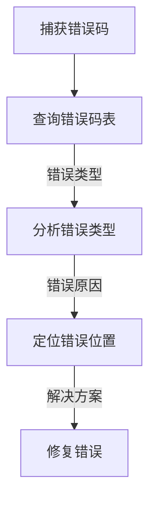
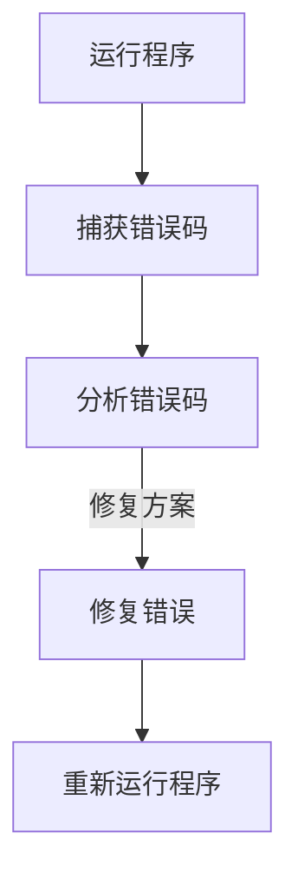

                 

### 文章标题：错误码的处理

#### 关键词：错误码、处理、软件开发、异常、日志、诊断、解决策略

> 摘要：本文深入探讨了错误码的处理方法，从基础概念出发，详细介绍了错误码的产生机制、处理原则、捕获与记录技术、分析与诊断方法，以及解决与修复策略。通过实例讲解和实战案例分析，帮助读者全面掌握错误码的处理技巧，提高软件系统的稳定性和可靠性。

---

# 第一部分：基础篇

## 1.1 错误码的基本概念

### 1.1.1 什么是错误码

错误码是一种用于标识错误类型和原因的代码，通常由数字或字符串组成。它是软件和系统中一种重要的机制，用于记录和传达程序运行中的异常情况。

错误码的基本作用包括：

1. **定位错误**：错误码可以帮助开发人员快速定位错误发生的位置。
2. **传达错误信息**：通过错误码，系统能够向用户或开发人员传达有关错误的具体信息。
3. **错误跟踪**：错误码可以用于跟踪错误发生的时间和上下文，有助于后续的分析和修复。

### 1.1.2 错误码的作用

错误码在软件开发和系统维护中扮演着重要角色，其作用体现在以下几个方面：

1. **提高软件质量**：通过错误码，开发人员可以更容易地发现和修复软件中的问题，从而提高软件的质量。
2. **优化用户体验**：错误码能够为用户提供详细的错误信息，帮助用户更好地理解问题，并采取相应的措施。
3. **降低维护成本**：错误码使得错误处理和调试变得更加高效，从而降低了软件维护的成本。

### 1.1.3 错误码的分类

根据不同的分类标准，错误码可以分为多种类型，例如：

1. **按错误来源分类**：可分为软件错误码、硬件错误码和网络错误码等。
2. **按错误类型分类**：可分为运行时错误、编译时错误、逻辑错误等。
3. **按错误级别分类**：可分为致命错误、警告和提示等。

## 1.2 错误码的产生机制

### 1.2.1 软件错误与错误码

软件错误是导致错误码产生的最常见原因。当程序运行时，如果出现不符合预期的行为，就会生成相应的错误码。

软件错误通常可以分为以下几类：

1. **语法错误**：程序代码中的语法错误会导致编译失败。
2. **逻辑错误**：程序逻辑错误会导致程序运行结果与预期不符。
3. **资源错误**：程序在运行时可能会遇到资源不足的问题，如内存溢出、文件未找到等。

### 1.2.2 硬件错误与错误码

硬件错误，如硬件故障、设备冲突等，也可能导致错误码的产生。例如，当计算机内存条损坏时，可能会导致程序运行错误。

### 1.2.3 网络错误与错误码

网络错误，如网络中断、超时、数据包丢失等，也可能导致错误码的产生。在网络应用中，错误码通常用于标识网络连接问题或数据传输错误。

## 1.3 错误码处理原则

### 1.3.1 错误码处理的必要性

错误码处理在软件开发和系统维护中至关重要。它有助于：

1. **提高软件稳定性**：及时处理错误码可以减少软件崩溃和异常情况的发生。
2. **优化用户体验**：错误码处理能够为用户提供清晰的错误信息，帮助他们解决问题。
3. **降低维护成本**：通过有效的错误码处理，可以缩短错误排查和修复时间，降低维护成本。

### 1.3.2 错误码处理的策略

错误码处理策略主要包括以下方面：

1. **错误码捕获**：在程序中设置错误码捕获机制，以便及时记录和处理错误。
2. **错误码记录**：将错误码和相关上下文信息记录在日志文件中，以便后续分析。
3. **错误码分析**：对错误码进行分析，找出错误原因，制定解决方案。
4. **错误码解决**：根据分析结果，采取相应的措施解决错误码问题。

### 1.3.3 错误码处理的最佳实践

错误码处理的最佳实践包括：

1. **定义明确的错误码**：为每个错误类型定义明确的错误码，以便于识别和解决。
2. **详细的错误信息**：提供详细的错误信息，包括错误码、错误原因和解决建议。
3. **自动化处理**：利用自动化工具对错误码进行处理，提高处理效率和准确性。
4. **持续改进**：定期回顾错误码处理过程，根据实际情况进行调整和优化。

---

（以下是第二部分的详细内容，包括技术篇和实战篇，将在后续步骤中逐步完成）

---

# 第二部分：技术篇

## 2.1 错误码的捕获与记录

### 2.1.1 错误码的捕获

错误码的捕获是指程序在运行过程中，对出现的错误进行识别和记录。捕获错误码通常涉及以下步骤：

1. **异常处理**：通过异常处理机制，如try-catch语句，捕获程序运行中的异常。
2. **错误检测**：利用内置的错误检测函数或库，如assert()函数，检测程序中的潜在错误。
3. **日志记录**：将捕获的错误码和相关上下文信息记录在日志文件中，以便后续分析。

### 2.1.2 错误码的记录

错误码的记录是指将捕获的错误码及其相关信息存储在日志文件中，以便进行后续分析。记录错误码通常涉及以下步骤：

1. **日志文件配置**：配置日志文件的存储路径、文件格式和日志级别等参数。
2. **日志记录**：利用日志记录函数或库，将错误码和相关上下文信息写入日志文件。
3. **日志分析**：定期分析日志文件，找出错误发生的原因和规律。

### 2.1.3 错误码的跟踪

错误码的跟踪是指对错误码进行持续监控和记录，以便在出现问题时进行快速定位和解决。跟踪错误码通常涉及以下步骤：

1. **错误码监控**：利用监控工具或API，实时监控错误码的发生情况。
2. **错误码记录**：将监控到的错误码和相关信息记录在数据库或日志文件中。
3. **错误码分析**：定期分析错误码数据，找出错误发生的原因和规律。

## 2.2 错误码的分析与诊断

### 2.2.1 错误码的分析方法

错误码的分析方法是指通过对错误码进行解析和分析，找出错误发生的原因。常见的方法包括：

1. **直接分析**：直接查看错误码的值，根据预定义的错误码表，找出对应的错误类型和原因。
2. **统计分析**：对一段时间内捕获的错误码进行统计分析，找出错误发生的频率和趋势。
3. **关联分析**：将错误码与其他系统指标（如CPU使用率、内存使用率等）进行关联分析，找出错误发生的根本原因。

### 2.2.2 错误码的诊断流程

错误码的诊断流程是指根据错误码和相关日志信息，找出错误发生的原因和解决方法。常见流程包括：

1. **错误码捕获**：捕获错误码，并将其记录在日志文件中。
2. **错误码分析**：分析错误码，找出错误类型和原因。
3. **错误定位**：根据错误码和日志信息，定位错误发生的位置。
4. **错误修复**：根据诊断结果，采取相应的措施修复错误。

### 2.2.3 常见错误码分析案例

以下是一个常见的错误码分析案例：

1. **捕获错误码**：程序运行时，捕获到错误码。
2. **查询错误码表**：根据错误码查询错误码表，确定错误类型。
3. **分析错误类型**：分析错误类型，找出错误原因。
4. **定位错误位置**：根据错误信息和日志文件，定位错误发生的具体位置。
5. **修复错误**：根据解决方案，修复错误。

## 2.3 错误码的解决与修复

### 2.3.1 错误码的解决策略

错误码的解决策略是指根据错误码和分析结果，制定相应的解决方案。常见策略包括：

1. **重试**：在捕获到错误码后，重新执行操作，以解决临时错误。
2. **跳过**：在捕获到错误码后，跳过错误操作，继续执行后续操作。
3. **修复**：根据错误码和分析结果，修复错误，确保程序正常运行。

### 2.3.2 错误码的修复方法

错误码的修复方法是指根据错误码和分析结果，采取具体的措施修复错误。常见方法包括：

1. **代码修复**：修复程序中的错误代码，确保程序正常运行。
2. **参数调整**：调整程序运行参数，解决由于参数设置不当引起的错误。
3. **系统升级**：升级软件或硬件系统，解决由于系统版本过低引起的错误。

### 2.3.3 错误码修复的实战案例

以下是一个错误码修复的实战案例：

1. **运行程序**：程序开始运行。
2. **捕获错误码**：程序捕获到错误码。
3. **分析错误码**：分析错误码，找出错误原因。
4. **修复错误**：根据分析结果，修复错误。
5. **重新运行程序**：修复后重新运行程序，验证错误是否已解决。

---

（以下是第三部分的详细内容，包括实战篇和附录，将在后续步骤中逐步完成）

---

# 第三部分：实战篇

## 3.1 错误码处理系统搭建

### 3.1.1 系统架构设计

错误码处理系统的架构设计包括以下几个方面：

1. **前端界面**：提供用户操作界面，用于输入错误码、查看错误信息和日志。
2. **后端服务**：处理用户请求，查询错误码表、分析错误码、记录日志等。
3. **数据库**：存储错误码表、日志信息等数据。

### 3.1.2 系统模块划分

错误码处理系统可以划分为以下几个模块：

1. **错误码查询模块**：提供错误码查询功能，支持按错误码、错误类型等查询条件查询错误信息。
2. **错误码分析模块**：分析错误码，找出错误原因，生成诊断报告。
3. **日志记录模块**：记录错误码和相关日志信息，支持日志查询和统计。
4. **错误码修复模块**：根据诊断结果，提供修复建议，支持错误码修复。

### 3.1.3 系统功能实现

错误码处理系统的功能实现包括以下几个方面：

1. **错误码查询**：实现错误码查询功能，支持按多种查询条件检索错误码信息。
2. **错误码分析**：实现错误码分析功能，根据错误码和日志信息，生成诊断报告。
3. **日志记录**：实现日志记录功能，将错误码和相关日志信息记录在数据库中。
4. **错误码修复**：实现错误码修复功能，根据诊断结果，提供修复建议，支持自动修复和手动修复。

## 3.2 错误码处理案例分析

### 3.2.1 案例一：Web服务错误码处理

Web服务错误码处理主要包括以下几个方面：

1. **错误码捕获**：通过异常处理机制，捕获Web服务运行过程中的错误。
2. **错误码记录**：将捕获到的错误码和相关日志信息记录在日志文件中。
3. **错误码分析**：分析错误码，找出错误原因。
4. **错误码解决**：根据分析结果，采取相应的措施解决错误。

### 3.2.2 案例二：数据库错误码处理

数据库错误码处理主要包括以下几个方面：

1. **错误码捕获**：通过数据库连接池和异常处理机制，捕获数据库操作过程中的错误。
2. **错误码记录**：将捕获到的错误码和相关日志信息记录在日志文件中。
3. **错误码分析**：分析错误码，找出错误原因。
4. **错误码解决**：根据分析结果，采取相应的措施解决错误。

### 3.2.3 案例三：操作系统错误码处理

操作系统错误码处理主要包括以下几个方面：

1. **错误码捕获**：通过操作系统提供的错误报告功能，捕获操作系统运行过程中的错误。
2. **错误码记录**：将捕获到的错误码和相关日志信息记录在日志文件中。
3. **错误码分析**：分析错误码，找出错误原因。
4. **错误码解决**：根据分析结果，采取相应的措施解决错误。

## 3.3 错误码处理工具推荐

### 3.3.1 常见错误码处理工具介绍

常见错误码处理工具包括以下几种：

1. **Log4j**：一款流行的日志框架，支持日志记录、分析和管理。
2. **ELK Stack**：包括Elasticsearch、Logstash和Kibana三个组件，用于日志收集、存储和可视化。
3. **Grafana**：一款开源的监控和分析工具，支持日志监控、图表展示和告警功能。

### 3.3.2 错误码处理工具的比较

不同错误码处理工具在功能、性能和易用性方面存在差异，用户可以根据实际需求选择合适的工具。以下是几种常见工具的比较：

1. **Log4j**：
   - 优点：简单易用，功能强大。
   - 缺点：日志处理性能较低，扩展性较差。
2. **ELK Stack**：
   - 优点：强大的日志处理和存储能力，可扩展性强。
   - 缺点：配置复杂，学习成本较高。
3. **Grafana**：
   - 优点：界面友好，易于使用。
   - 缺点：日志处理能力较弱，依赖其他组件。

### 3.3.3 错误码处理工具的使用指南

以下是一个简单的错误码处理工具使用指南：

1. **安装**：下载并安装所选错误码处理工具。
2. **配置**：根据需要配置日志文件、日志级别和错误码表等参数。
3. **捕获**：在程序中设置错误码捕获和记录机制。
4. **分析**：定期分析日志文件，找出错误发生的原因。
5. **解决**：根据分析结果，采取相应的措施解决错误。

---

# 附录

## A.1 错误码处理常见问题与解答

以下是一些常见的错误码处理问题及解答：

1. **问题：为什么我的程序没有捕获到错误码？**
   - 解答：可能原因包括错误码捕获机制未设置、异常处理代码未执行、错误发生的位置不在捕获范围内等。检查代码，确保错误码捕获和记录机制正确设置。

2. **问题：如何查看错误码的详细信息？**
   - 解答：通常可以通过查看日志文件或使用错误码查询工具来查看错误码的详细信息。在日志文件中，错误码通常会伴随错误描述、错误时间和其他相关信息。

3. **问题：如何解决错误码问题？**
   - 解答：解决错误码问题的方法包括重试操作、修复代码错误、调整系统参数等。根据错误码和分析结果，采取相应的解决策略。

## A.2 错误码处理参考资料

以下是一些关于错误码处理的参考资料：

1. 《Effective Error Handling in Software Development》
   - 作者：David Thomas和Andrew Hunt
   - 简介：介绍错误码处理原则和方法，帮助开发人员提高软件质量。

2. 《Error Handling in C#》
   - 作者：Rick Delaney
   - 简介：介绍C#中的错误码处理机制，包括异常处理、日志记录等。

3. 《Linux System Programming》
   - 作者：Robert Love
   - 简介：介绍Linux操作系统中错误码处理的方法和技巧。

4. 《Web Services Error Handling》
   - 作者：Joe Fawcett
   - 简介：介绍Web服务中的错误码处理和异常处理策略。

---

# 作者

作者：AI天才研究院/AI Genius Institute & 禅与计算机程序设计艺术 /Zen And The Art of Computer Programming

感谢您的阅读，希望本文对您在错误码处理方面有所帮助。如果您有任何疑问或建议，欢迎在评论区留言。

