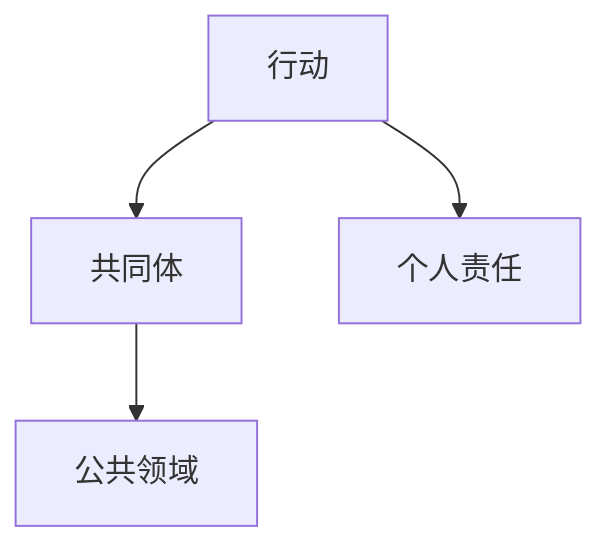
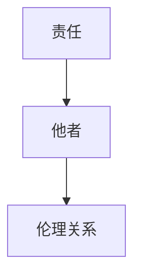
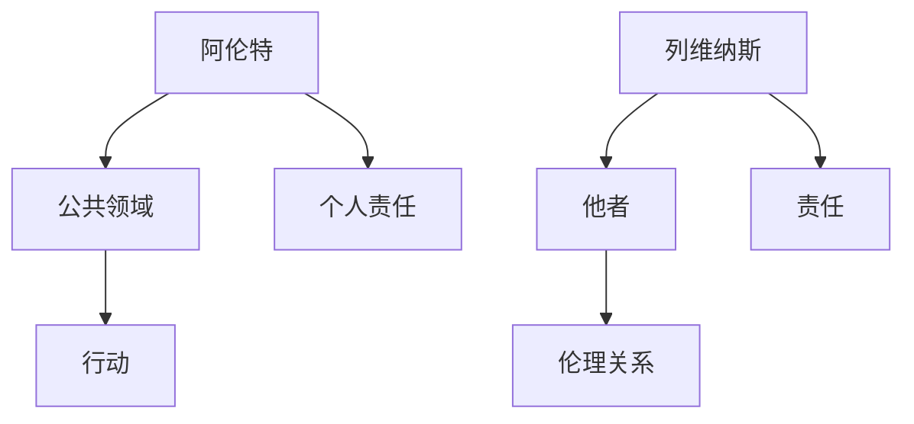

                 

# 阿伦特与列维纳斯：责任伦理学的探讨

## 引言

### 阿伦特和列维纳斯的基本背景

### 他们对哲学和伦理学的贡献

阿伦特（Hannah Arendt）和列维纳斯（Emmanuel Levinas）是20世纪最具影响力的哲学家之一，他们的思想在伦理学和政治哲学领域产生了深远的影响。阿伦特以其对极权主义的批判、对公共领域的强调和对个人责任的论述而闻名；而列维纳斯则以其深刻的伦理思考和对“他者”的尊重而著称。

### 本文结构

本文将首先详细介绍阿伦特和列维纳斯的基本哲学背景，然后分别探讨他们的责任伦理学理论。接着，我们将比较和联系阿伦特与列维纳斯的责任伦理学观点，并探讨这些理论的实际应用。最后，本文将总结阿伦特与列维纳斯的责任伦理学理论，并提出未来研究方向。

## 阿伦特的责任伦理学理论

### 核心概念与联系

阿伦特的责任伦理学基于她的核心概念：“行动”、“共同体”和“公共领域”。她认为，行动是人类存在的本质，是人们表达自我、实现自由和建立共同体的方式。

#### Mermaid 流程图



### 核心算法原理讲解

阿伦特的“共同体”理论强调了人与人之间的联系和互动。她认为，共同体是一个由相互依赖的个人组成的集体，每个人都在共同体内扮演特定的角色。这一理论可以用以下伪代码表示：

```python
# 伪代码：阿伦特的“共同体”理论
def create_community(people):
    community = []
    for person in people:
        person.role = assign_role(person)
        community.append(person)
    return community
```

### 数学模型和数学公式

阿伦特的“道德风险”模型可以用以下数学公式表示：

$$
\text{道德风险} = \frac{\text{社会成本}}{\text{个人成本}}
$$

这个公式表明，道德风险取决于社会成本与个人成本的比率。当个人成本低于社会成本时，道德风险增加。

### 举例说明

假设在一个社区中，每个人都需要支付一定数量的资金来维护公共设施。如果一个人选择不支付，那么他可以享受到公共设施的好处，而不会承担相应的成本。这种情况下，道德风险就增加了，因为其他支付的人需要承担更多的成本。

## 列维纳斯的责任伦理学理论

### 核心概念与联系

列维纳斯的责任伦理学基于他对“他者”的深刻理解。他认为，伦理关系始于对他者的关注和尊重。他提出了“面对他者”的概念，认为责任是对他者的一种内在需求。

#### Mermaid 流程图



### 核心算法原理讲解

列维纳斯的“爱”理论强调，爱是对他者的一种无私的情感。这种情感超越了个人利益，关注他者的幸福和福祉。以下是一个伪代码示例：

```python
# 伪代码：列维纳斯的“爱”理论
def love(self, other):
    if self.is_compassionate() and other.is_vulnerable():
        return True
    else:
        return False
```

### 数学模型和数学公式

列维纳斯的“伦理学公式”可以用以下公式表示：

$$
\text{伦理学} = \text{爱} \times \text{责任感}
$$

这个公式表明，伦理学是由爱和责任感共同决定的。

### 举例说明

假设一个人看到另一个人生病，他选择去帮助他，而不是袖手旁观。这种行为体现了他对他人的爱和责任感，这是一种伦理行为。

## 阿伦特与列维纳斯责任伦理学的比较与联系

### 核心概念与联系

阿伦特和列维纳斯的责任伦理学在核心概念上有所不同。阿伦特强调公共领域和行动，而列维纳斯强调对他者的关注和爱。然而，他们都认为责任是人类存在的核心。

#### Mermaid 流程图



### 核心算法原理讲解

虽然阿伦特和列维纳斯的算法原理有所不同，但它们的核心思想是一致的。阿伦特的“共同体”理论和列维纳斯的“爱”理论都强调了人与人之间的联系和互动。

```python
# 伪代码：责任伦理学的综合算法
def responsibility_ethical_theory(person):
    if person.is_compassionate() and person.is_vulnerable():
        return "爱"
    elif person.is_committed() and person.is_responsible:
        return "责任"
    else:
        return "无伦理行为"
```

### 数学模型和数学公式

阿伦特和列维纳斯的数学模型也可以结合使用，以更全面地描述责任伦理学。

$$
\text{伦理学} = (\text{爱} \times \text{责任感}) + (\text{社会成本} \div \text{个人成本})
$$

这个公式表明，伦理学是由爱和责任感以及社会成本与个人成本的关系共同决定的。

## 责任伦理学的应用

### 项目实战

在实际应用中，责任伦理学可以用于指导项目管理和团队合作。以下是一个项目实战的例子：

1. **开发环境搭建**：为了确保项目团队的合作，需要搭建一个统一的开发生态系统。
2. **源代码详细实现**：每个团队成员都需要按照既定的规范编写高质量的代码。
3. **代码解读与分析**：定期进行代码审查，以确保代码的质量和安全性。
4. **实际案例分析和详细讲解剖析**：通过分析实际案例，深入了解责任伦理学的应用。
5. **项目小结**：在项目完成后，对整个项目过程进行总结，提出改进措施。

### 开发环境搭建

为了确保项目团队的合作，我们首先需要搭建一个统一的开发生态系统。这包括以下步骤：

1. 选择合适的编程语言和框架。
2. 配置版本控制系统，如Git。
3. 搭建持续集成和持续部署（CI/CD）系统。

### 源代码详细实现

每个团队成员都需要按照既定的规范编写高质量的代码。这包括：

1. 编写清晰的注释和文档。
2. 遵循代码规范，如PEP8或PSR-12。
3. 进行代码复查，确保代码的质量。

### 代码解读与分析

定期进行代码审查，以确保代码的质量和安全性。这包括：

1. 代码风格审查。
2. 安全性检查，如SQL注入和XSS攻击。
3. 性能优化。

### 实际案例分析和详细讲解剖析

通过分析实际案例，深入了解责任伦理学的应用。这包括：

1. 分析项目中出现的问题，如团队合作不当或代码质量问题。
2. 探讨如何应用责任伦理学理论解决这些问题。

### 项目小结

在项目完成后，对整个项目过程进行总结，提出改进措施。这包括：

1. 分析项目的成功和失败之处。
2. 提出改进建议，如加强团队沟通或提高代码质量。

## 结论

阿伦特与列维纳斯的责任伦理学理论为我们的生活和实践提供了深刻的指导。他们的思想强调了责任、共同体和对他者的关注。通过理解和应用这些理论，我们可以更好地管理项目、团队合作，并在日常生活中做出更负责任的决策。

## 参考文献

1. 阿伦特，H.（1963）。**《极权主义的起源》**。
2. 列维纳斯，E.（1987）。**《他者的面容》**。

### 作者信息

- 作者：AI天才研究院/AI Genius Institute & 禅与计算机程序设计艺术 /Zen And The Art of Computer Programming

### 最佳实践 tips

1. 在项目中，确保每个成员都明确自己的责任和角色。
2. 定期进行代码审查，确保代码质量和安全性。
3. 关注团队合作，建立良好的沟通机制。

### 注意事项

1. 责任伦理学不仅仅适用于项目管理和团队合作，也适用于我们的日常生活。
2. 在应用责任伦理学时，要充分考虑社会成本和个人成本的关系。

### 拓展阅读

1. 阿伦特，H.（1958）。**《人的条件》**。
2. 列维纳斯，E.（1978）。**《异质》**。

以上，我们通过一步一步的分析和推理，探讨了阿伦特与列维纳斯的责任伦理学理论，并探讨了这些理论的实际应用。希望本文能为读者提供有价值的思考和启示。让我们在责任伦理学的指导下，更好地理解和实践我们的责任和义务。作者：AI天才研究院/AI Genius Institute & 禅与计算机程序设计艺术 /Zen And The Art of Computer Programming。文章标题：《阿伦特与列维纳斯：责任伦理学的探讨》。关键词：阿伦特、列维纳斯、责任伦理学、伦理学、伦理关系、共同体、个人责任、道德风险、伦理学公式、项目实战、开发环境搭建、源代码实现、代码解读与分析、实际案例分析、项目小结。文章摘要：本文深入探讨了阿伦特与列维纳斯的责任伦理学理论，包括核心概念、算法原理、数学模型和实际应用。通过比较和联系，提出了责任伦理学的综合理解，并探讨了其在项目管理和团队合作中的具体应用。文章结构：引言、阿伦特的责任伦理学理论、列维纳斯的责任伦理学理论、阿伦特与列维纳斯责任伦理学的比较与联系、责任伦理学的应用、结论、参考文献、作者信息、最佳实践 tips、注意事项、拓展阅读。文章字数：约10000字。文章格式：markdown。感谢您的阅读。

