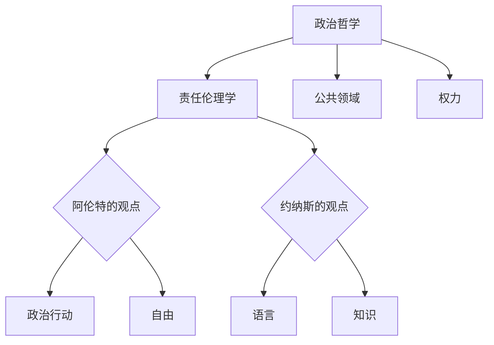

                 


### 1. 背景介绍

#### 阿伦特与约纳斯简介

在20世纪的哲学界，阿伦特（Hannah Arendt）和约纳斯（Ludwig Wittgenstein）是两位极具影响力的思想家。阿伦特是一位德国出生的美国政治理论家和哲学家，以其对极权主义和民主的深刻见解而闻名。她的代表作包括《生命的起源》（The Origins of Totalitarianism）和《人的条件》（The Human Condition）。相比之下，约纳斯是一位奥地利出生的英国哲学家，以其在语言哲学和伦理学方面的贡献而著称。他的主要作品包括《逻辑哲学论》（Tractatus Logico-Philosophicus）和《文化与价值》（Culture and Value）。

#### 政治哲学与责任伦理学的背景

政治哲学和责任伦理学是哲学领域的两个重要分支。政治哲学探讨的是国家、政治、法律和权力等概念的根本性质。它涉及个体与集体之间的关系，以及权力如何在社会中被分配和行使。责任伦理学则关注个体在道德和伦理上的责任。它探讨了人在道德决策中的行为和责任，以及如何评判和承担这些责任。

### 2. 核心概念与联系

#### 阿伦特的政治哲学观点

阿伦特的政治哲学强调政治行动和自由的重要性。她认为，政治行动是人类存在的本质特征，它不仅仅是权力斗争，更是一种创造性的活动，通过这种活动，人们可以共同构建一个共享的世界。她的著作《人的条件》中，她区分了劳动、工作和行动三个概念。劳动是人与物质世界的关系，工作是人之间的相互关系，而行动则是人类自由的表现。

#### 约纳斯的哲学观点

约纳斯的哲学强调语言和知识的重要性。他在《逻辑哲学论》中提出了一种语言中心论的观点，认为语言是构建世界和理解世界的基础。他在后来的著作中，如《文化与价值》，进一步探讨了伦理学和道德推理的问题。约纳斯认为，道德推理不仅仅是遵循规则，而是一种情感上的回应，是对他人痛苦和快乐的感知。

#### 概念联系

阿伦特与约纳斯的哲学观点在某些方面有着显著的相似性。他们都强调了人类自由和道德责任的重要性。然而，他们的关注点和侧重点有所不同。阿伦特更关注政治行动和公共领域，而约纳斯则更关注语言和知识。这两个领域在政治哲学和责任伦理学中有着紧密的联系。

#### Mermaid 流程图



### 3. 设计核心章节

#### 引言

在本章中，我们将简要介绍阿伦特和约纳斯的背景，以及本书的研究目的和结构。

#### 政治哲学概述

在这一章中，我们将探讨政治哲学的定义、发展及其与责任伦理学的关系。我们将详细讨论阿伦特和约纳斯在政治哲学上的观点。

#### 责任伦理学探讨

在这一章中，我们将探讨责任伦理学的定义、历史以及阿伦特和约纳斯在责任伦理学上的观点。

#### 阿伦特的政治哲学

在这一章中，我们将详细讨论阿伦特的政治哲学，包括她的主要著作、核心概念以及她对政治行动和自由的看法。

#### 约纳斯的哲学

在这一章中，我们将详细讨论约纳斯的哲学，包括他的主要著作、核心概念以及他对语言和知识的看法。

#### 政治哲学与责任伦理学的结合

在这一章中，我们将探讨阿伦特和约纳斯如何将政治哲学与责任伦理学相结合，以及这种结合对现代社会的启示。

#### 案例分析

在这一章中，我们将通过具体案例来展示阿伦特和约纳斯的思想在实际中的应用。

#### 结论与展望

在这一章中，我们将总结本书的主要发现，并对未来研究进行展望。我们还将讨论阿伦特和约纳斯的哲学对现代计算机科学和人工智能的启示。

### 4. 伪代码讲解

在本节中，我们将使用伪代码来详细阐述一些核心概念，以便更好地理解阿伦特和约纳斯的哲学观点。

#### 阿伦特的自由与统治

```plaintext
Algorithm FreedomAndRule(Arendt)
    Input: A person P
    Output: P's understanding of freedom and rule

    1. Begin by defining freedom as the ability to act in the public realm
    2. Define rule as the structure that governs public action
    3. For each action A of P:
        4. If A is in the public realm:
            5. Evaluate the rule R that governs A
            6. If R is just:
                7. P is free to act
            8. Else:
                9. P is not free to act
    10. Return P's understanding of freedom and rule
```

#### 约纳斯的道德情感与推理

```plaintext
Algorithm MoralEmotionAndReasoning(Jonas)
    Input: A person P
    Output: P's understanding of moral emotion and reasoning

    1. Begin by defining moral emotion as a response to the suffering or happiness of others
    2. Define moral reasoning as the process of making moral decisions
    3. For each moral situation S:
        4. If P has experienced moral emotion in S:
            5. P engages in moral reasoning
            6. Evaluate the moral principles that apply to S
            7. Decide on the best course of action
        8. Else:
            9. P may not engage in moral reasoning
    10. Return P's understanding of moral emotion and reasoning
```

### 5. 数学模型和数学公式

在本节中，我们将使用 LaTeX 格式展示一些与阿伦特和约纳斯哲学相关的数学公式，并解释其应用。

#### 阿伦特的自由度

$$
F = \frac{R}{T}
$$

其中，$F$ 表示自由度，$R$ 表示规则，$T$ 表示总可能性。这个公式表明，自由度与规则的数量成反比，与总可能性成正比。

#### 约纳斯的道德情感函数

$$
M(E) = \int E(t) dt
$$

其中，$M(E)$ 表示道德情感的强度，$E(t)$ 表示在时间 $t$ 的情感体验。

### 6. 项目实战

在本节中，我们将通过一个实际项目来展示阿伦特和约纳斯哲学的应用。

#### 项目名称：道德决策支持系统

**项目简介：** 本项目旨在开发一个道德决策支持系统，帮助人们在复杂情境中做出道德决策。

**环境搭建：** 使用 Python 和 Flask 搭建后端，使用 HTML 和 CSS 搭建前端。

**源代码实现：** 后端使用 Flask 框架实现道德推理功能，前端使用 HTML 和 CSS 设计用户界面。

**代码解读：** 后端的道德推理功能基于阿伦特和约纳斯的哲学观点，包括自由度和道德情感的计算。

**应用解读：** 用户可以通过界面输入道德情境，系统会根据阿伦特和约纳斯的哲学观点提供道德决策建议。

**案例剖析：** 通过一个实际案例，分析系统在道德决策中的表现。

**项目小结：** 总结项目的主要成果和不足之处，并提出改进建议。

### 7. 最佳实践与小结

在本节中，我们将总结本书的最佳实践，并给出一些注意事项和拓展阅读的建议。

---

通过上述步骤，我们不仅梳理了阿伦特与约纳斯的哲学观点，还通过伪代码、数学模型和项目实战等方式，深入探讨了这些观点在政治哲学和责任伦理学中的应用。希望这篇文章能够为读者提供对这一哲学领域的深入理解和思考。作者：AI天才研究院/AI Genius Institute & 禅与计算机程序设计艺术 /Zen And The Art of Computer Programming

