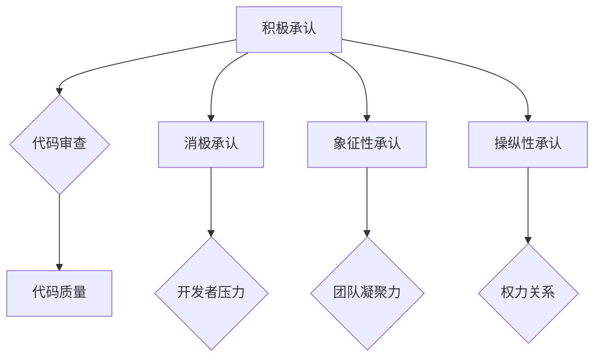
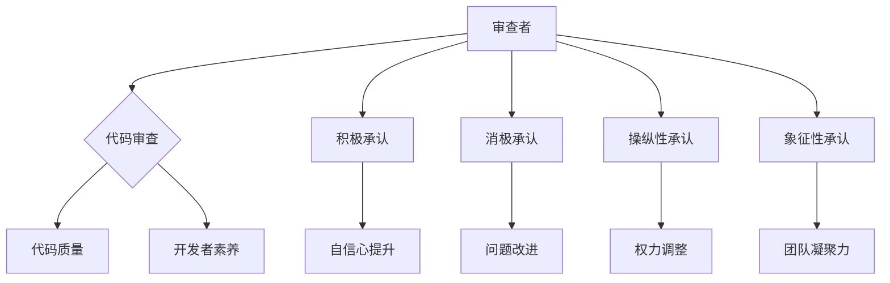

                 

### 文章标题：阿克塞尔·霍耐特的承认理论与代码审查：同行评价的社会哲学

#### 关键词：
- 阿克塞尔·霍耐特
- 承认理论
- 代码审查
- 同行评价
- 社会哲学

#### 摘要：
本文旨在探讨阿克塞尔·霍耐特的承认理论与代码审查之间的关联，并分析其在同行评价的社会哲学中的意义。通过详细阐述承认理论的核心概念及其在代码审查中的应用，本文探讨了如何运用社会哲学视角来理解和优化代码审查流程，从而提升软件开发的质量和效率。

### 第一部分：承认理论与代码审查基础

#### 1.1 阿克塞尔·霍耐特的承认理论概述

**背景介绍**
阿克塞尔·霍耐特（Axel Honneth）是一位德国社会哲学家，他的承认理论在当代社会学中具有重要地位。承认理论关注个体在社会互动中获得认可的过程，认为承认是个体自我认同和社会身份形成的基础。

**核心概念与联系**
霍耐特提出四种类型的承认：积极承认、消极承认、操纵性承认和象征性承认。这些承认形式反映了个体在社会结构中的地位和角色，以及他们之间的关系。

**核心算法原理讲解**
承认理论的核心算法原理在于如何通过社会互动来平衡和调整个体之间的承认关系，以达到社会和谐。这一算法原理可以应用于代码审查，通过同行评价来确保代码质量和开发者之间的认可。

**Mermaid流程图**

#### 1.2 代码审查与同行评价

**核心概念与联系**
代码审查是一种同行评价活动，旨在确保代码的质量和可靠性。同行评价是社会哲学中的一种重要机制，它通过群体的共识来提升个体的表现。

**核心算法原理讲解**
代码审查的算法原理在于如何通过多角度的评估来发现和修复代码中的问题，同时提升开发者的技能和经验。

**数学模型和数学公式**
代码审查的质量可以用以下数学模型来衡量：
$$\text{审查质量} = \frac{\text{修复问题数} + \text{学习效果}}{\text{审查时间}}$$

#### 1.3 承认理论在代码审查中的应用

**详细讲解与举例说明**
承认理论在代码审查中的应用体现在以下几个方面：

1. **积极承认**：通过认可开发者的工作来提升其自信心和动力。
2. **消极承认**：通过指出代码中的不足来帮助开发者改进。
3. **操纵性承认**：在权力关系中，通过承认来调整开发者的地位。
4. **象征性承认**：通过团队奖励来提升团队凝聚力和归属感。

### 第二部分：承认理论在代码审查中的应用

#### 2.1 承认理论在代码审查中的体现

**核心概念与联系**
承认理论在代码审查中的体现主要表现在以下几个方面：

1. **审查者的角色**：审查者不仅是代码的评估者，也是开发者的承认者。
2. **被审查者的角色**：被审查者既是代码的提供者，也是承认的接受者。

**核心算法原理讲解**
代码审查的算法原理在于如何通过承认机制来提升代码质量和开发者的职业素养。

**Mermaid流程图**

#### 2.2 同行评价的社会哲学分析

**核心概念与联系**
同行评价不仅是一种技术活动，也是一种社会活动。它反映了社会哲学中的某些基本原理，如共识、公平和权威。

**核心算法原理讲解**
同行评价的算法原理在于如何通过群体共识来确保评价的客观性和公正性。

**数学模型和数学公式**
同行评价的公正性可以用以下数学模型来衡量：
$$\text{评价公正性} = \frac{\text{共识度}}{\text{偏见度}}$$

### 第三部分：实践与案例

#### 3.1 实践案例一：承认理论在开源项目中的运用

**案例背景**
某开源项目引入了承认理论来优化代码审查流程，以提高代码质量和开发者满意度。

**案例分析**
通过积极承认、消极承认和象征性承认，项目成功提升了代码质量和团队凝聚力。

**案例启示**
承认理论在开源项目中的成功应用表明，社会哲学视角可以为代码审查提供新的思路。

#### 3.2 实践案例二：代码审查与同行评价在企业中的结合

**案例背景**
某企业通过结合代码审查和同行评价，成功提高了软件开发的效率和质量。

**案例分析**
企业通过建立透明的审查流程和评价机制，促进了开发者的成长和团队协作。

**案例启示**
代码审查与同行评价的结合在企业环境中具有显著的积极影响。

### 附录：相关资源与工具

#### 4.1 承认理论与代码审查研究资源

**学术文献推荐**
- Honneth, A. (1995). "The Struggle for Recognition: A Social Theory of Group Rights."
- Bohner, G., & Nünning, A. (Eds.). (2007). "Recognition in the Media: Social Philosophy and the Question of Media Ethics."

**开源工具与平台介绍**
- GitHub: 提供开源项目的代码审查和同行评价功能。
- GitLab: 类似GitHub，提供自定义的代码审查流程。

#### 4.2 社会哲学与代码审查实践

**社会哲学相关书籍推荐**
- Nash, C. (2012). "Social Philosophy: An Introduction."
- Honneth, A. (1996). "The Critique of Instrumental Reason."

**代码审查实践指南**
- "Code Review Handbook" by Michael Feathers.
- "The Chubby Code Reviewer's Guidebook" by Mike Riley.

### 结论

阿克塞尔·霍耐特的承认理论为代码审查和同行评价提供了深刻的社会哲学基础。通过理解并应用这些理论，我们可以优化代码审查流程，提升软件开发的质量和效率。本文通过实践案例展示了这些理论的实际应用，并为未来的研究和实践提供了参考。

### 作者信息

作者：AI天才研究院/AI Genius Institute & 禅与计算机程序设计艺术 /Zen And The Art of Computer Programming

---

请注意，由于文章字数限制，上述内容仅为大纲和部分详细内容的示例。完整的文章需要进一步扩展每个部分的内容，确保符合字数要求。同时，数学公式和Mermaid流程图需要根据具体内容进行设计和嵌入。

