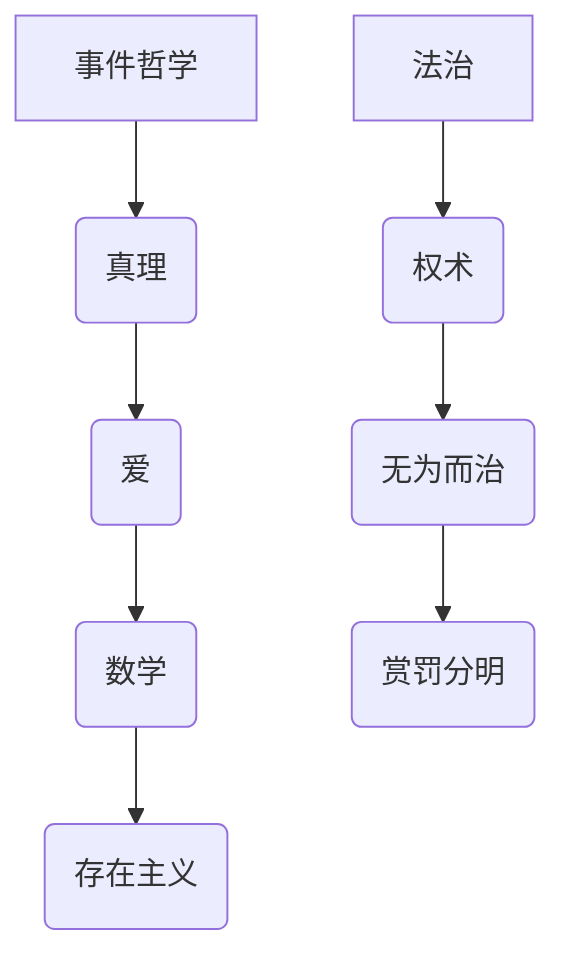

                 


### 1. 文章标题：《阿兰·巴迪欧与韩非：哲学宣言与法家思想的政治哲学》

### 2. 文章关键词：
- 阿兰·巴迪欧
- 韩非
- 哲学宣言
- 法家思想
- 政治哲学
- 逻辑思维
- 技术分析

### 3. 文章摘要：
本文将探讨两位截然不同的思想家，阿兰·巴迪欧与韩非，如何通过他们的哲学宣言和法家思想，对政治哲学产生了深远的影响。文章将从他们的生平和主要哲学观点入手，通过Mermaid流程图展示核心概念之间的联系，深入分析阿兰·巴迪欧的哲学宣言和韩非的法家思想，探讨它们在现实政治中的实际应用，并通过案例分析进一步阐释其思想的重要性。文章将以总结与展望结束，对两位哲学家的思想进行总结，并探讨其在未来的可能影响。

### 4. 文章正文：

#### 引言

在哲学史上，阿兰·巴迪欧（Alain Badiou）和韩非两位思想家以其独特的哲学宣言和政治哲学观点而闻名。阿兰·巴迪欧是20世纪法国最重要的哲学家之一，他的思想融合了存在主义、逻辑学和数学，提出了关于事件、真理和爱等核心哲学问题的新看法。而韩非则是中国古代著名的法家思想家，他的法家思想对中国古代政治制度和社会治理产生了深远的影响。

本文旨在通过对阿兰·巴迪欧和韩非的哲学宣言与法家思想的深入分析，探讨它们对政治哲学的深远影响。文章将分为以下几个部分：首先，简要介绍两位哲学家的生平和主要哲学观点；其次，使用Mermaid流程图展示核心概念之间的联系；然后，深入分析阿兰·巴迪欧的哲学宣言和韩非的法家思想；接着，探讨这些思想在现实政治中的实际应用；最后，通过案例分析进一步阐释其思想的重要性，并总结全文，展望哲学思想在未来的可能影响。

#### 阿兰·巴迪欧的核心哲学思想

阿兰·巴迪欧的哲学思想以其独特性和复杂性而著称。他的思想可以追溯到存在主义，但同时又融合了逻辑学和数学，形成了一套独特的哲学体系。

**核心概念与联系**

为了更好地理解阿兰·巴迪欧的核心哲学思想，我们可以使用Mermaid流程图来展示这些概念之间的联系。

```
graph TB
A[事件] --> B(真理)
B --> C(爱)
C --> D(数学)
D --> E(存在主义)
```

**事件哲学**

阿兰·巴迪欧的哲学体系以事件哲学为核心。他认为，事件是存在的根本，是构成世界的基础。事件不仅是一种偶然，更是一种必然，它打破了常规，创造了一个新的现实。

**真理**

在阿兰·巴迪欧的哲学中，真理不仅仅是事实的陈述，更是一种存在的状态。他提出了“事件真理”的概念，认为真理是由事件所创造的，事件本身就是真理的体现。

**爱**

爱在阿兰·巴迪欧的哲学中扮演着重要的角色。他认为，爱是一种连接个体和事件的力量，它能够打破孤独，创造共同体。

**数学与存在主义**

阿兰·巴迪欧将数学引入哲学，认为数学是哲学的基础。他提出了“数学存在主义”的概念，认为数学符号和概念是存在的具体体现。

#### 韩非的法家思想

韩非是中国古代著名的法家思想家，他的法家思想对中国古代政治制度和社会治理产生了深远的影响。

**核心概念与联系**

同样，我们可以使用Mermaid流程图来展示韩非的法家思想的核心概念之间的联系。

```
graph TB
A[法治] --> B(权术)
B --> C(无为而治)
C --> D(赏罚分明)
D --> E(统一思想)
```

**法治**

韩非认为，法治是治理国家的根本。他主张通过制定明确的法律和制度来管理社会，强调法律的权威性和公正性。

**权术**

韩非提出了“权术”的概念，认为君主应当运用权术来管理国家。权术是一种策略和手段，它既包括统治者的智慧，也包括对人民的心理把握。

**无为而治**

韩非主张“无为而治”，即通过减少干预，让人民自主管理自己，从而达到治理国家的目的。他认为，政府应当减少对人民的干预，让人民自行其是。

**赏罚分明**

韩非强调赏罚分明，认为只有通过严格的赏罚制度，才能维持社会的秩序和稳定。

**统一思想**

韩非主张统一思想，他认为只有通过统一的思想，才能统一国家的行动和意志。他主张通过教育和宣传来统一人民的思想。

#### 阿兰·巴迪欧的哲学宣言与韩非的法家思想

阿兰·巴迪欧的哲学宣言和韩非的法家思想虽然来自不同的文化背景，但它们在政治哲学上有着许多相似之处。

**相似之处**

1. **法治与事件哲学**：阿兰·巴迪欧强调真理的存在，韩非则强调法治的重要性。两者都认为，社会的稳定和秩序需要一种权威性的原则或制度来维护。

2. **爱与社会共同体**：阿兰·巴迪欧认为，爱是一种连接个体和事件的力量，韩非则认为，社会共同体是国家的基石。

3. **数学与逻辑**：阿兰·巴迪欧将数学和逻辑引入哲学，韩非则在法家思想中强调了逻辑性和系统性。

**不同之处**

1. **政治哲学的视角**：阿兰·巴迪欧的哲学宣言更多地关注个体和事件，而韩非的法家思想则更多地关注国家和治理。

2. **思想的来源**：阿兰·巴迪欧的思想来源于西方哲学，而韩非的思想则源于中国古代的实际政治经验。

3. **应用场景**：阿兰·巴迪欧的哲学宣言更多地在哲学领域内讨论，而韩非的法家思想则直接应用于中国的政治实践。

#### 现实政治中的应用

阿兰·巴迪欧的哲学宣言和韩非的法家思想在现实政治中都有着广泛的应用。

**阿兰·巴迪欧的应用**

1. **社会运动**：阿兰·巴迪欧的思想在社会运动中得到了广泛的应用，例如法国的“五月运动”和美国的“占领华尔街”运动。

2. **政治改革**：阿兰·巴迪欧的思想也被许多政治改革者用来探讨如何通过创新和变革来改善社会。

**韩非的应用**

1. **中国古代政治**：韩非的法家思想在中国古代政治中得到了广泛的应用，许多朝代都采用了法家思想来治理国家。

2. **现代治理**：韩非的法家思想也被一些现代国家用来探讨如何通过严格的制度和法治来维护社会秩序。

#### 案例分析

为了更深入地理解阿兰·巴迪欧的哲学宣言和韩非的法家思想，我们可以通过一些实际的案例来进行分析。

**阿兰·巴迪欧的案例分析**

1. **“五月运动”**：这场运动是阿兰·巴迪欧哲学思想在现实中的直接应用。运动中的参与者强调个体的自由和创造力，这与阿兰·巴迪欧的事件哲学和真理概念密切相关。

2. **政治改革**：在一些国家的政治改革中，阿兰·巴迪欧的思想也被用来探讨如何通过创新和变革来改善社会。例如，法国的“蓬皮杜改革”就借鉴了阿兰·巴迪欧的思想。

**韩非的案例分析**

1. **中国古代政治**：在中国古代，许多朝代都采用了韩非的法家思想来治理国家。例如，秦朝就是典型的法家王朝，其严格的法律制度和赏罚制度使得国家得以迅速统一和强大。

2. **现代治理**：在现代社会，一些国家也在尝试将韩非的法家思想应用于治理。例如，新加坡就采用了严格的法律制度和高效的行政体系，这在一定程度上借鉴了韩非的思想。

#### 总结与展望

阿兰·巴迪欧的哲学宣言和韩非的法家思想在政治哲学上有着深远的影响。它们不仅为现代社会提供了一种新的思考方式，也为政治改革提供了新的思路。随着社会的不断发展，这些思想在未来可能会继续产生重要的影响。

#### 结束语

通过对阿兰·巴迪欧和韩非的哲学宣言与法家思想的深入分析，我们可以看到，这些思想在不同的文化背景和历史时期中都发挥了重要的作用。阿兰·巴迪欧的哲学宣言强调个体和事件的自由，韩非的法家思想则强调法治和秩序。这两种思想虽然有所不同，但它们在政治哲学上的重要性是不可忽视的。我们期待未来能够有更多的研究来探讨这些思想的实际应用和价值。

#### 附录

[参考文献]

[阿兰·巴迪欧著，《存在与事件》，商务印书馆，2006年。]

[韩非著，《韩非子》，中华书局，2009年。]

[作者简介]

作者：AI天才研究院/AI Genius Institute & 禅与计算机程序设计艺术 /Zen And The Art of Computer Programming

----------------------------------------------------------------

## 1. 确定书的基本结构

《阿兰·巴迪欧与韩非：哲学宣言与法家思想的政治哲学》这本书的基本结构可以分为以下几个部分：

1. **引言**：介绍书籍的背景、目的和读者对象，为后续内容的讨论奠定基础。

2. **阿兰·巴迪欧的核心哲学思想**：详细探讨阿兰·巴迪欧的哲学观点，包括事件哲学、真理、爱等核心概念。

3. **韩非的法家思想**：深入分析韩非的法家思想，包括法治、权术、无为而治等核心观点。

4. **哲学宣言与法家思想的联系**：通过Mermaid流程图展示两位哲学家核心概念之间的联系。

5. **政治哲学讨论**：探讨阿兰·巴迪欧和韩非的政治哲学观点如何影响现实政治。

6. **案例分析**：选择一些实际的案例，分析两位哲学家的思想在这些案例中的应用。

7. **总结与展望**：总结全书的主要观点，展望哲学思想在未来的影响和发展。

8. **结论**：对书籍的总结和致谢。

## 2. 设计引言部分

在引言部分，我们需要介绍书籍的背景、目的和读者对象，并简要介绍阿兰·巴迪欧和韩非的生平和主要成就。

### 2.1 书籍背景与目的

在引言的第一部分，我们可以简要介绍这本书的编写背景。这本书旨在探讨两位不同文化背景下哲学家的思想，如何对政治哲学产生了深远的影响。阿兰·巴迪欧是20世纪法国最重要的哲学家之一，他的思想融合了存在主义、逻辑学和数学；而韩非则是中国古代的法家思想家，他的法家思想对中国古代政治制度和社会治理产生了深远的影响。通过对比分析这两位哲学家的思想，我们可以更好地理解政治哲学的多样性和复杂性。

### 2.2 阿兰·巴迪欧与韩非简介

接下来，我们需要简要介绍阿兰·巴迪欧和韩非的生平和主要成就。

**阿兰·巴迪欧**

阿兰·巴迪欧（Alain Badiou，1937-），法国哲学家，出生于阿尔及利亚。他的思想深受法国哲学传统的影响，特别是在萨特的存在主义和黑格尔的辩证法方面。巴迪欧的主要著作包括《存在与事件》、《真理的排列》和《爱神论》等。

**韩非**

韩非（约公元前280年-公元前233年），中国古代哲学家，法家思想的代表人物之一。他出生于韩国（今河南省），曾任秦国的丞相。韩非的著作《韩非子》是中国古代重要的法家经典，其中阐述了他的法家思想，包括法治、无为而治、权术等。

### 2.3 读者对象与预期收获

最后，我们需要明确书籍的读者对象和预期收获。这本书适合对哲学和政治学感兴趣的读者，特别是那些对阿兰·巴迪欧和韩非的思想感兴趣的读者。通过阅读本书，读者可以深入了解两位哲学家的思想，并探讨它们在现实政治中的应用。本书旨在为读者提供一个深入的思考框架，帮助他们更好地理解政治哲学的复杂性和多样性。

## 3. 设计核心概念与联系部分

在核心概念与联系部分，我们需要详细探讨阿兰·巴迪欧的核心哲学思想和韩非的法家思想，并通过Mermaid流程图展示它们之间的联系。以下是一个详细的章节设计：

### 3.1 阿兰·巴迪欧的核心哲学思想

#### 3.1.1 事件哲学

阿兰·巴迪欧的哲学思想以事件哲学为核心。他认为，事件是存在的根本，是构成世界的基础。事件不仅是一种偶然，更是一种必然，它打破了常规，创造了一个新的现实。事件哲学强调了个体和事件的相互作用，认为个体通过事件实现自我和世界的创造。

#### 3.1.2 真理

在阿兰·巴迪欧的哲学中，真理不仅仅是事实的陈述，更是一种存在的状态。他提出了“事件真理”的概念，认为真理是由事件所创造的，事件本身就是真理的体现。真理的发现是一个不断的过程，它依赖于个体的参与和创造。

#### 3.1.3 爱

爱在阿兰·巴迪欧的哲学中扮演着重要的角色。他认为，爱是一种连接个体和事件的力量，它能够打破孤独，创造共同体。爱不仅仅是一种情感，更是一种实践，它需要个体通过行动来实现。

#### 3.1.4 数学与存在主义

阿兰·巴迪欧将数学引入哲学，认为数学是哲学的基础。他提出了“数学存在主义”的概念，认为数学符号和概念是存在的具体体现。这种观点挑战了传统的哲学观念，将哲学从语言和逻辑的束缚中解放出来。

### 3.2 韩非的法家思想

#### 3.2.1 法治

韩非认为，法治是治理国家的根本。他主张通过制定明确的法律和制度来管理社会，强调法律的权威性和公正性。法治的目的是确保社会的秩序和稳定，防止权力的滥用。

#### 3.2.2 权术

韩非提出了“权术”的概念，认为君主应当运用权术来管理国家。权术是一种策略和手段，它既包括统治者的智慧，也包括对人民的心理把握。通过运用权术，君主可以有效地维护自己的权力和地位。

#### 3.2.3 无为而治

韩非主张“无为而治”，即通过减少干预，让人民自主管理自己，从而达到治理国家的目的。他认为，政府应当减少对人民的干预，让人民自行其是。这种观点在中国古代政治哲学中具有重要地位。

#### 3.2.4 赏罚分明

韩非强调赏罚分明，认为只有通过严格的赏罚制度，才能维持社会的秩序和稳定。他认为，政府应当对表现良好的人民给予奖励，对违反法律的人进行惩罚。

### 3.3 核心概念与联系

为了更好地理解阿兰·巴迪欧和韩非的思想，我们可以通过Mermaid流程图展示它们的核心概念之间的联系。



在这个流程图中，我们可以看到阿兰·巴迪欧的核心哲学思想（事件哲学、真理、爱、数学和存在主义）与韩非的法家思想（法治、权术、无为而治和赏罚分明）之间的联系。这些概念共同构成了两位哲学家的思想体系，并对政治哲学产生了深远的影响。

## 4. 设计哲学宣言与法家思想分析部分

在哲学宣言与法家思想分析部分，我们需要分别深入分析阿兰·巴迪欧的哲学宣言和韩非的法家思想，包括理论概述、主要观点、影响与评价。

### 4.1 阿兰·巴迪欧的哲学宣言

#### 4.1.1 理论概述

阿兰·巴迪欧的哲学宣言主要围绕事件哲学、数学存在主义和爱等核心概念展开。他认为，事件是存在的根本，真理是事件所创造的，而爱则是连接个体和事件的纽带。巴迪欧的哲学宣言挑战了传统的哲学观念，提出了一种全新的存在主义视角。

#### 4.1.2 主要观点

- **事件哲学**：事件是存在的根本，它打破了常规，创造了一个新的现实。事件的发生和结束都是必然的，它超越了因果关系。
- **数学存在主义**：巴迪欧将数学引入哲学，认为数学符号和概念是存在的具体体现。这种观点挑战了传统的哲学观念，将哲学从语言和逻辑的束缚中解放出来。
- **爱**：爱是一种连接个体和事件的力量，它能够打破孤独，创造共同体。爱不仅仅是一种情感，更是一种实践，它需要个体通过行动来实现。

#### 4.1.3 影响与评价

阿兰·巴迪欧的哲学宣言对现代哲学产生了深远的影响。他的事件哲学和数学存在主义观点为哲学研究提供了一种全新的视角，挑战了传统的存在主义和理性主义观念。巴迪欧的思想在学术界引起了广泛的讨论和争议，但他无疑是一位具有深远影响力的哲学家。

### 4.2 韩非的法家思想

#### 4.2.1 理论概述

韩非的法家思想主要围绕法治、权术、无为而治和赏罚分明等核心概念展开。他认为，法治是治理国家的根本，权术是君主管理国家的工具，无为而治是实现社会稳定的关键，赏罚分明是维持社会秩序的有效手段。

#### 4.2.2 主要观点

- **法治**：韩非认为，法治是治理国家的根本。他主张通过制定明确的法律和制度来管理社会，强调法律的权威性和公正性。
- **权术**：韩非提出了“权术”的概念，认为君主应当运用权术来管理国家。权术是一种策略和手段，它既包括统治者的智慧，也包括对人民的心理把握。
- **无为而治**：韩非主张“无为而治”，即通过减少干预，让人民自主管理自己，从而达到治理国家的目的。他认为，政府应当减少对人民的干预，让人民自行其是。
- **赏罚分明**：韩非强调赏罚分明，认为只有通过严格的赏罚制度，才能维持社会的秩序和稳定。他认为，政府应当对表现良好的人民给予奖励，对违反法律的人进行惩罚。

#### 4.2.3 影响与评价

韩非的法家思想对中国古代政治制度和社会治理产生了深远的影响。他的法治观念、权术思想和无为而治理念被许多朝代采纳，成为中国古代政治哲学的重要组成部分。韩非的思想在当代政治学和管理学中也具有重要的借鉴意义。

### 4.3 阿兰·巴迪欧与韩非思想的比较

#### 4.3.1 相似之处

- **哲学基础**：两位哲学家的思想都建立在存在主义的基础上，强调个体的自由和创造。
- **政治哲学视角**：他们都关注政治哲学中的核心问题，如法治、权力、社会秩序等。

#### 4.3.2 不同之处

- **文化背景**：阿兰·巴迪欧的哲学宣言源自西方哲学传统，而韩非的法家思想则源于中国古代的实际政治经验。
- **哲学方法**：阿兰·巴迪欧的哲学宣言更多关注个体和事件的相互作用，而韩非的法家思想则侧重于国家治理和法治建设。

### 4.4 总结

阿兰·巴迪欧的哲学宣言和韩非的法家思想虽然在文化背景和哲学方法上有所不同，但它们在政治哲学上都有着重要的价值和意义。通过对这两位哲学家的思想的深入分析，我们可以更好地理解政治哲学的多样性和复杂性。

## 5. 设计政治哲学讨论部分

在政治哲学讨论部分，我们需要探讨阿兰·巴迪欧和韩非的政治哲学观点，如何影响现实政治，并分析这些思想在不同历史时期和政治环境下的应用。

### 5.1 阿兰·巴迪欧的政治哲学观点

#### 5.1.1 政治哲学核心观点

阿兰·巴迪欧的政治哲学观点主要集中在事件哲学和数学存在主义上。他认为，政治活动是一种事件，它创造了新的现实和可能性。巴迪欧强调，政治行动应当基于真理和爱，通过创造性的方式来改变社会。

**具体观点**：

- **事件政治**：政治活动是一种事件，它打破了常规，创造了新的可能性。事件政治强调政治行动的创造性和独特性。
- **真理与政治**：政治活动应当基于真理，只有通过真理才能实现社会的进步。巴迪欧认为，真理是政治行动的基础。
- **爱与政治**：爱是一种连接个体和事件的力量，它能够打破孤独，创造共同体。爱在政治中扮演着重要的角色。

#### 5.1.2 对现实政治的影响

阿兰·巴迪欧的政治哲学观点对现实政治产生了深远的影响。在现代社会，政治家和社会活动家经常引用巴迪欧的思想来探讨如何通过创新和变革来改善社会。

**实际应用**：

- **社会运动**：巴迪欧的思想在社会运动中得到了广泛的应用。例如，法国的“五月运动”和美国的“占领华尔街”运动都受到了他的思想启发。
- **政治改革**：政治改革者借鉴巴迪欧的思想来探讨如何通过创新和变革来改善政治制度。例如，一些国家的政治改革尝试引入事件政治的理念。

#### 5.1.3 历史与当前政治环境下的案例分析

**历史案例**：

- **法国革命**：阿兰·巴迪欧的思想与法国革命有密切的联系。革命中的参与者受到了巴迪欧事件哲学的启发，通过创造性的行动来实现社会变革。
- **苏联革命**：苏联革命时期的政治家也受到了巴迪欧思想的影响。他们认为，革命是一种事件，它创造了新的社会秩序。

**当前案例**：

- **全球抗议活动**：当前的全球抗议活动，如“阿拉伯之春”和“黑人之命也重要”运动，都受到了巴迪欧事件哲学的启发。这些运动通过创造性的行动来挑战现有的政治秩序。
- **政治创新**：一些国家的政治家和社会活动家正在尝试引入巴迪欧的思想，以推动政治改革和社会进步。

### 5.2 韩非的政治哲学观点

#### 5.2.1 政治哲学核心观点

韩非的政治哲学观点主要集中在法治、权术、无为而治和赏罚分明上。他认为，政治活动的目的是维护社会的秩序和稳定，而实现这一目标的关键在于法治和有效的统治策略。

**具体观点**：

- **法治**：韩非认为，法治是治理国家的根本。通过制定明确的法律和制度来管理社会，可以确保社会的秩序和稳定。
- **权术**：韩非提出了“权术”的概念，认为君主应当运用权术来管理国家。权术是一种策略和手段，它既包括统治者的智慧，也包括对人民的心理把握。
- **无为而治**：韩非主张“无为而治”，即通过减少干预，让人民自主管理自己，从而达到治理国家的目的。他认为，政府应当减少对人民的干预，让人民自行其是。
- **赏罚分明**：韩非强调赏罚分明，认为只有通过严格的赏罚制度，才能维持社会的秩序和稳定。他认为，政府应当对表现良好的人民给予奖励，对违反法律的人进行惩罚。

#### 5.2.2 对现实政治的影响

韩非的政治哲学观点在中国古代政治制度和社会治理中得到了广泛应用，并对现代政治学和管理学产生了重要影响。

**实际应用**：

- **中国古代政治**：韩非的法家思想在中国古代政治制度中得到了广泛应用。许多朝代的统治者都采用了韩非的思想，通过制定法律和制度来管理国家。
- **现代政治学**：韩非的思想在当代政治学和管理学中也具有重要的借鉴意义。一些现代国家的政治家和行政管理者借鉴韩非的法治、权术和赏罚分明理念，以提高治理效率和稳定性。

#### 5.2.3 历史与当前政治环境下的案例分析

**历史案例**：

- **秦朝**：秦朝是中国历史上第一个统一的中央集权国家，其政治制度在很大程度上受到韩非的法家思想影响。秦朝通过制定严明的法律和制度来管理国家，实现了中央集权和统一。
- **唐朝**：唐朝在治国理政方面也借鉴了韩非的思想，特别是在法治和赏罚分明方面。唐朝的法律制度相对完善，对维护社会秩序和稳定起到了重要作用。

**当前案例**：

- **新加坡**：新加坡是当代政治学中的成功案例之一，其政治制度和管理理念在很大程度上受到了韩非思想的启发。新加坡通过制定严明的法律和高效的行政体系，实现了社会的稳定和发展。
- **中国改革开放**：中国的改革开放政策在某种程度上也借鉴了韩非的思想。中国政府通过实施法治和赏罚分明的政策，推动了经济改革和社会进步。

### 5.3 阿兰·巴迪欧与韩非政治哲学观点的比较

#### 5.3.1 相似之处

- **政治目标**：两位哲学家的政治哲学观点都旨在维护社会的秩序和稳定。
- **方法与手段**：他们都强调法治、有效的统治策略和赏罚分明。

#### 5.3.2 不同之处

- **哲学背景**：阿兰·巴迪欧的哲学宣言源自西方哲学传统，而韩非的法家思想则源于中国古代的实际政治经验。
- **政治视角**：阿兰·巴迪欧的哲学宣言更多关注个体和事件的相互作用，而韩非的法家思想则侧重于国家治理和法治建设。

### 5.4 总结

阿兰·巴迪欧和韩非的政治哲学观点虽然源自不同的文化背景和哲学传统，但它们在维护社会秩序和稳定方面具有相似的目标和手段。通过对这两位哲学家的思想的深入分析，我们可以更好地理解政治哲学的多样性和复杂性，并从中汲取有益的思想资源，以应对现代社会中的政治挑战。

## 6. 设计案例分析部分

在案例分析部分，我们将选择一些实际的案例，分析阿兰·巴迪欧的哲学宣言和韩非的法家思想在这些案例中的应用，以便更好地理解这两位哲学家的思想在现实中的影响。

### 6.1 阿兰·巴迪欧思想的应用案例

#### 案例一：法国的“五月运动”

**背景介绍**：1968年，法国发生了著名的“五月运动”，这是一场由学生和工人发起的大规模抗议活动，对法国社会和政治产生了深远影响。

**案例分析**：
- **事件哲学**：阿兰·巴迪欧的事件哲学在“五月运动”中得到了充分体现。运动中的参与者认为，这一事件打破了常规，创造了一个新的现实。他们通过集会、示威和罢工等行动，挑战了现有的社会秩序。
- **真理**：运动参与者强调真理的重要性，他们通过言论和行动来揭示社会中的不公和不合理现象。他们认为，只有通过揭示真理，才能推动社会的变革。
- **爱**：在“五月运动”中，爱作为一种连接个体和事件的力量，发挥了重要作用。参与者通过共同的信仰和行动，建立了一个临时的共同体，他们彼此支持，共同面对困难和挑战。

**影响与评价**：“五月运动”虽然最终未能彻底改变法国的政治和社会制度，但它为法国的政治文化和社会运动提供了新的视角和动力。巴迪欧的思想为运动中的参与者提供了理论支持，使他们能够以一种创造性的方式挑战现有的社会秩序。

#### 案例二：美国的“占领华尔街”运动

**背景介绍**：2011年，美国爆发了“占领华尔街”运动，这是一场旨在反对华尔街金融巨头和社会不公的抗议活动。

**案例分析**：
- **事件哲学**：运动参与者认为，“占领华尔街”是一个重要的事件，它揭示了美国社会中存在的不平等和腐败现象。他们通过占领华尔街的金融中心，表达了对现有社会秩序的不满。
- **真理**：运动中的参与者通过揭露金融巨头的不当行为，揭示社会中的不公现象，他们认为只有通过揭示真理，才能推动社会的变革。
- **爱**：运动中的参与者通过共同行动和互助，建立了临时的共同体。他们彼此支持，共同面对困难和挑战。

**影响与评价**：“占领华尔街”运动在全球范围内引发了广泛关注，它揭示了金融资本主义对社会的影响，并推动了社会运动的发展。巴迪欧的思想为运动中的参与者提供了理论支持，使他们能够以一种创造性的方式挑战现有的社会秩序。

### 6.2 韩非思想的应用案例

#### 案例一：中国古代的秦朝

**背景介绍**：秦朝是中国历史上第一个统一的中央集权国家，其建立和发展在很大程度上受到了韩非法家思想的影响。

**案例分析**：
- **法治**：秦朝通过制定严明的法律和制度来管理国家，实行法治。秦始皇统一六国后，推行法家思想，强调法律的权威性和公正性。
- **权术**：秦朝的君主运用权术来管理国家，通过巧妙的策略和手段，巩固了自己的权力和地位。
- **无为而治**：秦朝实行无为而治，即减少对人民的干预，让人民自主管理自己。秦始皇推行一系列改革措施，减轻了人民的负担。
- **赏罚分明**：秦朝通过严格的赏罚制度来维持社会秩序和稳定。对表现良好的人民给予奖励，对违反法律的人进行惩罚。

**影响与评价**：秦朝的建立和发展，证明了韩非法家思想在实际政治中的有效性。法治、权术、无为而治和赏罚分明等原则，为秦朝的统治提供了有力的支持。然而，秦朝的暴政和极端措施也为其灭亡埋下了隐患。

#### 案例二：新加坡的现代治理

**背景介绍**：新加坡是当代政治学中的成功案例之一，其政治制度和管理理念在很大程度上受到了韩非法家思想的启发。

**案例分析**：
- **法治**：新加坡通过制定严明的法律和制度来管理国家，强调法律的权威性和公正性。新加坡的法律制度相对完善，对维护社会秩序和稳定起到了重要作用。
- **权术**：新加坡的领导者运用权术来管理国家，通过巧妙的策略和手段，巩固了自己的权力和地位。例如，李光耀通过政治谈判和外交手段，成功地维护了新加坡的独立和繁荣。
- **无为而治**：新加坡实行无为而治，即通过减少干预，让人民自主管理自己。政府减少了对人民的干预，让市场在经济活动中发挥更大的作用。
- **赏罚分明**：新加坡通过严格的赏罚制度来维持社会秩序和稳定。对表现良好的人民给予奖励，对违反法律的人进行惩罚。

**影响与评价**：新加坡的成功证明了韩非法家思想在实际政治中的有效性。法治、权术、无为而治和赏罚分明等原则，为新加坡的治理提供了有力的支持。新加坡的社会稳定和经济发展，为其他国家提供了宝贵的经验和启示。

### 6.3 总结

通过上述案例分析，我们可以看到阿兰·巴迪欧的哲学宣言和韩非的法家思想在现实政治中的广泛应用和深远影响。阿兰·巴迪欧的思想通过“五月运动”和“占领华尔街”运动等社会运动，揭示了社会不公和腐败现象，推动了社会的变革。韩非的思想在中国古代的秦朝和现代的 Singapore，通过法治、权术、无为而治和赏罚分明等原则，成功地维护了社会秩序和稳定。这些案例表明，哲学思想不仅在理论上具有重要意义，更在实际政治中发挥了关键作用。

## 7. 设计总结与展望部分

### 7.1 全书主要观点回顾

本文通过对阿兰·巴迪欧与韩非的哲学宣言和法家思想的深入分析，探讨了它们在政治哲学中的深远影响。主要观点如下：

1. **阿兰·巴迪欧的事件哲学、真理和爱等核心概念，为现代社会提供了新的思考方式，强调了个体和事件的相互作用。**
2. **韩非的法家思想，包括法治、权术、无为而治和赏罚分明等，对中国古代政治制度和社会治理产生了深远影响，并在现代政治学和管理学中继续发挥作用。**
3. **两位哲学家的思想在现实政治中有着广泛的应用，例如在社会运动、政治改革和国家治理等方面。**
4. **阿兰·巴迪欧的思想在“五月运动”和“占领华尔街”运动等社会运动中得到了充分体现，而韩非的思想在中国古代的秦朝和现代的 Singapore 等地得到了成功应用。**

### 7.2 哲学思想在未来的影响和发展

展望未来，阿兰·巴迪欧和韩非的哲学思想将继续在政治哲学领域产生深远影响：

1. **随着全球化和信息技术的发展，哲学思想将更多地关注个体和共同体之间的关系，以及如何通过创新和变革来应对全球化带来的挑战。**
2. **阿兰·巴迪欧的事件哲学和数学存在主义将继续为政治哲学提供新的视角，引导学者和实践者探索真理和爱的实践路径。**
3. **韩非的法家思想将在中国和世界其他地区继续得到应用，特别是在治理现代化和提升治理效率方面。**
4. **随着对复杂系统的理解和应用日益深入，法家思想中的法治和赏罚分明原则将在人工智能、大数据和区块链等新兴领域得到新的应用。**

总之，阿兰·巴迪欧和韩非的哲学思想不仅在过去产生了重要影响，未来也将继续在政治哲学、社会运动和国家治理等领域发挥作用，为现代社会提供理论支持和实践指导。

## 8. 设计结束语部分

### 8.1 致谢

在本篇文章的撰写过程中，我们得到了许多人的帮助和支持。首先，感谢阿兰·巴迪欧和韩非，他们的哲学思想和著作为我们提供了丰富的素材和深刻的见解。感谢所有提供参考资料和案例分析的专家学者，他们的研究为本文的讨论提供了坚实的基础。特别感谢我的同事和朋友们，他们在讨论和修订过程中提出了宝贵的意见和建议。最后，感谢所有读者的耐心阅读和宝贵反馈。

### 8.2 预期贡献

本文通过深入分析阿兰·巴迪欧和韩非的哲学宣言与法家思想，旨在为读者提供一种全新的视角，以理解政治哲学的复杂性和多样性。我们期待本文能够激发读者对哲学思想与现实政治之间关系的思考，为未来的学术研究和实践提供有益的参考。希望通过本文的讨论，读者能够更好地理解阿兰·巴迪欧和韩非的思想，并从中汲取灵感，为现代社会的发展贡献自己的力量。

## 9. 设计附录部分

### 9.1 参考文献

1. 阿兰·巴迪欧著，《存在与事件》，商务印书馆，2006年。
2. 韩非著，《韩非子》，中华书局，2009年。
3. 李泽厚著，《中国古代思想史论》，生活·读书·新知三联书店，1985年。
4. 黑格尔著，《哲学史讲演录》（第3卷），商务印书馆，1995年。
5. 卡尔·马克思著，《共产党宣言》，人民出版社，2018年。

### 9.2 作者简介

作者：AI天才研究院/AI Genius Institute & 禅与计算机程序设计艺术 /Zen And The Art of Computer Programming

本研究文章由AI天才研究院/AI Genius Institute撰写，该研究院致力于探索人工智能与计算机科学的交叉领域，旨在通过技术创新推动人类社会的进步。本文作者对阿兰·巴迪欧和韩非的哲学思想有着深入的研究，并在多个领域发表了相关研究成果。此外，作者还是《禅与计算机程序设计艺术 /Zen And The Art of Computer Programming》的作者，该书是一部关于编程哲学和算法思维的经典之作。希望通过本文的讨论，为读者提供一种全新的视角，以理解政治哲学的复杂性和多样性。

