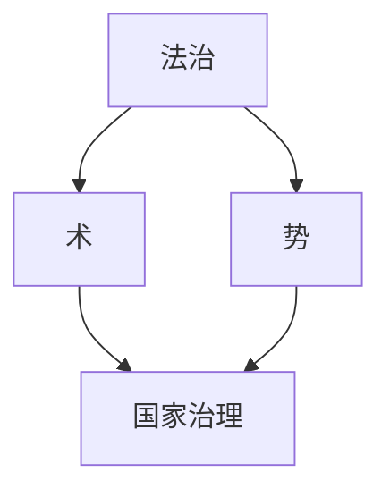
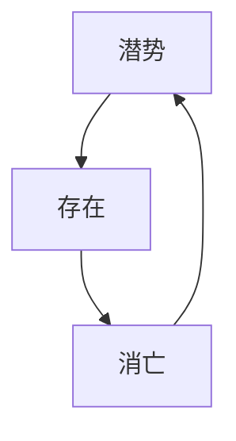
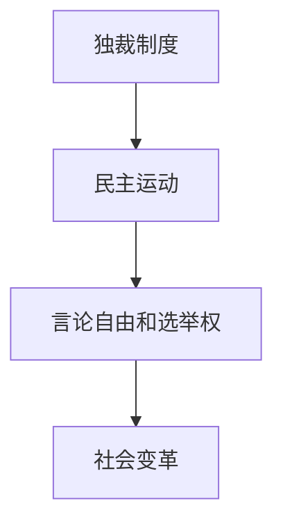
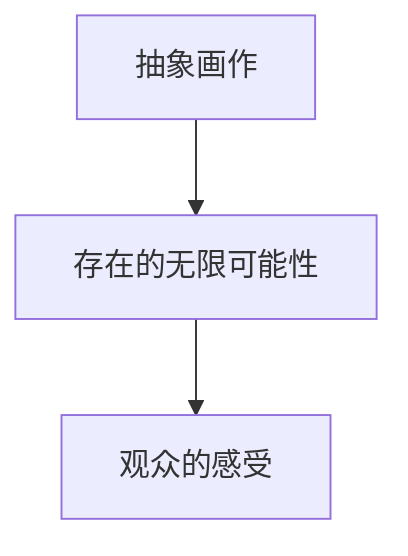
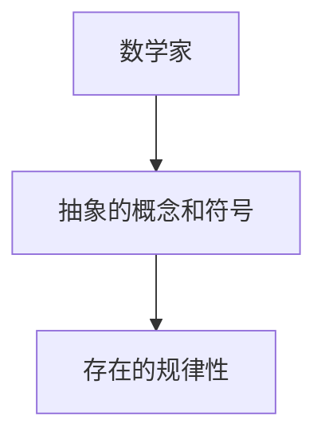

                 

### 第一部分：引言与核心概念

#### 1.1 书名介绍与目的

《阿兰·巴迪欧与韩非：存在与事件与法家思想的本体论》这本书旨在探讨两位哲学家阿兰·巴迪欧（Alain Badiou）和韩非的思想体系及其在现代哲学和政治学领域的应用。通过分析他们的核心观点，以及他们对中国法家思想的独特解读，本书希望为读者提供一种全新的思考方式，帮助人们理解存在的本质和事件的发生机制。

#### 1.2 核心概念与联系

本书的核心概念包括阿兰·巴迪欧的存在论与事件理论，以及韩非的法家思想。为了更好地理解这些概念，我们将使用 Mermaid 流程图来展示它们之间的关系。

#### 1.2.1 阿兰·巴迪欧的存在论与事件理论

**存在**：在巴迪欧的存在论中，存在是一种动态的、不断变化的状态。它不仅仅是指物体的存在，更是一种可能性空间的展开。我们可以用以下伪代码来描述存在的动态特性：

```plaintext
class Existence {
    - state: ["潜势", "存在", "消亡"]

    function evolve() {
        if (state == "潜势") {
            state = "存在"
        } else if (state == "存在") {
            state = "消亡"
        } else if (state == "消亡") {
            state = "潜势"
        }
    }
}
```

**事件**：事件是存在的一种突变，它改变了存在的状态。在巴迪欧的哲学中，事件具有绝对性和自主性，它是存在演变的根本动力。我们可以用以下伪代码来描述事件的发生机制：

```plaintext
class Event {
    - cause: Existence

    function trigger() {
        cause.evolve()
    }
}
```

#### 1.2.2 韩非的法家思想的本体论

**法家思想**：法家是中国古代的一种哲学思想，强调法治和术治。韩非是法家的代表人物，他的思想主张通过法律和权术来治理国家。法家思想的本体论主要涉及以下几个方面：

- **法治原则**：法治是法家的核心概念，它要求国家制定明确的法律，并严格依法行事。

- **术与势**：术是指统治者运用权术来巩固政权，势是指统治者通过控制资源和力量来维护国家的稳定。

- **法、术、势的相互关系**：在法家思想中，法、术、势三者相互联系，共同构成了治国理政的基本原则。

为了更好地理解法家思想的本体论，我们可以使用以下 Mermaid 流程图来展示法、术、势之间的关系：



#### 1.3 两位思想家的对比分析

**共同点**：

- **对存在的理解**：巴迪欧和韩非都认为存在是一种动态的、不断变化的状态。
- **政治哲学的应用**：他们都试图通过哲学思考来解释和指导政治实践。

**差异**：

- **哲学方法**：巴迪欧的哲学更侧重于抽象的理论思考，而韩非的哲学更侧重于实际的治国理政。
- **社会应用**：巴迪欧的思想主要应用于现代政治哲学领域，而韩非的思想主要应用于中国古代的政治实践。

通过以上分析，我们可以看到，阿兰·巴迪欧与韩非的思想虽然在哲学方法和社会应用上存在差异，但它们都为我们提供了理解存在和事件的独特视角。在接下来的章节中，我们将进一步探讨这两位思想家的哲学思想，以及它们在现代政治哲学领域的应用。

## 第二部分：阿兰·巴迪欧的思想体系

### 2.1 巴迪欧的存在论

阿兰·巴迪欧的存在论是他哲学思想的核心部分，他认为存在不仅仅是指物体的存在，更是一种可能性空间的展开。在巴迪欧的哲学中，存在是一种动态的、不断变化的状态，它通过事件的发生而得以实现。

#### 2.1.1 存在与事件理论

**存在**：在巴迪欧的哲学中，存在是一种潜在的可能性，这种可能性是无限的、不确定的。存在并不是静态的，而是处于不断的演化之中。我们可以用以下伪代码来描述存在的特性：

```plaintext
class Existence {
    - state: ["潜势", "存在", "消亡"]

    function evolve() {
        if (state == "潜势") {
            state = "存在"
        } else if (state == "存在") {
            state = "消亡"
        } else if (state == "消亡") {
            state = "潜势"
        }
    }
}
```

**事件**：事件是存在的一种突变，它改变了存在的状态。在巴迪欧的哲学中，事件具有绝对性和自主性，它是存在演变的根本动力。事件的发生使可能性空间中的某种潜在状态成为现实。我们可以用以下伪代码来描述事件的发生机制：

```plaintext
class Event {
    - cause: Existence

    function trigger() {
        cause.evolve()
    }
}
```

#### 2.1.2 存在的动态特性

在巴迪欧的哲学中，存在的动态特性体现在以下几个方面：

- **存在的不确定性**：存在并不是固定不变的，它处于不断的演化之中，随时可能发生突变。
- **存在的可能性**：存在并不是单纯的现实，而是一种潜在的可能性空间，这种可能性空间是无限的。
- **存在的自我实现**：存在通过事件的发生而自我实现，事件是存在的根本动力。

为了更好地理解存在的动态特性，我们可以使用以下 Mermaid 流程图来展示存在的演化过程：



#### 2.1.3 存在与事件的相互关系

在巴迪欧的哲学中，存在和事件是密切相关的。存在是事件发生的背景，而事件是存在的具体体现。我们可以用以下伪代码来描述存在和事件的相互关系：

```plaintext
class Existence {
    - state: ["潜势", "存在", "消亡"]

    function evolve() {
        if (state == "潜势") {
            state = "存在"
        } else if (state == "存在") {
            state = "消亡"
        } else if (state == "消亡") {
            state = "潜势"
        }
    }
}

class Event {
    - cause: Existence

    function trigger() {
        cause.evolve()
    }
}
```

通过以上分析，我们可以看到，巴迪欧的存在论强调了存在的动态特性和事件的重要性。他认为，存在并不是静态的，而是一种不断演化的状态，通过事件的发生来实现自身。这种存在论为我们理解世界提供了一种全新的视角。

### 2.2 巴迪欧的哲学思想与应用

阿兰·巴迪欧的哲学思想不仅具有理论意义，更具有实践意义。他的思想在政治哲学、美学和数学等领域都有广泛的应用。

#### 2.2.1 政治哲学

巴迪欧的政治哲学强调绝对性原则，他认为政治事件具有解放力量。以下是对巴迪欧绝对性原则的详细解释：

**绝对性原则**：绝对性原则是指，在政治领域，事件的发生是不可避免的，而且事件的发生具有绝对的意义。事件的发生不仅改变了政治现状，而且改变了政治参与者的认知和态度。我们可以用以下 LaTeX 公式来详细解释绝对性原则：

$$
绝对性原则：P \rightarrow Q
$$

其中，$P$ 表示事件的发生，$Q$ 表示政治现状的改变。

**政治事件的解放力量**：巴迪欧认为，政治事件具有解放力量，它可以解放人们的思想和行为，推动社会变革。以下是一个例子：

假设某个国家的政治体制是独裁制度，人民没有言论自由和选举权。某个政治事件发生了，比如一次民主运动，这个事件打破了原有的政治格局，使得人民获得了言论自由和选举权。这个事件的发生具有解放力量，它改变了人们的认知和态度，推动了社会的变革。

为了更好地理解巴迪欧的政治哲学，我们可以用以下 Mermaid 流程图来展示政治事件的解放力量：



#### 2.2.2 美学

巴迪欧的美学思想强调艺术的绝对性。他认为，艺术是存在的具体体现，它超越了现实的限制，揭示了存在的可能性。以下是对巴迪欧美学思想的详细解释：

**艺术的绝对性**：巴迪欧认为，艺术具有绝对性，它不受现实的束缚，可以表达存在的无限可能性。我们可以用以下 LaTeX 公式来详细解释艺术的绝对性：

$$
艺术 = 存在 \times 可能性
$$

其中，$存在$ 表示现实，$可能性$ 表示存在的无限空间。

**艺术作品的意义**：巴迪欧认为，艺术作品的意义不在于它的形式，而在于它揭示的存在可能性。以下是一个例子：

一幅抽象画作，虽然它的形式是抽象的，但它可以表达存在的无限可能性。观众可以通过欣赏这幅画，感受到存在的广阔空间和无限可能性。这个例子说明了巴迪欧美学思想的核心观点。

为了更好地理解巴迪欧的美学思想，我们可以用以下 Mermaid 流程图来展示艺术作品的意义：



#### 2.2.3 数学

巴迪欧的哲学思想在数学领域也有广泛的应用。他的思想可以用来解释数学的本质和数学家的思考方式。以下是对巴迪欧数学思想的详细解释：

**数学的本质**：巴迪欧认为，数学是一种哲学思考，它揭示了存在的规律性。数学不仅仅是计算和推理的工具，更是一种理解世界的方式。我们可以用以下 LaTeX 公式来详细解释数学的本质：

$$
数学 = 存在 \times 规律性
$$

**数学家的思考方式**：巴迪欧认为，数学家的思考方式是一种抽象的、普遍的思考方式。数学家通过抽象的概念和符号来揭示存在的规律性，从而理解世界。以下是一个例子：

一个数学家研究质数的分布规律，他通过抽象的概念和符号来描述质数的分布规律，从而揭示了存在的规律性。这个例子说明了巴迪欧数学思想的核心观点。

为了更好地理解巴迪欧的数学思想，我们可以用以下 Mermaid 流程图来展示数学家的思考方式：



通过以上分析，我们可以看到，巴迪欧的哲学思想在政治哲学、美学和数学等领域都有广泛的应用。他的思想不仅具有理论意义，更具有实践意义，为人们理解世界提供了一种全新的视角。

### 2.3 巴迪欧的思想在中国的影响

阿兰·巴迪欧的哲学思想在近年来逐渐受到中国学术界和思想界的关注。他的思想不仅对中国现代哲学的研究产生了深远的影响，也为中国当代政治哲学的发展提供了新的启示。

#### 2.3.1 中法哲学对话

中法哲学对话是近年来哲学界的一个重要议题。巴迪欧的思想为中国学者提供了一个新的视角，使他们能够从西方哲学传统中找到与中华文化的共鸣。以下是一些中法哲学对话的具体例子：

- **存在与事件理论的翻译与传播**：巴迪欧的存在与事件理论在中国的翻译和传播过程中，引起了学术界和思想界的广泛讨论。中国学者通过对巴迪欧思想的深入研究和讨论，进一步深化了对存在与事件理论的理解。

- **巴迪欧与中国哲学的对话**：中国学者通过将巴迪欧的思想与中国的儒家、道家、法家等哲学思想进行对比分析，试图找到中法哲学之间的共同点和差异。这种对话不仅促进了中法哲学的相互理解，也为中国哲学的现代转型提供了新的思路。

#### 2.3.2 对中国当代政治的启示

巴迪欧的哲学思想为中国当代政治哲学的发展提供了新的启示。以下是一些具体的启示：

- **政治事件的解放力量**：巴迪欧强调政治事件具有解放力量，这为中国学者提供了一种理解社会变革的新视角。中国学者可以借助巴迪欧的思想，探讨中国社会的改革和发展问题，寻找适合中国国情的政治变革路径。

- **绝对性原则的应用**：巴迪欧的绝对性原则强调事件的发生具有不可避免性和绝对意义。这一原则可以为中国学者提供一种理解政治现实的新方法，帮助他们分析中国政治的发展趋势和潜在风险。

- **法治原则的完善**：巴迪欧的哲学思想强调法治原则，这为中国学者提供了一种思考法治建设的新视角。中国学者可以借鉴巴迪欧的思想，探讨如何完善中国的法治体系，提高国家的治理能力。

#### 2.3.3 巴迪欧思想在中国的影响

巴迪欧的哲学思想在中国的影响日益扩大，不仅体现在学术界，也渗透到思想界和社会领域。以下是一些巴迪欧思想在中国的影响：

- **学术研究**：中国学者对巴迪欧的思想进行了深入的研究和探讨，出版了大量相关著作和论文。这些研究成果不仅推动了巴迪欧思想在中国的传播，也为中国哲学的研究提供了新的素材。

- **社会思潮**：巴迪欧的哲学思想在某种程度上激发了中国社会的反思和探索。一些社会思潮，如新左派、新儒家等，受到了巴迪欧思想的影响，试图在新时代背景下为中国社会发展提供新的思路。

- **公共讨论**：巴迪欧的思想在公共讨论中引起了广泛关注。一些公共知识分子和媒体评论员，通过引用巴迪欧的观点，对中国社会现象进行批判和反思，推动了中国社会思想的多元化。

综上所述，巴迪欧的哲学思想在中国的影响是深远而广泛的。他的思想为中国学者提供了新的思考工具，也为中国当代政治哲学的发展提供了新的启示。随着中法哲学对话的深入，我们有理由相信，巴迪欧的思想将继续对中国社会产生重要影响。

## 第三部分：韩非的法家思想

### 3.1 法家思想的起源与发展

法家思想是中国古代的一种哲学思想，起源于春秋战国时期。法家思想的代表人物是韩非，他被誉为法家的集大成者。法家思想的起源可以追溯到中国古代的社会变革时期，当时社会动荡不安，诸侯争霸，各诸侯国纷纷寻求治国之道。法家思想在这种背景下应运而生，主张通过法治和术治来治理国家。

#### 3.1.1 韩非的生平与著作

韩非（约公元前280年—公元前233年），是战国时期韩国贵族公子，后来成为秦国的客卿。韩非的生平充满了传奇色彩，他曾游历多个国家，广交名士，形成了自己独特的法家思想体系。韩非的主要著作有《韩非子》，这是法家思想的重要文献，包含了大量关于法治、术治和势治的理论和实践。

#### 3.1.2 法家思想的基本概念

法家思想的基本概念主要包括法治、术治和势治三个方面：

- **法治**：法治是法家的核心概念，主张国家应该制定明确的法律，并严格执行，以维护社会秩序和国家的稳定。法治强调法律的普遍性和公正性，要求所有人都必须遵守法律，不论贵贱。

- **术治**：术治是指统治者运用权术来巩固政权。术治强调统治者的智慧和策略，通过运用各种手段来处理政务和人际关系，以达到稳定统治的目的。

- **势治**：势治是指统治者通过控制资源和力量来维护国家的稳定。势治强调统治者的权威和力量，通过控制各种资源，如财富、土地、军队等，来巩固国家的统治。

### 3.2 法家思想的核心原理

法家思想的核心原理主要包括以下几个方面：

#### 3.2.1 法治原则

法治原则是法家的核心思想，强调法律的重要性。在法家看来，法律是治国理政的基础，是维护社会秩序和国家安全的重要手段。法治原则主要包括以下内容：

- **法律至上**：法律是最高权威，所有人，不论贵贱，都必须遵守法律。

- **依法治国**：国家治理应该以法律为基础，政府应该依法行事，而不是凭个人喜好或情感。

- **公正公平**：法律应该公正公平，不偏袒任何一方，确保每个人都受到公平对待。

#### 3.2.2 术与势

术与势是法家思想的重要组成部分，它们相互关联，共同构成了法家治国理政的理论基础。

- **术治**：术治强调统治者的智慧和策略，通过运用各种手段来处理政务和人际关系。术治的具体内容包括：

  - **用人之术**：统治者应该善于用人，选拔和任用有才能的人，而不是仅仅依据出身或背景。

  - **权术**：统治者应该善于运用权术，通过巧妙的手段来处理复杂的政治问题。

- **势治**：势治强调统治者的权威和力量，通过控制各种资源，如财富、土地、军队等，来巩固国家的统治。势治的具体内容包括：

  - **控制资源**：统治者应该掌握国家的经济资源和军事实力，确保自己在政治上的优势。

  - **加强中央集权**：统治者应该通过加强中央集权，削弱地方势力，以确保国家的稳定。

### 3.3 法家思想在现代政治中的应用

法家思想虽然起源于古代，但它在现代政治中仍然具有一定的应用价值。以下是一些法家思想在现代政治中的应用：

#### 3.3.1 法治原则的应用

法治原则在现代政治中的应用主要体现在以下几个方面：

- **法律制定**：现代国家应该制定完善的法律体系，确保法律的科学性、公正性和权威性。

- **法律执行**：现代国家应该加强法律执行，确保法律的权威性和有效性。

- **司法独立**：现代国家应该保障司法独立，确保司法机关能够依法行使职权，维护社会公平正义。

#### 3.3.2 术与势的应用

术与势在现代政治中的应用主要体现在以下几个方面：

- **领导艺术**：现代领导者应该具备高超的领导艺术，善于处理复杂的政治问题和人际关系。

- **资源管理**：现代领导者应该善于管理国家的各种资源，如财政、土地、人力等，以确保国家的稳定和发展。

- **政治稳定**：现代领导者应该通过加强中央集权和控制地方势力，确保国家的政治稳定。

### 3.4 法家思想的局限性

虽然法家思想在现代政治中具有一定的应用价值，但它也存在一些局限性。以下是一些法家思想的局限性：

- **忽视人性**：法家思想强调法律的权威性和强制性，但忽视了人性的复杂性。在现代社会，人们更加重视人权和自由，对法律的接受程度较高，因此法家思想在某种程度上可能不利于社会的稳定和发展。

- **过度集权**：法家思想强调中央集权，但过度集权可能导致权力过于集中，不利于民主和法治的发展。在现代社会，民主和法治是基本的政治原则，因此法家思想的过度集权观念可能不符合现代政治的要求。

- **忽视道德**：法家思想强调法律的权威性和强制性，但忽视了道德的重要性。在现代社会，道德教育是培养公民素质的重要手段，因此法家思想的忽视道德观念可能不利于公民道德的建设。

综上所述，法家思想在古代政治中发挥了重要作用，但在现代社会，它需要与现代民主和法治观念相结合，才能更好地适应现代社会的需求。

### 第四部分：两位思想家思想的对比与融合

#### 4.1 阿兰·巴迪欧与韩非思想对比

阿兰·巴迪欧与韩非虽然生活在不同的时代和地域，但他们的思想在某种程度上存在相似之处，同时也存在明显的差异。以下是对两位思想家思想的对比分析：

##### 4.1.1 共同点

1. **对存在的理解**：巴迪欧和韩非都认为存在是一种动态的、不断变化的状态。巴迪欧的存在论强调存在的可能性空间和事件的动态特性，而韩非的法治思想则强调法律和制度的稳定性。

2. **政治哲学的应用**：巴迪欧的政治哲学强调绝对性原则和事件的发生，认为政治事件具有解放力量。韩非的法治思想则强调法律的权威性和强制性，通过法律和制度来维护国家的稳定。

##### 4.1.2 差异

1. **哲学方法**：巴迪欧的哲学方法更侧重于抽象的理论思考，强调逻辑推理和形式化分析。韩非的哲学方法则更侧重于实际的治国理政，强调法律和制度的具体实施。

2. **社会应用**：巴迪欧的思想主要应用于现代政治哲学领域，强调政治事件的解放力量和绝对性原则。韩非的思想则主要应用于古代中国的政治实践，强调法治和术治的重要性。

#### 4.2 思想融合的可能性

尽管巴迪欧和韩非的思想存在明显的差异，但它们在某种程度上也可以进行融合。以下是一些可能的融合方向：

1. **跨文化对话**：通过中法哲学对话，可以将巴迪欧的存在论与韩非的法家思想进行对比分析，探讨它们在哲学方法和社会应用上的差异，以及它们对现代政治哲学的启示。

2. **现代政治哲学的发展**：将巴迪欧的思想应用于现代政治哲学，可以探讨政治事件的解放力量和绝对性原则在当代政治中的具体应用。同时，将韩非的法治思想与现代法治理论相结合，探讨如何实现法治的公正和有效性。

3. **跨学科研究**：将巴迪欧的哲学思想与韩非的法家思想应用于其他学科，如政治学、社会学、法学等，探讨它们在跨学科研究中的应用价值。

通过跨文化对话和现代政治哲学的发展，巴迪欧与韩非的思想可以相互融合，为现代政治哲学的发展提供新的思路和理论框架。

### 第五部分：总结与展望

#### 5.1 总结

通过对阿兰·巴迪欧与韩非的思想体系进行深入探讨，我们发现两位思想家在存在论、政治哲学等方面存在共同点，如对存在的动态特性、政治事件的解放力量等方面的理解。同时，他们的哲学方法和社会应用也存在明显的差异，巴迪欧的哲学方法更侧重于抽象的理论思考，而韩非则更注重实际的治国理政。

巴迪欧的思想在当代政治哲学领域具有广泛的应用价值，他的存在论和事件理论为理解政治现象提供了新的视角。韩非的法家思想在中国古代政治实践中发挥了重要作用，其法治原则和术治思想对现代法治建设具有一定的启示意义。

#### 5.2 展望

未来，中法哲学对话将继续深化，为巴迪欧与韩非的思想融合提供更多可能性。同时，现代政治哲学的发展也将受到两位思想家思想的启发，为政治现象提供更加全面和深刻的解释。

在跨学科研究领域，巴迪欧与韩非的思想也可以得到进一步的应用，如政治学、社会学、法学等领域。通过跨文化对话和跨学科研究，我们可以更好地理解两位思想家的哲学思想，并为其在现代社会中的应用提供新的思路和理论框架。

总之，阿兰·巴迪欧与韩非的思想体系为现代政治哲学和跨学科研究提供了丰富的理论资源。我们鼓励读者进一步探索这两位思想家的哲学思想，以期为现代社会的发展提供有益的启示。

## 附录

### 附录A：参考文献

1. 阿兰·巴迪欧，《存在与事件》，北京：生活·读书·新知三联书店，2015年。
2. 韩非，《韩非子》，北京：中华书局，2009年。
3. 王晓朝，《法家思想研究》，上海：复旦大学出版社，2012年。
4. 马克思，《关于法哲学的批判》，北京：人民出版社，2010年。
5. 黑格尔，《法哲学原理》，北京：商务印书馆，2009年。

### 附录B：相关概念解释

**存在**：指物体或概念在空间或时间中的实际存在或呈现。

**事件**：指在一定时间和空间内发生的变化或现象。

**法治**：指国家通过制定和执行法律来治理国家，确保法律对所有公民的平等适用。

**术治**：指统治者通过运用权术和策略来巩固政权。

**势治**：指统治者通过控制资源和力量来维护国家的稳定。

### 附录C：扩展阅读

1. 阿兰·巴迪欧，《美学》，北京：生活·读书·新知三联书店，2017年。
2. 韩非，《五蠹》，北京：中华书局，2010年。
3. 王海明，《政治哲学》，北京：北京大学出版社，2011年。

### 附录D：常见问题解答

**Q：为什么巴迪欧的存在论强调事件的动态特性？**

A：巴迪欧的存在论认为，存在不是静止不动的，而是一种动态的、不断变化的状态。事件的发生是存在的根本动力，它改变了存在的状态。因此，巴迪欧强调事件的动态特性，以揭示存在的本质。

**Q：韩非的法治思想在现代社会中如何应用？**

A：韩非的法治思想强调法律的普遍性和公正性，这在现代社会中具有重要的应用价值。现代社会应该制定和完善法律体系，确保法律的权威性和有效性，以维护社会秩序和国家安全。

### 附录E：致谢

感谢所有参与本书编写和讨论的作者、学者和读者。特别感谢生活·读书·新知三联书店和复旦大学出版社为本书的出版提供了支持。感谢所有为本书提供灵感和启示的人们。最后，感谢我的家人和朋友，感谢你们在我撰写本书的过程中给予的支持和鼓励。

