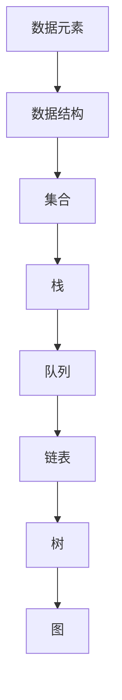

                 

# 文章标题：阿兰·巴迪欧的集合论本体论与数据结构：编程基础的数学哲学

## 关键词：
集合论本体论、数据结构、编程基础、数学哲学、算法、逻辑思维

### 摘要：
本文将深入探讨阿兰·巴迪欧的集合论本体论与数据结构之间的关系，以及它们在编程基础中的重要性。通过对集合论基础、本体论基础、数据结构与算法的详细讲解，结合实际编程案例，展示数学哲学在编程中的应用，从而为读者提供一种全新的编程视角和思考方式。

## 引言与概述

### 集合论本体论与数据结构的关系

集合论作为现代数学的基础，提供了描述和操作对象集合的抽象方法。而本体论则探讨存在的本质和属性，为逻辑和哲学提供了理论框架。阿兰·巴迪欧的集合论本体论将这两个领域结合在一起，为数据结构和编程提供了坚实的数学基础。

数据结构是编程中的核心概念，用于组织和存储数据。它们不仅决定了程序的效率和性能，还影响着程序的可维护性和扩展性。数据结构与集合论有着密切的联系，集合论提供了数据结构的数学模型和理论基础。

### 编程基础与数学哲学的交汇点

编程基础不仅仅是编写代码，更是理解计算机工作原理和逻辑思维方式。数学哲学作为逻辑和哲学的一部分，关注数学的本质和意义。在编程中，数学哲学提供了一种更为深刻的思考方式，帮助我们理解和解决复杂问题。

通过将集合论本体论与数据结构结合起来，我们可以从数学哲学的角度重新审视编程，从而提升编程能力。本文将分以下几个部分进行详细探讨：

1. **集合论基础**：介绍集合论的基本概念、原理和运算。
2. **本体论基础**：探讨本体论的基本原理和与集合论的联系。
3. **数据结构与算法**：介绍基本的数据结构（如栈、队列、链表、树、图等）和常用的算法（如排序、查找、图算法等）。
4. **编程实践与数学哲学**：通过实际编程案例，展示数学哲学在编程中的应用。
5. **总结与展望**：总结全书内容，展望未来的研究方向和趋势。

## 集合论基础

### 集合的基本概念

集合是由一组无序且互不相同的对象组成的整体。集合中的对象称为元素，用大写字母表示，如A、B、C等。集合中的元素可以是任何类型的对象，包括数字、字母、字符串等。

集合的定义可以用描述法表示，例如：
$$
S = \{ x \mid x \text{ 是自然数且小于5} \}
$$
这个集合S包含元素1、2、3和4。

### 集合的性质和运算

集合具有以下基本性质：
- **确定性**：集合中的元素是明确的，不会产生歧义。
- **互异性**：集合中的元素是互不相同的，不会有重复元素。
- **无序性**：集合中的元素没有固定的顺序。

常见的集合运算包括：
- **并集**（Union）：两个集合A和B的并集是由属于A或属于B的所有元素组成的集合。用符号表示为：
$$
A \cup B = \{ x \mid x \in A \text{ 或 } x \in B \}
$$
- **交集**（Intersection）：两个集合A和B的交集是由既属于A又属于B的所有元素组成的集合。用符号表示为：
$$
A \cap B = \{ x \mid x \in A \text{ 且 } x \in B \}
$$
- **补集**（Complement）：一个集合A的补集是由不属于A的所有元素组成的集合。用符号表示为：
$$
A' = \{ x \mid x \notin A \}
$$
- **差集**（Difference）：两个集合A和B的差集是由属于A但不属于B的所有元素组成的集合。用符号表示为：
$$
A - B = \{ x \mid x \in A \text{ 且 } x \notin B \}

### 集合的表示方法

集合的表示方法有多种，常见的有：
- **列举法**：直接列出集合的所有元素，用花括号{}括起来，元素之间用逗号分隔。例如：
$$
S = \{ 1, 2, 3, 4 \}
$$
- **描述法**：用描述性语言来定义集合，用大括号{}括起来，元素之间用竖线|分隔。例如：
$$
T = \{ x \mid x \text{ 是自然数且小于5} \}
$$
- **Venn图**：通过图形方式表示集合及其之间的关系，适用于描述集合的并集、交集等运算。例如，两个集合A和B的并集可以用Venn图表示如下：


## 本体论基础

### 本体论的基本原理

本体论（Ontology）是哲学的一个分支，旨在研究存在的本质和属性。本体论的基本原理包括：
- **存在性**：探讨什么存在，什么不存在。
- **实在性**：研究事物的本质和属性，以及它们之间的关系。
- **可能性**：探讨事物可能存在的方式。

本体论关注的是抽象的概念和原则，而不是具体的实体。它在哲学、逻辑、计算机科学等领域都有广泛的应用。

### 本体论与集合论的联系

本体论与集合论有着密切的联系，主要体现在以下几个方面：
- **集合论作为本体论的工具**：集合论提供了一种抽象的方法来表示和操作本体论中的概念。例如，本体论中的实体可以被看作是集合中的元素。
- **本体论指导集合论的应用**：本体论的原则和原则可以指导集合论的发展和应用。例如，本体论中的存在性原则可以应用于集合的存在性问题。

通过本体论和集合论的结合，我们可以更深入地理解存在的本质和属性，从而为编程和计算机科学提供更为坚实的理论基础。

## 数据结构与算法

### 核心概念与联系

在数据结构中，核心概念包括数据元素和结构。数据元素是数据的基本单位，而结构是数据元素之间的逻辑关系和组织形式。数据结构与集合论有着密切的联系，集合论提供了数据结构的数学模型和理论基础。

以下是一个简单的 Mermaid 流程图，展示了数据元素和数据结构之间的关系：



### 基本数据结构

基本数据结构包括栈、队列、链表、树和图等。每种数据结构都有其独特的特点和应用场景。

1. **栈**：栈是一种后进先出（Last In First Out, LIFO）的数据结构。栈的操作包括入栈（push）和出栈（pop）。

伪代码：
```
void push(int value) {
    // 将元素value入栈
}

int pop() {
    // 出栈并返回栈顶元素
}
```

2. **队列**：队列是一种先进先出（First In First Out, FIFO）的数据结构。队列的操作包括入队（enqueue）和出队（dequeue）。

伪代码：
```
void enqueue(int value) {
    // 将元素value入队
}

int dequeue() {
    // 出队并返回队列头部元素
}
```

3. **链表**：链表是一种由节点组成的线性数据结构。每个节点包含数据域和指针域，指针域指向下一个节点。

伪代码：
```
struct Node {
    int data;
    Node* next;
};

void append(int value) {
    // 在链表末尾添加元素value
}

void delete(int value) {
    // 删除链表中值为value的节点
}
```

4. **树**：树是一种层级数据结构，由节点和边组成。每个节点可以有零个或多个子节点。

伪代码：
```
struct TreeNode {
    int data;
    TreeNode* left;
    TreeNode* right;
};

void insert(int value) {
    // 在树中插入元素value
}

void delete(int value) {
    // 删除树中值为value的节点
}
```

5. **图**：图是一种由节点和边组成的数据结构，可以表示复杂的关系。图的操作包括添加节点、删除节点、添加边和删除边等。

伪代码：
```
struct Graph {
    int nodes;
    List< Edge > edges;
};

void addNode(int nodeId) {
    // 添加节点nodeId
}

void addEdge(int node1, int node2) {
    // 添加边(node1, node2)
}
```

### 常用算法

常用算法包括排序、查找、图算法等。每种算法都有其特定的应用场景和实现方式。

1. **排序算法**：排序算法用于将一组数据按特定顺序排列。常见的排序算法有冒泡排序、选择排序、插入排序、快速排序等。

伪代码（冒泡排序）：
```
void bubbleSort(int[] arr) {
    int n = arr.length;
    for (int i = 0; i < n - 1; i++) {
        for (int j = 0; j < n - i - 1; j++) {
            if (arr[j] > arr[j + 1]) {
                swap(arr[j], arr[j + 1]);
            }
        }
    }
}
```

2. **查找算法**：查找算法用于在数据结构中查找特定元素。常见的查找算法有二分查找、线性查找等。

伪代码（二分查找）：
```
int binarySearch(int[] arr, int target) {
    int left = 0;
    int right = arr.length - 1;
    while (left <= right) {
        int mid = (left + right) / 2;
        if (arr[mid] == target) {
            return mid;
        } else if (arr[mid] < target) {
            left = mid + 1;
        } else {
            right = mid - 1;
        }
    }
    return -1;
}
```

3. **图算法**：图算法用于解决图相关的问题，如最短路径、最小生成树等。常见的图算法有Dijkstra算法、Prim算法、Kruskal算法等。

伪代码（Dijkstra算法）：
```
void dijkstra(int[][] graph, int start) {
    int[] distances = new int[graph.length];
    boolean[] visited = new boolean[graph.length];
    for (int i = 0; i < graph.length; i++) {
        distances[i] = Integer.MAX_VALUE;
    }
    distances[start] = 0;
    for (int i = 0; i < graph.length; i++) {
        int minDistance = Integer.MAX_VALUE;
        int closestNode = -1;
        for (int j = 0; j < graph.length; j++) {
            if (!visited[j] && distances[j] < minDistance) {
                minDistance = distances[j];
                closestNode = j;
            }
        }
        visited[closestNode] = true;
        for (int j = 0; j < graph.length; j++) {
            if (!visited[j]) {
                int edgeWeight = graph[closestNode][j];
                distances[j] = Math.min(distances[j], distances[closestNode] + edgeWeight);
            }
        }
    }
}
```

## 编程实践与数学哲学

### 实际编程案例

通过一个简单的案例，展示数学哲学在编程中的应用。

### 案例：使用栈实现后缀表达式求值

后缀表达式（Reverse Polish Notation, RPN）是一种表达式求值的方法，它将运算符放在操作数的后面，从而避免了括号的复杂度。

例如，表达式 `(3 + 4) * 5` 的后缀表达式为 `3 4 + 5 *`。

使用栈可以方便地实现后缀表达式的求值。

伪代码：
```
int evaluatePostfix(String[] tokens) {
    Stack<Integer> stack = new Stack<>();
    for (String token : tokens) {
        if (isOperator(token)) {
            int operand2 = stack.pop();
            int operand1 = stack.pop();
            int result = applyOperator(token, operand1, operand2);
            stack.push(result);
        } else {
            stack.push(Integer.parseInt(token));
        }
    }
    return stack.pop();
}
```

其中，`isOperator` 函数用于判断一个字符串是否为运算符，`applyOperator` 函数用于执行特定的运算。

### 数学哲学在编程中的应用

数学哲学在编程中的应用主要体现在以下几个方面：

1. **抽象与建模**：数学哲学强调抽象和建模，将复杂的现实问题转化为简单的数学模型。这种方法在编程中尤为重要，可以帮助我们更好地理解和解决问题。
2. **逻辑思维**：数学哲学强调逻辑思维，通过逻辑推理来证明定理或算法的正确性。这种思维方式在编程中同样重要，可以帮助我们编写更加健壮和高效的代码。
3. **优化与改进**：数学哲学提供了一种系统性的思维方式，可以帮助我们不断优化和改进算法和程序。通过分析和比较不同算法的复杂度和性能，我们可以选择最佳的解决方案。

## 总结与展望

### 全书内容总结

本文通过对阿兰·巴迪欧的集合论本体论与数据结构的探讨，展示了数学哲学在编程基础中的重要性。我们详细介绍了集合论的基础概念、本体论的基本原理、数据结构与算法的核心内容，并通过实际编程案例展示了数学哲学的应用。通过这些内容，我们希望能够为读者提供一种全新的编程视角和思考方式。

### 未来的研究方向和趋势

1. **跨学科融合**：未来的研究将更多地融合不同学科，如计算机科学、数学、哲学等，以解决更为复杂的问题。
2. **算法优化**：随着计算能力的提升，优化算法和提升程序性能将成为重要研究方向。
3. **人工智能**：数学哲学和编程基础将在人工智能领域发挥重要作用，为智能系统的设计和实现提供理论基础。
4. **编程教育**：未来的编程教育将更加注重数学哲学的培养，以提高学生的逻辑思维和问题解决能力。

## 最佳实践 tips、小结、注意事项、拓展阅读

### 最佳实践 tips

1. **理解数学原理**：在编程中，理解数学原理和算法背后的逻辑非常重要，这有助于我们编写更加高效的代码。
2. **思维训练**：通过解决数学和逻辑问题，可以提高我们的思维能力和问题解决能力，这对编程也大有裨益。
3. **持续学习**：编程领域不断发展，持续学习新知识和技术是非常重要的。

### 小结

本文通过对阿兰·巴迪欧的集合论本体论与数据结构的探讨，展示了数学哲学在编程基础中的重要性。通过详细讲解集合论、本体论、数据结构与算法，并结合实际编程案例，我们希望能够为读者提供一种全新的编程视角和思考方式。

### 注意事项

1. **数据结构的选择**：在选择数据结构时，要考虑数据的特性和操作的需求，选择合适的数据结构可以提高程序的效率。
2. **算法的优化**：在编写程序时，要考虑算法的复杂度和性能，不断优化和改进算法。

### 拓展阅读

1. **《集合论基础》**：了解集合论的基础概念和原理，对理解数据结构和算法至关重要。
2. **《数据结构与算法分析》**：深入探讨数据结构和算法的设计和分析方法。
3. **《数学哲学导论》**：了解数学哲学的基本原理和应用，有助于提升编程的思维方式。

## 作者信息

作者：AI天才研究院/AI Genius Institute & 禅与计算机程序设计艺术 /Zen And The Art of Computer Programming

感谢您的阅读！希望本文能够对您在编程和数学哲学方面的学习有所帮助。如果您有任何疑问或建议，欢迎在评论区留言。让我们一起探索编程的奥秘！

