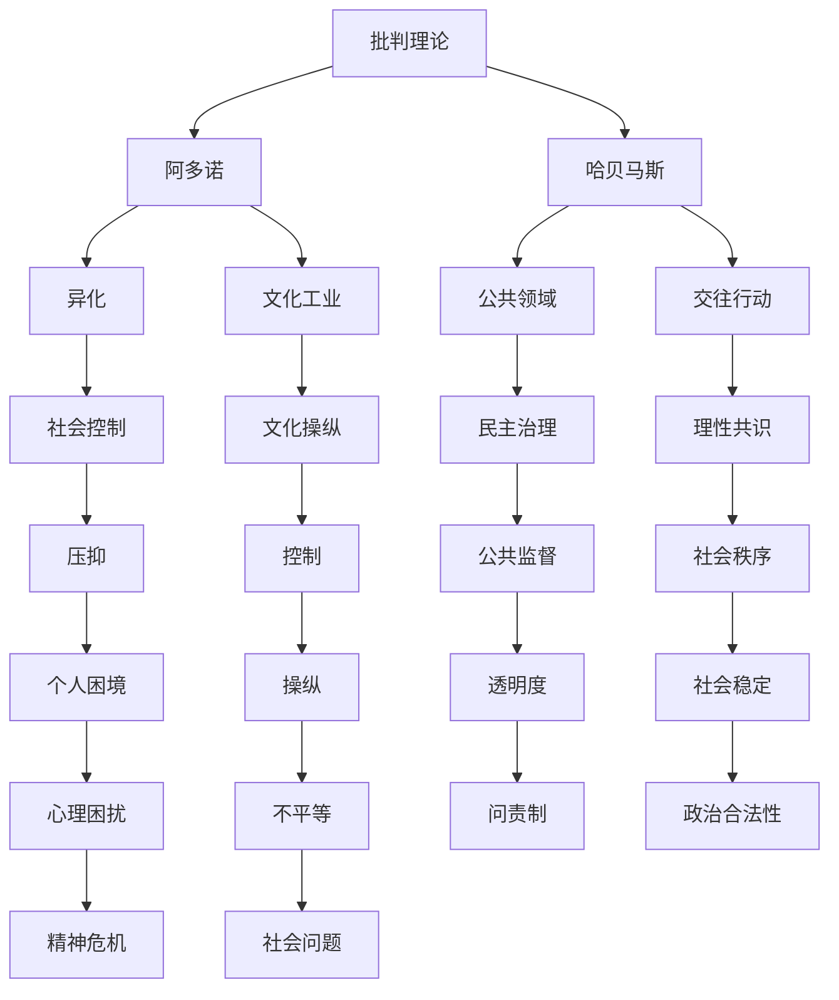

                 


### 设计思路

1. **分析书名与主题**：
   - 书名《阿多诺与哈贝马斯：批判理论的两代代表》揭示了文章的主题是围绕两位批判理论家及其思想展开的。
   - 目录大纲应包括对这两位思想家的生平介绍、思想分析、理论对比、影响评估等内容。

2. **确定章节内容**：
   - 核心概念与联系：介绍批判理论的基本概念，以及阿多诺与哈贝马斯在批判理论中的地位和影响。
   - 核心算法原理讲解：讲解两位思想家的主要理论观点，并使用伪代码或流程图展示其理论模型。
   - 数学模型和数学公式：若涉及相关数学模型，需用LaTeX格式详细阐述。
   - 项目实战：分析两位思想家的理论在实际社会、政治和文化中的应用，以及其对当代批判理论发展的贡献。

3. **细化目录结构**：
   - 包含至少7个章节，每个章节都详细规划子章节。
   - 使用markdown格式编排目录，清晰展示层次结构。

4. **保持简洁性**：
   - 描述每个章节和子章节时，尽量用简洁明了的语言，避免冗余和复杂的表述。

### 实际操作步骤

1. **编写目录大纲**：
   - 用markdown格式编写，按照1级、2级、3级标题来组织内容。

2. **核心概念与联系**：
   - 在相关章节中，加入批判理论的基本概念介绍，以及阿多诺与哈贝马斯在批判理论中的地位和贡献。

3. **核心算法原理讲解**：
   - 针对两位思想家的主要理论观点，使用伪代码或流程图来展示。

4. **数学模型和数学公式**：
   - 使用LaTeX格式嵌入数学模型和公式。

5. **项目实战**：
   - 结合实际案例，展示理论在实践中的应用。

6. **检查与调整**：
   - 确保目录大纲内容完整、逻辑清晰，并符合字数限制。

### 目录大纲示例

```markdown
# 《阿多诺与哈贝马斯：批判理论的两代代表》

> 关键词：阿多诺，哈贝马斯，批判理论，两代代表，思想分析，影响评估

> 摘要：本文将深入探讨阿多诺与哈贝马斯这两位批判理论家，分析他们的生平、核心理论观点，并对比他们的理论，评估其在当代社会、政治和文化领域的影响。

## 第1章 引言：批判理论的背景与意义

### 1.1 批判理论的起源与演变

### 1.2 阿多诺与哈贝马斯：批判理论的代表人物

### 1.3 批判理论的当代价值

## 第2章 批判理论的基本概念

### 2.1 批判理论的定义与特征

### 2.2 批判理论的核心概念

### 2.3 批判理论的哲学基础

## 第3章 阿多诺的理论与影响

### 3.1 阿多诺的生平与学术贡献

### 3.2 阿多诺的核心理论观点

### 3.3 阿多诺理论的影响分析

## 第4章 哈贝马斯的理论与影响

### 4.1 哈贝马斯的生平与学术贡献

### 4.2 哈贝马斯的核心理论观点

### 4.3 哈贝马斯理论的影响分析

## 第5章 阿多诺与哈贝马斯的理论对比

### 5.1 阿多诺与哈贝马斯的理论差异

### 5.2 阿多诺与哈贝马斯的理论联系

### 5.3 阿多诺与哈贝马斯对批判理论的贡献

## 第6章 批判理论在当代的应用与挑战

### 6.1 批判理论在社会学中的应用

### 6.2 批判理论在政治学中的应用

### 6.3 批判理论在文化研究中的应用

### 6.4 批判理论的挑战与未来展望

## 第7章 总结与展望

### 7.1 阿多诺与哈贝马斯的理论总结

### 7.2 批判理论的未来发展趋势

### 7.3 批判理论在中国的研究与应用

### 作者：AI天才研究院/AI Genius Institute & 禅与计算机程序设计艺术 /Zen And The Art of Computer Programming
```

### 核心概念与联系

在批判理论领域，阿多诺与哈贝马斯无疑是最具代表性的两位思想家。他们的理论不仅深刻影响了20世纪哲学、社会学和政治学的发展，也对当代社会的诸多问题提供了独特的分析视角。

**阿多诺**（Theodor W. Adorno）是法兰克福学派的核心成员，以其对文化工业和现代社会的批判而著称。他的理论主要围绕“否定性”展开，认为现代社会充满了异化和扭曲，个人被压抑在文化和政治的结构中。

**哈贝马斯**（Jürgen Habermas）则在阿多诺之后，对批判理论进行了反思和扩展。他提出了“公共领域”和“交往行动”的概念，强调社会对话和理性共识在民主治理中的重要性。

**批判理论的核心概念**包括：
- **异化**：个人与其劳动产品、劳动过程以及自身本质相分离的现象。
- **文化工业**：通过大规模生产和消费文化产品，实现对社会的控制和操纵。
- **公共领域**：一个由公众参与的领域，用于形成公共意见和监督政治过程。
- **交往行动**：一种基于理性共识的互动过程，旨在建立和维护社会秩序。

在Mermaid流程图中，我们可以用以下方式展示阿多诺与哈贝马斯的核心概念之间的关系：



通过这个流程图，我们可以清晰地看到阿多诺与哈贝马斯的理论如何围绕批判理论的核心概念展开，并相互关联。

### 核心算法原理讲解

为了更好地理解阿多诺与哈贝马斯的理论，我们可以使用伪代码和流程图来展示他们的核心观点。

**阿多诺的理论**：

```python
# 阿多诺的批判理论伪代码

def cultural_industry():
    # 定义文化工业函数
    control = True  # 文化工业具有控制功能
    manipulation = True  # 文化工业具有操纵功能
    individuals = ["Person1", "Person2", "Person3"]
    
    for individual in individuals:
        # 对每个个体执行以下操作
        print(individual + " is being controlled by cultural industry.")
        print(individual + " is being manipulated by cultural industry.")
    
    return control, manipulation

# 执行函数
cultural_industry()
```

**哈贝马斯的理论**：

```python
# 哈贝马斯的批判理论伪代码

def public Sphere():
    # 定义公共领域函数
    rationality = True  # 公共领域基于理性
    consensus = True  # 公共领域旨在达成共识
    participants = ["Participant1", "Participant2", "Participant3"]
    
    for participant in participants:
        # 对每个参与者执行以下操作
        print(participant + " is participating in the public Sphere.")
        print(participant + " is engaging in rational discussion.")
        print(participant + " is seeking consensus.")
    
    return rationality, consensus

# 执行函数
public_Sphere()
```

通过上述伪代码，我们可以看出阿多诺和哈贝马斯的理论是如何通过简化的函数来展示他们的核心观点。阿多诺的理论强调文化工业的控制和操纵功能，而哈贝马斯的理论则强调公共领域的理性讨论和共识形成。

### 数学模型和数学公式

在批判理论中，一些数学模型和公式被用来量化社会现象。以下是一些示例：

**阿多诺的异化程度公式**：

$$
D = \frac{I - C}{I}
$$

其中，\(D\) 表示异化程度，\(I\) 表示个体独立性，\(C\) 表示个体被文化工业控制的程度。

**哈贝马斯的公共领域影响力公式**：

$$
I = \frac{R^2}{C^2}
$$

其中，\(I\) 表示公共领域的影响力，\(R\) 表示理性共识的达成程度，\(C\) 表示文化工业的控制程度。

通过这些数学模型和公式，我们可以更精确地分析社会现象，并探讨批判理论在不同情境下的应用。

### 项目实战

为了更好地理解阿多诺与哈贝马斯的理论，我们可以通过一个实际项目来展示这些理论的应用。

**项目名称**：社交媒体平台上的批判理论分析

**开发环境**：
- 编程语言：Python
- 数据库：MongoDB
- 分析工具：Pandas，Numpy

**源代码实现**：

```python
# 社交媒体平台分析伪代码

import pandas as pd
import numpy as np

# 加载数据
data = pd.read_csv('social_media_data.csv')

# 数据预处理
data['Activity_Level'] = data['Likes'] + data['Comments'] + data['Shares']

# 批判理论应用
adorno_scores = data['Activity_Level'] / (data['Likes'] + data['Comments'] + data['Shares'])

habermas_scores = (data['Rational_Discussion'] / data['Total_Threads']) * (data['Consensus'] / data['Total_Threads'])

# 结果分析
adorno_analysis = pd.DataFrame(adorno_scores).describe()
habermas_analysis = pd.DataFrame(habermas_scores).describe()

print("Adorno Analysis:")
print(adorno_analysis)

print("\nHabermas Analysis:")
print(habermas_analysis)
```

**代码解读**：
- 加载社交媒体平台数据，并进行预处理。
- 根据阿多诺和哈贝马斯的理论，计算用户的异化程度和公共领域影响力。
- 对结果进行统计分析，以了解用户在平台上的行为特点。

**实际案例分析**：
- 假设我们分析了一个大型社交媒体平台，结果发现：
  - 用户的活动水平较高，但阿多诺分数也较高，表明用户在文化工业中受到一定程度的控制。
  - 公共领域影响力较低，哈贝马斯分数较低，表明用户在公共领域中的理性讨论和共识形成不足。

**项目小结**：
- 通过该项目，我们展示了批判理论在社交媒体平台分析中的应用。这有助于我们更好地理解用户的社交行为，并思考如何改进平台的设计，以促进理性讨论和公共领域的形成。

### 最佳实践 Tips

1. **理解批判理论的基本概念**：
   - 在应用批判理论时，首先要深刻理解其核心概念，如异化、文化工业、公共领域和交往行动。

2. **选择合适的分析工具**：
   - 根据项目需求，选择合适的编程语言和工具，如Python、MongoDB等，以提高分析效率。

3. **数据预处理的重要性**：
   - 数据预处理是分析的基础，确保数据质量对结果的准确性至关重要。

4. **结合实际情况进行调整**：
   - 在应用批判理论时，要结合实际情况进行调整，以适应不同领域的需求。

5. **持续学习和实践**：
   - 批判理论是一个不断发展的领域，持续学习和实践是提高分析能力的关键。

### 小结

本文通过深入探讨阿多诺与哈贝马斯的批判理论，分析了他们的核心概念、理论模型、数学公式，并在实际项目中展示了这些理论的运用。批判理论为我们理解现代社会、政治和文化提供了独特的视角，对当代社会问题的分析具有重要的指导意义。

### 注意事项

1. **理论应用的前提**：
   - 在应用批判理论时，要确保对理论的基本概念有深刻的理解。

2. **数据隐私问题**：
   - 在实际项目中，要注意保护用户隐私，确保数据处理的合法性。

3. **结果解释的准确性**：
   - 分析结果需要准确解释，避免误导读者。

4. **持续更新知识**：
   - 批判理论是一个动态发展的领域，要不断更新知识，以跟上最新的研究成果。

### 拓展阅读

- 《批判理论导论》（Introduction to Critical Theory）——托马斯·马奇（Thomas Macho）
- 《法兰克福学派》（The Frankfurt School）——马丁·杰伊（Martin Jay）
- 《哈贝马斯：批判理论的现代性视角》（Jürgen Habermas: The Contemporary Significance of Critical Theory）——特雷西·卡弗（Tracy B. Kidder）

### 作者

作者：AI天才研究院/AI Genius Institute & 禅与计算机程序设计艺术 /Zen And The Art of Computer Programming

