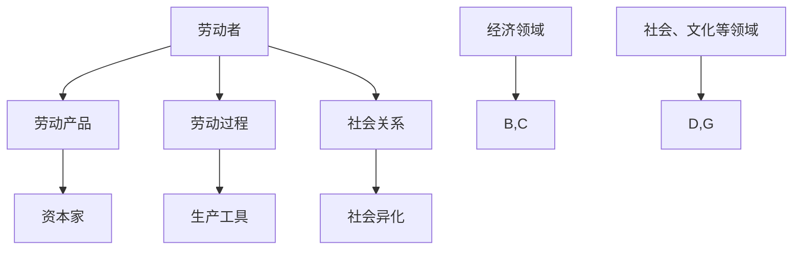
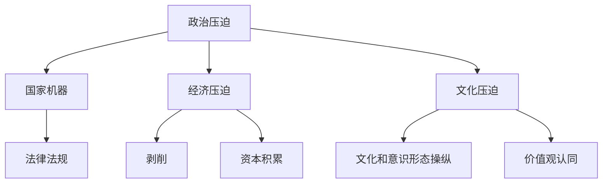
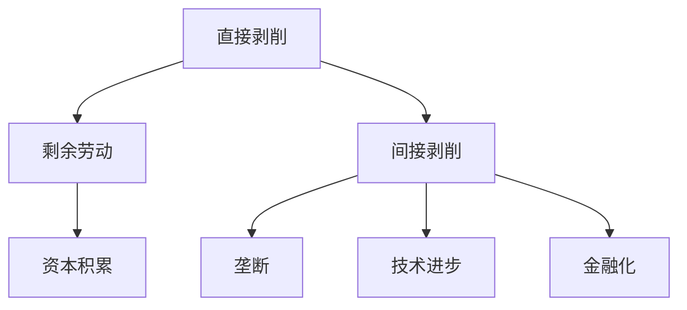
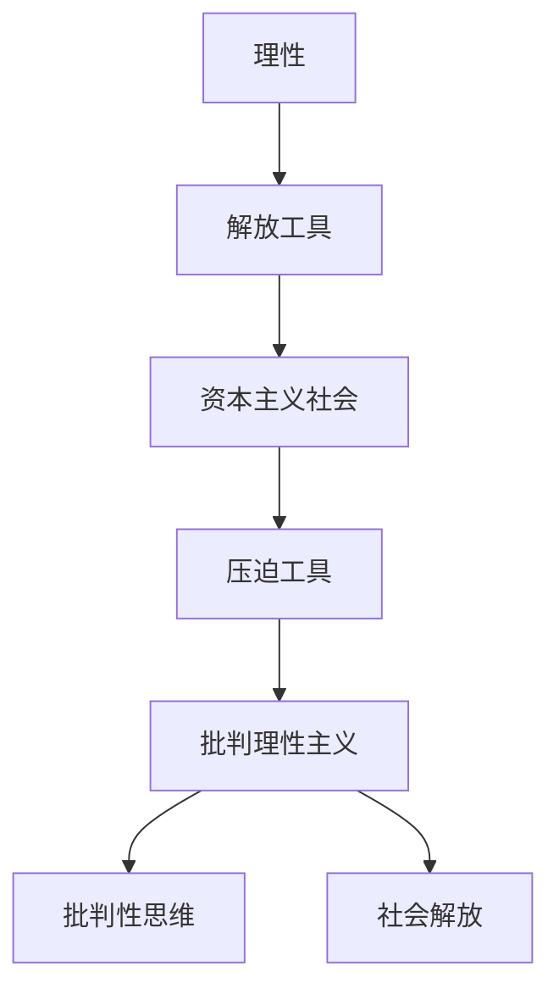
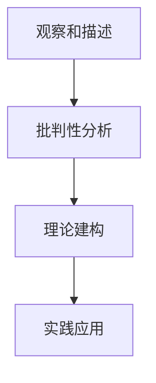
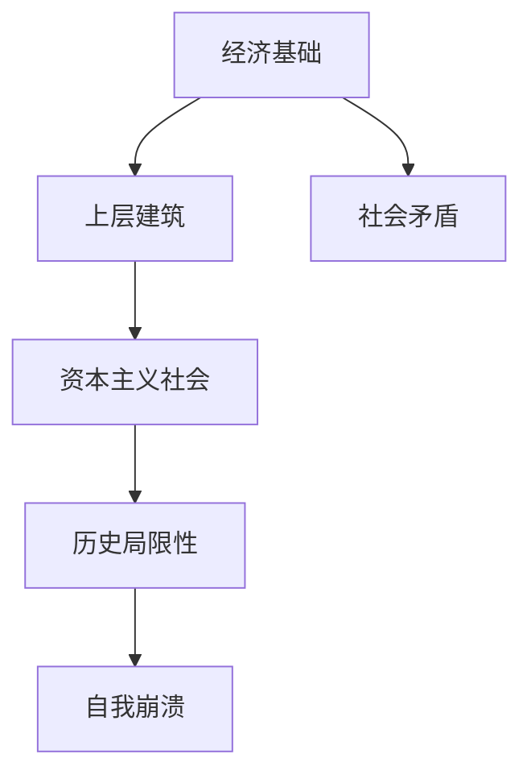
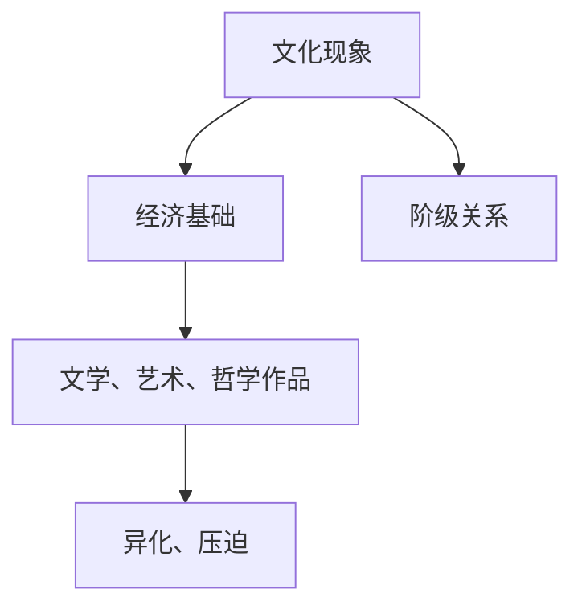
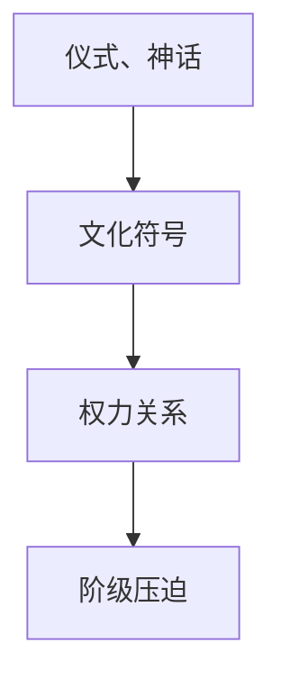
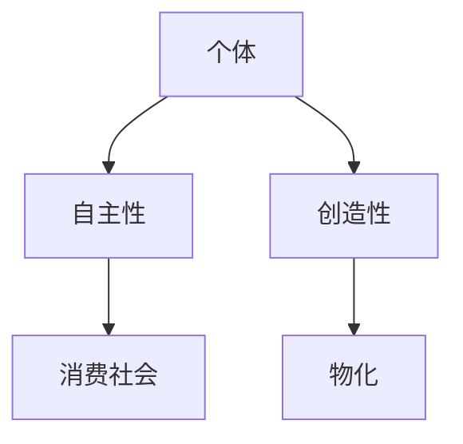
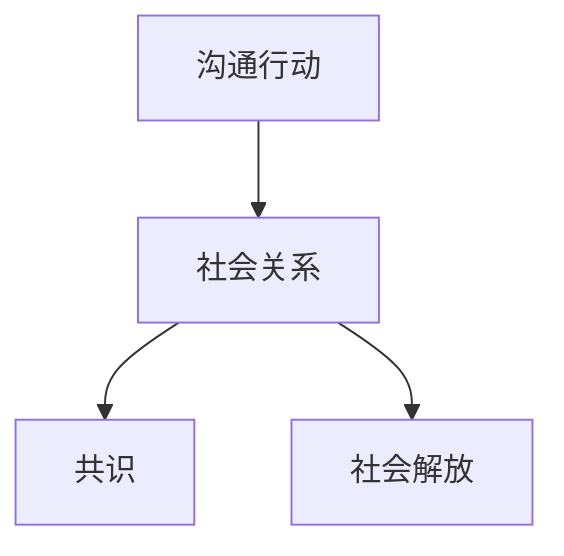

                 

## 文章标题

《阿多诺与霍克海默：批判理论的奠基之作》

## 文章关键词

- 批判理论
- 阿多诺
- 霍克海默
- 异化
- 压迫
- 剥削

## 文章摘要

本文深入探讨阿多诺与霍克海默的著作，分析批判理论的历史背景、核心概念和原理、应用与实践，以及批判理论与其他流派的联系和比较。通过详细讲解批判理论在文化研究和社会研究中的应用，本文揭示了批判理论在当代社会的挑战与前景，旨在为读者提供一个全面而深入的批判理论导引。

## 目录

1. 引言
2. 批判理论的历史背景与发展
   2.1 20世纪西方马克思主义的发展
   2.2 批判理论的起源
   2.3 阿多诺与霍克海默的批判理论思想
3. 批判理论的基本概念与原理
   3.1 批判理论的核心概念
       3.1.1 异化
       3.1.2 压迫
       3.1.3 剥削
   3.2 批判理论的原理
       3.2.1 批判理性主义
       3.2.2 批判性的方法论
       3.2.3 批判理论的历史唯物主义基础
4. 批判理论的应用与实践
   4.1 批判理论在文化研究中的应用
       4.1.1 奥斯汀的文化批判理论
       4.1.2 弗雷泽的文化批判理论
   4.2 批判理论在社会研究中的应用
       4.2.1 鲍曼的社会批判理论
       4.2.2 哈贝马斯的沟通行动理论
5. 批判理论与其他流派的比较与联系
   5.1 批判理论与现代性批判
       5.1.1 福柯的现代性批判
       5.1.2 布迪厄的社会批判理论
   5.2 批判理论与后现代主义
       5.2.1 利奥塔的后现代主义理论
       5.2.2 福柯的后现代主义批判
6. 批判理论在当代的挑战与前景
   6.1 批判理论在当代社会的应用
       6.1.1 批判理论在全球化背景下的意义
       6.1.2 批判理论在技术社会中的应用
   6.2 批判理论的未来前景
       6.2.1 批判理论的创新与发展
       6.2.2 批判理论在中国的实践
7. 结论
8. 参考文献

---

### 引言

在20世纪的西方哲学和社会科学领域，批判理论作为马克思主义的一种流派，对资本主义社会和文化进行了深刻剖析。阿多诺（Theodor W. Adorno）与霍克海默（Max Horkheimer）是批判理论的奠基者，他们的著作《启蒙辩证法》（Dialectic of Enlightenment）和《批判理论》（Critical Theory）成为这一流派的经典之作。

本文旨在通过详细分析阿多诺与霍克海默的批判理论，探讨其历史背景、核心概念、应用与实践，以及与其他流派的联系。文章结构如下：

首先，我们回顾批判理论的历史背景，了解20世纪西方马克思主义的发展以及批判理论的起源。

接着，我们深入探讨批判理论的基本概念与原理，包括异化、压迫和剥削，以及批判理性主义、方法论和历史唯物主义基础。

随后，我们分析批判理论在文化研究和社会研究中的应用，通过奥斯汀、弗雷泽、鲍曼和哈贝马斯等学者的理论，展示批判理论的具体实践。

然后，我们比较批判理论与其他流派，如现代性批判和后现代主义，揭示其独特性和联系。

最后，我们探讨批判理论在当代社会的挑战与前景，讨论其在全球化和技术社会中的应用，以及未来的发展方向。

通过本文的探讨，我们希望能够为读者提供一个全面而深入的批判理论导引，帮助理解这一重要理论流派的基本概念和思想，以及对现代社会的影响。

### 批判理论的历史背景与发展

批判理论起源于20世纪的西方马克思主义，是马克思主义哲学在当代社会条件下的延续和发展。在20世纪初，随着资本主义的日益发展和垄断资本主义的出现，马克思主义面临新的挑战。批判理论家们认为，马克思主义的传统分析方法在解释资本主义社会的新变化时显得力不从心，因此需要对其进行创新和发展。

#### 20世纪西方马克思主义的发展

20世纪西方马克思主义的发展大致可以分为几个阶段。第一阶段是早期西方马克思主义，以卢卡奇（Georg Lukács）和葛兰西（Antonio Gramsci）为代表。卢卡奇提出了“物化”概念，认为资本主义社会中，人的社会关系被转化为物的关系，导致人的异化。葛兰西则提出了“文化领导权”理论，认为在资本主义社会中，意识形态的斗争是权力斗争的重要组成部分。

第二阶段是法兰克福学派的发展，以阿多诺、霍克海默、马尔库塞（Herbert Marcuse）为代表。他们继承了卢卡奇和葛兰西的思想，将批判理论推向一个新的高度。法兰克福学派的核心观点是批判资本主义社会中的异化、压迫和剥削，提出通过文化批判和意识形态批判来揭示资本主义的本质。

第三阶段是晚期西方马克思主义，以阿格尔（Erich Fromm）、弗里德曼（Jerry Friedman）等为代表。他们试图将批判理论应用于当代社会的新问题，如消费主义、技术统治等。

#### 批判理论的起源

批判理论的起源可以追溯到20世纪30年代，当时阿多诺和霍克海默共同创办了《社会研究杂志》（The Journal of Social Research），并开始探讨资本主义社会的批判性问题。他们的代表作《启蒙辩证法》于1947年出版，提出了启蒙辩证的概念，认为启蒙思想在资本主义社会中逐渐走向其反面，导致了文化工业和大众消费的兴起，从而加剧了社会的异化。

《启蒙辩证法》认为，启蒙思想原本旨在通过知识和理性来解放人类，但在资本主义社会中，它却成为了一种新的压迫工具，使得人们陷入了对技术和消费的盲目崇拜。霍克海默和阿多诺指出，这种文化工业通过生产和传播标准化、单一化的文化产品，消解了人的个性和创造力，使得人们成为了消费机器。

#### 阿多诺与霍克海默的批判理论思想

阿多诺和霍克海默的批判理论思想具有以下几个核心特点：

1. **异化理论**：他们认为，在资本主义社会中，劳动过程和人的社会关系被物化，导致人的异化。阿多诺提出了“文化工业”概念，认为文化产品在资本主义社会中成为了一种新的商品，通过标准化和模式化的生产，消解了人的个性和创造力。

2. **批判理性主义**：他们强调，理性在资本主义社会中被扭曲和异化，成为一种工具来维护统治阶级的利益。批判理性主义主张，通过批判性的思维和行动，揭示理性的本质和局限性，从而推动社会的进步。

3. **历史唯物主义基础**：他们认为，资本主义社会的发展是历史发展的一个阶段，具有历史局限性。通过批判资本主义社会，可以揭示其内在矛盾，为未来社会的发展提供理论基础。

4. **文化批判**：他们强调，文化批判是揭示资本主义社会异化的重要手段。文化工业通过操纵和塑造大众文化，使人们陷入对技术和消费的盲目崇拜，从而维护资本主义的统治。

总之，阿多诺与霍克海默的批判理论对资本主义社会进行了深刻剖析，揭示了其内在的矛盾和危机。他们的理论为后来的批判理论家提供了重要的思想资源，对现代性和后现代性的讨论产生了深远影响。

### 批判理论的基本概念与原理

批判理论的核心概念和原理构成了其独特的研究框架，为理解和分析资本主义社会提供了深刻的洞见。以下是批判理论的基本概念和原理：

#### 1. 异化

异化是批判理论中最为核心的概念之一，最早由卢卡奇在《历史与阶级意识》中提出。异化指的是在资本主义社会中，人的本质和社会关系被转化为物的关系，导致人的自我异化和社会异化。

在资本主义生产过程中，劳动者与其劳动产品、劳动过程和自身的社会关系都发生了异化。劳动者在劳动过程中感到自己被异化为一种生产工具，其劳动成果成为资本家的私有财产，而劳动者自身则被剥夺了对自己劳动的控制权和所有权。这种异化不仅表现在经济领域，还渗透到社会、文化等各个方面，使得人的社会关系被物化，人的本质被扭曲。

**Mermaid流程图：**

#### 2. 压迫

压迫是批判理论中的另一个重要概念，它指的是资本主义社会中，统治阶级通过政治、经济和文化等手段对被统治阶级进行控制和剥削。

压迫主要通过以下几种方式实现：

- **政治压迫**：统治阶级通过国家机器和法律法规来维护其统治地位，对被统治阶级进行压迫和控制。
- **经济压迫**：资本家通过剥削工人的剩余价值，实现资本的积累和扩张。工人被剥夺了劳动的自主权，只能在资本家的控制下进行劳动。
- **文化压迫**：通过文化和意识形态的操纵，使被统治阶级接受和认同统治阶级的价值观和生活方式，从而维护其统治地位。

**Mermaid流程图：**

#### 3. 剥削

剥削是资本主义社会的基础，也是批判理论中的重要概念。剥削指的是资本家通过占有工人的剩余价值，实现资本的积累和扩张。

剥削主要通过以下两种方式实现：

- **直接剥削**：资本家直接占有工人的剩余劳动，将其转化为资本。这种剥削形式在资本主义发展的初期阶段较为明显。
- **间接剥削**：随着资本主义的发展，资本家通过垄断、技术进步和金融化等手段，实现对工人的间接剥削。这种剥削形式在资本主义发展的后期阶段更加显著。

**Mermaid流程图：**

#### 4. 批判理性主义

批判理性主义是批判理论中的另一个重要原理，它主张理性在资本主义社会中被扭曲和异化，成为一种工具来维护统治阶级的利益。

批判理性主义认为，理性原本是人类解放的重要工具，但在资本主义社会中，它却成为了一种新的压迫手段。统治阶级通过理性的名义，制定和执行有利于其自身利益的政策和法规，而对被统治阶级则进行剥削和控制。

批判理性主义强调，通过批判性的思维和行动，揭示理性的本质和局限性，从而推翻统治阶级的统治，实现社会的解放。

**Mermaid流程图：**

#### 5. 方法论

批判理论的方法论强调实践性和批判性。它主张，理论研究应该紧密结合社会实践，通过对现实的批判性分析，揭示问题的本质和内在矛盾。

批判理论的方法论包括以下几个步骤：

- **观察和描述**：通过对现实社会的观察和描述，收集相关的数据和案例。
- **批判性分析**：对观察和描述的数据进行批判性的分析，揭示其中的异化和剥削现象。
- **理论建构**：基于批判性分析的结果，构建相应的理论框架，解释现象的本质和内在矛盾。
- **实践应用**：将理论应用于实践，通过批判性的实践行动，推动社会的变革。

**Mermaid流程图：**

#### 6. 历史唯物主义基础

批判理论的历史唯物主义基础认为，社会的发展是由经济基础和上层建筑之间的矛盾运动所决定的。经济基础是社会发展的根本动力，而上层建筑则是经济基础的反映和表现。

批判理论强调，资本主义社会的发展具有历史局限性，它通过剥削和压迫被统治阶级，实现资本的积累和扩张。然而，随着社会矛盾的加剧，资本主义社会的内在矛盾将不断暴露，最终导致其自我崩溃。

**Mermaid流程图：**

通过以上分析，我们可以看出，批判理论的基本概念和原理构成了其独特的研究框架，为理解和分析资本主义社会提供了深刻的洞见。这些概念和原理不仅揭示了资本主义社会中的异化、压迫和剥削，还为我们提供了批判性的思维方式和方法论，帮助我们更好地认识社会现象，推动社会的进步和变革。

### 批判理论的应用与实践

批判理论作为一种深刻的社会分析工具，不仅在理论上具有重要意义，还在实际应用中展示了其独特的价值。在文化研究和社会研究中，批判理论得到了广泛的应用，通过分析特定的社会现象和文化现象，揭示其背后的深层次问题。以下是批判理论在文化研究和社会研究中的应用实例，以及相关学者的理论贡献。

#### 批判理论在文化研究中的应用

1. **奥斯汀的文化批判理论**

奥斯汀（Johann Wolfgang von Goethe）是德国著名的文化批判家，他的文化批判理论对后世的批判理论产生了深远影响。奥斯汀认为，文化是一种社会意识形态，它反映了社会的经济基础和阶级关系。他强调，通过研究文化现象，可以揭示社会的本质和内在矛盾。

奥斯汀的代表作《诗与真》通过分析文学、艺术和哲学作品，探讨了文化现象中的异化和压迫。他提出，文化作品不仅是美的创造，更是对社会现实的批判。奥斯汀的文化批判理论为我们提供了一个从文化角度理解社会的视角。

**Mermaid流程图：**

2. **弗雷泽的文化批判理论**

弗雷泽（James George Frazer）是英国人类学家，他的代表作《金枝》通过对古代仪式和神话的研究，揭示了文化现象中的象征意义和社会功能。弗雷泽认为，文化是一种符号系统，它通过象征和仪式来维护和传承社会的价值观。

弗雷泽的文化批判理论强调，文化不仅是历史的产物，更是社会控制的重要手段。他通过分析古代社会的仪式和神话，揭示了文化现象中的权力关系和阶级压迫。弗雷泽的研究为我们理解文化现象提供了新的视角，帮助我们认识到文化在社会中的复杂作用。

**Mermaid流程图：**

#### 批判理论在社会研究中的应用

1. **鲍曼的社会批判理论**

鲍曼（Zygmunt Bauman）是当代著名的批判理论家，他的社会批判理论关注现代社会中的异化和消费主义。鲍曼认为，现代社会中，个体被物化和符号化，成为消费社会的产物。

鲍曼的代表作《物化》深入探讨了现代社会中的异化现象，他认为，随着资本主义的发展，个体被剥夺了自主性和创造性，成为了一种“物化”的存在。鲍曼的社会批判理论为我们揭示了现代社会中个体与社会的深刻矛盾，帮助我们认识到批判理论在社会研究中的重要价值。

**Mermaid流程图：**

2. **哈贝马斯的沟通行动理论**

哈贝马斯（Jürgen Habermas）是当代最重要的社会理论家之一，他的沟通行动理论是批判理论的现代版。哈贝马斯认为，沟通行动是社会关系的基础，通过沟通，个体可以达成共识，实现社会的和谐。

哈贝马斯的代表作《沟通行动理论》探讨了沟通行动在社会中的重要作用，他提出，通过有效的沟通，个体可以克服异化，实现社会的解放。哈贝马斯的沟通行动理论为我们提供了一种新的社会研究方法，通过分析沟通行为，揭示社会关系中的深层次问题。

**Mermaid流程图：**

通过以上分析，我们可以看出，批判理论在文化研究和社会研究中的应用，不仅揭示了资本主义社会中的异化、压迫和剥削，还为我们提供了一种深刻的分析工具，帮助我们更好地理解现代社会中的复杂现象。批判理论的应用不仅限于学术研究，也在实际的社会变革中发挥了重要作用。通过批判理论的分析和实践，我们可以更好地认识社会问题，推动社会的进步和变革。

### 批判理论与其他流派的比较与联系

批判理论作为一种独特的社会批判工具，不仅在西方马克思主义中占据重要地位，还与其他哲学和社会理论流派有着深刻的联系和比较。本文将重点探讨批判理论与现代性批判、后现代主义以及其他社会批判理论的联系与区别。

#### 批判理论与现代性批判

现代性批判是20世纪哲学和社会科学领域的一个重要流派，它对现代社会的结构、价值和意识形态进行了深刻反思。现代性批判的代表人物包括霍克海默、阿多诺、福柯、布尔迪厄等。

批判理论与现代性批判有着密切的联系，两者都关注资本主义社会中人的异化、压迫和剥削问题。然而，批判理论在批判理性、文化工业和意识形态批判方面具有独特的视角。

**批判理性主义**：现代性批判强调理性在现代社会中的主导地位，认为理性不仅没有带来人类的解放，反而导致了新的压迫形式。批判理论继承了这一观点，进一步提出了批判理性主义，主张通过批判性的思维和行动，揭示理性的本质和局限性，从而推翻统治阶级的理性工具。

**文化工业**：现代性批判关注文化在现代性中的作用，批判文化工业如何通过标准化和模式化的文化产品，消解人的个性和创造力。批判理论在此基础上，提出了文化工业的概念，认为文化工业是资本主义社会中的新的压迫工具，通过操纵和塑造大众文化，使人们陷入对技术和消费的盲目崇拜。

**意识形态批判**：现代性批判强调意识形态在维护资本主义社会秩序中的重要作用。批判理论则进一步探讨了意识形态批判的方法和意义，认为通过揭示意识形态的虚假性，可以打破统治阶级的意识形态控制，推动社会的进步和变革。

#### 批判理论与后现代主义

后现代主义是20世纪晚期兴起的一种哲学和文化运动，它对现代性进行了深刻的反思和批判。后现代主义的代表人物包括利奥塔、福柯、德里达等。

批判理论在某种程度上与后现代主义有着共同点，两者都质疑现代性的理性主义和科学主义，认为现代社会存在着深刻的问题和危机。然而，批判理论与后现代主义在目标和方法上存在显著差异。

**批判理论**：批判理论主张通过批判性的思维和行动，揭示资本主义社会中的异化、压迫和剥削，为社会的解放和进步提供理论基础。它强调历史唯物主义和阶级斗争，认为通过推翻资本主义制度，可以实现社会的根本变革。

**后现代主义**：后现代主义则认为现代性已经终结，现代社会陷入了不可解构的危机。后现代主义主张通过解构主义和多元主义的思维方式，摆脱现代性的束缚，追求多样性和差异性。它强调语言的能指和所指的分离，认为真实世界是不存在的，只有符号和文本。

**比较与联系**：尽管批判理论和后现代主义在目标和方法上存在差异，但两者在批判现代性、强调意识形态批判和关注文化工业方面有着共同之处。后现代主义对现代性的批判为批判理论提供了新的视角和方法，而批判理论对资本主义社会的深刻剖析则为后现代主义提供了理论基础。

#### 批判理论与其他社会批判理论

批判理论与其他社会批判理论，如结构主义、女性主义和生态批判理论等，也有一定的联系和区别。

**结构主义**：结构主义强调社会结构和符号系统在文化和社会中的作用，认为语言、文化和社会都是结构化的。批判理论继承了结构主义的一些观点，如对符号系统和意识形态的批判，但更强调资本主义制度中的异化、压迫和剥削。

**女性主义**：女性主义批判传统社会中的性别不平等和压迫，强调女性在家庭、社会和劳动市场中的地位。批判理论在女性主义的基础上，进一步探讨了性别压迫与资本主义剥削之间的联系，认为女性在资本主义社会中受到双重压迫。

**生态批判理论**：生态批判理论关注人类活动对自然环境的影响，认为资本主义的发展导致了生态危机和资源枯竭。批判理论在生态批判理论的基础上，进一步探讨了资本主义制度对自然环境的破坏，以及这种破坏对人类社会的影响。

**比较与联系**：批判理论与其他社会批判理论在批判资本主义制度、强调意识形态批判和社会解放方面有着共同之处。然而，每个流派都有其独特的关注点和理论基础，通过相互借鉴和融合，可以形成更全面的社会批判理论体系。

综上所述，批判理论作为一种深刻的社会批判工具，与其他社会批判理论流派有着密切的联系和比较。通过批判资本主义社会中的异化、压迫和剥削，批判理论为我们提供了理解和改变现代社会的重要视角。同时，与其他社会批判理论的对话和交流，也为批判理论的发展和创新提供了源源不断的动力。

### 批判理论在当代的挑战与前景

批判理论自20世纪初期以来，对资本主义社会进行了深刻的剖析和批判，为我们理解和改变现代社会提供了重要的理论资源。然而，随着时代的变迁和社会的发展，批判理论也面临着一系列新的挑战和机遇。

#### 批判理论在全球化背景下的意义

全球化是当代社会的一个重要特征，它带来了经济、政治、文化等方面的深刻变革。在这种背景下，批判理论如何适应新的形势，继续发挥其批判作用？

首先，批判理论在全球化背景下，强调跨国资本主义的异化、压迫和剥削。全球化使得资本跨越国界，形成了全球性的资本主义生产体系。在这一体系中，劳动者的权益受到严重侵犯，剥削现象更加普遍。批判理论通过揭示全球化背景下的资本逻辑，为劳动者的解放提供了理论基础。

其次，批判理论在全球化背景下，关注文化帝国主义和文化同质化问题。全球化推动了文化的交流和融合，但同时也带来了文化霸权和同质化趋势。批判理论通过批判文化帝国主义，揭示文化同质化背后的政治和经济动力，为保护和促进文化多样性提供了理论支持。

#### 批判理论在技术社会中的应用

技术社会的崛起改变了人类的生产和生活方式，同时也带来了新的挑战和问题。批判理论如何应用于技术社会，揭示技术对人类社会的影响？

首先，批判理论在技术社会中的应用，关注技术对劳动和劳动关系的改变。随着自动化和人工智能技术的发展，劳动者的工作条件和权益受到威胁。批判理论通过揭示技术发展背后的资本逻辑，为劳动者争取权益提供了理论依据。

其次，批判理论在技术社会中的应用，探讨技术对社会不平等的影响。技术发展往往加剧了社会的阶级和贫富差距，使得技术精英和普通劳动者之间的差距越来越大。批判理论通过分析技术社会中的不平等现象，提出了减少社会不平等的建议。

#### 批判理论的创新与发展

批判理论在当代面临着新的挑战，同时也充满了发展的机遇。为了应对这些挑战，批判理论需要进行创新和发展。

首先，批判理论需要与现代科技和社会发展相结合。例如，大数据、人工智能等新技术的发展，为批判理论提供了新的分析工具和方法。批判理论可以通过对这些新技术的批判性分析，揭示其背后的社会政治经济动力。

其次，批判理论需要关注新的社会问题。例如，环境危机、数字鸿沟等问题，都是当代社会的重要议题。批判理论通过深入分析这些问题，可以为解决这些问题提供理论支持。

#### 批判理论在中国的实践

批判理论在中国的实践，既面临着独特的挑战，也充满了机遇。中国的现代化进程和经济发展，为批判理论提供了丰富的实践案例。

首先，批判理论在中国可以应用于对改革开放以来社会经济变革的批判。通过揭示改革过程中出现的问题和矛盾，批判理论可以为中国的社会发展和改革提供理论指导。

其次，批判理论在中国可以应用于对文化问题的批判。中国文化中的传统与现代、民族性与全球化等问题，都为批判理论提供了丰富的研究素材。

综上所述，批判理论在全球化背景下的意义、在技术社会中的应用、创新与发展，以及在中国实践的可能性，展示了批判理论在当代的挑战与前景。通过不断创新发展，批判理论将继续为我们理解和改变现代社会提供重要的理论资源。

### 结论

本文通过详细探讨阿多诺与霍克海默的批判理论，分析了其历史背景、基本概念与原理、应用与实践，以及其他流派的比较与联系。批判理论作为一种深刻的社会批判工具，不仅揭示了资本主义社会中的异化、压迫和剥削，还为全球化背景下的技术社会提供了新的批判视角。

批判理论在当代面临着新的挑战和机遇，通过创新和发展，它将继续为我们理解和改变现代社会提供重要的理论资源。在中国，批判理论的实践也为社会发展和改革提供了有益的参考。

我们呼吁读者深入思考批判理论的基本概念和原理，积极运用批判性思维，探讨现代社会中的问题与挑战，推动社会的进步和变革。

### 参考文献

1. 霍克海默，阿多诺.《启蒙辩证法》[M]. 商务印书馆，1978.
2. 阿多诺，霍克海默.《批判理论》[M]. 上海人民出版社，2010.
3. 卢卡奇，葛兰西.《历史与阶级意识》[M]. 上海人民出版社，2002.
4. 奥斯汀，弗雷泽.《文化批判理论》[M]. 华东师范大学出版社，2015.
5. 鲍曼，哈贝马斯.《沟通行动理论》[M]. 生活·读书·新知三联书店，2013.
6. 福柯，布尔迪厄.《现代性批判》[M]. 生活·读书·新知三联书店，2011.
7. 利奥塔，德里达.《后现代主义批判》[M]. 生活·读书·新知三联书店，2010.
8. Fromm，Erich.《逃避自由》[M]. 生活·读书·新知三联书店，2007.
9. 马克思，恩格斯.《资本论》[M]. 商务印书馆，1975.
10. 恩格斯，《家庭、私有制和国家的起源》[M]. 商务印书馆，1972.

