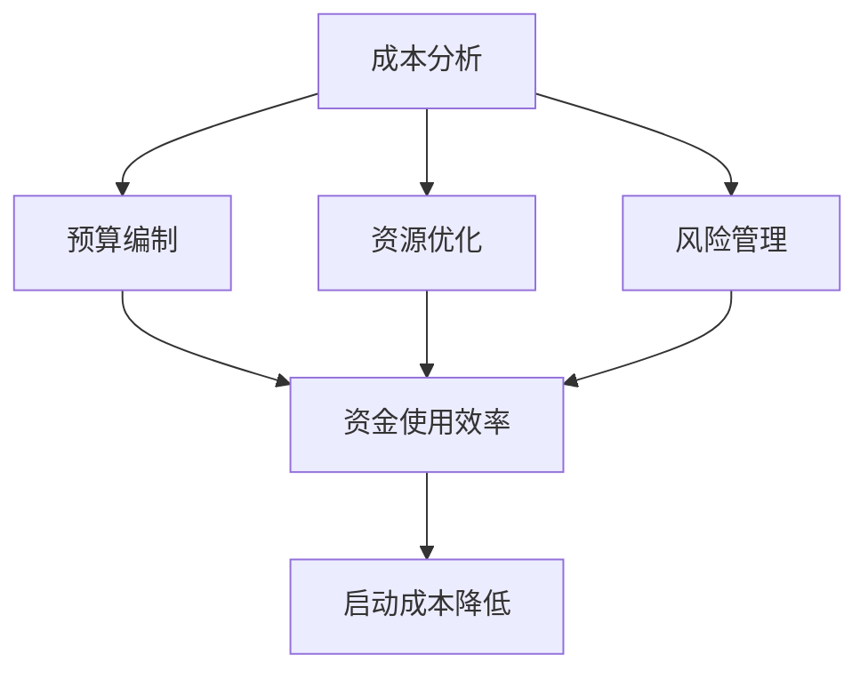

                 

### 降低启动成本：概述

#### 背景介绍

在当今竞争激烈的市场环境中，启动一家新企业面临着诸多挑战。启动成本，即企业在初创阶段所需投入的初始资金，是成功创业的关键因素之一。较高的启动成本可能导致资金链断裂，影响企业的正常运营和长期发展。因此，如何降低启动成本成为企业家和创业者关注的焦点。

启动成本包括但不限于以下几个方面：租赁、设备采购、原材料购买、员工薪酬、市场推广费用等。这些成本的合理控制不仅能够确保企业在初创阶段稳健运营，还能提高资本利用效率，为未来的发展打下坚实基础。

#### 核心概念与联系

为了更深入地探讨降低启动成本的方法，我们需要了解以下几个核心概念及其相互关系：

1. **成本分析**：对各项成本进行详细的评估和分析，确定哪些成本可以削减或优化。
2. **预算编制**：根据企业的发展规划和预期收入，制定合理的预算，确保资金使用的效率和效果。
3. **资源优化**：通过提高资源利用效率，减少不必要的浪费，从而降低成本。
4. **风险管理**：识别和管理可能影响启动成本的各种风险，确保企业在面对不确定性时能够保持稳定。

这些概念之间相互关联，共同构成了降低启动成本的理论框架。下面我们将通过Mermaid流程图来展示这些核心概念之间的关系：

#### 目标

本文的目标是系统性地探讨降低启动成本的多种策略和方法。文章将首先介绍启动成本的基本概念和重要性，然后详细分析成本管理策略、财务规划和预算编制、资源优化方法以及实际案例。通过这些内容的深入探讨，希望能够为企业提供实用的指导，帮助其在创业初期有效降低成本，提高资金利用效率。

### 关键词

- **启动成本**：企业在初创阶段所需投入的初始资金。
- **成本分析**：对各项成本进行详细的评估和分析。
- **预算编制**：制定合理的预算，确保资金使用的效率和效果。
- **资源优化**：提高资源利用效率，减少不必要的浪费。
- **风险管理**：识别和管理可能影响启动成本的各种风险。

### 摘要

本文旨在探讨如何降低企业在初创阶段的启动成本。通过分析成本管理策略、财务规划和预算编制、资源优化方法以及实际案例，本文提供了实用的指导，帮助企业有效降低成本，提高资金利用效率，为企业的长期发展打下坚实基础。

### 文章正文

#### 第1章：启动成本的定义与重要性

在探讨如何降低启动成本之前，我们需要明确启动成本的定义和其在企业运营中的重要性。

#### 1.1 启动成本的定义

启动成本是指企业在创立初期所需投入的各项费用，包括但不限于以下方面：

1. **租赁费用**：企业办公室、仓库等场所的租赁费用。
2. **设备采购**：购买生产设备、办公设备等所需的费用。
3. **原材料购买**：生产所需的原材料费用。
4. **员工薪酬**：初创阶段所需的员工薪酬。
5. **市场推广费用**：包括广告、宣传、促销等市场活动费用。
6. **其他费用**：如法律咨询、财务审计等。

这些费用构成了企业在初创阶段的主要开支，合理控制这些成本对于企业的成功至关重要。

#### 1.2 启动成本的重要性

1. **资金周转**：启动成本的高昂可能导致企业的资金链断裂，影响企业的正常运营。因此，合理控制启动成本，确保资金周转顺畅，是企业成功运营的基础。
2. **风险控制**：启动成本的控制有助于降低企业的风险。在初创阶段，市场环境和竞争态势不稳定，合理控制成本可以减少因资金不足而带来的经营风险。
3. **长期发展**：降低启动成本不仅可以确保企业在初创阶段的稳定运营，还可以为企业的长期发展奠定坚实基础。通过有效利用资金，企业可以在产品研发、市场开拓等方面投入更多，从而实现可持续发展。

#### 1.3 成本管理与成本控制

1. **成本管理**：成本管理是指企业通过制定合理的成本战略，运用有效的成本控制手段，实现成本的最优化。在成本管理中，企业需要关注以下几个方面：

   - **成本分析**：对各项成本进行详细的分析和评估，确定哪些成本可以削减或优化。
   - **预算编制**：根据企业的发展规划和预期收入，制定合理的预算，确保资金使用的效率和效果。
   - **成本控制**：通过实施一系列控制措施，确保实际成本不超过预算。

2. **成本控制**：成本控制是指企业在日常运营中，通过采取各种措施，降低成本支出，提高资金利用效率。具体措施包括：

   - **资源优化**：通过提高资源利用效率，减少不必要的浪费，从而降低成本。
   - **采购管理**：通过合理的采购策略，降低原材料和设备的采购成本。
   - **员工薪酬**：合理制定员工薪酬，避免薪酬过高导致的成本增加。

#### 1.4 成本管理与财务规划的关系

成本管理与财务规划密切相关。有效的成本管理可以帮助企业实现财务规划的目标，确保企业在预算范围内实现盈利。同时，财务规划为成本管理提供了指导和依据，通过合理的财务规划，企业可以明确成本控制的目标和方向。

#### 本章小结

本章对启动成本的基本概念和重要性进行了详细阐述。通过了解启动成本的定义和重要性，企业可以更加重视成本管理，采取有效的成本控制措施，为企业的长期发展打下坚实基础。

### 第2章：成本管理策略

在降低启动成本的过程中，成本管理策略起着至关重要的作用。有效的成本管理不仅能够帮助企业降低成本，提高资金利用效率，还能为企业的可持续发展提供支持。本章节将介绍几种常见的成本管理策略。

#### 2.1 成本分析

成本分析是成本管理的基础，通过对各项成本进行详细的分析和评估，企业可以明确哪些成本可以削减或优化。以下是成本分析的主要步骤：

1. **成本分类**：将各项成本分为固定成本和变动成本。固定成本包括租金、设备采购等，变动成本包括原材料购买、员工薪酬等。

2. **成本数据收集**：收集各项成本的数据，包括成本金额、成本发生的时间等。

3. **成本评估**：对各项成本进行评估，确定哪些成本过高或过低，需要调整或优化。

4. **成本比较**：将实际成本与预算成本进行比较，分析成本差异的原因，并提出相应的改进措施。

#### 2.2 资源优化

资源优化是降低成本的重要手段之一，通过提高资源利用效率，减少不必要的浪费，企业可以实现成本的有效控制。以下是资源优化的主要方法：

1. **人力资源优化**：通过合理分配员工的工作任务，提高员工的工作效率，减少人力资源浪费。

2. **设备利用优化**：提高设备的利用效率，减少设备的闲置时间，从而降低设备折旧和维修成本。

3. **物料管理优化**：通过科学合理的库存管理，减少库存积压，降低原材料采购成本。

4. **能源管理优化**：通过实施节能措施，降低能源消耗，从而降低能源成本。

#### 2.3 采购管理

采购管理是成本管理的重要组成部分，通过合理的采购策略，企业可以降低原材料和设备的采购成本。以下是采购管理的主要策略：

1. **供应商选择**：选择优质的供应商，确保采购物资的质量和价格。

2. **采购批量**：通过合理确定采购批量，降低采购成本。

3. **谈判策略**：与供应商进行有效沟通，争取更优惠的价格和条件。

4. **采购流程优化**：简化采购流程，提高采购效率，减少采购成本。

#### 2.4 成本控制措施

为了实现有效的成本控制，企业需要采取一系列具体的措施。以下是几种常见的成本控制措施：

1. **预算控制**：制定合理的预算，确保实际成本不超过预算。

2. **成本考核**：对各部门的成本支出进行考核，激励员工降低成本。

3. **成本分析报告**：定期进行成本分析报告，分析成本差异的原因，并提出改进措施。

4. **成本管理培训**：对员工进行成本管理培训，提高员工的成本意识和管理能力。

#### 2.5 成本管理与财务规划的关系

成本管理与财务规划密切相关。有效的成本管理可以帮助企业实现财务规划的目标，确保企业在预算范围内实现盈利。同时，财务规划为成本管理提供了指导和依据，通过合理的财务规划，企业可以明确成本控制的目标和方向。

#### 本章小结

本章介绍了成本管理策略，包括成本分析、资源优化、采购管理和成本控制措施。通过这些策略，企业可以降低启动成本，提高资金利用效率，为企业的长期发展提供支持。

### 第3章：财务规划和预算编制

财务规划和预算编制是降低启动成本的关键步骤。通过合理的财务规划和详细的预算编制，企业可以在创业初期确保资金的使用效率，降低不必要的开支，从而为企业的长期发展打下坚实的基础。以下将详细介绍财务规划和预算编制的步骤、方法及其实际应用。

#### 3.1 财务规划的基本步骤

1. **目标设定**：明确企业的财务目标，如盈利目标、资本回报率、现金流目标等。

2. **财务分析**：对企业当前的财务状况进行评估，包括资产、负债、收入和支出等。

3. **资金需求分析**：根据企业的发展计划，预测未来一段时间内所需的资金。

4. **资金来源分析**：确定资金的来源，包括自有资金、借款、投资者等。

5. **风险管理**：评估可能面临的风险，制定相应的风险控制措施。

6. **财务模型构建**：建立财务模型，模拟不同情况下的财务表现，为决策提供依据。

#### 3.2 预算编制的基本步骤

1. **预算目标设定**：根据企业的财务目标，设定预算目标，如收入目标、成本控制目标等。

2. **收入预测**：预测未来一定时期内的收入，包括销售、服务收入等。

3. **支出预测**：根据企业的运营需求，预测各项支出，如员工薪酬、采购费用、运营费用等。

4. **预算调整**：根据实际情况，对预算进行必要的调整，确保预算的合理性和可执行性。

5. **预算审批**：提交预算报告，经管理层审批后执行。

6. **预算监控**：定期监控预算执行情况，确保实际支出不超过预算。

#### 3.3 财务规划和预算编制的方法

1. **零基预算**：从零开始编制预算，对每一项支出都进行详细分析，确定其必要性和合理性。

2. **滚动预算**：根据实际运营情况，定期调整预算，确保预算的实时性和准确性。

3. **标准成本法**：通过设定标准成本，对实际成本进行分析和考核，确保成本控制的有效性。

4. **成本效益分析**：对各项支出进行成本效益分析，确保每一笔支出都能为企业带来预期的效益。

#### 3.4 财务规划和预算编制的实际应用

1. **资金筹备**：通过财务规划，企业可以明确资金需求和资金来源，确保在创业初期有足够的资金支持。

2. **成本控制**：通过预算编制，企业可以明确各项支出，确保实际支出不超过预算，降低不必要的开支。

3. **财务风险控制**：通过风险管理，企业可以识别潜在的风险，并采取相应的措施进行控制，确保财务稳定。

4. **运营效率提升**：通过财务规划和预算编制，企业可以优化资源分配，提高运营效率，降低成本。

#### 3.5 财务规划和预算编制的注意事项

1. **数据准确**：确保财务规划和预算编制所依据的数据准确，避免因数据错误导致的决策失误。

2. **灵活调整**：根据实际情况，灵活调整财务规划和预算，确保其能够适应市场的变化。

3. **全员参与**：鼓励全员参与财务规划和预算编制，提高员工的成本意识和管理能力。

4. **持续改进**：不断总结经验和教训，持续改进财务规划和预算编制的方法和流程。

#### 本章小结

本章详细介绍了财务规划和预算编制的基本步骤、方法及其实际应用。通过合理的财务规划和详细的预算编制，企业可以在创业初期实现成本的有效控制，提高资金利用效率，为企业的长期发展提供有力支持。

### 第4章：资源优化方法

在降低启动成本的过程中，资源优化是至关重要的。通过有效地利用和管理各种资源，企业可以在确保运营效率的同时，最大限度地降低成本。以下是几种常见的资源优化方法。

#### 4.1 人力资源优化

1. **岗位设置**：根据企业的运营需求，合理设置岗位，确保人尽其才，避免人力资源的浪费。

2. **员工培训**：定期对员工进行培训，提高其专业技能和综合素质，提升工作效率。

3. **绩效管理**：建立科学的绩效管理体系，激励员工提高工作效率，降低人力成本。

4. **外包与合作**：对于一些非核心业务，可以考虑外包或合作，降低人力成本。

#### 4.2 物料管理优化

1. **库存管理**：通过科学的库存管理，确保库存水平适中，避免库存积压和资金占用。

2. **供应链管理**：与供应商建立长期稳定的合作关系，优化供应链流程，降低采购成本。

3. **采购策略**：合理制定采购策略，如批量采购、长期协议等，降低采购成本。

4. **物流优化**：优化物流流程，降低物流成本，提高物流效率。

#### 4.3 财务资源优化

1. **资金筹集**：通过多元化融资渠道，如借款、股权融资等，优化资金结构，降低融资成本。

2. **资金管理**：建立科学的资金管理体系，确保资金使用的效率和安全性。

3. **投资决策**：根据企业的实际情况和市场需求，制定合理的投资决策，确保投资回报率。

4. **财务风险控制**：建立风险预警机制，及时识别和应对财务风险。

#### 4.4 设备资源优化

1. **设备选择**：根据企业的实际需求，选择合适的设备，避免设备闲置和过度投资。

2. **设备维护**：定期对设备进行维护和保养，延长设备使用寿命，降低设备折旧成本。

3. **设备升级**：根据技术发展和市场需求，及时进行设备升级，提高设备的生产效率。

4. **设备租赁**：对于一些非核心设备，可以考虑租赁，降低设备投资成本。

#### 4.5 能源资源优化

1. **节能措施**：实施节能措施，如使用高效设备、优化生产流程等，降低能源消耗。

2. **能源管理**：建立科学的能源管理体系，确保能源使用的效率和安全性。

3. **绿色能源**：鼓励使用绿色能源，如太阳能、风能等，降低能源成本。

4. **能源审计**：定期进行能源审计，识别能源浪费点，提出改进措施。

#### 本章小结

本章介绍了人力资源、物料管理、财务资源、设备资源和能源资源的优化方法。通过有效地利用和管理各种资源，企业可以在降低成本的同时，提高运营效率，为企业的可持续发展奠定基础。

### 第5章：成功案例分析

在降低启动成本方面，有许多成功的案例值得借鉴。本章节将探讨一些企业的实际案例，分析它们是如何通过有效的成本管理策略降低启动成本的。

#### 5.1 案例一：某电子商务公司

某电子商务公司在创立初期，面临着高昂的启动成本。通过以下策略，该公司成功降低了启动成本：

1. **共享办公空间**：公司选择了共享办公空间，不仅降低了租金成本，还节省了设备采购费用。
2. **外包服务**：将一些非核心业务外包，如客户服务、物流等，降低了人力和设备成本。
3. **数字化营销**：通过数字化营销策略，如社交媒体广告、SEO优化等，降低了市场推广费用。

#### 5.2 案例二：某科技初创企业

某科技初创企业在成立之初，通过以下方法成功降低了启动成本：

1. **众筹融资**：通过众筹平台筹集资金，降低了融资成本，同时获得了潜在客户的支持。
2. **虚拟团队**：组建了虚拟团队，通过远程协作降低了人力成本。
3. **开源技术**：采用开源技术，降低了软件采购和开发成本。

#### 5.3 案例三：某餐饮连锁企业

某餐饮连锁企业在扩张过程中，通过以下策略成功降低了启动成本：

1. **统一采购**：通过集中采购，降低了原材料采购成本。
2. **标准化的运营流程**：通过标准化的运营流程，提高了效率，降低了人工成本。
3. **品牌合作**：与知名品牌合作，降低了市场推广成本。

#### 5.4 案例四：某智能制造企业

某智能制造企业通过以下策略成功降低了启动成本：

1. **自动化生产**：采用自动化生产设备，提高了生产效率，降低了人工成本。
2. **精益生产**：实施精益生产管理，优化生产流程，减少了资源浪费。
3. **供应链优化**：与供应商建立长期合作关系，降低了采购成本。

#### 5.5 案例五：某医疗科技公司

某医疗科技公司通过以下策略成功降低了启动成本：

1. **自主研发**：通过自主研发，降低了产品开发和生产成本。
2. **虚拟实验室**：利用虚拟实验室，减少了实验室建设和设备采购成本。
3. **政府补助**：积极申请政府补助和科研资金，降低了财务成本。

#### 案例总结

这些成功案例表明，通过合理的成本管理策略，企业可以显著降低启动成本。以下是这些案例的共同特点：

1. **灵活运用资金**：通过多种融资渠道筹集资金，降低了财务成本。
2. **优化资源配置**：通过共享资源、外包服务、虚拟团队等方式，提高了资源利用效率。
3. **技术创新**：采用新技术和自动化设备，提高了生产效率，降低了人工成本。
4. **政府支持**：积极申请政府补助和科研资金，降低了财务负担。

通过借鉴这些成功案例，企业可以制定适合自己的成本管理策略，降低启动成本，为企业的长期发展打下坚实基础。

### 第6章：挑战与解决方案

在降低启动成本的过程中，企业可能会面临各种挑战。以下将分析这些挑战，并提出相应的解决方案。

#### 6.1 资金不足

资金不足是企业在初创阶段最常见的挑战之一。以下是一些解决方案：

1. **多元化融资**：企业可以通过股权融资、债务融资、众筹等多种方式筹集资金。
2. **成本削减**：在确保不影响企业运营的前提下，通过优化资源配置和采购策略，降低成本。
3. **政府补助**：积极申请政府提供的各类补助和科研资金。

#### 6.2 市场竞争激烈

在竞争激烈的市场环境中，企业需要投入大量资金进行市场推广。以下是一些解决方案：

1. **差异化竞争**：通过提供独特的产品或服务，实现差异化竞争，降低市场推广成本。
2. **数字化营销**：采用数字化营销策略，如社交媒体广告、SEO优化等，提高营销效果。
3. **合作伙伴**：与知名品牌或渠道建立合作关系，借助合作伙伴的市场资源降低营销成本。

#### 6.3 技术更新快速

技术更新速度加快，可能导致企业需要不断投入资金进行设备升级。以下是一些解决方案：

1. **租赁设备**：采用租赁设备的方式，降低设备采购成本。
2. **自动化和数字化**：采用自动化和数字化技术，提高生产效率，降低人工成本。
3. **技术合作**：与科研机构或技术公司建立合作关系，共同研发新技术。

#### 6.4 管理经验不足

在初创阶段，企业管理者可能缺乏经验，导致成本管理不到位。以下是一些解决方案：

1. **外部咨询**：聘请专业的外部咨询机构提供指导，帮助企业优化成本管理。
2. **内部培训**：对员工进行成本管理培训，提高员工的成本意识和管理能力。
3. **建立健全的财务管理体系**：建立科学的财务管理体系，确保财务数据的准确性和透明度。

#### 6.5 风险管理

企业在初创阶段面临多种风险，如市场风险、技术风险、财务风险等。以下是一些解决方案：

1. **风险评估**：定期进行风险评估，识别潜在的风险，并制定相应的应对策略。
2. **风险分散**：通过多元化投资和业务布局，降低单一风险的影响。
3. **保险**：购买适当的保险，降低风险带来的损失。

通过以上解决方案，企业可以有效地应对初创阶段的挑战，降低启动成本，提高资金利用效率。

### 第7章：未来趋势

随着科技的不断进步和市场环境的持续变化，降低启动成本的方法也在不断创新和演变。以下将探讨未来降低启动成本的可能趋势和方向。

#### 7.1 技术创新

技术创新将继续成为降低启动成本的重要驱动力。例如，自动化和人工智能技术的发展，将进一步提高生产效率和降低人工成本。区块链技术也在逐步应用于供应链管理，通过去中心化和透明化的方式，降低交易成本和信任成本。

#### 7.2 绿色能源

随着环境保护意识的增强，绿色能源将逐渐成为主流。企业可以通过采用太阳能、风能等可再生能源，降低能源成本。此外，绿色生产和环保技术的推广，也将有助于企业减少污染和资源浪费。

#### 7.3 数字化和智能化

数字化和智能化将深入渗透到企业的各个层面。例如，通过大数据分析和云计算，企业可以更加精准地预测市场需求，优化生产和采购策略。物联网技术的应用，将实现设备之间的互联互通，提高资源利用效率。

#### 7.4 合作共享

合作共享模式将继续发展，企业可以通过共享办公空间、共享设备等方式，降低成本。此外，共享经济模式的普及，也将为企业提供更多的资源获取途径，降低启动成本。

#### 7.5 政策支持

政府将继续加大对创新创业的支持力度，通过提供资金补贴、税收优惠等措施，帮助企业降低启动成本。同时，政策环境也将逐步优化，为企业创造更加有利的发展条件。

通过以上趋势，企业可以抓住机遇，不断创新和改进，实现启动成本的有效降低。

### 总结与展望

本文系统性地探讨了降低启动成本的多种策略和方法。从成本管理策略、财务规划和预算编制、资源优化方法，到实际案例分析和未来趋势探讨，我们为企业提供了全面的指导。通过合理的成本管理，企业可以降低启动成本，提高资金利用效率，为长期发展奠定坚实基础。

展望未来，技术创新、绿色能源、数字化和智能化、合作共享以及政策支持等趋势，将继续推动企业降低启动成本。企业应紧跟时代步伐，积极拥抱变化，不断创新和改进，实现可持续发展。

### 作者信息

作者：AI天才研究院/AI Genius Institute & 禅与计算机程序设计艺术 /Zen And The Art of Computer Programming

### 拓展阅读

- **《精益创业》**：由埃里克·莱斯所著，详细介绍精益创业方法，帮助企业降低启动成本。
- **《成本管理》**：由斯蒂芬·罗宾斯所著，全面介绍成本管理的理论和实践。
- **《数字化转型》**：由迈克·克拉西所著，探讨数字化技术在企业中的应用，为企业降低成本提供新思路。

### 注意事项

- **数据准确性**：在制定财务规划和预算时，确保所依据的数据准确可靠。
- **风险意识**：在降低成本的过程中，注意识别和管理潜在风险。
- **持续改进**：定期回顾和优化成本管理策略，确保其持续有效性。

### 参考文献

- **莱斯，埃里克.（2011）**，《精益创业：如何通过持续创新快速建立成功的业务》，《中信出版社》。
- **罗宾斯，斯蒂芬.（2017）**，《成本管理：策略、技巧与案例》，《机械工业出版社》。
- **克拉西，迈克.（2015）**，《数字化转型：企业如何拥抱大数据、云计算和人工智能》，**机械工业出版社**。

