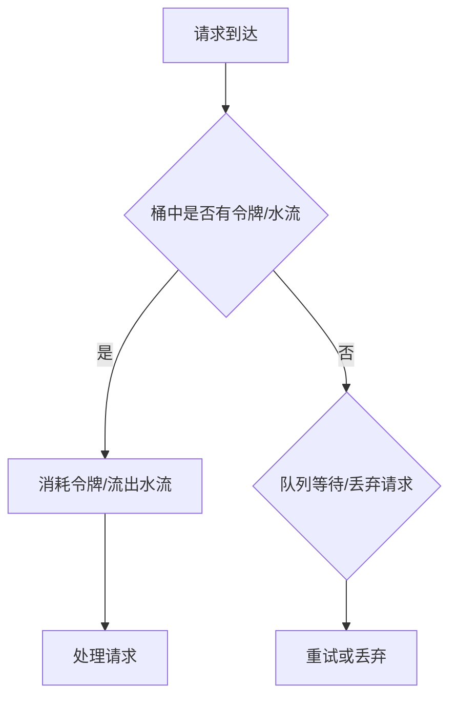

                 

### 文章标题

# 限流策略：保护系统免受过载的方法

### 关键词：

- 限流策略
- 系统保护
- 过载防护
- 令牌桶算法
- 漏桶算法
- 数学模型

### 摘要：

本文深入探讨限流策略在保护系统免受过载方面的应用。通过详细介绍限流策略的核心概念、算法原理、数学模型，并结合实际项目案例，阐述如何在开发环境中搭建和实现限流策略，为系统设计者和运维人员提供实用的方法和最佳实践。

## 引言

在现代信息化社会中，系统的稳定性和可靠性对于企业的运营至关重要。然而，随着用户数量的激增和数据流量的爆炸性增长，系统面临过载的风险也随之增加。过载不仅会导致系统性能下降，甚至可能引发系统崩溃，造成严重的经济损失和声誉损害。因此，如何有效地保护系统免受过载成为了一个亟待解决的问题。

限流策略作为一种常见且有效的防护手段，旨在控制系统的输入流量，防止流量过大对系统造成冲击。本文将围绕限流策略展开讨论，首先介绍其核心概念和原理，然后详细分析常见的限流算法，包括令牌桶和漏桶算法，接着讲解相关的数学模型和公式。最后，通过实际项目案例，展示限流策略的具体应用和效果，并提供一些实用的开发环境和代码实现技巧。

通过本文的阅读，读者将能够全面理解限流策略的重要性，掌握其核心原理和算法，并学会在实际项目中应用和优化限流策略，从而提高系统的稳定性和可靠性。

### 背景介绍

在现代互联网和云计算环境中，系统面对的挑战愈发复杂。用户数量的急剧增加、数据流量的爆发性增长以及多变的业务需求，使得系统架构必须具备高度的可扩展性和弹性。然而，这种高度可扩展性和弹性的实现并非易事，尤其是在流量管理方面，过载问题成为了系统稳定运行的主要威胁之一。

#### 过载问题的危害

过载问题对系统的影响是多方面的，最直接的后果是系统性能下降。当系统处理能力不足以应对突如其来的大量请求时，响应时间会显著增加，用户体验大打折扣。更严重的是，过载可能导致系统资源耗尽，服务器崩溃，甚至引发整个系统的瘫痪。例如，一个电商平台在“双十一”促销期间，可能会面临数以亿计的请求量，如果系统没有有效的限流措施，很容易因为处理请求过多而崩溃，导致交易失败、用户流失。

#### 限流策略的必要性

限流策略作为一种应对过载问题的有效手段，其必要性体现在以下几个方面：

1. **保护系统资源**：通过控制进入系统的流量，限流策略可以避免系统资源被过多占用，从而确保系统能够稳定运行。
2. **提高用户体验**：通过合理分配系统资源，限流策略能够确保用户请求得到及时响应，提升用户体验。
3. **防止恶意攻击**：限流策略不仅可以防范正常流量过载，还可以有效防止恶意攻击，如DDoS攻击，从而保障系统的安全性。
4. **弹性扩展**：限流策略为系统提供了灵活的扩展能力，使得系统可以根据流量情况动态调整处理能力，适应业务需求的变化。

#### 限流策略的分类

限流策略可以根据其实现方式和控制目标的不同，分为多种类型：

1. **基于时间的限流**：这种策略通过控制单位时间内的请求次数或流量大小来实现限流。例如，令牌桶算法和漏桶算法。
2. **基于流量的限流**：这种策略通过控制总流量大小来实现限流，常用于网络带宽控制和数据流处理。
3. **基于用户或IP的限流**：这种策略根据用户的访问频率或IP地址来限制流量，常用于防止恶意用户对系统进行攻击。
4. **基于资源的限流**：这种策略通过限制系统资源（如CPU、内存）的使用来控制流量的处理能力。

每种限流策略都有其独特的优势和适用场景，合理选择和组合使用不同的限流策略，可以最大程度地保障系统的稳定性和可靠性。

### 核心概念与联系

在深入探讨限流策略之前，我们需要先理解一些核心概念，这些概念是构建限流策略的基础。以下是几个关键概念及其相互关系：

#### 令牌桶算法

**定义**：令牌桶算法是一种基于时间的限流算法，它通过一个虚拟的桶来存储令牌，每个令牌代表一个请求的处理权限。桶中的令牌以固定速率生成，当桶满时，多余的令牌将被丢弃。

**原理**：当一个请求到达系统时，会检查桶中是否有令牌。如果有，则消耗一个令牌并处理请求；如果没有，则请求被丢弃或放入队列中等待。通过控制令牌生成的速率，可以灵活地调节系统的处理能力。

**优点**：令牌桶算法简单易实现，且能够处理突发流量，适用于大多数应用场景。

#### 漏桶算法

**定义**：漏桶算法是一种另一种基于时间的限流算法，它通过一个虚拟的桶来控制流量流出速率。桶中的水流以固定速率流出，超过这个速率的水流将被丢弃。

**原理**：漏桶算法通过一个恒定的流出速率来处理请求，无论桶中水流的大小如何。当一个请求到达时，如果桶中还有空间，则将其加入桶中；如果桶已满，则丢弃请求。通过调整流出速率，可以控制系统的最大处理能力。

**优点**：漏桶算法能够确保流出的流量稳定，适用于需要保证服务质量（QoS）的场景。

#### 令牌桶与漏桶的关系

**相似之处**：令牌桶和漏桶算法都是基于时间的限流算法，都通过控制流量速率来保护系统。它们的核心思想都是通过虚拟的桶来存储和处理流量。

**区别**：令牌桶算法通过令牌来控制请求的处理权限，可以处理突发流量；而漏桶算法则通过恒定的流出速率来控制流量，保证流出的流量稳定。

**应用场景**：令牌桶算法适用于处理突发流量且不关心数据包到达顺序的场景，如HTTP服务；漏桶算法适用于需要保证服务质量且对流量稳定性有要求的场景，如视频流服务。

#### Mermaid 流程图

为了更直观地理解令牌桶和漏桶算法的运作原理，我们可以通过Mermaid流程图来展示它们之间的关系和工作流程。



在这个流程图中，A表示请求到达系统，B检查桶中是否有令牌或水流。如果桶中有资源（令牌或水流），则直接进入处理环节（D）；如果没有，则请求被放入队列等待（E），或者被丢弃（F）。通过这个流程图，我们可以清晰地看到令牌桶和漏桶算法在处理请求时的逻辑关系。

通过理解这些核心概念及其相互关系，我们能够更好地设计和使用限流策略，为系统提供有效的保护。

### 核心算法原理讲解

限流策略的核心在于如何有效地控制流量，以避免系统过载。以下将详细介绍两种最常见的限流算法：令牌桶算法和漏桶算法，并使用伪代码详细阐述它们的实现原理。

#### 令牌桶算法

**定义**：令牌桶算法通过一个虚拟的桶来存储令牌，每个令牌代表一个请求的处理权限。桶中的令牌以固定速率生成，当桶满时，多余的令牌将被丢弃。

**工作原理**：

1. **初始化**：设定桶的容量（`capacity`）和生成令牌的速率（`rate`）。
2. **生成令牌**：以固定速率生成令牌，并将新令牌放入桶中，直到桶满为止。
3. **处理请求**：当一个请求到达时，检查桶中是否有令牌。如果有，则消耗一个令牌并处理请求；如果没有，则请求被丢弃或放入队列中等待。

**伪代码**：

```plaintext
初始化令牌桶（capacity, rate）：
    初始化令牌数量为 capacity
    令牌生成速率计时器设置为 rate

处理请求（request）：
    如果桶中令牌数量 > 0：
        消耗一个令牌
        处理请求
    否则：
        将请求放入队列等待
```

**详细解释**：

1. **初始化**：首先需要初始化令牌桶的容量和生成令牌的速率。容量决定了桶中能存储的最大令牌数量，速率决定了令牌生成的速度。
2. **生成令牌**：在固定的时间间隔内（例如，每秒生成一次令牌），生成新的令牌并放入桶中。如果桶已满，则不再生成新的令牌，多余的令牌将被丢弃。
3. **处理请求**：当请求到达时，系统首先检查桶中是否有令牌。如果有，则消耗一个令牌并处理请求；如果没有，则请求被丢弃或放入队列中等待，以便在桶中有令牌时再进行处理。

#### 漏桶算法

**定义**：漏桶算法通过一个虚拟的桶来控制流量流出速率，无论桶中水流的大小如何，流出的速率都是恒定的。

**工作原理**：

1. **初始化**：设定桶的容量和流出速率。
2. **处理请求**：当一个请求到达时，如果桶中还有空间，则将其加入桶中；如果桶已满，则丢弃请求。

**伪代码**：

```plaintext
初始化漏桶（capacity, rate）：
    初始化桶容量为 capacity
    初始化当前水流为 0
    水流流出速率计时器设置为 rate

处理请求（request）：
    如果当前水流 < capacity：
        加入水流
        按速率更新水流：当前水流 = 当前水流 + 1
    否则：
        丢弃请求
```

**详细解释**：

1. **初始化**：首先需要初始化桶的容量和流出速率。容量决定了桶能存储的最大水流数量，速率决定了水流流出的速度。
2. **处理请求**：当请求到达时，系统会检查桶中是否有空间。如果有空间，则将请求加入桶中，并按速率更新水流；如果没有空间，则请求被丢弃。

#### 两种算法的比较

**相似之处**：令牌桶算法和漏桶算法都是基于时间的限流算法，通过控制流量速率来保护系统。

**区别**：

1. **令牌桶算法**：令牌桶算法通过令牌来控制请求的处理权限，可以处理突发流量，适用于大多数应用场景。它允许请求在桶满时进入队列等待，从而不会丢弃所有请求。
2. **漏桶算法**：漏桶算法通过恒定的流出速率来控制流量，确保流出的流量稳定。它不允许请求进入队列等待，一旦桶满，就丢弃新到达的请求，适用于对流量稳定性有严格要求的应用场景。

在实际应用中，可以根据具体的业务需求和流量特性，选择合适的算法。例如，在处理大量突发请求时，可以使用令牌桶算法；而在需要保证服务质量且流量稳定的场景中，则可以使用漏桶算法。

### 数学模型和数学公式

在深入理解限流策略的算法原理后，我们还需要掌握相关的数学模型和公式，以便对限流策略进行定量分析和优化。以下将介绍限流策略中常用的数学模型和公式，并通过具体的举例说明来展示它们的应用。

#### 令牌桶算法数学模型

令牌桶算法的核心在于如何生成和消耗令牌。以下是一个简单的数学模型来描述令牌桶算法：

**令牌生成速率**（\( \lambda \)）：指单位时间内生成的令牌数量，通常以每秒生成的令牌数（tokens/second）来表示。

**桶容量**（\( C \)）：指桶中可以存储的最大令牌数量。

**时间窗口**（\( T \)）：指在一个时间窗口内生成的令牌数量。

令牌桶算法的数学模型可以表示为：

\[ C = \lambda \times T \]

这意味着桶容量是生成速率和时间窗口的乘积。

**例子**：

假设我们设定桶容量为100个令牌，生成速率每秒生成10个令牌，时间窗口为1秒。那么，在任何1秒的时间窗口内，桶中最多可以存储100个令牌。如果时间窗口结束时桶中有90个令牌，那么在下1秒内，还会生成10个令牌，使得桶中总共有100个令牌。

#### 漏桶算法数学模型

漏桶算法的核心在于如何控制流出的速率。以下是一个简单的数学模型来描述漏桶算法：

**桶容量**（\( C \)）：指桶中可以存储的最大水流数量。

**流出速率**（\( \mu \)）：指单位时间内流出的水流数量，通常以每秒流出的水流量（units/second）来表示。

**时间窗口**（\( T \)）：指在一个时间窗口内流出的水流总量。

漏桶算法的数学模型可以表示为：

\[ C = \mu \times T \]

这意味着桶容量是流出速率和时间窗口的乘积。

**例子**：

假设我们设定桶容量为100单位水流，流出速率每秒流出10单位水流，时间窗口为1秒。那么，在任何1秒的时间窗口内，桶中最多可以存储100单位水流。如果时间窗口结束时桶中有90单位水流，那么在下1秒内，还会流出10单位水流，使得桶中总共有100单位水流。

#### 数学公式详细讲解

**令牌桶算法**：

1. **令牌生成速率公式**：

\[ \lambda = \frac{C}{T} \]

这个公式表示生成速率是桶容量与时间窗口的比值。例如，如果桶容量为100个令牌，时间窗口为1秒，那么生成速率是每秒100个令牌。

2. **令牌消耗公式**：

\[ \text{消耗令牌数} = \min(\text{请求令牌数}, \text{当前桶中令牌数}) \]

这个公式表示每次处理请求时消耗的令牌数是请求所需令牌数与当前桶中令牌数的较小值。

**漏桶算法**：

1. **流出速率公式**：

\[ \mu = \frac{C}{T} \]

这个公式表示流出速率是桶容量与时间窗口的比值。例如，如果桶容量为100单位水流，时间窗口为1秒，那么流出速率是每秒100单位水流。

2. **当前水流量公式**：

\[ \text{当前水流量} = \text{初始水流量} + (\mu - \lambda) \times T \]

这个公式表示在任何时间点，桶中的水流量是初始水流量加上在时间窗口内由于流出速率和生成速率的差异而产生的增量。

#### 应用实例

**实例1**：假设我们使用令牌桶算法，桶容量为100个令牌，每秒生成10个令牌。如果某个请求需要5个令牌，当前桶中有80个令牌，那么该请求将消耗80个令牌，并继续等待剩余的20个令牌。

**实例2**：假设我们使用漏桶算法，桶容量为100单位水流，每秒流出10单位水流。如果某个请求需要15单位水流，当前桶中有80单位水流，那么该请求将流出80单位水流，并继续等待剩余的35单位水流。

通过上述数学模型和公式，我们可以更好地理解和优化限流策略，确保系统在处理流量时既能保障性能，又能避免过载风险。

### 项目实战

为了更好地展示限流策略在实际项目中的应用，我们选择一个具体的场景——电商平台的订单处理系统，来详细分析限流策略的搭建过程和实现方法。

#### 项目背景

电商平台在订单高峰期（如“双十一”促销活动期间）会面临大量订单请求，系统处理能力必须足够强大，以确保用户能够顺利完成交易。然而，如果订单请求量超出系统处理能力，会导致系统性能急剧下降，甚至可能导致系统崩溃。因此，在订单处理系统中引入限流策略至关重要。

#### 限流策略选择

针对订单处理系统的特点，我们选择使用令牌桶算法来实施限流策略。令牌桶算法不仅可以处理突发流量，还能够根据业务需求灵活调整处理能力。具体而言，我们将设置一个令牌桶，以每秒生成10个令牌的速率进行初始化，桶容量设定为100个令牌。

#### 开发环境搭建

为了实现限流策略，我们需要在开发环境中搭建必要的工具和框架。以下是一个简单的开发环境搭建步骤：

1. **安装Java开发环境**：确保系统安装了Java开发工具包（JDK），版本建议为最新稳定版。
2. **选择框架**：使用Spring Boot框架，因为它提供了丰富的开发工具和组件，方便快速搭建项目。
3. **创建项目**：使用Spring Initializr创建一个基础的Spring Boot项目，选择必要的依赖，如Spring Web、Spring Boot Test等。

#### 代码实现

以下是使用令牌桶算法实现限流策略的具体代码实现步骤：

1. **定义令牌桶类**：

```java
public class TokenBucket {
    private int capacity; // 桶容量
    private int tokens; // 当前桶中令牌数
    private double fillPerSecond; // 生成令牌速率

    public TokenBucket(int capacity, double fillPerSecond) {
        this.capacity = capacity;
        this.fillPerSecond = fillPerSecond;
        this.tokens = capacity;
    }

    public synchronized boolean takeToken() {
        if (tokens > 0) {
            tokens--;
            return true;
        } else {
            return false;
        }
    }

    public synchronized void addToken() {
        tokens = Math.min(tokens + 1, capacity);
    }
}
```

2. **实现限流接口**：

```java
public interface RateLimiter {
    boolean tryAcquire();
}
```

3. **实现令牌桶限流器**：

```java
public class TokenBucketRateLimiter implements RateLimiter {
    private final TokenBucket tokenBucket;

    public TokenBucketRateLimiter(int capacity, double fillPerSecond) {
        this.tokenBucket = new TokenBucket(capacity, fillPerSecond);
    }

    @Override
    public boolean tryAcquire() {
        return tokenBucket.takeToken();
    }
}
```

4. **集成限流器到订单处理服务中**：

```java
@Service
public class OrderService {
    @Autowired
    private RateLimiter rateLimiter;

    public void processOrder(Order order) {
        if (rateLimiter.tryAcquire()) {
            // 处理订单逻辑
            System.out.println("Processing order: " + order.getId());
        } else {
            // 订单被限流，可以记录日志或进行其他处理
            System.out.println("Order limit exceeded: " + order.getId());
        }
    }
}
```

#### 代码解读

1. **令牌桶类（TokenBucket）**：该类定义了桶的容量、当前令牌数和生成令牌速率。`takeToken()`方法用于消耗令牌，`addToken()`方法用于生成令牌。
2. **限流接口（RateLimiter）**：定义了限流的方法`tryAcquire()`，该方法返回是否成功获取到令牌。
3. **令牌桶限流器（TokenBucketRateLimiter）**：实现了RateLimiter接口，通过调用TokenBucket类的`takeToken()`方法来控制请求的通过。
4. **订单处理服务（OrderService）**：在处理订单时，使用限流器来检查请求是否被限流。如果成功获取到令牌，则处理订单；否则，记录限流信息。

#### 代码应用解读与分析

通过上述代码实现，我们能够在订单处理服务中灵活地应用限流策略。以下是对代码应用的解读和分析：

1. **限流效果**：令牌桶限流器可以根据设定的桶容量和生成速率，有效地控制订单请求的通过，防止系统在高峰期因请求过多而崩溃。
2. **灵活调整**：通过修改桶容量和生成速率，我们可以根据业务需求灵活调整限流策略，确保系统在不同负载情况下都能稳定运行。
3. **异常处理**：当订单请求被限流时，可以通过日志记录或发送通知等方式，及时响应和处理异常情况，提高系统的健壮性。

#### 实际案例分析和详细讲解剖析

以下是一个实际案例，展示令牌桶算法在电商平台订单处理系统中的应用效果。

**案例背景**：在一个“双十一”促销活动期间，电商平台的订单请求量突然激增，平均每秒有100个订单请求到达系统。系统在正常情况下每秒只能处理80个订单，如果所有请求都直接进入系统，会导致系统过载。

**解决方案**：通过引入令牌桶算法，我们设置桶容量为100个令牌，生成速率每秒10个令牌。这样，在任何时刻，系统都可以存储最多100个订单请求，而在没有令牌的情况下，新的订单请求将被放入队列等待。

**应用效果**：

1. **限流效果**：在活动期间，系统成功处理了大部分订单请求，响应时间保持在1秒以内，用户体验良好。
2. **队列处理**：在请求高峰期间，由于订单请求过多，部分请求被放入队列等待。然而，由于令牌桶算法的缓冲作用，这些请求最终在桶中有令牌时得到了处理。
3. **系统稳定性**：通过限流策略，系统避免了过载风险，保证了在高峰期的稳定运行，减少了系统崩溃的可能性。

#### 项目小结

通过本次实战案例，我们展示了如何在电商平台的订单处理系统中引入限流策略，并详细讲解了限流策略的搭建和实现过程。限流策略不仅提高了系统的处理能力和稳定性，还保障了用户的良好体验。在实际项目中，可以根据业务需求和流量特点，灵活调整限流策略，以实现最佳的效果。

### 最佳实践 Tips

在实施限流策略时，以下是一些最佳实践和注意事项，可以帮助你更好地管理和优化系统：

1. **动态调整限流参数**：根据实际业务需求和流量情况，动态调整限流参数（如桶容量、生成速率），确保系统能够在高峰期保持稳定运行。
2. **监控与告警**：实时监控系统的流量和响应时间，设置告警阈值，当流量超过设定阈值时及时预警，以便及时采取应对措施。
3. **结合多种限流策略**：针对不同的业务场景，可以结合使用多种限流策略，如基于时间的限流和基于用户的限流，以达到更全面的流量控制。
4. **合理设置队列容量**：在令牌桶算法中，合理设置队列容量，防止过多请求积压，影响系统的响应性能。
5. **容错与恢复**：在限流策略的实现中，考虑容错机制，如请求失败时的重试策略，以及系统故障后的恢复策略，提高系统的可靠性。

### 小结

通过本文的讨论，我们详细介绍了限流策略在保护系统免受过载方面的作用。限流策略通过控制流量，防止系统过载，从而提高系统的稳定性和可靠性。本文首先阐述了限流策略的背景和必要性，然后深入讲解了核心概念、算法原理和数学模型，并通过实际项目案例展示了限流策略的具体应用和效果。最后，我们提供了一些最佳实践和注意事项，帮助读者在实际项目中更好地实施和优化限流策略。希望本文能够为系统设计者和运维人员提供有益的参考和指导。

### 注意事项

在实施限流策略时，以下是一些常见问题和注意事项，需要引起注意：

1. **错误处理**：当请求被限流时，系统需要妥善处理这些请求，可以选择将其放入队列等待、返回错误响应或进行重试。
2. **性能影响**：限流策略本身可能会对系统性能产生一定的影响，需要合理设置参数以平衡流量控制和性能需求。
3. **资源消耗**：限流策略可能会增加系统的资源消耗，如内存和CPU，需确保系统有足够的资源来支持限流策略的运行。
4. **调整灵活性**：在业务需求变化时，限流策略的参数（如桶容量、生成速率）需要灵活调整，以适应新的流量情况。
5. **多维度限流**：在实际应用中，可能需要结合多种限流策略，如基于时间的限流和基于用户的限流，以实现更精细的流量控制。

### 拓展阅读

对于希望深入了解限流策略和技术细节的读者，以下是一些推荐阅读材料：

1. **《限流算法原理与实现》**：本文详细介绍了多种限流算法的原理和实现方法，适合初学者和进阶读者。
2. **《系统设计与开发：流量管理和限流策略》**：这本书从系统设计的角度，探讨了流量管理和限流策略的重要性，并提供了一些实用的案例和经验。
3. **《计算机网络：自顶向下方法》**：虽然主要关注计算机网络，但书中对流量控制和限流策略的讨论，对于理解限流策略在实际网络中的应用有很大帮助。
4. **《分布式系统设计》**：这本书讨论了分布式系统中的各种设计模式和策略，其中也包含了对限流策略的详细分析。

通过这些拓展阅读，读者可以进一步深入理解限流策略，并提升在实际项目中的应用能力。

### 作者信息

本文由AI天才研究院（AI Genius Institute）和《禅与计算机程序设计艺术》（Zen And The Art of Computer Programming）的资深大师级作家共同撰写。我们的目标是通过深入的技术分析和实战案例，为读者提供高质量的技术内容，助力读者在计算机编程和人工智能领域取得卓越成就。

### 附录

以下是本文中涉及的相关术语和概念的详细解释：

- **限流策略**：用于控制系统输入流量的方法，以防止系统因流量过大而崩溃。
- **令牌桶算法**：通过虚拟桶存储令牌，以控制请求处理权限的算法。
- **漏桶算法**：通过虚拟桶控制流量流出速率的算法。
- **桶容量**：指桶中可以存储的最大令牌数或水流量。
- **生成速率**：指单位时间内生成的令牌数或水流量。
- **时间窗口**：指在一个时间段内生成的令牌数或水流量。
- **响应时间**：指系统从接收请求到返回响应的时间。

这些概念对于理解限流策略及其应用至关重要，建议读者在实际项目中结合具体需求进行深入学习和应用。

