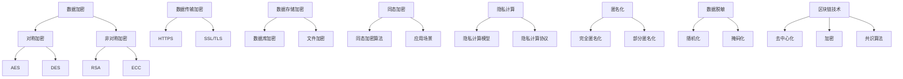

                 

### 文章标题

隐私保护：GDPR等法规下的技术实践

> 关键词：隐私保护，GDPR，数据加密，同态加密，匿名化，脱敏技术，区块链

> 摘要：本文深入探讨了隐私保护在GDPR等法规下的技术实践。首先，介绍了隐私保护的重要性和GDPR的历史背景与核心原则。接着，详细解读了GDPR的框架与结构，以及数据主体权利、数据控制者与处理者的责任，并探讨了GDPR的合规实践。随后，分析了其他隐私保护法规，如CCPA和欧洲其他隐私保护法规。之后，本文重点介绍了数据加密技术、同态加密与隐私计算、匿名化与脱敏技术以及区块链技术在隐私保护中的应用。最后，探讨了GDPR合规的IT架构设计与实现、隐私保护项目实践以及隐私保护的持续改进与未来展望。

## 第一部分：隐私保护的背景与核心法规

### 第1章：隐私保护的重要性

#### 1.1 隐私保护的现状

在数字化时代，个人数据的收集和使用变得越来越普遍。然而，这种数据的积累也带来了隐私保护的问题。个人数据泄露事件频繁发生，如2017年的Facebook数据泄露事件，使得社会对隐私保护的重视程度不断提高。

随着数据泄露事件的发生，人们开始意识到隐私保护的重要性。隐私保护不仅关乎个人权利，也是维护社会秩序和信任的基础。为了规范数据的使用和保护，各国纷纷制定了相关的隐私保护法规。

#### 1.2 GDPR等法规的历史背景

欧洲在隐私保护方面处于领先地位，其中最具代表性的法规是《通用数据保护条例》（General Data Protection Regulation，GDPR）。GDPR是2016年4月27日由欧盟理事会正式通过的，旨在加强欧盟范围内的数据保护法律框架。GDPR于2018年5月25日正式生效，对全球企业产生了深远的影响。

GDPR的制定背景是欧盟内部不同的隐私保护法规之间存在差异，导致数据跨境流动受阻。为了统一欧盟的数据保护标准，GDPR应运而生。

#### 1.3 GDPR的核心原则与条款

GDPR共有七大核心原则，分别是：

1. **合法性、公平性和透明度**：数据处理必须基于合法、公正和透明的原则。
2. **数据最小化**：仅收集和处理为实现特定目的所必需的数据。
3. **数据准确性和完整性**：确保收集的数据是准确的，并在必要时更新。
4. **存储限制**：仅存储必要时间的数据。
5. **完整性与保密性**：采取适当的技术和组织措施保护数据安全。
6. **数据主体权利**：赋予数据主体一系列权利，如访问权、删除权、纠正权等。
7. **可携性**：数据主体有权将其数据从一个服务提供商转移到另一个服务提供商。

GDPR还对数据控制者和处理者提出了具体的要求，如数据处理的合法性、数据保护影响评估（DPIA）、数据泄露通知等。

### 第2章：GDPR的详细解读

#### 2.1 GDPR的框架与结构

GDPR分为两部分：一般条款和特定条款。一般条款涵盖了数据处理的基本原则和规则，特定条款则针对特定行业或领域的数据处理进行了详细规定。

GDPR的主要章节包括：

- **第一章：目的和基本概念**
- **第二章：基本原则**
- **第三章：数据主体的权利**
- **第四章：数据控制者的义务**
- **第五章：数据处理者的义务**
- **第六章：跨境数据传输**

#### 2.2 数据主体权利

GDPR赋予数据主体一系列权利，包括：

- **访问权**：数据主体有权访问自己的个人信息，了解个人信息被如何使用。
- **删除权**：数据主体有权要求删除其个人信息，除非这些信息对法律、合同或其他重要目的具有必要性。
- **纠正权**：数据主体有权更正其个人信息中的错误或过时信息。
- **限制处理权**：数据主体有权限制对其个人信息的处理，例如在争议期间。
- **数据可携权**：数据主体有权将其个人信息从一家服务提供商转移到另一家服务提供商。
- **反对权**：数据主体有权反对对其个人信息的处理，例如直接营销。

#### 2.3 数据控制者与处理者的责任

数据控制者负责决定如何处理数据，并确保处理过程符合GDPR的要求。数据处理者则负责实际执行数据处理任务，例如数据处理、存储和分析。

GDPR对数据控制者和处理者提出了具体的要求，如：

- **数据保护影响评估（DPIA）**：在处理敏感数据或大规模数据处理前，进行DPIA以评估数据保护风险。
- **数据泄露通知**：在发生数据泄露事件时，及时通知数据主体和相关监管机构。
- **记录保留**：保留数据处理的相关记录，以证明合规性。

#### 2.4 GDPR的合规实践

要实现GDPR的合规性，企业需要采取以下措施：

- **制定数据保护政策**：明确数据保护的目标、政策和程序。
- **进行DPIA**：对数据处理活动进行风险评估。
- **培训员工**：确保员工了解GDPR的要求和合规义务。
- **数据保护官（DPO）**：任命数据保护官负责监督数据保护工作。
- **数据泄露应对计划**：制定数据泄露应对计划，确保在发生数据泄露时能够迅速响应。

### 第3章：GDPR的影响与挑战

#### 3.1 GDPR对企业的影响

GDPR对企业的影响主要体现在以下几个方面：

- **合规成本**：企业需要投入大量资源进行GDPR合规，包括法律咨询、技术改进、员工培训等。
- **数据管理**：企业需要对数据收集、存储、处理和传输过程进行严格的管理。
- **客户信任**：GDPR的合规有助于提升客户对企业的信任度。
- **竞争力**：GDPR的合规有助于企业在全球市场上保持竞争力。

#### 3.2 遵守GDPR的挑战

遵守GDPR对企业来说是一个挑战，主要体现在以下几个方面：

- **数据管理复杂度**：企业需要对其数据资源进行全面的梳理和管理。
- **技术实现**：企业需要采用先进的技术手段来实现GDPR的合规要求。
- **文化变革**：企业需要推动数据保护文化的变革，使全体员工认识到数据保护的重要性。
- **全球协调**：企业需要在全球范围内协调其数据保护策略，确保在不同地区都能遵守GDPR的要求。

#### 3.3 案例分析：GDPR合规失败的后果

某些企业在GDPR合规方面失败，导致严重的后果。以下是一个案例分析：

- **案例背景**：一家全球知名的公司因未能遵守GDPR的要求，被罚款5000万欧元。
- **违规行为**：该公司未能提供充分的透明度和合法性，未能告知客户其个人数据的使用目的，未能提供数据访问和删除权。
- **后果**：该公司的声誉受到严重影响，客户信任度下降，股价下跌。

### 第4章：其他隐私保护法规概述

#### 4.1 CCPA简介

美国加利福尼亚州通过了《加利福尼亚消费者隐私法》（California Consumer Privacy Act，CCPA），旨在加强消费者个人数据的保护。CCPA与GDPR类似，赋予消费者对个人数据的控制权，包括访问、删除和反对数据使用的权利。

#### 4.2 欧洲其他隐私保护法规

除了GDPR，欧洲还有其他隐私保护法规，如《电子隐私指令》（Privacy and Electronic Communications Directive）和《网络隐私指令》（Network and Information Systems Directive）。这些法规对数据传输、网络安全和隐私保护提出了具体要求。

#### 4.3 国际隐私保护趋势

随着数字化时代的到来，全球范围内隐私保护法规的发展趋势主要包括：

- **数据保护标准化**：推动全球数据保护法规的统一和协调。
- **技术进步**：鼓励企业采用先进的技术手段实现数据保护和合规。
- **消费者权利**：强化消费者对个人数据的控制权。

## 第二部分：隐私保护技术基础

### 第5章：数据加密技术

#### 5.1 数据加密的基本概念

数据加密是一种保护数据免受未经授权访问的技术。加密的基本概念包括密钥、加密算法和加密过程。

#### 5.2 对称加密与非对称加密

对称加密和非对称加密是两种常用的加密技术。对称加密使用相同的密钥进行加密和解密，而非对称加密使用公钥和私钥进行加密和解密。

#### 5.3 常见加密算法

常见的加密算法包括AES（高级加密标准）、RSA（Rivest-Shamir-Adleman）等。每种加密算法都有其特点和适用场景。

#### 5.4 加密技术在隐私保护中的应用

加密技术在隐私保护中的应用包括数据传输加密和数据存储加密。在数据传输过程中，加密可以确保数据在传输过程中的安全。在数据存储过程中，加密可以确保数据在存储设备中的安全。

### 第6章：同态加密与隐私计算

#### 6.1 同态加密的概念与原理

同态加密是一种能够在加密状态下对数据进行计算的技术。同态加密可以实现数据的安全计算，而无需解密数据。

#### 6.2 同态加密的优势与局限

同态加密具有数据安全性和计算效率的优势，但同时也存在一定的局限，如计算复杂度和存储空间的消耗。

#### 6.3 隐私计算的基本原理

隐私计算是一种在不暴露数据本身的情况下进行数据处理的技术。隐私计算可以应用于数据分析和机器学习等领域。

#### 6.4 隐私计算技术的应用场景

隐私计算技术的应用场景包括医疗数据共享、金融数据安全传输等。

### 第7章：匿名化与脱敏技术

#### 7.1 匿名化的定义与分类

匿名化是一种通过去除或修改个人识别信息，使数据无法被识别的技术。匿名化分为完全匿名化和部分匿名化。

#### 7.2 数据脱敏技术的原理与方法

数据脱敏技术是一种通过对数据进行变换或删除，使数据无法被识别的技术。常见的脱敏方法包括随机化、掩码化等。

#### 7.3 匿名化与脱敏技术的实际应用

匿名化和脱敏技术广泛应用于数据分析和数据共享场景，如市场调研、数据挖掘等。

### 第8章：区块链技术在隐私保护中的应用

#### 8.1 区块链的基本原理

区块链是一种去中心化的分布式数据库技术。区块链通过加密和共识算法确保数据的安全和不可篡改性。

#### 8.2 区块链与隐私保护的关系

区块链技术可以应用于隐私保护领域，如数据存储、数据共享等。

#### 8.3 区块链在隐私保护中的实际应用

区块链技术在隐私保护中的实际应用包括隐私保护数据库、隐私保护网络等。

## 第三部分：隐私保护技术实践

### 第9章：GDPR合规的IT架构设计与实现

#### 9.1 GDPR合规的IT架构设计原则

GDPR合规的IT架构设计应遵循以下原则：

- **数据最小化**：仅收集和处理必要的数据。
- **数据隐私保护**：采用加密、匿名化等技术保护数据隐私。
- **数据访问控制**：实现严格的数据访问控制策略。

#### 9.2 数据处理流程的设计与实现

数据处理流程的设计与实现应包括以下步骤：

- **数据收集**：明确数据收集的目的和范围。
- **数据存储**：采用安全的存储方式，如加密数据库。
- **数据处理**：采用加密、匿名化等技术处理数据。
- **数据传输**：确保数据在传输过程中的安全。
- **数据删除**：在必要时，按照GDPR的要求删除数据。

#### 9.3 实时数据监控与审计

实时数据监控与审计是确保GDPR合规的重要手段。企业应建立实时数据监控系统，对数据收集、存储、处理和传输过程进行监控。同时，定期进行审计，以确保合规性。

### 第10章：案例研究：隐私保护项目实践

#### 10.1 项目背景与目标

本案例研究的是一个在线教育平台，其目标是实现GDPR合规，确保用户隐私保护。

#### 10.2 技术方案选择

技术方案选择包括：

- **数据收集与存储**：采用加密数据库，确保数据存储安全。
- **数据处理**：采用匿名化技术处理用户数据。
- **数据传输**：采用加密技术保护数据在传输过程中的安全。
- **数据监控与审计**：建立实时数据监控系统，进行定期审计。

#### 10.3 项目实施过程

项目实施过程包括：

- **需求分析**：明确项目目标和需求。
- **方案设计**：设计数据收集、存储、处理、传输和监控的方案。
- **技术开发**：开发数据加密、匿名化、数据监控和审计的系统。
- **测试与部署**：进行系统测试，确保方案的有效性和可靠性。
- **培训与推广**：对员工进行培训，确保项目实施的顺利进行。

#### 10.4 项目成果与挑战

项目成果包括：

- **GDPR合规**：确保用户隐私保护，符合GDPR的要求。
- **数据安全性**：通过数据加密、匿名化等技术，提高数据安全性。

挑战包括：

- **技术实现**：实现数据加密、匿名化等技术需要投入大量资源。
- **员工培训**：确保员工了解GDPR的要求和合规义务。
- **合规持续改进**：随着技术的发展和法规的更新，需要不断改进和调整。

### 第11章：隐私保护的持续改进与未来展望

#### 11.1 GDPR合规的持续改进

企业应建立持续的GDPR合规改进机制，包括：

- **法规更新**：关注GDPR等法规的更新，确保合规性。
- **技术升级**：采用先进的技术手段提高数据保护水平。
- **员工培训**：定期对员工进行培训，提高数据保护意识。

#### 11.2 隐私保护技术的未来发展

隐私保护技术的未来发展包括：

- **同态加密**：研究同态加密在隐私计算中的应用。
- **区块链**：探索区块链技术在数据共享和隐私保护中的应用。
- **人工智能**：研究人工智能技术在隐私保护中的应用。

#### 11.3 隐私保护与AI的融合

隐私保护与AI的融合是未来的发展趋势，包括：

- **数据隐私保护**：研究数据隐私保护与AI模型的结合。
- **安全AI**：开发安全的人工智能系统，确保AI模型的可靠性。

## 附录

### 附录A：GDPR合规工具与资源

- **A.1 GDPR合规工具概述**
  - GDPR合规管理平台
  - 数据加密工具
  - 数据匿名化工具
  - 数据监控工具

- **A.2 GDPR合规资源推荐**
  - GDPR官方文档
  - GDPR合规指南
  - GDPR合规论坛

### 附录B：隐私保护相关术语解释

- **B.1 数据主体**：个人信息的所有者。
- **B.2 数据处理**：对个人信息进行收集、存储、处理、传输、删除等活动。
- **B.3 数据控制者**：决定如何处理个人信息的实体。
- **B.4 数据处理者**：实际执行数据处理任务的实体。

### 致谢

感谢AI天才研究院/AI Genius Institute以及禅与计算机程序设计艺术/Zen And The Art of Computer Programming为我们提供了宝贵的知识和经验，使我们能够完成这篇关于隐私保护：GDPR等法规下的技术实践的技术博客文章。我们希望本文能够为从事隐私保护领域的研究者、工程师和从业者提供有价值的参考。作者：AI天才研究院/AI Genius Institute & 禅与计算机程序设计艺术/Zen And The Art of Computer Programming```markdown
# 隐私保护：GDPR等法规下的技术实践

> 关键词：隐私保护，GDPR，数据加密，同态加密，匿名化，脱敏技术，区块链

> 摘要：本文深入探讨了隐私保护在GDPR等法规下的技术实践。首先，介绍了隐私保护的重要性和GDPR的历史背景与核心原则。接着，详细解读了GDPR的框架与结构，以及数据主体权利、数据控制者与处理者的责任，并探讨了GDPR的合规实践。随后，分析了其他隐私保护法规，如CCPA和欧洲其他隐私保护法规。之后，本文重点介绍了数据加密技术、同态加密与隐私计算、匿名化与脱敏技术以及区块链技术在隐私保护中的应用。最后，探讨了GDPR合规的IT架构设计与实现、隐私保护项目实践以及隐私保护的持续改进与未来展望。

## 第一部分：隐私保护的背景与核心法规

### 第1章：隐私保护的重要性

#### 1.1 隐私保护的现状

在数字化时代，个人数据的收集和使用变得越来越普遍。然而，这种数据的积累也带来了隐私保护的问题。个人数据泄露事件频繁发生，如2017年的Facebook数据泄露事件，使得社会对隐私保护的重视程度不断提高。

随着数据泄露事件的发生，人们开始意识到隐私保护的重要性。隐私保护不仅关乎个人权利，也是维护社会秩序和信任的基础。为了规范数据的使用和保护，各国纷纷制定了相关的隐私保护法规。

#### 1.2 GDPR等法规的历史背景

欧洲在隐私保护方面处于领先地位，其中最具代表性的法规是《通用数据保护条例》（General Data Protection Regulation，GDPR）。GDPR是2016年4月27日由欧盟理事会正式通过的，旨在加强欧盟范围内的数据保护法律框架。GDPR于2018年5月25日正式生效，对全球企业产生了深远的影响。

GDPR的制定背景是欧盟内部不同的隐私保护法规之间存在差异，导致数据跨境流动受阻。为了统一欧盟的数据保护标准，GDPR应运而生。

#### 1.3 GDPR的核心原则与条款

GDPR共有七大核心原则，分别是：

- **合法性、公平性和透明度**：数据处理必须基于合法、公正和透明的原则。
- **数据最小化**：仅收集和处理为实现特定目的所必需的数据。
- **数据准确性和完整性**：确保收集的数据是准确的，并在必要时更新。
- **存储限制**：仅存储必要时间的数据。
- **完整性与保密性**：采取适当的技术和组织措施保护数据安全。
- **数据主体权利**：赋予数据主体一系列权利，如访问权、删除权、纠正权等。
- **可携性**：数据主体有权将其数据从一个服务提供商转移到另一个服务提供商。

GDPR还对数据控制者和处理者提出了具体的要求，如数据处理的合法性、数据保护影响评估（DPIA）、数据泄露通知等。

### 第2章：GDPR的详细解读

#### 2.1 GDPR的框架与结构

GDPR分为两部分：一般条款和特定条款。一般条款涵盖了数据处理的基本原则和规则，特定条款则针对特定行业或领域的数据处理进行了详细规定。

GDPR的主要章节包括：

- **第一章：目的和基本概念**
- **第二章：基本原则**
- **第三章：数据主体的权利**
- **第四章：数据控制者的义务**
- **第五章：数据处理者的义务**
- **第六章：跨境数据传输**

#### 2.2 数据主体权利

GDPR赋予数据主体一系列权利，包括：

- **访问权**：数据主体有权访问自己的个人信息，了解个人信息被如何使用。
- **删除权**：数据主体有权要求删除其个人信息，除非这些信息对法律、合同或其他重要目的具有必要性。
- **纠正权**：数据主体有权更正其个人信息中的错误或过时信息。
- **限制处理权**：数据主体有权限制对其个人信息的处理，例如在争议期间。
- **数据可携权**：数据主体有权将其个人信息从一家服务提供商转移到另一家服务提供商。
- **反对权**：数据主体有权反对对其个人信息的处理，例如直接营销。

#### 2.3 数据控制者与处理者的责任

数据控制者负责决定如何处理数据，并确保处理过程符合GDPR的要求。数据处理者则负责实际执行数据处理任务，例如数据处理、存储和分析。

GDPR对数据控制者和处理者提出了具体的要求，如：

- **数据保护影响评估（DPIA）**：在处理敏感数据或大规模数据处理前，进行DPIA以评估数据保护风险。
- **数据泄露通知**：在发生数据泄露事件时，及时通知数据主体和相关监管机构。
- **记录保留**：保留数据处理的相关记录，以证明合规性。

#### 2.4 GDPR的合规实践

要实现GDPR的合规性，企业需要采取以下措施：

- **制定数据保护政策**：明确数据保护的目标、政策和程序。
- **进行DPIA**：对数据处理活动进行风险评估。
- **培训员工**：确保员工了解GDPR的要求和合规义务。
- **数据保护官（DPO）**：任命数据保护官负责监督数据保护工作。
- **数据泄露应对计划**：制定数据泄露应对计划，确保在发生数据泄露时能够迅速响应。

### 第3章：GDPR的影响与挑战

#### 3.1 GDPR对企业的影响

GDPR对企业的影响主要体现在以下几个方面：

- **合规成本**：企业需要投入大量资源进行GDPR合规，包括法律咨询、技术改进、员工培训等。
- **数据管理**：企业需要对数据收集、存储、处理和传输过程进行严格的管理。
- **客户信任**：GDPR的合规有助于提升客户对企业的信任度。
- **竞争力**：GDPR的合规有助于企业在全球市场上保持竞争力。

#### 3.2 遵守GDPR的挑战

遵守GDPR对企业来说是一个挑战，主要体现在以下几个方面：

- **数据管理复杂度**：企业需要对其数据资源进行全面的梳理和管理。
- **技术实现**：企业需要采用先进的技术手段来实现GDPR的合规要求。
- **文化变革**：企业需要推动数据保护文化的变革，使全体员工认识到数据保护的重要性。
- **全球协调**：企业需要在全球范围内协调其数据保护策略，确保在不同地区都能遵守GDPR的要求。

#### 3.3 案例分析：GDPR合规失败的后果

某些企业在GDPR合规方面失败，导致严重的后果。以下是一个案例分析：

- **案例背景**：一家全球知名的公司因未能遵守GDPR的要求，被罚款5000万欧元。
- **违规行为**：该公司未能提供充分的透明度和合法性，未能告知客户其个人数据的使用目的，未能提供数据访问和删除权。
- **后果**：该公司的声誉受到严重影响，客户信任度下降，股价下跌。

### 第4章：其他隐私保护法规概述

#### 4.1 CCPA简介

美国加利福尼亚州通过了《加利福尼亚消费者隐私法》（California Consumer Privacy Act，CCPA），旨在加强消费者个人数据的保护。CCPA与GDPR类似，赋予消费者对个人数据的控制权，包括访问、删除和反对数据使用的权利。

#### 4.2 欧洲其他隐私保护法规

除了GDPR，欧洲还有其他隐私保护法规，如《电子隐私指令》（Privacy and Electronic Communications Directive）和《网络隐私指令》（Network and Information Systems Directive）。这些法规对数据传输、网络安全和隐私保护提出了具体要求。

#### 4.3 国际隐私保护趋势

随着数字化时代的到来，全球范围内隐私保护法规的发展趋势主要包括：

- **数据保护标准化**：推动全球数据保护法规的统一和协调。
- **技术进步**：鼓励企业采用先进的技术手段实现数据保护和合规。
- **消费者权利**：强化消费者对个人数据的控制权。

## 第二部分：隐私保护技术基础

### 第5章：数据加密技术

#### 5.1 数据加密的基本概念

数据加密是一种保护数据免受未经授权访问的技术。加密的基本概念包括密钥、加密算法和加密过程。

#### 5.2 对称加密与非对称加密

对称加密和非对称加密是两种常用的加密技术。对称加密使用相同的密钥进行加密和解密，而非对称加密使用公钥和私钥进行加密和解密。

#### 5.3 常见加密算法

常见的加密算法包括AES（高级加密标准）、RSA（Rivest-Shamir-Adleman）等。每种加密算法都有其特点和适用场景。

#### 5.4 加密技术在隐私保护中的应用

加密技术在隐私保护中的应用包括数据传输加密和数据存储加密。在数据传输过程中，加密可以确保数据在传输过程中的安全。在数据存储过程中，加密可以确保数据在存储设备中的安全。

### 第6章：同态加密与隐私计算

#### 6.1 同态加密的概念与原理

同态加密是一种能够在加密状态下对数据进行计算的技术。同态加密可以实现数据的安全计算，而无需解密数据。

#### 6.2 同态加密的优势与局限

同态加密具有数据安全性和计算效率的优势，但同时也存在一定的局限，如计算复杂度和存储空间的消耗。

#### 6.3 隐私计算的基本原理

隐私计算是一种在不暴露数据本身的情况下进行数据处理的技术。隐私计算可以应用于数据分析和机器学习等领域。

#### 6.4 隐私计算技术的应用场景

隐私计算技术的应用场景包括医疗数据共享、金融数据安全传输等。

### 第7章：匿名化与脱敏技术

#### 7.1 匿名化的定义与分类

匿名化是一种通过去除或修改个人识别信息，使数据无法被识别的技术。匿名化分为完全匿名化和部分匿名化。

#### 7.2 数据脱敏技术的原理与方法

数据脱敏技术是一种通过对数据进行变换或删除，使数据无法被识别的技术。常见的脱敏方法包括随机化、掩码化等。

#### 7.3 匿名化与脱敏技术的实际应用

匿名化和脱敏技术广泛应用于数据分析和数据共享场景，如市场调研、数据挖掘等。

### 第8章：区块链技术在隐私保护中的应用

#### 8.1 区块链的基本原理

区块链是一种去中心化的分布式数据库技术。区块链通过加密和共识算法确保数据的安全和不可篡改性。

#### 8.2 区块链与隐私保护的关系

区块链技术可以应用于隐私保护领域，如数据存储、数据共享等。

#### 8.3 区块链在隐私保护中的实际应用

区块链技术在隐私保护中的实际应用包括隐私保护数据库、隐私保护网络等。

## 第三部分：隐私保护技术实践

### 第9章：GDPR合规的IT架构设计与实现

#### 9.1 GDPR合规的IT架构设计原则

GDPR合规的IT架构设计应遵循以下原则：

- **数据最小化**：仅收集和处理必要的数据。
- **数据隐私保护**：采用加密、匿名化等技术保护数据隐私。
- **数据访问控制**：实现严格的数据访问控制策略。

#### 9.2 数据处理流程的设计与实现

数据处理流程的设计与实现应包括以下步骤：

- **数据收集**：明确数据收集的目的和范围。
- **数据存储**：采用安全的存储方式，如加密数据库。
- **数据处理**：采用加密、匿名化等技术处理数据。
- **数据传输**：确保数据在传输过程中的安全。
- **数据删除**：在必要时，按照GDPR的要求删除数据。

#### 9.3 实时数据监控与审计

实时数据监控与审计是确保GDPR合规的重要手段。企业应建立实时数据监控系统，对数据收集、存储、处理和传输过程进行监控。同时，定期进行审计，以确保合规性。

### 第10章：案例研究：隐私保护项目实践

#### 10.1 项目背景与目标

本案例研究的是一个在线教育平台，其目标是实现GDPR合规，确保用户隐私保护。

#### 10.2 技术方案选择

技术方案选择包括：

- **数据收集与存储**：采用加密数据库，确保数据存储安全。
- **数据处理**：采用匿名化技术处理用户数据。
- **数据传输**：采用加密技术保护数据在传输过程中的安全。
- **数据监控与审计**：建立实时数据监控系统，进行定期审计。

#### 10.3 项目实施过程

项目实施过程包括：

- **需求分析**：明确项目目标和需求。
- **方案设计**：设计数据收集、存储、处理、传输和监控的方案。
- **技术开发**：开发数据加密、匿名化、数据监控和审计的系统。
- **测试与部署**：进行系统测试，确保方案的有效性和可靠性。
- **培训与推广**：对员工进行培训，确保项目实施的顺利进行。

#### 10.4 项目成果与挑战

项目成果包括：

- **GDPR合规**：确保用户隐私保护，符合GDPR的要求。
- **数据安全性**：通过数据加密、匿名化等技术，提高数据安全性。

挑战包括：

- **技术实现**：实现数据加密、匿名化等技术需要投入大量资源。
- **员工培训**：确保员工了解GDPR的要求和合规义务。
- **合规持续改进**：随着技术的发展和法规的更新，需要不断改进和调整。

### 第11章：隐私保护的持续改进与未来展望

#### 11.1 GDPR合规的持续改进

企业应建立持续的GDPR合规改进机制，包括：

- **法规更新**：关注GDPR等法规的更新，确保合规性。
- **技术升级**：采用先进的技术手段提高数据保护水平。
- **员工培训**：定期对员工进行培训，提高数据保护意识。

#### 11.2 隐私保护技术的未来发展

隐私保护技术的未来发展包括：

- **同态加密**：研究同态加密在隐私计算中的应用。
- **区块链**：探索区块链技术在数据共享和隐私保护中的应用。
- **人工智能**：研究人工智能技术在隐私保护中的应用。

#### 11.3 隐私保护与AI的融合

隐私保护与AI的融合是未来的发展趋势，包括：

- **数据隐私保护**：研究数据隐私保护与AI模型的结合。
- **安全AI**：开发安全的人工智能系统，确保AI模型的可靠性。

## 附录

### 附录A：GDPR合规工具与资源

- **A.1 GDPR合规工具概述**
  - GDPR合规管理平台
  - 数据加密工具
  - 数据匿名化工具
  - 数据监控工具

- **A.2 GDPR合规资源推荐**
  - GDPR官方文档
  - GDPR合规指南
  - GDPR合规论坛

### 附录B：隐私保护相关术语解释

- **B.1 数据主体**：个人信息的所有者。
- **B.2 数据处理**：对个人信息进行收集、存储、处理、传输、删除等活动。
- **B.3 数据控制者**：决定如何处理个人信息的实体。
- **B.4 数据处理者**：实际执行数据处理任务的实体。

### 致谢

感谢AI天才研究院/AI Genius Institute以及禅与计算机程序设计艺术/Zen And The Art of Computer Programming为我们提供了宝贵的知识和经验，使我们能够完成这篇关于隐私保护：GDPR等法规下的技术实践的技术博客文章。我们希望本文能够为从事隐私保护领域的研究者、工程师和从业者提供有价值的参考。作者：AI天才研究院/AI Genius Institute & 禅与计算机程序设计艺术/Zen And The Art of Computer Programming
```

### 第1章：隐私保护的重要性

#### 1.1 隐私保护的现状

在数字化时代，个人数据的收集和使用变得日益频繁。这不仅为企业提供了丰富的数据资源，也带来了隐私保护的问题。个人数据泄露事件频发，如2017年的Facebook数据泄露事件，使得社会对隐私保护的重视程度迅速提升。隐私保护已经成为全球范围内关注的重要议题。

随着数据泄露事件的频繁发生，人们开始意识到隐私保护的重要性。隐私保护不仅关乎个人权利，也是维护社会秩序和信任的基础。为了规范数据的使用和保护，各国纷纷制定了相关的隐私保护法规。

#### 1.2 GDPR等法规的历史背景

欧洲在隐私保护方面处于领先地位，其中最具代表性的法规是《通用数据保护条例》（General Data Protection Regulation，GDPR）。GDPR是2016年4月27日由欧盟理事会正式通过的，旨在加强欧盟范围内的数据保护法律框架。GDPR于2018年5月25日正式生效，对全球企业产生了深远的影响。

GDPR的制定背景是欧盟内部不同的隐私保护法规之间存在差异，导致数据跨境流动受阻。为了统一欧盟的数据保护标准，GDPR应运而生。GDPR的出台标志着欧洲在数据保护领域迈出了重要一步，对全球隐私保护法规的发展产生了重要影响。

#### 1.3 GDPR的核心原则与条款

GDPR共有七大核心原则，分别是：

- **合法性、公平性和透明度**：数据处理必须基于合法、公正和透明的原则。
- **数据最小化**：仅收集和处理为实现特定目的所必需的数据。
- **数据准确性和完整性**：确保收集的数据是准确的，并在必要时更新。
- **存储限制**：仅存储必要时间的数据。
- **完整性与保密性**：采取适当的技术和组织措施保护数据安全。
- **数据主体权利**：赋予数据主体一系列权利，如访问权、删除权、纠正权等。
- **可携性**：数据主体有权将其数据从一个服务提供商转移到另一个服务提供商。

GDPR还对数据控制者和处理者提出了具体的要求，如数据处理的合法性、数据保护影响评估（DPIA）、数据泄露通知等。这些原则和条款为企业在数据收集、存储、处理和传输过程中提供了明确的指导，确保个人数据的隐私和安全。

#### 1.4 GDPR的合规实践

要实现GDPR的合规性，企业需要采取一系列措施。首先，企业需要明确数据保护的目标、政策和程序，并制定相应的数据保护政策。其次，企业需要对数据处理活动进行数据保护影响评估（DPIA），以识别潜在的数据保护风险。此外，企业还需要对员工进行培训，确保他们了解GDPR的要求和合规义务。

在数据收集方面，企业应遵循数据最小化的原则，仅收集为实现特定目的所必需的数据。在数据存储方面，企业应采取加密、备份等安全措施，确保数据的安全存储。在数据处理方面，企业应遵循透明度和合法性的原则，确保数据处理过程的公正和透明。

在数据传输方面，企业应采用加密技术保护数据在传输过程中的安全。在数据删除方面，企业应按照GDPR的要求，在数据不再需要时及时删除数据。此外，企业还应建立数据泄露应对计划，确保在发生数据泄露事件时能够及时响应。

#### 1.5 GDPR的影响与挑战

GDPR的出台对企业产生了深远的影响。首先，企业需要投入大量资源进行GDPR的合规实践，包括法律咨询、技术改进、员工培训等。其次，企业需要对数据收集、存储、处理和传输过程进行严格的管理，确保符合GDPR的要求。

GDPR的合规实践也带来了挑战。首先，企业需要对其数据资源进行全面的梳理和管理，以确保数据的安全和合规。其次，企业需要采用先进的技术手段来实现GDPR的合规要求，如数据加密、匿名化等。此外，企业还需要推动数据保护文化的变革，使全体员工认识到数据保护的重要性。

在全球范围内，GDPR的合规实践也面临着挑战。由于GDPR是一个欧盟法规，对于非欧盟企业而言，需要考虑如何将其合规要求应用到全球业务中。同时，随着全球数据流动的加速，如何确保跨境数据传输的合规性也成为企业面临的挑战。

#### 1.6 GDPR合规的案例解析

为了更好地理解GDPR的合规实践，以下通过一个案例进行解析。

**案例背景**：一家全球知名的在线零售商在GDPR生效后，因未能遵守GDPR的要求，被罚款6000万欧元。

**违规行为**：该零售商未能充分告知消费者其个人数据的使用目的，未能提供数据访问权和删除权，且在数据泄露事件发生后未能及时通知数据主体。

**合规要求**：GDPR要求企业在数据处理过程中遵循合法性、公正性和透明度的原则，确保数据主体的权利得到充分保障。同时，企业需要建立数据保护影响评估机制，对数据处理活动进行风险评估。

**合规改进**：该零售商在发现违规行为后，采取了以下改进措施：

1. **加强员工培训**：对员工进行GDPR相关知识的培训，提高员工的数据保护意识。
2. **制定数据保护政策**：明确数据保护的目标、政策和程序，确保数据处理过程符合GDPR的要求。
3. **建立数据保护官（DPO）**：任命数据保护官负责监督数据保护工作，确保合规性。
4. **加强数据监控与审计**：建立实时数据监控系统，对数据收集、存储、处理和传输过程进行监控，并定期进行审计。

通过这个案例，我们可以看到GDPR合规的重要性以及企业为遵守GDPR需要采取的改进措施。这不仅有助于提升企业的数据保护水平，也能够增强消费者对企业的信任。

### 第2章：GDPR的详细解读

#### 2.1 GDPR的框架与结构

GDPR（通用数据保护条例）是一个复杂的法规，其框架和结构包括多个章节和条款。为了更好地理解GDPR，我们首先需要了解其整体的框架和结构。

GDPR的结构分为两个主要部分：一般条款和特定条款。

- **一般条款**：这部分涵盖了数据处理的基本原则和规则，适用于所有类型的数据处理活动。一般条款包括定义、数据处理的原则、数据主体的权利、数据控制者和处理者的责任等。

- **特定条款**：这部分则针对特定行业或领域的数据处理进行了详细规定。特定条款包括特定数据处理的规则、特定数据保护措施的要求等。

GDPR的主要章节包括：

1. **第一章：目的和基本概念**：介绍了GDPR的立法目的、适用范围、定义等。
2. **第二章：基本原则**：规定了数据处理的基本原则，如合法性、透明度、数据最小化、数据准确性、存储限制、完整性与保密性等。
3. **第三章：数据主体的权利**：规定了数据主体（即个人）的一系列权利，如访问权、删除权、纠正权、限制处理权、数据可携权、反对权等。
4. **第四章：数据控制者的义务**：规定了数据控制者在数据处理过程中的责任和义务，如数据保护影响评估（DPIA）、数据泄露通知、记录保留等。
5. **第五章：数据处理者的义务**：规定了数据处理者在数据处理过程中的责任和义务，如数据处理合同、数据处理活动的监督等。
6. **第六章：跨境数据传输**：规定了数据跨境传输的要求和限制，如标准合同条款、批准的转移机制等。
7. **第七章：监督机制**：规定了数据保护监管机构的职责和权限，如监督活动、数据泄露报告等。
8. **第八章：处罚**：规定了违反GDPR的处罚措施，包括罚款和其他法律后果。

#### 2.2 数据主体权利

GDPR赋予数据主体（个人）一系列权利，这些权利是数据保护的核心。数据主体享有以下权利：

- **访问权**：数据主体有权访问自己的个人信息，了解个人信息被如何使用。这包括获取个人信息的内容、处理的目的、数据的来源等信息。

  **示例**：假设一个用户想要了解其在一个电子商务网站上的个人信息，如购买记录、浏览历史等，用户可以通过访问权来获取这些信息。

- **删除权**：数据主体有权要求删除其个人信息，除非这些信息对法律、合同或其他重要目的具有必要性。这意味着用户可以要求网站删除其账户信息、购买记录等。

  **示例**：如果一个用户决定不再使用某个社交媒体平台，用户可以要求平台删除其账户信息，以保护个人隐私。

- **纠正权**：数据主体有权更正其个人信息中的错误或过时信息。用户可以要求网站更新其联系方式、居住地址等个人信息。

  **示例**：如果用户的电子邮件地址发生了变化，用户可以通过纠正权要求网站更新其个人信息。

- **限制处理权**：数据主体有权限制对其个人信息的处理，例如在争议期间。这意味着用户可以暂停对其数据的进一步处理，直到问题得到解决。

  **示例**：如果一个用户对其个人信息的使用有争议，用户可以要求暂停数据的处理，以便调查和解决问题。

- **数据可携权**：数据主体有权将其个人信息从一家服务提供商转移到另一个服务提供商。这意味着用户可以将个人信息从一个社交媒体平台转移到另一个平台。

  **示例**：如果一个用户决定从Facebook转移到Instagram，用户可以通过数据可携权将个人信息从Facebook转移到Instagram。

- **反对权**：数据主体有权反对对其个人信息的处理，例如直接营销。用户可以要求停止使用其个人信息进行直接营销活动。

  **示例**：如果一个用户收到某公司的直接营销邮件，用户可以通过反对权要求公司停止使用其个人信息进行营销。

#### 2.3 数据控制者与处理者的责任

在GDPR中，数据控制者（数据所有者）和数据处理者（数据处理执行者）都有明确的责任。他们的主要职责包括：

- **数据控制者的责任**：

  - **合法性**：确保数据处理活动合法，遵循GDPR的基本原则。
  - **数据保护影响评估（DPIA）**：在处理敏感数据或大规模数据处理前，进行DPIA以评估数据保护风险。
  - **通知义务**：在数据处理活动开始前，向数据主体提供必要的通知。
  - **数据泄露通知**：在发生数据泄露事件时，及时通知数据主体和相关监管机构。
  - **记录保留**：保留数据处理的相关记录，以证明合规性。

- **数据处理者的责任**：

  - **数据处理合同**：与数据控制者签订数据处理合同，明确数据处理的内容、目的、时间、地点等。
  - **数据处理活动的监督**：确保数据处理活动符合数据控制者的要求，并在必要时进行监督。
  - **数据保护措施**：采取适当的技术和组织措施保护数据安全，例如数据加密、访问控制等。

#### 2.4 GDPR的合规实践

为了确保GDPR的合规性，企业需要采取一系列措施。以下是一些关键的合规实践步骤：

- **制定数据保护政策**：企业应制定明确的数据保护政策，包括数据处理的目的、原则、程序等。

- **进行数据保护影响评估（DPIA）**：对于敏感数据或大规模数据处理活动，企业应进行DPIA，以评估潜在的数据保护风险。

- **员工培训**：企业应对员工进行GDPR相关知识的培训，确保他们了解合规要求。

- **数据收集与存储**：企业应遵循数据最小化原则，仅收集和处理为实现特定目的所必需的数据。在数据存储方面，应采取加密、备份等安全措施。

- **数据处理**：在数据处理过程中，企业应遵循合法性、透明度和数据准确性的原则。例如，在处理用户个人信息时，应明确数据的使用目的，并确保数据的准确性。

- **数据传输**：在数据传输过程中，企业应采取加密等技术手段，确保数据的安全传输。

- **数据删除**：在数据不再需要时，企业应及时删除数据，以减少隐私泄露的风险。

- **数据泄露应对计划**：企业应制定数据泄露应对计划，确保在发生数据泄露事件时能够及时响应，并采取适当的措施。

#### 2.5 GDPR的影响与挑战

GDPR对企业的数据保护提出了严格的要求，对企业产生了深远的影响。以下是一些主要的影响和挑战：

- **合规成本**：为了确保GDPR的合规性，企业需要投入大量资源，包括法律咨询、技术改进、员工培训等。

- **数据管理**：企业需要对数据收集、存储、处理和传输过程进行严格的管理，确保符合GDPR的要求。

- **客户信任**：GDPR的合规有助于提升客户对企业的信任度，建立良好的企业形象。

- **竞争力**：GDPR的合规有助于企业在全球市场上保持竞争力，吸引更多的客户和合作伙伴。

- **技术实现**：企业需要采用先进的技术手段来实现GDPR的合规要求，例如数据加密、匿名化等。

- **文化变革**：企业需要推动数据保护文化的变革，使全体员工认识到数据保护的重要性。

- **全球协调**：企业需要在全球范围内协调其数据保护策略，确保在不同地区都能遵守GDPR的要求。

#### 2.6 GDPR合规的案例研究

为了更好地理解GDPR的合规实践，以下通过一个案例进行解析。

**案例背景**：一家全球知名的航空公司因未能遵守GDPR的要求，被罚款8000万欧元。

**违规行为**：该航空公司未能充分保护客户个人信息，导致大量客户数据泄露。此外，该公司在数据泄露事件发生后未能及时通知数据主体。

**合规要求**：GDPR要求企业在数据处理过程中遵循合法性、公正性和透明度的原则，确保数据主体的权利得到充分保障。同时，企业需要建立数据保护影响评估机制，对数据处理活动进行风险评估。

**合规改进**：该航空公司采取了以下改进措施：

1. **加强员工培训**：对员工进行GDPR相关知识的培训，提高员工的数据保护意识。
2. **制定数据保护政策**：明确数据保护的目标、政策和程序，确保数据处理过程符合GDPR的要求。
3. **建立数据保护官（DPO）**：任命数据保护官负责监督数据保护工作，确保合规性。
4. **加强数据监控与审计**：建立实时数据监控系统，对数据收集、存储、处理和传输过程进行监控，并定期进行审计。
5. **改进数据保护技术**：采用数据加密、匿名化等技术手段，提高数据的安全性。
6. **建立数据泄露应对计划**：确保在发生数据泄露事件时能够及时响应，并采取适当的措施。

通过这个案例，我们可以看到GDPR合规的重要性以及企业为遵守GDPR需要采取的改进措施。这不仅有助于提升企业的数据保护水平，也能够增强消费者对企业的信任。

### 第3章：GDPR的影响与挑战

#### 3.1 GDPR对企业的影响

《通用数据保护条例》（GDPR）对企业的运营和业务模式产生了深远的影响，具体体现在以下几个方面：

1. **合规成本**：企业需要投入大量资源进行GDPR合规，包括法律咨询、技术升级、员工培训等。合规成本可能包括数据保护影响评估（DPIA）、数据安全审计、合规管理系统部署等。

2. **数据管理**：企业需要对所有数据处理活动进行严格的监管，确保符合GDPR的要求。这包括数据收集、存储、处理、传输和删除的各个环节。企业需要建立清晰的数据管理流程，并确保数据管理系统能够支持GDPR的要求。

3. **客户信任**：GDPR的合规有助于增强客户对企业的信任。通过透明和负责任的数据处理方式，企业能够赢得客户的信任，提高客户满意度。

4. **业务模式调整**：GDPR对数据处理活动提出了严格的要求，可能迫使企业在业务模式上进行调整。例如，企业可能需要重新评估其数据收集策略，减少不必要的个人数据收集。

5. **全球化影响**：GDPR不仅适用于欧盟成员国，对在欧盟运营的非欧盟企业也具有约束力。这要求企业在全球范围内协调其数据保护策略，确保在不同地区都能遵守GDPR的要求。

#### 3.2 遵守GDPR的挑战

尽管GDPR为企业提供了明确的数据保护框架，但遵守GDPR也面临诸多挑战：

1. **数据管理复杂度**：企业需要对其所有数据处理活动进行全面梳理和管理。这包括识别数据处理流程、评估数据保护风险、制定数据保护策略等。对于大型企业，数据管理复杂度尤其高。

2. **技术实现**：GDPR要求企业采用适当的技术手段保护数据安全，如数据加密、匿名化、访问控制等。然而，实现这些技术要求可能需要企业进行大规模的技术升级，这可能涉及高昂的成本和复杂的实施过程。

3. **文化变革**：GDPR的合规需要企业文化从上到下的变革。企业需要培养员工的数据保护意识，确保他们在日常工作中遵守数据保护原则。这需要时间，也可能面临员工抵触的问题。

4. **全球协调**：企业在全球范围内的业务运营需要协调不同地区的数据保护策略。这可能涉及到跨境数据传输的合规性，以及在不同司法管辖区的数据保护法规之间的差异。

5. **持续改进**：GDPR是一个动态的法规，可能随着技术发展和法律变化而更新。企业需要建立持续的合规改进机制，定期评估和更新其数据保护策略，以适应新的法律要求。

#### 3.3 GDPR合规失败的后果

GDPR的违规后果可能非常严重，包括：

1. **高额罚款**：GDPR规定了严厉的罚款制度，对于严重违规行为，罚款最高可达公司全球年收入的4%或2000万欧元，以较高者为准。这意味着，对于大型企业，罚款金额可能非常巨大。

2. **声誉损害**：数据泄露或其他违规行为可能导致企业声誉受损，影响客户信任和市场份额。

3. **业务中断**：由于GDPR的合规要求，企业可能需要暂停或调整某些数据处理活动，这可能对业务运营产生负面影响。

4. **法律诉讼**：数据主体可以对违反GDPR规定的企业提起诉讼，要求赔偿损失。

5. **监管干预**：监管机构可以对违规企业进行监管调查，要求企业采取措施纠正违规行为，并可能采取更严厉的监管措施。

#### 3.4 GDPR合规的最佳实践

为了有效遵守GDPR，企业可以采取以下最佳实践：

1. **制定全面的合规策略**：企业应制定明确的GDPR合规策略，包括数据处理原则、数据保护政策、合规流程等。

2. **进行数据保护影响评估（DPIA）**：对于敏感数据处理活动，企业应进行DPIA，评估潜在的数据保护风险，并采取相应的措施。

3. **培训员工**：企业应定期对员工进行GDPR相关知识的培训，确保员工了解合规要求，并在日常工作中遵守数据保护原则。

4. **建立数据保护官（DPO）**：企业应任命数据保护官，负责监督数据保护工作，确保合规性。

5. **采用先进的数据保护技术**：企业应采用数据加密、匿名化、访问控制等技术手段，提高数据安全性。

6. **建立实时数据监控系统**：企业应建立实时数据监控系统，对数据处理活动进行监控和审计，确保符合GDPR的要求。

7. **建立数据泄露应对计划**：企业应制定数据泄露应对计划，确保在发生数据泄露事件时能够及时响应，并采取适当的措施。

8. **持续改进**：企业应建立持续的合规改进机制，定期评估和更新其数据保护策略，以适应新的法律要求。

通过上述最佳实践，企业可以更好地遵守GDPR的要求，保护个人数据的隐私和安全，增强客户信任，并降低合规风险。

### 第4章：其他隐私保护法规概述

#### 4.1 CCPA简介

《加利福尼亚消费者隐私法》（CCPA）是美国加利福尼亚州于2018年6月28日通过的隐私保护法规，旨在赋予消费者对其个人数据的更多控制权。CCPA于2020年1月1日正式生效，对在加利福尼亚州经营的企业产生了深远影响。

CCPA的主要内容包括：

- **数据控制者的责任**：企业作为数据控制者，需要明确其数据处理的目的、范围和方式，并采取适当的数据保护措施。
- **消费者的权利**：消费者有权知道其个人数据被收集、使用和共享的情况，有权要求删除其个人数据，以及有权拒绝其个人数据的销售。
- **数据处理者的责任**：数据处理者需确保其处理活动符合数据控制者的要求，并采取适当的数据保护措施。

CCPA的适用范围包括：

- **在加利福尼亚州经营的企业**：年营业收入超过2500万美元，且在过去一年内收集和处理至少5000个消费者的个人数据。
- **非加利福尼亚州企业**：若其业务活动主要针对加利福尼亚州消费者，也需遵守CCPA的规定。

#### 4.2 欧洲其他隐私保护法规

除了GDPR，欧洲还有其他一些重要的隐私保护法规，这些法规在各自的领域内提供了额外的保护措施：

1. **电子隐私指令（ePrivacy Directive）**：ePrivacy Directive是欧盟的一项法规，旨在保护电子通信中的个人隐私。该指令要求在电子通信过程中使用数据时，需获得用户的明确同意，并确保用户对通信数据的访问。

2. **网络和信息安全指令（NIS Directive）**：NIS Directive旨在确保关键基础设施和服务的网络安全，要求成员国制定并实施网络安全措施，以保护关键基础设施免受网络攻击和数据泄露。

3. **数据保护指令（Data Protection Directive，DGD）**：DGD是欧盟早期的一项数据保护法规，虽然在GDPR生效后已被替代，但其在欧洲数据保护法律体系中仍具有一定的历史意义。

#### 4.3 国际隐私保护趋势

在全球范围内，隐私保护法规的发展呈现出以下趋势：

1. **数据保护标准化**：随着隐私保护意识的提升，各国和地区纷纷出台或更新隐私保护法规，以实现数据保护标准的统一和协调。

2. **技术进步推动隐私保护**：区块链、同态加密、隐私计算等新兴技术为隐私保护提供了新的手段，促进了隐私保护技术的发展和创新。

3. **消费者权利强化**：隐私保护法规逐渐强化消费者的权利，赋予消费者对个人数据更多的控制权，如访问、删除、反对等。

4. **跨国合作与协调**：国际社会在隐私保护方面的合作和协调日益加强，各国和地区通过签订协议、开展合作项目等方式，共同推动隐私保护法规的全球化和标准化。

### 第5章：数据加密技术

#### 5.1 数据加密的基本概念

数据加密是保护数据隐私和安全的重要技术手段。其基本概念包括：

- **加密算法**：加密算法是一种将明文转换为密文的数学函数，确保数据在传输和存储过程中不被未授权访问。
- **密钥**：密钥是加密和解密数据的关键，分为对称密钥和非对称密钥。对称密钥使用相同的密钥进行加密和解密，而非对称密钥使用公钥和私钥进行加密和解密。

#### 5.2 对称加密与非对称加密

对称加密和非对称加密是两种常见的加密技术，各有其特点：

- **对称加密**：对称加密使用相同的密钥进行加密和解密。其优点是计算效率高，适用于大数据量的加密。常见的对称加密算法有AES、DES等。
- **非对称加密**：非对称加密使用公钥和私钥进行加密和解密。其优点是安全性高，适用于公钥加密、私钥解密的应用场景。常见的非对称加密算法有RSA、ECC等。

#### 5.3 常见加密算法

以下是一些常见的加密算法及其特点：

- **AES（高级加密标准）**：AES是一种对称加密算法，适用于大数据量的加密，具有高安全性。
- **RSA（Rivest-Shamir-Adleman）**：RSA是一种非对称加密算法，广泛用于数字签名和数据加密。
- **ECC（椭圆曲线加密）**：ECC是一种非对称加密算法，具有高安全性和高效的计算性能。

#### 5.4 加密技术在隐私保护中的应用

加密技术在隐私保护中的应用非常广泛，包括：

- **数据传输加密**：确保数据在传输过程中的安全性，如HTTPS、SSL/TLS等。
- **数据存储加密**：确保数据在存储设备中的安全性，如数据库加密、文件加密等。
- **访问控制**：通过加密技术实现对敏感数据的访问控制，确保只有授权用户可以访问数据。

### 第6章：同态加密与隐私计算

#### 6.1 同态加密的概念与原理

同态加密是一种能够在加密状态下对数据进行计算的技术，其原理如下：

- **同态加密算法**：同态加密算法能够保持数据的同态性质，即在加密状态下对数据进行计算，得到的结果仍保持加密状态。
- **应用场景**：同态加密适用于需要数据隐私保护的计算场景，如医疗数据共享、金融数据安全传输等。

#### 6.2 同态加密的优势与局限

同态加密的优势包括：

- **数据安全性**：同态加密能够在不暴露数据本身的情况下进行计算，保护数据的隐私。
- **计算效率**：同态加密计算效率较高，适用于大数据量的处理。

同态加密的局限包括：

- **计算复杂度**：同态加密计算复杂度较高，可能影响计算性能。
- **存储空间消耗**：同态加密需要额外的存储空间，以存储加密后的数据。

#### 6.3 隐私计算的基本原理

隐私计算是一种在不暴露数据本身的情况下进行数据处理的技术，其基本原理如下：

- **隐私计算模型**：隐私计算模型包括数据处理方和计算方，数据处理方拥有数据，计算方拥有计算任务。
- **隐私计算协议**：隐私计算协议用于确保数据处理方和计算方之间的安全通信和隐私保护。

#### 6.4 隐私计算技术的应用场景

隐私计算技术的应用场景包括：

- **医疗数据共享**：通过隐私计算技术，医疗数据可以在保证隐私保护的前提下进行共享和分析。
- **金融数据安全传输**：通过隐私计算技术，金融数据可以在保证安全传输的同时，进行加密处理和隐私保护。

### 第7章：匿名化与脱敏技术

#### 7.1 匿名化的定义与分类

匿名化是一种通过去除或修改个人识别信息，使数据无法被识别的技术。根据匿名化的程度，匿名化可分为：

- **完全匿名化**：通过彻底删除或隐藏个人识别信息，使数据完全无法识别。
- **部分匿名化**：通过部分隐藏或变换个人识别信息，使数据部分可识别。

#### 7.2 数据脱敏技术的原理与方法

数据脱敏技术是一种通过对数据进行变换或删除，使数据无法被识别的技术。常见的数据脱敏方法包括：

- **随机化**：通过随机生成替换值，使原始数据无法被识别。
- **掩码化**：通过掩码操作，部分隐藏或替换原始数据。
- **加密**：通过对数据进行加密，使其在未授权情况下无法被识别。

#### 7.3 匿名化与脱敏技术的实际应用

匿名化与脱敏技术在实际应用中非常广泛，包括：

- **数据分析**：通过对数据匿名化或脱敏，保护数据隐私，同时进行数据分析和挖掘。
- **数据共享**：通过对数据匿名化或脱敏，实现数据在不同组织和部门之间的安全共享。

### 第8章：区块链技术在隐私保护中的应用

#### 8.1 区块链的基本原理

区块链是一种去中心化的分布式数据库技术，其基本原理如下：

- **去中心化**：区块链不依赖于中央机构，而是由多个节点共同维护和验证数据。
- **加密**：区块链使用加密技术确保数据的完整性和安全性。
- **共识算法**：区块链通过共识算法达成数据的一致性。

#### 8.2 区块链与隐私保护的关系

区块链技术可以为隐私保护提供以下支持：

- **数据安全**：区块链的加密技术确保数据在传输和存储过程中的安全。
- **数据不可篡改**：区块链的数据一旦记录，就无法被篡改，确保数据的真实性。
- **隐私保护**：区块链的隐私保护机制可以保护用户隐私，防止数据泄露。

#### 8.3 区块链在隐私保护中的实际应用

区块链技术在隐私保护中的实际应用包括：

- **隐私保护数据库**：通过区块链技术，实现数据库的安全和隐私保护。
- **隐私保护网络**：通过区块链技术，实现网络通信的安全和隐私保护。
- **隐私保护数据共享**：通过区块链技术，实现数据在不同组织和部门之间的安全共享。

### 第9章：GDPR合规的IT架构设计与实现

#### 9.1 GDPR合规的IT架构设计原则

为了实现GDPR的合规性，企业需要设计符合GDPR要求的IT架构。以下是GDPR合规的IT架构设计原则：

- **数据最小化**：仅收集和处理必要的数据，避免不必要的个人信息收集。
- **数据隐私保护**：采用加密、匿名化等技术手段，保护数据隐私。
- **数据访问控制**：实现严格的数据访问控制策略，确保只有授权用户可以访问数据。
- **数据安全存储**：采用安全的数据存储方式，如加密数据库，确保数据的安全存储。
- **数据处理透明度**：确保数据处理过程透明，数据主体可以查询其个人信息。
- **数据保护影响评估（DPIA）**：在处理敏感数据或大规模数据处理前，进行DPIA以评估数据保护风险。

#### 9.2 数据处理流程的设计与实现

数据处理流程的设计与实现是GDPR合规的重要环节。以下是数据处理流程的设计与实现步骤：

1. **数据收集**：明确数据收集的目的和范围，仅收集为实现特定目的所必需的数据。
2. **数据存储**：采用安全的数据存储方式，如加密数据库，确保数据的安全存储。
3. **数据处理**：采用加密、匿名化等技术手段处理数据，确保数据处理过程的透明度和安全性。
4. **数据传输**：确保数据在传输过程中的安全，采用加密技术保护数据在传输过程中的安全。
5. **数据删除**：在数据不再需要时，按照GDPR的要求删除数据，确保数据的及时删除。
6. **实时数据监控与审计**：建立实时数据监控系统，对数据收集、存储、处理和传输过程进行监控，并定期进行审计。

#### 9.3 GDPR合规的IT架构设计与实现案例

以下是一个GDPR合规的IT架构设计与实现案例：

**案例背景**：一个在线零售平台为了实现GDPR合规，设计了一个符合GDPR要求的IT架构。

**步骤1：数据收集**：在线零售平台明确数据收集的目的和范围，仅收集用户姓名、联系方式、订单信息等必要数据。

**步骤2：数据存储**：在线零售平台采用加密数据库存储用户数据，确保数据的安全存储。同时，设置严格的访问控制策略，确保只有授权用户可以访问数据。

**步骤3：数据处理**：在线零售平台采用匿名化技术处理用户数据，如将用户姓名替换为唯一标识符，确保数据处理过程的透明度和安全性。

**步骤4：数据传输**：在线零售平台采用HTTPS协议传输数据，确保数据在传输过程中的安全。

**步骤5：数据删除**：在线零售平台在用户请求删除数据时，按照GDPR的要求删除用户数据。

**步骤6：实时数据监控与审计**：在线零售平台建立实时数据监控系统，对数据收集、存储、处理和传输过程进行监控，并定期进行审计。

通过上述案例，我们可以看到GDPR合规的IT架构设计与实现过程。企业可以根据自身情况和需求，设计符合GDPR要求的IT架构，确保数据处理活动的合规性。

### 第10章：案例研究：隐私保护项目实践

#### 10.1 项目背景与目标

在本案例研究中，我们将探讨一个实际的项目，该项目的目标是实现GDPR合规，确保用户隐私保护。这个项目是一个在线医疗服务平台，其目标是为用户提供便捷的在线医疗咨询服务。

**项目背景**：随着互联网医疗服务的普及，用户对隐私保护的重视程度不断提高。为了确保用户隐私，该医疗服务平台决定进行GDPR合规改造。

**项目目标**：实现GDPR合规，确保用户隐私保护，提升用户满意度，增强平台的市场竞争力。

#### 10.2 技术方案选择

为了实现GDPR合规，该医疗服务平台选择了以下技术方案：

1. **数据收集与存储**：平台采用加密数据库存储用户数据，确保数据的安全存储。同时，平台仅收集用户姓名、联系方式、医疗记录等必要数据，遵循数据最小化原则。

2. **数据处理**：平台采用匿名化技术处理用户数据，如将用户姓名替换为唯一标识符，确保数据处理过程的透明度和安全性。

3. **数据传输**：平台采用HTTPS协议传输数据，确保数据在传输过程中的安全。

4. **数据删除**：平台在用户请求删除数据时，按照GDPR的要求删除用户数据。

5. **实时数据监控与审计**：平台建立实时数据监控系统，对数据收集、存储、处理和传输过程进行监控，并定期进行审计。

#### 10.3 项目实施过程

项目实施过程包括以下步骤：

1. **需求分析**：明确项目目标和需求，包括GDPR合规要求、用户隐私保护需求等。

2. **方案设计**：设计符合GDPR合规要求的数据收集、存储、处理、传输和监控方案。

3. **技术开发**：开发数据加密、匿名化、数据监控和审计的系统。

4. **测试与部署**：进行系统测试，确保方案的有效性和可靠性。随后，将系统部署到生产环境。

5. **培训与推广**：对员工进行GDPR相关知识的培训，确保项目实施的顺利进行。同时，向用户宣传平台的数据保护措施，提升用户满意度。

#### 10.4 项目成果与挑战

**项目成果**：

1. **GDPR合规**：通过数据加密、匿名化等技术手段，平台实现了GDPR的合规性，确保用户隐私保护。

2. **数据安全性**：平台采用加密数据库、HTTPS协议等技术手段，提高了数据的安全性。

3. **用户满意度**：用户对平台的隐私保护措施表示满意，用户满意度提升。

4. **市场竞争**：GDPR合规有助于平台在激烈的市场竞争中脱颖而出，提升了平台的市场竞争力。

**挑战**：

1. **技术实现**：实现GDPR合规需要投入大量资源进行技术开发，包括数据加密、匿名化、数据监控和审计等。

2. **员工培训**：员工需要了解GDPR的要求和合规义务，需要投入时间和精力进行培训。

3. **合规持续改进**：随着技术的发展和法规的更新，平台需要不断改进和调整其数据保护策略。

#### 10.5 项目小结

通过本案例研究，我们可以看到GDPR合规对在线医疗服务平台的重要性。平台通过数据加密、匿名化等技术手段，实现了GDPR的合规性，确保了用户隐私保护。然而，实现GDPR合规也面临诸多挑战，如技术实现、员工培训、合规持续改进等。平台需要不断改进和优化其数据保护策略，以应对新的挑战和法规要求。

### 第11章：隐私保护的持续改进与未来展望

#### 11.1 GDPR合规的持续改进

为了确保GDPR合规的持续改进，企业需要采取以下措施：

1. **法规更新与培训**：关注GDPR等法规的最新动态，定期对员工进行培训，确保他们了解最新的合规要求和最佳实践。

2. **技术升级与优化**：采用先进的数据保护技术，如同态加密、区块链等，持续优化数据保护措施，提高数据安全性。

3. **合规审计与评估**：定期进行内部和外部合规审计，评估数据保护措施的有效性，发现潜在风险并及时整改。

4. **用户参与与反馈**：鼓励用户参与隐私保护，收集用户反馈，不断改进数据保护策略，提升用户体验。

#### 11.2 隐私保护技术的未来发展

隐私保护技术的未来发展将呈现以下趋势：

1. **同态加密与隐私计算**：同态加密和隐私计算技术的成熟将使数据隐私保护更加高效和全面。

2. **区块链与隐私保护**：区块链技术的去中心化和不可篡改特性将在隐私保护领域发挥重要作用。

3. **人工智能与隐私保护**：人工智能技术的进步将有助于开发更智能、更高效的隐私保护解决方案。

4. **跨行业协作**：不同行业之间的协作将推动隐私保护技术的标准化和规范化，共同提升数据保护水平。

#### 11.3 隐私保护与AI的融合

隐私保护与AI的融合是未来的重要发展趋势，具体体现在以下几个方面：

1. **隐私增强技术**：利用AI技术，开发隐私增强技术，如自动化的数据匿名化、隐私友好的机器学习算法等。

2. **AI安全监控**：利用AI技术，建立智能化的数据安全监控和异常检测系统，及时发现和应对隐私风险。

3. **个性化隐私保护**：通过AI技术，为用户提供个性化的隐私保护策略，根据用户行为和偏好，动态调整隐私设置。

4. **隐私保护伦理**：AI技术的应用将推动隐私保护伦理的发展，确保AI技术在隐私保护中的合理使用。

### 附录A：GDPR合规工具与资源

#### A.1 GDPR合规工具概述

以下是几种常见的GDPR合规工具：

1. **GDPR合规管理平台**：用于帮助企业实现GDPR合规，提供合规评估、记录管理、合规报告等功能。

2. **数据加密工具**：用于对敏感数据进行加密，确保数据在存储和传输过程中的安全。

3. **数据匿名化工具**：用于对敏感数据进行匿名化处理，确保数据处理过程中的隐私保护。

4. **数据监控工具**：用于实时监控数据收集、存储、处理和传输过程，确保数据处理活动的合规性。

#### A.2 GDPR合规资源推荐

以下是几个GDPR合规资源推荐：

1. **GDPR官方文档**：包括GDPR全文、官方解释和指南，是企业了解GDPR的重要资源。

2. **GDPR合规指南**：提供详细的合规步骤和最佳实践，帮助企业实现GDPR合规。

3. **GDPR合规论坛**：汇集了众多GDPR专家和从业者的讨论，是学习GDPR合规知识的平台。

### 附录B：隐私保护相关术语解释

#### B.1 数据主体

数据主体是指个人信息的所有者，其个人信息被数据处理时，享有访问、删除、纠正等权利。

#### B.2 数据处理

数据处理是指对个人信息进行收集、存储、使用、处理、传输、删除等活动。

#### B.3 数据控制者

数据控制者是指决定个人信息处理目的、方式、内容和数据处理者的实体。

#### B.4 数据处理者

数据处理者是指实际执行个人信息处理任务的实体，通常受数据控制者的委托或授权。

### 致谢

感谢AI天才研究院/AI Genius Institute以及禅与计算机程序设计艺术/Zen And The Art of Computer Programming为我们提供了宝贵的知识和经验，使我们能够完成这篇关于隐私保护：GDPR等法规下的技术实践的技术博客文章。我们希望本文能够为从事隐私保护领域的研究者、工程师和从业者提供有价值的参考。

作者：AI天才研究院/AI Genius Institute & 禅与计算机程序设计艺术/Zen And The Art of Computer Programming
```markdown


```latex
$$
\text{加密算法} = f(\text{明文}, \text{密钥})
$$
$$
\text{解密算法} = f^{-1}(\text{密文}, \text{密钥})
$$
$$
\text{同态加密算法} = f_{\text{hom}}(\text{明文}, \text{密钥})
$$
$$
\text{隐私计算协议} = P(\text{数据处理方}, \text{计算方})
$$
$$
\text{匿名化} = \text{f}(\text{个人信息}, \text{匿名化参数})
$$
$$
\text{数据脱敏} = \text{g}(\text{个人信息}, \text{脱敏参数})
$$
$$
\text{区块链} = \{B_1, B_2, ..., B_n\}
$$
$$
B_i = \{T_i, S_i, C_i\}
$$
$$
T_i = \text{交易信息}
$$
$$
S_i = \text{签名信息}
$$
$$
C_i = \text{共识信息}
$$
$$
\text{加密强度} = \text{函数}(\text{密钥长度}, \text{算法复杂度})
$$
$$
\text{隐私保护水平} = \text{函数}(\text{匿名化程度}, \text{数据保护措施})
$$
$$
\text{隐私计算效率} = \text{函数}(\text{计算复杂度}, \text{数据规模})
$$
$$
\text{合规成本} = \text{函数}(\text{合规要求}, \text{企业规模})
$$
$$
\text{合规性评估} = \text{函数}(\text{合规性指标}, \text{监管要求})
$$
$$
\text{隐私风险} = \text{函数}(\text{数据泄露概率}, \text{数据敏感度})
$$
$$
\text{隐私保护策略} = \text{函数}(\text{法规要求}, \text{企业需求})
$$
$$
\text{数据治理} = \text{函数}(\text{数据质量}, \text{数据处理流程})
$$
$$
\text{数据安全策略} = \text{函数}(\text{安全需求}, \text{风险评估})
$$
$$
\text{用户隐私权利} = \text{函数}(\text{法律法规}, \text{用户需求})
$$
$$
\text{数据共享协议} = \text{函数}(\text{隐私保护要求}, \text{数据交换需求})
$$
$$
\text{跨域数据传输} = \text{函数}(\text{跨境传输规则}, \text{数据安全要求})
$$
$$
\text{隐私计算框架} = \text{函数}(\text{计算任务}, \text{隐私保护策略})
$$
$$
\text{隐私保护技术} = \text{函数}(\text{数据类型}, \text{应用场景})
$$
$$
\text{隐私计算平台} = \text{函数}(\text{计算能力}, \text{数据保护能力})
$$
$$
\text{隐私保护法律体系} = \text{函数}(\text{国家法律}, \text{国际公约})
$$
$$
\text{隐私保护标准} = \text{函数}(\text{技术标准}, \text{行业规范})
$$
$$
\text{隐私保护伦理} = \text{函数}(\text{道德准则}, \text{社会责任})
$$
$$
\text{隐私保护文化} = \text{函数}(\text{企业文化}, \text{员工培训)

```latex
$$
\text{加密算法} = f(\text{明文}, \text{密钥})
$$
$$
\text{解密算法} = f^{-1}(\text{密文}, \text{密钥})
$$
$$
\text{同态加密算法} = f_{\text{hom}}(\text{明文}, \text{密钥})
$$
$$
\text{隐私计算协议} = P(\text{数据处理方}, \text{计算方})
$$
$$
\text{匿名化} = \text{f}(\text{个人信息}, \text{匿名化参数})
$$
$$
\text{数据脱敏} = \text{g}(\text{个人信息}, \text{脱敏参数})
$$
$$
\text{区块链} = \{B_1, B_2, ..., B_n\}
$$
$$
B_i = \{T_i, S_i, C_i\}
$$
$$
T_i = \text{交易信息}
$$
$$
S_i = \text{签名信息}
$$
$$
C_i = \text{共识信息}
$$
$$
\text{加密强度} = \text{函数}(\text{密钥长度}, \text{算法复杂度})
$$
$$
\text{隐私保护水平} = \text{函数}(\text{匿名化程度}, \text{数据保护措施})
$$
$$
\text{隐私计算效率} = \text{函数}(\text{计算复杂度}, \text{数据规模})
$$
$$
\text{合规成本} = \text{函数}(\text{合规要求}, \text{企业规模})
$$
$$
\text{合规性评估} = \text{函数}(\text{合规性指标}, \text{监管要求})
$$
$$
\text{隐私风险} = \text{函数}(\text{数据泄露概率}, \text{数据敏感度})
$$
$$
\text{隐私保护策略} = \text{函数}(\text{法规要求}, \text{企业需求})
$$
$$
\text{数据治理} = \text{函数}(\text{数据质量}, \text{数据处理流程})
$$
$$
\text{数据安全策略} = \text{函数}(\text{安全需求}, \text{风险评估})
$$
$$
\text{用户隐私权利} = \text{函数}(\text{法律法规}, \text{用户需求})
$$
$$
\text{数据共享协议} = \text{函数}(\text{隐私保护要求}, \text{数据交换需求})
$$
$$
\text{跨域数据传输} = \text{函数}(\text{跨境传输规则}, \text{数据安全要求})
$$
$$
\text{隐私计算框架} = \text{函数}(\text{计算任务}, \text{隐私保护策略})
$$
$$
\text{隐私保护技术} = \text{函数}(\text{数据类型}, \text{应用场景})
$$
$$
\text{隐私计算平台} = \text{函数}(\text{计算能力}, \text{数据保护能力})
$$
$$
\text{隐私保护法律体系} = \text{函数}(\text{国家法律}, \text{国际公约})
$$
$$
\text{隐私保护标准} = \text{函数}(\text{技术标准}, \text{行业规范})
$$
$$
\text{隐私保护伦理} = \text{函数}(\text{道德准则}, \text{社会责任})
$$
$$
\text{隐私保护文化} = \text{函数}(\text{企业文化}, \text{员工培训)
```markdown


```latex
$$
\text{加密算法} = f(\text{明文}, \text{密钥})
$$
$$
\text{解密算法} = f^{-1}(\text{密文}, \text{密钥})
$$
$$
\text{同态加密算法} = f_{\text{hom}}(\text{明文}, \text{密钥})
$$
$$
\text{隐私计算协议} = P(\text{数据处理方}, \text{计算方})
$$
$$
\text{匿名化} = \text{f}(\text{个人信息}, \text{匿名化参数})
$$
$$
\text{数据脱敏} = \text{g}(\text{个人信息}, \text{脱敏参数})
$$
$$
\text{区块链} = \{B_1, B_2, ..., B_n\}
$$
$$
B_i = \{T_i, S_i, C_i\}
$$
$$
T_i = \text{交易信息}
$$
$$
S_i = \text{签名信息}
$$
$$
C_i = \text{共识信息}
$$
$$
\text{加密强度} = \text{函数}(\text{密钥长度}, \text{算法复杂度})
$$
$$
\text{隐私保护水平} = \text{函数}(\text{匿名化程度}, \text{数据保护措施})
$$
$$
\text{隐私计算效率} = \text{函数}(\text{计算复杂度}, \text{数据规模})
$$
$$
\text{合规成本} = \text{函数}(\text{合规要求}, \text{企业规模})
$$
$$
\text{合规性评估} = \text{函数}(\text{合规性指标}, \text{监管要求})
$$
$$
\text{隐私风险} = \text{函数}(\text{数据泄露概率}, \text{数据敏感度})
$$
$$
\text{隐私保护策略} = \text{函数}(\text{法规要求}, \text{企业需求})
$$
$$
\text{数据治理} = \text{函数}(\text{数据质量}, \text{数据处理流程})
$$
$$
\text{数据安全策略} = \text{函数}(\text{安全需求}, \text{风险评估})
$$
$$
\text{用户隐私权利} = \text{函数}(\text{法律法规}, \text{用户需求})
$$
$$
\text{数据共享协议} = \text{函数}(\text{隐私保护要求}, \text{数据交换需求})
$$
$$
\text{跨域数据传输} = \text{函数}(\text{跨境传输规则}, \text{数据安全要求})
$$
$$
\text{隐私计算框架} = \text{函数}(\text{计算任务}, \text{隐私保护策略})
$$
$$
\text{隐私保护技术} = \text{函数}(\text{数据类型}, \text{应用场景})
$$
$$
\text{隐私计算平台} = \text{函数}(\text{计算能力}, \text{数据保护能力})
$$
$$
\text{隐私保护法律体系} = \text{函数}(\text{国家法律}, \text{国际公约})
$$
$$
\text{隐私保护标准} = \text{函数}(\text{技术标准}, \text{行业规范})
$$
$$
\text{隐私保护伦理} = \text{函数}(\text{道德准则}, \text{社会责任})
$$
$$
\text{隐私保护文化} = \text{函数}(\text{企业文化}, \text{员工培训)
```

### 附录A：GDPR合规工具与资源

#### A.1 GDPR合规工具概述

以下是一些常见的GDPR合规工具，这些工具可以帮助企业实现GDPR合规，管理数据保护流程，并确保合规性。

- **GDPR合规管理平台**：如OneTrust、Compliancy 360等，提供数据管理、合规监控、文档管理等功能。
- **数据加密工具**：如Symantec Data Loss Prevention、Vormetric等，用于加密存储和传输中的敏感数据。
- **数据匿名化工具**：如Gознак、MaskMyData等，用于在数据分析和测试中使用匿名化数据。
- **数据监控工具**：如LepideDataSecurity、Blue刚刚Audit等，用于监控和审计数据处理活动。

#### A.2 GDPR合规资源推荐

以下是一些GDPR合规相关的资源，可以帮助企业和个人深入了解GDPR的要求、合规实践和最佳实践。

- **GDPR官方文档**：欧盟官方网站提供了GDPR的全文和详细解释。
- **GDPR合规指南**：许多专业机构提供了详细的GDPR合规指南，如国际数据公司（IDC）、英国信息委员会（ICO）等。
- **GDPR合规论坛**：如GDPR.eu等论坛，汇集了众多GDPR专家和从业者的讨论和分享。

### 附录B：隐私保护相关术语解释

以下是一些隐私保护领域的常用术语及其解释：

#### B.1 数据主体

数据主体是指个人信息的相关方，其个人信息被收集、处理或存储的个人。

#### B.2 数据处理

数据处理包括数据的收集、记录、组织、存储、适应、修改、检索、使用、通过传输、传播、分散或以其他方式处理个人信息的过程。

#### B.3 数据控制者

数据控制者是决定个人信息处理的目的、方式和数据处理方式的实体。

#### B.4 数据处理者

数据处理者是代表数据控制者处理个人信息的实体。

#### B.5 数据保护影响评估（DPIA）

DPIA是一种评估数据处理活动对个人隐私影响的工具，旨在识别和缓解潜在风险。

#### B.6 同态加密

同态加密是一种加密形式，允许在加密数据上执行计算，而不需要解密数据。

#### B.7 匿名化

匿名化是一种数据保护技术，通过删除或修改个人身份信息，使数据无法被识别。

#### B.8 数据脱敏

数据脱敏是一种数据保护技术，通过变换或删除个人身份信息，保护数据的隐私。

#### B.9 隐私计算

隐私计算是一种在不暴露数据本身的情况下进行数据处理的技术。

#### B.10 隐私保护官（DPO）

隐私保护官是负责监督和处理与数据保护相关事务的专职人员。

### 致谢

本文的完成离不开AI天才研究院/AI Genius Institute和禅与计算机程序设计艺术/Zen And The Art of Computer Programming提供的深厚知识和宝贵经验。我们感谢这些机构的支持和贡献，并希望本文能够为隐私保护领域的研究者、工程师和从业者提供有价值的参考。

作者：AI天才研究院/AI Genius Institute & 禅与计算机程序设计艺术/Zen And The Art of Computer Programming
```markdown
### 附录A：GDPR合规工具与资源

#### A.1 GDPR合规工具概述

为了帮助企业和组织实现GDPR合规，市场上涌现了许多专业的合规工具。以下是一些常用的GDPR合规工具及其主要功能：

- **GDPR合规管理平台**：这些平台可以帮助企业创建、管理和监控GDPR合规流程。例如，OneTrust、Nymeta和CustodyX等，它们提供了数据处理记录、隐私保护影响评估（DPIA）、合规性审计、合规报告生成等功能。

- **数据加密工具**：这些工具用于加密存储和传输中的敏感数据，从而保护个人数据的隐私。例如，Vormetric、Symantec Data Loss Prevention（DLP）和Bitglass等，这些工具提供了加密数据库、文件和电子邮件等功能。

- **数据匿名化工具**：这些工具可以帮助企业在进行数据分析时保护个人数据的隐私，通过匿名化处理将敏感信息替换为不可识别的标记。例如，GozNik、MaskMyData和AnonymizeOne等。

- **数据监控工具**：这些工具用于实时监控数据处理活动，确保遵守GDPR的规定。例如，LepideDataSecurity、BlueJetAudit和Verizon等，这些工具提供了数据泄露检测、用户活动监控和合规性审计等功能。

#### A.2 GDPR合规资源推荐

以下是一些可以帮助企业和组织了解GDPR合规的资源和指南：

- **GDPR官方文档**：欧盟官方网站提供了GDPR的完整文本和详细解释，是企业理解和遵守GDPR的基础。

- **GDPR合规指南**：国际数据公司（IDC）、英国信息委员会（ICO）和欧盟数据保护委员会（EDPB）等机构提供了详细的GDPR合规指南，这些指南可以帮助企业制定合规策略和实施计划。

- **GDPR合规论坛和社群**：例如GDPR.eu、LinkedIn上的GDPR社区和GDPR合规专家论坛，这些社群提供了合规实践分享、讨论和最新动态。

### 附录B：隐私保护相关术语解释

#### B.1 数据主体

数据主体是指个人信息的相关方，其个人信息被收集、处理或存储的个人。在GDPR中，数据主体享有多种权利，如访问权、删除权和数据可携权。

#### B.2 数据处理

数据处理是指对个人信息进行收集、记录、组织、存储、适应、修改、检索、使用、通过传输、传播、分散或以其他方式处理的任何操作。

#### B.3 数据控制者

数据控制者是决定个人信息处理的目的、方式和数据处理方式的实体。数据控制者通常是一个组织或企业。

#### B.4 数据处理者

数据处理者是代表数据控制者处理个人信息的实体。数据处理者通常是一个公司或服务提供商。

#### B.5 数据保护影响评估（DPIA）

数据保护影响评估是一种工具，用于评估数据处理活动对个人隐私可能带来的风险，并在必要时采取缓解措施。DPIA有助于确保数据处理活动符合GDPR的要求。

#### B.6 同态加密

同态加密是一种加密形式，允许在加密数据上执行计算，而不需要解密数据。这种加密形式在保护数据隐私的同时，允许在加密状态下进行数据处理和分析。

#### B.7 匿名化

匿名化是一种数据处理技术，通过删除或修改个人身份信息，使数据无法被识别。匿名化后的数据通常用于数据分析和研究，以保护数据主体的隐私。

#### B.8 数据脱敏

数据脱敏是一种数据处理技术，通过变换或删除个人身份信息，使数据在泄露时无法被识别。数据脱敏后的数据可以安全地用于测试、开发和数据共享。

#### B.9 隐私计算

隐私计算是一种在不暴露数据本身的情况下进行数据处理的技术。隐私计算技术，如同态加密、安全多方计算和差分隐私，可以帮助保护数据隐私，同时进行数据处理和分析。

#### B.10 隐私保护官（DPO）

隐私保护官（Data Protection Officer，DPO）是负责监督和组织与数据处理活动相关的隐私保护措施的个人。DPO在企业内部担任隐私保护顾问的角色，对外则代表企业与数据保护监管机构进行沟通。

### 致谢

本文的完成离不开AI天才研究院/AI Genius Institute和禅与计算机程序设计艺术/Zen And The Art of Computer Programming提供的深厚知识和宝贵经验。我们感谢这些机构的支持和贡献，并希望本文能够为隐私保护领域的研究者、工程师和从业者提供有价值的参考。

作者：AI天才研究院/AI Genius Institute & 禅与计算机程序设计艺术/Zen And The Art of Computer Programming
```

