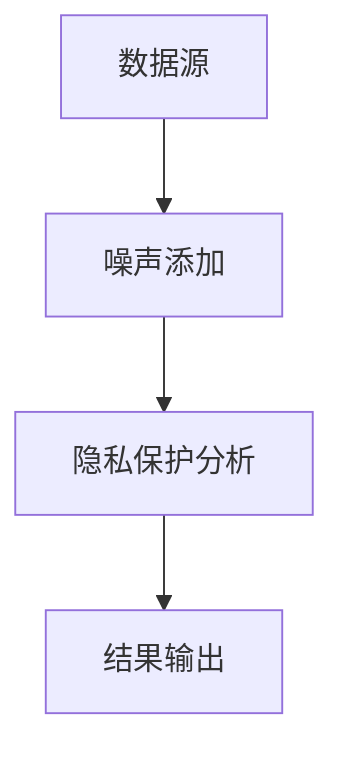
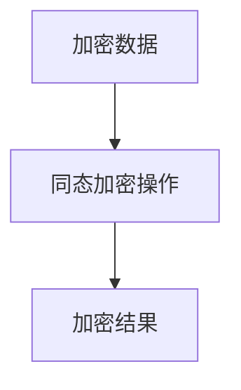
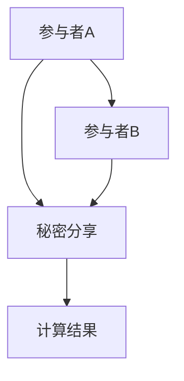

                 

## 文章标题

《隐私计算：在保护数据隐私的同时进行计算》

## 关键词

隐私计算、数据保护、同态加密、安全多方计算、差分隐私

## 摘要

随着大数据和人工智能技术的发展，数据隐私问题日益突出。本文将深入探讨隐私计算技术，介绍其核心概念、算法原理以及在区块链和云计算中的应用，并通过实际案例进行分析，探讨隐私计算的未来发展趋势。

### 第一部分：隐私计算概述

#### 第1章 隐私计算概述

隐私计算是在保护数据隐私的前提下，对数据进行计算和分析的一门技术。它通过多种加密和计算方法，确保数据在处理过程中的隐私性。本章将介绍隐私计算的定义、背景和发展历程，以及其在各个行业中的应用和挑战。

### 第二部分：隐私计算的核心概念与联系

#### 第2章 隐私计算的核心概念与联系

隐私计算涉及多种核心概念，包括差分隐私、同态加密和安全多方计算。本章将详细解释这些概念，并使用Mermaid流程图展示它们之间的关系。

#### 差分隐私

差分隐私是一种保护数据隐私的方法，通过在数据分析过程中添加随机噪声来保护个体的隐私。本章将介绍差分隐私的基本原理，包括拉普拉斯机制和指数机制。



#### 同态加密

同态加密是一种在加密态下对数据进行计算的方法，可以在不解密数据的情况下对数据进行操作。本章将介绍同态加密的基本原理，包括标量同态加密和多项式同态加密。



#### 安全多方计算

安全多方计算是一种允许多个参与者在不泄露各自数据的情况下共同完成计算任务的方法。本章将介绍安全多方计算的基本原理，包括秘密分享协议和安全多方计算协议。



### 第三部分：隐私计算算法原理

#### 第3章 隐私计算算法原理

本章将深入探讨隐私计算中的核心算法，包括同态加密算法和安全多方计算协议。我们将使用伪代码和数学模型来详细阐述这些算法的原理。

#### 同态加密算法原理

同态加密算法允许在加密的数据上进行特定的计算，而不需要解密数据。以下是同态加密算法的伪代码：

```python
def homomorphic_encrypt(data, key):
    encrypted_data = encrypt(data, key)
    return encrypted_data

def homomorphic_compute(encrypted_data, operation):
    encrypted_result = apply_operation(encrypted_data, operation)
    decrypted_result = decrypt(encrypted_result, key)
    return decrypted_result
```

#### 安全多方计算协议原理

安全多方计算协议允许多个参与者在不泄露各自数据的情况下共同完成计算任务。以下是安全多方计算协议的伪代码：

```python
def secure_computation(participant_data, participants):
    shared_secret = setup_shared_secret(participants)
    encrypted_data = encrypt_data(participant_data, shared_secret)
    result = compute_on_encrypted_data(encrypted_data, operation)
    decrypted_result = decrypt_result(result, shared_secret)
    return decrypted_result
```

### 第四部分：隐私计算在区块链中的应用

#### 第4章 隐私计算在区块链中的应用

区块链技术以其去中心化和不可篡改的特性成为隐私计算的重要应用场景。本章将探讨隐私计算在区块链中的实现，包括零知识证明和环签名等技术在区块链中的运用。

### 第五部分：隐私计算在云计算中的实现

#### 第5章 隐私计算在云计算中的实现

云计算提供了强大的计算能力和存储能力，但同时也带来了数据隐私的挑战。本章将介绍隐私计算在云计算中的实现方法，包括基于同态加密的云计算平台和基于安全多方计算的云计算服务。

### 第六部分：隐私计算案例分析

#### 第6章 隐私计算案例分析

本章将通过实际案例，分析隐私计算在不同领域的应用，包括医疗、金融和物联网等。我们将详细讲解案例的实现过程、源代码的解析和实际效果。

### 第七部分：隐私计算的未来发展

#### 第7章 隐私计算的未来发展

随着技术的不断进步，隐私计算将在未来发挥更加重要的作用。本章将探讨隐私计算的未来发展趋势，包括新型加密算法的研究和应用，以及隐私计算与人工智能、物联网等技术的融合。

### 作者信息

作者：AI天才研究院/AI Genius Institute & 禅与计算机程序设计艺术 /Zen And The Art of Computer Programming

通过以上七个部分，本文将全面介绍隐私计算技术，帮助读者了解其在数据隐私保护中的重要作用，以及其在实际应用中的实现方法和发展趋势。文章内容详实，结构清晰，旨在为广大IT从业人员和研究人员提供有价值的参考和指导。

