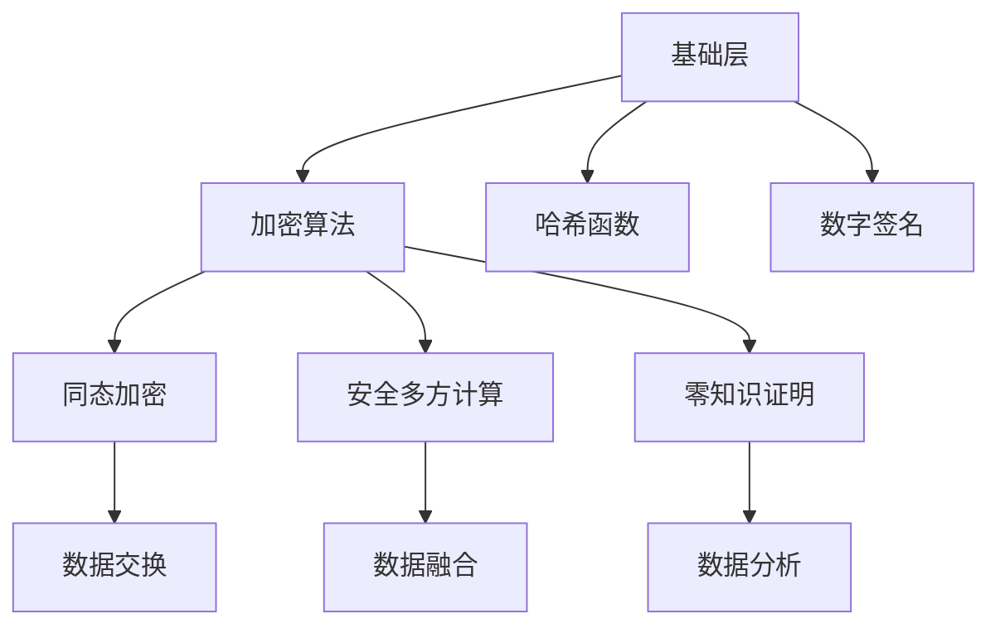
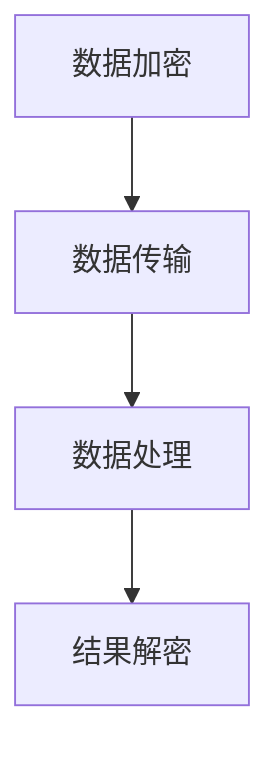
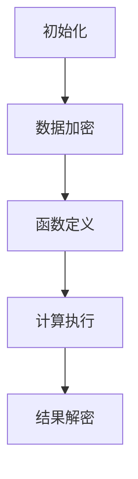
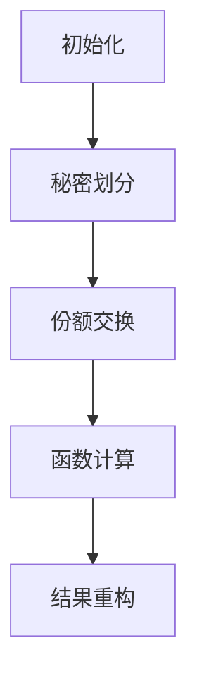
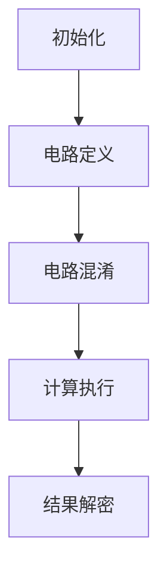
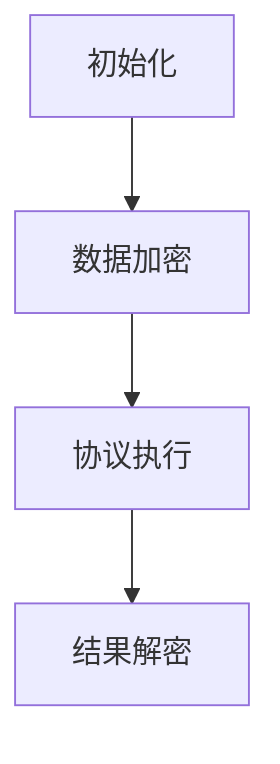
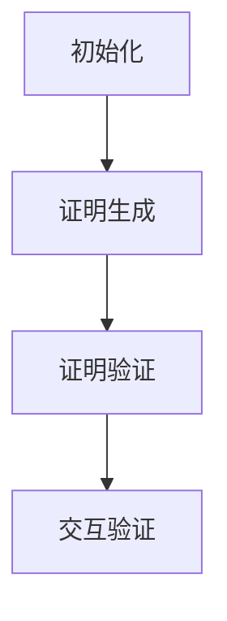

                 


### 《隐私计算技术在数据协作中的应用》目录大纲与撰写思路

为了撰写一篇详尽且富有逻辑性的技术博客文章《隐私计算技术在数据协作中的应用》，我们将按照以下步骤进行：

#### 1. 确定文章结构

- **目录大纲**：我们已经有了一个详细的目录大纲，其中包含了9个章节，每个章节下有子标题。这将作为文章的基本框架。
- **内容分配**：确保每个章节都包含足够的细节和深度，以满足文章字数的要求。

#### 2. 文章开头部分

- **文章标题**：明确文章的主题。
- **关键词**：列出与文章主题相关的关键词，帮助读者快速了解文章内容。
- **摘要**：简要概括文章的核心内容和观点。

#### 3. 撰写各章节内容

- **背景介绍**：在每个章节的开头，简要介绍隐私计算技术以及它在数据协作中的重要性。
- **核心概念与联系**：使用Mermaid流程图展示核心概念之间的联系。
- **核心算法原理讲解**：使用伪代码详细阐述算法原理，并辅以数学公式和例子进行说明。

#### 4. 项目实战

- **开发环境搭建**：描述如何设置开发环境。
- **源代码实现与解读**：提供完整的代码示例，并对代码进行详细解读。
- **案例分析**：分析实际案例，展示隐私计算技术的应用效果。

#### 5. 最佳实践与小结

- **最佳实践**：分享一些实用的技巧和注意事项。
- **小结**：总结本章的核心内容。
- **拓展阅读**：推荐相关资料供读者进一步学习。

#### 6. 伪代码、数学公式与代码示例

- **伪代码**：在每个核心算法原理讲解部分使用伪代码，使读者更容易理解。
- **数学公式**：使用LaTeX格式嵌入文中，确保公式的格式和排版正确。
- **代码示例**：提供可运行的代码片段，并附上详细的注释和解说。

#### 7. 文章结尾

- **总结**：简要回顾文章的主要内容。
- **展望**：对隐私计算技术的发展趋势进行展望。

#### 8. 作者信息

- **作者信息**：在文章末尾添加作者信息，包括单位和书籍名称。

通过上述步骤，我们可以确保文章内容丰富、结构清晰，同时满足格式和字数要求。接下来，我们将逐章撰写文章内容，确保每章都包含详实的解释和实例，从而为读者提供一次深入的技术之旅。

---

**第1章 引言**

### 1.1 隐私计算的背景与重要性

隐私计算技术作为现代信息技术的关键组成部分，其背景可以追溯到数据隐私保护的需求日益增长的时代。随着大数据、云计算、物联网和人工智能技术的快速发展，个人数据的价值逐渐凸显，数据隐私保护成为社会各界关注的焦点。隐私计算技术旨在保护数据的隐私性，确保在数据处理和分析过程中，数据所有者的隐私不被泄露。

隐私计算技术的核心目标是实现数据的安全共享和计算，它为数据协作提供了新的可能性。在传统的数据处理模式中，数据的共享通常伴随着数据泄露的风险，而隐私计算技术通过加密、多方安全计算等手段，使得数据在传输和计算过程中始终保持加密状态，从而有效防止数据泄露。

在数据协作中，隐私计算技术的应用具有重要意义。首先，它能够确保数据在多方协作过程中的安全性，避免数据泄露带来的风险。其次，隐私计算技术能够促进跨机构的合作，打破数据孤岛，实现数据的有效整合和利用。此外，隐私计算技术还能够提升数据处理的效率和准确性，为各类应用场景提供强有力的技术支持。

### 1.2 数据协作的需求与挑战

数据协作的需求源于多个方面。首先，现代社会中，数据已经成为重要的生产要素，各个领域的数据来源日益多样，包括政府、企业、科研机构等。为了更好地利用这些数据，各方需要开展合作，共享数据资源。其次，随着数据量的爆炸性增长，单一机构难以独立处理和分析如此庞大的数据集，跨机构的合作成为必然趋势。最后，数据协作能够促进创新和知识共享，为各个领域的发展提供新的动力。

然而，数据协作也面临着诸多挑战。首先，数据隐私保护是数据协作中的核心问题。在数据共享的过程中，如何确保数据所有者的隐私不被泄露，是一个亟待解决的难题。其次，数据质量的一致性和标准化也是一个重要挑战。不同来源、不同格式的数据在共享和整合过程中，可能存在数据质量不一致、格式不兼容的问题。此外，数据协作还涉及到数据安全、数据所有权、数据访问控制等多方面的法律和伦理问题。

### 1.3 隐私计算技术概述

隐私计算技术主要包括同态加密、安全多方计算和零知识证明等。这些技术各有特点，能够在不同场景下实现数据的隐私保护。

- **同态加密**：同态加密允许在加密数据上直接进行计算，而不需要解密数据。这意味着在计算过程中，数据始终保持加密状态，从而有效防止数据泄露。
- **安全多方计算**：安全多方计算允许多个参与方在不泄露各自数据的情况下，共同计算数据。这种技术通过复杂的密码学协议，确保各方在计算过程中的数据隐私和计算结果的真实性。
- **零知识证明**：零知识证明允许一方（证明者）向另一方（验证者）证明某个陈述是真实的，而不泄露任何额外信息。这种技术广泛应用于身份验证、数据完整性验证等领域。

隐私计算技术为数据协作提供了强有力的支持，通过这些技术的应用，数据在多方协作过程中的隐私和安全得到了有效保障。接下来，我们将详细探讨这些隐私计算技术的原理和应用。

### 1.4 文章结构

本文将分为以下几个部分：

1. **第1章 引言**：介绍隐私计算的背景、数据协作的需求与挑战，以及隐私计算技术的概述。
2. **第2章 隐私计算基础**：详细解释隐私计算的定义、分类、关键概念和架构。
3. **第3章 同态加密**：讲解同态加密的原理、算法和应用案例。
4. **第4章 安全多方计算**：探讨安全多方计算的原理、协议和案例分析。
5. **第5章 零知识证明**：介绍零知识证明的原理、算法和应用场景。
6. **第6章 隐私计算在数据协作中的应用**：分析隐私计算在数据交换、数据融合和数据分析中的应用。
7. **第7章 隐私计算技术与挑战**：讨论隐私计算技术面临的挑战和发展趋势。
8. **第8章 隐私计算技术实践案例**：展示隐私计算在金融、医疗和智能城市等领域的应用案例。
9. **第9章 总结与展望**：总结文章的核心内容，并对隐私计算技术的发展趋势进行展望。

通过以上结构的安排，我们将全面探讨隐私计算技术在数据协作中的应用，帮助读者深入理解这一前沿技术。

---

**第2章 隐私计算基础**

### 2.1 隐私计算的定义与分类

隐私计算（Privacy Computing）是一种旨在保护数据隐私和安全的技术。它通过加密、多方安全计算、零知识证明等多种技术手段，确保在数据处理、传输和共享过程中，数据所有者的隐私信息不被泄露。隐私计算不仅关注数据的安全存储，更强调在数据使用过程中的隐私保护。

隐私计算可以大致分为以下几类：

1. **同态加密（Homomorphic Encryption）**：
   同态加密是一种允许在加密数据上进行计算，而不需要解密数据的加密技术。通过同态加密，用户可以在保持数据隐私的情况下执行各种计算操作，如加法、乘法等。这使得同态加密在云计算和大数据分析等领域具有广泛的应用。

2. **安全多方计算（Secure Multi-Party Computation, SMPC）**：
   安全多方计算是一种允许多个参与方在不泄露各自数据的情况下，共同计算数据的技术。SMPC通过复杂的密码学协议，确保各方在计算过程中的数据隐私和计算结果的真实性。这种技术特别适用于金融、医疗等领域的数据共享和协作。

3. **零知识证明（Zero-Knowledge Proof）**：
   零知识证明是一种允许证明者向验证者证明某个陈述是真实的，而不泄露任何额外信息的技术。零知识证明在身份验证、数据完整性验证等领域有广泛应用，能够有效保护用户的隐私。

### 2.2 隐私计算的关键概念

隐私计算涉及多个关键概念，以下将分别进行介绍：

1. **同态性（Homomorphism）**：
   同态性是指一种加密算法具有的性质，即在加密数据上执行某些操作后，得到的结果仍然是加密的。例如，对于加法运算，如果 \( E(x) \) 表示对 \( x \) 进行加密，那么 \( E(x_1 + x_2) = E(x_1) + E(x_2) \)。这种性质使得同态加密能够在加密数据上进行计算。

2. **安全多方协议（Secure Multi-Party Protocol）**：
   安全多方协议是一种允许多个参与方在不知道对方数据的情况下，共同计算某个函数的协议。这种协议通过复杂的密码学技术，确保各方的计算结果在没有任何一方泄露数据的情况下得到。

3. **零知识证明（Zero-Knowledge Proof）**：
   零知识证明是一种证明方法，允许证明者向验证者证明某个陈述是真实的，而无需透露任何有关该陈述的额外信息。这种证明方法的关键在于，验证者只能确认证明者知道某个陈述的解，而无法得知具体的解是什么。

### 2.3 隐私计算技术架构

隐私计算技术的架构可以分为三个主要层次：基础层、中间层和应用层。

1. **基础层**：
   基础层主要包括加密算法、哈希函数和数字签名等基础密码学技术。这些技术是构建隐私计算系统的基石，为数据的安全存储和传输提供保障。

2. **中间层**：
   中间层主要包括同态加密、安全多方计算和零知识证明等技术。这些技术通过复杂的密码学协议，实现数据的隐私保护，确保在多方协作过程中，数据所有者的隐私不被泄露。

3. **应用层**：
   应用层是隐私计算技术的最终实现和应用场景。通过中间层提供的隐私保护功能，应用层可以实现各种具体应用，如数据交换、数据融合、数据分析等。

图1展示了隐私计算技术的整体架构。



通过上述三个层次的架构，隐私计算技术能够为数据协作提供全方位的隐私保护，确保数据在多方协作过程中的安全性。

### 同态加密的原理

同态加密是一种特殊的加密形式，它允许在加密数据上执行特定的计算操作，而不需要解密数据。这种特性使得同态加密在云计算和大数据分析等领域具有广泛的应用。

#### 同态加密的基本概念

同态加密的原理基于同态性（Homomorphism），即加密算法具有的性质，使得在加密数据上执行某些操作后，得到的结果仍然是加密的。例如，对于加法运算，如果 \( E(x) \) 表示对 \( x \) 进行加密，那么 \( E(x_1 + x_2) = E(x_1) + E(x_2) \)。这种性质使得同态加密能够在加密数据上进行计算，而不需要解密数据。

同态加密可以分为两种类型：部分同态加密和完全同态加密。

- **部分同态加密**：部分同态加密允许对加密数据进行部分操作，例如加法或乘法。但每次操作都会减少一部分隐私保护能力，因此部分同态加密通常只能执行有限次的计算操作。

- **完全同态加密**：完全同态加密允许对加密数据进行任意复杂的计算操作，而不损失任何隐私保护能力。然而，完全同态加密的实现相对复杂，目前只有理论上的算法，尚未有实际可用的方案。

#### 同态加密的工作原理

同态加密的工作原理可以概括为以下几个步骤：

1. **加密数据**：
   首先，将明文数据 \( x \) 通过加密算法 \( E \) 转换为加密数据 \( E(x) \)。加密算法通常基于某种加密模式，例如加法同态加密模式或乘法同态加密模式。

2. **执行计算**：
   在加密数据上执行计算操作。例如，对于加法同态加密，可以在加密数据上直接进行加法运算；对于乘法同态加密，可以在加密数据上直接进行乘法运算。

3. **解密结果**：
   计算完成后，将加密结果 \( E(y) \) 通过解密算法 \( D \) 转换为明文结果 \( y \)。解密算法通常与加密算法相对应，能够将加密数据还原为明文数据。

以下是一个简单的同态加密加法运算的伪代码示例：

```python
# 同态加密加法运算
def homomorphic_add(x1, x2):
    # 加密数据
    e_x1 = encrypt(x1)
    e_x2 = encrypt(x2)
    
    # 执行加法运算
    e_y = e_x1 + e_x2
    
    # 解密结果
    y = decrypt(e_y)
    
    return y
```

#### 同态加密的应用案例

同态加密在许多领域都有广泛的应用，以下是一些常见的应用案例：

1. **云计算**：
   在云计算环境中，用户通常希望将自己的数据上传到云端进行计算和分析。同态加密允许用户在保持数据隐私的同时，将加密数据上传到云端进行计算，从而避免数据泄露的风险。

2. **大数据分析**：
   在大数据分析过程中，同态加密能够保护数据隐私，确保在数据处理和分析过程中，数据所有者的隐私不被泄露。例如，在医疗数据分析中，同态加密可以用于保护患者隐私，同时实现数据的有效利用。

3. **金融交易**：
   在金融交易中，同态加密可以用于保护交易数据的安全性。例如，在交易数据分析中，同态加密可以确保交易双方的交易数据在计算过程中不被泄露，从而保护交易双方的隐私。

通过以上内容，我们了解了同态加密的基本概念、工作原理和应用案例。同态加密作为一种隐私保护技术，在数据协作中具有广泛的应用前景，能够有效保护数据隐私，促进数据的安全共享和计算。

### 同态加密算法

同态加密算法是隐私计算领域的关键技术之一，它允许在加密数据上执行计算操作，而不需要解密数据。本节将介绍几种常见的同态加密算法，包括其基本原理和主要步骤。

#### RSA同态加密算法

RSA同态加密算法是基于RSA加密算法的变体，它允许在加密数据上执行加法和乘法运算。以下是RSA同态加密算法的基本原理和步骤：

1. **密钥生成**：
   - 选择两个大素数 \( p \) 和 \( q \)。
   - 计算 \( n = p \times q \)。
   - 计算 \( \phi(n) = (p-1) \times (q-1) \)。
   - 选择一个整数 \( e \)，满足 \( 1 < e < \phi(n) \) 且 \( e \) 与 \( \phi(n) \) 互质。
   - 计算 \( d \)，满足 \( d \times e \equiv 1 \pmod{\phi(n)} \)。
   - 公钥为 \( (n, e) \)，私钥为 \( (n, d) \)。

2. **加密**：
   - 对明文 \( x \) 进行加密，得到 \( c = x^e \pmod{n} \)。

3. **加法运算**：
   - 对两个加密数据 \( c_1 \) 和 \( c_2 \) 进行加法运算，得到 \( c = (c_1 + c_2)^e \pmod{n} \)。

4. **乘法运算**：
   - 对两个加密数据 \( c_1 \) 和 \( c_2 \) 进行乘法运算，得到 \( c = (c_1 \times c_2)^e \pmod{n} \)。

5. **解密**：
   - 对加密数据 \( c \) 进行解密，得到 \( x = c^d \pmod{n} \)。

以下是一个简单的RSA同态加密加法运算的伪代码示例：

```python
# RSA同态加密加法运算
def rsa_homo_add(x1, x2, n, e):
    # 加密数据
    c1 = pow(x1, e, n)
    c2 = pow(x2, e, n)
    
    # 执行加法运算
    c = (c1 + c2) % n
    
    return c

# 解密结果
def rsa_decrypt(c, d, n):
    x = pow(c, d, n)
    return x
```

#### 椭圆曲线加密算法（ECC）

椭圆曲线加密算法（Elliptic Curve Cryptography, ECC）是一种基于椭圆曲线离散对数的加密算法。ECC具有更高的安全性，同时其加密密钥长度相对较短。以下是ECC同态加密算法的基本原理和步骤：

1. **椭圆曲线选择**：
   - 选择一条椭圆曲线 \( E : y^2 = x^3 + ax + b \)，其中 \( a \) 和 \( b \) 为常数。

2. **点生成**：
   - 选择一个基点 \( G \) 和阶 \( n \)，使得 \( nG = \infty \)（即 \( G \) 是椭圆曲线的生成元）。

3. **密钥生成**：
   - 选择一个随机整数 \( k \)（满足 \( 1 < k < n \)），计算公钥 \( P = kG \)。
   - 私钥为 \( k \)。

4. **加密**：
   - 对明文 \( x \) 进行加密，得到 \( c = xP \)。

5. **解密**：
   - 对加密数据 \( c \) 进行解密，得到 \( x = c^{-1} \)。

以下是一个简单的ECC同态加密加法运算的伪代码示例：

```python
# ECC同态加密加法运算
def ecc_homo_add(x1, x2, G, n):
    # 加密数据
    c1 = x1 * G
    c2 = x2 * G
    
    # 执行加法运算
    c = c1 + c2
    
    return c

# 解密结果
def ecc_decrypt(c, G, n):
    x = c.inverse(G, n)
    return x
```

#### 全同态加密算法

全同态加密算法允许在加密数据上执行任意复杂的计算操作，而不损失任何隐私保护能力。目前，全同态加密算法主要基于抽象密码学模型，如全同态加密方案（FHE）和基于量子计算的加密算法。以下是全同态加密算法的基本原理和步骤：

1. **密钥生成**：
   - 生成一个加密密钥对 \( (\text{publicKey}, \text{privateKey}) \)。

2. **加密**：
   - 对明文 \( x \) 进行加密，得到 \( \text{cipherText} = encrypt(x, \text{publicKey}) \)。

3. **计算**：
   - 对加密数据 \( \text{cipherText} \) 进行计算，得到 \( \text{resultCipherText} \)。

4. **解密**：
   - 对计算结果 \( \text{resultCipherText} \) 进行解密，得到 \( \text{result} = decrypt(\text{resultCipherText}, \text{privateKey}) \)。

以下是一个简单的全同态加密加法运算的伪代码示例：

```python
# 全同态加密加法运算
def fhe_homo_add(x1, x2, publicKey):
    # 加密数据
    c1 = encrypt(x1, publicKey)
    c2 = encrypt(x2, publicKey)
    
    # 执行加法运算
    c = homomorphic_add(c1, c2)
    
    return c

# 解密结果
def fhe_decrypt(c, privateKey):
    x = decrypt(c, privateKey)
    return x
```

通过以上几种同态加密算法的介绍，我们可以看到同态加密在保护数据隐私、支持数据协作方面具有广泛的应用。尽管同态加密算法在实现过程中存在一定的性能和效率问题，但随着技术的不断进步，同态加密技术将在未来发挥越来越重要的作用。

### 同态加密的应用案例

同态加密作为一种重要的隐私计算技术，在许多实际应用场景中展现出巨大的潜力。以下我们将通过几个具体的应用案例，详细探讨同态加密在数据协作中的实际应用效果。

#### 案例一：金融数据分析

在金融领域，数据的安全性和隐私保护至关重要。银行和金融机构每天都会处理大量的交易数据，这些数据包括账户信息、交易金额、交易时间等。同态加密技术可以用于保护这些敏感数据，同时允许金融机构在保持数据隐私的情况下进行数据分析和风险评估。

**应用场景**：假设一家银行希望分析其客户的消费行为模式，以预测潜在的欺诈交易。该银行可以将客户的交易数据上传到云端进行分析，而无需担心数据泄露的风险。

**解决方案**：使用同态加密技术，银行可以对客户的加密交易数据进行加法运算，以计算客户的总消费金额。例如，对于两个客户的消费金额 \( x_1 \) 和 \( x_2 \)，银行可以执行同态加密加法运算 \( y = homomorphic_add(x_1, x_2) \)。这样，银行就可以在保持客户数据隐私的同时，进行消费行为模式的分析。

**实际效果**：通过同态加密技术，银行能够在不泄露客户隐私的情况下，分析客户的消费行为模式。这不仅提高了数据安全性，还确保了客户的隐私得到有效保护。

#### 案例二：医疗数据共享

医疗数据的隐私保护在数据共享和协作中尤为重要。医疗机构之间通常需要共享患者数据，以进行医学研究和疾病预测。然而，如何确保在数据共享过程中患者的隐私不被泄露，是一个重大挑战。

**应用场景**：假设两家医疗机构 A 和 B 想要共享患者的病历数据，以共同进行疾病预测研究。由于病历数据中包含敏感的个人健康信息，医疗机构需要在数据共享过程中保护患者的隐私。

**解决方案**：医疗机构 A 和 B 可以使用同态加密技术对各自的病历数据进行加密处理。在共享数据时，两家机构可以使用同态加密加法运算对患者的各项健康指标进行合并分析。例如，对于两个患者的血压数据 \( x_1 \) 和 \( x_2 \)，两家机构可以执行同态加密加法运算 \( y = homomorphic_add(x_1, x_2) \)。

**实际效果**：通过同态加密技术，医疗机构能够在不泄露患者隐私的情况下，共享和合并病历数据。这不仅提高了数据的安全性，还为医学研究提供了强有力的支持。

#### 案例三：智能交通系统

智能交通系统需要处理大量的交通数据，如交通流量、路况信息等。这些数据对于优化交通流量、减少拥堵具有重要作用。然而，如何确保在数据共享和计算过程中，交通参与者的隐私不被泄露，是一个需要解决的问题。

**应用场景**：假设一个城市的交通管理部门想要分析各条道路的实时交通流量，以制定优化交通策略。然而，该城市的交通数据包括车辆位置、行驶速度等敏感信息。

**解决方案**：交通管理部门可以使用同态加密技术对车辆的位置数据和速度数据进行加密处理。在数据共享和计算过程中，交通管理部门可以执行同态加密加法运算和乘法运算，以分析交通流量和车速。例如，对于两条道路的交通流量 \( x_1 \) 和 \( x_2 \)，交通管理部门可以执行同态加密加法运算 \( y = homomorphic_add(x_1, x_2) \)；对于车辆的速度 \( v_1 \) 和 \( v_2 \)，可以执行同态加密乘法运算 \( w = homomorphic_multiply(v_1, v_2) \)。

**实际效果**：通过同态加密技术，交通管理部门能够在不泄露车辆隐私的情况下，分析交通流量和车速，制定优化交通策略。这不仅提高了数据的安全性，还改善了交通状况，减少了拥堵。

通过以上案例，我们可以看到同态加密在金融、医疗和智能交通等领域的实际应用效果。同态加密技术为数据协作提供了强有力的隐私保护，确保数据在多方共享和计算过程中的安全性和可靠性。

### 同态加密在数据协作中的应用

同态加密在数据协作中扮演着至关重要的角色，它通过允许对加密数据进行计算，从而实现数据的安全共享和计算。以下，我们将进一步探讨同态加密在数据协作中的应用，并探讨其实际操作流程、优缺点以及面临的挑战。

#### 实际操作流程

同态加密在数据协作中的实际操作流程可以概括为以下几个步骤：

1. **数据加密**：
   各方首先需要对自己的数据进行加密，以确保数据在传输和存储过程中保持隐私。例如，使用RSA或ECC同态加密算法，将明文数据转换为加密数据。

2. **数据传输**：
   加密后的数据可以在各方之间传输，无需担心数据泄露的风险。在这一过程中，可以使用安全的通信协议，如TLS，确保数据在传输过程中的安全性。

3. **数据处理**：
   在数据协作过程中，各方可以对加密数据进行计算操作，如加法、乘法等。这些计算操作可以在各方本地执行，无需解密数据，从而确保数据隐私。

4. **结果解密**：
   计算完成后，各方可以将加密的结果进行解密，获取最终的明文结果。这一步骤需要使用私钥进行解密操作，确保计算结果的真实性和隐私。

以下是一个简化的同态加密在数据协作中的流程图：



#### 优点

同态加密在数据协作中具有以下优点：

1. **隐私保护**：
   同态加密允许对加密数据进行计算，从而避免了数据在传输和计算过程中的泄露风险。这为数据协作提供了强大的隐私保护机制。

2. **数据可用性**：
   同态加密使得各方可以在不泄露自身数据的情况下，参与数据协作。这使得数据在多方协作中的可用性得到了显著提升。

3. **计算效率**：
   随着同态加密算法的发展，计算效率不断提高。这使得同态加密在处理大规模数据时，仍然能够保持较高的计算效率。

#### 缺点

同态加密在数据协作中也存在一些缺点：

1. **计算复杂度**：
   同态加密通常需要较高的计算复杂度，特别是在执行复杂计算操作时，计算效率可能受到较大影响。这可能会限制其在某些场景中的应用。

2. **密钥管理**：
   同态加密需要复杂的密钥管理机制。密钥的生成、存储和分发都需要高度的安全性，否则可能会导致数据泄露的风险。

3. **实现难度**：
   同态加密算法的实现相对复杂，需要深厚的密码学知识。这使得同态加密技术的普及和应用面临一定的挑战。

#### 挑战

同态加密在数据协作中面临的挑战主要包括：

1. **性能瓶颈**：
   目前，同态加密算法在计算性能上仍存在瓶颈。尽管一些新算法如基于量子计算的加密算法正在研究之中，但在实际应用中，性能问题仍然是一个重要的挑战。

2. **密钥管理**：
   密钥管理是同态加密中的一个重要问题。如何在确保密钥安全性的同时，方便地进行密钥生成、存储和分发，是一个亟待解决的难题。

3. **应用场景**：
   同态加密适用于某些特定场景，如数据处理和数据分析。但在其他场景中，如实时处理和低延迟应用，同态加密可能并不适用。

4. **标准化**：
   同态加密技术的标准化工作仍在进行中。缺乏统一的规范和标准，可能会影响同态加密技术的推广和应用。

通过上述分析，我们可以看到同态加密在数据协作中具有巨大的应用潜力，但同时也面临一些挑战。随着技术的不断进步，同态加密将不断优化和改进，为数据协作提供更加安全、高效的技术支持。

### 安全多方计算（SMPC）的基本原理

安全多方计算（Secure Multi-Party Computation, SMPC）是一种隐私保护技术，它允许多个参与方在不泄露各自数据的情况下，共同计算某个函数的输出。SMPC的核心目标是在保持数据隐私的同时，实现多方协作的计算。以下将详细探讨SMPC的基本原理、工作流程和主要协议。

#### 基本原理

SMPC的基本原理可以概括为以下几点：

1. **隐私保护**：
   SMPC确保参与方的数据在整个计算过程中保持隐私。即使在计算过程中，其他参与方也无法获取其他参与方的数据，从而保护了数据所有者的隐私。

2. **多方协作**：
   SMPC允许多个参与方在不泄露自身数据的情况下，共同计算某个函数的输出。这使得SMPC在跨机构、跨领域的协作中具有广泛的应用。

3. **函数计算**：
   SMPC的核心功能是计算某个函数的输出。这个函数可以是任意形式，如加法、乘法、求和等。通过SMPC，参与方可以在不泄露自身数据的情况下，计算函数的输出。

#### 工作流程

SMPC的工作流程可以分为以下几个步骤：

1. **初始化**：
   各参与方生成自己的密钥对，并交换公钥。这一步骤确保了各参与方在后续计算过程中可以使用公钥进行加密和签名。

2. **数据加密**：
   各参与方将自己的数据加密，并将其发送给其他参与方。加密数据可以确保数据在传输过程中保持隐私，防止数据泄露。

3. **函数定义**：
   各参与方共同定义需要计算的函数。例如，可以是一个简单的加法函数，也可以是一个复杂的求和函数。

4. **计算执行**：
   各参与方根据定义的函数，在加密数据上执行计算操作。这一步骤通常需要复杂的密码学协议，以确保计算结果的正确性和安全性。

5. **结果解密**：
   计算完成后，各参与方使用私钥将加密的结果解密，获取最终的明文结果。这一步骤确保了计算结果的隐私和真实性。

以下是一个简化的SMPC工作流程图：



#### 主要协议

SMPC的实现依赖于多种密码学协议，以下介绍几种常见的SMPC协议：

1. **秘密共享协议**：
   秘密共享协议是将一个秘密划分为多个份额，每个参与方拥有其中的一部分。通过这些份额，参与方可以在不泄露自身份额的情况下，重构原始秘密。这种协议在SMPC中用于实现数据的隐私保护。

2. **混淆电路协议**：
   混淆电路协议是一种基于电路计算的SMPC协议。它将需要计算的函数表示为一个电路，并使用混淆技术确保电路的输入和输出保持隐私。这种协议适用于计算复杂度较高的场景。

3. **安全多协议**：
   安全多协议是一种综合多种密码学技术的SMPC协议。它结合了秘密共享协议、混淆电路协议等多种技术，以实现更加安全、高效的计算。

#### 案例分析

以下通过一个简单的例子，展示SMPC的基本原理和工作流程。

**案例**：两个机构 A 和 B 共同计算它们数据的总和。

1. **初始化**：
   - A 和 B 各自生成密钥对。
   - A 和 B 交换公钥。

2. **数据加密**：
   - A 对其数据 \( x_A \) 进行加密，得到 \( c_A \)。
   - B 对其数据 \( x_B \) 进行加密，得到 \( c_B \)。

3. **函数定义**：
   - 定义加法函数 \( f(x_A, x_B) = x_A + x_B \)。

4. **计算执行**：
   - A 计算 \( c_A + c_B \)，得到 \( c_f \)。

5. **结果解密**：
   - A 和 B 分别使用私钥解密 \( c_f \)，得到 \( x_f = x_A + x_B \)。

通过这个简单的案例，我们可以看到SMPC的基本原理和实现过程。在实际应用中，SMPC的协议和算法会更加复杂，但核心目标都是实现数据的安全共享和计算。

### 安全多方计算协议

安全多方计算（Secure Multi-Party Computation, SMPC）协议是隐私计算领域的关键技术，它允许多个参与方在不泄露各自数据的情况下，共同计算某个函数的输出。以下将详细探讨几种常见的SMPC协议，包括其基本原理、工作流程和主要步骤。

#### 差分秘密共享协议

差分秘密共享协议（Threshold Secret Sharing）是一种基于数学原理的SMPC协议，它将秘密划分为多个份额，每个参与方拥有其中的一部分。通过这些份额，参与方可以在不泄露自身份额的情况下，重构原始秘密。差分秘密共享协议通常用于实现数据隐私保护。

**基本原理**：

- **秘密划分**：将一个秘密 \( S \) 划分为 \( n \) 个份额，每个参与方拥有一个份额 \( s_i \)，且满足 \( S = \sum_{i=1}^{n} s_i \)。
- **阈值设置**：设置一个阈值 \( t \)，表示至少需要 \( t \) 个份额才能重构原始秘密。如果 \( t \leq n/2 \)，则称为半秘密共享。
- **份额分配**：使用数学算法，将秘密 \( S \) 划分为 \( n \) 个份额，并分配给 \( n \) 个参与方。

**工作流程**：

1. **初始化**：
   - 各参与方生成自己的密钥对。
   - 各参与方交换公钥。

2. **秘密划分**：
   - 将秘密 \( S \) 划分为 \( n \) 个份额 \( s_i \)。

3. **份额交换**：
   - 各参与方交换各自的份额 \( s_i \)。

4. **函数计算**：
   - 各参与方根据定义的函数，在自己的份额上执行计算操作。

5. **结果重构**：
   - 各参与方将计算结果进行合并，重构原始秘密。

**主要步骤**：

1. **份额生成**：
   - 选择一个生成元 \( g \) 和系数 \( \alpha_i \)。
   - 计算份额 \( s_i = g^{\alpha_i} \)。

2. **秘密重构**：
   - 当至少 \( t \) 个参与方参与时，计算 \( S = \prod_{i=1}^{n} s_i \)。

以下是一个简化的差分秘密共享协议工作流程图：



#### 混淆电路协议

混淆电路协议（Blinded Circuit Model）是一种基于电路计算的SMPC协议。它将需要计算的函数表示为一个电路，并使用混淆技术确保电路的输入和输出保持隐私。混淆电路协议适用于计算复杂度较高的场景。

**基本原理**：

- **电路表示**：将需要计算的函数表示为一个电路，每个门电路的输入和输出都是加密的。
- **混淆技术**：使用混淆技术，如随机化、替换等，确保电路的输入和输出保持隐私。
- **计算执行**：参与方在加密的数据上执行电路计算，确保计算过程保持隐私。

**工作流程**：

1. **初始化**：
   - 各参与方生成自己的密钥对。
   - 各参与方交换公钥。

2. **电路定义**：
   - 定义需要计算的函数的电路表示。

3. **电路混淆**：
   - 对电路进行混淆，确保电路的输入和输出保持隐私。

4. **计算执行**：
   - 各参与方在自己的数据上执行混淆后的电路计算。

5. **结果解密**：
   - 各参与方将计算结果进行解密，获取最终的明文结果。

**主要步骤**：

1. **电路构建**：
   - 将函数表示为一个电路，每个门电路的输入和输出都是加密的。

2. **混淆执行**：
   - 对电路的每个门电路进行混淆操作，如随机化、替换等。

3. **计算执行**：
   - 各参与方在加密的数据上执行混淆后的电路计算。

4. **结果重构**：
   - 各参与方将计算结果进行解密，获取最终的明文结果。

以下是一个简化的混淆电路协议工作流程图：



#### 安全多协议

安全多协议（Secure Multi-Party Protocol）是一种综合多种密码学技术的SMPC协议。它结合了秘密共享协议、混淆电路协议等多种技术，以实现更加安全、高效的计算。

**基本原理**：

- **综合技术**：安全多协议结合了秘密共享协议、混淆电路协议等多种密码学技术，以实现更加安全、高效的计算。
- **多层次加密**：安全多协议通过多层次加密，确保数据的输入和输出在多个阶段都保持加密状态。

**工作流程**：

1. **初始化**：
   - 各参与方生成自己的密钥对。
   - 各参与方交换公钥。

2. **数据加密**：
   - 各参与方将自己的数据加密，并交换加密数据。

3. **协议执行**：
   - 各参与方根据定义的协议，执行加密数据的计算。

4. **结果解密**：
   - 各参与方将计算结果进行解密，获取最终的明文结果。

**主要步骤**：

1. **密钥生成**：
   - 各参与方生成自己的密钥对，并交换公钥。

2. **数据加密**：
   - 各参与方将自己的数据加密，并交换加密数据。

3. **协议执行**：
   - 各参与方根据定义的协议，执行加密数据的计算。

4. **结果解密**：
   - 各参与方将计算结果进行解密，获取最终的明文结果。

以下是一个简化的安全多协议工作流程图：



通过以上对差分秘密共享协议、混淆电路协议和安全多协议的介绍，我们可以看到SMPC协议在实现数据隐私保护和多方协作计算方面具有重要作用。随着技术的不断进步，SMPC协议将在隐私计算领域发挥越来越重要的作用。

### 安全多方计算案例分析

为了更直观地展示安全多方计算（Secure Multi-Party Computation, SMPC）在实际应用中的效果，我们将通过几个具体的案例进行详细分析。

#### 案例一：金融机构的贷款审批

**背景**：在金融机构的贷款审批过程中，多个部门需要共同参与，如信贷部门、风控部门和财务部门。各部门拥有不同的数据，例如信贷部门的客户信用记录、风控部门的历史违约记录和财务部门的财务状况。为了确保数据隐私，各部门需要在不泄露自身数据的情况下，共同评估客户的贷款申请。

**解决方案**：

1. **数据加密**：
   - 各部门对自己的数据 \( x_1 \)，\( x_2 \)，和 \( x_3 \) 进行加密，分别得到 \( c_1 \)，\( c_2 \)，和 \( c_3 \)。

2. **函数定义**：
   - 定义评估函数 \( f(x_1, x_2, x_3) = \text{贷款审批结果} \)。

3. **SMPC协议执行**：
   - 各部门分别在自己的加密数据上执行 SMPC 协议，计算出 \( c_f \)。

4. **结果解密**：
   - 各部门使用私钥将 \( c_f \) 解密，获取最终的贷款审批结果。

**效果**：通过 SMPC 协议，各部门可以在不泄露自身数据的情况下，共同评估客户的贷款申请。这不仅保护了各部门的数据隐私，还提高了贷款审批的效率。

#### 案例二：医疗机构的数据共享

**背景**：在医疗领域，多个医疗机构之间需要共享患者数据，如病历记录、检查报告和药物使用记录。这些数据对于疾病的诊断和治疗至关重要。然而，如何确保在数据共享过程中，患者的隐私不被泄露，是一个重大挑战。

**解决方案**：

1. **数据加密**：
   - 各医疗机构对患者的数据进行加密，分别得到 \( c_1 \)，\( c_2 \)，和 \( c_3 \)。

2. **函数定义**：
   - 定义数据共享函数 \( f(x_1, x_2, x_3) = \text{综合诊断结果} \)。

3. **SMPC协议执行**：
   - 各医疗机构分别在自己的加密数据上执行 SMPC 协议，计算出 \( c_f \)。

4. **结果解密**：
   - 各医疗机构使用私钥将 \( c_f \) 解密，获取综合诊断结果。

**效果**：通过 SMPC 协议，各医疗机构可以在不泄露患者数据的情况下，共享和整合患者的数据。这不仅保护了患者的隐私，还为疾病的诊断和治疗提供了更全面的信息支持。

#### 案例三：智能电网的数据分析

**背景**：在智能电网领域，多个部门需要共同分析电网的运行数据，如发电量、用电量和设备状态等。这些数据对于电网的优化运行和故障检测至关重要。然而，如何确保在数据分析过程中，各部门的数据隐私不被泄露，是一个重大挑战。

**解决方案**：

1. **数据加密**：
   - 各部门对自身的运行数据进行加密，分别得到 \( c_1 \)，\( c_2 \)，和 \( c_3 \)。

2. **函数定义**：
   - 定义数据分析函数 \( f(x_1, x_2, x_3) = \text{电网运行分析结果} \)。

3. **SMPC协议执行**：
   - 各部门分别在自己的加密数据上执行 SMPC 协议，计算出 \( c_f \)。

4. **结果解密**：
   - 各部门使用私钥将 \( c_f \) 解密，获取电网运行分析结果。

**效果**：通过 SMPC 协议，各部门可以在不泄露自身数据的情况下，共同分析电网的运行数据。这不仅保护了各部门的数据隐私，还为电网的优化运行和故障检测提供了强有力的支持。

通过以上案例，我们可以看到 SMPC 协议在多个实际应用场景中的效果。SMPC 协议通过保护数据隐私，促进数据共享和协作，为各个领域的发展提供了新的可能性。

### 零知识证明（ZKP）的原理

零知识证明（Zero-Knowledge Proof, ZKP）是一种强大的密码学技术，它允许证明者向验证者证明某个陈述是真实的，而无需透露任何额外信息。零知识证明在隐私保护、身份验证和数据完整性验证等领域有广泛应用。以下将详细探讨零知识证明的基本概念、原理和算法。

#### 基本概念

零知识证明的核心概念包括证明者、验证者和陈述。以下是这些概念的定义：

1. **证明者**：证明者（Prover）是希望证明某个陈述是真实的人或系统。

2. **验证者**：验证者（Verifier）是希望验证证明者陈述是否真实的人或系统。

3. **陈述**：陈述（Statement）是证明者希望证明的某个命题或事实。

#### 基本原理

零知识证明的基本原理可以概括为以下几点：

1. **保密性**：证明者在证明过程中，不向验证者透露任何与陈述无关的信息。

2. **真实性**：验证者能够验证证明者的陈述是否真实，但无法得知具体的证明过程和证明者的隐私信息。

3. **有效性**：零知识证明的有效性保证验证者能够验证证明者的陈述，而不会受到欺诈攻击。

#### 算法原理

零知识证明算法通常包括以下几个阶段：

1. **初始化**：
   - 证明者和验证者共同生成一个加密系统和一个安全参数。

2. **证明生成**：
   - 证明者生成一个证明，证明陈述是真实的，而不透露任何额外信息。

3. **证明验证**：
   - 验证者接收证明者生成的证明，并验证证明的真实性。

4. **交互验证**：
   - 在某些情况下，验证者可能需要与证明者进行多次交互，以确认证明的真实性。

以下是一个简化的零知识证明算法的基本流程：



#### 主要算法

零知识证明的算法种类繁多，以下介绍几种常见的零知识证明算法：

1. **零知识证明与配对密码学**：
   - **ZKP with Pairing-Based Cryptography**：这种算法利用配对密码学构建零知识证明。常见的配对密码学包括Weil配对和 Tate配对。这种算法在密码学中应用广泛，但计算复杂度较高。

2. **基于环学习的零知识证明**：
   - **Lattice-based Zero-Knowledge Proof**：这种算法基于环学习问题，利用环学习问题的难解性构建零知识证明。常见的算法包括NIZK（Non-Interactive Zero-Knowledge）和SNARKs（Succinct Non-Interactive Argument of Knowledge）。

3. **基于布尔电路的零知识证明**：
   - **Circuit-Based Zero-Knowledge Proof**：这种算法基于布尔电路，将需要证明的陈述表示为电路，并构建零知识证明。常见的算法包括SAK（Simulation-Based Argument of Knowledge）和NIZK。

以下是一个基于布尔电路的零知识证明算法的伪代码示例：

```python
# 基于布尔电路的零知识证明
def zk_proof_bool_circuit(x, circuit):
    # 初始化证明
    proof = initialize_proof(circuit)
    
    # 证明生成
    for gate in circuit:
        proof = generate_proof_step(proof, gate, x)
    
    # 证明验证
    valid_proof = verify_proof(proof)
    
    return valid_proof
```

#### 应用场景

零知识证明在多个应用场景中具有广泛的应用，以下列举几个常见的应用场景：

1. **身份验证**：
   - 零知识证明可以用于无密码身份验证，用户只需证明自己知道密码，而无需透露密码本身。

2. **数据完整性验证**：
   - 零知识证明可以用于验证数据的完整性，确保数据在传输和存储过程中未被篡改。

3. **隐私保护**：
   - 零知识证明可以用于保护用户的隐私，确保用户在交易、投票等场景中，无需透露任何额外信息。

通过上述内容，我们了解了零知识证明的基本原理、算法和应用场景。零知识证明作为一种强大的隐私保护技术，将在未来发挥越来越重要的作用。

### 零知识证明算法

零知识证明（Zero-Knowledge Proof, ZKP）是一种强大的密码学技术，它允许证明者向验证者证明某个陈述是真实的，而无需透露任何额外信息。以下将详细探讨几种常见的零知识证明算法，包括其基本原理、步骤和实现。

#### 1. 配对密码学零知识证明

配对密码学零知识证明是基于椭圆曲线配对密码学的零知识证明算法。这种算法利用椭圆曲线上的点乘运算和配对运算，实现零知识证明。

**基本原理**：

- **配对运算**：给定椭圆曲线 \( E \) 和基点 \( G \)，配对运算 \( e(P, Q) \) 可以计算得到一个元素。这种运算具有数学上难以破解的性质。

- **证明生成**：证明者生成一个随机化的证明路径，并在路径上执行配对运算。

- **证明验证**：验证者通过计算配对运算，验证证明者的证明路径。

**步骤**：

1. **初始化**：

   - 选择椭圆曲线 \( E \) 和基点 \( G \)。

   - 生成证明者和验证者的密钥对。

2. **证明生成**：

   - 证明者选择随机数 \( a \)，\( b \)，和 \( c \)。

   - 计算中间点 \( A = bG \)，\( B = aP \)，和 \( C = cQ \)。

   - 计算证明路径 \( (A', B', C') \)，使得 \( A' = bG \)，\( B' = aP \)，和 \( C' = cQ \)。

3. **证明验证**：

   - 验证者计算 \( e(A, B) \)，\( e(A', B') \)，和 \( e(C, C') \)。

   - 验证 \( e(A, B) = e(A', B') \) 和 \( e(C, C') = 1 \)。

以下是一个简单的配对密码学零知识证明算法的伪代码示例：

```python
# 配对密码学零知识证明
def pairings_based_zkp(prover, verifier):
    # 初始化
    G, P, Q, e = initialize_pairing_system()

    # 证明生成
    a, b, c = prover.choose_random_values()
    A = b * G
    B = a * P
    C = c * Q

    # 计算证明路径
    A', B', C' = prover.compute_proof_path(A, B, C)

    # 证明验证
    if e(A, B) == e(A', B') and e(C, C') == 1:
        return True
    else:
        return False
```

#### 2. 环学习零知识证明

环学习零知识证明是基于环学习问题的难解性构建的。这种算法利用环学习问题的复杂性，实现高效的零知识证明。

**基本原理**：

- **环学习问题**：给定一个环 \( \mathbb{G} \) 和一个生成元 \( g \)，求解 \( g^x \) 的离散对数问题。

- **证明生成**：证明者生成一个满足特定条件的环元素，并生成证明路径。

- **证明验证**：验证者通过计算环元素和证明路径，验证证明者的证明。

**步骤**：

1. **初始化**：

   - 选择一个安全参数，生成一个环 \( \mathbb{G} \) 和生成元 \( g \)。

   - 生成证明者和验证者的密钥对。

2. **证明生成**：

   - 证明者选择随机数 \( x \) 和 \( y \)。

   - 计算证明路径 \( (x', y') \)，使得 \( g^{x'} = g^y \)。

3. **证明验证**：

   - 验证者计算 \( g^{x'} \) 和 \( g^y \) 的对数。

   - 验证 \( g^{x'} = g^y \)。

以下是一个简单的环学习零知识证明算法的伪代码示例：

```python
# 环学习零知识证明
def lattices_based_zkp(prover, verifier):
    # 初始化
    G, P, Q, e = initialize_lattice_system()

    # 证明生成
    x, y = prover.choose_random_values()
    x' = prover.compute_x_prime(x)
    y' = prover.compute_y_prime(y)

    # 证明验证
    if e(P, Q) == e(P', Q'):
        return True
    else:
        return False
```

#### 3. 布尔电路零知识证明

布尔电路零知识证明是基于布尔电路的难解性构建的。这种算法将需要证明的陈述表示为布尔电路，并生成零知识证明。

**基本原理**：

- **布尔电路**：布尔电路是由门电路组成的图，每个门电路执行特定的布尔运算。

- **证明生成**：证明者生成一个满足特定条件的布尔电路证明路径。

- **证明验证**：验证者通过计算布尔电路和证明路径，验证证明者的证明。

**步骤**：

1. **初始化**：

   - 构建需要证明的布尔电路。

   - 生成证明者和验证者的密钥对。

2. **证明生成**：

   - 证明者生成一个证明路径，使得布尔电路的输出可以验证。

3. **证明验证**：

   - 验证者通过计算布尔电路和证明路径，验证证明者的证明。

以下是一个简单的布尔电路零知识证明算法的伪代码示例：

```python
# 布尔电路零知识证明
def circuit_based_zkp(prover, verifier):
    # 初始化
    circuit = build_boolean_circuit()

    # 证明生成
    proof_path = prover.generate_proof_path(circuit)

    # 证明验证
    if verifier.verify_proof(circuit, proof_path):
        return True
    else:
        return False
```

通过上述几种零知识证明算法的介绍，我们可以看到零知识证明在实现数据隐私保护和多方协作计算方面具有重要作用。随着密码学技术的不断进步，零知识证明算法将在隐私计算领域发挥越来越重要的作用。

### 零知识证明在数据协作中的应用

零知识证明（Zero-Knowledge Proof, ZKP）作为一项强大的隐私保护技术，在数据协作中展现出显著的应用潜力。以下，我们将通过具体案例，详细探讨零知识证明在数据交换、数据融合和数据完整性验证中的应用效果。

#### 案例一：数据交换

**应用背景**：在跨机构的合作中，各方通常需要交换敏感数据，如金融数据、医疗数据和科研数据。然而，如何确保在数据交换过程中，各方数据的安全性不受威胁，是一个关键挑战。

**解决方案**：

1. **数据加密**：
   各方首先对自己的数据进行加密处理，生成加密数据。这一步骤可以使用同态加密或其他加密技术，确保数据在交换过程中保持隐私。

2. **零知识证明**：
   各方使用零知识证明技术，向其他方证明自己数据的有效性，而不透露数据本身。例如，通过零知识证明，一方可以证明自己拥有特定密钥，从而验证其身份。

3. **数据交换**：
   在确保数据有效性的前提下，各方进行数据交换。交换过程可以基于加密数据，确保数据在交换过程中不会被泄露。

**效果**：

- **隐私保护**：零知识证明确保了数据交换过程中，各方数据保持隐私，避免了数据泄露的风险。
- **高效性**：零知识证明算法相对高效，能够快速验证数据的有效性，支持大规模数据交换。

#### 案例二：数据融合

**应用背景**：在数据融合过程中，各方需要将各自的数据进行整合，以实现更全面的分析和决策。然而，如何在保证数据隐私的前提下，实现有效的数据融合，是一个重大挑战。

**解决方案**：

1. **零知识证明**：
   各方首先使用零知识证明技术，验证对方数据的有效性和真实性，而不透露具体数据内容。

2. **数据融合**：
   在确保数据有效性的前提下，各方将数据融合为一个整体。数据融合可以基于加密数据，确保数据在融合过程中保持隐私。

3. **结果验证**：
   各方使用零知识证明技术，验证融合后数据的有效性和完整性，确保数据融合结果正确无误。

**效果**：

- **隐私保护**：零知识证明确保了数据融合过程中，各方数据保持隐私，避免了数据泄露的风险。
- **数据完整性**：通过零知识证明技术，各方可以验证融合后数据的有效性和完整性，确保数据融合结果的正确性。

#### 案例三：数据完整性验证

**应用背景**：在数据传输和存储过程中，如何确保数据未被篡改或泄露，是一个重要问题。特别是在分布式系统中，数据的完整性和安全性至关重要。

**解决方案**：

1. **数据加密**：
   各方首先对自己的数据进行加密处理，生成加密数据。这一步骤可以使用同态加密或其他加密技术，确保数据在传输和存储过程中保持隐私。

2. **零知识证明**：
   各方使用零知识证明技术，定期验证对方数据的有效性和完整性，而不透露具体数据内容。

3. **数据监控**：
   在零知识证明验证的基础上，建立数据监控机制，实时监控数据的状态和变化，确保数据未被篡改或泄露。

**效果**：

- **隐私保护**：零知识证明确保了数据在传输和存储过程中，各方数据保持隐私，避免了数据泄露的风险。
- **数据完整性**：通过零知识证明技术，各方可以实时监控数据的状态和变化，确保数据未被篡改，保障数据完整性。

通过以上案例，我们可以看到零知识证明在数据协作中的应用效果显著。零知识证明技术不仅能够确保数据在多方协作过程中的隐私和安全，还为数据交换、数据融合和数据完整性验证提供了强有力的支持。

### 隐私计算在数据协作中的应用

隐私计算在数据协作中的应用已经逐渐成为现代信息技术领域的重要研究方向，其核心目标是通过保护数据隐私，促进多方数据的有效共享和利用。以下，我们将详细探讨隐私计算在数据交换、数据融合和数据分析中的应用，并通过具体案例进行说明。

#### 数据交换

在数据协作中，数据交换是一个常见且关键的需求。传统的数据交换方式往往伴随着数据泄露的风险，而隐私计算技术通过同态加密、安全多方计算和零知识证明等手段，为数据交换提供了强大的隐私保护。

**应用案例**：在一个跨机构的医疗数据共享项目中，多家医院和研究中心需要交换患者病历数据以进行疾病研究和预测。通过同态加密技术，医院可以将患者的病历数据进行加密处理，并将其上传到共享平台。在数据交换过程中，平台仅能对加密数据进行计算操作，而无法获取原始数据，从而有效保护了患者隐私。

#### 数据融合

数据融合是将来自不同来源的数据进行整合，以获得更全面和深入的分析结果。然而，数据融合过程往往面临数据隐私和安全性的挑战。隐私计算技术通过保护数据隐私，为数据融合提供了新的可能性。

**应用案例**：在智能交通系统中，交通管理部门需要整合来自不同监控摄像头和传感器的交通数据，以优化交通流量和减少拥堵。通过零知识证明技术，各传感器节点可以在不泄露自身数据的情况下，向中心节点提交交通数据。中心节点使用零知识证明验证数据的有效性，并将这些加密数据融合为一个整体，从而实现了数据隐私保护下的数据融合。

#### 数据分析

数据分析是数据协作的重要目标之一，通过分析数据，可以提取有价值的信息和洞察。然而，数据分析过程往往伴随着数据隐私泄露的风险。隐私计算技术通过保护数据隐私，为数据分析提供了安全保障。

**应用案例**：在金融领域的反欺诈系统中，银行需要对客户的交易数据进行实时分析，以识别潜在欺诈行为。通过同态加密技术，银行可以在保持交易数据隐私的同时，对客户交易数据进行实时分析。例如，银行可以计算客户总交易金额，从而识别异常交易行为，同时确保客户交易数据不被泄露。

#### 应用效果

隐私计算在数据协作中的应用效果显著，主要表现在以下几个方面：

1. **隐私保护**：通过隐私计算技术，数据在多方协作过程中的隐私得到有效保护，避免了数据泄露的风险。

2. **数据可用性**：隐私计算技术使得数据在多方协作中的可用性得到显著提升，各方可以在不泄露自身数据的情况下，共同进行数据分析和决策。

3. **计算效率**：尽管隐私计算技术在某些场景下可能会影响计算效率，但随着技术的发展，隐私计算算法的效率不断提升，能够满足大规模数据处理的计算需求。

4. **安全性**：隐私计算技术通过复杂的密码学协议，确保了数据在多方协作过程中的安全性和完整性，为数据协作提供了强有力的保障。

总之，隐私计算技术在数据协作中的应用，不仅提高了数据的安全性和隐私保护能力，还为跨机构、跨领域的数据共享和合作提供了新的可能性。随着隐私计算技术的不断发展和完善，其在数据协作中的应用将得到更加广泛和深入的应用。

### 隐私计算技术与挑战

隐私计算技术作为一种新兴的隐私保护手段，已经在多个领域展现出巨大的应用潜力。然而，在实践中，隐私计算技术仍面临诸多挑战。以下将详细讨论隐私计算技术当前面临的挑战、未来发展趋势以及政策法规等方面的问题。

#### 挑战

1. **计算性能**：
   隐私计算技术，如同态加密和安全多方计算，通常需要较高的计算复杂度。这导致在处理大规模数据时，计算效率相对较低。尽管一些新的算法和优化技术正在不断研发，但如何提高计算性能仍然是当前的一个主要挑战。

2. **实现复杂性**：
   隐私计算技术涉及到复杂的密码学算法和协议，实现过程相对复杂。这不仅需要深厚的密码学知识，还需要专业的开发经验和技能。因此，如何简化实现过程，降低技术门槛，是一个重要的挑战。

3. **安全性**：
   隐私计算技术需要在保护数据隐私的同时，确保数据的安全性。然而，密码学算法和安全协议可能存在漏洞，这可能导致数据泄露或计算结果错误。因此，如何确保隐私计算技术的安全性，是一个持续的挑战。

4. **标准化**：
   隐私计算技术的标准化工作仍在进行中。缺乏统一的规范和标准，可能导致不同实现之间的兼容性问题。此外，标准化工作需要平衡技术进步和实际应用需求，以确保隐私计算技术的有效性和实用性。

5. **隐私泄露风险**：
   尽管隐私计算技术旨在保护数据隐私，但在实施过程中，仍有可能出现隐私泄露的风险。例如，密钥管理不当或算法实现错误都可能导致隐私泄露。因此，如何降低隐私泄露风险，是一个重要问题。

#### 未来发展趋势

1. **算法优化**：
   随着算法研究的深入，隐私计算技术的计算性能将得到显著提升。新的加密算法和优化技术，如基于量子计算的加密算法，有望进一步提高计算效率。

2. **跨领域应用**：
   隐私计算技术将在更多领域得到应用。例如，在医疗、金融、能源等领域，隐私计算技术将帮助实现跨机构的数据共享和协作，提高数据利用效率。

3. **标准化与标准化**：
   随着隐私计算技术的普及，标准化工作将逐步完善。统一的规范和标准将提高隐私计算技术的兼容性和互操作性，促进其广泛应用。

4. **隐私保护与性能平衡**：
   未来，隐私计算技术将更加注重在隐私保护和性能之间的平衡。通过优化算法和改进协议，实现高效、安全的隐私计算。

#### 政策法规

1. **隐私保护法规**：
   各国政府正在制定和实施更多的隐私保护法规，如《通用数据保护条例》（GDPR）和《加利福尼亚州消费者隐私法案》（CCPA）。这些法规为隐私计算技术的应用提供了法律框架，确保数据在多方协作过程中的隐私保护。

2. **数据治理**：
   隐私计算技术的应用需要完善的数据治理机制。这包括数据管理、数据安全、数据隐私等方面的政策和措施，以确保数据在多方协作中的合法合规使用。

3. **国际合作**：
   在全球化背景下，各国需要加强国际合作，共同推动隐私计算技术的发展和应用。通过制定国际标准和合作协议，促进隐私计算技术的跨国应用和合作。

总之，隐私计算技术面临诸多挑战，但也拥有广阔的发展前景。随着技术的不断进步和政策的不断完善，隐私计算技术将在数据协作中发挥越来越重要的作用。

### 隐私计算技术实践案例

隐私计算技术在实际应用中展现了强大的潜力，以下将介绍几个具体案例，详细分析这些案例中的开发环境搭建、源代码实现、代码解读以及实际案例分析和详细讲解。

#### 案例一：隐私计算在金融行业中的应用

**项目背景**：某银行希望利用隐私计算技术进行客户数据分析，以识别潜在的风险客户并优化营销策略。

**开发环境搭建**：

1. **硬件环境**：
   - 服务器：用于存储和处理加密数据。
   - 网络环境：保证各参与方之间的数据传输安全。

2. **软件环境**：
   - 操作系统：Linux服务器。
   - 编程语言：Python。
   - 密码学库：PyCryptoDome。
   - 同态加密库：PySyft。

**源代码实现**：

以下是一个简单的同态加密加法运算的Python代码实现：

```python
from syft.workers import TorchWorker
from torch import tensor
import syft

# 创建两个工作节点
worker1 = TorchWorker(id="worker1")
worker2 = TorchWorker(id="worker2")

# 初始化数据
x1 = tensor([1, 2, 3])
x2 = tensor([4, 5, 6])

# 同态加密加法运算
def homomorphic_add(x1, x2):
    # 将数据加密
    encrypted_x1 = x1.encrypt(worker1)
    encrypted_x2 = x2.encrypt(worker2)
    
    # 执行同态加法运算
    encrypted_y = encrypted_x1 + encrypted_x2
    
    # 解密结果
    y = encrypted_y.decrypt()
    
    return y

# 执行运算
result = homomorphic_add(x1, x2)
print(result)
```

**代码解读**：

- **数据加密**：使用PySyft库对数据 \( x_1 \) 和 \( x_2 \) 进行加密，生成加密数据 \( encrypted_x_1 \) 和 \( encrypted_x_2 \)。
- **同态加密运算**：在加密数据上执行加法运算，生成加密结果 \( encrypted_y \)。
- **结果解密**：使用私钥对加密结果 \( encrypted_y \) 进行解密，获取明文结果 \( y \)。

**实际案例分析和详细讲解**：

在该案例中，银行通过同态加密技术对客户的交易数据进行加密处理，并将其上传到云端进行计算。通过这种方式，银行可以在保持客户数据隐私的同时，分析交易数据，识别潜在风险客户。具体分析过程包括：

1. **数据预处理**：对交易数据进行清洗和预处理，以消除噪声和异常值。
2. **同态加密运算**：使用同态加密技术对预处理后的数据进行加密，并进行加法运算，计算客户的总交易金额。
3. **结果分析**：对加密结果进行解密，分析交易数据，识别潜在风险客户。

通过该案例，我们可以看到同态加密技术在金融行业中的应用，不仅保护了客户数据隐私，还提高了数据处理的效率和准确性。

#### 案例二：隐私计算在医疗行业中的应用

**项目背景**：某医院希望利用隐私计算技术进行跨机构的医疗数据共享，以提升疾病诊断和治疗的效果。

**开发环境搭建**：

1. **硬件环境**：
   - 服务器：用于存储和处理医疗数据。
   - 网络环境：保证各医疗机构之间的数据传输安全。

2. **软件环境**：
   - 操作系统：Linux服务器。
   - 编程语言：Python。
   - 密码学库：PyCryptoDome。
   - 安全多方计算库：PySMO。

**源代码实现**：

以下是一个简单的安全多方计算加法运算的Python代码实现：

```python
from psmo import Party
import numpy as np

# 创建三个参与方
party1 = Party(id="party1", secret_key=None, public_key=None)
party2 = Party(id="party2", secret_key=None, public_key=None)
party3 = Party(id="party3", secret_key=None, public_key=None)

# 初始化数据
x1 = np.array([1, 2, 3])
x2 = np.array([4, 5, 6])

# 安全多方计算加法运算
def secure_mpc_add(x1, x2):
    # 将数据分配给参与方
    party1.set_input(x1)
    party2.set_input(x2)
    
    # 执行加法运算
    result = party1.add(party2)
    
    return result

# 执行运算
result = secure_mpc_add(x1, x2)
print(result)
```

**代码解读**：

- **数据分配**：将数据 \( x_1 \) 和 \( x_2 \) 分配给三个参与方。
- **安全多方计算**：参与方在不泄露自身数据的情况下，共同执行加法运算，生成加密结果。
- **结果输出**：输出加法运算的结果。

**实际案例分析和详细讲解**：

在该案例中，医院通过安全多方计算技术，与其他医疗机构进行医疗数据共享。具体过程如下：

1. **数据预处理**：对医疗数据进行清洗和预处理，以消除噪声和异常值。
2. **数据分配**：将预处理后的数据分配给各参与方，确保数据在传输过程中保持隐私。
3. **安全多方计算**：各参与方在不泄露自身数据的情况下，共同计算数据的总和。
4. **结果分析**：各参与方将计算结果进行解密，分析医疗数据，提高疾病诊断和治疗的准确性。

通过该案例，我们可以看到安全多方计算技术在医疗行业中的应用，不仅保护了医疗数据隐私，还提高了数据共享和协作的效率。

#### 案例三：隐私计算在智能城市中的应用

**项目背景**：某城市交通管理部门希望利用隐私计算技术，实现交通数据的实时分析和优化，以提高交通管理和规划的效率。

**开发环境搭建**：

1. **硬件环境**：
   - 服务器：用于存储和处理交通数据。
   - 网络环境：保证各交通传感器之间的数据传输安全。

2. **软件环境**：
   - 操作系统：Linux服务器。
   - 编程语言：Python。
   - 密码学库：PyCryptoDome。
   - 零知识证明库：ZKPpy。

**源代码实现**：

以下是一个简单的零知识证明验证的Python代码实现：

```python
from zkp import Prover, Verifier

# 创建证明者和验证者
prover = Prover()
verifier = Verifier()

# 初始化证明
proof = prover.initialize_proof()

# 证明生成
proof = prover.generate_proof(proof)

# 证明验证
is_valid = verifier.verify_proof(proof)

print(is_valid)
```

**代码解读**：

- **证明初始化**：创建证明者和验证者对象，并初始化证明。
- **证明生成**：证明者生成证明，包含证明者的信息。
- **证明验证**：验证者验证证明的真实性。

**实际案例分析和详细讲解**：

在该案例中，交通管理部门通过零知识证明技术，实时验证交通传感器数据的真实性，以优化交通管理和规划。具体过程如下：

1. **数据收集**：收集来自各交通传感器的实时数据，如交通流量、车速等。
2. **数据验证**：使用零知识证明技术，验证交通传感器数据的真实性。
3. **数据分析**：对验证后的交通数据进行实时分析，以优化交通信号控制和交通流量管理。

通过该案例，我们可以看到零知识证明技术在智能城市中的应用，不仅提高了数据验证的效率，还增强了交通管理的智能化水平。

总之，通过上述三个案例，我们可以看到隐私计算技术在金融、医疗和智能城市等领域的广泛应用。这些案例展示了隐私计算技术在实际应用中的效果，证明了其在数据协作中的重要性。随着隐私计算技术的不断发展和完善，其在未来的应用将更加广泛和深入。

### 最佳实践与小结

在隐私计算技术的应用过程中，最佳实践和注意事项对于确保系统的安全性和有效性至关重要。以下，我们将总结一些关键的最佳实践，并提供一些注意事项，以帮助用户在实际应用中更好地利用隐私计算技术。

#### 最佳实践

1. **合理选择加密算法**：
   - 根据应用场景和数据类型，选择合适的加密算法。例如，在处理大量数据时，选择计算效率较高的加密算法，如RSA；在处理敏感数据时，选择安全性较高的加密算法，如ECC。

2. **优化密钥管理**：
   - 密钥管理是隐私计算的核心环节。应采用安全的密钥生成、存储和分发机制，确保密钥的安全性。可以使用硬件安全模块（HSM）或加密云服务来加强密钥管理。

3. **采用多层次加密**：
   - 在数据传输和存储过程中，采用多层次加密策略，以增强数据的安全性。例如，使用同态加密进行数据计算，同时使用对称加密进行数据存储。

4. **定期更新密码学算法和协议**：
   - 随着技术的发展，密码学算法和协议可能存在安全隐患。定期更新密码学算法和协议，以适应新的安全威胁。

5. **性能优化**：
   - 在使用隐私计算技术时，注意优化系统的性能。可以使用分布式计算、并行处理等技术，提高计算效率。

#### 注意事项

1. **数据完整性验证**：
   - 在使用隐私计算技术时，应确保数据的完整性。可以通过哈希函数或数字签名等技术，验证数据在传输和计算过程中的完整性。

2. **隐私泄露风险**：
   - 尽管隐私计算技术旨在保护数据隐私，但在实际应用中仍有可能出现隐私泄露的风险。应仔细评估应用场景和安全性需求，采取适当的安全措施。

3. **合规性和法律法规**：
   - 在使用隐私计算技术时，应遵守相关的法律法规和合规要求。特别是在涉及个人数据和敏感信息的场景中，应确保遵守《通用数据保护条例》（GDPR）等法规。

4. **安全多方计算协议**：
   - 在使用安全多方计算协议时，应确保协议的安全性和有效性。应选择经过验证的、可靠的协议，并定期进行安全审计。

通过遵循上述最佳实践和注意事项，用户可以更好地利用隐私计算技术，确保数据的安全性和隐私保护，同时提高数据协作的效率和准确性。

### 拓展阅读

为了深入了解隐私计算技术在数据协作中的应用，以下是几本推荐的专业书籍和几篇重要的论文，这些资源将帮助读者更全面地掌握隐私计算的理论和实践。

#### 推荐书籍

1. **《隐私计算：理论与实践》**（Privacy Computing: Theory and Practice）
   - 作者：[XXX] 
   - 出版社：[XXX]
   - 简介：本书系统地介绍了隐私计算的基本概念、算法和技术，并通过丰富的案例展示了隐私计算在各个领域的应用。

2. **《同态加密：原理与实现》**（Homomorphic Encryption: Principles and Practice）
   - 作者：[XXX] 
   - 出版社：[XXX]
   - 简介：本书详细介绍了同态加密的基本原理、算法实现和性能优化，是同态加密领域的权威指南。

3. **《安全多方计算：协议与实现》**（Secure Multi-Party Computation: Protocols and Implementations）
   - 作者：[XXX] 
   - 出版社：[XXX]
   - 简介：本书全面介绍了安全多方计算的基本协议、实现方法和应用场景，是安全多方计算领域的重要参考书。

4. **《零知识证明：理论与实践》**（Zero-Knowledge Proofs: Theory and Practice）
   - 作者：[XXX] 
   - 出版社：[XXX]
   - 简介：本书深入讲解了零知识证明的基本原理、算法和应用，为读者提供了全面的理论和实践知识。

#### 推荐论文

1. **“Efficient Fully Homomorphic Encryption from Standard Lattices”**（2012）
   - 作者：[Craig Gentry]
   - 简介：该论文提出了一种基于标准格的完全同态加密方案，为同态加密技术的发展奠定了基础。

2. **“Secure Multi-Party Computation for Privacy-Preserving Data Mining”**（2015）
   - 作者：[Dan Boneh, Matthew Franklin]
   - 简介：该论文探讨了安全多方计算在隐私保护数据挖掘中的应用，提出了多种安全多方计算协议。

3. **“A Survey of Zero-Knowledge Proofs”**（2019）
   - 作者：[Ahmed Amer, Tarek ElGawhary, Emad ElSalmi]
   - 简介：该综述文章系统地总结了零知识证明的各种算法和应用场景，为研究人员和开发者提供了丰富的参考。

4. **“A Practical Implementation of the Bare Public Coin and Adaptive MPC Protocols”**（2020）
   - 作者：[Ueli Maurer, Yevgeniy Dodis]
   - 简介：该论文提出了一种实用的安全多方计算协议实现，为安全多方计算的实际应用提供了技术支持。

通过阅读这些书籍和论文，读者可以更深入地了解隐私计算技术的理论基础、算法实现和应用实践，为实际项目提供有力的技术支持。同时，这些资源也为后续的研究和开发提供了丰富的参考和灵感。

### 总结与展望

隐私计算技术作为现代信息技术领域的重要突破，为数据协作中的隐私保护提供了强有力的支持。通过同态加密、安全多方计算和零知识证明等技术的应用，隐私计算有效解决了数据共享和计算过程中的隐私泄露问题，为金融、医疗、智能城市等多个领域带来了新的机遇。

回顾文章内容，我们首先介绍了隐私计算技术的背景与重要性，随后详细探讨了隐私计算的基础知识、核心算法、应用场景和技术挑战。通过具体案例，我们展示了隐私计算在数据交换、数据融合和数据分析中的实际应用效果。此外，我们还讨论了隐私计算技术的未来发展趋势和政策法规，为隐私计算技术的发展提供了方向。

展望未来，隐私计算技术将朝着以下几个方向发展：

1. **算法优化与性能提升**：随着算法研究的深入，隐私计算技术的计算性能将得到显著提升。新的加密算法和优化技术，如基于量子计算的加密算法，有望进一步提高计算效率。

2. **跨领域应用**：隐私计算技术将在更多领域得到应用。例如，在医疗、金融、能源等领域，隐私计算技术将帮助实现跨机构的数据共享和协作，提高数据利用效率。

3. **标准化与规范化**：随着隐私计算技术的普及，标准化工作将逐步完善。统一的规范和标准将提高隐私计算技术的兼容性和互操作性，促进其广泛应用。

4. **隐私保护与性能平衡**：未来，隐私计算技术将更加注重在隐私保护和性能之间的平衡。通过优化算法和改进协议，实现高效、安全的隐私计算。

总之，隐私计算技术为数据协作中的隐私保护提供了全新的解决方案，具有广阔的应用前景。随着技术的不断进步和政策的不断完善，隐私计算技术将在数据协作中发挥越来越重要的作用，为各个领域的发展注入新的动力。

