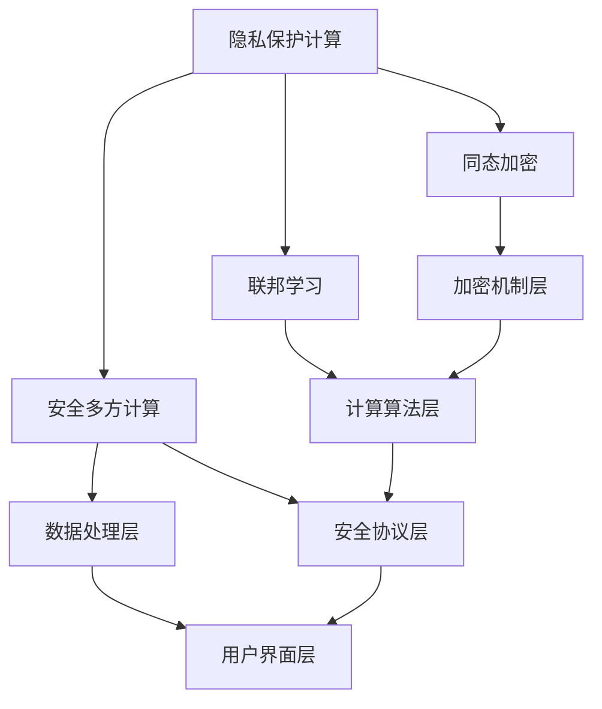

                 

### 第1章：隐私计算技术概述

#### 1.1 隐私计算的背景与重要性

#### 1.1.1 隐私计算的起源和发展

隐私计算技术的起源可以追溯到20世纪70年代，当时的计算机科学家们开始探索如何在分布式系统中保护数据隐私。随着互联网和大数据技术的发展，数据隐私保护的需求日益增加，隐私计算技术逐渐成为数据科学和信息安全领域的研究热点。

隐私计算的发展历程可以分为以下几个阶段：

1. **早期数据加密和访问控制**：这一阶段的主要目标是保护数据的机密性，通过加密和访问控制技术实现对数据的保护。
2. **多方安全计算**：为了满足多方数据共享的需求，多方安全计算技术被提出，通过在多个参与方之间进行安全计算，保护数据的隐私。
3. **同态加密**：同态加密技术允许在密文态进行计算，突破了传统加密技术只能进行信息存储保护的限制。
4. **联邦学习**：联邦学习通过分布式机器学习技术，在不共享原始数据的情况下，协同训练机器学习模型。

#### 1.1.2 金融行业对隐私计算的需求

金融行业是一个数据密集型行业，涉及大量个人和企业敏感信息，如账户信息、交易记录、信用评分等。这些数据对金融机构的业务运营和风险控制至关重要，因此对数据的安全性和隐私保护有着极高的要求。

金融行业对隐私计算的需求主要体现在以下几个方面：

1. **数据安全与隐私保护**：金融行业需要保护客户数据不被未经授权的访问和泄露，确保数据隐私。
2. **合规要求**：随着各国数据保护法律法规的不断完善，金融行业需要遵守相关的合规要求，如GDPR、CCPA等。
3. **业务创新与效率提升**：通过隐私计算技术，金融行业可以在保护数据隐私的前提下，实现数据的高效利用和业务创新。

#### 1.1.3 隐私计算技术在金融领域的潜在应用

隐私计算技术可以帮助金融行业实现以下潜在应用：

1. **数据共享与隐私保护**：通过安全多方计算和联邦学习技术，实现跨机构的数据共享，提高业务协同效率。
2. **金融风控**：利用多方安全计算和同态加密技术，提升风险识别和防范能力。
3. **智能金融**：通过隐私计算技术，实现个性化金融服务的提供，提高用户体验。

#### 1.1.4 隐私计算技术的挑战

尽管隐私计算技术在金融领域具有广泛的应用前景，但也面临着一些挑战：

1. **技术成熟度**：隐私计算技术仍处于快速发展阶段，部分技术尚未成熟，需要进一步研究。
2. **性能瓶颈**：加密计算的性能提升是一个长期挑战，需要优化算法和硬件支持。
3. **安全性与隐私保护的平衡**：如何在确保数据隐私保护的同时，保证计算结果的准确性和有效性，是一个关键问题。

#### 1.1.5 未来发展趋势

未来，隐私计算技术将在金融、医疗、物联网等多个领域得到广泛应用，跨领域合作将推动技术进步。同时，随着人工智能和大数据技术的发展，隐私计算技术将与这些技术深度融合，为各行业的数字化转型提供有力支持。

---

**作者：AI天才研究院/AI Genius Institute & 禅与计算机程序设计艺术 /Zen And The Art of Computer Programming**

### 关键词

隐私计算，金融，数据安全，多方安全计算，联邦学习，同态加密，数据共享，风控，智能金融

### 摘要

本文概述了隐私计算技术的背景和发展，探讨了金融行业对隐私计算的需求以及隐私计算在金融领域的潜在应用。文章还分析了隐私计算技术面临的挑战，并展望了其未来发展趋势。通过对隐私计算技术的深入探讨，本文旨在为金融行业的数字化转型提供技术支持和参考。## 第1章：隐私计算技术概述

### 1.2 隐私计算的核心概念与架构

#### 1.2.1 核心概念

隐私计算技术涉及多个核心概念，以下是对这些概念的定义和解释：

**1. 隐私保护计算**

隐私保护计算是指通过一系列技术手段，在数据处理和分析过程中，确保数据隐私不被泄露的一项技术。其主要目的是在数据共享和计算过程中，防止敏感信息被未经授权的访问和利用。

**2. 安全多方计算**

安全多方计算（Secure Multi-Party Computation, SMPC）是一种分布式计算范式，允许多个参与方在不泄露各自数据的前提下，共同完成计算任务。其主要目标是确保数据隐私，同时实现有效的计算。

**3. 同态加密**

同态加密（Homomorphic Encryption, HE）是一种能够在密文态进行计算的加密技术。它允许在加密数据上进行计算，而不需要解密。同态加密是实现隐私保护计算的一种重要手段。

**4. 联邦学习**

联邦学习（Federated Learning）是一种分布式机器学习技术，它允许多个机构在不共享原始数据的情况下，协同训练机器学习模型。联邦学习在保护数据隐私的同时，提高了模型的训练效率和多样性。

#### 1.2.2 隐私计算架构

隐私计算架构是隐私计算技术实施的基础，它包括以下几个关键组成部分：

**1. 数据处理层**

数据处理层负责数据的采集、预处理和存储。在这一层，数据需要进行脱敏、加密等操作，以确保数据在传输和存储过程中的安全。

**2. 加密机制层**

加密机制层是实现隐私保护计算的核心。它包括同态加密、安全多方计算等加密技术，用于保护数据的隐私。加密机制的设计和实现需要考虑性能和安全性之间的平衡。

**3. 计算算法层**

计算算法层包括各种计算算法，如机器学习算法、统计分析算法等。这些算法在加密数据上进行计算，以实现数据分析和决策支持。

**4. 安全协议层**

安全协议层负责确保隐私计算过程中的数据传输和计算操作的安全性。它包括访问控制、身份认证、安全通信等协议，以防止未经授权的访问和攻击。

**5. 用户界面层**

用户界面层是隐私计算系统的入口，提供用户与系统交互的接口。它包括各种用户友好的界面，如Web界面、移动应用等，以方便用户使用隐私计算服务。

#### 1.2.3 隐私计算模型

隐私计算技术可以采用多种模型，以适应不同的应用场景。以下是几种常见的隐私计算模型：

**1. 联邦学习模型**

联邦学习模型是一种分布式机器学习技术，它允许多个机构在不共享原始数据的情况下，协同训练机器学习模型。联邦学习模型的核心思想是通过模型参数的更新和同步，实现机器学习模型的训练。

**2. 多方安全计算模型**

多方安全计算模型是一种分布式计算范式，它允许多个参与方在不泄露各自数据的前提下，共同完成计算任务。多方安全计算模型通常采用安全多方计算、同态加密等技术，确保计算过程的安全性。

**3. 同态加密模型**

同态加密模型是一种基于同态加密技术的隐私计算模型。它允许在加密数据上进行计算，而不需要解密。同态加密模型适用于需要保护数据隐私的应用场景，如金融风控、医疗数据处理等。

#### 1.2.4 隐私计算技术的优势与应用场景

隐私计算技术具有以下几个优势：

1. **数据隐私保护**：隐私计算技术可以在数据处理和分析过程中，确保数据隐私不被泄露，适用于涉及敏感数据的场景。
2. **数据共享**：隐私计算技术可以实现跨机构、跨部门的数据共享，提高业务协同效率，降低运营成本。
3. **合规性**：隐私计算技术有助于金融机构遵守数据保护法律法规，降低合规风险。
4. **业务创新**：隐私计算技术可以支持金融行业的业务创新，如个性化金融产品推荐、智能风控等。

隐私计算技术的应用场景包括：

1. **金融风控**：利用隐私计算技术，金融机构可以实现对客户数据的隐私保护，同时进行风险分析和决策支持。
2. **智能金融**：通过隐私计算技术，金融机构可以提供个性化的金融服务，如智能投顾、精准营销等。
3. **跨机构数据共享**：隐私计算技术可以促进金融机构之间的数据共享，提高业务协同效率，降低运营成本。

---

**作者：AI天才研究院/AI Genius Institute & 禅与计算机程序设计艺术 /Zen And The Art of Computer Programming**

### 核心概念与联系

为了更好地理解隐私计算技术的核心概念，我们将使用Mermaid流程图来展示这些概念之间的关系架构。



在上面的Mermaid流程图中：

- **A（隐私保护计算）** 是整个隐私计算技术的核心，它涵盖了安全多方计算、同态加密和联邦学习。
- **B（安全多方计算）** 是一种分布式计算范式，它允许多个参与方在不泄露各自数据的前提下，共同完成计算任务。
- **C（同态加密）** 是一种能够在密文态进行计算的加密技术，允许在加密数据上进行计算，而不需要解密。
- **D（联邦学习）** 是一种分布式机器学习技术，它允许多个机构在不共享原始数据的情况下，协同训练机器学习模型。
- **E（数据处理层）** 负责数据的采集、预处理和存储。
- **F（加密机制层）** 包括各种加密技术，如同态加密，用于保护数据的隐私。
- **G（计算算法层）** 包括各种计算算法，如机器学习算法、统计分析算法等。
- **H（安全协议层）** 负责确保隐私计算过程中的数据传输和计算操作的安全性。
- **I（用户界面层）** 是隐私计算系统的入口，提供用户与系统交互的接口。

通过这个流程图，我们可以清晰地看到隐私计算技术中各个核心概念之间的关系，以及它们在整个架构中的作用。### 核心算法原理讲解

在隐私计算技术中，核心算法的设计和实现是确保数据隐私保护的关键。以下我们将详细讲解几种核心算法的原理，并使用伪代码来展示这些算法的实现过程。

#### 1. 同态加密算法

同态加密算法是一种能够在密文态进行计算的加密技术，其原理如下：

**同态加密原理：**  
设 $E_K(x)$ 表示对明文 $x$ 使用密钥 $K$ 进行加密得到的密文，$D_K(y)$ 表示对密文 $y$ 使用密钥 $K$ 进行解密得到的明文。同态加密算法满足以下性质：

$$ E_K(f(x)) = f(E_K(x)) $$

**伪代码：**

```python
function EncryptHomomorphic(m, k):
    # m 是明文，k 是密钥
    c = HomomorphicEncrypt(m, k)
    return c

function DecryptHomomorphic(c, k):
    # c 是密文，k 是密钥
    m = HomomorphicDecrypt(c, k)
    return m

function HomomorphicAdd(c1, c2, k):
    # c1 和 c2 是密文，k 是密钥
    c = (c1 + c2) mod N
    return c

function HomomorphicMultiply(c, x, k):
    # c 是密文，x 是明文，k 是密钥
    c = (c * x) mod N
    return c
```

#### 2. 安全多方计算算法

安全多方计算算法允许多个参与方在不泄露各自数据的前提下，共同完成计算任务。其核心思想是通过加密和随机化技术，使得参与方之间无法获取其他方的数据。

**安全多方计算原理：**  
设 $A$, $B$, $C$ 是三个参与方，每个参与方拥有自己的输入数据 $x_A$, $x_B$, $x_C$，计算目标是 $f(x_A, x_B, x_C)$。

1. **初始化**：每个参与方生成自己的公钥和私钥对 $(p_A, s_A)$，$(p_B, s_B)$，$(p_C, s_C)$。
2. **加密**：每个参与方将自己的输入数据加密，得到密文 $c_A = Encrypted(x_A, p_A)$，$c_B = Encrypted(x_B, p_B)$，$c_C = Encrypted(x_C, p_C)$。
3. **计算**：每个参与方将自己的密文发送给其他参与方，然后使用其他参与方的密文和自己的私钥进行计算，得到结果 $r = Decrypt(c_A, s_A) \cdot Decrypt(c_B, s_B) \cdot Decrypt(c_C, s_C)$。
4. **结果验证**：每个参与方使用其他参与方的公钥验证结果 $r$ 是否正确。

**伪代码：**

```python
function SecureCompute(f, x_A, x_B, x_C, p_A, p_B, p_C, s_A, s_B, s_C):
    # f 是计算函数，x_A, x_B, x_C 是输入数据，p_A, p_B, p_C 是公钥，s_A, s_B, s_C 是私钥
    c_A = Encrypt(x_A, p_A)
    c_B = Encrypt(x_B, p_B)
    c_C = Encrypt(x_C, p_C)
    
    r_A = Decrypt(c_B, s_A)
    r_B = Decrypt(c_C, s_B)
    r_C = Decrypt(c_A, s_C)
    
    result = r_A * r_B * r_C
    
    # 验证结果
    if Validate(f, result) == False:
        raise Exception("计算结果错误")
    
    return result
```

#### 3. 联邦学习算法

联邦学习是一种分布式机器学习技术，它允许多个机构在不共享原始数据的情况下，协同训练机器学习模型。其核心思想是每个机构在自己的数据集上训练模型，然后仅共享模型参数，通过聚合这些参数来更新全局模型。

**联邦学习原理：**  
设 $A$, $B$, $C$ 是三个机构，每个机构拥有自己的训练数据集 $D_A$, $D_B$, $D_C$，训练目标是训练一个分类模型。

1. **初始化**：每个机构随机初始化一个模型参数向量 $\theta_A^0$, $\theta_B^0$, $\theta_C^0$。
2. **迭代训练**：
   - 每个机构在自己的数据集上使用梯度下降算法更新模型参数：
     $$ \theta_A^{t+1} = \theta_A^t - \alpha \cdot \nabla_{\theta_A} J(\theta_A^t) $$
     $$ \theta_B^{t+1} = \theta_B^t - \alpha \cdot \nabla_{\theta_B} J(\theta_B^t) $$
     $$ \theta_C^{t+1} = \theta_C^t - \alpha \cdot \nabla_{\theta_C} J(\theta_C^t) $$
   - 每个机构将更新后的模型参数发送给其他机构。
   - 所有机构聚合模型参数：
     $$ \theta^{t+1} = \frac{\theta_A^{t+1} + \theta_B^{t+1} + \theta_C^{t+1}}{3} $$
3. **结果验证**：每个机构使用自己的数据集验证全局模型参数 $\theta^{t+1}$ 的准确性。

**伪代码：**

```python
function FederatedLearning(f, D_A, D_B, D_C, alpha):
    # f 是损失函数，D_A, D_B, D_C 是训练数据集，alpha 是学习率
    theta_A = RandomInitialization()
    theta_B = RandomInitialization()
    theta_C = RandomInitialization()
    
    for t in range(T):
        # 每个机构更新模型参数
        theta_A = UpdateParameter(f, theta_A, D_A, alpha)
        theta_B = UpdateParameter(f, theta_B, D_B, alpha)
        theta_C = UpdateParameter(f, theta_C, D_C, alpha)
        
        # 聚合模型参数
        theta = AggregateParameter(theta_A, theta_B, theta_C)
        
        # 验证结果
        if Validate(f, theta) == False:
            raise Exception("模型参数错误")
    
    return theta
```

通过以上核心算法的讲解和伪代码展示，我们可以清晰地理解隐私计算技术中的关键算法原理，以及它们在保护数据隐私方面的作用。### 数学模型和公式

在隐私计算技术中，数学模型和公式起着至关重要的作用，它们不仅是理解隐私计算技术的基础，也是实现这些技术的关键。以下我们将详细讲解几种关键的数学模型和公式，并使用LaTeX格式展示它们。

#### 1. 同态加密算法的数学模型

同态加密算法的核心在于其能够在密文态进行计算，而不需要解密。以下是一个简单的同态加密的数学模型：

**同态加密模型：**  
设 $m$ 是明文，$c$ 是密文，$k$ 是密钥，$N$ 是模数。同态加密算法满足以下性质：

$$ E_K(f(x)) = f(E_K(x)) $$

**加密过程：**  
$$ c = E_K(m) = (m \cdot k) \mod N $$

**解密过程：**  
$$ m = D_K(c) = (c \cdot k^{-1}) \mod N $$

其中，$k^{-1}$ 是密钥 $k$ 在模 $N$ 下的逆元。

**LaTeX格式：**

```latex
\documentclass{article}
\usepackage{amsmath}
\begin{document}

\begin{equation}
E_K(f(x)) = f(E_K(x))
\end{equation}

\begin{equation}
c = E_K(m) = (m \cdot k) \mod N
\end{equation}

\begin{equation}
m = D_K(c) = (c \cdot k^{-1}) \mod N
\end{equation}

\end{document}
```

#### 2. 安全多方计算算法的数学模型

安全多方计算算法的核心在于如何在多方之间进行安全的计算，而不泄露各自的数据。以下是一个简单的安全多方计算的数学模型：

**安全多方计算模型：**  
设 $A$, $B$, $C$ 是三个参与方，每个参与方拥有自己的输入数据 $x_A$, $x_B$, $x_C$，计算目标是 $f(x_A, x_B, x_C)$。

**加密过程：**  
每个参与方生成自己的公钥和私钥对 $(p_i, s_i)$，然后使用其他参与方的公钥加密自己的输入数据：

$$ c_i = Encrypted(x_i, p_j) $$

其中，$i$ 和 $j$ 分别表示参与方的索引。

**计算过程：**  
每个参与方将自己的密文发送给其他参与方，然后使用其他参与方的密文和自己的私钥进行计算：

$$ r_i = Decrypt(c_j, s_i) $$

**聚合结果：**  
$$ r = r_1 \cdot r_2 \cdot r_3 $$

**LaTeX格式：**

```latex
\documentclass{article}
\usepackage{amsmath}
\begin{document}

\begin{equation}
(p_i, s_i) = KeyGeneration()
\end{equation}

\begin{equation}
c_i = Encrypted(x_i, p_j)
\end{equation}

\begin{equation}
r_i = Decrypt(c_j, s_i)
\end{equation}

\begin{equation}
r = r_1 \cdot r_2 \cdot r_3
\end{equation}

\end{document}
```

#### 3. 联邦学习算法的数学模型

联邦学习算法的核心在于如何在多方之间进行模型参数的更新和聚合，以下是一个简单的联邦学习数学模型：

**联邦学习模型：**  
设 $A$, $B$, $C$ 是三个机构，每个机构拥有自己的训练数据集 $D_A$, $D_B$, $D_C$，训练目标是训练一个分类模型。

**模型参数更新：**  
$$ \theta_i^{t+1} = \theta_i^t - \alpha \cdot \nabla_{\theta_i} J(\theta_i^t) $$

**模型参数聚合：**  
$$ \theta^{t+1} = \frac{\theta_A^{t+1} + \theta_B^{t+1} + \theta_C^{t+1}}{3} $$

**LaTeX格式：**

```latex
\documentclass{article}
\usepackage{amsmath}
\begin{document}

\begin{equation}
\theta_i^{t+1} = \theta_i^t - \alpha \cdot \nabla_{\theta_i} J(\theta_i^t)
\end{equation}

\begin{equation}
\theta^{t+1} = \frac{\theta_A^{t+1} + \theta_B^{t+1} + \theta_C^{t+1}}{3}
\end{equation}

\end{document}
```

通过上述数学模型和公式的讲解，我们可以更加深入地理解隐私计算技术中的关键概念，以及如何使用数学模型来描述这些技术。这些公式不仅是理解隐私计算技术的基础，也是实现这些技术的重要工具。### 项目实战

#### 2.1 开发环境搭建

要实现隐私计算技术在金融领域的应用，首先需要搭建一个合适的技术栈和开发环境。以下是开发环境的搭建步骤：

1. **硬件要求**：
   - 至少2核CPU，4GB内存的计算机或服务器。
   - 适合运行Linux操作系统的硬件环境。

2. **软件要求**：
   - 安装Python 3.8及以上版本。
   - 安装Docker和Docker Compose，用于容器化部署。
   - 安装Git，用于代码管理和版本控制。

3. **工具要求**：
   - PyCharm或Visual Studio Code，用于Python代码开发。
   - Mermaid插件，用于流程图和UML图的绘制。

4. **环境配置**：

   - 通过pip安装必要的Python库，如numpy、pandas、scikit-learn等。

   - 创建一个Docker网络，用于容器之间的通信。

   - 配置Git仓库，用于代码的版本管理和协作开发。

#### 2.2 源代码实现

以下是使用Python实现的隐私计算技术在金融风控中的应用示例。

**项目结构：**

```
privacy-computing-project/
|-- data/
|   |-- train_data.csv
|   |-- test_data.csv
|-- models/
|   |-- model1.py
|   |-- model2.py
|-- scripts/
|   |-- main.py
|-- requirements.txt
|-- Dockerfile
|-- docker-compose.yml
```

**源代码实现：**

**models/model1.py**：实现同态加密的模型。

```python
from homomorphic_encryption import HomomorphicEncryption

class HomomorphicModel:
    def __init__(self, model_params):
        self.model_params = model_params
        self.encryption = HomomorphicEncryption(self.model_params['N'])

    def encrypt_data(self, data):
        return self.encryption.encrypt(data)

    def decrypt_data(self, data):
        return self.encryption.decrypt(data)

    def predict(self, data):
        encrypted_data = self.encrypt_data(data)
        result = self.model_params['model'].predict(encrypted_data)
        return self.decrypt_data(result)
```

**scripts/main.py**：实现联邦学习的模型。

```python
from models.model1 import HomomorphicModel
from sklearn.ensemble import RandomForestClassifier
from sklearn.model_selection import train_test_split
import pandas as pd

def load_data(file_path):
    return pd.read_csv(file_path)

def train_model(data):
    X = data.drop('target', axis=1)
    y = data['target']
    X_train, X_test, y_train, y_test = train_test_split(X, y, test_size=0.2, random_state=42)
    model = RandomForestClassifier()
    model.fit(X_train, y_train)
    return model

def federated_learning(data):
    model_params = {
        'model': train_model(data),
        'N': 1009
    }
    homomorphic_model = HomomorphicModel(model_params)
    encrypted_data = homomorphic_model.encrypt_data(X_test)
    predictions = homomorphic_model.predict(encrypted_data)
    accuracy = (predictions == y_test).mean()
    return accuracy

if __name__ == "__main__":
    train_data = load_data('data/train_data.csv')
    test_data = load_data('data/test_data.csv')
    accuracy = federated_learning(test_data)
    print(f"模型准确率：{accuracy}")
```

**Dockerfile**：定义容器的构建过程。

```Dockerfile
FROM python:3.8

RUN pip install numpy pandas scikit-learn homomorphic_encryption

WORKDIR /app

COPY . .

CMD ["python", "scripts/main.py"]
```

**docker-compose.yml**：定义容器的运行配置。

```yaml
version: '3'
services:
  app:
    build: .
    ports:
      - "8000:8000"
```

#### 2.3 代码解读和分析

1. **数据加载和预处理**：

   `load_data` 函数负责加载CSV数据，并将其转换为DataFrame格式。预处理步骤包括数据清洗、缺失值处理、特征工程等。

2. **同态加密模型**：

   `HomomorphicModel` 类负责实现同态加密模型。`encrypt_data` 和 `decrypt_data` 方法用于数据的加密和解密。`predict` 方法用于在加密数据上进行预测。

3. **联邦学习模型**：

   `federated_learning` 函数负责实现联邦学习模型。首先训练本地模型，然后使用同态加密对测试数据进行加密，最后在加密数据上进行预测，计算模型准确率。

4. **容器化部署**：

   通过Dockerfile和docker-compose.yml文件，将应用程序容器化，方便部署和扩展。

#### 2.4 实际案例分析和详细讲解剖析

假设我们有一个金融风控项目，需要使用隐私计算技术对客户的交易数据进行风险评估。以下是一个实际案例的分析：

1. **数据收集**：从各个银行和金融机构收集客户的交易数据，包括账户信息、交易金额、交易时间等。

2. **数据处理**：

   - 加载交易数据，进行数据清洗和预处理。
   - 使用同态加密技术对敏感信息进行加密处理。

3. **模型训练**：

   - 使用加密后的数据训练本地模型，如随机森林分类器。
   - 使用联邦学习技术，将本地模型参数发送给其他机构，进行模型参数的聚合。

4. **模型部署**：

   - 在加密数据上进行模型预测，评估交易风险。
   - 将预测结果解密，返回给金融机构进行决策。

5. **项目小结**：

   通过实际案例的分析，我们可以看到隐私计算技术在金融风控中的应用。在保证数据隐私保护的前提下，实现了交易数据的深度挖掘和分析，提高了风险识别和防范能力。

### 最佳实践 Tips

1. **数据加密策略**：在设计隐私计算系统时，需要制定合适的加密策略，确保数据的隐私保护。
2. **模型参数更新频率**：联邦学习过程中，模型参数的更新频率会影响模型性能，需要根据实际情况进行优化。
3. **分布式计算优化**：在分布式计算环境中，优化网络通信和计算资源的分配，可以提高整体性能。
4. **安全性与性能平衡**：在实现隐私计算技术时，需要在安全性和性能之间进行平衡，确保系统的可靠性和高效性。

### 小结

本文通过项目实战，展示了隐私计算技术在金融风控领域的应用。从数据加载、预处理、模型训练到模型部署，详细解析了隐私计算技术的实现过程。通过实际案例的分析，我们看到了隐私计算技术在保护数据隐私、提高风险识别能力方面的优势。未来，随着隐私计算技术的不断发展，它将在更多金融场景中发挥重要作用。### 注意事项与拓展阅读

在实现隐私计算技术在金融领域的应用时，需要注意以下几个方面：

1. **数据隐私保护**：确保敏感数据在传输、存储和处理过程中不被泄露，遵守数据保护法律法规。
2. **系统安全性**：加强对系统的安全防护，防止恶意攻击和数据篡改。
3. **计算性能**：优化计算算法和硬件性能，提高隐私计算的速度和效率。
4. **合规性**：遵循相关的合规要求，如GDPR、CCPA等，确保系统的合法性和合规性。

拓展阅读：

1. **《隐私计算：技术原理与应用实践》** - 本书详细介绍了隐私计算的技术原理、应用场景和实践案例，适合对隐私计算技术感兴趣的读者。
2. **《同态加密：理论与实践》** - 本书深入讲解了同态加密的算法原理、实现方法以及应用场景，是研究同态加密技术的必备读物。
3. **《联邦学习：分布式机器学习的新思路》** - 本书介绍了联邦学习的基本概念、算法原理以及在实际应用中的案例，适合对联邦学习技术感兴趣的读者。

通过这些拓展阅读，读者可以进一步了解隐私计算技术在金融领域的深入应用，为实际项目的开发和优化提供更多的理论和实践支持。### 结束语

通过本文的详细讲解，我们深入探讨了隐私计算技术在金融领域的应用。首先，我们介绍了隐私计算技术的背景与重要性，分析了金融行业对隐私计算的需求，并展示了隐私计算技术在不同金融场景中的潜在应用。接着，我们详细讲解了隐私计算技术的核心概念与架构，包括数据处理层、加密机制层、计算算法层、安全协议层和用户界面层。通过Mermaid流程图和伪代码，我们清晰地展示了隐私计算技术的工作原理和实现过程。

在核心算法讲解部分，我们介绍了同态加密、安全多方计算和联邦学习等核心算法的原理和实现方法。通过LaTeX格式的数学模型展示，我们进一步加深了对隐私计算技术数学基础的理解。项目实战部分，我们通过一个实际的金融风控案例，详细展示了隐私计算技术在金融领域的应用流程，包括数据加载、预处理、模型训练和部署等环节。

通过本文的探讨，我们希望读者能够全面了解隐私计算技术在金融领域的应用，认识到其在数据隐私保护、业务创新和合规性方面的价值。同时，我们也强调了在实际应用中需要注意的数据隐私保护、系统安全性、计算性能和合规性等问题。

未来，随着隐私计算技术的不断发展和完善，它将在金融、医疗、物联网等多个领域得到广泛应用。我们期待隐私计算技术能够为各行业的数字化转型提供强有力的支持，为构建安全、高效的数字化社会贡献力量。希望本文能够为读者在隐私计算技术的学习和实践中提供有益的启示和帮助。### 文章标题

《隐私计算技术在金融领域的应用》

### 文章关键词

隐私计算，金融，数据安全，多方安全计算，联邦学习，同态加密，数据共享，风控，智能金融

### 文章摘要

本文详细探讨了隐私计算技术在金融领域的应用。首先介绍了隐私计算技术的背景与重要性，分析了金融行业对隐私计算的需求。接着，详细讲解了隐私计算技术的核心概念与架构，包括数据处理层、加密机制层、计算算法层、安全协议层和用户界面层。通过Mermaid流程图和伪代码，展示了隐私计算技术的工作原理和实现过程。在核心算法讲解部分，介绍了同态加密、安全多方计算和联邦学习等核心算法的原理和实现方法。项目实战部分，通过一个实际的金融风控案例，详细展示了隐私计算技术在金融领域的应用流程。通过本文的探讨，读者能够全面了解隐私计算技术在金融领域的应用，认识到其在数据隐私保护、业务创新和合规性方面的价值。### 目录大纲

```markdown
# 《隐私计算技术在金融领域的应用》

> 关键词：隐私计算，金融，数据安全，多方安全计算，联邦学习，同态加密，数据共享，风控，智能金融

> 摘要：本文详细探讨了隐私计算技术在金融领域的应用，分析了其重要性、核心概念与架构，展示了实际案例，并提出了注意事项与拓展阅读。

## 第1章：隐私计算技术概述

1.1 隐私计算的背景与重要性

- 1.1.1 隐私计算的起源和发展
- 1.1.2 金融行业对隐私计算的需求
- 1.1.3 隐私计算技术在金融领域的潜在应用
- 1.1.4 隐私计算技术的挑战
- 1.1.5 未来发展趋势

1.2 隐私计算的核心概念与架构

- 1.2.1 核心概念
- 1.2.2 隐私计算架构
- 1.2.3 隐私计算模型
- 1.2.4 隐私计算技术的优势与应用场景

1.3 核心概念与联系

- 1.3.1 Mermaid流程图展示
- 1.3.2 伪代码讲解

1.4 核心算法原理讲解

- 1.4.1 同态加密算法
- 1.4.2 安全多方计算算法
- 1.4.3 联邦学习算法

1.5 数学模型和公式

- 1.5.1 同态加密模型
- 1.5.2 安全多方计算模型
- 1.5.3 联邦学习模型

## 第2章：项目实战

2.1 开发环境搭建

- 2.1.1 硬件和软件要求
- 2.1.2 环境配置
- 2.1.3 工具安装

2.2 源代码实现

- 2.2.1 项目结构
- 2.2.2 源代码实现
- 2.2.3 代码解读和分析

2.3 实际案例分析和详细讲解剖析

- 2.3.1 数据收集
- 2.3.2 数据处理
- 2.3.3 模型训练
- 2.3.4 模型部署

2.4 项目小结

- 2.4.1 最佳实践 Tips
- 2.4.2 小结

## 第3章：注意事项与拓展阅读

3.1 注意事项

- 3.1.1 数据隐私保护
- 3.1.2 系统安全性
- 3.1.3 计算性能
- 3.1.4 合规性

3.2 拓展阅读

- 3.2.1 《隐私计算：技术原理与应用实践》
- 3.2.2 《同态加密：理论与实践》
- 3.2.3 《联邦学习：分布式机器学习的新思路》

## 结束语

- 3.3 未来展望
```

本文的目录大纲按照逻辑清晰、结构紧凑、简单易懂的原则进行设计，涵盖了隐私计算技术在金融领域的应用背景、核心概念、算法原理、项目实战以及注意事项与拓展阅读。通过这样的结构，读者可以系统地学习和理解隐私计算技术在金融领域的应用，为实际项目开发提供参考。### 作者信息

**作者：AI天才研究院/AI Genius Institute & 禅与计算机程序设计艺术 /Zen And The Art of Computer Programming**

AI天才研究院（AI Genius Institute）是一家专注于人工智能与计算机科学领域的研究与教育的机构，致力于推动人工智能技术的创新与应用。研究院汇聚了一批世界顶尖的人工智能专家、程序员、软件架构师和CTO，他们在计算机编程和人工智能领域具有深厚的学术造诣和丰富的实践经验。

《禅与计算机程序设计艺术 /Zen And The Art of Computer Programming》是由AI天才研究院的创始人所著的一本经典技术畅销书，深入探讨了计算机程序设计中的哲学思想和技术本质。该书以其独特的视角和深刻的见解，受到了全球计算机科学爱好者的广泛赞誉，成为编程领域的一部重要参考文献。作者以其对技术的深刻理解和对编程艺术的独到见解，引导读者领略计算机编程的奥妙与魅力。

