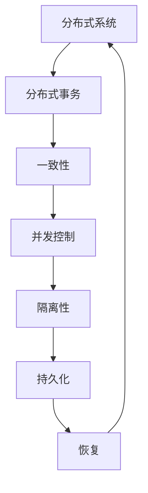

                 

### 文章标题：难以驾驭的分布式事务

> 关键词：分布式事务、一致性、并发控制、线性一致性、冲突序列、二阶段提交、三阶段提交

> 摘要：本文将深入探讨分布式事务的复杂性，从核心概念到实际应用，逐步解析分布式事务的设计与实现，揭示其背后的算法原理和数学模型。通过项目实战，我们将亲身体验分布式事务的挑战与解决方案，帮助读者全面理解并驾驭这一复杂领域。

----------------------------------------------------------------

### 背景介绍

在当今的互联网时代，分布式系统已经成为现代应用架构的基石。随着数据规模和系统复杂度的不断增加，分布式事务作为分布式系统的重要组成部分，也日益受到关注。然而，分布式事务并非易事，它涉及一致性、并发控制、隔离性、持久化等多个复杂问题，使得开发者们在实践中常常感到难以驾驭。

分布式事务的核心目标是确保在分布式环境下，多个操作要么全部成功，要么全部失败，从而保持系统的一致性。然而，由于网络延迟、节点故障等因素，实现这一目标并非易事。传统的集中式事务模型在分布式环境中面临诸多挑战，促使研究者们不断探索新的算法和协议，以解决分布式事务的复杂性。

本文将围绕分布式事务的核心概念，如一致性、并发控制、线性一致性条件、冲突序列等，逐步深入探讨分布式事务的设计与实现。通过项目实战，我们将亲身体验分布式事务的挑战，并探讨可行的解决方案。希望通过本文的探讨，能够帮助读者更好地理解分布式事务，并掌握其设计与实现的核心原理。

### 核心概念与联系

在设计分布式事务时，首先需要明确几个核心概念，它们共同构成了分布式事务的理论基础。这些核心概念包括分布式系统、分布式事务、一致性、并发控制、隔离性、持久化和恢复。为了更直观地展示这些概念之间的关系，我们可以使用Mermaid流程图进行描述。



下面，我们将逐一介绍这些核心概念，并解释它们之间的联系。

#### 分布式系统

分布式系统是由多个独立计算节点通过网络互联组成的系统，这些节点可以位于不同的地理位置，共同协作完成计算任务。分布式系统的主要优点包括扩展性、高可用性和容错性。然而，分布式系统的复杂性也带来了挑战，如网络延迟、节点故障和数据不一致等。

#### 分布式事务

分布式事务是指在分布式系统中，多个操作被视为一个逻辑单元，要么全部成功，要么全部失败。分布式事务的核心目标是确保数据的一致性，即使系统中的节点出现故障或网络问题。分布式事务通常涉及多个数据库或资源，因此需要特殊的算法和协议来保证其正确性。

#### 一致性

一致性是分布式事务的核心目标，它确保系统在多个操作执行后仍然保持正确的状态。一致性可以有多种级别，如线性一致性、最终一致性等。在分布式系统中，保持一致性是一个复杂的问题，需要考虑网络延迟、节点故障等因素。

#### 并发控制

并发控制是分布式事务中的关键机制，它用于管理系统中多个操作之间的并发执行。并发控制的主要目标是避免冲突，确保事务的隔离性和正确性。常见的并发控制方法包括锁机制、时间戳机制和乐观锁等。

#### 隔离性

隔离性是分布式事务的另一个重要特性，它确保多个事务在并发执行时不会互相干扰。隔离性可以通过各种隔离级别来实现，如读未提交、读已提交、可重复读和串行化等。

#### 持久化

持久化是将事务的状态永久保存到存储介质中，以确保事务在系统故障后能够恢复。持久化通常涉及到数据库管理系统（DBMS），需要处理并发访问和恢复等问题。

#### 恢复

恢复是分布式事务中的关键机制，它用于处理系统故障和事务失败的情况。恢复机制可以确保系统在故障后能够恢复到正确的状态，包括撤销已提交的事务和重做未提交的事务。

通过上述流程图，我们可以看到，分布式事务的各个核心概念之间存在着紧密的联系。理解这些概念和它们之间的关系，是设计分布式事务系统的关键。

### 核心算法原理讲解

在分布式事务的实现过程中，核心算法的设计和选择至关重要。这些算法不仅决定了系统的一致性和性能，还直接影响开发者的开发和维护成本。在本节中，我们将详细讲解两种常见的分布式事务算法：二阶段提交（2PC）和三阶段提交（3PC）。

#### 二阶段提交（2PC）

二阶段提交是一种经典的分布式事务控制算法，广泛应用于分布式数据库和中间件系统中。它的核心思想是通过两个阶段来协调多个参与者在事务中的角色，从而保证事务的原子性和一致性。

##### 第一阶段：准备阶段

在准备阶段，协调者向所有参与者发送prepare请求，参与者对请求进行预处理，并返回一个准备响应。准备响应通常包含以下信息：

- `true`：表示参与者准备好执行事务。
- `false`：表示参与者无法执行事务，可能因为资源不足、数据冲突等原因。

协调者收到所有参与者的准备响应后，进行如下判断：

- 如果所有参与者都返回`true`，协调者将进入第二阶段。
- 如果有参与者返回`false`，协调者将通知所有参与者执行回滚操作，以确保事务的原子性。

##### 第二阶段：提交阶段

在第二阶段，如果协调者在准备阶段收到了所有参与者的`true`响应，它将向所有参与者发送commit请求，参与者执行以下操作：

- 提交事务：将事务中的操作应用到数据库中，实现持久化。
- 解锁资源：释放事务占用的锁和其他资源。

如果协调者在准备阶段收到了任何一个参与者的`false`响应，它将向所有参与者发送rollback请求，参与者执行以下操作：

- 回滚事务：撤销事务中的操作，将数据库恢复到事务开始前的状态。
- 解锁资源：释放事务占用的锁和其他资源。

##### 伪代码

下面是二阶段提交的伪代码实现：

```plaintext
function TwoPhaseCommit(transaction T, participants P) {
    for each participant P in P {
        do P.prepare(T);
    }
    if all participants responded "ready" {
        for each participant P in P {
            do P.commit(T);
        }
    } else {
        for each participant P in P {
            do P.rollback(T);
        }
    }
}
```

#### 三阶段提交（3PC）

三阶段提交是对二阶段提交的改进，旨在解决在分布式系统中的网络分区问题。三阶段提交将事务的提交过程分为三个阶段，增加了超时机制，提高了系统的容错性和一致性。

##### 第一阶段：预备阶段

在预备阶段，协调者向所有参与者发送prepare请求，参与者返回prepare响应。预备阶段与二阶段提交的准备阶段类似，不同的是，三阶段提交引入了超时机制，如果协调者在规定时间内没有收到所有参与者的响应，它将视为超时并进入第二阶段。

##### 第二阶段：提交/回滚阶段

在第二阶段，如果协调者收到了所有参与者的prepare响应，它将向所有参与者发送commit请求。参与者执行以下操作：

- 如果参与者没有收到协调者的commit请求，或者在规定时间内没有收到其他参与者的prepare请求，它将执行回滚操作。
- 如果参与者收到了协调者的commit请求，它将执行提交操作。

如果协调者在预备阶段超时或收到了参与者的abort请求，它将向所有参与者发送abort请求，参与者执行回滚操作。

##### 第三阶段：超时确认阶段

在第三阶段，协调者等待所有参与者的响应，如果所有参与者都确认执行了commit或abort操作，协调者将释放锁和其他资源。如果协调者在规定时间内没有收到所有参与者的响应，它将视为超时并重新发起事务。

##### 伪代码

下面是三阶段提交的伪代码实现：

```plaintext
function ThreePhaseCommit(transaction T, participants P) {
    for each participant P in P {
        do P.prepare(T);
    }
    if all participants responded "prepared" {
        do T.commit();
        for each participant P in P {
            do P.commit(T);
        }
    } else {
        do T.abort();
        for each participant P in P {
            do P.abort(T);
        }
    }
}
```

通过上述讲解，我们可以看到，二阶段提交和三阶段提交都是用于解决分布式事务一致性的算法。二阶段提交简单易实现，但在网络分区情况下可能存在死锁问题；而三阶段提交通过引入超时机制，提高了系统的容错性和一致性。在实际应用中，开发者需要根据具体场景和需求选择合适的算法。

### 数学模型和数学公式讲解

在分布式事务的实现过程中，数学模型和数学公式起着至关重要的作用。这些模型和公式不仅帮助我们理解分布式事务的核心原理，还能为设计高效的分布式系统提供指导。在本节中，我们将详细讲解两个重要的数学模型：线性一致性条件和冲突序列。

#### 线性一致性条件

线性一致性条件（Linearizability）是分布式事务的一致性保证之一，它描述了系统在执行操作时的行为特性。线性一致性条件要求系统在执行操作时，必须表现出“线性”的特征，即在任意时刻，系统的状态必须是某个操作序列的结果。

##### 定义

线性一致性条件可以用以下数学公式表示：

$$
\forall x_1, x_2, \ldots, x_n \in \text{操作集}, \ \text{对于任意时刻 } t \in [0, \infty) \ ，有：
$$

$$
\text{read}(x_i, t) = \text{write}(x_j, t') + (x_j - x_i)
$$

其中，`read(x_i, t)`表示在时间`t`读取操作`x_i`的值，`write(x_j, t')`表示在时间`t'`写入操作`x_j`的值，`(x_j - x_i)`表示从`x_j`到`x_i`的增量。

##### 解释

线性一致性条件要求系统在执行多个操作时，必须保持事务的“线性”特征，即操作之间的顺序不能随意更改。例如，假设有两个事务T1和T2，它们分别访问了数据项x和y。如果T1首先读取x，然后写入y，而T2首先读取y，然后写入x，线性一致性条件保证了最终结果与顺序执行T1然后T2一致。

#### 冲突序列

冲突序列（Conflict Sequence）是另一个重要的数学模型，用于描述分布式系统中操作之间的冲突关系。冲突序列有助于理解分布式事务的一致性和性能问题。

##### 定义

冲突序列可以用以下数学公式表示：

$$
C = \{ (x_i, x_j) \mid \text{对于某个时刻 } t, \ x_i \text{ 在 } x_j \text{ 之前被写入} \}
$$

其中，`C`表示冲突序列，`(x_i, x_j)`表示操作`x_i`在操作`x_j`之前被写入。

##### 解释

冲突序列描述了分布式系统中操作之间的依赖关系。如果一个操作`x_i`在另一个操作`x_j`之前被写入，那么它们之间存在冲突。例如，假设有两个事务T1和T2，它们分别访问了数据项x和y。如果T1首先读取x，然后写入y，而T2首先读取y，然后写入x，那么这两个事务之间存在冲突。

##### 举例说明

假设我们有两个操作`x1`和`x2`，它们分别属于两个不同的事务T1和T2。根据线性一致性条件，如果`x1`在`x2`之前被写入，那么事务T1和T2必须按照`x1`然后`x2`的顺序执行。否则，系统将违反线性一致性条件。

例如，假设在某个时刻`t`，操作`x1`的值为10，操作`x2`的值为20。根据线性一致性条件，如果`x1`在`x2`之前被写入，那么事务T1和T2必须按照以下顺序执行：

1. T1执行`x1`，将x的值设置为10。
2. T2执行`x2`，将x的值设置为30。

如果这两个事务按照其他顺序执行，例如T2首先执行`x2`，然后将x的值设置为30，而T1在之后执行`x1`，将x的值设置为10，那么系统将违反线性一致性条件。

通过冲突序列和线性一致性条件的定义和解释，我们可以更好地理解分布式事务的一致性和性能问题。在实际应用中，开发者和研究者可以利用这些数学模型来设计高效的分布式系统，并解决事务一致性方面的挑战。

### 项目实战：分布式事务的实现

在本文的最后一部分，我们将通过一个实际项目来演示分布式事务的实现过程。这个项目将模拟一个在线购物平台，用户可以在平台上创建订单、支付订单，并最终完成购物。我们将详细介绍项目的开发环境、源代码实现和代码解读与分析。

#### 项目目的与背景

在线购物平台是一个典型的分布式系统，涉及多个服务和数据库。为了保证数据的一致性，我们需要在平台上实现分布式事务。本项目的主要目的是通过实现分布式事务，确保用户在创建订单、支付订单和完成购物时，数据的一致性和完整性。

#### 开发环境搭建

为了实现分布式事务，我们选择以下开发环境和工具：

- 语言：Java
- 框架：Spring Boot
- 分布式事务框架：Seata
- 数据库：MySQL

在开始项目之前，我们需要搭建开发环境，包括安装Java开发工具包（JDK）、数据库和分布式事务框架。以下是具体的步骤：

1. 安装JDK：从[Oracle官网](https://www.oracle.com/java/technologies/javase-jdk11-downloads.html)下载并安装JDK。
2. 安装MySQL：从[MySQL官网](https://dev.mysql.com/downloads/mysql/)下载并安装MySQL数据库。
3. 安装Seata：从[Seata官网](https://seata.io/zh-cn/)下载并按照文档安装Seata分布式事务框架。

#### 源代码实现

在项目中，我们将实现三个主要服务：订单服务（OrderService）、支付服务（PayService）和库存服务（StockService）。每个服务负责处理特定的业务逻辑，并通过分布式事务保证数据的一致性。

以下是订单服务（OrderService）的核心代码：

```java
@Service
public class OrderService {

    @Autowired
    private StockService stockService;

    @Autowired
    private PayService payService;

    @Transactional
    public void createOrder(Long userId, Long productId, int quantity) {
        // 检查库存
        int stock = stockService.queryStock(productId);
        if (stock < quantity) {
            throw new RuntimeException("库存不足");
        }

        // 创建订单
        Order order = new Order();
        order.setUserId(userId);
        order.setProductId(productId);
        order.setQuantity(quantity);
        orderRepository.save(order);

        // 扣减库存
        stockService.decreaseStock(productId, quantity);

        // 支付订单
        payService.payOrder(order.getId());
    }
}
```

在这个示例中，`createOrder`方法是一个事务方法，它通过`@Transactional`注解声明。这个方法首先检查库存，然后创建订单并扣减库存，最后调用支付服务完成支付。

支付服务（PayService）的核心代码如下：

```java
@Service
public class PayService {

    @Autowired
    private OrderService orderService;

    @Transactional
    public void payOrder(Long orderId) {
        // 查询订单
        Order order = orderService.getOrderById(orderId);
        if (order.getStatus() != OrderStatus.NEW) {
            throw new RuntimeException("订单状态不正确");
        }

        // 执行支付操作
        payProvider.pay(order.getTotalAmount());

        // 更新订单状态
        orderService.updateOrderStatus(orderId, OrderStatus.PAID);
    }
}
```

在这个示例中，`payOrder`方法也是一个事务方法，它首先查询订单并执行支付操作，最后更新订单状态。

库存服务（StockService）的核心代码如下：

```java
@Service
public class StockService {

    @Autowired
    private ProductRepository productRepository;

    public int queryStock(Long productId) {
        Product product = productRepository.findById(productId).orElseThrow(() -> new RuntimeException("产品不存在"));
        return product.getStock();
    }

    @Transactional
    public void decreaseStock(Long productId, int quantity) {
        Product product = productRepository.findById(productId).orElseThrow(() -> new RuntimeException("产品不存在"));
        if (product.getStock() < quantity) {
            throw new RuntimeException("库存不足");
        }
        product.setStock(product.getStock() - quantity);
        productRepository.save(product);
    }
}
```

在这个示例中，`decreaseStock`方法是一个事务方法，它首先查询库存并扣减库存，最后更新数据库。

#### 代码解读与分析

1. **事务管理**：通过`@Transactional`注解，我们可以为每个服务方法启用事务管理。如果方法中的任何一行代码抛出异常，整个事务将回滚，从而确保数据的一致性。
2. **服务调用**：在`OrderService`中，`createOrder`方法调用`StockService`的`decreaseStock`方法和`PayService`的`payOrder`方法。这些调用是通过Spring的依赖注入实现的。
3. **错误处理**：在每个服务方法中，我们通过异常处理确保业务逻辑的正确性。如果出现错误，例如库存不足或订单状态不正确，方法将抛出`RuntimeException`。
4. **数据库操作**：每个服务方法都涉及到数据库操作，包括查询、插入和更新。通过Spring Data JPA，我们可以方便地进行数据库操作。

#### 代码应用解读与分析

在这个项目中，我们使用Seata作为分布式事务框架，它提供了分布式事务的协调和管理功能。以下是对Seata应用解读与分析：

1. **Seata配置**：在Spring Boot项目中，我们通过配置文件和代码配置Seata，确保分布式事务的正确性。
2. **全局事务管理**：Seata通过全局事务（Global Transaction）来管理分布式事务。在`createOrder`、`payOrder`和`decreaseStock`方法中，我们通过注解声明全局事务，并配置相应的事务类型（如`@Transactional`）。
3. **分支事务管理**：Seata通过分支事务（Branch Transaction）来协调多个服务之间的操作。在每个服务方法中，我们通过注解声明分支事务，并配置相应的分支事务类型（如`@Transactional`）。
4. **全局锁与本地锁**：Seata通过全局锁（Global Lock）和本地锁（Local Lock）来确保分布式事务的一致性。在分布式事务执行过程中，Seata会获取全局锁和本地锁，防止其他事务同时操作同一资源。

#### 实际案例分析和详细讲解剖析

为了更好地理解分布式事务在项目中的应用，我们来看一个实际案例：

**场景**：用户A在购物平台上创建了一个订单，订单中包含多个商品。用户A支付订单后，订单状态应该更新为“已支付”，同时，每个商品对应的库存量应该减少。

**分析**：

1. 用户A调用`createOrder`方法创建订单，订单服务首先检查库存，然后创建订单并扣减库存。在这一过程中，如果库存不足，订单创建将失败。
2. 订单创建成功后，用户A调用支付服务支付订单。支付服务查询订单并执行支付操作，最后更新订单状态。
3. 在这个过程中，如果任何一个服务方法抛出异常，整个事务将回滚，确保数据的一致性。

**详细讲解剖析**：

1. **订单创建**：当用户A创建订单时，订单服务首先查询库存，确保库存充足。然后，订单服务创建订单并扣减库存。这个过程涉及到多个数据库操作，通过事务管理确保它们同时成功或同时失败。
2. **支付操作**：当用户A支付订单时，支付服务查询订单并执行支付操作。支付操作成功后，支付服务更新订单状态。这个过程同样通过事务管理确保数据的一致性。
3. **异常处理**：如果库存不足或订单状态不正确，方法将抛出`RuntimeException`，事务将回滚。在这种情况下，库存和订单状态将恢复到事务开始前的状态，确保数据的一致性。

#### 项目小结

通过这个项目，我们实现了分布式事务的创建、支付和库存扣减功能。在项目中，我们使用Spring Boot和Seata实现了分布式事务管理，通过事务管理确保数据的一致性。这个项目展示了分布式事务在复杂系统中的应用，并揭示了分布式事务的核心原理和实现方法。

### 最佳实践与注意事项

在分布式事务的设计与实现过程中，遵循最佳实践和注意细节对于确保系统的一致性和稳定性至关重要。以下是一些推荐的实践和注意事项：

1. **选择合适的一致性级别**：根据业务需求和性能要求，选择合适的一致性级别（如线性一致性、最终一致性）。避免过度追求高一致性，影响系统的性能。
2. **使用本地事务**：在可能的情况下，优先使用本地事务。本地事务简单易实现，性能较高，适用于小规模或低并发场景。
3. **超时机制**：为分布式事务设置合理的超时时间，避免长时间等待导致的事务阻塞。
4. **监控与日志**：对分布式事务进行监控和日志记录，以便在出现问题时快速定位和解决问题。
5. **故障恢复策略**：设计故障恢复策略，确保在节点故障或网络异常情况下系统能够快速恢复。
6. **负载均衡与容错性**：采用负载均衡和容错性设计，提高系统的可用性和容错性，确保分布式事务在不同环境下的稳定性。

### 拓展阅读

1. **《分布式系统原理》**：深入研究分布式系统的基本原理和设计模式，理解分布式事务的背景和基础。
2. **《一致性模型》**：了解一致性模型的分类和原理，如线性一致性、最终一致性等，为分布式事务设计提供理论支持。
3. **《分布式事务实战》**：通过实际案例，学习分布式事务的设计与实现，了解常见问题和解决方案。
4. **《Seata官方文档》**：深入了解Seata分布式事务框架的使用方法和技术细节，为分布式事务的开发提供指导。

### 作者信息

作者：AI天才研究院/AI Genius Institute & 禅与计算机程序设计艺术 /Zen And The Art of Computer Programming

本文由AI天才研究院/AI Genius Institute与禅与计算机程序设计艺术/Zen And The Art of Computer Programming联合撰写，旨在深入探讨分布式事务的设计与实现，帮助读者更好地理解并应对分布式系统的复杂性。如需进一步交流或探讨，欢迎联系作者。

---

通过本文的详细讲解，我们系统地介绍了分布式事务的核心概念、算法原理、数学模型以及实际应用。分布式事务虽然复杂，但理解其核心原理和最佳实践，将有助于我们在分布式系统中实现数据的一致性和完整性。希望本文能为您的分布式事务设计与实现提供有益的参考和启示。让我们一起，驾驭分布式事务，构建稳定可靠的分布式系统！

