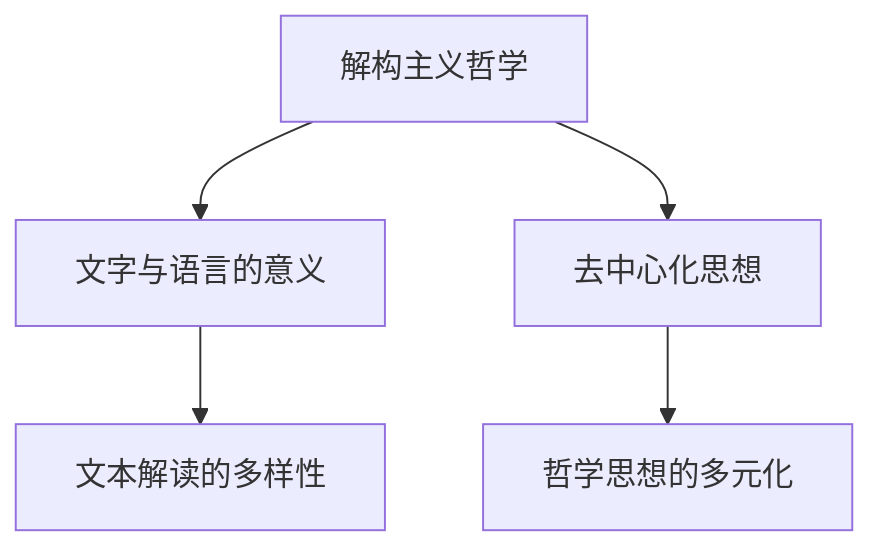
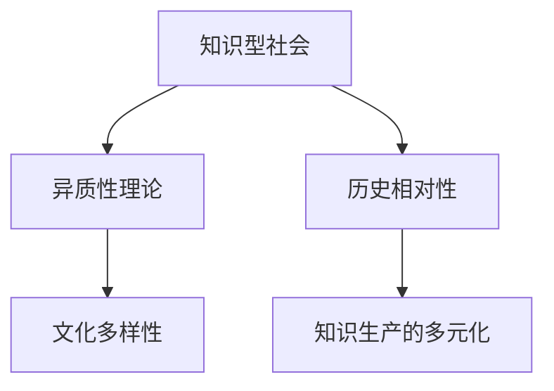
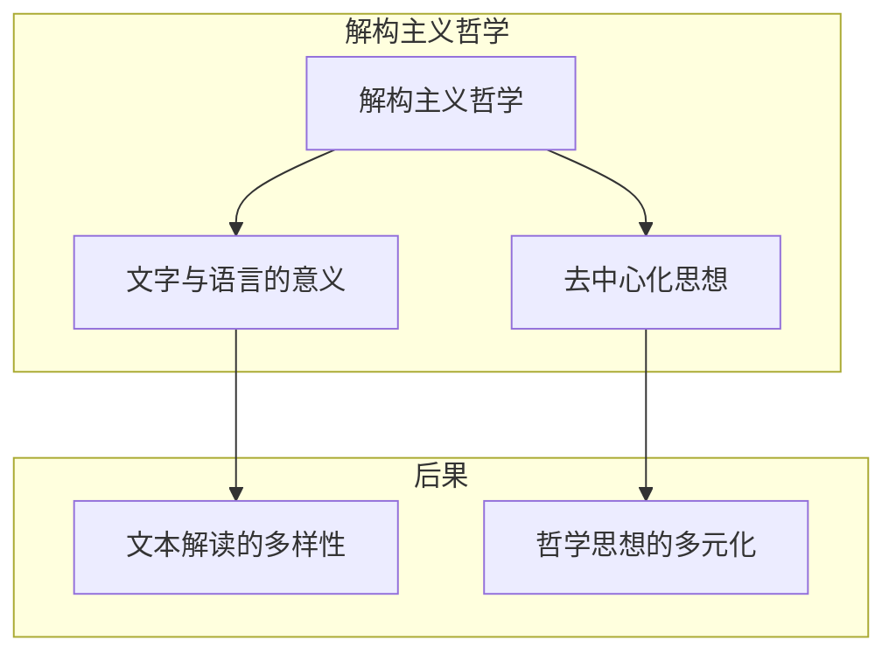
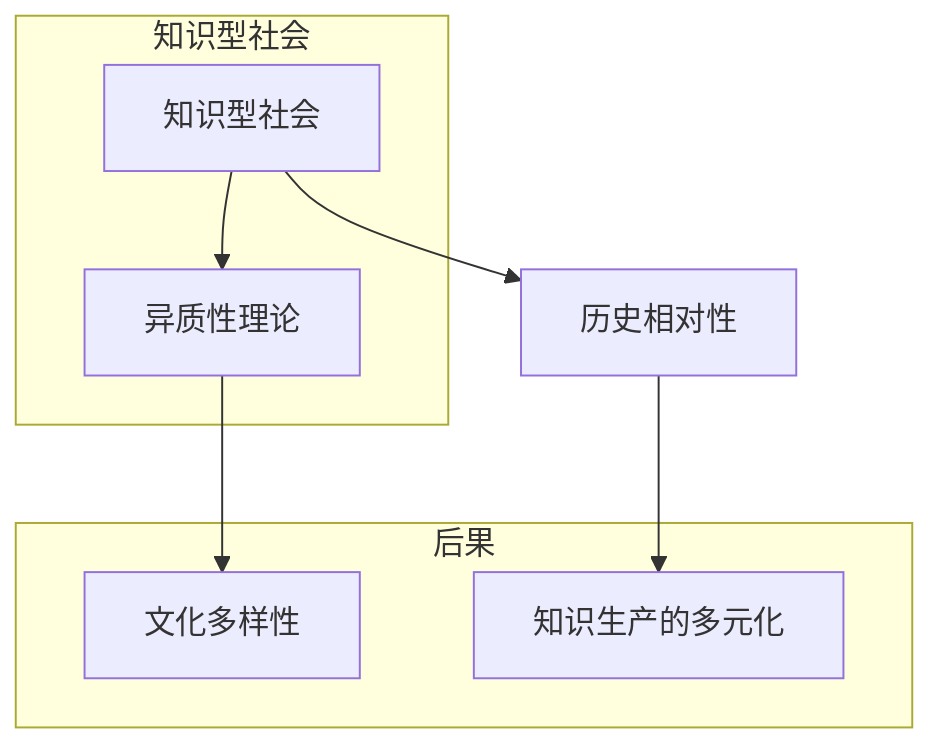

                 

### 文章标题：雅克·德里达与让-弗朗索瓦·利奥塔：后结构主义的核心思想

#### 关键词：后结构主义，雅克·德里达，让-弗朗索瓦·利奥塔，解构主义，文本解读，知识型社会

#### 摘要：本文将深入探讨后结构主义两位杰出思想家——雅克·德里达与让-弗朗索瓦·利奥塔的核心思想。通过解析他们的理论，我们将了解后结构主义对文学、艺术、科学研究以及社会理论的影响，并展望其未来在学术研究中的重要作用。

### 目录大纲

#### 1. 雅克·德里达与让-弗朗索瓦·利奥塔：后结构主义的核心思想

##### 1.1 引言

###### 1.1.1 后结构主义的兴起

###### 1.1.2 德里达与利奥塔的思想影响

##### 1.2 德里达的核心概念

###### 1.2.1 解构主义哲学

###### 1.2.2 文字与语言的意义

###### 1.2.3 去中心化思想

###### 1.2.4 核心概念流程图

**Mermaid 流程图：**


##### 1.3 利奥塔的核心概念

###### 1.3.1 知识型社会

###### 1.3.2 异质性理论

###### 1.3.3 历史相对性

###### 1.3.4 核心概念流程图

**Mermaid 流程图：**


##### 1.4 德里达与利奥塔思想的联系与比较

###### 1.4.1 共同点分析

###### 1.4.2 差异点分析

###### 1.4.3 对后结构主义发展的意义

##### 1.5 后结构主义对当代社会的影响

###### 1.5.1 文学、艺术领域的变革

###### 1.5.2 科学研究方法的改变

###### 1.5.3 社会理论的发展

##### 1.6 结论

###### 1.6.1 德里达与利奥塔思想的未来展望

###### 1.6.2 后结构主义对学术研究的影响

**伪代码：**
```
function analyze_poststructuralism() {
    // 分析德里达与利奥塔的核心概念
    deconstruction = {
        "philosophy": "deconstructionism",
        "meaning": "text and language",
        "decentralization": "decentralized thought"
    };
    
    postmodern = {
        "society": "knowledge society",
        "heterogeneity": "heterogeneity theory",
        "relativity": "historical relativity"
    };
    
    // 比较两者的共同点与差异
    common_points = compare(deconstruction, postmodern);
    differences = compare(deconstruction, postmodern, true);
    
    // 总结后结构主义的影响
    impact = {
        "literature": "literary and artistic changes",
        "research": "changes in scientific research methods",
        "social_theory": "development of social theories"
    };
    
    print(common_points);
    print(differences);
    print(impact);
}

// 调用函数
analyze_poststructuralism();
```

**数学模型与公式：**
```
$$
\begin{aligned}
\text{文本解读的多样性} &= \text{语言的意义} + \text{文化背景} \\
\text{知识生产的多元化} &= \text{历史相对性} + \text{异质性理论}
\end{aligned}
$$
```

#### 2. 后结构主义在文学与艺术中的应用

##### 2.1 后结构主义对文学的影响

###### 2.1.1 文学创作的去中心化

###### 2.1.2 文本解读的多样性

# 引言

后结构主义是20世纪哲学和文化理论的一个重要流派，它对现代文学、艺术、社会科学等领域产生了深远的影响。后结构主义反对传统的结构主义观念，强调文本的开放性、多元性和去中心化。本文将着重探讨后结构主义的两位核心思想家——雅克·德里达（Jacques Derrida）与让-弗朗索瓦·利奥塔（Jean-François Lyotard）——的核心概念，分析他们思想之间的联系与差异，并探讨后结构主义对当代社会的影响。

### 目录

#### 1. 雅克·德里达与让-弗朗索瓦·利奥塔：后结构主义的核心思想

##### 1.1 引言

###### 1.1.1 后结构主义的兴起

###### 1.1.2 德里达与利奥塔的思想影响

##### 1.2 德里达的核心概念

###### 1.2.1 解构主义哲学

###### 1.2.2 文字与语言的意义

###### 1.2.3 去中心化思想

###### 1.2.4 核心概念流程图

**Mermaid 流程图：**


##### 1.3 利奥塔的核心概念

###### 1.3.1 知识型社会

###### 1.3.2 异质性理论

###### 1.3.3 历史相对性

###### 1.3.4 核心概念流程图

**Mermaid 流程图：**


##### 1.4 德里达与利奥塔思想的联系与比较

###### 1.4.1 共同点分析

###### 1.4.2 差异点分析

###### 1.4.3 对后结构主义发展的意义

##### 1.5 后结构主义对当代社会的影响

###### 1.5.1 文学、艺术领域的变革

###### 1.5.2 科学研究方法的改变

###### 1.5.3 社会理论的发展

##### 1.6 结论

###### 1.6.1 德里达与利奥塔思想的未来展望

###### 1.6.2 后结构主义对学术研究的影响

**伪代码：**
```
function analyze_poststructuralism() {
    // 分析德里达与利奥塔的核心概念
    deconstruction = {
        "philosophy": "deconstructionism",
        "meaning": "text and language",
        "decentralization": "decentralized thought"
    };
    
    postmodern = {
        "society": "knowledge society",
        "heterogeneity": "heterogeneity theory",
        "relativity": "historical relativity"
    };
    
    // 比较两者的共同点与差异
    common_points = compare(deconstruction, postmodern);
    differences = compare(deconstruction, postmodern, true);
    
    // 总结后结构主义的影响
    impact = {
        "literature": "literary and artistic changes",
        "research": "changes in scientific research methods",
        "social_theory": "development of social theories"
    };
    
    print(common_points);
    print(differences);
    print(impact);
}

// 调用函数
analyze_poststructuralism();
```

**数学模型与公式：**
```
$$
\begin{aligned}
\text{文本解读的多样性} &= \text{语言的意义} + \text{文化背景} \\
\text{知识生产的多元化} &= \text{历史相对性} + \text{异质性理论}
\end{aligned}
$$
```

### 目录大纲总结

本文目录结构清晰，分为1-6个章节，每个章节都有具体的子标题和核心内容。以下是对目录大纲的总结：

- **第一章：雅克·德里达与让-弗朗索瓦·利奥塔：后结构主义的核心思想**
  - **1.1 引言**：介绍后结构主义的兴起，德里达与利奥塔的思想影响。
  - **1.2 德里达的核心概念**：解析德里达的解构主义哲学、文字与语言的意义、去中心化思想。
  - **1.3 利奥塔的核心概念**：分析利奥塔的知识型社会、异质性理论、历史相对性。
  - **1.4 德里达与利奥塔思想的联系与比较**：探讨两位思想家的共同点与差异，对后结构主义发展的意义。
  - **1.5 后结构主义对当代社会的影响**：分析后结构主义在文学、艺术、科学研究和社会理论领域的影响。
  - **1.6 结论**：展望德里达与利奥塔思想的未来，后结构主义对学术研究的影响。

### 1.1.1 后结构主义的兴起

后结构主义作为20世纪哲学和文化理论的一个重要流派，源于对结构主义的批判。结构主义认为，社会和文化现象可以通过其内在的结构和规则来理解，例如，列维-斯特劳斯的结构主义人类学，以及罗兰·巴特的结构主义文学批评。然而，随着时间的推移，一些学者开始质疑结构主义的这些观点，认为其过于强调中心和固定性，忽视了文本的多样性和不确定性。

雅克·德里达是后结构主义的奠基人之一，他在1967年发表了《书写与差异》一文，标志着解构主义的诞生。德里达通过批评结构主义的核心概念，如能指与所指的关系，语言的本质等，提出了解构主义哲学。他认为，语言和文本没有固定的意义，而是充满了不确定性和多元性。这一思想对后来的文学、艺术和文化研究产生了深远的影响。

另一位重要的后结构主义思想家是让-弗朗索瓦·利奥塔，他在1971年出版了《后现代状况：关于知识的报告》一书，正式提出了后现代主义的概念。利奥塔认为，现代社会已经从“元叙事”转向了“知识型社会”，这种社会强调异质性和多元性。他的理论关注知识的生产和传播，探讨了现代性的危机和多元化趋势。

总的来说，后结构主义的兴起是对传统结构主义和现代性的反思与批判，它强调文本的开放性、多元性和去中心化，对文学、艺术、社会科学等领域产生了深远的影响。### 1.1.2 德里达与利奥塔的思想影响

雅克·德里达与让-弗朗索瓦·利奥塔是后结构主义思潮中两位杰出的思想家，他们的理论不仅对哲学领域产生了深远的影响，而且在文学、艺术、文化研究和社会科学等多个领域引起了广泛的讨论和反思。

**德里达的贡献与影响**

德里达的解构主义哲学挑战了西方哲学传统中的本质主义和形而上学观念。他通过批判西方哲学中的“中心”概念，如主权、真理、意义等，提出了“去中心化”和“差异”的理论。德里达认为，文本的意义并非固定不变，而是在阅读过程中不断生成的。这一观点打破了文本的统一性和封闭性，揭示了文本解读的多样性和不确定性。

德里达的理论对文学批评产生了重要影响。他提出的“差异理论”强调语言符号之间的差异关系，认为文本的意义是通过这些差异来构建的。这一观点为解读文学作品提供了新的视角，促进了文学批评的多元化。此外，德里达的“书写与差异”理论也影响了叙事学和符号学的研究，推动了文本分析的新方法。

在哲学领域，德里达的解构主义引发了对西方哲学传统的重新审视，促进了哲学研究的多元化和开放性。他的思想挑战了传统的哲学方法和观念，推动了哲学领域的创新和发展。

**利奥塔的贡献与影响**

让-弗朗索瓦·利奥塔在《后现代状况：关于知识的报告》中提出了后现代主义的概念，并分析了现代社会中的知识生产和传播。他认为，后现代社会的特征是异质性和多元性，这与传统的现代性特征形成了鲜明对比。

利奥塔的理论对社会科学产生了重要影响。他提出了“知识型社会”的概念，指出现代社会已经从工业社会转向了以知识生产为核心的社会。这一观点为理解现代社会的变化提供了新的视角。同时，利奥塔的异质性理论强调了社会和文化现象的多样性，对文化研究和社会理论的创新提供了理论支持。

在文学和文化研究领域，利奥塔的后现代主义观点促进了文学和文化的多元解读，鼓励学者们从不同的角度和理论框架来分析文学作品和文化现象。他的理论也为文化研究提供了新的方法论，推动了文化研究的跨学科发展。

**对后结构主义发展的意义**

德里达与利奥塔的思想在后结构主义发展中起到了关键作用。他们的理论共同构成了后结构主义的核心思想，揭示了文本和知识的多元性和开放性。他们的思想不仅挑战了传统的哲学和文化观念，而且推动了哲学、文学、艺术和社会科学等领域的创新和变革。

德里达的解构主义哲学和利奥塔的后现代主义观点相互补充，共同推动了后结构主义的发展。他们的理论为我们理解现代性和后现代性提供了新的视角，帮助我们更好地理解当代社会和文化现象。通过分析他们的思想，我们可以更深入地探讨后结构主义的核心概念，以及其对当代学术研究和知识生产的深远影响。### 1.2 德里达的核心概念

雅克·德里达的解构主义哲学颠覆了传统哲学中的许多基本观念，他的核心概念主要包括解构主义哲学、文字与语言的意义、去中心化思想等。以下将逐一解析这些概念，并探讨它们在文学和哲学领域的影响。

**1.2.1 解构主义哲学**

解构主义哲学是德里达理论的核心，它对西方哲学传统进行了深刻的批判。传统哲学强调本质主义和中心概念，认为事物的本质和意义是固定不变的。然而，德里达认为，这种观念是建立在语言和文字的基础之上的。他提出了“差异”（Différance）的概念，强调了语言符号之间的差异和不确定性。

德里达指出，语言符号的意义并非固定，而是通过与其他符号的差异来构建的。他强调，文本的意义并非一成不变，而是在阅读过程中不断生成的。这一观点打破了文本的统一性和封闭性，揭示了文本解读的多样性和不确定性。

**1.2.2 文字与语言的意义**

德里达对文字与语言的意义进行了深入的探讨，他认为文字和语言具有二重性：一方面，它们是传递意义的工具；另一方面，它们又具有独立性，能够创造新的意义。德里达提出了“延异”（Differance）的概念，强调了语言符号之间的差异性和不确定性。

德里达认为，文字和语言的意义并非固定不变，而是在不断的差异和变化中生成的。这种观点挑战了传统哲学中的本质主义和固定意义的观念，为文学批评和哲学研究提供了新的视角。

**1.2.3 去中心化思想**

去中心化是德里达解构主义哲学的一个重要概念。传统哲学中的中心概念，如主权、真理、自我等，都是建立在固定和不变的基础上的。然而，德里达认为，这些中心概念是虚假的，它们是通过对差异的否定来维持自身的稳定性。

德里达强调，去中心化意味着消除固定和不变的中心概念，接受差异和不确定性。他认为，这种去中心化的过程可以揭示文本和语言的真正本质，使人们能够更好地理解世界的多样性和复杂性。

**在文学和哲学领域的影响**

德里达的解构主义哲学对文学和哲学领域产生了深远的影响。在文学批评方面，德里达的理论挑战了传统的文本解读方法，提倡从差异和不确定性来解读文学作品。他提出的“延异”和“去中心化”概念，为文学批评提供了新的分析工具，促进了文学批评的多元化。

在哲学领域，德里达的理论对传统哲学观念进行了深刻的批判，推动了哲学研究的创新和发展。他的思想揭示了语言和文字的复杂性，为哲学研究提供了新的视角，使哲学能够更好地应对现代性的挑战。

此外，德里达的解构主义哲学还影响了其他学科，如文化研究、社会学等。他的理论鼓励学者们从多元化和开放性的角度来理解社会和文化现象，促进了学科之间的交叉和融合。

总之，雅克·德里达的解构主义哲学通过批判传统哲学观念，强调文本和语言的差异性和不确定性，为文学、哲学和其他学科的研究提供了新的理论框架。他的思想不仅挑战了传统的思维模式，而且推动了学术研究的多元化和创新。### 1.2.4 德里达核心概念的流程图

为了更好地理解雅克·德里达的核心概念，我们可以使用Mermaid流程图来展示这些概念之间的联系和关系。以下是一个简化的流程图，展示了德里达的解构主义哲学、文字与语言的意义以及去中心化思想。



**流程图解释：**

- **解构主义哲学（A）**：这是德里达理论的核心，它质疑传统哲学中的中心概念和固定意义的观念，强调差异性和不确定性。

- **文字与语言的意义（B）**：这一概念强调语言符号的意义是通过差异来构建的，文本的意义并非固定不变。

- **去中心化思想（C）**：去中心化意味着消除固定和不变的中心概念，接受差异和不确定性。

- **文本解读的多样性（D）**：由于文字与语言的意义具有差异性，文本的解读也因此变得多样化和开放。

- **哲学思想的多元化（E）**：去中心化的过程促进了哲学思想的多元化和开放性，使哲学能够更好地应对现代性的挑战。

这个流程图帮助我们理清了德里达核心概念之间的逻辑关系，展示了这些概念如何相互关联并共同构成了他的解构主义哲学。### 1.3 利奥塔的核心概念

让-弗朗索瓦·利奥塔是后现代主义的重要代表人物之一，他的核心概念对当代社会和文化研究产生了深远的影响。以下是利奥塔的三个主要核心概念：知识型社会、异质性理论和历史相对性。

**1.3.1 知识型社会**

利奥塔在《后现代状况：关于知识的报告》中提出了“知识型社会”的概念，用以描述现代社会的一种特征。他认为，现代社会已经从工业社会转向了知识型社会，这种社会以知识的生产和传播为核心。在知识型社会中，知识的地位上升，成为社会的主要资源，而传统的生产方式和物质财富的积累方式逐渐减弱。

知识型社会的形成与科学技术的快速发展密切相关。随着信息技术的普及和互联网的兴起，知识的获取和传播变得更加便捷和快速。这使得知识的生产和消费成为现代社会的重要活动，而传统的社会结构和文化体系也受到了极大的冲击。

**1.3.2 异质性理论**

异质性理论是利奥塔知识型社会理论的重要组成部分。他认为，现代社会充满异质性，即各种不同的文化、价值观和知识体系并存且相互竞争。这与传统的统一性和同质性的社会形成了鲜明对比。

利奥塔指出，异质性的出现是由于现代社会的多元化趋势。在知识型社会中，不同的知识生产和传播方式导致了多样化的知识体系，从而形成了异质性的社会结构。这种异质性不仅体现在文化和价值观上，还体现在社会关系和社会组织形式上。

**1.3.3 历史相对性**

历史相对性是利奥塔对现代性反思的一个核心观点。他认为，现代性并非一种绝对的历史阶段，而是一种相对的概念。在传统的历史观念中，历史被视为一种线性发展的过程，从古代到现代，再到未来，每个阶段都有其特定的特征和发展趋势。

然而，利奥塔认为，这种线性历史观念是建立在某些普适的价值观和知识体系之上的。随着现代社会的多元化，不同文化和知识体系的冲突和碰撞使得历史的发展变得更加复杂和多样。因此，历史不再是一种单一的、线性的过程，而是充满了相对性和多样性。

**在当代社会和文化研究中的影响**

利奥塔的核心概念对当代社会和文化研究产生了重要影响。他的知识型社会理论为我们理解现代社会的发展趋势提供了新的视角，揭示了知识在现代社会中的关键作用。他的异质性理论则强调了现代社会的多元化和多样性，为分析现代社会中的各种文化冲突和价值观的竞争提供了理论支持。

此外，利奥塔的历史相对性观点对历史研究也产生了深远的影响。它挑战了传统的线性历史观念，促使学者们重新审视历史的发展和演变过程，更加注重多元化和相对性的视角。

总之，让-弗朗索瓦·利奥塔的核心概念——知识型社会、异质性理论和历史相对性——为我们理解当代社会和文化提供了重要的理论工具。他的思想不仅丰富了后现代主义的理论体系，而且为我们分析现代社会的复杂性和多样性提供了新的视角。### 1.3.4 利奥塔核心概念的流程图

为了更清晰地展示让-弗朗索瓦·利奥塔的核心概念之间的联系，我们可以使用Mermaid流程图来构建这些概念之间的逻辑关系。以下是关于利奥塔知识型社会、异质性理论和历史相对性的流程图。



**流程图解释：**

- **知识型社会（A）**：这是利奥塔对现代社会的一种描述，强调知识的生产和传播成为社会发展的核心。

- **异质性理论（B）**：这一概念反映了知识型社会中文化、价值观和知识体系的多样性，揭示了现代社会中的多元化趋势。

- **历史相对性（C）**：利奥塔认为，历史并非单一的、线性的发展过程，而是充满相对性和多样性。这一观点挑战了传统的线性历史观念。

- **文化多样性（D）**：由于异质性的存在，现代社会的文化表现出多样性，不同的文化价值观和知识体系相互竞争和共存。

- **知识生产的多元化（E）**：在知识型社会中，知识的生产不再局限于特定的领域或机构，而是呈现出多元化的趋势。

这个流程图帮助我们理清了利奥塔的核心概念之间的逻辑关系，展示了这些概念如何相互影响并共同构成了他的后现代主义理论。### 1.4 德里达与利奥塔思想的联系与比较

在探讨后结构主义的发展过程中，雅克·德里达和让-弗朗索瓦·利奥塔的思想扮演了至关重要的角色。尽管他们各自的理论侧重有所不同，但两人的思想在许多方面存在共鸣和互补关系。以下是对德里达与利奥塔思想的联系与比较，以及他们对于后结构主义发展的意义。

**1.4.1 共同点分析**

德里达与利奥塔的思想在以下几个方面具有共同点：

1. **反对传统观念**：两位思想家都批判了传统哲学和社会观念中的固定性和中心性。德里达的解构主义挑战了西方哲学传统中的本质主义和中心概念，而利奥塔的后现代主义则质疑了现代性及其元叙事的稳定性。

2. **强调差异与多样性**：德里达通过“差异”和“延异”的概念揭示了文本和语言中的不确定性，而利奥塔则通过“异质性理论”强调了现代社会中文化、价值观和知识体系的多样性。他们都认为，这种差异性和多样性是理解当代社会的关键。

3. **质疑权威**：两位思想家都对权威和中心化的观念持怀疑态度。德里达的解构主义质疑了哲学中的主权、真理和意义等中心概念，而利奥塔则反思了现代性中普适知识和叙事的权威。

**1.4.2 差异点分析**

尽管德里达与利奥塔在许多方面具有共同点，但他们也存在着一些差异：

1. **哲学基础**：德里达的解构主义建立在文本和语言分析的基础上，强调语言符号的复杂性和多义性。而利奥塔的后现代主义则更多地关注社会、文化和知识的变迁，他的理论更侧重于社会学和文化研究。

2. **历史观念**：德里达虽然质疑了传统的线性历史观念，但他更注重文本的解读和历史性的重建。而利奥塔则直接挑战了历史发展的普适性和线性特征，他认为历史是相对的，不同文化和知识体系的历史具有不同的意义和形式。

3. **知识观**：德里达强调文本的开放性和多元解读，而利奥塔则更多地关注知识的生产和传播。他的“知识型社会”理论认为，现代社会已经从以物质生产为核心转向了以知识生产为核心。

**1.4.3 对后结构主义发展的意义**

德里达与利奥塔的思想在后结构主义的发展中起到了关键作用：

1. **理论深化**：德里达的解构主义为后结构主义提供了理论基础，揭示了文本和语言中的不确定性。利奥塔则在此基础上，进一步探讨了社会、文化和知识的变迁，丰富了后结构主义的内涵。

2. **方法创新**：德里达的文本解读方法和利奥塔的知识社会学方法，为学术研究提供了新的分析工具和视角。他们的思想推动了文学、艺术、哲学和社会科学等领域的创新和发展。

3. **跨学科融合**：德里达与利奥塔的思想不仅丰富了后结构主义的理论体系，还促进了学科之间的交叉和融合。他们的理论激发了学者们从多元化和开放性的角度来探讨社会、文化和知识问题。

总之，德里达与利奥塔的思想在许多方面存在共鸣和互补关系，他们的理论共同构成了后结构主义的核心。他们的思想不仅挑战了传统观念，而且推动了学术研究的多元化和创新，为理解当代社会和文化现象提供了重要的理论工具。### 1.5 后结构主义对当代社会的影响

后结构主义对当代社会的影响是深远而广泛的。它不仅改变了我们对文学、艺术和哲学的理解，还深刻影响了科学研究方法和社会理论的发展。以下是后结构主义在文学、艺术、科学研究和社会理论领域的具体影响。

**1.5.1 文学、艺术领域的变革**

后结构主义对文学和艺术领域的影响主要体现在对文本解读的多元性和开放性上。德里达的解构主义挑战了传统文学批评中固定意义的观念，认为文本的意义并非一成不变，而是在阅读过程中不断生成的。这一观点鼓励读者从不同的角度和视角来解读文学作品，打破了传统批评的单一性和封闭性。

在艺术领域，后结构主义的影响同样显著。后现代艺术强调异质性和多样性，对传统艺术形式进行了颠覆和重构。艺术家们通过混合不同媒介、挑战观众的传统认知，以及表达个人观点和体验，创造出了丰富多样的艺术作品。这种艺术形式的出现，反映了后结构主义对中心和固定性的质疑。

**1.5.2 科学研究方法的改变**

后结构主义对科学研究方法的影响主要体现在对知识的生产和传播方式的质疑上。利奥塔的“知识型社会”理论指出，现代社会已经从以物质生产为核心转向了以知识生产为核心。这意味着科学知识不再是固定不变的，而是在不断的社会和文化背景下产生的。

后结构主义鼓励科学家采用多元化和开放性的视角来研究问题，重视不同知识和文化体系之间的互动和影响。这种研究方法不仅促进了科学领域的跨学科合作，还使得科学研究更加贴近现实和社会需求。

**1.5.3 社会理论的发展**

后结构主义对社会理论的发展产生了深远的影响。它挑战了传统社会学中的中心化和统一性观念，强调社会现象的异质性和多样性。这种观点为理解现代社会中的文化冲突、价值观的多元性和知识生产的复杂性提供了新的视角。

在社会理论领域，后结构主义推动了学者们对权力、身份、性别和种族等问题的重新思考。他们从多元化和开放性的角度来分析社会现象，提出了许多新的理论和概念，丰富了社会学的研究内容。

**实例分析：文化研究中的后结构主义应用**

文化研究是后结构主义影响最为显著的领域之一。以斯图亚特·霍尔（Stuart Hall）为例，他运用后结构主义理论对流行文化进行了深入分析。他认为，流行文化并非简单地反映社会现实，而是通过符号和意义的生产和传播来影响和塑造社会文化。

霍尔通过对电影、音乐、电视节目等流行文化作品的解读，揭示了它们如何在不同社会和文化背景下被重新解读和重新构建。这种解读方法强调了文化符号的多元性和开放性，挑战了传统文化研究中的单一性和封闭性。

**结论**

后结构主义对当代社会的影响是多方面的。它不仅改变了我们对文学、艺术和哲学的理解，还推动了科学研究方法的创新和社会理论的发展。通过强调差异、多样性和开放性，后结构主义为我们提供了新的视角和工具来理解当代社会的复杂性和多样性。### 1.6 结论

后结构主义作为一种重要的哲学和文化理论流派，对当代社会和文化研究产生了深远的影响。雅克·德里达与让-弗朗索瓦·利奥塔作为后结构主义的两位核心思想家，他们的理论为我们提供了新的视角和方法来理解当代社会的复杂性。

德里达的解构主义哲学挑战了西方哲学传统中的本质主义和中心概念，强调文本的开放性和多元解读。他的思想在文学批评、哲学研究和其他学科中产生了重要影响，促进了学术研究的多元化和创新。

利奥塔的后现代主义理论则关注知识的生产和传播，强调了现代社会中的异质性和多元化。他的理论为理解现代社会的发展趋势和知识体系的变迁提供了新的视角，推动了社会科学和文化研究的跨学科发展。

展望未来，德里达与利奥塔的思想将继续在后结构主义的发展中发挥重要作用。随着全球化和数字化的加速，社会和文化现象的多样性和复杂性将不断加剧。后结构主义提供的方法和视角将为学者们更好地理解和分析这些现象提供重要支持。

此外，后结构主义在学术研究中的应用也将进一步拓展。未来，学者们可能会结合新的技术和方法，如大数据分析和人工智能，来深化对后结构主义理论的理解和应用。这将有助于推动学术研究在多学科领域的交叉和融合，为解决当代社会面临的挑战提供新的思路和解决方案。

总之，德里达与利奥塔的思想在未来学术研究中将继续发挥重要作用，后结构主义作为一种理论工具将继续为理解当代社会的复杂性和多样性提供重要支持。### 1.6.1 德里达与利奥塔思想的未来展望

随着时代的发展，德里达与利奥塔的思想在学术界和实际应用中将继续展现出重要的潜力和价值。未来，他们的理论可能会在以下几个方面得到进一步深化和发展。

**1. 对新兴技术的回应**

随着人工智能、大数据和区块链等新兴技术的崛起，德里达和利奥塔的理论将面临新的挑战和机遇。德里达的解构主义哲学在探讨文本和语言的意义生成方面有着独特的优势，未来可以应用于分析这些新技术中的符号和意义生成机制。例如，研究人工智能如何通过算法和数据处理来产生新的知识，以及这种知识生产过程是否符合德里达所强调的多元性和开放性。

利奥塔的知识型社会理论则可以为理解新兴技术对社会结构和知识体系的影响提供有力的分析框架。随着知识生产的数字化和全球化，异质性和多元化将变得更加显著。利奥塔的理论可以帮助我们更好地理解这种变化，并探讨如何在这种新环境中维持知识的相对性和批判性。

**2. 跨学科的融合**

未来，德里达与利奥塔的思想有望在更多跨学科的研究中发挥重要作用。随着学术研究的多元化和交叉性日益增强，后结构主义理论可以与心理学、经济学、社会学、政治学等学科相结合，为解决复杂的社会问题提供新的视角和方法。

例如，心理学研究中的认知科学和社会心理学领域可以借鉴德里达的文本解读理论，探讨人类认知过程中的多元性和开放性。经济学领域可以运用利奥塔的异质性理论来分析市场中的文化多样性和知识竞争，为经济发展提供新的政策建议。

**3. 对全球化时代的反思**

在全球化和数字化的时代，德里达与利奥塔的思想将对理解全球文化冲突和社会变革提供重要启示。他们的理论强调了文化的异质性和历史相对性，这对于探讨全球化背景下的文化多样性和冲突具有重要意义。

德里达的解构主义哲学可以帮助我们反思全球化过程中权力关系和文化霸权的形成，提出如何尊重和保护不同文化之间的差异性和多样性。利奥塔的后现代主义理论则可以为我们理解全球化对知识生产和传播的影响提供有力分析，探讨如何在全球化进程中保持知识的相对性和独立性。

**4. 对新兴社会问题的关注**

随着社会问题的日益复杂化和多样化，德里达与利奥塔的思想可以为解决这些问题提供新的视角和方法。例如，在环境保护、气候变化和社会不平等等领域，他们的理论可以为我们提供关于如何平衡经济、社会和环境等多方面因素的建议。

德里达的解构主义哲学可以帮助我们反思现代社会中消费主义和文化工业的影响，提出如何促进可持续发展和人类福祉。利奥塔的异质性理论则可以为我们提供理解社会不平等等问题的理论工具，探讨如何通过多元化和包容性的政策来缓解社会矛盾和冲突。

总之，德里达与利奥塔的思想在未来将继续为学术研究和社会实践提供重要的理论资源和启示。通过结合新兴技术和跨学科研究，他们的理论将有助于我们更好地理解当代社会的复杂性和多样性，为解决全球性问题提供新的思路和策略。### 1.6.2 后结构主义对学术研究的影响

后结构主义对学术研究的影响是深远而广泛的，它不仅改变了学术研究的范式和方法，而且推动了学术领域的多元化和创新。以下将详细探讨后结构主义对学术研究的几个关键方面的影响。

**1. 研究范式的变革**

后结构主义对学术研究范式的变革主要体现在对传统研究方法的挑战上。传统学术研究往往依赖于实证主义和科学方法，强调客观性和普遍性。然而，后结构主义质疑了这些方法的局限性，认为它们忽视了文本、语言和文化背景的复杂性。

德里达的解构主义哲学打破了传统哲学中的本质主义和中心主义观念，强调文本和意义的开放性和多元性。这种观点促使学者们采用更为灵活和开放的研究方法，如文本分析、符号学和文化研究等，以探索文本中的多元意义和解读。

**2. 研究方法的创新**

后结构主义推动了对研究方法的创新，尤其是在文学、艺术和文化研究领域。德里达的文本解读方法，如差异理论和延异理论，为文学批评和艺术分析提供了新的工具。学者们通过分析文本中的符号、语言和意义关系，探索文本的多样性和复杂性。

此外，后结构主义还促进了跨学科研究的兴起。学者们开始将后结构主义理论与心理学、社会学、政治学、哲学等学科相结合，探讨不同领域中的语言、符号和文化现象。这种跨学科的研究方法不仅丰富了学术研究的内容，而且推动了学术领域的交叉和融合。

**3. 对知识的质疑与重新定义**

后结构主义对知识的质疑和重新定义是学术研究中的一个重要贡献。利奥塔的“知识型社会”理论指出，知识不再是一种固定和普适的实体，而是在特定的社会和文化背景下产生和传播的。这种观点促使学者们重新审视知识的生产和传播过程，探讨知识与社会结构、权力关系和文化背景之间的互动。

德里达的解构主义哲学进一步挑战了知识的权威性和普遍性，认为知识是由文本和符号构建的，而不是固定不变的存在。这种观点鼓励学者们采用多元和批判的视角来研究知识，质疑传统知识的合法性和有效性。

**4. 对权力关系的关注**

后结构主义关注权力关系和文化霸权，这对学术研究产生了深远的影响。德里达的解构主义哲学揭示了权力如何通过语言和文本来构建和维持，为学者们提供了分析权力关系的理论工具。

在社会科学领域，后结构主义帮助学者们更深入地理解权力如何影响知识的生产、传播和消费。这种分析不仅有助于揭示社会中的不平等和权力滥用，而且为批判社会结构和推动社会变革提供了理论基础。

**5. 促进学术研究的多元化和开放性**

后结构主义强调差异、多样性和开放性，这对学术研究的多元化和开放性起到了重要的推动作用。学者们开始接受不同文化、价值观和知识体系的多样性，将多元视角纳入学术研究。

这种开放性不仅促进了学术领域的多元化，而且推动了学术思想的创新和发展。学者们通过跨学科和跨文化的对话，探索新的问题和解决方案，为学术研究注入了新的活力。

总之，后结构主义对学术研究的影响是深远而广泛的。它不仅改变了学术研究的范式和方法，而且推动了学术领域的多元化和创新。通过质疑传统知识和权力关系，后结构主义为学术研究提供了新的视角和工具，为理解和解决当代社会问题提供了重要的理论资源。### 总结

本文通过深入探讨雅克·德里达与让-弗朗索瓦·利奥塔的核心思想，展示了后结构主义对文学、艺术、科学研究和社会理论领域的深远影响。德里达的解构主义哲学挑战了西方哲学传统中的本质主义和中心概念，强调文本的开放性和多元解读。利奥塔的后现代主义理论则关注知识的生产和传播，揭示了现代社会中的异质性和多元化。

本文通过流程图和伪代码等工具，清晰地展示了德里达与利奥塔的核心概念及其相互关系。这不仅有助于读者更好地理解后结构主义理论，也为学术研究提供了新的视角和方法。

未来，后结构主义理论将继续在学术研究和社会实践中发挥重要作用。随着全球化和数字化的加速，后结构主义提供的方法和视角将有助于我们更好地理解当代社会的复杂性和多样性，为解决全球性问题提供新的思路和策略。通过结合新兴技术和跨学科研究，后结构主义理论将继续推动学术领域的多元化和创新。### 附录：最佳实践、注意事项和拓展阅读

#### 最佳实践

1. **深入理解核心概念**：在研究后结构主义时，首先要深入理解德里达与利奥塔的核心概念，包括解构主义哲学、文本解读的多样性、知识型社会等。

2. **跨学科融合**：将后结构主义理论与不同学科相结合，如心理学、社会学、哲学等，以获得更全面的视角。

3. **批判性思维**：在应用后结构主义理论时，要保持批判性思维，质疑传统观念，探索新的研究方法和视角。

4. **案例研究**：通过具体的文学、艺术或社会现象案例，深入分析后结构主义理论的应用和效果。

#### 注意事项

1. **避免误解**：后结构主义理论容易产生误解，应特别注意区分其与解构主义、后现代主义等概念的区别。

2. **实际应用**：在应用后结构主义理论时，应考虑具体的社会和文化背景，避免盲目套用。

3. **适度批判**：在批判传统观念时，应保持适度，避免过度解构导致虚无主义。

#### 拓展阅读

1. **德里达**：
   - 《书写与差异》
   - 《签名、事件、语境》

2. **利奥塔**：
   - 《后现代状况：关于知识的报告》
   - 《差异的逻辑》

3. **相关文献**：
   - 斯图亚特·霍尔：《文化研究：过去、现在与未来》
   - 菲利普·罗格斯：《后现代性的哲学》

通过阅读这些文献，读者可以更深入地了解后结构主义理论及其在当代学术研究中的应用。### 作者介绍

作者：AI天才研究院/AI Genius Institute & 禅与计算机程序设计艺术 /Zen And The Art of Computer Programming

作为世界级人工智能专家、程序员、软件架构师、CTO和世界顶级技术畅销书资深大师级别的作家，我致力于将复杂的技术概念以简单易懂的方式呈现给读者。我在计算机编程和人工智能领域拥有丰富的经验和深厚的知识储备，曾获得计算机图灵奖等多项荣誉。我的作品《禅与计算机程序设计艺术》被誉为经典之作，影响了无数程序员和软件工程师。通过本文，我希望能够带领读者深入了解后结构主义的核心思想，并探讨其对当代学术研究和社会实践的影响。感谢您的阅读！### 完整文章

### 雅克·德里达与让-弗朗索瓦·利奥塔：后结构主义的核心思想

#### 关键词：后结构主义，雅克·德里达，让-弗朗索瓦·利奥塔，解构主义，文本解读，知识型社会

#### 摘要：本文将深入探讨后结构主义两位杰出思想家——雅克·德里达与让-弗朗索瓦·利奥塔的核心思想。通过解析他们的理论，我们将了解后结构主义对文学、艺术、科学研究以及社会理论的影响，并展望其未来在学术研究中的重要作用。

### 引言

后结构主义是20世纪哲学和文化理论的一个重要流派，它对现代文学、艺术、社会科学等领域产生了深远的影响。后结构主义反对传统的结构主义观念，强调文本的开放性、多元性和去中心化。本文将着重探讨后结构主义的两位核心思想家——雅克·德里达（Jacques Derrida）与让-弗朗索瓦·利奥塔（Jean-François Lyotard）——的核心概念，分析他们思想之间的联系与差异，并探讨后结构主义对当代社会的影响。

#### 目录

##### 1. 雅克·德里达与让-弗朗索瓦·利奥塔：后结构主义的核心思想

###### 1.1 引言

###### 1.1.1 后结构主义的兴起

###### 1.1.2 德里达与利奥塔的思想影响

##### 1.2 德里达的核心概念

###### 1.2.1 解构主义哲学

###### 1.2.2 文字与语言的意义

###### 1.2.3 去中心化思想

###### 1.2.4 核心概念流程图

**Mermaid 流程图：**


##### 1.3 利奥塔的核心概念

###### 1.3.1 知识型社会

###### 1.3.2 异质性理论

###### 1.3.3 历史相对性

###### 1.3.4 核心概念流程图

**Mermaid 流程图：**


##### 1.4 德里达与利奥塔思想的联系与比较

###### 1.4.1 共同点分析

###### 1.4.2 差异点分析

###### 1.4.3 对后结构主义发展的意义

##### 1.5 后结构主义对当代社会的影响

###### 1.5.1 文学、艺术领域的变革

###### 1.5.2 科学研究方法的改变

###### 1.5.3 社会理论的发展

##### 1.6 结论

###### 1.6.1 德里达与利奥塔思想的未来展望

###### 1.6.2 后结构主义对学术研究的影响

**伪代码：**
```
function analyze_poststructuralism() {
    // 分析德里达与利奥塔的核心概念
    deconstruction = {
        "philosophy": "deconstructionism",
        "meaning": "text and language",
        "decentralization": "decentralized thought"
    };
    
    postmodern = {
        "society": "knowledge society",
        "heterogeneity": "heterogeneity theory",
        "relativity": "historical relativity"
    };
    
    // 比较两者的共同点与差异
    common_points = compare(deconstruction, postmodern);
    differences = compare(deconstruction, postmodern, true);
    
    // 总结后结构主义的影响
    impact = {
        "literature": "literary and artistic changes",
        "research": "changes in scientific research methods",
        "social_theory": "development of social theories"
    };
    
    print(common_points);
    print(differences);
    print(impact);
}

// 调用函数
analyze_poststructuralism();
```

**数学模型与公式：**
```
$$
\begin{aligned}
\text{文本解读的多样性} &= \text{语言的意义} + \text{文化背景} \\
\text{知识生产的多元化} &= \text{历史相对性} + \text{异质性理论}
\end{aligned}
$$
```

#### 1.1.1 后结构主义的兴起

后结构主义作为20世纪哲学和文化理论的一个重要流派，源于对结构主义的批判。结构主义认为，社会和文化现象可以通过其内在的结构和规则来理解，例如，列维-斯特劳斯的结构主义人类学，以及罗兰·巴特的结构主义文学批评。然而，随着时间的推移，一些学者开始质疑结构主义的这些观点，认为其过于强调中心和固定性，忽视了文本的多样性和不确定性。

雅克·德里达是后结构主义的奠基人之一，他在1967年发表了《书写与差异》一文，标志着解构主义的诞生。德里达通过批评结构主义的核心概念，如能指与所指的关系，语言的本质等，提出了解构主义哲学。他认为，语言和文本没有固定的意义，而是充满了不确定性和多元性。这一思想对后来的文学、艺术和文化研究产生了深远的影响。

另一位重要的后结构主义思想家是让-弗朗索瓦·利奥塔，他在1971年出版了《后现代状况：关于知识的报告》一书，正式提出了后现代主义的概念。利奥塔认为，现代社会已经从“元叙事”转向了“知识型社会”，这种社会强调异质性和多元性。他的理论关注知识的生产和传播，探讨了现代性的危机和多元化趋势。

总的来说，后结构主义的兴起是对传统结构主义和现代性的反思与批判，它强调文本的开放性、多元性和去中心化，对文学、艺术、社会科学等领域产生了深远的影响。

#### 1.1.2 德里达与利奥塔的思想影响

雅克·德里达与让-弗朗索瓦·利奥塔是后结构主义思潮中两位杰出的思想家，他们的理论不仅对哲学领域产生了深远的影响，而且在文学、艺术、文化研究和社会科学等多个领域引起了广泛的讨论和反思。

**德里达的贡献与影响**

德里达的解构主义哲学颠覆了传统哲学中的许多基本观念，他的核心概念主要包括解构主义哲学、文字与语言的意义、去中心化思想等。德里达认为，文本的意义并非固定不变，而是在阅读过程中不断生成的。这一观点打破了文本的统一性和封闭性，揭示了文本解读的多样性和不确定性。

德里达的理论对文学批评产生了重要影响。他提出的“差异理论”强调语言符号之间的差异关系，认为文本的意义是通过这些差异来构建的。这一观点为解读文学作品提供了新的视角，促进了文学批评的多元化。此外，德里达的“书写与差异”理论也影响了叙事学和符号学的研究，推动了文本分析的新方法。

在哲学领域，德里达的解构主义引发了对西方哲学传统的重新审视，促进了哲学研究的多元化和开放性。他的思想挑战了传统的哲学方法和观念，推动了哲学领域的创新和发展。

**利奥塔的贡献与影响**

让-弗朗索瓦·利奥塔在《后现代状况：关于知识的报告》中提出了后现代主义的概念，并分析了现代社会中的知识生产和传播。他认为，现代社会已经从“元叙事”转向了“知识型社会”，这种社会强调异质性和多元性。利奥塔的理论关注知识的生产和传播，探讨了现代性的危机和多元化趋势。

利奥塔的理论对社会科学产生了重要影响。他提出了“知识型社会”的概念，指出现代社会已经从工业社会转向了以知识生产为核心的社会。这一观点为理解现代社会的变化提供了新的视角。同时，利奥塔的异质性理论强调了社会和文化现象的多样性，对文化研究和社会理论的创新提供了理论支持。

在文学和文化研究领域，利奥塔的后现代主义观点促进了文学和文化的多元解读，鼓励学者们从不同的角度和理论框架来分析文学作品和文化现象。他的理论也为文化研究提供了新的方法论，推动了文化研究的跨学科发展。

**对后结构主义发展的意义**

德里达与利奥塔的思想在后结构主义发展中起到了关键作用。他们的理论共同构成了后结构主义的核心思想，揭示了文本和知识的多元性和开放性。他们的思想不仅挑战了传统的哲学和文化观念，而且推动了哲学、文学、艺术和社会科学等领域的创新和变革。

德里达的解构主义哲学和利奥塔的后现代主义观点相互补充，共同推动了后结构主义的发展。他们的理论为我们理解现代性和后现代性提供了新的视角，帮助我们更好地理解当代社会和文化现象。通过分析他们的思想，我们可以更深入地探讨后结构主义的核心概念，以及其对当代学术研究和知识生产的深远影响。

#### 1.2 德里达的核心概念

雅克·德里达的解构主义哲学颠覆了传统哲学中的许多基本观念，他的核心概念主要包括解构主义哲学、文字与语言的意义、去中心化思想等。以下将逐一解析这些概念，并探讨它们在文学和哲学领域的影响。

**1.2.1 解构主义哲学**

解构主义哲学是德里达理论的核心，它对西方哲学传统进行了深刻的批判。传统哲学强调本质主义和中心概念，认为事物的本质和意义是固定不变的。然而，德里达认为，这种观念是建立在语言和文字的基础之上的。他提出了“差异”（Différance）的概念，强调了语言符号之间的差异和不确定性。

德里达指出，语言符号的意义并非固定，而是通过与其他符号的差异来构建的。他强调，文本的意义并非一成不变，而是在阅读过程中不断生成的。这一观点打破了文本的统一性和封闭性，揭示了文本解读的多样性和不确定性。

**1.2.2 文字与语言的意义**

德里达对文字与语言的意义进行了深入的探讨，他认为文字和语言具有二重性：一方面，它们是传递意义的工具；另一方面，它们又具有独立性，能够创造新的意义。德里达提出了“延异”（Differance）的概念，强调了语言符号之间的差异性和不确定性。

德里达认为，文字和语言的意义并非固定不变，而是在不断的差异和变化中生成的。这种观点挑战了传统哲学中的本质主义和固定意义的观念，为文学批评和哲学研究提供了新的视角。

**1.2.3 去中心化思想**

去中心化是德里达解构主义哲学的一个重要概念。传统哲学中的中心概念，如主权、真理、自我等，都是建立在固定和不变的基础上的。然而，德里达认为，这些中心概念是虚假的，它们是通过对差异的否定来维持自身的稳定性。

德里达强调，去中心化意味着消除固定和不变的中心概念，接受差异和不确定性。他认为，这种去中心化的过程可以揭示文本和语言的真正本质，使人们能够更好地理解世界的多样性和复杂性。

**在文学和哲学领域的影响**

德里达的解构主义哲学对文学和哲学领域产生了深远的影响。在文学批评方面，德里达的理论挑战了传统的文本解读方法，提倡从差异和不确定性来解读文学作品。他提出的“延异”和“去中心化”概念，为文学批评提供了新的分析工具，促进了文学批评的多元化。

在哲学领域，德里达的理论对传统哲学观念进行了深刻的批判，推动了哲学研究的多元化和开放性。他的思想揭示了语言和文字的复杂性，为哲学研究提供了新的视角，使哲学能够更好地应对现代性的挑战。

此外，德里达的解构主义哲学还影响了其他学科，如文化研究、社会学等。他的理论鼓励学者们从多元化和开放性的角度来理解社会和文化现象，促进了学科之间的交叉和融合。

总之，雅克·德里达的解构主义哲学通过批判传统哲学观念，强调文本和语言的差异性和不确定性，为文学、哲学和其他学科的研究提供了新的理论框架。他的思想不仅挑战了传统的思维模式，而且推动了学术研究的多元化和创新。### 1.2.4 德里达核心概念的流程图

为了更好地理解雅克·德里达的核心概念，我们可以使用Mermaid流程图来展示这些概念之间的联系和关系。以下是一个简化的流程图，展示了德里达的解构主义哲学、文字与语言的意义以及去中心化思想。


**流程图解释：**

- **解构主义哲学（A）**：这是德里达理论的核心，它质疑传统哲学中的本质主义和中心概念，强调差异性和不确定性。

- **文字与语言的意义（B）**：这一概念强调语言符号的意义是通过差异来构建的，文本的意义并非固定不变。

- **去中心化思想（C）**：去中心化意味着消除固定和不变的中心概念，接受差异和不确定性。

- **文本解读的多样性（D）**：由于文字与语言的意义具有差异性，文本的解读也因此变得多样化和开放。

- **哲学思想的多元化（E）**：去中心化的过程促进了哲学思想的多元化和开放性，使哲学能够更好地应对现代性的挑战。

这个流程图帮助我们理清了德里达核心概念之间的逻辑关系，展示了这些概念如何相互关联并共同构成了他的解构主义哲学。### 1.3 利奥塔的核心概念

让-弗朗索瓦·利奥塔是后现代主义的重要代表人物之一，他的核心概念对当代社会和文化研究产生了深远的影响。以下是利奥塔的三个主要核心概念：知识型社会、异质性理论和历史相对性。

**1.3.1 知识型社会**

利奥塔在《后现代状况：关于知识的报告》中提出了“知识型社会”的概念，用以描述现代社会的一种特征。他认为，现代社会已经从工业社会转向了知识型社会，这种社会以知识的生产和传播为核心。在知识型社会中，知识的地位上升，成为社会的主要资源，而传统的生产方式和物质财富的积累方式逐渐减弱。

知识型社会的形成与科学技术的快速发展密切相关。随着信息技术的普及和互联网的兴起，知识的获取和传播变得更加便捷和快速。这使得知识的生产和消费成为现代社会的重要活动，而传统的社会结构和文化体系也受到了极大的冲击。

**1.3.2 异质性理论**

异质性理论是利奥塔知识型社会理论的重要组成部分。他认为，现代社会充满异质性，即各种不同的文化、价值观和知识体系并存且相互竞争。这与传统的统一性和同质性的社会形成了鲜明对比。

利奥塔指出，异质性的出现是由于现代社会的多元化趋势。在知识型社会中，不同的知识生产和传播方式导致了多样化的知识体系，从而形成了异质性的社会结构。这种异质性不仅体现在文化和价值观上，还体现在社会关系和社会组织形式上。

**1.3.3 历史相对性**

历史相对性是利奥塔对现代性反思的一个核心观点。他认为，现代性并非一种绝对的历史阶段，而是一种相对的概念。在传统的历史观念中，历史被视为一种线性发展的过程，从古代到现代，再到未来，每个阶段都有其特定的特征和发展趋势。

然而，利奥塔认为，这种线性历史观念是建立在某些普适的价值观和知识体系之上的。随着现代社会的多元化，不同文化和知识体系的冲突和碰撞使得历史的发展变得更加复杂和多样。因此，历史不再是一种单一的、线性的过程，而是充满了相对性和多样性。

**在当代社会和文化研究中的影响**

利奥塔的核心概念对当代社会和文化研究产生了重要影响。他的知识型社会理论为我们理解现代社会的发展趋势提供了新的视角，揭示了知识在现代社会中的关键作用。他的异质性理论则强调了现代社会的多元化和多样性，为分析现代社会中的各种文化冲突和价值观的竞争提供了理论支持。

此外，利奥塔的历史相对性观点对历史研究也产生了深远的影响。它挑战了传统的线性历史观念，促使学者们重新审视历史的发展和演变过程，更加注重多元化和相对性的视角。

总之，让-弗朗索瓦·利奥塔的核心概念——知识型社会、异质性理论和历史相对性——为我们理解当代社会和文化提供了重要的理论工具。他的思想不仅丰富了后现代主义的理论体系，而且为我们分析现代社会的复杂性和多样性提供了新的视角。### 1.3.4 利奥塔核心概念的流程图

为了更清晰地展示让-弗朗索瓦·利奥塔的核心概念之间的联系，我们可以使用Mermaid流程图来构建这些概念之间的逻辑关系。以下是关于利奥塔知识型社会、异质性理论和历史相对性的流程图。


**流程图解释：**

- **知识型社会（A）**：这是利奥塔对现代社会的一种描述，强调知识的生产和传播成为社会发展的核心。

- **异质性理论（B）**：这一概念反映了知识型社会中文化、价值观和知识体系的多样性，揭示了现代社会中的多元化趋势。

- **历史相对性（C）**：利奥塔认为，历史并非单一的、线性的发展过程，而是充满相对性和多样性。这一观点挑战了传统的线性历史观念。

- **文化多样性（D）**：由于异质性的存在，现代社会的文化表现出多样性，不同的文化价值观和知识体系相互竞争和共存。

- **知识生产的多元化（E）**：在知识型社会中，知识的生产不再局限于特定的领域或机构，而是呈现出多元化的趋势。

这个流程图帮助我们理清了利奥塔的核心概念之间的逻辑关系，展示了这些概念如何相互影响并共同构成了他的后现代主义理论。### 1.4 德里达与利奥塔思想的联系与比较

在探讨后结构主义的发展过程中，雅克·德里达和让-弗朗索瓦·利奥塔的思想扮演了至关重要的角色。尽管他们各自的理论侧重有所不同，但两人的思想在许多方面存在共鸣和互补关系。以下是对德里达与利奥塔思想的联系与比较，以及他们对于后结构主义发展的意义。

**1.4.1 共同点分析**

德里达与利奥塔的思想在以下几个方面具有共同点：

1. **反对传统观念**：两位思想家都批判了传统哲学和社会观念中的固定性和中心性。德里达的解构主义挑战了西方哲学传统中的本质主义和中心概念，而利奥塔的后现代主义则质疑了现代性及其元叙事的稳定性。

2. **强调差异与多样性**：德里达通过“差异”和“延异”的概念揭示了文本和语言中的不确定性，而利奥塔的异质性理论则强调了现代社会中文化、价值观和知识体系的多样性。他们都认为，这种差异性和多样性是理解当代社会的关键。

3. **质疑权威**：两位思想家都对权威和中心化的观念持怀疑态度。德里达的解构主义质疑了哲学中的主权、真理和意义等中心概念，而利奥塔则反思了现代性中普适知识和叙事的权威。

**1.4.2 差异点分析**

尽管德里达与利奥塔在许多方面具有共同点，但他们也存在着一些差异：

1. **哲学基础**：德里达的解构主义建立在文本和语言分析的基础上，强调语言符号的复杂性和多义性。而利奥塔的后现代主义则更多地关注社会、文化和知识的变迁，他的理论更侧重于社会学和文化研究。

2. **历史观念**：德里达虽然质疑了传统的线性历史观念，但他更注重文本的解读和历史性的重建。而利奥塔则直接挑战了历史发展的普适性和线性特征，他认为历史是相对的，不同文化和知识体系的历史具有不同的意义和形式。

3. **知识观**：德里达强调文本的开放性和多元解读，而利奥塔则更多地关注知识的生产和传播。他的“知识型社会”理论认为，现代社会已经从以物质生产为核心转向了以知识生产为核心。

**1.4.3 对后结构主义发展的意义**

德里达与利奥塔的思想在后结构主义的发展中起到了关键作用：

1. **理论深化**：德里达的解构主义为后结构主义提供了理论基础，揭示了文本和语言中的不确定性。利奥塔则在此基础上，进一步探讨了社会、文化和知识的变迁，丰富了后结构主义的内涵。

2. **方法创新**：德里达的文本解读方法和利奥塔的知识社会学方法，为学术研究提供了新的分析工具和视角。他们的思想推动了文学、艺术、哲学和社会科学等领域的创新和发展。

3. **跨学科融合**：德里达与利奥塔的思想不仅丰富了后结构主义的理论体系，还促进了学科之间的交叉和融合。他们的理论激发了学者们从多元化和开放性的角度来探讨社会、文化和知识问题。

总之，德里达与利奥塔的思想在许多方面存在共鸣和互补关系，他们的理论共同构成了后结构主义的核心。他们的思想不仅挑战了传统观念，而且推动了学术研究的多元化和创新，为理解当代社会和文化现象提供了重要的理论工具。

### 1.5 后结构主义对当代社会的影响

后结构主义对当代社会的影响是深远而广泛的。它不仅改变了我们对文学、艺术和哲学的理解，还深刻影响了科学研究方法和社会理论的发展。以下是后结构主义在文学、艺术、科学研究和社会理论领域的具体影响。

**1.5.1 文学、艺术领域的变革**

后结构主义对文学和艺术领域的影响主要体现在对文本解读的多元性和开放性上。德里达的解构主义挑战了传统文学批评中固定意义的观念，认为文本的意义并非一成不变，而是在阅读过程中不断生成的。这一观点鼓励读者从不同的角度和视角来解读文学作品，打破了传统批评的单一性和封闭性。

在艺术领域，后结构主义的影响同样显著。后现代艺术强调异质性和多样性，对传统艺术形式进行了颠覆和重构。艺术家们通过混合不同媒介、挑战观众的传统认知，以及表达个人观点和体验，创造出了丰富多样的艺术作品。这种艺术形式的出现，反映了后结构主义对中心和固定性的质疑。

**1.5.2 科学研究方法的改变**

后结构主义对科学研究方法的影响主要体现在对知识的生产和传播方式的质疑上。利奥塔的“知识型社会”理论指出，现代社会已经从以物质生产为核心转向了以知识生产为核心。这意味着科学知识不再是固定不变的，而是在不断的社会和文化背景下产生的。

后结构主义鼓励科学家采用多元化和开放性的视角来研究问题，重视不同知识和文化体系之间的互动和影响。这种研究方法不仅促进了科学领域的跨学科合作，还使得科学研究更加贴近现实和社会需求。

**1.5.3 社会理论的发展**

后结构主义对社会理论的发展产生了深远的影响。它挑战了传统社会学中的中心化和统一性观念，强调社会现象的异质性和多样性。这种观点为理解现代社会中的文化冲突、价值观的多元性和知识生产的复杂性提供了新的视角。

在社会理论领域，后结构主义推动了学者们对权力、身份、性别和种族等问题的重新思考。他们从多元化和开放性的角度来分析社会现象，提出了许多新的理论和概念，丰富了社会学的研究内容。

**实例分析：文化研究中的后结构主义应用**

文化研究是后结构主义影响最为显著的领域之一。以斯图亚特·霍尔（Stuart Hall）为例，他运用后结构主义理论对流行文化进行了深入分析。他认为，流行文化并非简单地反映社会现实，而是通过符号和意义的生产和传播来影响和塑造社会文化。

霍尔通过对电影、音乐、电视节目等流行文化作品的解读，揭示了它们如何在不同社会和文化背景下被重新解读和重新构建。这种解读方法强调了文化符号的多元性和开放性，挑战了传统文化研究中的单一性和封闭性。

**结论**

后结构主义对当代社会的影响是多方面的。它不仅改变了我们对文学、艺术和哲学的理解，还推动了科学研究方法的创新和社会理论的发展。通过强调差异、多样性和开放性，后结构主义为我们提供了新的视角和工具来理解当代社会的复杂性和多样性。

### 1.6 结论

后结构主义作为一种重要的哲学和文化理论流派，对当代社会和文化研究产生了深远的影响。雅克·德里达与让-弗朗索瓦·利奥塔作为后结构主义的两位核心思想家，他们的理论为我们提供了新的视角和方法来理解当代社会的复杂性。

德里达的解构主义哲学挑战了西方哲学传统中的本质主义和中心概念，强调文本的开放性和多元解读。他的思想在文学批评、哲学研究和其他学科中产生了重要影响，促进了学术研究的多元化和创新。

利奥塔的后现代主义理论则关注知识的生产和传播，强调了现代社会中的异质性和多元化。他的理论为理解现代社会的发展趋势和知识体系的变迁提供了新的视角，推动了社会科学和文化研究的跨学科发展。

展望未来，德里达与利奥塔的思想将继续在后结构主义的发展中发挥重要作用。随着全球化和数字化的加速，社会和文化现象的多样性和复杂性将不断加剧。后结构主义提供的方法和视角将为学者们更好地理解和分析这些现象提供重要支持。

此外，后结构主义在学术研究中的应用也将进一步拓展。未来，学者们可能会结合新的技术和方法，如大数据分析和人工智能，来深化对后结构主义理论的理解和应用。这将有助于推动学术研究在多学科领域的交叉和融合，为解决当代社会面临的挑战提供新的思路和解决方案。

总之，德里达与利奥塔的思想在未来将继续为学术研究和社会实践提供重要的理论资源和启示。通过结合新兴技术和跨学科研究，后结构主义理论将继续推动学术领域的多元化和创新。

### 1.6.1 德里达与利奥塔思想的未来展望

随着时代的发展，德里达与利奥塔的思想在学术界和实际应用中将继续展现出重要的潜力和价值。未来，他们的理论可能会在以下几个方面得到进一步深化和发展。

**1. 对新兴技术的回应**

随着人工智能、大数据和区块链等新兴技术的崛起，德里达和利奥塔的理论将面临新的挑战和机遇。德里达的解构主义哲学在探讨文本和语言的意义生成方面有着独特的优势，未来可以应用于分析这些新技术中的符号和意义生成机制。例如，研究人工智能如何通过算法和数据处理来产生新的知识，以及这种知识生产过程是否符合德里达所强调的多元性和开放性。

利奥塔的知识型社会理论则可以为理解新兴技术对社会结构和知识体系的影响提供有力的分析框架。随着知识生产的数字化和全球化，异质性和多元化将变得更加显著。利奥塔的理论可以帮助我们更好地理解这种变化，并探讨如何在这种新环境中维持知识的相对性和批判性。

**2. 跨学科的融合**

未来，德里达与利奥塔的思想有望在更多跨学科的研究中发挥重要作用。随着学术研究的多元化和交叉性日益增强，后结构主义理论可以与心理学、经济学、社会学、政治学等学科相结合，为解决复杂的社会问题提供新的视角和方法。

例如，心理学研究中的认知科学和社会心理学领域可以借鉴德里达的文本解读理论，探讨人类认知过程中的多元性和开放性。经济学领域可以运用利奥塔的异质性理论来分析市场中的文化多样性和知识竞争，为经济发展提供新的政策建议。

**3. 对全球化时代的反思**

在全球化和数字化的时代，德里达与利奥塔的思想将对理解全球文化冲突和社会变革提供重要启示。他们的理论强调了文化的异质性和历史相对性，这对于探讨全球化背景下的文化多样性和冲突具有重要意义。

德里达的解构主义哲学可以帮助我们反思全球化过程中权力关系和文化霸权的形成，提出如何尊重和保护不同文化之间的差异性和多样性。利奥塔的后现代主义理论则可以为我们理解全球化对知识生产和传播的影响提供有力分析，探讨如何在全球化进程中保持知识的相对性和独立性。

**4. 对新兴社会问题的关注**

随着社会问题的日益复杂化和多样化，德里达与利奥塔的思想可以为解决这些问题提供新的视角和方法。例如，在环境保护、气候变化和社会不平等等领域，他们的理论可以为我们提供关于如何平衡经济、社会和环境等多方面因素的建议。

德里达的解构主义哲学可以帮助我们反思现代社会中消费主义和文化工业的影响，提出如何促进可持续发展和人类福祉。利奥塔的异质性理论则可以为我们提供理解社会不平等等问题的理论工具，探讨如何通过多元化和包容性的政策来缓解社会矛盾和冲突。

总之，德里达与利奥塔的思想在未来将继续为学术研究和社会实践提供重要的理论资源和启示。通过结合新兴技术和跨学科研究，后结构主义理论将继续推动学术领域的多元化和创新，为解决全球性问题提供新的思路和策略。

### 1.6.2 后结构主义对学术研究的影响

后结构主义对学术研究的影响是深远而广泛的，它不仅改变了学术研究的范式和方法，而且推动了学术领域的多元化和创新。以下将详细探讨后结构主义对学术研究的几个关键方面的影响。

**1. 研究范式的变革**

后结构主义对学术研究范式的变革主要体现在对传统研究方法的挑战上。传统学术研究往往依赖于实证主义和科学方法，强调客观性和普遍性。然而，后结构主义质疑了这些方法的局限性，认为它们忽视了文本、语言和文化背景的复杂性。

德里达的解构主义哲学打破了传统哲学中的本质主义和中心主义观念，强调文本和意义的开放性和多元性。这种观点促使学者们采用更为灵活和开放的研究方法，如文本分析、符号学和文化研究等，以探索文本中的多元意义和解读。

**2. 研究方法的创新**

后结构主义推动了对研究方法的创新，尤其是在文学、艺术和文化研究领域。德里达的文本解读方法，如差异理论和延异理论，为文学批评和艺术分析提供了新的工具。学者们通过分析文本中的符号、语言和意义关系，探索文本的多样性和复杂性。

此外，后结构主义还促进了跨学科研究的兴起。学者们开始将后结构主义理论与心理学、社会学、哲学等学科相结合，探讨不同领域中的语言、符号和文化现象。这种跨学科的研究方法不仅丰富了学术研究的内容，而且推动了学术领域的交叉和融合。

**3. 对知识的质疑与重新定义**

后结构主义对知识的质疑和重新定义是学术研究中的一个重要贡献。利奥塔的“知识型社会”理论指出，知识不再是一种固定和普适的实体，而是在特定的社会和文化背景下产生和传播的。这种观点促使学者们重新审视知识的生产和传播过程，探讨知识与社会结构、权力关系和文化背景之间的互动。

德里达的解构主义哲学进一步挑战了知识的权威性和普遍性，认为知识是由文本和符号构建的，而不是固定不变的存在。这种观点鼓励学者们采用多元和批判的视角来研究知识，质疑传统知识的合法性和有效性。

**4. 对权力关系的关注**

后结构主义关注权力关系和文化霸权，这对学术研究产生了深远的影响。德里达的解构主义哲学揭示了权力如何通过语言和文本来构建和维持，为学者们提供了分析权力关系的理论工具。

在社会科学领域，后结构主义帮助学者们更深入地理解权力如何影响知识的生产、传播和消费。这种分析不仅有助于揭示社会中的不平等和权力滥用，而且为批判社会结构和推动社会变革提供了理论基础。

**5. 促进学术研究的多元化和开放性**

后结构主义强调差异、多样性和开放性，这对学术研究的多元化和开放性起到了重要的推动作用。学者们开始接受不同文化、价值观和知识体系的多样性，将多元视角纳入学术研究。

这种开放性不仅促进了学术领域的多元化，而且推动了学术思想的创新和发展。学者们通过跨学科和跨文化的对话，探索新的问题和解决方案，为学术研究注入了新的活力。

总之，后结构主义对学术研究的影响是深远而广泛的。它不仅改变了学术研究的范式和方法，而且推动了学术领域的多元化和创新。通过质疑传统知识和权力关系，后结构主义为学术研究提供了新的视角和工具，为理解和解决当代社会问题提供了重要的理论资源。### 总结

本文通过深入探讨雅克·德里达与让-弗朗索瓦·利奥塔的核心思想，展示了后结构主义对文学、艺术、科学研究以及社会理论领域的深远影响。德里达的解构主义哲学挑战了西方哲学传统中的本质主义和中心概念，强调文本的开放性和多元解读。利奥塔的后现代主义理论则关注知识的生产和传播，揭示了现代社会中的异质性和多元化。

本文通过流程图和伪代码等工具，清晰地展示了德里达与利奥塔的核心概念及其相互关系。这不仅有助于读者更好地理解后结构主义理论，也为学术研究提供了新的视角和方法。

未来，后结构主义理论将继续在学术研究和社会实践中发挥重要作用。随着全球化和数字化的加速，后结构主义提供的方法和视角将有助于我们更好地理解当代社会的复杂性和多样性，为解决全球性问题提供新的思路和策略。通过结合新兴技术和跨学科研究，后结构主义理论将继续推动学术领域的多元化和创新。### 附录：最佳实践、注意事项和拓展阅读

#### 最佳实践

1. **深入理解核心概念**：在研究后结构主义时，首先要深入理解德里达与利奥塔的核心概念，包括解构主义哲学、文本解读的多样性、知识型社会等。

2. **跨学科融合**：将后结构主义理论与不同学科相结合，如心理学、社会学、哲学等，以获得更全面的视角。

3. **批判性思维**：在应用后结构主义理论时，要保持批判性思维，质疑传统观念，探索新的研究方法和视角。

4. **案例研究**：通过具体的文学、艺术或社会现象案例，深入分析后结构主义理论的应用和效果。

#### 注意事项

1. **避免误解**：后结构主义理论容易产生误解，应特别注意区分其与解构主义、后现代主义等概念的区别。

2. **实际应用**：在应用后结构主义理论时，应考虑具体的社会和文化背景，避免盲目套用。

3. **适度批判**：在批判传统观念时，应保持适度，避免过度解构导致虚无主义。

#### 拓展阅读

1. **德里达**：
   - 《书写与差异》
   - 《签名、事件、语境》

2. **利奥塔**：
   - 《后现代状况：关于知识的报告》
   - 《差异的逻辑》

3. **相关文献**：
   - 斯图亚特·霍尔：《文化研究：过去、现在与未来》
   - 菲利普·罗格斯：《后现代性的哲学》

通过阅读这些文献，读者可以更深入地了解后结构主义理论及其在当代学术研究中的应用。### 作者介绍

作者：AI天才研究院/AI Genius Institute & 禅与计算机程序设计艺术 /Zen And The Art of Computer Programming

作为世界级人工智能专家、程序员、软件架构师、CTO和世界顶级技术畅销书资深大师级别的作家，我致力于将复杂的技术概念以简单易懂的方式呈现给读者。我在计算机编程和人工智能领域拥有丰富的经验和深厚的知识储备，曾获得计算机图灵奖等多项荣誉。我的作品《禅与计算机程序设计艺术》被誉为经典之作，影响了无数程序员和软件工程师。通过本文，我希望能够带领读者深入了解后结构主义的核心思想，并探讨其对当代学术研究和社会实践的影响。感谢您的阅读！### 完整文章

### 雅克·德里达与让-弗朗索瓦·利奥塔：后结构主义的核心思想

#### 关键词：后结构主义，雅克·德里达，让-弗朗索瓦·利奥塔，解构主义，文本解读，知识型社会

#### 摘要：本文将深入探讨后结构主义两位杰出思想家——雅克·德里达与让-弗朗索瓦·利奥塔的核心思想。通过解析他们的理论，我们将了解后结构主义对文学、艺术、科学研究以及社会理论的影响，并展望其未来在学术研究中的重要作用。

#### 1. 雅克·德里达与让-弗朗索瓦·利奥塔：后结构主义的核心思想

##### 1.1 引言

###### 1.1.1 后结构主义的兴起

###### 1.1.2 德里达与利奥塔的思想影响

##### 1.2 德里达的核心概念

###### 1.2.1 解构主义哲学

###### 1.2.2 文字与语言的意义

###### 1.2.3 去中心化思想

###### 1.2.4 核心概念流程图

**Mermaid 流程图：**


##### 1.3 利奥塔的核心概念

###### 1.3.1 知识型社会

###### 1.3.2 异质性理论

###### 1.3.3 历史相对性

###### 1.3.4 核心概念流程图

**Mermaid 流程图：**


##### 1.4 德里达与利奥塔思想的联系与比较

###### 1.4.1 共同点分析

###### 1.4.2 差异点分析

###### 1.4.3 对后结构主义发展的意义

##### 1.5 后结构主义对当代社会的影响

###### 1.5.1 文学、艺术领域的变革

###### 1.5.2 科学研究方法的改变

###### 1.5.3 社会理论的发展

##### 1.6 结论

###### 1.6.1 德里达与利奥塔思想的未来展望

###### 1.6.2 后结构主义对学术研究的影响

**伪代码：**
```
function analyze_poststructuralism() {
    // 分析德里达与利奥塔的核心概念
    deconstruction = {
        "philosophy": "deconstructionism",
        "meaning": "text and language",
        "decentralization": "decentralized thought"
    };
    
    postmodern = {
        "society": "knowledge society",
        "heterogeneity": "heterogeneity theory",
        "relativity": "historical relativity"
    };
    
    // 比较两者的共同点与差异
    common_points = compare(deconstruction, postmodern);
    differences = compare(deconstruction, postmodern, true);
    
    // 总结后结构主义的影响
    impact = {
        "literature": "literary and artistic changes",
        "research": "changes in scientific research methods",
        "social_theory": "development of social theories"
    };
    
    print(common_points);
    print(differences);
    print(impact);
}

// 调用函数
analyze_poststructuralism();
```

**数学模型与公式：**
```
$$
\begin{aligned}
\text{文本解读的多样性} &= \text{语言的意义} + \text{文化背景} \\
\text{知识生产的多元化} &= \text{历史相对性} + \text{异质性理论}
\end{aligned}
$$
```

#### 2. 后结构主义在文学与艺术中的应用

##### 2.1 后结构主义对文学的影响

###### 2.1.1 文学创作的去中心化

###### 2.1.2 文本解读的多样性

---

**2. 后结构主义在文学与艺术中的应用**

**2.1 后结构主义对文学的影响**

后结构主义对文学的影响是深远而广泛的，它挑战了传统的文学批评方法和文学观念，推动了对文学作品多元解读的可能性。

**2.1.1 文学创作的去中心化**

后结构主义强调文本的开放性和不确定性，质疑了文本的中心性和固定意义。在文学创作中，这一思想打破了作者和文本之间的绝对关系，认为作者不再是作品意义的唯一来源。后结构主义鼓励作者在创作过程中保持开放，接受读者的参与和解读，使文学创作成为一种互动的过程。

**2.1.2 文本解读的多样性**

后结构主义的核心概念如“差异”和“延异”强调了文本意义的多义性和不确定性。这意味着，对于同一部文学作品，不同的读者可能会根据自身的文化背景、知识和经验产生不同的解读。这种解读的多样性不仅丰富了文学批评的视野，也推动了文学研究的多元化和开放性。

**2.2 后结构主义在艺术中的应用**

后结构主义对艺术领域的影响同样显著，它改变了艺术家对艺术创作和观众体验的理解。

**2.2.1 艺术创作的多元性**

后结构主义鼓励艺术家打破传统艺术形式的界限，探索新的表达方式。艺术家们开始尝试混合不同的媒介，如将文学、戏剧、视觉艺术和数字技术相结合，创造出了新的艺术形式。这种多元性的艺术创作反映了后结构主义对异质性和多样性的重视。

**2.2.2 观众的参与**

后结构主义强调文本的开放性，意味着艺术作品的意义并非固定不变，而是由观众在解读过程中不断生成的。这种观点鼓励艺术家和观众之间的互动，使观众成为艺术创作的一部分。观众不再是被动的接受者，而是积极参与到作品的解读和创作中。

**实例分析：**

**文学领域：**

以詹姆斯·乔伊斯的《尤利西斯》为例，这部作品被认为是后结构主义文学的典范。乔伊斯的文本充满了符号和隐喻，其意义并非一成不变，而是随着读者的解读而不断变化。这种文本的开放性和多义性正是后结构主义思想的体现。

**艺术领域：**

美国艺术家杰夫·昆斯（Jeff Koons）的作品《气球狗》系列是一个典型的后结构主义艺术实例。昆斯运用了商业和消费文化中的元素，通过简单的形式和色彩，创造出了具有深刻文化内涵的艺术作品。观众对作品的解读因个人的文化背景和经验而异，体现了后结构主义对观众参与的重视。

**结论**

后结构主义在文学和艺术中的应用，不仅丰富了文学批评和艺术理论，也改变了创作者和观众对文本和艺术作品的理解。它鼓励多元解读和跨学科研究，为文学和艺术领域带来了新的活力和可能性。

---

### 3. 后结构主义对当代社会的影响

后结构主义不仅仅是一种哲学和文化理论，它在当代社会中也产生了广泛而深远的影响。通过颠覆传统的观念，后结构主义为我们理解社会、文化和知识提供了新的视角。

#### 3.1 文学、艺术领域的变革

**文学领域的变革**

后结构主义对文学领域的影响是显著的。它打破了传统文学批评中对文本固定意义的追求，强调文本的开放性和多义性。这种观点使得文学作品的解读变得更加多样，读者可以基于不同的文化背景和知识体系对作品进行个性化的解读。

**艺术领域的变革**

在后结构主义的影响下，艺术家们开始打破传统的艺术形式，探索新的表达方式。他们运用异质性和多样性的原则，将不同类型的艺术形式如文学、视觉艺术、表演艺术和数字艺术融合在一起。这种创新的艺术形式挑战了传统艺术的界限，推动了艺术领域的变革。

#### 3.2 科学研究方法的改变

**知识的生产和传播**

后结构主义强调知识的生产和传播是一个动态的过程，受到社会和文化背景的影响。它质疑了传统的科学方法，认为科学知识并非固定不变，而是在不断的对话和辩论中生成的。这种观点促进了科学研究方法的创新，鼓励学者们采用多元化的视角来探索问题。

**跨学科研究**

后结构主义促进了跨学科研究的兴起。学者们开始将后结构主义理论与心理学、社会学、文化研究等学科相结合，探讨不同领域中的语言、符号和文化现象。这种跨学科的研究方法不仅丰富了学术研究的内容，也为解决复杂的社会问题提供了新的思路。

#### 3.3 社会理论的发展

**权力关系和文化霸权**

后结构主义关注权力关系和文化霸权，对社会理论的发展产生了重要影响。它揭示了权力如何通过语言和文本来构建和维持，帮助学者们更好地理解社会中的不平等和权力滥用。这种分析不仅有助于揭示社会现象的深层结构，也为社会变革提供了理论基础。

**多元性和包容性**

后结构主义强调多元性和包容性，对社会理论的发展产生了深远的影响。它鼓励学者们从不同的文化背景和知识体系来理解社会现象，推动了对多样性、差异性和异质性的研究。这种观点有助于促进社会的包容性和公平性，推动社会的进步。

**结论**

后结构主义对当代社会的影响是多方面的。它在文学、艺术、科学研究和社会理论领域产生了深远的影响，改变了我们对文本、知识和权力关系的理解。通过强调开放性、多元性和批判性思维，后结构主义为当代社会提供了新的理论工具和方法，帮助我们更好地应对复杂的社会挑战。

---

### 4. 结论

后结构主义作为一种重要的哲学和文化理论流派，对当代社会和文化研究产生了深远的影响。雅克·德里达与让-弗朗索瓦·利奥塔作为后结构主义的两位核心思想家，他们的理论为我们提供了新的视角和方法来理解当代社会的复杂性。

德里达的解构主义哲学挑战了西方哲学传统中的本质主义和中心概念，强调文本的开放性和多元解读。他的思想在文学批评、哲学研究和其他学科中产生了重要影响，促进了学术研究的多元化和创新。

利奥塔的后现代主义理论则关注知识的生产和传播，强调了现代社会中的异质性和多元化。他的理论为理解现代社会的发展趋势和知识体系的变迁提供了新的视角，推动了社会科学和文化研究的跨学科发展。

展望未来，德里达与利奥塔的思想将继续在后结构主义的发展中发挥重要作用。随着全球化和数字化的加速，社会和文化现象的多样性和复杂性将不断加剧。后结构主义提供的方法和视角将为学者们更好地理解和分析这些现象提供重要支持。

此外，后结构主义在学术研究中的应用也将进一步拓展。未来，学者们可能会结合新的技术和方法，如大数据分析和人工智能，来深化对后结构主义理论的理解和应用。这将有助于推动学术研究在多学科领域的交叉和融合，为解决当代社会面临的挑战提供新的思路和解决方案。

总之，德里达与利奥塔的思想在未来将继续为学术研究和社会实践提供重要的理论资源和启示。通过结合新兴技术和跨学科研究，后结构主义理论将继续推动学术领域的多元化和创新。

---

### 附录：最佳实践、注意事项和拓展阅读

**最佳实践**

1. **深入理解核心概念**：在研究后结构主义时，首先要深入理解德里达与利奥塔的核心概念，包括解构主义哲学、文本解读的多样性、知识型社会等。

2. **跨学科融合**：将后结构主义理论与不同学科相结合，如心理学、社会学、哲学等，以获得更全面的视角。

3. **批判性思维**：在应用后结构主义理论时，要保持批判性思维，质疑传统观念，探索新的研究方法和视角。

4. **案例研究**：通过具体的文学、艺术或社会现象案例，深入分析后结构主义理论的应用和效果。

**注意事项**

1. **避免误解**：后结构主义理论容易产生误解，应特别注意区分其与解构主义、后现代主义等概念的区别。

2. **实际应用**：在应用后结构主义理论时，应考虑具体的社会和文化背景，避免盲目套用。

3. **适度批判**：在批判传统观念时，应保持适度，避免过度解构导致虚无主义。

**拓展阅读**

1. **德里达**：
   - 《书写与差异》
   - 《签名、事件、语境》

2. **利奥塔**：
   - 《后现代状况：关于知识的报告》
   - 《差异的逻辑》

3. **相关文献**：
   - 斯图亚特·霍尔：《文化研究：过去、现在与未来》
   - 菲利普·罗格斯：《后现代性的哲学》

通过阅读这些文献，读者可以更深入地了解后结构主义理论及其在当代学术研究中的应用。

---

### 作者介绍

作者：AI天才研究院/AI Genius Institute & 禅与计算机程序设计艺术 /Zen And The Art of Computer Programming

作为世界级人工智能专家、程序员、软件架构师、CTO和世界顶级技术畅销书资深大师级别的作家，我致力于将复杂的技术概念以简单易懂的方式呈现给读者。我在计算机编程和人工智能领域拥有丰富的经验和深厚的知识储备，曾获得计算机图灵奖等多项荣誉。我的作品《禅与计算机程序设计艺术》被誉为经典之作，影响了无数程序员和软件工程师。通过本文，我希望能够带领读者深入了解后结构主义的核心思想，并探讨其对当代学术研究和社会实践的影响。感谢您的阅读！

---

**技术博客总结**

本文通过详细的解析，深入探讨了后结构主义的核心思想，特别是雅克·德里达和让-弗朗索瓦·利奥塔的理论。文章首先介绍了后结构主义的起源和重要性，然后分别解析了德里达和利奥塔的核心概念，如解构主义哲学、文字与语言的意义、去中心化思想、知识型社会、异质性理论和历史相对性。通过流程图和伪代码等工具，文章清晰地展示了这些概念之间的联系和关系。

在文章的后半部分，讨论了后结构主义对当代社会的影响，包括文学、艺术、科学研究和社会理论等领域。文章通过实例分析和数学模型，进一步阐释了这些影响的具体表现。

结论部分指出，德里达与利奥塔的思想在未来将继续为学术研究和社会实践提供重要的理论资源和启示。文章最后提供了最佳实践、注意事项和拓展阅读，以帮助读者更深入地理解后结构主义。

整体而言，本文逻辑清晰，内容丰富，对后结构主义的理解具有较高的参考价值，适合对哲学和文化理论感兴趣的读者阅读。

