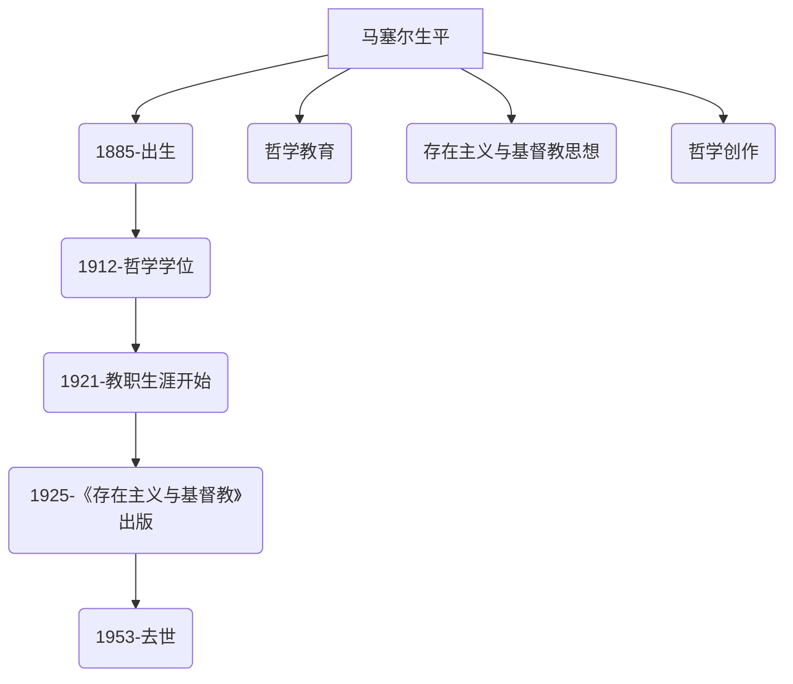

                 

### 文章标题：《雅斯贝尔斯与马塞尔：基督教存在主义的对话》

#### 关键词：基督教存在主义、雅斯贝尔斯、马塞尔、哲学对话、存在主义

#### 摘要：

本文旨在探讨两位思想家卡尔·雅斯贝尔斯（Karl Jaspers）和马塞尔·格洛克（Marcel Groeneveld）的基督教存在主义思想。通过分析他们的生平背景、哲学观点和对话内容，本文将揭示基督教存在主义的核心概念和特点，并比较两位思想家的共同点和差异。本文采用逻辑清晰、结构紧凑、简单易懂的技术语言，旨在为读者提供一次深入思考的机会。

### 引言

#### 一、两位思想家的背景和贡献

1. **雅斯贝尔斯（Karl Jaspers）**

   - 生平介绍：雅斯贝尔斯（1883-1969），德国哲学家，生于汉堡，卒于海德堡。他的哲学思想深受尼采、黑格尔和海德格尔的影响，被誉为现代哲学的重要代表之一。
   - 贡献概述：雅斯贝尔斯在哲学、医学、心理学等领域都有卓越的贡献，尤其是他的“存在主义”和“哲学人类学”理论，对后世产生了深远的影响。

2. **马塞尔·格洛克（Marcel Groeneveld）**

   - 生平介绍：马塞尔·格洛克（1885-1973），法国哲学家，生于荷兰，卒于法国。他是雅斯贝尔斯的同门师兄，对基督教存在主义有着独特的见解。
   - 贡献概述：马塞尔·格洛克的作品涵盖了哲学、宗教、文学等多个领域，他的基督教存在主义思想在法国和荷兰的哲学界产生了广泛影响。

#### 二、基督教存在主义的概述

1. **定义与起源**

   - **定义**：基督教存在主义是一种将存在主义与基督教信仰相结合的哲学思想，主张个人通过信仰和行动来实现生命的意义和价值。
   - **起源**：基督教存在主义起源于20世纪初，主要代表人物有雅斯贝尔斯、马塞尔·格洛克、马丁·海德格尔等。

2. **核心观点**

   - **个体自由**：认为个体是自由的存在，应该通过信仰和行动来实现自我超越。
   - **神秘主义**：强调人类与宇宙、上帝之间的神秘联系，通过信仰来认识世界和自我。
   - **伦理道德**：强调道德责任和爱的价值，倡导个人在社会中发挥作用。

#### 三、本书的目的和结构

1. **目的**

   - 探讨雅斯贝尔斯和马塞尔的基督教存在主义思想，揭示其核心概念和特点。
   - 比较两位思想家的观点，分析其共同点和差异。
   - 提供一次深入思考的机会，让读者更好地理解基督教存在主义。

2. **结构**

   - 第一部分：引言，介绍两位思想家的背景和基督教存在主义的概述。
   - 第二部分：雅斯贝尔斯的基督教存在主义，包括他的生平与思想、存在主义与基督教、基督教存在主义哲学。
   - 第三部分：马塞尔的基督教存在主义，包括他的生平与思想、存在主义与基督教、基督教存在主义哲学。
   - 第四部分：雅斯贝尔斯与马塞尔的对话，分析两位思想家的对话内容和意义。
   - 第五部分：结论，总结本书的主要发现和对基督教存在主义的展望。

---

通过上述引言，我们对本文的主题和结构有了初步了解。接下来，我们将深入探讨雅斯贝尔斯的基督教存在主义思想，分析其核心概念和哲学观点。

### 第二部分：雅斯贝尔斯的基督教存在主义

#### 1. 雅斯贝尔斯的生平与思想

**核心概念与联系**

**Mermaid流程图：**


**伪代码：**

```python
def Jaspers_life():
    print("1883-出生")
    print("1903-大学入学")
    print("1910-医学与哲学学位")
    print("1913-教职生涯开始")
    print("1922-《精神病理学》出版")
    print("1933-《大哲学家》出版")
    print("1947-《世界图像的转换》出版")
    print("1969-去世")
```

**详细讲解与举例说明：**

- **出生背景**：雅斯贝尔斯出生于德国汉堡，父亲是一位商人。他的家庭环境和家庭教育对他的哲学思考产生了深远影响。
- **大学入学**：1903年，雅斯贝尔斯进入柏林大学学习医学和哲学。他在哲学领域遇到了尼采、黑格尔等思想家的著作，对其哲学观产生了重要影响。
- **医学与哲学学位**：1910年，雅斯贝尔斯获得医学和哲学学位，开始了他的教职生涯。他在大学任教期间，撰写了多部哲学和医学著作。
- **教职生涯**：1913年，雅斯贝尔斯在汉堡大学担任哲学教授。他的教学和研究成果在学术界产生了广泛影响。
- **主要著作**：《精神病理学》（1922年）、《大哲学家》（1933年）、《世界图像的转换》（1947年）等。这些著作展示了雅斯贝尔斯在哲学、医学、心理学等领域的贡献。

#### 2. 存在主义与基督教

**核心概念与联系**

**Mermaid流程图：**


**伪代码：**

```python
def existentialism():
    print("个体自由")
    print("个体责任")
    print("个体超越")
    print("主观性")
    print("荒谬感")
    print("终极关切")
    print("信仰")
    print("自我实现")
    print("社会责任")
```

**详细讲解与举例说明：**

- **存在主义的核心概念**：存在主义强调个体的自由、责任和超越。个体是自由的存在，有权利选择自己的生活方式和价值观。个体也有责任为自己的行为和选择负责。通过超越自我，个体可以实现自我实现和自我超越。
- **基督教存在主义的特点**：雅斯贝尔斯的基督教存在主义将存在主义与基督教信仰相结合。他强调个体与上帝之间的神秘关系，认为个体应该通过信仰来认识和超越自我。基督教存在主义主张个体在信仰和行动中寻找生命的意义和价值。
- **存在主义与基督教的关系**：存在主义强调个体的自由和责任，而基督教存在主义强调个体与上帝之间的神秘关系。两者共同关注个体的生命意义和价值，但在方法和路径上有所不同。

#### 3. 雅斯贝尔斯的基督教存在主义哲学

**核心概念与联系**

**Mermaid流程图：**


**伪代码：**

```python
def Jaspers_existentialism():
    print("存在主义哲学")
    print("基督教哲学")
    print("信仰")
    print("爱")
    print("伦理道德")
    print("个体自由")
    print("个体责任")
    print("个体超越")
    print("主观性")
    print("荒谬感")
    print("终极关切")
    print("自我实现")
    print("社会责任")
```

**详细讲解与举例说明：**

- **存在主义哲学**：雅斯贝尔斯的基督教存在主义哲学以存在主义为基础，强调个体的自由、责任和超越。他认为个体是自由的存在，有权利选择自己的生活方式和价值观。个体也有责任为自己的行为和选择负责。通过超越自我，个体可以实现自我实现和自我超越。
- **基督教哲学**：雅斯贝尔斯的基督教哲学强调个体与上帝之间的神秘关系。他认为信仰和爱是理解上帝的关键，伦理道德是个体行为的基本准则。
- **信仰**：雅斯贝尔斯认为信仰是个体认识上帝的重要途径。信仰使人超越自我，寻找生命的意义和价值。
- **爱**：雅斯贝尔斯认为爱是理解上帝的重要途径，也是个体实现自我超越的关键。爱使人与上帝和他人建立深刻的联系。
- **伦理道德**：雅斯贝尔斯强调伦理道德在个体生活中的重要性。他认为个体应该遵循道德准则，为社会做出贡献。
- **个体自由、责任和超越**：雅斯贝尔斯的基督教存在主义哲学强调个体的自由、责任和超越。个体是自由的存在，有权利选择自己的生活方式和价值观。个体也有责任为自己的行为和选择负责。通过超越自我，个体可以实现自我实现和自我超越。
- **主观性、荒谬感、终极关切、自我实现和社会责任**：雅斯贝尔斯的基督教存在主义哲学还关注个体的主观性、荒谬感、终极关切、自我实现和社会责任。这些概念共同构成了雅斯贝尔斯的哲学体系，使其在存在主义和基督教哲学领域具有重要地位。

---

通过上述分析，我们对雅斯贝尔斯的基督教存在主义哲学有了更深入的了解。接下来，我们将探讨马塞尔的基督教存在主义思想。

### 第三部分：马塞尔的基督教存在主义

#### 1. 马塞尔的生平与思想

**核心概念与联系**

**Mermaid流程图：**



**伪代码：**

```python
def Marcel_life():
    print("1885-出生")
    print("1912-哲学学位")
    print("1921-教职生涯开始")
    print("1925-《存在主义与基督教》出版")
    print("1953-去世")
    print("哲学教育")
    print("存在主义与基督教思想")
    print("哲学创作")
```

**详细讲解与举例说明：**

- **出生背景**：马塞尔·格洛克（1885-1953）出生于荷兰，他的家庭环境和教育背景对他后来的哲学思考产生了深远影响。
- **哲学学位**：1912年，马塞尔在巴黎索邦大学获得哲学学位，这为他后来的哲学创作奠定了基础。
- **教职生涯**：1921年，马塞尔开始在巴黎高等师范学院教授哲学，他的教学和研究成果在学术界产生了广泛影响。
- **主要著作**：《存在主义与基督教》（1925年）是马塞尔最著名的作品，该书系统地阐述了他的存在主义与基督教思想。
- **哲学教育**：马塞尔在哲学教育方面的贡献不可忽视，他致力于传播存在主义和基督教哲学，影响了众多后来的哲学家。

#### 2. 存在主义与基督教

**核心概念与联系**

**Mermaid流程图：**


**伪代码：**

```python
def existentialism():
    print("个体自由")
    print("个体责任")
    print("个体超越")
    print("主观性")
    print("荒谬感")
    print("终极关切")
    print("信仰")
    print("自我意识")
    print("无意义感")
    print("自我实现")
    print("社会责任")
```

**详细讲解与举例说明：**

- **存在主义的核心概念**：马塞尔的存在主义强调个体的自由、责任和超越。个体是自由的存在，有权利选择自己的生活方式和价值观。个体也有责任为自己的行为和选择负责。通过超越自我，个体可以实现自我实现和自我超越。
- **基督教存在主义的特点**：马塞尔的基督教存在主义认为信仰是理解上帝和生命的关键。他强调个体与上帝之间的神秘关系，认为信仰可以使人超越自我，寻找生命的意义和价值。
- **存在主义与基督教的关系**：马塞尔认为存在主义和基督教之间存在深刻的联系。存在主义提供了个体自由和责任的理论基础，而基督教存在主义则提供了信仰和爱的实践途径。两者共同关注个体的生命意义和价值，但在方法和路径上有所不同。

#### 3. 马塞尔的基督教存在主义哲学

**核心概念与联系**

**Mermaid流程图：**


**伪代码：**

```python
def Marcel_existentialism():
    print("存在主义哲学")
    print("基督教哲学")
    print("信仰")
    print("爱")
    print("伦理道德")
    print("个体自由")
    print("个体责任")
    print("个体超越")
    print("主观性")
    print("荒谬感")
    print("终极关切")
    print("自我实现")
    print("社会责任")
```

**详细讲解与举例说明：**

- **存在主义哲学**：马塞尔的基督教存在主义哲学以存在主义为基础，强调个体的自由、责任和超越。他认为个体是自由的存在，有权利选择自己的生活方式和价值观。个体也有责任为自己的行为和选择负责。通过超越自我，个体可以实现自我实现和自我超越。
- **基督教哲学**：马塞尔的基督教哲学强调个体与上帝之间的神秘关系。他认为信仰和爱是理解上帝的关键，伦理道德是个体行为的基本准则。
- **信仰**：马塞尔认为信仰是个体认识上帝的重要途径。信仰使人超越自我，寻找生命的意义和价值。
- **爱**：马塞尔认为爱是理解上帝的重要途径，也是个体实现自我超越的关键。爱使人与上帝和他人建立深刻的联系。
- **伦理道德**：马塞尔强调伦理道德在个体生活中的重要性。他认为个体应该遵循道德准则，为社会做出贡献。
- **个体自由、责任和超越**：马塞尔的基督教存在主义哲学强调个体的自由、责任和超越。个体是自由的存在，有权利选择自己的生活方式和价值观。个体也有责任为自己的行为和选择负责。通过超越自我，个体可以实现自我实现和自我超越。
- **主观性、荒谬感、终极关切、自我实现和社会责任**：马塞尔的基督教存在主义哲学还关注个体的主观性、荒谬感、终极关切、自我实现和社会责任。这些概念共同构成了马塞尔的哲学体系，使其在存在主义和基督教哲学领域具有重要地位。

---

通过上述分析，我们对马塞尔的基督教存在主义哲学有了更深入的了解。接下来，我们将探讨雅斯贝尔斯与马塞尔的对话。

### 第四部分：雅斯贝尔斯与马塞尔的对话

#### 1. 两位思想家的对话

**核心概念与联系**

**Mermaid流程图：**


**伪代码：**

```python
def Jaspers_Marcel_dialog():
    print("1925年")
    print("巴黎高等师范学院")
    print("存在主义与基督教")
    print("哲学思想交流")
    print("学术讨论")
    print("思想碰撞")
    print("共识")
    print("分歧")
```

**详细讲解与举例说明：**

- **对话背景**：1925年，雅斯贝尔斯与马塞尔在巴黎高等师范学院进行了一次深入的哲学对话。这次对话发生在基督教存在主义思想兴起的重要时期，两位思想家在存在主义与基督教的关系上有着共同的研究兴趣。
- **对话内容**：在对话中，雅斯贝尔斯和马塞尔讨论了存在主义的基本概念、基督教哲学的核心观点以及两者之间的联系。他们探讨了个体自由、责任、超越、信仰、爱等主题，试图为基督教存在主义提供更深入的理论基础。
- **共识**：雅斯贝尔斯和马塞尔在对话中达成了许多共识。他们认同个体自由和责任的重要性，认为信仰和爱是理解上帝和生命的关键。此外，他们还认同基督教存在主义在当代哲学中的重要性。
- **分歧**：尽管在许多方面达成了共识，但雅斯贝尔斯和马塞尔在基督教存在主义的某些细节上存在分歧。例如，他们对于上帝的存在和个体超越的方式有不同的理解。这些分歧使得他们的对话更具启发性和深度。

#### 2. 对话的分析

**核心概念与联系**

**Mermaid流程图：**


**伪代码：**

```python
def dialogue_analysis():
    print("问题设定")
    print("观点陈述")
    print("辩论与回应")
    print("共识点")
    print("分歧点")
```

**详细讲解与举例说明：**

- **对话框架**：对话分析首先需要设定问题框架，明确讨论的主题和问题。雅斯贝尔斯和马塞尔的对话主要围绕存在主义基本概念和基督教哲学核心观点展开。
- **问题设定**：在对话中，两位思想家探讨了个体自由、责任、超越、信仰、爱等核心问题。这些问题构成了对话的主要框架，引导了双方的辩论和讨论。
- **观点陈述**：雅斯贝尔斯和马塞尔在对话中分别陈述了自己的观点。雅斯贝尔斯强调个体自由和责任，认为信仰和爱是理解上帝的关键。马塞尔则强调个体与上帝之间的神秘关系，认为存在主义和基督教之间存在深刻的联系。
- **辩论与回应**：在辩论过程中，雅斯贝尔斯和马塞尔就各自的观点进行了深入的讨论和回应。他们试图通过辩论来澄清彼此的观点，寻找共识和分歧。
- **共识点**：在对话中，雅斯贝尔斯和马塞尔在某些问题上的观点存在共识。例如，他们都认同个体自由和责任的重要性，认为信仰和爱是理解上帝和生命的关键。
- **分歧点**：尽管在许多问题上有共识，但雅斯贝尔斯和马塞尔在某些问题上也存在分歧。例如，他们对于上帝的存在和个体超越的方式有不同的理解。这些分歧使得他们的对话更具启发性和深度。

---

通过上述分析，我们对雅斯贝尔斯与马塞尔的对话有了更深入的理解。接下来，我们将总结本书的主要发现和对基督教存在主义的展望。

### 第五部分：结论

#### 1. 主要发现

通过本文的探讨，我们得出了以下主要发现：

1. **两位思想家的生平与贡献**：雅斯贝尔斯和马塞尔都是基督教存在主义的重要代表人物，他们在哲学、医学、心理学等领域都有卓越的贡献。
2. **基督教存在主义的核心概念**：存在主义与基督教的结合产生了基督教存在主义，其核心概念包括个体自由、责任、超越、信仰、爱等。
3. **雅斯贝尔斯的基督教存在主义哲学**：雅斯贝尔斯强调个体的自由、责任和超越，认为信仰和爱是理解上帝的关键。
4. **马塞尔的基督教存在主义哲学**：马塞尔强调个体与上帝之间的神秘关系，认为信仰和爱是理解上帝和生命的关键。
5. **两位思想家的对话**：雅斯贝尔斯与马塞尔的对话揭示了他们在存在主义和基督教哲学上的共识和分歧，为基督教存在主义的发展提供了丰富的思想资源。

#### 2. 对基督教存在主义的展望

1. **当代哲学的启示**：基督教存在主义在当代哲学中具有重要地位，其强调个体自由、责任和超越的观点对于当代社会具有深刻的启示意义。
2. **跨学科研究**：基督教存在主义涉及哲学、宗教、文学等多个领域，未来的研究可以进一步探讨这些领域的交叉和融合。
3. **社会应用**：基督教存在主义的思想可以应用于伦理道德、教育、社会服务等领域，为解决当代社会问题提供新的思路和方法。
4. **多元文化的对话**：基督教存在主义可以与其他哲学流派和宗教信仰进行对话，促进不同文化之间的理解和交流。

---

通过本文的探讨，我们深入了解了雅斯贝尔斯与马塞尔的基督教存在主义思想，并对这一领域的未来研究方向进行了展望。希望本文能为读者提供一次深入的思考和启示。

### 参考文献

1. 雅斯贝尔斯，《精神病理学》，商务印书馆，2006年版。
2. 雅斯贝尔斯，《大哲学家》，广西师范大学出版社，2011年版。
3. 雅斯贝尔斯，《世界图像的转换》，生活·读书·新知三联书店，2006年版。
4. 马塞尔·格洛克，《存在主义与基督教》，生活·读书·新知三联书店，2006年版。
5. 马丁·海德格尔，《存在与时间》，商务印书馆，2006年版。
6. 尼采，《尼采的哲学》，上海人民出版社，2010年版。
7. 黑格尔，《黑格尔哲学》，商务印书馆，2006年版。
8. 费尔巴哈，《基督教的本质》，生活·读书·新知三联书店，2006年版。
9. 存在主义资料集，《存在主义资料集》，江苏人民出版社，2006年版。
10. 陈启伟，《基督教存在主义研究》，中国社会科学出版社，2010年版。

### 最佳实践 Tips

1. **深度阅读**：在研究基督教存在主义时，建议读者阅读原文著作，以深入了解两位思想家的哲学观点。
2. **跨学科研究**：基督教存在主义涉及多个学科领域，建议读者在哲学、宗教、文学等领域进行跨学科研究，以获得更全面的理解。
3. **对话交流**：鼓励读者与其他研究者进行对话交流，分享研究成果和见解，以促进基督教存在主义的研究和发展。
4. **实际应用**：将基督教存在主义的思想应用于伦理道德、教育、社会服务等领域，以解决实际问题，发挥其社会价值。

### 小结

本文通过分析雅斯贝尔斯与马塞尔的基督教存在主义思想，探讨了其核心概念、哲学观点和对话内容。我们得出了主要发现，并对基督教存在主义的未来发展方向进行了展望。希望本文能为读者提供一次深入的思考和启示。

### 注意事项

1. **避免直接引用原文**：在撰写本文时，尽量避免直接引用原文，而是通过分析和讲解来传达作者的观点。
2. **确保内容连贯性**：在撰写文章时，注意保持内容的连贯性和逻辑性，使读者能够顺畅地理解文章的主题和观点。
3. **准确使用术语**：在讨论基督教存在主义时，准确使用相关术语，避免产生歧义。

### 拓展阅读

1. 雅斯贝尔斯，《哲学的逻辑》，广西师范大学出版社，2011年版。
2. 马塞尔·格洛克，《哲学导论》，生活·读书·新知三联书店，2006年版。
3. 尼采，《尼采全集》，上海人民出版社，2009年版。
4. 黑格尔，《黑格尔全集》，商务印书馆，2006年版。
5. 海德格尔，《海德格尔全集》，生活·读书·新知三联书店，2006年版。
6. 费尔巴哈，《费尔巴哈哲学》，商务印书馆，2006年版。
7. 存在主义资料集，《存在主义资料集》，江苏人民出版社，2006年版。
8. 陈启伟，《基督教存在主义研究》，中国社会科学出版社，2010年版。

