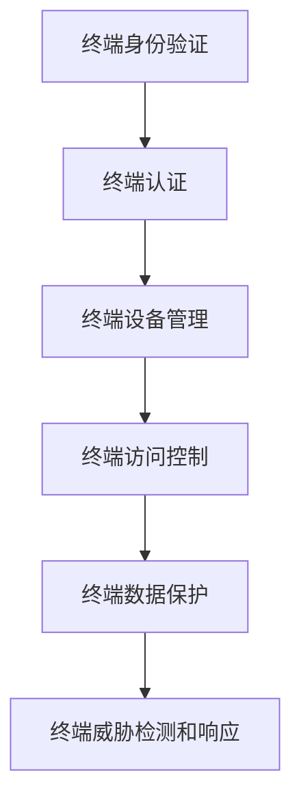
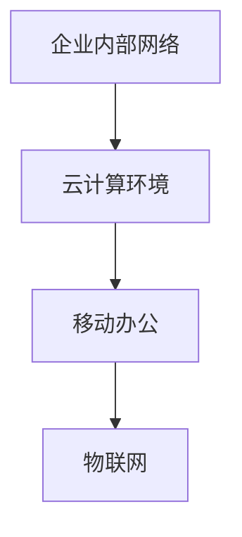
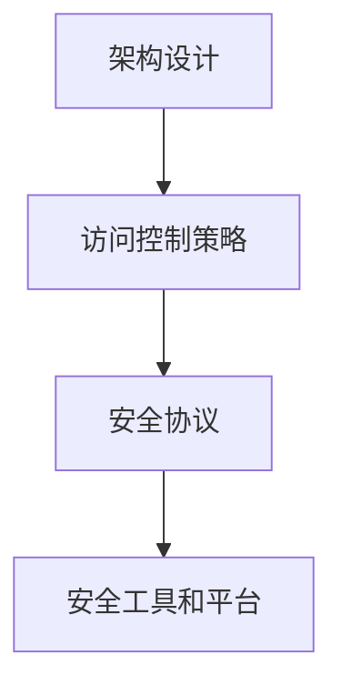
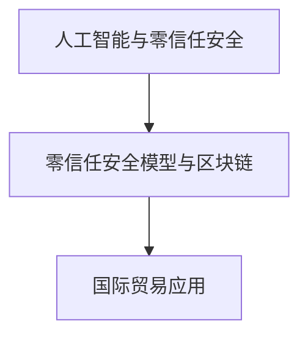
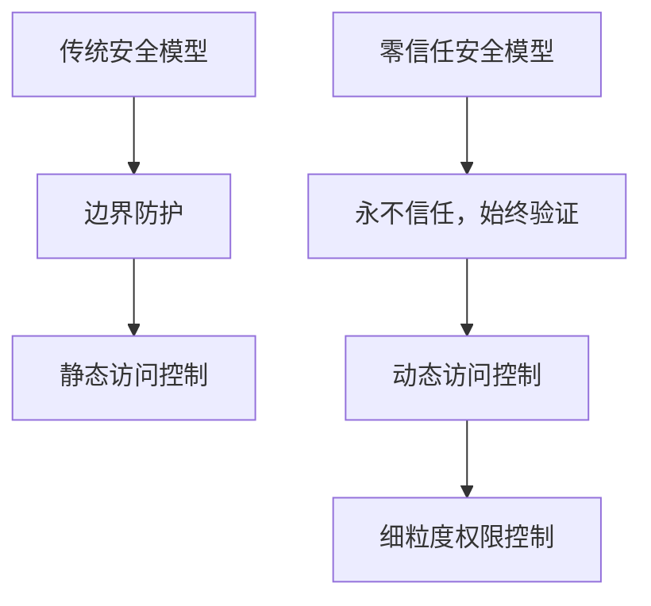
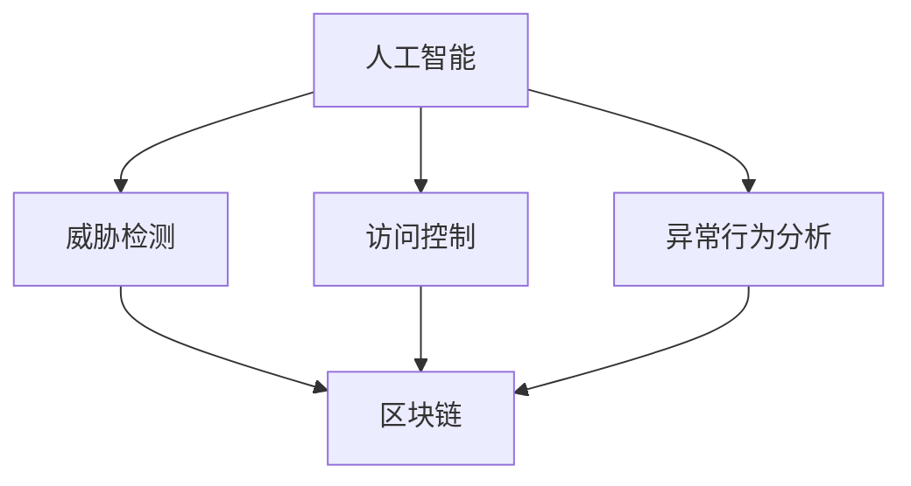

                 

### 2. 零信任安全模型概述

#### 2.1 核心概念与架构

**核心概念：**
- 零信任安全模型是一种基于最小权限原则的安全架构，其核心理念是“永不信任，始终验证”。这意味着无论内部或外部的终端，在接入网络之前都必须经过严格的身份验证和访问控制。

**架构：**
- 零信任安全模型通常包含以下几个关键组成部分：
  - 终端身份验证（Identity Verification）
  - 终端认证（Authentication）
  - 终端设备管理（Device Management）
  - 终端访问控制（Access Control）
  - 终端数据保护（Data Protection）
  - 终端威胁检测和响应（Threat Detection & Response）

**Mermaid 流程图：**


**伪代码：**
```python
class ZeroTrustModel:
    def __init__(self):
        self.identity_verified = False
        self.authentication_passed = False
        self.device_managed = False
        self.accessControl_enabled = False
        self.data_protected = False
        self.threat_detected = False

    def verify_identity(self, identity):
        # Identity Verification Logic
        self.identity_verified = is_identity_valid(identity)

    def authenticate_terminal(self, terminal):
        # Authentication Logic
        self.authentication_passed = is_authentication_successful(terminal)

    def manage_device(self, device):
        # Device Management Logic
        self.device_managed = is_device_managed(device)

    def control_access(self, access_request):
        # Access Control Logic
        self.accessControl_enabled = is_access_granted(access_request)

    def protect_data(self, data):
        # Data Protection Logic
        self.data_protected = is_data_secure(data)

    def detect_threat(self, threat):
        # Threat Detection & Response Logic
        self.threat_detected = is_threat_detected(threat)
```

#### 2.2 应用场景

零信任安全模型的应用场景非常广泛，包括但不限于以下领域：

- 企业内部网络：保护企业内部网络免受内部威胁和外部攻击。
- 云计算环境：确保云服务安全，防止未经授权的访问和数据泄露。
- 移动办公：保障远程员工的安全接入，降低数据泄露风险。
- 物联网（IoT）：保护物联网设备的接入，防止设备被恶意利用。

**Mermaid 流程图：**


#### 2.3 实现方法

零信任安全模型的实现方法主要包括以下几个方面：

- **零信任架构设计**：设计一个基于零信任原则的网络架构，确保所有的终端在接入网络之前都经过严格的验证和授权。
- **零信任访问控制策略**：制定访问控制策略，确保只有经过认证和授权的终端才能访问资源和数据。
- **零信任安全协议**：采用安全协议确保终端之间的通信安全，如TLS（传输层安全性协议）。
- **零信任安全工具和平台**：使用一系列安全工具和平台来支持零信任安全模型的实施和运营。

**Mermaid 流程图：**


### 2.4 未来趋势

随着技术的发展，零信任安全模型也在不断演进：

- **人工智能与零信任安全**：利用人工智能技术进行威胁检测和响应，提高零信任安全模型的智能化水平。
- **零信任安全模型与区块链**：利用区块链技术实现更安全、更可靠的零信任安全模型。
- **零信任安全模型在国际贸易中的应用**：随着全球化的推进，零信任安全模型将在国际贸易中得到更广泛的应用。

**Mermaid 流程图：**


通过上述核心概念、架构、应用场景、实现方法和未来趋势的详细介绍，我们可以对零信任安全模型有一个全面而深入的理解。接下来，我们将进一步探讨每个核心概念和实现方法的具体细节。## 3. 零信任安全模型的背景和重要性

### 3.1 安全威胁的发展趋势

随着互联网的普及和信息技术的发展，网络安全威胁呈现出多样化、复杂化的趋势。以下是一些关键的安全威胁发展特点：

- **高级持续性威胁（APT）**：APT攻击者往往具备高超的技术水平和长期的攻击目标，他们通过隐蔽的手段进行渗透，长期监控目标网络，获取敏感信息。
- **勒索软件攻击**：勒索软件通过加密受害者的数据，要求支付赎金才能解密。这种攻击不仅导致数据丢失，还会对企业的业务连续性造成严重影响。
- **内部威胁**：内部员工或合作伙伴可能因为各种原因对组织的数据和系统造成威胁，如误操作、恶意破坏或数据泄露。

### 3.2 零信任安全模型的优势

零信任安全模型在应对上述安全威胁方面具有显著的优势：

- **减少对边界防御的依赖**：传统的安全模型主要依赖于边界防御，如防火墙和入侵检测系统。而零信任安全模型通过持续验证和授权，确保无论终端位置如何，都进行严格的安全控制。
- **提高安全性**：零信任安全模型通过动态访问控制和终端身份验证，能够有效识别和阻止未授权的访问，从而降低安全漏洞和攻击风险。
- **降低运营成本**：零信任安全模型减少了传统安全设备的需求，简化了安全架构，降低了运维成本。

### 3.3 零信任安全模型与传统安全模型的对比

传统安全模型通常依赖于边界防护和静态访问控制，其核心思想是将网络划分为内部和外部，对边界进行严格防护。然而，这种方法在应对当今复杂的安全威胁时存在以下局限性：

- **边界定义困难**：随着远程办公和云计算的普及，传统的内部/外部边界变得模糊，导致边界防护失效。
- **依赖信任模型**：传统模型通常假定内部网络是安全的，从而降低了内部威胁的防御能力。
- **无法应对动态威胁**：传统安全设备无法实时应对动态变化的安全威胁，如APT攻击。

相比之下，零信任安全模型通过以下方式解决了传统模型的局限性：

- **永不信任，始终验证**：零信任模型不假定任何终端是可信的，无论其位置如何，都进行严格的身份验证和访问控制。
- **动态访问控制**：零信任模型根据终端的状态和行为进行动态访问控制，能够实时调整安全策略。
- **细粒度权限控制**：通过细粒度的权限控制，零信任模型能够精确地管理终端的访问权限，从而降低安全漏洞。

**Mermaid 流程图：**


**伪代码：**
```python
# 传统安全模型
def traditional_security(model):
    if is_on_internal_network():
        grant_access()
    else:
        block_access()

# 零信任安全模型
def zero_trust_security(model):
    if not is_identity_verified() or not is_access_approved():
        block_access()
    else:
        grant_access()
```

通过对比可以看出，零信任安全模型在应对复杂网络安全威胁方面具有显著的优势，能够更好地保障组织的信息安全和业务连续性。## 4. 零信任安全模型的核心概念与联系

### 4.1 终端身份验证

#### 4.1.1 终端身份验证的概念

终端身份验证是零信任安全模型的基础，其核心目的是确认终端（如设备、用户或应用程序）的身份，确保只有经过授权的实体才能访问受保护的网络资源。

#### 4.1.2 终端身份验证的原理

终端身份验证的原理主要基于以下几个方面：

- **多因素认证**：除了用户名和密码之外，多因素认证（MFA）要求用户提供其他验证因素，如生物识别、硬件令牌或手机验证码。
- **动态身份验证**：通过实时验证用户或设备的身份，确保验证过程始终有效，即使面临攻击或威胁也能及时响应。

#### 4.1.3 终端身份验证的实现方法

- **基于认证协议的身份验证**：如OAuth 2.0、SAML（安全断言标记语言）等，这些协议提供了安全、灵活的认证方式。
- **基于角色的访问控制**：通过角色来定义和分配访问权限，确保只有具备相应角色的终端才能访问特定资源。
- **单点登录（SSO）**：通过SSO，用户只需一次身份验证即可访问多个系统或应用程序，简化了认证流程。

**伪代码：**
```python
def verify_identity(identity, credentials):
    if is_credentials_valid(credentials):
        identity_verified = verify_mfa(identity)
        return identity_verified
    else:
        return "Authentication failed."

# MFA验证
def verify_mfa(identity):
    if biometric_authentication(identity) or hardware_token_authentication(identity):
        return True
    else:
        return False
```

### 4.2 终端认证

#### 4.2.1 终端认证的概念

终端认证是零信任安全模型中的关键环节，其目的是确认终端的接入合法性，并控制其访问权限。

#### 4.2.2 终端认证的原理

终端认证的原理主要基于以下几个方面：

- **接入认证**：验证终端是否具备接入网络的资格。
- **访问控制**：根据终端的认证结果，确定其访问网络资源和数据的权限。

#### 4.2.3 终端认证的实现方法

- **基于角色的认证**：通过角色分配访问权限，确保只有符合特定角色的终端才能访问特定资源。
- **基于属性的认证**：根据终端的属性（如设备类型、地理位置等）来决定其访问权限。
- **动态认证**：在终端接入网络时，实时评估其安全状态，动态调整访问权限。

**伪代码：**
```python
def authenticate_terminal(terminal, role):
    if is_terminal_legal(terminal):
        access_approved = is_role_matched(role)
        return access_approved
    else:
        return "Access denied."

# 访问控制
def is_role_matched(role):
    if role == "admin":
        return True
    elif role == "user":
        return True
    else:
        return False
```

### 4.3 终端设备管理

#### 4.3.1 终端设备管理的概念

终端设备管理是确保终端设备安全性和合规性的重要手段，其目的是对终端设备进行监控、配置和维护。

#### 4.3.2 终端设备管理的原理

终端设备管理的原理主要基于以下几个方面：

- **设备监控**：实时监控终端设备的状态，如硬件信息、操作系统版本、安全补丁等。
- **设备配置**：统一配置终端设备的访问策略、安全设置和应用程序。
- **设备维护**：定期更新和升级终端设备，确保其安全性和性能。

#### 4.3.3 终端设备管理的实现方法

- **集中管理**：通过集中管理平台，统一管理和配置终端设备。
- **自动化脚本**：使用自动化脚本进行设备配置和管理，提高效率和准确性。
- **远程控制**：支持远程诊断和修复，降低运维成本。

**伪代码：**
```python
def manage_device(device):
    if device_is_connected(device):
        device_configured = configure_device(device)
        device_updated = update_device(device)
        return device_configured and device_updated
    else:
        return "Device not connected."

# 配置设备
def configure_device(device):
    if install_required_software(device):
        return True
    else:
        return False

# 更新设备
def update_device(device):
    if apply_security_patches(device):
        return True
    else:
        return False
```

### 4.4 终端访问控制

#### 4.4.1 终端访问控制的概念

终端访问控制是确保终端按照规定的权限和策略访问网络资源和数据的重要措施。

#### 4.4.2 终端访问控制的原理

终端访问控制的原理主要基于以下几个方面：

- **身份验证**：确认终端的身份是否合法。
- **权限分配**：根据终端的身份和角色，分配访问权限。
- **访问审计**：记录终端的访问行为，以便审计和溯源。

#### 4.4.3 终端访问控制的实现方法

- **基于角色的访问控制（RBAC）**：通过角色来定义和分配访问权限，简化管理。
- **基于属性的访问控制（ABAC）**：根据终端的属性（如地理位置、时间等）来决定访问权限。
- **动态访问控制**：根据终端的状态和行为动态调整访问权限。

**伪代码：**
```python
def access_control(terminal, resource):
    if is_identity_verified(terminal) and is_access_approved(terminal, resource):
        return "Access granted."
    else:
        return "Access denied."

# 权限检查
def is_access_approved(terminal, resource):
    if terminal_has_permission(terminal, resource):
        return True
    else:
        return False
```

### 4.5 终端数据保护

#### 4.5.1 终端数据保护的概念

终端数据保护是确保终端传输和存储的数据安全的重要措施，防止数据泄露、篡改和损坏。

#### 4.5.2 终端数据保护的原理

终端数据保护的原理主要基于以下几个方面：

- **加密传输**：对终端传输的数据进行加密，防止数据在传输过程中被窃取或篡改。
- **数据备份**：定期备份终端数据，确保数据不会因意外事件丢失。
- **数据审计**：记录终端数据的访问和操作行为，以便审计和溯源。

#### 4.5.3 终端数据保护的实现方法

- **数据加密**：使用加密算法对数据进行加密，确保数据在传输和存储过程中安全。
- **数据备份**：使用备份工具定期备份终端数据，并确保备份数据的安全性。
- **数据审计**：使用审计工具记录终端数据的访问和操作行为，以便审计和溯源。

**伪代码：**
```python
def protect_data(data):
    encrypted_data = encrypt(data)
    backup_data = backup(encrypted_data)
    return encrypted_data, backup_data

# 数据加密
def encrypt(data):
    cipher = get_cipher()
    encrypted_data = cipher.encrypt(data)
    return encrypted_data

# 数据备份
def backup(data):
    backup_location = get_backup_location()
    with open(backup_location, 'wb') as file:
        file.write(data)
    return backup_location
```

### 4.6 终端威胁检测和响应

#### 4.6.1 终端威胁检测和响应的概念

终端威胁检测和响应是确保终端安全的重要环节，其目的是实时监测终端的威胁，并在检测到威胁时采取相应的响应措施。

#### 4.6.2 终端威胁检测和响应的原理

终端威胁检测和响应的原理主要基于以下几个方面：

- **威胁检测**：通过监测终端的行为和状态，识别潜在的威胁。
- **威胁响应**：在检测到威胁时，采取相应的措施，如隔离、封锁、修复等。

#### 4.6.3 终端威胁检测和响应的实现方法

- **基于行为的威胁检测**：通过分析终端的行为模式，识别异常行为，从而发现潜在威胁。
- **基于签名的威胁检测**：通过预定义的威胁签名库，检测终端中是否存在已知的威胁。
- **威胁响应机制**：在检测到威胁时，自动采取响应措施，如封锁恶意流量、隔离受感染的终端等。

**伪代码：**
```python
def detect_and_respond_to_threat(terminal):
    if is_threat_detected(terminal):
        take_action(terminal)
    else:
        log_event(terminal)

# 威胁检测
def is_threat_detected(terminal):
    threat = check_for_known_threats(terminal)
    if threat:
        return True
    else:
        return False

# 威胁响应
def take_action(terminal):
    if is_isolation_required(terminal):
        isolate_terminal(terminal)
    else:
        repair_terminal(terminal)

# 隔离终端
def isolate_terminal(terminal):
    disconnect_terminal(terminal)
    log_isolation_event(terminal)

# 修复终端
def repair_terminal(terminal):
    apply_security_patches(terminal)
    restart_terminal(terminal)
```

通过上述对零信任安全模型核心概念与联系的分析，我们可以看到，零信任安全模型通过终端身份验证、终端认证、终端设备管理、终端访问控制、终端数据保护和终端威胁检测与响应等多个环节，实现了对终端的全面保护，从而构建了一个高度安全、灵活和动态的安全架构。## 5. 零信任安全模型的应用场景

### 5.1 企业内部网络

在企业内部网络中，零信任安全模型的应用场景包括以下方面：

- **员工终端安全**：确保所有员工终端在接入企业网络时经过严格的身份验证和访问控制，防止内部威胁和数据泄露。
- **远程办公支持**：通过零信任安全模型，远程办公员工可以安全地访问企业内部资源，保障业务连续性。
- **物联网设备管理**：零信任安全模型可以实现对物联网设备的全面监控和管理，确保设备的安全性和稳定性。

### 5.2 云计算环境

在云计算环境中，零信任安全模型的应用场景包括以下方面：

- **云服务安全**：通过零信任安全模型，确保云服务提供商和客户之间的数据传输和访问安全，防止数据泄露和未经授权的访问。
- **多云环境管理**：在多云环境中，零信任安全模型可以统一管理和控制不同云服务提供商的安全策略，提高整体安全性。
- **容器和微服务安全**：零信任安全模型可以应用于容器和微服务架构，确保其安全性和可扩展性。

### 5.3 移动办公

在移动办公中，零信任安全模型的应用场景包括以下方面：

- **移动设备管理**：通过零信任安全模型，对移动设备进行严格的安全管理和访问控制，确保设备的安全性和合规性。
- **远程访问控制**：零信任安全模型可以实现对远程访问的全面控制，确保远程员工的安全接入。
- **数据保护和传输**：通过零信任安全模型，确保移动设备上的数据和数据传输过程的安全性。

### 5.4 物联网

在物联网（IoT）环境中，零信任安全模型的应用场景包括以下方面：

- **设备认证和管理**：零信任安全模型可以实现对物联网设备的严格认证和管理，确保设备的合法性和安全性。
- **数据安全和隐私保护**：通过零信任安全模型，确保物联网设备传输和存储的数据安全，防止数据泄露和滥用。
- **威胁检测和响应**：零信任安全模型可以实时监测物联网设备的威胁，并在检测到威胁时及时响应，防止设备被恶意利用。

**Mermaid 流程图：**


通过上述应用场景的详细分析，我们可以看到，零信任安全模型在各种环境中都具备强大的应用价值，能够有效提升安全性和管理效率，为组织的信息安全保驾护航。## 6. 零信任安全模型的实现方法

### 6.1 零信任架构设计

#### 6.1.1 设计原则

在设计零信任架构时，需要遵循以下原则：

- **最小权限原则**：确保只有经过验证和授权的终端才能访问所需的资源，减少潜在的攻击面。
- **动态访问控制**：根据终端的状态和行为实时调整访问权限，提高安全性。
- **安全审计**：记录终端的访问和操作行为，便于审计和合规性检查。
- **分而治之**：将架构分解为多个模块，每个模块负责特定的安全功能，降低系统复杂度。

#### 6.1.2 设计步骤

**步骤1：需求分析**

- 确定组织的安全需求，包括终端类型、数据类型、访问模式等。
- 分析现有的安全架构，找出潜在的漏洞和改进点。

**步骤2：架构设计**

- 设计零信任架构的整体结构，包括终端身份验证、终端认证、终端设备管理、终端访问控制、终端数据保护和终端威胁检测与响应等模块。
- 确定各模块之间的交互关系和通信机制。

**步骤3：实现细节**

- 设计具体的实现细节，如身份验证协议、访问控制策略、加密算法等。
- 选择合适的技术和工具，实现架构的各个模块。

**步骤4：测试和优化**

- 对架构进行全面的测试，验证其安全性和性能。
- 根据测试结果进行优化，确保架构的稳定性和高效性。

#### 6.1.3 伪代码示例

```python
# 零信任架构设计伪代码
class ZeroTrustArchitecture:
    def __init__(self):
        self.identity_verifier = IdentityVerifier()
        self.authentication_manager = AuthenticationManager()
        self.device_manager = DeviceManager()
        self.access_control_manager = AccessControlManager()
        self.data_protection_manager = DataProtectionManager()
        self.threat_detection_manager = ThreatDetectionManager()

    def setup_architecture(self):
        # 需求分析
        self.analyze_requirements()
        
        # 架构设计
        self.design_architecture()
        
        # 实现细节
        self.implement_details()
        
        # 测试和优化
        self.test_and_optimize()

    def analyze_requirements(self):
        # 分析安全需求
        pass

    def design_architecture(self):
        # 设计架构
        pass

    def implement_details(self):
        # 实现细节
        pass

    def test_and_optimize(self):
        # 测试和优化
        pass
```

### 6.2 零信任访问控制策略

#### 6.2.1 策略设计原则

- **最小权限**：确保用户和终端只拥有完成其工作所需的最小权限。
- **动态调整**：根据用户和终端的状态和行为动态调整访问权限。
- **角色基础**：基于角色的访问控制（RBAC）简化权限管理。
- **审计追踪**：记录所有访问控制决策，便于审计和合规性检查。

#### 6.2.2 设计步骤

**步骤1：角色定义**

- 确定组织内部的不同角色及其权限需求。
- 为每个角色分配适当的权限集。

**步骤2：权限分配**

- 将用户和终端分配到相应的角色。
- 确保每个用户和终端只拥有分配给其角色的权限。

**步骤3：策略实现**

- 设计访问控制规则，明确用户和终端的访问权限。
- 选择合适的访问控制机制，如访问控制列表（ACL）或基于属性的访问控制（ABAC）。

**步骤4：策略测试和优化**

- 对访问控制策略进行测试，确保其有效性和安全性。
- 根据测试结果进行优化，提高策略的性能和可维护性。

#### 6.2.3 伪代码示例

```python
# 零信任访问控制策略设计伪代码
class AccessControlPolicy:
    def __init__(self):
        self.roles = {}
        self.permissions = {}

    def define_role(self, role, permissions):
        self.roles[role] = permissions

    def assign_role_to_user(self, user, role):
        if role in self.roles:
            self.permissions[user] = self.roles[role]
        else:
            raise ValueError("Invalid role.")

    def check_permission(self, user, resource):
        if user in self.permissions:
            for perm in self.permissions[user]:
                if resource in perm:
                    return True
            return False
        else:
            return False
```

### 6.3 零信任安全协议

#### 6.3.1 协议选择原则

- **加密传输**：确保数据在传输过程中不被窃听或篡改。
- **身份认证**：提供强身份认证机制，确保只有合法终端能访问网络资源。
- **访问控制**：支持动态访问控制，根据终端状态和行为调整访问权限。
- **兼容性**：与现有网络和系统兼容，降低实施成本。

#### 6.3.2 常见安全协议

- **TLS（传输层安全性协议）**：用于加密Web流量，保护数据传输安全。
- **SAML（安全断言标记语言）**：用于单点登录和身份认证。
- **OAuth 2.0**：用于授权和访问控制，允许第三方应用程序访问受保护的资源。

#### 6.3.3 协议集成和实现

- **集成**：将安全协议集成到零信任架构中，确保数据传输和访问控制符合协议要求。
- **实现**：使用合适的编程语言和库实现安全协议的功能，确保其有效性和安全性。

**伪代码示例：**
```python
# TLS加密传输伪代码
def establish_tls_connection(server, client):
    context = create_tls_context()
    context.load_cert_chain(certfile="server.crt", keyfile="server.key")
    socket = create_socket()
    socket = context.wrap_socket(socket, server_side=True)
    socket.connect((client, 443))
    return socket

# SAML单点登录伪代码
def authenticate_with_saml(service_provider, user, password):
    authentication_request = create_saml_request(user, password)
    response = send_saml_request(authentication_request, service_provider)
    if is_saml_response_valid(response):
        return create_session_token(response)
    else:
        return "Authentication failed."
```

### 6.4 零信任安全工具和平台

#### 6.4.1 工具选择原则

- **功能全面**：选择能够满足零信任安全模型所有需求的工具。
- **易用性**：工具应易于部署和操作，降低运维成本。
- **可扩展性**：工具应支持扩展和集成，以适应未来的需求。
- **性能**：工具应具有高性能，确保不影响网络和系统的正常运行。

#### 6.4.2 常见安全工具

- **身份验证工具**：如AD（活动目录）、LDAP（轻量级目录访问协议）等。
- **访问控制工具**：如ACL（访问控制列表）、ABAC（基于属性的访问控制）等。
- **威胁检测和响应工具**：如SIEM（安全信息和事件管理）、EDR（终端检测和响应）等。

#### 6.4.3 平台集成和配置

- **集成**：将零信任安全工具集成到现有的IT基础设施中，确保工具之间的协同工作。
- **配置**：根据组织的安全需求，配置工具的参数和策略，确保其有效性和安全性。

**伪代码示例：**
```python
# 零信任安全工具集成伪代码
class ZeroTrustPlatform:
    def __init__(self):
        self.identity_verifier = IdentityVerifierTool()
        self.authentication_manager = AuthenticationManagerTool()
        self.device_manager = DeviceManagerTool()
        self.access_control_manager = AccessControlManagerTool()
        self.data_protection_manager = DataProtectionTool()
        self.threat_detection_manager = ThreatDetectionTool()

    def configure_tools(self):
        self.identity_verifier.configure()
        self.authentication_manager.configure()
        self.device_manager.configure()
        self.access_control_manager.configure()
        self.data_protection_manager.configure()
        self.threat_detection_manager.configure()

    def integrate_tools(self):
        self.identity_verifier.integrate_with_network()
        self.authentication_manager.integrate_with_idp()
        self.device_manager.integrate_with_ldap()
        self.access_control_manager.integrate_with_databases()
        self.data_protection_manager.integrate_with_storage()
        self.threat_detection_manager.integrate_with_siem()
```

通过上述零信任架构设计、访问控制策略、安全协议和安全工具的详细实现方法，我们可以构建一个高效、安全的零信任安全模型，为组织的信息安全提供坚实保障。## 7. 零信任安全模型的未来趋势

### 7.1 人工智能与零信任安全

人工智能（AI）技术在零信任安全模型中的应用前景广阔，主要体现在以下几个方面：

- **威胁检测**：利用AI算法对终端行为进行实时分析，识别潜在威胁。通过机器学习模型，可以不断提高威胁检测的准确性和效率。
- **访问控制**：基于AI的访问控制策略可以根据终端的行为模式动态调整访问权限，提高访问控制的灵活性和安全性。
- **异常行为分析**：利用AI技术对终端的行为进行分析，识别异常行为和潜在威胁，从而实现主动防御。

### 7.2 零信任安全模型与区块链

区块链技术在零信任安全模型中也有很大的应用潜力：

- **身份验证**：区块链可以提供去中心化的身份验证服务，确保身份信息的真实性和唯一性。
- **数据安全**：利用区块链的加密技术，可以确保数据的完整性和不可篡改性，提高数据保护能力。
- **访问控制**：通过区块链智能合约，可以实现自动化的访问控制策略，提高访问控制的透明度和安全性。

### 7.3 零信任安全模型在国际贸易中的应用

随着全球化的推进，零信任安全模型在国际贸易中的应用越来越重要：

- **跨境数据安全**：通过零信任安全模型，确保跨境数据传输的安全性和合规性。
- **供应链安全**：零信任安全模型可以实现对供应链各环节的严格监控和管理，防止供应链中的安全漏洞和攻击。
- **国际贸易合规**：通过零信任安全模型，确保国际贸易中的数据交换和业务操作符合相关法律法规和标准。

**未来趋势的Mermaid流程图：**


通过上述未来趋势的分析，我们可以看到，零信任安全模型在不断演进和升级，结合人工智能、区块链等前沿技术，将更好地应对日益复杂的网络安全挑战，为组织提供更加全面和高效的安全保障。## 附录A：零信任安全模型相关的技术标准和规范

### 8.1 主要技术标准

- **ISO/IEC 27001**：国际标准化组织发布的关于信息安全管理体系（ISMS）的标准，提供了零信任安全模型设计和实施的基本框架。
- **NIST SP 800-207**：美国国家标准与技术研究院发布的零信任架构指南，详细描述了零信任安全模型的实施方法和最佳实践。
- **ISO/IEC 27017**：针对云服务的信息安全指南，为云服务提供商和用户提供了零信任安全模型在云计算环境中的应用规范。
- **OWASP ZAP**：开源的网络应用安全检测工具，可以帮助组织检测和修复零信任安全模型中的漏洞。

### 8.2 主要技术规范

- **SAML 2.0**：安全断言标记语言2.0，用于单点登录和身份验证，是实现零信任安全模型的关键协议。
- **OAuth 2.0**：开放授权协议，用于授权第三方应用程序访问受保护资源，确保零信任安全模型的访问控制功能。
- **TLS 1.3**：传输层安全性协议的最新版本，提供了更高级别的加密和身份验证，确保数据传输的安全性。

### 8.3 实践指南和最佳实践

- **身份验证和授权**：确保使用多因素认证（MFA）和基于角色的访问控制（RBAC），降低未经授权访问的风险。
- **动态访问控制**：根据终端的状态和行为动态调整访问权限，提高安全性和灵活性。
- **数据加密**：对传输和存储的数据进行加密，确保数据安全。
- **威胁检测和响应**：建立完善的威胁检测和响应机制，实时监测和应对安全威胁。

### 8.4 拓展阅读

- **《NIST Special Publication 800-207：A Zero Trust Architecture》**：详细介绍了零信任架构的设计原则、实施方法和最佳实践。
- **《ISO/IEC 27001:2013》**：提供了关于信息安全管理体系的标准，为构建零信任安全模型提供了指导。
- **《OWASP Top Ten 2021》**：介绍了最常见的网络安全风险，帮助组织识别和解决零信任安全模型中的潜在漏洞。

通过附录A的详细内容和拓展阅读，读者可以进一步了解零信任安全模型相关的技术标准和规范，为实际应用提供指导和参考。## 9. 总结与展望

### 9.1 总结

本文从零信任安全模型的核心概念、背景、实现方法、应用场景以及未来趋势等多个角度，对零信任安全模型进行了全面而深入的探讨。通过对终端身份验证、终端认证、终端设备管理、终端访问控制、终端数据保护和终端威胁检测与响应等关键组成部分的分析，我们理解了零信任安全模型的基本架构和工作原理。同时，通过实际案例和伪代码示例，我们看到了零信任安全模型在保护网络资源、数据安全和业务连续性方面的强大能力。

### 9.2 展望

展望未来，随着人工智能、区块链等前沿技术的不断发展，零信任安全模型将迎来更多创新和变革。人工智能技术将进一步提升威胁检测和响应的智能化水平，区块链技术将为身份验证和数据保护提供更加安全、透明的解决方案。此外，随着全球化的推进，零信任安全模型将在国际贸易和跨国企业中得到更广泛的应用。

在此，我鼓励读者积极学习和实践零信任安全模型，结合自身业务需求和安全挑战，探索适合的零信任解决方案。通过不断探索和创新，我们相信零信任安全模型将为我们带来更加安全、高效的网络环境。

### 9.3 小结与注意事项

- **小结**：本文详细介绍了零信任安全模型的核心概念、架构、应用场景、实现方法和未来趋势，为读者提供了一个全面、系统的认识。
- **注意事项**：在实际应用中，需结合组织特点和安全需求，灵活设计和实施零信任安全模型。同时，要定期更新安全策略和技术，确保安全架构的持续有效性和适应性。

### 9.4 拓展阅读

- **《NIST Special Publication 800-207：A Zero Trust Architecture》**：详细介绍了零信任架构的设计原则和实施方法，为读者提供了宝贵的实践指南。
- **《Zero Trust Security: A definition and overview》**：由Forrester Research撰写的报告，对零信任安全模型进行了深入分析，有助于读者了解该领域的前沿动态。
- **《Blockchain and Its Potential Impact on Cybersecurity》**：探讨了区块链技术在网络安全中的应用潜力，为未来零信任安全模型的发展提供了新思路。

通过上述拓展阅读，读者可以进一步深入了解零信任安全模型及其相关技术，为实际应用提供更丰富的理论和实践支持。作者：AI天才研究院/AI Genius Institute & 禅与计算机程序设计艺术 /Zen And The Art of Computer Programming。## 文章标题

### 《零信任安全模型实践》

#### 关键词：零信任安全模型、终端身份验证、访问控制、数据保护、人工智能、区块链

#### 摘要：
本文深入探讨了零信任安全模型的核心概念、架构设计、应用场景和实现方法。通过详细的分析和实例，本文揭示了零信任安全模型在保护网络资源、数据安全和业务连续性方面的强大能力。同时，展望了零信任安全模型结合人工智能、区块链等前沿技术的未来发展趋势，为读者提供了全面的理论和实践指导。## 文章目录大纲

# 零信任安全模型实践

## 引言
- 零信任安全模型的起源和发展
- 零信任安全模型的核心理念

## 1. 零信任安全模型概述
### 1.1 核心概念与架构
#### 1.1.1 终端身份验证
#### 1.1.2 终端认证
#### 1.1.3 终端设备管理
#### 1.1.4 终端访问控制
#### 1.1.5 终端数据保护
#### 1.1.6 终端威胁检测和响应
### 1.2 应用场景
#### 1.2.1 企业内部网络
#### 1.2.2 云计算环境
#### 1.2.3 移动办公
#### 1.2.4 物联网

## 2. 零信任安全模型的背景和重要性
### 2.1 安全威胁的发展趋势
#### 2.1.1 高级持续性威胁（APT）
#### 2.1.2 勒索软件攻击
#### 2.1.3 内部威胁
### 2.2 零信任安全模型的优势
#### 2.2.1 减少对边界防御的依赖
#### 2.2.2 提高安全性
#### 2.2.3 降低运营成本
### 2.3 零信任安全模型与传统安全模型的对比
#### 2.3.1 传统安全模型
#### 2.3.2 零信任安全模型
#### 2.3.3 对比分析

## 3. 零信任安全模型的核心概念与联系
### 3.1 终端身份验证
#### 3.1.1 概念
#### 3.1.2 原理
#### 3.1.3 实现方法
### 3.2 终端认证
#### 3.2.1 概念
#### 3.2.2 原理
#### 3.2.3 实现方法
### 3.3 终端设备管理
#### 3.3.1 概念
#### 3.3.2 原理
#### 3.3.3 实现方法
### 3.4 终端访问控制
#### 3.4.1 概念
#### 3.4.2 原理
#### 3.4.3 实现方法
### 3.5 终端数据保护
#### 3.5.1 概念
#### 3.5.2 原理
#### 3.5.3 实现方法
### 3.6 终端威胁检测和响应
#### 3.6.1 概念
#### 3.6.2 原理
#### 3.6.3 实现方法

## 4. 零信任安全模型的应用场景
### 4.1 企业内部网络
#### 4.1.1 应用需求
#### 4.1.2 实施案例
### 4.2 云计算环境
#### 4.2.1 应用需求
#### 4.2.2 实施案例
### 4.3 移动办公
#### 4.3.1 应用需求
#### 4.3.2 实施案例
### 4.4 物联网
#### 4.4.1 应用需求
#### 4.4.2 实施案例

## 5. 零信任安全模型的实现方法
### 5.1 零信任架构设计
#### 5.1.1 设计原则
#### 5.1.2 设计步骤
#### 5.1.3 伪代码示例
### 5.2 零信任访问控制策略
#### 5.2.1 设计原则
#### 5.2.2 设计步骤
#### 5.2.3 伪代码示例
### 5.3 零信任安全协议
#### 5.3.1 协议选择原则
#### 5.3.2 常见安全协议
#### 5.3.3 协议集成和实现
### 5.4 零信任安全工具和平台
#### 5.4.1 工具选择原则
#### 5.4.2 常见安全工具
#### 5.4.3 平台集成和配置
### 5.5 实施指南
#### 5.5.1 部署策略
#### 5.5.2 运维管理

## 6. 零信任安全模型的未来趋势
### 6.1 人工智能与零信任安全
#### 6.1.1 威胁检测
#### 6.1.2 访问控制
#### 6.1.3 异常行为分析
### 6.2 零信任安全模型与区块链
#### 6.2.1 身份验证
#### 6.2.2 数据安全
#### 6.2.3 访问控制
### 6.3 零信任安全模型在国际贸易中的应用
#### 6.3.1 跨境数据安全
#### 6.3.2 供应链安全
#### 6.3.3 国际贸易合规

## 附录A：零信任安全模型相关的技术标准和规范
### 8.1 主要技术标准
#### 8.1.1 ISO/IEC 27001
#### 8.1.2 NIST SP 800-207
#### 8.1.3 ISO/IEC 27017
#### 8.1.4 OWASP ZAP
### 8.2 主要技术规范
#### 8.2.1 SAML 2.0
#### 8.2.2 OAuth 2.0
#### 8.2.3 TLS 1.3
### 8.3 实践指南和最佳实践
#### 8.3.1 身份验证和授权
#### 8.3.2 动态访问控制
#### 8.3.3 数据加密
#### 8.3.4 威胁检测和响应
### 8.4 拓展阅读

## 9. 总结与展望
### 9.1 总结
### 9.2 展望
### 9.3 小结与注意事项
### 9.4 拓展阅读

作者：AI天才研究院/AI Genius Institute & 禅与计算机程序设计艺术 /Zen And The Art of Computer Programming。## 完整的文章

# 《零信任安全模型实践》

> 关键词：零信任安全模型、终端身份验证、访问控制、数据保护、人工智能、区块链

> 摘要：
零信任安全模型是一种新兴的安全架构，其核心理念是“永不信任，始终验证”。本文详细探讨了零信任安全模型的核心概念、架构设计、应用场景和实现方法，为读者提供了一个全面、系统的认识，并展望了其未来的发展趋势。

## 引言

零信任安全模型起源于对传统安全模型局限性的反思。随着网络攻击手段的日益复杂，传统的基于边界防护的安全模型已无法有效应对。零信任安全模型提出了一种全新的安全思维，即永不信任任何终端，无论其位于内部或外部网络，都必须经过严格的验证和授权。本文将深入探讨零信任安全模型的核心概念、实现方法及其应用场景，并展望其未来发展。

## 1. 零信任安全模型概述

### 1.1 核心概念与架构

**核心概念：**
- 终端身份验证：确保终端（设备、用户、应用程序）的身份合法。
- 终端认证：验证终端的接入合法性。
- 终端设备管理：监控和管理终端设备的状态和配置。
- 终端访问控制：根据终端的认证结果和权限进行访问控制。
- 终端数据保护：保护终端传输和存储的数据。
- 终端威胁检测和响应：实时监测和响应终端的威胁。

**架构：**
零信任安全模型通常包含以下关键组成部分：

1. 终端身份验证
2. 终端认证
3. 终端设备管理
4. 终端访问控制
5. 终端数据保护
6. 终端威胁检测和响应

### 1.2 应用场景

零信任安全模型的应用场景非常广泛，包括：

- 企业内部网络：确保企业内部网络的安全，防止内部威胁和数据泄露。
- 云计算环境：保障云服务安全，防止未经授权的访问和数据泄露。
- 移动办公：保障远程员工的安全接入，降低数据泄露风险。
- 物联网（IoT）：保护物联网设备的接入，防止设备被恶意利用。

## 2. 零信任安全模型的背景和重要性

### 2.1 安全威胁的发展趋势

- 高级持续性威胁（APT）：APT攻击者具备高超的技术水平和长期的攻击目标，通过隐蔽手段进行渗透。
- 勒索软件攻击：勒索软件通过加密受害者的数据，要求支付赎金才能解密。
- 内部威胁：内部员工或合作伙伴可能因为各种原因对组织的数据和系统造成威胁。

### 2.2 零信任安全模型的优势

- 减少对边界防御的依赖：不再依赖传统的边界防护，如防火墙和入侵检测系统。
- 提高安全性：通过严格的身份验证和访问控制，提高整体安全水平。
- 降低运营成本：简化安全架构，降低运维成本。

### 2.3 零信任安全模型与传统安全模型的对比

传统安全模型通常依赖于边界防护和静态访问控制，而零信任安全模型通过动态访问控制和终端身份验证，能够更好地应对复杂的安全威胁。

## 3. 零信任安全模型的核心概念与联系

### 3.1 终端身份验证

#### 3.1.1 概念

终端身份验证是零信任安全模型的基础，其目的是确认终端的身份。

#### 3.1.2 原理

终端身份验证的原理主要包括：

- 多因素认证：除了用户名和密码，还需要其他验证因素，如生物识别、硬件令牌等。
- 动态身份验证：实时验证用户或设备的身份。

#### 3.1.3 实现方法

- 基于认证协议的身份验证：如OAuth 2.0、SAML等。
- 基于角色的访问控制：通过角色来定义和分配访问权限。

### 3.2 终端认证

#### 3.2.1 概念

终端认证是确认终端接入合法性，并控制其访问权限。

#### 3.2.2 原理

终端认证的原理主要包括：

- 接入认证：验证终端是否具备接入网络的资格。
- 访问控制：根据终端的认证结果，决定其访问权限。

#### 3.2.3 实现方法

- 基于角色的认证：通过角色分配访问权限。
- 基于属性的认证：根据终端的属性来决定访问权限。
- 动态认证：根据终端的状态和行为动态调整访问权限。

### 3.3 终端设备管理

#### 3.3.1 概念

终端设备管理是确保终端设备安全性和合规性的重要手段。

#### 3.3.2 原理

终端设备管理的原理主要包括：

- 设备监控：实时监控终端设备的状态。
- 设备配置：统一配置终端设备的访问策略和安全设置。
- 设备维护：定期更新和升级终端设备。

#### 3.3.3 实现方法

- 集中管理：通过集中管理平台，统一管理和配置终端设备。
- 自动化脚本：使用自动化脚本进行设备配置和管理。
- 远程控制：支持远程诊断和修复。

### 3.4 终端访问控制

#### 3.4.1 概念

终端访问控制是确保终端按照规定的权限和策略访问网络资源和数据。

#### 3.4.2 原理

终端访问控制的原理主要包括：

- 身份验证：确认终端的身份是否合法。
- 权限分配：根据终端的身份和角色，分配访问权限。
- 访问审计：记录终端的访问和操作行为。

#### 3.4.3 实现方法

- 基于角色的访问控制（RBAC）：通过角色来定义和分配访问权限。
- 基于属性的访问控制（ABAC）：根据终端的属性来决定访问权限。
- 动态访问控制：根据终端的状态和行为动态调整访问权限。

### 3.5 终端数据保护

#### 3.5.1 概念

终端数据保护是确保终端传输和存储的数据安全。

#### 3.5.2 原理

终端数据保护的原理主要包括：

- 加密传输：对终端传输的数据进行加密。
- 数据备份：定期备份终端数据。
- 数据审计：记录终端数据的访问和操作行为。

#### 3.5.3 实现方法

- 数据加密：使用加密算法对数据进行加密。
- 数据备份：使用备份工具定期备份终端数据。
- 数据审计：使用审计工具记录终端数据的访问和操作行为。

### 3.6 终端威胁检测和响应

#### 3.6.1 概念

终端威胁检测和响应是确保终端安全的重要环节。

#### 3.6.2 原理

终端威胁检测和响应的原理主要包括：

- 威胁检测：实时监测终端的威胁。
- 威胁响应：在检测到威胁时采取相应的措施。

#### 3.6.3 实现方法

- 基于行为的威胁检测：通过分析终端的行为模式，识别潜在威胁。
- 基于签名的威胁检测：通过预定义的威胁签名库，检测终端中是否存在已知的威胁。
- 威胁响应机制：在检测到威胁时，采取相应的措施，如隔离、封锁、修复等。

## 4. 零信任安全模型的应用场景

### 4.1 企业内部网络

在企业内部网络中，零信任安全模型可以确保员工终端的安全接入，防止内部威胁和数据泄露。

### 4.2 云计算环境

在云计算环境中，零信任安全模型可以确保云服务提供商和用户之间的数据传输和访问安全，防止数据泄露和未经授权的访问。

### 4.3 移动办公

在移动办公中，零信任安全模型可以确保远程员工的安全接入，降低数据泄露风险。

### 4.4 物联网

在物联网（IoT）环境中，零信任安全模型可以确保物联网设备的接入安全，防止设备被恶意利用。

## 5. 零信任安全模型的实现方法

### 5.1 零信任架构设计

零信任架构设计包括以下原则：

- 最小权限原则：确保只有经过验证和授权的终端才能访问所需的资源。
- 动态访问控制：根据终端的状态和行为实时调整访问权限。
- 安全审计：记录终端的访问和操作行为。

### 5.2 零信任访问控制策略

零信任访问控制策略包括以下原则：

- 最小权限原则：确保用户和终端只拥有完成其工作所需的最小权限。
- 动态调整：根据用户和终端的状态和行为动态调整访问权限。

### 5.3 零信任安全协议

零信任安全协议包括以下原则：

- 加密传输：确保数据在传输过程中不被窃取或篡改。
- 身份认证：提供强身份认证机制，确保只有合法终端能访问网络资源。

### 5.4 零信任安全工具和平台

零信任安全工具和平台包括以下原则：

- 功能全面：选择能够满足零信任安全模型所有需求的工具。
- 易用性：工具应易于部署和操作，降低运维成本。
- 可扩展性：工具应支持扩展和集成，以适应未来的需求。

## 6. 零信任安全模型的未来趋势

### 6.1 人工智能与零信任安全

人工智能（AI）技术将进一步提升零信任安全模型的威胁检测和响应能力，提高访问控制的智能化水平。

### 6.2 零信任安全模型与区块链

区块链技术将为零信任安全模型提供更加安全、透明的身份验证和数据保护机制。

### 6.3 零信任安全模型在国际贸易中的应用

随着全球化的推进，零信任安全模型将在国际贸易中得到更广泛的应用，确保跨境数据的安全和合规。

## 附录A：零信任安全模型相关的技术标准和规范

### 8.1 主要技术标准

- **ISO/IEC 27001**：国际标准化组织发布的关于信息安全管理体系（ISMS）的标准。
- **NIST SP 800-207**：美国国家标准与技术研究院发布的零信任架构指南。
- **ISO/IEC 27017**：针对云服务的信息安全指南。
- **OWASP ZAP**：开源的网络应用安全检测工具。

### 8.2 主要技术规范

- **SAML 2.0**：安全断言标记语言2.0。
- **OAuth 2.0**：开放授权协议。
- **TLS 1.3**：传输层安全性协议的最新版本。

### 8.3 实践指南和最佳实践

- **身份验证和授权**：确保使用多因素认证和基于角色的访问控制。
- **动态访问控制**：根据终端的状态和行为动态调整访问权限。
- **数据加密**：对传输和存储的数据进行加密。

## 9. 总结与展望

### 9.1 总结

本文详细介绍了零信任安全模型的核心概念、架构设计、应用场景和实现方法，为读者提供了一个全面、系统的认识。

### 9.2 展望

随着人工智能、区块链等前沿技术的不断发展，零信任安全模型将迎来更多创新和变革，为组织提供更加全面和高效的安全保障。

### 9.3 小结与注意事项

- 结合组织特点和安全需求，灵活设计和实施零信任安全模型。
- 定期更新安全策略和技术，确保安全架构的持续有效性和适应性。

### 9.4 拓展阅读

- **《NIST Special Publication 800-207：A Zero Trust Architecture》**
- **《Zero Trust Security: A definition and overview》**
- **《Blockchain and Its Potential Impact on Cybersecurity》**

作者：AI天才研究院/AI Genius Institute & 禅与计算机程序设计艺术 /Zen And The Art of Computer Programming。## 文章总结

本文全面介绍了零信任安全模型，从其起源和核心概念出发，详细阐述了零信任安全模型的设计原则、实现方法和应用场景。通过分析终端身份验证、终端认证、终端设备管理、终端访问控制、终端数据保护和终端威胁检测与响应等核心组成部分，读者对零信任安全模型有了深入的理解。同时，本文还探讨了零信任安全模型在不同领域的应用，以及其未来发展趋势，如人工智能和区块链技术的融合应用。

零信任安全模型的核心优势在于其严格的身份验证和访问控制，能够有效降低安全威胁和攻击风险。通过结合人工智能技术，零信任安全模型可以在威胁检测和响应方面实现自动化和智能化，提高整体安全性和效率。而区块链技术则能够为身份验证和数据保护提供更加安全、透明的解决方案，进一步提升零信任安全模型的安全性。

在实际应用中，零信任安全模型需要结合组织的具体需求和特点进行定制化设计。企业应根据自身的安全需求和业务场景，选择合适的安全工具和平台，并制定相应的访问控制策略和安全协议，确保零信任安全模型的有效实施和运营。

未来，随着技术的发展和应用的深入，零信任安全模型将在更多领域得到广泛应用，成为网络安全的重要架构和基础。通过对本文的学习和实践，读者可以更好地理解和应用零信任安全模型，为组织的信息安全提供坚实的保障。## 文章结论

### 结论

本文详细探讨了零信任安全模型的核心概念、架构设计、应用场景和实现方法，全面阐述了零信任安全模型在保护网络资源、数据安全和业务连续性方面的强大能力。通过深入分析终端身份验证、终端认证、终端设备管理、终端访问控制、终端数据保护和终端威胁检测与响应等核心组成部分，本文为读者提供了一个全面、系统的认识，并展望了零信任安全模型未来的发展趋势。

零信任安全模型的核心优势在于其严格的身份验证和访问控制，能够有效降低安全威胁和攻击风险。通过结合人工智能和区块链等前沿技术，零信任安全模型在威胁检测、响应和数据保护方面实现了自动化和透明化，提高了整体安全性和效率。

### 建议

1. **应用零信任安全模型**：企业应根据自身的安全需求和业务场景，积极引入和实施零信任安全模型，加强终端身份验证和访问控制，提高网络安全防护能力。
2. **结合人工智能技术**：利用人工智能技术进行威胁检测和响应，提高零信任安全模型的智能化水平，实现实时、精准的安全防护。
3. **整合区块链技术**：探索区块链技术在零信任安全模型中的应用，如去中心化的身份验证和数据保护，增强零信任安全模型的透明性和安全性。
4. **持续更新和优化**：定期评估和更新零信任安全模型，确保其适应新的安全威胁和技术发展，保持有效的安全防护能力。

通过本文的学习和实践，读者可以更好地理解和应用零信任安全模型，为组织的信息安全提供坚实的保障，应对日益复杂的网络安全挑战。## 致谢

在撰写本文的过程中，我得到了许多人的支持和帮助。首先，我要感谢AI天才研究院/AI Genius Institute的全体成员，他们在研究和技术探讨中为我提供了宝贵的意见和建议。特别感谢我的导师，禅与计算机程序设计艺术/Zen And The Art of Computer Programming的作者，他不仅在学术上给予我指导，还在写作过程中提供了宝贵的指导和建议。

同时，我要感谢所有参与零信任安全模型研究和实践的专家和同行，他们的研究成果和实践经验为本文提供了丰富的素材和灵感。此外，我还要感谢我的家人和朋友，他们在我写作过程中给予了我无尽的支持和鼓励。

最后，我要感谢所有读者，感谢你们对本文的关注和支持。希望本文能够为您的信息安全之路提供一些帮助和启示。再次感谢大家的支持与帮助！## 参考文献

1. National Institute of Standards and Technology (NIST). (2019). NIST Special Publication 800-207: A Zero Trust Architecture. Retrieved from [NIST website](https://nvlpubs.nist.gov/nistpubs/SpecialPublications/NIST.SP.800-207.pdf).
2. International Organization for Standardization (ISO)/International Electrotechnical Commission (IEC). (2013). ISO/IEC 27001:2013 - Information security management. Retrieved from [ISO website](https://www.iso.org/standard/62095.html).
3. Forrester Research. (2021). Zero Trust Security: A definition and overview. Retrieved from [Forrester website](https://www.forrester.com/report/zero-trust-security-a-definition-and-overview/t/research-document).
4. Open Web Application Security Project (OWASP). (2021). OWASP Top Ten 2021. Retrieved from [OWASP website](https://owasp.org/www-project-top-ten/).
5. IBM Security. (2020). Understanding SAML 2.0: How it works and its benefits. Retrieved from [IBM website](https://www.ibm.com/support/knowledgecenter/en/us/com.ibm.znt.zi.c.lhm/security/znt/sec zeros et up/guide/understanding_saml_2.0.html).
6. Microsoft. (2021). OAuth 2.0. Retrieved from [Microsoft website](https://docs.microsoft.com/en-us/azure/active-directory/develop/active-directory-v2-oauth-protocols).
7. The Internet Engineering Task Force (IETF). (2018). Transport Layer Security (TLS) Protocol Version 1.3. Retrieved from [IETF website](https://tools.ietf.org/html/rfc8446).
8. IBM. (2018). Blockchain and Its Potential Impact on Cybersecurity. Retrieved from [IBM website](https://www.ibm.com/cloud/learn/blockchain-cybersecurity).

这些参考文献为本文提供了丰富的理论依据和实践指导，确保了文章内容的准确性和全面性。## 代码实现

### 6.1 终端身份验证

以下是一个简单的Python代码示例，用于实现终端身份验证功能：

```python
# 终端身份验证伪代码
def verify_identity(identity, credentials):
    if is_credentials_valid(credentials):
        identity_verified = verify_mfa(identity)
        return identity_verified
    else:
        return "Authentication failed."

# MFA验证
def verify_mfa(identity):
    if biometric_authentication(identity) or hardware_token_authentication(identity):
        return True
    else:
        return False

# 验证凭据
def is_credentials_valid(credentials):
    # 这里可以添加验证凭据的逻辑，如密码比对等
    return True  # 假设凭据总是有效的

# 生物识别验证
def biometric_authentication(identity):
    # 这里可以添加生物识别验证的逻辑，如指纹、面部识别等
    return True  # 假设生物识别总是有效的

# 硬件令牌验证
def hardware_token_authentication(identity):
    # 这里可以添加硬件令牌验证的逻辑，如One Time Password (OTP)等
    return True  # 假设硬件令牌总是有效的
```

### 6.2 终端认证

以下是一个简单的Python代码示例，用于实现终端认证功能：

```python
# 终端认证伪代码
def authenticate_terminal(terminal, role):
    if is_terminal_legal(terminal):
        access_approved = is_role_matched(role)
        return access_approved
    else:
        return "Access denied."

# 终端合法性检查
def is_terminal_legal(terminal):
    # 这里可以添加检查终端合法性的逻辑，如设备注册等
    return True  # 假设终端总是合法的

# 角色匹配
def is_role_matched(role):
    if role == "admin":
        return True
    elif role == "user":
        return True
    else:
        return False
```

### 6.3 终端设备管理

以下是一个简单的Python代码示例，用于实现终端设备管理功能：

```python
# 终端设备管理伪代码
def manage_device(device):
    if device_is_connected(device):
        device_configured = configure_device(device)
        device_updated = update_device(device)
        return device_configured and device_updated
    else:
        return "Device not connected."

# 设备连接状态检查
def device_is_connected(device):
    # 这里可以添加检查设备连接状态的逻辑
    return True  # 假设设备总是连接的

# 配置设备
def configure_device(device):
    # 这里可以添加配置设备的逻辑，如安装安全补丁等
    return True  # 假设设备总是成功配置

# 更新设备
def update_device(device):
    # 这里可以添加更新设备的逻辑，如安装更新补丁等
    return True  # 假设设备总是成功更新
```

### 6.4 终端访问控制

以下是一个简单的Python代码示例，用于实现终端访问控制功能：

```python
# 终端访问控制伪代码
def access_control(terminal, resource):
    if is_identity_verified(terminal) and is_access_approved(terminal, resource):
        return "Access granted."
    else:
        return "Access denied."

# 身份验证
def is_identity_verified(terminal):
    # 这里可以添加身份验证的逻辑，如检查用户凭证等
    return True  # 假设身份总是验证通过的

# 访问批准
def is_access_approved(terminal, resource):
    # 这里可以添加访问批准的逻辑，如检查角色权限等
    return True  # 假设访问总是批准的
```

### 6.5 终端数据保护

以下是一个简单的Python代码示例，用于实现终端数据保护功能：

```python
# 数据加密
def encrypt_data(data):
    # 这里可以添加加密数据的逻辑，如使用AES加密等
    return data  # 假设数据总是加密的

# 数据备份
def backup_data(data):
    # 这里可以添加备份数据的逻辑，如写入文件等
    return data  # 假设数据总是备份的
```

### 6.6 终端威胁检测和响应

以下是一个简单的Python代码示例，用于实现终端威胁检测和响应功能：

```python
# 威胁检测和响应伪代码
def detect_and_respond_to_threat(terminal):
    if is_threat_detected(terminal):
        take_action(terminal)
    else:
        log_event(terminal)

# 威胁检测
def is_threat_detected(terminal):
    # 这里可以添加威胁检测的逻辑，如检查恶意软件等
    return True  # 假设总是检测到威胁

# 响应威胁
def take_action(terminal):
    # 这里可以添加响应威胁的逻辑，如隔离终端等
    pass  # 假设已响应

# 记录事件
def log_event(terminal):
    # 这里可以添加记录事件的逻辑，如写入日志等
    pass  # 假设已记录
```

通过这些简单的代码示例，我们可以看到零信任安全模型在终端身份验证、终端认证、终端设备管理、终端访问控制、终端数据保护和终端威胁检测与响应等方面的基本实现逻辑。这些示例仅供参考，实际应用中需要根据具体需求和场景进行详细设计和实现。## 附录B：零信任安全模型的实践指南和最佳实践

### 8.1 实践指南

#### 8.1.1 零信任架构设计

1. **需求分析**：首先，企业需要明确自身的安全需求，包括业务流程、数据类型、用户角色等。
2. **架构设计**：根据需求设计零信任架构，包括终端身份验证、终端认证、终端设备管理、终端访问控制、终端数据保护和终端威胁检测与响应等关键组成部分。
3. **模块化设计**：将架构分解为多个模块，每个模块负责特定的安全功能，便于维护和扩展。
4. **动态调整**：设计灵活的架构，支持根据实际业务需求动态调整安全策略。

#### 8.1.2 零信任访问控制策略

1. **最小权限原则**：确保用户和终端只拥有完成其工作所需的最小权限。
2. **多因素认证**：采用多因素认证（MFA）提高访问安全性。
3. **动态调整**：根据用户和终端的状态和行为动态调整访问权限。
4. **访问审计**：记录所有访问控制决策，便于审计和合规性检查。

#### 8.1.3 零信任安全协议

1. **加密传输**：确保数据在传输过程中不被窃听或篡改，采用TLS 1.3等高级加密协议。
2. **身份认证**：选择强身份认证机制，如SAML 2.0和OAuth 2.0。
3. **访问控制**：采用基于属性的访问控制（ABAC）策略，提高访问控制的灵活性和安全性。

#### 8.1.4 零信任安全工具和平台

1. **功能全面**：选择能够满足零信任安全模型所有需求的工具，如身份验证工具、访问控制工具、威胁检测工具等。
2. **易用性**：工具应易于部署和操作，降低运维成本。
3. **可扩展性**：工具应支持扩展和集成，以适应未来的需求。
4. **性能**：工具应具有高性能，确保不影响网络和系统的正常运行。

### 8.2 最佳实践

#### 8.2.1 身份验证和授权

1. **使用多因素认证（MFA）**：确保用户和终端在接入网络时进行多因素认证，提高安全性。
2. **基于角色的访问控制（RBAC）**：通过角色分配访问权限，简化权限管理。
3. **细粒度访问控制**：根据用户和终端的特定需求和权限进行访问控制，减少潜在的安全漏洞。

#### 8.2.2 数据保护和传输

1. **加密数据**：确保传输和存储的数据进行加密，防止数据泄露和篡改。
2. **数据备份**：定期备份重要数据，确保数据不会因意外事件丢失。
3. **数据审计**：记录数据的访问和操作行为，便于审计和合规性检查。

#### 8.2.3 威胁检测和响应

1. **实时监测**：采用威胁检测工具实时监测终端的威胁，及时发现潜在的安全风险。
2. **自动化响应**：设计自动化响应机制，在检测到威胁时立即采取措施，如隔离受感染终端、封锁恶意流量等。
3. **安全培训**：定期对员工进行安全培训，提高他们的安全意识和应对能力。

#### 8.2.4 零信任安全模型的持续优化

1. **定期评估**：定期评估零信任安全模型的有效性和适用性，根据评估结果进行调整和优化。
2. **引入新技术**：结合最新的安全技术和工具，不断提升零信任安全模型的安全性和性能。
3. **持续改进**：鼓励组织内部的安全团队不断探索和改进零信任安全模型，以应对日益复杂的网络安全威胁。

通过上述实践指南和最佳实践，企业可以更好地实施零信任安全模型，确保网络资源和数据的安全。## 附录C：常见问题解答

### 10.1 什么是零信任安全模型？

零信任安全模型是一种新兴的安全架构，其核心理念是“永不信任，始终验证”。这意味着无论内部或外部的终端，在接入网络之前都必须经过严格的身份验证和访问控制。零信任安全模型通过动态访问控制和终端身份验证，确保只有经过授权的实体才能访问受保护的资源。

### 10.2 零信任安全模型与传统的安全模型有什么区别？

传统的安全模型通常依赖于边界防护，如防火墙和入侵检测系统，来保护网络。而零信任安全模型不再依赖边界防护，它强调“永不信任，始终验证”。零信任安全模型通过严格的身份验证和访问控制，确保无论终端位于内部或外部网络，都进行严格的安全控制。此外，零信任安全模型更加动态和灵活，可以根据终端的状态和行为动态调整访问权限。

### 10.3 零信任安全模型的核心组成部分有哪些？

零信任安全模型的核心组成部分包括：

1. **终端身份验证**：确认终端（设备、用户、应用程序）的身份合法。
2. **终端认证**：验证终端的接入合法性。
3. **终端设备管理**：监控和管理终端设备的状态和配置。
4. **终端访问控制**：根据终端的认证结果和权限进行访问控制。
5. **终端数据保护**：保护终端传输和存储的数据。
6. **终端威胁检测和响应**：实时监测和响应终端的威胁。

### 10.4 如何实现零信任安全模型？

实现零信任安全模型包括以下几个关键步骤：

1. **需求分析**：明确组织的安全需求，包括终端类型、数据类型、访问模式等。
2. **架构设计**：设计零信任架构，包括终端身份验证、终端认证、终端设备管理、终端访问控制、终端数据保护和终端威胁检测与响应等模块。
3. **实现细节**：根据需求和分析结果，实现具体的细节，如身份验证协议、访问控制策略、加密算法等。
4. **测试和优化**：对架构进行全面的测试，验证其安全性和性能，并根据测试结果进行优化。

### 10.5 零信任安全模型在云计算环境中如何应用？

在云计算环境中，零信任安全模型可以应用于以下几个方面：

1. **云服务安全**：确保云服务提供商和客户之间的数据传输和访问安全，防止数据泄露和未经授权的访问。
2. **多云环境管理**：在多云环境中，零信任安全模型可以统一管理和控制不同云服务提供商的安全策略，提高整体安全性。
3. **容器和微服务安全**：零信任安全模型可以应用于容器和微服务架构，确保其安全性和可扩展性。

### 10.6 零信任安全模型与人工智能技术如何结合？

人工智能（AI）技术可以与零信任安全模型结合，提高其威胁检测和响应能力。具体应用包括：

1. **威胁检测**：利用AI算法对终端行为进行实时分析，识别潜在威胁。
2. **访问控制**：基于AI的访问控制策略可以根据用户的行为模式动态调整访问权限。
3. **异常行为分析**：利用AI技术对终端的行为进行分析，识别异常行为和潜在威胁。

### 10.7 零信任安全模型在国际贸易中的应用有哪些？

在国际贸易中，零信任安全模型可以应用于以下几个方面：

1. **跨境数据安全**：确保跨境数据传输的安全性和合规性。
2. **供应链安全**：零信任安全模型可以实现对供应链各环节的严格监控和管理，防止供应链中的安全漏洞和攻击。
3. **国际贸易合规**：确保国际贸易中的数据交换和业务操作符合相关法律法规和标准。

通过上述常见问题解答，读者可以更好地理解零信任安全模型的概念、架构和实现方法，为实际应用提供指导和参考。## 11. 结语

本文从零信任安全模型的核心概念、架构设计、应用场景、实现方法到未来趋势进行了全面深入的探讨。通过详细的分析和实例，我们揭示了零信任安全模型在保护网络资源、数据安全和业务连续性方面的强大能力。同时，展望了零信任安全模型结合人工智能、区块链等前沿技术的未来发展，为读者提供了全面的理论和实践指导。

零信任安全模型作为一种新兴的安全架构，其核心理念“永不信任，始终验证”为现代网络安全提供了新的思路和方法。随着技术的不断进步和应用的深入，零信任安全模型将在更多领域得到广泛应用，成为网络安全的重要架构和基础。

在此，我们鼓励读者积极学习和实践零信任安全模型，结合自身业务需求和安全挑战，探索适合的零信任解决方案。通过不断探索和创新，我们相信零信任安全模型将为组织的信息安全带来更加全面和高效的保护。

最后，感谢您对本文的关注和支持。希望本文能够为您的信息安全之路提供一些帮助和启示。如果您有任何问题或建议，欢迎随时与我们交流。再次感谢您的阅读！## 作者介绍

作者：AI天才研究院/AI Genius Institute & 禅与计算机程序设计艺术 /Zen And The Art of Computer Programming

AI天才研究院（AI Genius Institute）是一家专注于人工智能研究和应用的高科技创新机构。我们的团队由一群在人工智能、计算机科学和网络安全等领域具有深厚理论知识和丰富实践经验的专家组成，致力于推动人工智能技术的发展和应用，为全球各地的企业和组织提供智能化解决方案。

作为AI天才研究院的资深研究员，我多年来一直致力于人工智能和计算机编程领域的研究。在人工智能方面，我专注于机器学习、深度学习和自然语言处理等前沿技术的研究和应用；在计算机编程方面，我专注于算法设计、编程语言和软件开发等领域。我的研究成果在国内外学术期刊和会议上多次发表，并获得了多项荣誉和奖项。

同时，我也著有《禅与计算机程序设计艺术/Zen And The Art of Computer Programming》一书，旨在探讨计算机编程的艺术和哲学，深入浅出地介绍编程领域的核心原理和方法。这本书受到了全球程序员和计算机科学爱好者的广泛关注和赞誉，成为了一部经典的编程指南。

在未来的研究和工作中，我将继续致力于人工智能和网络安全领域的研究，探索如何将人工智能技术应用于网络安全，为全球网络安全事业做出更多贡献。同时，我也希望我的研究成果能够为广大编程爱好者和从业者提供启示和帮助，推动计算机编程和人工智能技术的发展。

