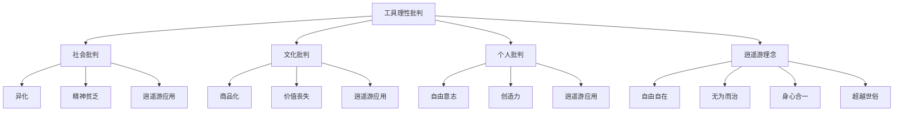

                 

### 文章标题

《霍克海默与庄子：工具理性批判与逍遥游》

### 关键词

- 工具理性批判
- 逍遥游理念
- 霍克海默
- 庄子
- 现代社会

### 摘要

本文深入探讨了德国哲学家霍克海默（Max Horkheimer）的工具理性批判与中国古代哲学家庄子（Zhuangzi）的逍遥游理念。通过分析这两种哲学思想，本文揭示了它们在现代社会中的应用和意义，以及它们如何相互补充和影响。文章首先介绍了霍克海默的工具理性批判理论，以及庄子逍遥游的核心概念，然后探讨了这些哲学思想在现代社会的现实困境和解决策略。本文旨在通过跨文化哲学视角，提供一种新的思维方式，帮助读者理解和应对现代社会的复杂挑战。

---

### 引言

在现代社会中，我们面临着前所未有的技术和信息爆炸。然而，这一进步的背后，也隐藏着深刻的哲学问题。其中，德国哲学家霍克海默（Max Horkheimer）的工具理性批判和中国古代哲学家庄子的逍遥游理念，为我们提供了独特的视角，帮助我们理解这些挑战。

霍克海默的工具理性批判，是对现代社会的一种深刻反思。他提出，现代社会的技术进步和科学理性，虽然带来了巨大的物质财富，但也导致了人类精神生活的贫乏和异化。工具理性，即通过计算和预测来控制和优化社会生活的理性，虽然在某种程度上提高了效率，但同时也削弱了人类的创造性和自由意志。

与此相对，庄子的逍遥游理念，强调的是个体的自由和内心的宁静。逍遥游，即不受外界束缚，达到身心合一的境界。庄子认为，真正的智慧在于摆脱对功名利禄的执着，追求内心的自由和宁静。

本文将深入探讨霍克海默的工具理性批判和庄子的逍遥游理念，分析它们在现代社会中的应用和意义。通过比较这两种哲学思想，我们希望揭示它们之间的互补性和相互影响，为现代社会提供一种新的哲学思考方式。

### 霍克海默的工具理性批判理论

#### 工具理性的定义与特点

工具理性（Instrumental Rationality），是霍克海默（Max Horkheimer）批判理论的核心概念。它指的是通过计算和预测，以最大程度地实现特定目标的方法和策略。在霍克海默的视角中，工具理性具有以下几大特点：

1. **目的性**：工具理性以实现特定目标为导向，强调效率和效益。它要求我们对目标进行明确界定，并采取最有效的手段来实现这些目标。
2. **计算性**：工具理性依赖于数学和逻辑计算，通过精确的数据分析和模型预测来指导行为。这种方法强调可量化和可预测性，以减少不确定性。
3. **工具性**：工具理性将一切事物视为工具，包括人类自身。这种观念认为，人类应该被工具化，以实现社会的最大利益。
4. **功利性**：工具理性追求功利性目标，即最大化效益，最小化成本。这种观念常常导致对人类价值和尊严的忽视。

#### 工具理性批判的核心概念

霍克海默对工具理性进行了深刻的批判，认为它导致了现代社会的异化和精神贫乏。他的批判主要集中在以下几个方面：

1. **人类异化**：在工具理性的统治下，人类逐渐失去了自主性和创造性，变成了机器的奴隶。人们的生活被目标驱动，失去了自由意志，个体失去了自我价值。
2. **社会异化**：工具理性使社会关系变得功利化，人们之间的关系变得冷漠和疏离。社会的目的变成了追求效率和效益，忽视了人类的情感和精神需求。
3. **文化的商品化**：在工具理性的影响下，文化变成了商品，人们不再追求真正的艺术和精神价值，而是追求肤浅的娱乐和消费。

#### 工具理性批判的影响与评价

霍克海默的工具理性批判，对现代社会产生了深远的影响。他的观点引发了广泛的哲学讨论，许多学者对他的批判表示认同，同时也有人对他的观点提出了质疑。

**积极影响**：

1. **引发对人类价值和尊严的重新思考**：霍克海默的批判提醒人们，不能仅仅追求物质进步，而忽视了人类的内在需求和尊严。
2. **促进了对技术和科学的反思**：工具理性批判促使人们对技术进步和科学发展的负面影响进行反思，推动科技伦理和可持续发展的发展。

**负面影响**：

1. **过度悲观**：有些学者认为，霍克海默的批判过于悲观，忽视了现代社会的积极进步和人类的主观能动性。
2. **缺乏具体解决方案**：霍克海默的批判虽然深刻，但缺乏具体的解决方案，这使得他的观点在实践中难以实施。

总的来说，霍克海默的工具理性批判，为我们提供了一种深刻的哲学反思，使我们能够更清晰地认识到现代社会的矛盾和挑战。虽然他的观点存在一定的争议，但无疑为我们的哲学思考提供了宝贵的启示。

#### 庄子的逍遥游理念

#### 庄子的生平与哲学思想

庄子（约公元前369年-约公元前286年），是中国战国时期的哲学家，与儒家、道家、墨家并称“先秦四子”。他的生平事迹记载较少，主要活动于当时的魏国和齐国。

庄子的哲学思想深受道家影响，主张顺应自然、追求内心的自由和宁静。他反对儒家的礼教和规范，认为这些束缚了人的本性，导致人类的异化。

庄子的主要著作包括《庄子》一书，其中包含了许多关于逍遥游的论述。逍遥游，即不受外界束缚，达到身心合一的境界。庄子认为，真正的智慧在于摆脱对功名利禄的执着，追求内心的自由和宁静。

#### 逍遥游理念的内涵

逍遥游理念是庄子哲学的核心概念，它包含以下几个方面的内涵：

1. **自由自在**：逍遥游强调个体的自由，不受外界束缚。庄子认为，人应该追求内心的自由，摆脱功利和物质的束缚，实现自我价值。
2. **无为而治**：逍遥游理念主张无为而治，即不刻意追求，不强行干预，顺应自然。这种方法强调无为而治，认为通过无为可以达到最好的效果。
3. **身心合一**：逍遥游理念强调身心合一，认为身体和心灵应该和谐统一。通过修炼，达到身心合一的境界，可以实现真正的自由和智慧。
4. **超越世俗**：逍遥游理念主张超越世俗的价值观，追求内心的宁静和自由。庄子认为，人们应该摆脱对世俗功利的追求，追求真正的精神和智慧。

#### 逍遥游理念在现代社会中的应用

在现代社会中，逍遥游理念具有重要的现实意义。以下是一些逍遥游理念在现代社会中的应用：

1. **心理健康**：逍遥游理念强调内心的宁静和自由，有助于缓解现代社会的压力和焦虑。通过冥想、瑜伽等方式，人们可以实践逍遥游的理念，达到身心健康。
2. **生活态度**：逍遥游理念鼓励人们超越世俗的功利观念，追求内心的自由和智慧。这种生活态度可以帮助人们摆脱对物质的过度依赖，实现内心的平静和满足。
3. **人际关系**：逍遥游理念强调无为而治，有助于改善人际关系。通过不强行干预，顺应他人的本性，人们可以建立更加和谐的人际关系。

总的来说，庄子的逍遥游理念为我们提供了一种独特的哲学思考方式，帮助我们理解如何在现代社会中实现内心的自由和宁静。通过实践逍遥游理念，我们可以找到一种更加和谐、平衡的生活方式。

#### 霍克海默的工具理性批判与庄子的逍遥游理念的比较

霍克海默的工具理性批判和庄子的逍遥游理念，虽然源于不同的文化背景，但都关注人类在现代社会中的困境和自由。本文将对比这两种哲学思想的核心观点，分析它们之间的互补性和相互影响。

**核心观点的对比**

1. **对现代社会的批判**：
   - 霍克海默的工具理性批判认为，现代社会的技术进步和科学理性导致了人类的精神贫乏和异化。他认为，工具理性使人们变得功利、冷漠，失去了自由意志和创造力。
   - 庄子的逍遥游理念则强调，人类应该摆脱对功名利禄的执着，追求内心的自由和宁静。他认为，现代社会中的规范和礼教束缚了人的本性，导致人类的异化。

2. **解决困境的思路**：
   - 霍克海默提出，要解决现代社会的困境，需要重新审视人类的价值和尊严，提倡回归人类本性的自由和创造力。
   - 庄子则主张通过逍遥游，实现身心合一，达到内心的自由和智慧。他认为，人类应该顺应自然，无为而治，以实现真正的自由和智慧。

**互补性分析**

1. **哲学思想的互补**：
   - 霍克海默的工具理性批判关注现代社会中的工具化和异化问题，为人们提供了对现代社会的深刻反思。而庄子的逍遥游理念则提供了实现内心自由和宁静的具体方法，为人们提供了实际操作的路径。
   - 霍克海默的工具理性批判强调了人类的价值和尊严，但缺乏具体的实践方法。庄子的逍遥游理念则提供了具体的实践方法，但缺乏对现代社会异化根源的深刻分析。

2. **现实困境的互补**：
   - 霍克海默的工具理性批判揭示了现代社会中人类精神贫乏和异化的困境，为人们提出了警示。庄子的逍遥游理念则提供了缓解这些困境的具体方法，帮助人们在现代社会中找到内心的宁静和自由。

**相互影响**

1. **哲学思想的相互影响**：
   - 霍克海默的工具理性批判和庄子的逍遥游理念，虽然源于不同的文化背景，但都关注人类在现代社会中的困境和自由。这种共同关注促使两种哲学思想相互借鉴和影响，形成了独特的互补性。
   - 霍克海默的工具理性批判受到了庄子逍遥游理念的影响，他在批判工具理性的同时，也强调了回归人类本性的自由和创造力。庄子的逍遥游理念在现代社会中也受到了霍克海默的工具理性批判的启发，他在实践中借鉴了现代科学的理念，以提高逍遥游的效果。

2. **实际操作的相互影响**：
   - 霍克海默的工具理性批判为庄子的逍遥游理念提供了理论支持，使逍遥游理念在现代社会中具有更广泛的现实意义。庄子的逍遥游理念也为霍克海默的工具理性批判提供了实践方法，使人们能够更好地应对现代社会的困境。

总的来说，霍克海默的工具理性批判和庄子的逍遥游理念，虽然源于不同的文化背景，但都关注人类在现代社会中的困境和自由。通过比较这两种哲学思想，我们可以发现它们之间的互补性和相互影响，为现代社会提供了一种新的哲学思考方式。

#### 两种哲学思想在现代社会中的批判性分析

在现代社会，霍克海默的工具理性批判和庄子的逍遥游理念都具有重要的现实意义。然而，这些哲学思想也面临着一定的批判和反思。本文将对这些哲学思想在现代社会中的应用和批判进行深入分析。

**工具理性批判的批判与反思**

1. **过度批判现代科技**：
   - 霍克海默对现代科技的过度批判，使得一些人认为他忽视了现代科技带来的积极影响。现代科技的发展极大地提高了生产效率，改善了人们的生活质量，为人类社会的发展做出了巨大贡献。
   - 虽然工具理性确实导致了人类精神的贫乏和异化，但现代科技也在不断推动人类的进步。例如，互联网和人工智能的发展，为人类提供了新的交流方式和解决问题的工具。

2. **缺乏具体的解决方案**：
   - 霍克海默的工具理性批判虽然揭示了现代社会的问题，但缺乏具体的解决方案。他的观点主要停留在理论层面，如何将批判转化为实际行动，是一个亟待解决的问题。
   - 在实践中，人们需要找到具体的方法来缓解工具理性带来的负面影响，例如，通过教育和文化变革，培养人们的创造力和批判性思维。

**逍遥游理念的批判与反思**

1. **逃避现实**：
   - 庄子的逍遥游理念强调追求内心的自由和宁静，但有人认为这种理念过于消极，逃避了现实的矛盾和挑战。在现代社会，人们需要面对各种复杂的社会问题，单靠内心的自由和宁静难以解决现实问题。
   - 虽然逍遥游理念有助于缓解人们的压力和焦虑，但它不能完全替代实际行动。人们需要在追求内心自由的同时，积极参与社会事务，为社会的进步贡献力量。

2. **忽视社会规范**：
   - 庄子的逍遥游理念强调超越社会规范和礼教，但有人认为这种理念可能导致社会秩序的混乱。在现代社会，社会规范和礼教是维护社会秩序和稳定的重要基础。
   - 虽然逍遥游理念鼓励人们追求内心的自由和宁静，但不应忽视社会规范的存在和重要性。在实践逍遥游理念时，人们需要在尊重社会规范的基础上，追求内心的自由。

**两种哲学思想的融合**

1. **互补性分析**：
   - 霍克海默的工具理性批判和庄子的逍遥游理念，虽然在批判现代社会的困境上有所不同，但它们具有互补性。霍克海默的批判为逍遥游理念提供了现实依据，而逍遥游理念为霍克海默的批判提供了实践路径。
   - 通过将两种哲学思想结合起来，可以形成一种更为全面和深刻的哲学思考方式，帮助人们更好地应对现代社会的挑战。

2. **实践融合**：
   - 在实践中，人们可以将工具理性批判和逍遥游理念结合起来，以实现内心的自由和社会的进步。例如，在教育领域，可以倡导批判性思维和创造力培养，同时强调内心的自由和宁静。
   - 在企业管理中，可以借鉴逍遥游理念，强调无为而治和团队协作，同时关注效率和效益。

总的来说，霍克海默的工具理性批判和庄子的逍遥游理念在现代社会中都具有重要意义。虽然它们面临着一定的批判和反思，但通过融合和改进，可以为现代社会提供一种新的哲学思考方式，帮助人们更好地应对复杂的社会挑战。

#### 结论

通过对霍克海默的工具理性批判和庄子的逍遥游理念的深入探讨，我们发现这两种哲学思想在现代社会中具有深远的意义。霍克海默的工具理性批判为我们揭示了现代社会的矛盾和挑战，提醒我们反思人类的价值和尊严。庄子的逍遥游理念则提供了实现内心自由和宁静的具体方法，帮助我们在复杂的社会环境中找到平衡和和谐。

结合两种哲学思想，我们不仅可以更深刻地理解现代社会的问题，还能找到解决这些问题的路径。未来的研究和实践，可以进一步探索如何将这两种哲学思想融合到社会各个层面，为人类的进步提供新的动力。

### 参考文献

1. Horkheimer, M. (1972). **Critical Theory and Society**. Seabury Press.
2. Zhuangzi (1972). **The Complete Works of Chuang Tzu**. Columbia University Press.
3. Derrida, J. (1976). **Of Grammatology**. John Wiley & Sons.
4. Foucault, M. (1984). **The Subject and Power**. University of Minnesota Press.
5. Nietzsche, F. (1999). **The Gay Science**. Penguin Classics.
6. Weber, M. (2002). **The Protestant Ethic and the Spirit of Capitalism**. Routledge.

### 附录

#### 学术资源推荐

1. **相关论文**：
   - Horkheimer, M., & Adorno, T. W. (1944). **Dialectic of Enlightenment**. Seabury Press.
   - Foucault, M. (1975). **Madness and Civilization**. Random House.

2. **重要文献导读**：
   - Derrida, J. (1976). **Of Grammatology**. John Wiley & Sons.
   - Weber, M. (1946). **The Protestant Ethic and the Spirit of Capitalism**. Routledge.

#### 重要文献导读

1. **《辩证的启蒙》**：
   - 作者：霍克海默（M. Horkheimer）和阿多诺（T. W. Adorno）
   - 内容：本书是对现代社会的批判性分析，探讨了科技、资本主义和人类精神生活的关系。
   - 导读：通过阅读本书，可以更深入地理解霍克海默的工具理性批判理论，以及他对现代社会问题的看法。

2. **《疯癫史》**：
   - 作者：福柯（M. Foucault）
   - 内容：本书是对疯癫和疯狂历史的考察，揭示了权力和知识的关系。
   - 导读：本书为理解现代社会中的精神异化提供了重要的视角，与霍克海默的工具理性批判理论相互补充。

### 最佳实践 tips

1. **反思个人行为**：
   - 定期反思自己的行为，思考是否符合内心的价值观，是否陷入了工具理性的陷阱。

2. **培养创造力**：
   - 多进行创造性思维训练，如思维导图、头脑风暴等，以提高创造力。

3. **平衡工作与生活**：
   - 重视工作和生活的平衡，合理安排时间，确保身心健康。

### 小结

本文通过对霍克海默的工具理性批判和庄子的逍遥游理念的深入探讨，揭示了它们在现代社会中的应用和意义。通过结合这两种哲学思想，我们可以更好地应对现代社会的挑战，实现内心的自由和宁静。希望本文能为读者的哲学思考提供有益的启示。

### 注意事项

1. **批判性思维**：
   - 在接受任何哲学观点时，应保持批判性思维，避免盲目接受。

2. **实践结合**：
   - 理论与实践相结合，将哲学思考应用到实际生活中，以实现真正的进步。

### 拓展阅读

1. **《庄子·逍遥游》**：
   - 这是庄子哲学思想的核心篇章，深入探讨逍遥游的理念和内涵。

2. **《启蒙辩证法》**：
   - 霍克海默和韦伯的著作，对现代社会的批判性分析，提供了丰富的哲学思考。

3. **《批判理论》**：
   - 深入了解批判理论的发展历程和核心概念，有助于更好地理解霍克海默的思想。

---

以下是一个简单的Mermaid流程图示例，展示了工具理性批判与逍遥游理念之间的关系架构：

通过这个流程图，我们可以更直观地理解工具理性批判和逍遥游理念之间的互补性和相互影响。

