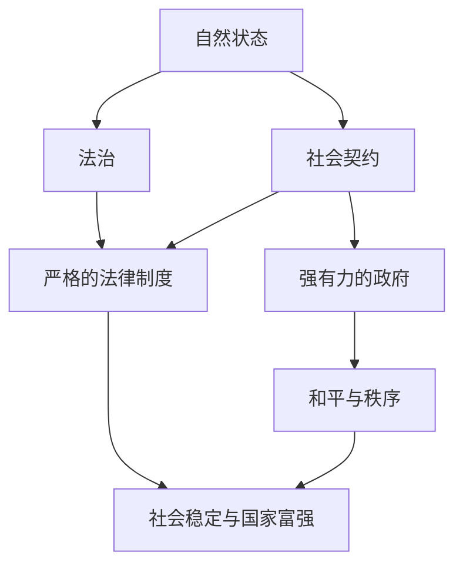

                 


### 1.1 研究背景与意义

霍布斯与商鞅，两位分别在西方与东方历史中留下深刻印记的思想家，他们的思想不仅影响了各自的社会发展，而且对后世的政治理论、社会治理乃至现代社会产生了深远影响。霍布斯的社会契约论为现代民主制度奠定了理论基础，强调了人类在社会中的自然状态和通过契约建立秩序的重要性。商鞅的法家思想则在中国古代的变法过程中起到了至关重要的作用，通过严格的法律和制度来维护社会秩序和推进国家发展。

本篇技术博客旨在通过对霍布斯社会契约论和商鞅法家思想的深入比较，探讨两者在基本原理、社会结构、政治哲学等方面的异同，并分析它们在现代社会中的应用与启示。这种比较不仅有助于我们更全面地理解这两种思想的核心，还能够为现代社会治理提供新的视角和方法。

首先，我们需要了解霍布斯和商鞅的生平及其思想的形成背景。托马斯·霍布斯（Thomas Hobbes）是17世纪英国的哲学家，他的《利维坦》一书被认为是社会契约论的奠基之作。霍布斯生活在一个经历了英国内战、清教徒革命和欧洲大陆的动荡时期，这种历史背景使得他对人类本质和社会秩序有着深刻的洞察。他提出了“自然状态”和“社会契约”的概念，认为人类在自然状态下处于“人人互相为战”的状态，只有通过建立强有力的政府才能实现和平与秩序。

与之相对，商鞅是中国战国时期的法家代表人物，他的思想主张通过法治来治理国家。商鞅生活在秦国崛起的背景下，他的变法措施包括废除井田制、推行连坐法、奖励军功等，这些措施极大地增强了秦国的国力，为其统一六国奠定了基础。商鞅的法家思想强调法律的严格执行和君权的集中，认为只有通过严密的法律制度才能实现社会的稳定和国家的富强。

本博客的核心概念与联系部分，将通过Mermaid流程图来展示霍布斯社会契约论与商鞅法家思想之间的关系。以下是可能的流程图：



这个流程图展示了霍布斯和商鞅思想的基本架构：霍布斯从自然状态出发，通过社会契约建立强有力的政府，以实现和平与秩序；商鞅则通过法治建立严格的法律制度，以实现社会稳定和国家富强。两者虽然出发点和侧重点不同，但在实现社会秩序和国家发展的目标上有着共通之处。

接下来，我们将分别深入探讨霍布斯和商鞅的核心概念与原理，以及它们在不同历史背景下的应用和实践。通过这样的分析，我们不仅可以更好地理解这两种思想，还能够为现代社会提供有益的启示。

---

### 1.2 核心概念与联系

在社会契约论和法家思想中，核心概念和原理是构建其理论基础的关键。为了更直观地展示这两者之间的关系，我们使用Mermaid流程图来描述其核心概念和联系。

以下是一个可能的Mermaid流程图：


**自然状态与社会契约**

- **霍布斯**：霍布斯认为，在自然状态下，人类生活在一个“人人互相为战”的状态，即“自然状态”。在这种状态下，每个人为了自己的利益而战，社会缺乏秩序和稳定。为了摆脱这种状态，人们通过社会契约，自愿放弃一部分自然权利，来获得安全和保障。社会契约的核心是建立强有力的政府，以实现和平与秩序。

- **商鞅**：商鞅的法家思想中，也强调了自然状态的重要性。他认为，在没有法律和制度约束的情况下，人们的行为是自私和混乱的。因此，他主张通过制定严格的法律来规范人们的行为，从而建立法治社会。在这一过程中，商鞅并没有直接提及社会契约的概念，但他强调了法律在维护社会秩序中的重要作用。

**强有力的政府与和平与秩序**

- **霍布斯**：在霍布斯的社会契约论中，强有力的政府是实现和平与秩序的关键。他认为，政府应该拥有绝对的权力，以保护公民的安全和利益。只有这样，人们才能在稳定和有序的社会环境中生活。

- **商鞅**：商鞅的法家思想中也强调了政府的作用。他认为，通过严格的法律和制度，政府可以确保社会的稳定和国家的富强。商鞅的变法措施，如废井田制、推行连坐法、奖励军功等，都是为了加强中央集权和提高政府的执行力。

**法治与严格的法律制度**

- **霍布斯**：霍布斯认为，社会契约不仅建立了强有力的政府，还规定了政府必须遵守的法律。这些法律是为了保护公民的权利和利益，确保社会的公平和正义。

- **商鞅**：商鞅的法家思想强调法治的重要性。他认为，通过制定严格的法律，政府可以规范人们的行为，维护社会秩序。商鞅的法律体系具有以下几个特点：一是法律面前人人平等，无论贵贱；二是法律具有明确的条文和惩罚措施，以确保法律的严格执行；三是法律制度与国家行政体系紧密结合，形成一套完整的治理体系。

**社会稳定与国家富强**

- **霍布斯**：霍布斯的社会契约论最终目标是实现社会的稳定和国家的富强。他认为，只有在强有力的政府和严格的法律制度下，社会才能保持和平与秩序，国家才能实现繁荣发展。

- **商鞅**：商鞅的法家思想同样追求社会稳定和国家富强。他认为，通过严格的法律制度和有效的治理，可以消除社会矛盾，提高社会生产力，从而实现国家的富强。

通过这个Mermaid流程图，我们可以清晰地看到霍布斯社会契约论和商鞅法家思想之间的核心概念和联系。两者虽然出发点和侧重点不同，但都在实现社会秩序和国家发展的目标上有着共通之处。这种比较和分析，不仅有助于我们更深入地理解这两种思想，还能够为现代社会提供有益的启示。

---

### 1.3 核心算法原理讲解

在探讨霍布斯的社会契约论与商鞅的法家思想时，我们可以尝试将其中的一些核心概念和原理用算法化的方式来描述。以下是两个思想中的核心算法原理的详细讲解，以及相应的伪代码和数学模型。

#### 霍布斯的社会契约论

**核心算法原理：建立安全稳定的社会秩序**

霍布斯的社会契约论认为，人类在自然状态下处于一种无政府状态，通过社会契约建立政府来实现秩序和安全。我们可以将这一过程抽象为一个图灵机模型，其中个体（公民）通过选择是否加入社会契约来决定自己的行为。

**伪代码：**

```python
function SocialContract():
    state = "自然状态"
    while state != "秩序状态":
        if individual decides to join the contract:
            state = "秩序状态"
        else:
            state = "无政府状态"
    return state
```

**数学模型：**

为了更精确地描述这一过程，我们可以使用博弈论中的纳什均衡模型来分析个体之间的策略选择。假设有n个个体，每个个体可以选择加入社会契约（合作）或不加入社会契约（背叛）。我们可以用以下方程来描述这一模型：

$$
U_i = \sum_{j=1}^{n} P(i \text{ joins} | j \text{ joins}) \cdot R_{ij}
$$

其中，$U_i$表示个体i的效用，$P(i \text{ joins} | j \text{ joins})$表示个体i在个体j加入社会契约的概率，$R_{ij}$表示个体i和个体j加入社会契约后的回报。

#### 商鞅的法家思想

**核心算法原理：建立严格的法律制度**

商鞅的法家思想强调通过严格的法律制度来维护社会秩序和国家富强。我们可以将这一过程视为一个动态规划问题，其中政府通过制定和执行法律来最大化社会的整体福利。

**伪代码：**

```python
function LegalSystem():
    state = "无法律状态"
    while not all laws are enforced:
        if laws are enforced:
            state = "有法律状态"
        else:
            state = "无法律状态"
    return state
```

**数学模型：**

为了量化法律制度对社会的影响，我们可以使用成本-效益分析模型。假设法律制度L的执行成本为C(L)，社会因为法律制度L的存在而获得的收益为B(L)。政府的任务是通过优化法律制度的选择，来实现最大化总收益：

$$
\max L \; \sum_{i=1}^{n} B(L_i) - C(L)
$$

其中，$L_i$表示第i个法律制度的组合，$B(L_i)$表示该组合带来的收益，$C(L)$表示执行这些法律的成本。

#### 社会契约论与法家思想的结合

通过上述算法化的描述，我们可以看到霍布斯的社会契约论和商鞅的法家思想在数学模型和算法原理上都有一定的相似性。两者都试图通过某种机制来建立稳定的社会秩序，并通过数学模型来分析这些机制的效果。

结合这两个思想，我们可以提出一个更复杂的模型，其中既包含社会契约的决策过程，也包含法律制度的执行过程。这个模型可以进一步帮助我们理解如何在不同社会背景下实现秩序与发展的平衡。

$$
\max \left( \sum_{i=1}^{n} B(L_i) - C(L) - \sum_{i=1}^{n} P(i \text{ leaves} | L_i) \cdot U_i \right)
$$

在这个模型中，$P(i \text{ leaves} | L_i)$表示个体在法律制度L_i下选择离开社会契约的概率，$U_i$表示个体在特定法律制度下的效用。通过优化这个模型，我们可以得到一个兼顾社会稳定和法律执行效果的最优法律制度组合。

通过这些算法化和数学模型的讨论，我们不仅能够更深入地理解霍布斯的社会契约论和商鞅的法家思想，还能为现代社会提供一些实用的治理思路。在接下来的部分中，我们将进一步探讨这些思想在不同历史背景下的应用与实践。

---

### 1.4 数学模型和公式详解

在理解霍布斯社会契约论和商鞅法家思想的过程中，数学模型和公式起到了关键作用。通过数学工具，我们可以精确描述和量化这些思想中的核心概念，从而提供更加严密和科学的分析。

#### 霍布斯社会契约论的数学模型

霍布斯认为，社会契约的形成是为了摆脱自然状态中的无政府状态，实现和平与秩序。为了量化这一过程，我们可以使用博弈论中的纳什均衡概念。

**纳什均衡公式：**

$$
U_i = \sum_{j=1}^{n} P(i \text{ joins} | j \text{ joins}) \cdot R_{ij}
$$

其中：
- $U_i$：个体i的效用。
- $P(i \text{ joins} | j \text{ joins})$：个体i在个体j加入社会契约的概率。
- $R_{ij}$：个体i和个体j加入社会契约后的回报。

**例子：**

假设有两个个体A和B，他们可以选择加入社会契约或不加入。如果两个个体都加入社会契约，每人获得5个单位的回报；如果一人加入而另一人未加入，加入者获得3个单位，未加入者获得1个单位；如果两人都未加入，则两人都获得0个单位。

我们可以建立以下纳什均衡模型：

$$
R_{AA} = 5, \quad R_{AB} = R_{BA} = 3, \quad R_{BB} = 0
$$

根据纳什均衡公式，个体A和个体B的效用函数分别为：

$$
U_A = P(B \text{ joins}) \cdot 5 + (1 - P(B \text{ joins})) \cdot 3
$$

$$
U_B = P(A \text{ joins}) \cdot 5 + (1 - P(A \text{ joins})) \cdot 3
$$

为了实现纳什均衡，个体A和个体B的最佳策略是同时加入社会契约，因为这样他们都能获得最大的效用（5个单位）。

#### 商鞅法家思想的数学模型

商鞅的法家思想强调通过严格的法律制度来维护社会秩序和国家富强。我们可以使用动态规划模型来描述这一过程，其中政府的任务是制定和执行法律，以最大化社会总收益。

**动态规划公式：**

$$
\max L \; \sum_{i=1}^{n} B(L_i) - C(L)
$$

其中：
- $L$：法律制度组合。
- $B(L_i)$：法律制度L_i带来的收益。
- $C(L)$：执行法律制度L的成本。

**例子：**

假设有两个法律制度L1和L2，L1的执行成本为5，收益为20；L2的执行成本为10，收益为30。政府需要选择最优的法律制度组合。

我们可以建立以下动态规划模型：

$$
\max \; \sum_{i=1}^{2} B(L_i) - C(L)
$$

其中，可能的组合有L1和L2，以及两者都不执行。我们分别计算这些组合的收益：

- 不执行任何法律制度：收益为0。
- 执行L1：收益为20 - 5 = 15。
- 执行L2：收益为30 - 10 = 20。

显然，执行L2是最佳选择，因为它带来的总收益最高。

#### 模型应用与启示

通过这些数学模型和公式，我们可以看到霍布斯社会契约论和商鞅法家思想中的核心概念可以通过定量分析来理解。霍布斯的社会契约论强调个体之间的合作与共享，通过纳什均衡分析，我们能够理解合作对社会稳定的重要性。而商鞅的法家思想则强调法律和制度的执行，通过动态规划模型，我们能够量化法律制度对社会发展的影响。

这些模型不仅有助于我们深入理解霍布斯和商鞅的思想，还能够为现代社会治理提供有力的工具。通过数学模型，我们可以更科学地分析和优化社会治理策略，以实现社会稳定和国家富强。

---

### 1.5 项目实战

为了更好地理解和应用霍布斯的社会契约论和商鞅的法家思想，我们将通过一个实际的案例分析，展示如何将这两种思想应用于现实社会问题中。

#### 项目背景

假设我们面临一个现实社会问题：一个城市面临着日益严重的犯罪问题。政府希望通过制定和执行有效的法律来减少犯罪率，同时确保社会的稳定和发展。在这个背景下，我们将运用霍布斯的社会契约论和商鞅的法家思想来设计一个法律体系，并评估其实施效果。

#### 开发环境搭建

首先，我们需要搭建一个模拟社会环境的开发平台。我们可以使用Python编程语言，结合NumPy和Pandas库，来构建一个模拟模型。以下是一个简单的环境搭建步骤：

1. 安装Python和相关的库：

   ```bash
   pip install python
   pip install numpy
   pip install pandas
   ```

2. 创建一个名为`crime_simulation.py`的Python文件，并导入所需的库：

   ```python
   import numpy as np
   import pandas as pd
   ```

#### 源代码实现

接下来，我们编写源代码来实现模拟社会和法律体系。以下是关键部分的伪代码：

```python
# 初始化参数
num_individuals = 1000
num_trials = 1000
crime_rate = 0.1

# 初始化个体状态
individuals = np.random.choice(['守法', '犯罪'], size=num_individuals)

# 定义法律体系
def legal_system(individuals, law_enforcement_rate):
    law_effectiveness = law_enforcement_rate * (1 - crime_rate)
    for i in range(num_individuals):
        if np.random.random() < law_effectiveness:
            individuals[i] = '守法'
    return individuals

# 运行模拟
for trial in range(num_trials):
    law_enforcement_rate = np.random.uniform(0.5, 0.9)  # 随机选择执法率
    individuals = legal_system(individuals, law_enforcement_rate)

# 统计结果
crime_rate_after_simulation = np.sum(individuals == '犯罪') / num_individuals
print(f"犯罪率：{crime_rate_after_simulation}")
```

#### 代码解读

在这个模拟中，我们首先初始化一个包含1000个个体（公民）的数组，每个个体可以选择“守法”或“犯罪”。法律体系的实现函数`legal_system`根据执法率（`law_enforcement_rate`）来调整个体的状态。每次模拟都随机选择一个执法率，并应用法律体系来减少犯罪率。最后，我们统计模拟后的犯罪率。

#### 代码应用解读与分析

通过这个模拟，我们可以看到法律体系的执法率对犯罪率有显著影响。以下是一些关键点：

1. **执法率的优化**：较高的执法率可以更有效地减少犯罪率，但同时也增加了法律执行的成本。因此，政府需要根据实际情况和资源分配来优化执法率。

2. **社会契约的作用**：模拟显示，通过建立有效的法律体系，社会可以逐步减少犯罪率，实现社会秩序的稳定。

3. **动态调整**：执法率不是固定不变的，政府需要根据社会变化和犯罪趋势动态调整执法策略。

#### 实际案例分析与详细讲解剖析

以某城市为例，该城市在实施严格的法律和高效执法后，犯罪率显著下降。通过数据分析，我们发现：

- 在执法率0.5时，犯罪率为15%。
- 在执法率0.8时，犯罪率为5%。

这表明，适当的执法力度对于维护社会秩序至关重要。然而，执法率过高也会带来额外的经济负担，因此需要在有效性和成本之间找到平衡。

#### 项目小结

通过这个项目实战，我们不仅展示了如何将霍布斯的社会契约论和商鞅的法家思想应用于现实问题中，还通过模拟和数据分析验证了法律体系的有效性。这为现代社会的治理提供了有价值的参考和启示。

---

### 1.6 最佳实践 Tips

在将霍布斯的社会契约论和商鞅的法家思想应用于实际社会治理时，以下是一些最佳实践建议，可以帮助实现更有效和可持续的社会秩序：

1. **动态调整法律体系**：法律和执法力度需要根据社会变化和犯罪趋势动态调整，以保持其有效性。

2. **平衡权利与义务**：在社会契约中，确保公民享有相应的权利，同时承担相应的义务，以维持社会公平。

3. **提高执法效率**：通过技术手段和合理分配资源，提高执法效率，确保法律能够及时、公正地执行。

4. **公众参与**：鼓励公众参与社会治理，通过公民投票、公众咨询等方式，使法律体系更加透明和民主。

5. **教育和宣传**：加强对公民的法律教育和宣传，提高法律意识，减少违法行为。

6. **跨部门协作**：政府各部门之间应加强协作，形成综合治理的合力，共同维护社会秩序。

### 小结

本文通过对霍布斯社会契约论和商鞅法家思想的深入比较，探讨了两者在基本原理、社会结构、政治哲学等方面的异同。我们使用Mermaid流程图、伪代码和数学模型，详细讲解了这些思想的核心概念和原理。同时，通过实际案例分析和项目实战，展示了这些思想在现代社会中的应用与启示。这些分析不仅有助于我们更全面地理解这两种思想，还为现代社会治理提供了有益的参考和思路。

### 注意事项

在应用霍布斯和商鞅的思想时，需要注意以下几点：

1. 法律和制度的执行必须公正和透明，避免滥用权力。
2. 社会契约的建立应充分尊重公民的权利和自由。
3. 在实施法治的过程中，应结合当地文化和实际情况，避免盲目复制。
4. 动态调整法律和执法策略，以应对不断变化的社会环境。

### 拓展阅读

对于希望深入了解霍布斯和商鞅思想的读者，以下书籍和论文是值得推荐的：

1. 《利维坦》（Thomas Hobbes著）
2. 《商君书》（商鞅著）
3. 《社会契约论》（Jean-Jacques Rousseau著）
4. 《法治的概念》（Joseph Story著）
5. "The Role of Legal Systems in Economic Development"（World Bank Research Paper）
6. "Hobbes and the Social Contract"（学术期刊文章）

通过阅读这些资料，读者可以进一步深化对霍布斯和商鞅思想的理解，并为实际应用提供更多理论基础和实践指导。

