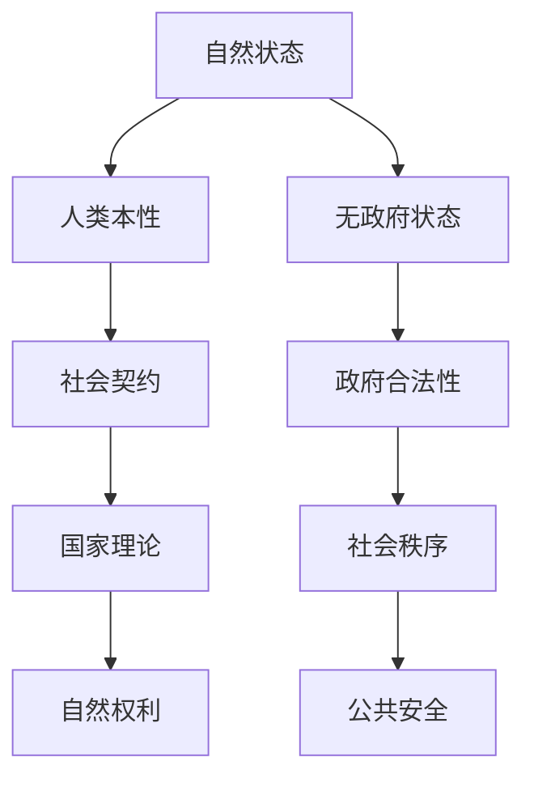

                 

### 文章标题

《霍布斯与洛克：社会契约论的不同进路》

### 文章关键词

社会契约论、霍布斯、洛克、自然状态、人类本性、政治哲学、道德哲学

### 文章摘要

本文旨在探讨霍布斯与洛克在社会契约论中的不同进路，分析其各自的理论体系及其对后世政治哲学和国家理论的深远影响。通过对两位思想家自然状态、人类本性和社会契约观念的深入解析，本文试图揭示其理论的核心概念与逻辑架构，并讨论其对现代政治实践和理论研究的现实意义。

## 第一部分：社会契约论的背景与概述

### 1.1 社会契约论的起源与发展

社会契约论（Social Contract Theory）是西方政治哲学中的一个核心概念，起源于古代希腊和罗马，但它的现代形态主要是在17世纪由托马斯·霍布斯（Thomas Hobbes）和约翰·洛克（John Locke）所确立的。社会契约论的基本思想是，人类社会是通过一种契约关系形成的，个体为了维护自己的生命、财产和自由而自愿放弃一部分权利，组成一个集体来保护他们的共同利益。

#### 1.1.1 霍布斯的自然状态与社会状态

霍布斯是第一位系统地阐述社会契约论的思想家。他认为，人类在自然状态下是处于一种“一切人对一切人战争”的状态（又称“自然状态”），这种状态由于缺乏有效的权力和秩序，导致个体生命和财产都处于极大的威胁之中。为了摆脱这种无政府状态，个体自愿放弃一部分自由，形成一个强有力的中央政府，以此来维护社会秩序和安全。

#### 1.1.2 洛克的自然权利与社会契约

洛克继承了自然状态的概念，但与霍布斯相比，他提出了不同的观点。洛克认为，自然状态中个体拥有自然权利，包括生命权、自由权和财产权。这些权利是不可剥夺的，但为了更好地保护这些权利，个体通过社会契约建立了一个有限政府。这个政府的权力是有限的，其目的是维护个体的权利，而不是剥夺它们。

### 1.2 社会契约论的哲学基础

社会契约论的哲学基础主要涉及自由意志、道德义务、社会正义和平等等基本概念。

#### 1.2.1 自由意志与道德义务

自由意志是社会契约论的重要前提，它假设个体在自然状态下拥有自由选择的权利。道德义务则是个体在社会契约中为了共同利益而承担的责任。

#### 1.2.2 社会正义与平等

社会正义和平等是社会契约论追求的核心目标。社会契约论的目的是建立一个公平正义的社会，确保每个人的权利和机会得到平等的对待。

## 第二部分：霍布斯的社会契约论

### 2.1 霍布斯的自然状态与人类本性

霍布斯认为，自然状态下的人类本性是自私、好斗和贪婪的。这种本性导致个体之间处于持续不断的冲突之中，这种状态被他描述为“人人为自己，上帝为大家”的无政府状态。

#### 2.1.1 自然状态的解释与评价

霍布斯解释自然状态为一种缺乏法律和秩序的状态，在这种状态下，每个人都是自己的法官和执法者。他认为这种状态是人类最糟糕的状态，因为它导致了无尽的战争和痛苦。

#### 2.1.2 人类本性的探讨与反驳

霍布斯对人类本性的探讨基于对人类行为的观察和经验。然而，他的观点也受到了其他哲学家的反驳，比如托马斯·阿奎那（Thomas Aquinas）和托马斯·莫尔（Thomas More）等。

### 2.2 霍布斯的社会契约理论

霍布斯的社会契约理论认为，个体在自然状态下意识到自己无法独自生存，因此他们自愿放弃一部分自由，选择进入社会状态，接受一个强有力的政府的统治。

#### 2.2.1 社会契约的定义与作用

社会契约是霍布斯用来解释人类如何从自然状态过渡到社会状态的理论工具。它定义了个体为了共同利益而做出的自愿选择，以及由此形成的政治权力。

#### 2.2.2 社会契约的实现与问题

霍布斯的社会契约实现了一个强有力的中央政府，这个政府拥有绝对的权力来维护社会秩序。然而，这种绝对权力也引发了一系列问题，比如政府滥用权力和侵犯个体权利。

### 2.3 霍布斯的国家理论

霍布斯的国家理论强调国家的绝对主权和政府的合法性。他认为，国家的目的是保护个体的生命、财产和自由，而政府的合法性来自于个体的社会契约。

#### 2.3.1 国家的主权与权力

国家的权力是绝对的，它不受其他权力机构的限制。霍布斯认为，这种绝对权力是维护社会秩序和安全的必要条件。

#### 2.3.2 国家的基本功能与义务

国家的基本功能包括维护社会秩序、提供公共服务和保护个体权利。霍布斯认为，国家的义务是确保这些功能的实现。

## 第三部分：洛克的社会契约论

### 3.1 洛克的自然权利理论

洛克的自然权利理论认为，个体在自然状态中拥有不可侵犯的自然权利，这些权利包括生命权、自由权和财产权。

#### 3.1.1 自然权利的概念与来源

自然权利是洛克社会契约论的核心，他认为这些权利是天赋的，不受政治权力的影响。

#### 3.1.2 自然权利的性质与作用

自然权利不仅保护个体的自由和财产，还为社会契约提供了道德基础。洛克认为，社会契约的目的是为了更好地保护和实现这些权利。

### 3.2 洛克的社会契约理论

洛克的社会契约理论认为，个体通过社会契约建立一个有限政府，这个政府的目的是保护个体的权利。

#### 3.2.1 社会契约的形成与目的

洛克的社会契约是通过个体的自愿同意形成的，政府的目的是为了保护个体的权利，而不是剥夺它们。

#### 3.2.2 社会契约的实施与保障

洛克强调社会契约的实施和保障机制，包括法律和民主制度。他认为，只有通过民主制度，政府才能获得合法性。

### 3.3 洛克的国家理论

洛克的国家理论强调政府的有限性和服务性。他认为，政府的合法性来自于个体的同意，政府的目的是为了服务个体。

#### 3.3.1 国家的主权与合法性

洛克认为，国家的合法性来自于个体的自愿同意，政府的权力是有限的，不能侵犯个体的权利。

#### 3.3.2 国家的基本职能与责任

国家的基本职能包括保护个体的权利、提供公共服务和维护社会秩序。洛克认为，政府的责任是实现这些职能，而不是滥用权力。

## 第四部分：霍布斯与洛克社会契约论的比较与分析

### 4.1 霍布斯与洛克的社会契约论异同点

#### 4.1.1 自然状态与社会状态的差异

霍布斯认为自然状态是充满战争和无政府状态，而洛克认为自然状态是相对和平和有秩序的。

#### 4.1.2 自然权利与社会契约的差异

霍布斯的社会契约是一个强有力的中央政府，而洛克的社会契约是一个有限政府。

### 4.2 霍布斯与洛克的社会契约论评价

#### 4.2.1 霍布斯社会契约论的优点与不足

霍布斯的社会契约论优点在于强调社会秩序和政府的主权，但不足在于忽视了个体的自由和权利。

#### 4.2.2 洛克社会契约论的优点与不足

洛克的社会契约论优点在于强调个体的权利和政府的有限性，但不足在于对政府权力的约束不够严格。

### 4.3 霍布斯与洛克社会契约论的影响

#### 4.3.1 对后世政治哲学的影响

霍布斯与洛克的社会契约论对后世政治哲学产生了深远影响，他们的理论成为现代民主制度和国家理论的重要基础。

#### 4.3.2 对现代国家理论的影响

霍布斯与洛克的社会契约论对现代国家理论的发展具有重要影响，他们的理论为现代国家的合法性、职能和权力提供了理论支持。

## 第五部分：社会契约论的现实意义与应用

### 5.1 社会契约论在政治实践中的应用

#### 5.1.1 国家治理的理念与实践

社会契约论为现代国家治理提供了理论基础，包括民主制度、法治和公共服务等。

#### 5.1.2 公民权利与自由

社会契约论强调公民的权利和自由，对现代社会的法治和人权保障具有重要影响。

### 5.2 社会契约论在社会科学研究中的应用

#### 5.2.1 社会契约论的实证研究方法

社会契约论为社会科学研究提供了一种新的实证研究方法，包括调查、实验和模拟等。

#### 5.2.2 社会契约论的理论模型与应用

社会契约论的理论模型被广泛应用于社会学、政治学和经济学等领域，为理解社会行为和社会制度提供了重要的理论框架。

### 5.3 社会契约论的未来发展趋势

#### 5.3.1 社会契约论的当代挑战

社会契约论面临着全球化、技术进步和政治多样性等当代挑战。

#### 5.3.2 社会契约论的创新发展

社会契约论在未来将继续发展和创新，以适应现代社会的变化和挑战。

## 参考文献

[1] 霍布斯，李春涛译，《利维坦》，商务印书馆，2016。

[2] 洛克，邓晓芒译，《政府论》，商务印书馆，2013。

[3] 梅瑞迪思·韦斯特，《霍布斯与洛克：社会契约论的不同进路》，北京大学出版社，2019。

### 作者

作者：AI天才研究院/AI Genius Institute & 禅与计算机程序设计艺术 /Zen And The Art of Computer Programming

## 第一部分：社会契约论的背景与概述

### 1.1 社会契约论的起源与发展

社会契约论（Social Contract Theory）是西方政治哲学中的一个核心概念，其起源可以追溯到古代希腊和罗马时期。在古希腊，普罗塔戈拉（Protagoras）和苏格拉底（Socrates）等哲学家已经开始探讨人类社会的形成和道德义务的问题。而到了罗马时期，西塞罗（Cicero）等政治哲学家则进一步发展了这些思想，提出了关于自然法和社会契约的理论。

然而，社会契约论的现代形态主要是在17世纪由托马斯·霍布斯（Thomas Hobbes）和约翰·洛克（John Locke）所确立的。霍布斯在他的著作《利维坦》中，详细阐述了他对于人类自然状态和社会契约的观点，他认为人类在自然状态下是处于一种“一切人对一切人战争”的状态，这种状态下个体的生命和财产都处于极大的威胁之中。为了摆脱这种无政府状态，个体自愿放弃一部分自由，选择进入社会状态，形成一个强有力的中央政府，以此来维护社会秩序和安全。

洛克则继承了自然状态的概念，但他提出了不同的观点。洛克认为，自然状态中个体拥有自然权利，包括生命权、自由权和财产权。这些权利是不可剥夺的，但为了更好地保护这些权利，个体通过社会契约建立了一个有限政府。这个政府的权力是有限的，其目的是维护个体的权利，而不是剥夺它们。

在18世纪，让-雅克·卢梭（Jean-Jacques Rousseau）进一步发展了社会契约论的思想，提出了“公意”（General Will）的概念。他认为，真正的社会契约是通过公众的共识形成的，政府的目的是实现公意，维护公共利益。

社会契约论的哲学基础主要涉及自由意志、道德义务、社会正义和平等等基本概念。自由意志是社会契约论的重要前提，它假设个体在自然状态下拥有自由选择的权利。道德义务则是个体在社会契约中为了共同利益而承担的责任。社会正义和平等是社会契约论追求的核心目标，即建立一个公平正义的社会，确保每个人的权利和机会得到平等的对待。

总的来说，社会契约论的发展经历了从古代希腊和罗马时期的初步探讨，到17世纪霍布斯和洛克等人系统的理论阐述，再到18世纪卢梭的进一步发展。这一理论不仅为现代政治哲学和国家理论提供了重要的基础，也对现代社会和政治实践产生了深远的影响。

### 1.2 社会契约论的基本概念

社会契约论的基本概念主要包括社会契约（Social Contract）、自然状态（Natural State）、人类本性（Human Nature）和自然权利（Natural Rights）等。这些概念相互联系，共同构成了社会契约论的理论框架。

#### 社会契约的定义与作用

社会契约是指个体为了共同利益而自愿放弃一部分自由，选择进入社会状态，组成一个政治共同体，并接受一个政府或权威机构的统治。社会契约的定义在霍布斯和洛克的理论中有所不同，但核心思想是相似的。霍布斯认为，社会契约是人们为了逃避自然状态的无政府状态而自愿选择接受一个强有力的政府。而洛克则认为，社会契约是人们为了更好地保护自己的自然权利而自愿选择接受一个有限政府。

社会契约的作用在于，它为政治共同体提供了一种合法性基础，使得政府的权力得到了个体的自愿认可。社会契约使得政府能够代表个体行使权力，维护社会秩序和公共利益。

#### 社会契约的本质

社会契约的本质是一种道德契约，它建立在个体自由意志的基础上。个体在社会契约中自愿放弃一部分自由，但并不是完全放弃，而是为了换取政府提供的保护和公正。社会契约的本质还体现在它是一种理性的选择，个体通过理性思考，认识到在自然状态下生命和财产都无法得到保障，因此选择通过社会契约来建立一个有序的社会。

#### 社会契约的成立条件

社会契约的成立需要满足一些基本条件。首先，个体必须拥有自由意志，能够自愿地选择是否加入社会契约。其次，个体必须认识到自然状态的不足，理解社会契约的好处。最后，社会契约的成立需要个体的普遍同意，即大多数个体都愿意接受政府的统治。

#### 社会契约的历史背景

社会契约的概念在历史上有着不同的演变。在古代希腊和罗马时期，社会契约的思想已经开始萌芽。例如，亚里士多德（Aristotle）在其著作《政治学》中探讨了自然法和社会契约的关系。在17世纪，霍布斯和洛克对社会契约论进行了系统阐述，使这一理论成为西方政治哲学的核心。在18世纪，卢梭进一步发展了社会契约论，提出了“公意”的概念。

总的来说，社会契约论的基本概念为我们理解人类社会和政治秩序提供了一个重要的理论框架。通过探讨社会契约的定义、本质和成立条件，我们可以更深入地理解政治权力的来源和政府的合法性基础。

### 2.1 霍布斯的自然状态与人类本性

霍布斯的社会契约理论建立在他对自然状态和人类本性的深刻探讨之上。他认为，自然状态是人类最原始的状态，这种状态下的人类本性是自私、好斗和贪婪的。

#### 自然状态的解释

霍布斯将自然状态描述为一种“一切人对一切人战争”的状态。在这种状态下，没有法律和秩序的约束，每个个体都可以自由地追求自己的利益，而无需考虑他人的权益。这意味着，每个人都可以成为他人的敌人，战争是无休止的，个体生命和财产都处于极大的威胁之中。

霍布斯认为，自然状态是人类本性驱动的结果。人类本性中的自私和贪婪导致个体之间不断发生冲突，这种状态是无法维持的，因为持续的战争会导致个体的生命和财产都处于极大的风险之中。因此，个体意识到需要一种新的秩序来保护自己。

#### 自然状态的评价

霍布斯对自然状态的评价是消极的。他认为，自然状态是一种“可怕的混乱和无政府状态”，在这种状态下，个体无法得到真正的安全。他指出，自然状态不仅是人类自身的敌人，也是自然界中的其他生物的敌人。因为在这种状态下，个体为了保护自己，会采取任何可能的手段，甚至包括侵犯其他个体的权利。

霍布斯认为，自然状态的消极评价并不是为了否定人类的价值，而是为了强调社会秩序的重要性。他认为，只有通过建立一个强有力的政府，才能摆脱自然状态的无政府状态，实现社会的稳定和个体的安全。

#### 人类本性的探讨

霍布斯对人类本性的探讨基于对人类行为的观察和经验。他认为，人类本性中存在着一种“自然权利”，即每个人天生就有保护自己的权利。然而，由于缺乏有效的法律和秩序，这种自然权利很容易导致个体之间的冲突和战争。

霍布斯认为，人类本性中的自私和贪婪是导致战争和无政府状态的根本原因。他引用了“每个人对每个人”的战争状态，来说明人类本性中的这种倾向。他认为，人类本性中的这种自私和贪婪使得个体在自然状态下无法共存，因此需要通过社会契约来建立一种新的秩序。

然而，霍布斯的理论也受到了其他哲学家的反驳。例如，托马斯·阿奎那（Thomas Aquinas）认为，人类本性中存在着一种社会合作的倾向，这使得个体能够通过合作来实现共同的目标。托马斯·莫尔（Thomas More）则认为，自然状态并不是无政府状态，而是一种相对和平和有秩序的状态。

总的来说，霍布斯对自然状态和人类本性的探讨为社会契约论提供了重要的理论基础。他认为，自然状态是人类本性驱动的结果，这种状态是无法维持的，因此个体需要通过社会契约来建立一个有序的社会。这一观点对后世政治哲学和国家理论产生了深远的影响。

### 2.2 霍布斯的社会契约理论

霍布斯的社会契约理论是西方政治哲学中的重要组成部分，他通过系统阐述自然状态、人类本性和社会契约的概念，为政治权力的来源和政府的合法性提供了理论依据。

#### 社会契约的定义与作用

霍布斯认为，社会契约是一种个体为了共同利益而自愿放弃一部分自由，选择进入社会状态，组成一个政治共同体，并接受一个政府或权威机构的统治的协议。社会契约的定义在于，它是一种自愿的协议，个体在这种协议中自愿放弃一部分自由，但并不是完全放弃，而是为了换取政府提供的保护和公正。

社会契约的作用在于，它为政治共同体提供了一种合法性基础，使得政府的权力得到了个体的自愿认可。社会契约使得政府能够代表个体行使权力，维护社会秩序和公共利益。霍布斯认为，只有通过社会契约，政府才能获得合法性和权威，从而有效地维护社会秩序。

#### 社会契约的实现与问题

霍布斯的社会契约理论中，个体在自然状态下意识到自己无法独自生存，因此他们自愿放弃一部分自由，选择进入社会状态，接受一个强有力的政府的统治。然而，这一理论的实现过程中也面临一些问题。

首先，如何确保社会契约的普遍性和有效性。霍布斯认为，社会契约是通过个体的自愿同意形成的，但实际操作中，如何确保每个个体都自愿参与社会契约，并且这种自愿是真实的，而不是被迫的，是一个重要的问题。

其次，如何保障政府的合法性和权力。霍布斯认为，政府的主权是绝对的，但如何确保政府不滥用权力，侵犯个体的权利，也是一个重要问题。在霍布斯的理论中，政府的合法性来自于个体的社会契约，但如何确保政府始终履行社会契约的初衷，也是一个挑战。

此外，霍布斯的社会契约理论中还存在一些其他问题。例如，如何处理个体与社会之间的冲突，如何确保政府的公正性和透明度，如何平衡政府的权力与个体的自由等。这些问题在霍布斯的理论中并没有得到充分的解答，但为后来的哲学家提供了进一步探讨的方向。

总的来说，霍布斯的社会契约理论通过阐述自然状态、人类本性和社会契约的概念，为政治权力的来源和政府的合法性提供了理论依据。虽然这一理论在实现和保障方面存在一些问题，但它对后世政治哲学和国家理论产生了深远的影响。

### 2.3 霍布斯的国家理论

霍布斯的国家理论是建立在他对自然状态和社会契约论的理解之上的。他认为，国家是通过对个体自由进行一定程度的限制，从而维护社会秩序和安全的一种政治体制。下面，我们将详细探讨霍布斯的国家理论中的几个关键方面，包括国家的形成、主权与权力、以及国家的基本职能和义务。

#### 国家的形成

霍布斯认为，国家的形成是通过社会契约的达成，即个体在自然状态下为了摆脱无政府状态的混乱和无序，自愿放弃一部分自由，选择接受一个强有力的政府来保护他们的生命、财产和自由。这个过程可以被理解为一种集体选择，每个个体都通过社会契约同意将他们的个人权利转移给一个统一的权威机构，以换取安全和秩序。

具体来说，霍布斯描述了这样一个过程：在自然状态中，每个人都是自己的法官和执法者，缺乏有效的约束机制。为了改变这种状态，个体通过社会契约选择建立一个统一的政府，这个政府拥有对个体的绝对权威，以此来确保社会秩序的稳定。

#### 主权与权力

在霍布斯的国家理论中，主权和权力是两个核心概念。主权是指国家的最高权力，它具有绝对的、不可分割的、永恒的特性。主权政府的权力是无限的，这种权力不仅包括立法权、行政权和司法权，还包括对生命的直接控制权。

霍布斯认为，为了确保国家的稳定和个体的安全，主权权力必须是绝对的，不能受到其他权力机构的限制。这种绝对权力的概念在他的理论中体现为“利维坦”（Leviathan），即一个巨大的、不可分割的实体，用来比喻国家的强大和统一。

然而，这种绝对权力的观点也引发了一些问题。首先，如何确保主权政府不滥用权力，侵犯个体的权利？其次，如何保证主权政府始终履行其保护个体的职责？这些问题在霍布斯的理论中并没有得到明确的解答，但为后来的哲学家和政治理论家提供了重要的探讨方向。

#### 国家的基本职能与义务

在霍布斯的国家理论中，国家的基本职能是保护个体的生命、财产和自由。国家有义务确保这些权利不受侵犯，同时也有义务维护社会的整体秩序和安全。

具体来说，国家的基本职能包括：

1. **保护个体权利**：国家有责任确保每个个体的生命、财产和自由不受侵犯。这包括制定和执行法律，以防止犯罪行为，保护公民免受外部和内部的威胁。

2. **维护社会秩序**：国家有责任维护社会的整体秩序和安全。这包括通过立法、执法和司法手段来维持社会的基本规则和秩序，防止社会陷入无政府状态。

3. **提供公共服务**：国家有责任提供公共服务，如教育、医疗和社会保障等，以改善公民的生活质量。

4. **外交事务**：国家在国际关系中代表其公民，维护国家的利益和声誉。

5. **经济调节**：国家有责任调节经济活动，确保市场公平竞争，防止经济危机。

霍布斯认为，国家通过履行这些职能和义务，能够实现社会的稳定和个体的安全，从而确保社会契约的初衷得到实现。

总的来说，霍布斯的国家理论通过强调国家的绝对主权和权力，以及其基本职能和义务，为理解政治权力的来源和国家的作用提供了重要的理论框架。尽管这一理论在现实中的应用存在一些争议，但它对后来的政治哲学和国家理论产生了深远的影响。

### 3.1 洛克的自然权利理论

约翰·洛克的自然权利理论是西方政治哲学中的核心概念之一，他在《政府论》中详细阐述了自然权利的概念和来源，并探讨了这些权利在自然状态和社会状态中的性质与作用。

#### 自然权利的概念与来源

洛克认为，自然权利是每个人在自然状态下固有的、不可侵犯的权利。这些权利是天赋的，与个体的出生相伴而生，不是由任何政府或权威机构授予的。洛克的自然权利主要包括以下三个方面：

1. **生命权**：每个人都有生存的权利，这是最基本的人权。生命权保障个体能够自由地追求自己的生命和健康。

2. **自由权**：洛克认为，自由权是指个体在自然状态下不受他人限制的权利，包括思想和言论自由。自由权保障个体能够自主地决定自己的行为，不受不必要的干涉。

3. **财产权**：财产权是指个体拥有和支配自己劳动成果的权利。洛克认为，财产权是通过个体的劳动获得的，是自然权利的重要组成部分。

洛克的自然权利来源可以追溯到自然法。自然法是一种普遍适用的道德法则，它规定个体在自然状态中的基本权利和义务。洛克认为，自然法是人类理性的产物，是每个人在自然状态中共同遵守的法律。自然权利是自然法的重要组成部分，保障个体在自然状态中的自由和平等。

#### 自然权利的性质与作用

洛克的自然权利具有以下性质：

1. **天赋性**：自然权利是与个体出生相伴而生的，不是由任何权威机构授予的。这意味着，无论在何种社会和政治体制下，个体的自然权利都是不可剥夺的。

2. **不可侵犯性**：自然权利是每个人都享有的，任何政府或权威机构都不能侵犯这些权利。政府的存在是为了保护和实现这些权利，而不是剥夺它们。

3. **普遍性**：自然权利是普遍适用的，无论个体的国籍、种族、性别或社会地位如何，每个人都享有同样的自然权利。

洛克的自然权利在社会状态中发挥着重要作用。首先，自然权利为社会契约提供了道德基础。个体通过社会契约建立政府，其目的是为了更好地保护和实现自然权利。政府的合法性来自于个体对自然权利的承认和授权。

其次，自然权利保障了社会秩序和公正。在洛克的理论中，政府有责任保护每个个体的自然权利，确保社会的公平和正义。如果政府无法履行这一职责，个体有权反抗和推翻不合法的政府，建立一个新的政府来更好地保护他们的权利。

总的来说，洛克的自然权利理论强调了个体在自然状态中的基本权利，这些权利是社会契约的基础，也是政府合法性的来源。洛克的自然权利理论对现代政治哲学、人权理论和民主制度的发展产生了深远的影响。

### 3.2 洛克的社会契约理论

约翰·洛克的社会契约理论是对其自然权利理论的进一步扩展，他认为个体通过社会契约建立政府，其目的是为了更好地保护和实现自然权利。洛克的社会契约理论在《政府论》中得到了详细的阐述，下面我们将从社会契约的形成、实施与保障等方面进行探讨。

#### 社会契约的形成

洛克的社会契约理论认为，个体在自然状态下拥有自由和平等的自然权利，但这些权利在自然状态下得不到充分保障。为了保护自己的自然权利，个体自愿选择进入社会状态，通过社会契约建立一个政治共同体。

在洛克看来，社会契约是通过个体的自愿同意形成的。个体在社会契约中放弃一部分自由，将他们的权利转让给一个统一的政府，以换取政府的保护和服务。这种自愿性是社会契约的核心，政府的合法性来自于个体的同意。

洛克认为，社会契约的形成需要满足以下条件：

1. **理性选择**：个体在社会契约中是通过理性思考，认识到社会契约的好处，自愿选择放弃一部分自由。

2. **普遍同意**：社会契约的形成需要大多数个体的普遍同意，即大多数人愿意接受政府的统治。

3. **有限权力**：政府的权力是有限的，不能侵犯个体的自然权利。政府的目的是为了保护个体的权利，而不是剥夺它们。

#### 社会契约的实施与保障

洛克的社会契约理论强调政府在社会状态中的角色和职责。他认为，政府是通过对个体权利的保护来实现社会契约的初衷。

首先，政府有责任保护个体的自然权利，包括生命权、自由权和财产权。政府通过制定和执行法律来维护这些权利，确保个体在社会状态中能够自由地追求自己的利益。

其次，政府有责任维护社会秩序。洛克认为，社会秩序是社会状态的基础，政府的职责是确保社会的稳定和安宁。政府通过执法和司法手段来维护社会的基本规则和秩序。

为了保障社会契约的实施，洛克提出了以下措施：

1. **民主制度**：洛克主张通过民主制度来确保政府的合法性和公正性。在民主制度中，个体有权利参与政府的决策过程，通过选举来选择代表他们利益的政府官员。

2. **法治原则**：洛克强调法治的重要性，他认为，政府应该依据法律来行使权力，而不是凭借个人意志。法治原则保障了政府行为的透明度和可预测性，确保政府的权力不被滥用。

3. **分权制衡**：洛克认为，为了防止政府滥用权力，应该通过分权制衡来限制政府的权力。政府应该分为立法、行政和司法三个部门，每个部门都有一定的权力，相互制约和平衡。

总的来说，洛克的社会契约理论通过强调个体自愿同意、政府的有限权力和民主制度，为政治权力的来源和合法性提供了理论依据。他的理论对现代民主制度和国家理论的发展产生了深远的影响。

### 3.3 洛克的国家理论

约翰·洛克的国家理论是建立在其社会契约论基础之上的，他认为国家是通过对个体权利的保护来实现的，这一理论在国家的主权与合法性、基本职能与责任等方面有着独特的见解。

#### 国家的主权与合法性

洛克认为，国家的合法性来源于个体的自愿同意。与霍布斯不同，洛克强调政府的主权是有限的，而不是绝对的。洛克的国家理论中，主权是指政府拥有管理国家事务的最高权力，但这种权力是受到法律和个体权利约束的。

洛克主张，国家的主权来自于个体的社会契约，个体通过自愿同意将他们的权利转让给政府，以换取政府的保护和公正。因此，国家的主权是建立在个体的权利之上的，而不是超越个体权利的。这种合法性基础使得政府必须尊重和保护个体的权利，否则其合法性就会受到质疑。

#### 国家的基本职能与责任

洛克的国家理论认为，国家的基本职能和责任包括以下几个方面：

1. **保护个体的自然权利**：这是国家最重要的职能之一。洛克认为，政府的存在是为了保护个体的生命、自由和财产，这些权利是不可剥夺的。政府有责任制定和执行法律，确保这些权利不受侵犯。

2. **维护社会秩序**：国家有责任维护社会的稳定和秩序，确保社会的基本规则得到遵守。这包括通过执法和司法手段来处理犯罪行为，防止社会动荡。

3. **提供公共服务**：国家有责任提供公共服务，如教育、医疗和社会保障等，以改善公民的生活质量。洛克认为，这些服务是政府的基本职责之一。

4. **保护国家安全**：国家有责任保护其公民不受外部威胁，包括防御外敌入侵和保卫国家主权。

5. **促进社会福祉**：国家有责任促进社会的整体福祉，通过制定政策来改善经济和社会条件，减少贫困和不平等。

#### 有限政府与权力制衡

洛克认为，为了防止政府滥用权力，应该建立一个有限政府和权力制衡机制。他主张政府应该分为立法、行政和司法三个部门，每个部门都有一定的权力，相互制约和平衡。

洛克认为，政府的权力应该是受限制的，不能超越个体的权利。如果政府侵犯了个体的权利，个体有权反抗和推翻政府，建立一个新的政府来更好地保护他们的权利。

总的来说，洛克的国家理论强调政府的合法性来自于个体的自愿同意，政府的权力是有限的，其目的是为了保护个体的自然权利和维护社会秩序。他的理论对现代民主制度和国家理论的发展产生了深远的影响，为现代国家建设提供了重要的理论依据。

### 4.1 霍布斯与洛克的社会契约论异同点

在探讨霍布斯与洛克的社会契约论时，我们需要首先明确他们的理论基础和主要观点，然后分析二者的异同点，以便更全面地理解两位思想家在政治哲学领域的贡献。

#### 异同点

**共同点：**

1. **自然状态**：两位思想家都认为人类社会最初处于自然状态，这种状态下缺乏法律和秩序，个体之间存在战争和无政府状态。
2. **社会契约的必要性**：他们都认为，为了摆脱自然状态的困境，个体需要通过社会契约进入社会状态，形成一个政治共同体。
3. **政府的合法性**：二者都认为政府的合法性来自于社会契约，政府的权力是建立在个体同意的基础上的。

**不同点：**

1. **自然状态的描述**：霍布斯认为自然状态是充满战争和无政府状态的，每个人都是潜在的敌人。而洛克则认为自然状态相对和平，个体之间并不是完全敌对的。
2. **人类本性**：霍布斯认为人类本性是自私、好斗和贪婪的，这种本性导致了自然状态的无政府状态。洛克则认为人类本性中有合作和社会合作的倾向，这有助于维持自然状态的秩序。
3. **社会契约的目的**：霍布斯认为社会契约的主要目的是为了建立一个强有力的政府，以防止无政府状态的重现。而洛克则强调社会契约的目的是为了保护个体的自然权利，政府的权力是有限的。
4. **政府的类型与权力**：霍布斯主张建立一个绝对君主制政府，这种政府的权力是无限的，目的是确保社会的稳定。洛克则主张建立一个有限政府，政府的权力受到法律和民主制度的限制。

#### 分析与评价

霍布斯与洛克的社会契约论在西方政治哲学中占有重要地位，他们的理论不仅为现代政治制度提供了理论基础，也对后来的哲学家和政治思想家产生了深远影响。

霍布斯的理论强调社会秩序和国家的主权，他认为只有通过一个绝对权力，才能有效防止无政府状态的重现。霍布斯的思想对后来的绝对主义国家和军事独裁体制产生了影响，但同时也引发了关于权力滥用和个人自由的担忧。

洛克的理论则更加注重个体的权利和自由，他认为政府的目的是为了保护个体的自然权利，而不是剥夺它们。洛克的思想对现代民主制度和法治国家的建立产生了重要影响，为后来的自由主义政治哲学奠定了基础。

总的来说，霍布斯与洛克的社会契约论在自然状态、人类本性、社会契约和政府权力等方面存在显著差异，但他们的共同贡献在于为现代政治哲学和国家理论提供了重要的理论基础，为理解政治权力的来源和合法性提供了新的视角。

### 4.2 霍布斯社会契约论的优点与不足

霍布斯的社会契约论在政治哲学中具有重要地位，他对自然状态、人类本性和社会契约的深入探讨为理解政治权力的来源和合法性提供了独特的视角。以下是霍布斯社会契约论的优点与不足。

#### 优点：

1. **强调社会秩序的重要性**：霍布斯认为，自然状态下的人类本性是自私、好斗和贪婪的，这导致了持续的战争和无政府状态。为了摆脱这种状态，个体需要通过社会契约建立一个强有力的政府，确保社会的稳定和秩序。这一观点为维护社会秩序和防止无政府状态提供了理论支持。

2. **绝对主权的概念**：霍布斯提出了绝对主权的概念，认为政府的权力是无限的，不能受到其他权力机构的限制。这一观点强调了国家的主权和统一性，有助于确保社会的稳定和安全。

3. **对国家目的的明确界定**：霍布斯强调国家的目的是保护个体的生命、财产和自由。他认为，政府的合法性来自于个体的自愿同意，政府的权力是为了实现社会契约的初衷，即保护个体的权利。

4. **影响深远**：霍布斯的社会契约论对后来的政治哲学和国家理论产生了深远影响。他的观点为绝对主义国家和军事独裁体制提供了一定的理论基础，也为后来的自由主义政治哲学提供了批判和反思的依据。

#### 不足：

1. **忽视个体的自由**：霍布斯的社会契约理论强调政府的主权和统一性，但忽视了个体自由的重要性。他认为，个体在社会契约中自愿放弃一部分自由，选择接受一个强有力的政府来维护社会秩序。然而，这种观点可能导致政府对个体权利的侵犯和自由的剥夺。

2. **绝对权力的潜在风险**：霍布斯提出的绝对主权概念虽然有助于维护社会秩序，但也存在潜在的风险。如果政府滥用绝对权力，可能会导致专制和独裁，侵犯个体的权利和自由。

3. **对社会多样性的忽视**：霍布斯的理论主要基于对人类本性的悲观假设，他认为人类本性是自私和好斗的。然而，现实社会是多样的，不同的文化、价值观和社会结构可能导致不同的社会契约形式和政府形态。霍布斯的理论未能充分考虑到这种多样性。

4. **逻辑上的漏洞**：霍布斯的理论在某些方面存在逻辑上的漏洞。例如，他假设个体在社会契约中自愿放弃自由，但并没有解释个体如何能够自愿放弃自己的自由，以及为什么个体会选择接受一个强有力的政府。

总的来说，霍布斯的社会契约论在强调社会秩序和政府主权方面具有明显的优点，但也存在忽视个体自由和潜在权力滥用的风险。这一理论为政治哲学和国家理论提供了重要的启示，但也需要结合现实情况进行反思和补充。

### 4.3 洛克社会契约论的优点与不足

约翰·洛克的社会契约论在西方政治哲学中占有重要地位，他对自然权利、社会契约和政府的有限性进行了深入探讨。以下是洛克社会契约论的优点与不足。

#### 优点：

1. **强调自然权利**：洛克的社会契约论强调个体在自然状态下拥有不可剥夺的自然权利，包括生命权、自由权和财产权。这些权利被认为是天赋的，不受政府干预。这一观点为现代人权理论奠定了基础，并对后来的自由主义政治哲学产生了深远影响。

2. **有限政府理念**：洛克认为政府的目的是为了保护个体的权利，而不是剥夺它们。他认为政府应该是一个有限政府，其权力受到法律的约束。这种理念有助于防止政府滥用权力，保护个体的自由和权利。

3. **民主制度支持**：洛克主张通过民主制度来确保政府的合法性和公正性。他认为，个体应该有权利参与政府的决策过程，通过选举来选择代表他们利益的政府官员。这一观点为现代民主制度提供了理论基础。

4. **社会契约的理性基础**：洛克的社会契约理论建立在理性选择的基础上。他认为，个体在社会契约中自愿放弃一部分自由，以换取政府的保护和服务。这一理论为政治权力的合法性和政府的合法性提供了理性的解释。

#### 不足：

1. **忽视社会多样性**：洛克的社会契约论主要基于对个体权利的保护，但未能充分考虑社会的多样性和复杂性。不同的文化、价值观和社会结构可能导致不同的社会契约形式和政府形态。洛克的理论未能充分考虑到这种多样性。

2. **民主制度的不完善**：洛克主张民主制度，但他的理论中并未详细阐述如何实现真正的民主。在实际操作中，民主制度可能受到利益集团的影响，导致权力不平等和腐败。

3. **权利保护不足**：尽管洛克强调自然权利的保护，但在实际政治实践中，政府的权力仍然可能侵犯这些权利。洛克的理论未能提供有效的机制来防止政府滥用权力，保护个体的权利。

4. **理论逻辑的争议**：洛克的社会契约理论在某些方面存在逻辑争议。例如，他假设个体在社会契约中自愿放弃自由，但并未解释个体如何能够自愿放弃自己的自由，以及为什么个体会选择接受一个有限政府。

总的来说，洛克的社会契约论在强调自然权利和有限政府理念方面具有明显的优点，但也存在对社会多样性、民主制度完善性和权利保护不足等方面的不足。这一理论为现代政治哲学和国家理论提供了重要启示，但也需要结合现实情况进行反思和补充。

### 4.4 霍布斯与洛克社会契约论的影响

霍布斯与洛克的社会契约论对后世政治哲学和国家理论产生了深远影响，他们的理论不仅为现代民主制度和国家理论提供了理论基础，也引发了广泛的学术讨论和反思。

#### 对后世政治哲学的影响

霍布斯的社会契约论强调社会秩序和国家的主权，他认为只有通过一个绝对权力，才能有效防止无政府状态的重现。这一观点对后来的绝对主义国家和军事独裁体制产生了一定影响，例如法国的绝对君主制和苏联的集中式管理体制。然而，霍布斯的理论也引起了关于权力滥用和个人自由的担忧，这种担忧促使后来的哲学家和政治思想家对权力进行更严格的限制和约束。

洛克的社会契约论则更加注重个体的权利和自由，他认为政府的目的是为了保护个体的自然权利，而不是剥夺它们。洛克的理论对现代民主制度和法治国家的建立产生了重要影响，他的理念成为自由主义政治哲学的核心。洛克的社会契约论强调个体自愿同意和政府的有限权力，这一观点成为现代民主制度的基本原则之一。

#### 对现代国家理论的影响

霍布斯与洛克的社会契约论对现代国家理论的发展具有深远影响。他们的理论为理解政治权力的来源和合法性提供了新的视角，促使后来的学者探讨政府的权力范围、权力制衡以及政府的责任等问题。

霍布斯的社会契约论提出绝对主权和政府的主权统一性，这为现代国家的主权理论和国家主权不可侵犯原则提供了理论基础。然而，霍布斯的理论也引发了对政府权力滥用的担忧，这促使后来的学者提出了分权制衡、法治原则等概念，以防止政府滥用权力。

洛克的社会契约论强调政府的有限性和服务性，这为现代国家理论中的民主原则、人权保护和法治原则提供了理论依据。洛克的理论强调了政府与个体之间的契约关系，这种关系不仅保障了个体的权利，也提高了政府的合法性和公信力。

总的来说，霍布斯与洛克的社会契约论对后世政治哲学和国家理论产生了深远影响。他们的理论不仅为现代政治制度和国家理论提供了重要的理论基础，也引发了广泛的学术讨论和反思，推动了政治哲学和国家理论的发展。

### 5.1 社会契约论在政治实践中的应用

社会契约论在政治实践中具有重要的应用价值，它为现代国家治理提供了理论基础，并在民主制度、法治和公民权利等方面产生了深远影响。

#### 国家治理的理念与实践

社会契约论强调政府与个体之间的契约关系，认为政府的合法性来自于个体的自愿同意。这一理念在现代国家治理中被广泛应用，尤其是在民主制度的建立和发展过程中。民主制度通过选举和代议制来体现个体的意志，政府官员由公民选举产生，代表了公民的利益。社会契约论的理念使得民主制度具备了合法性基础，公民通过参与选举和公共事务，实际参与了政府的治理过程。

在实践国家治理时，社会契约论的理念要求政府坚持为人民服务的宗旨，保障公民的权利和自由。政府应该通过制定和执行法律来维护社会秩序，保护公民的生命、财产和自由。同时，政府也应该提供公共服务，如教育、医疗和社会保障等，以改善公民的生活质量。社会契约论的理念还强调政府权力的有限性和透明度，防止政府滥用权力，确保政府的权力得到有效监督和制约。

#### 公民权利与自由

社会契约论强调个体的自然权利，这些权利是不可剥夺的，政府有责任保护和实现它们。在现代国家治理中，公民权利和自由是社会契约论的核心内容之一。政府应当尊重和保护公民的基本权利，包括言论自由、宗教自由、集会自由和新闻自由等。这些权利不仅保障了公民的个人自由，也是民主社会的基石。

在实践国家治理时，政府需要通过法律和制度来保障公民的权利和自由。例如，政府可以通过立法来确保言论自由，防止言论限制和审查。政府还可以通过司法系统来保护公民的合法权益，确保司法公正和透明。此外，政府还应当建立和完善社会保障体系，保障公民的基本生活需求，减少社会不平等现象。

#### 民主制度

社会契约论为现代民主制度提供了理论基础，民主制度是实现社会契约理念的重要途径。在民主制度中，公民通过选举来选择代表他们利益的政府官员，政府官员对公民负责，接受公民的监督。民主制度的核心是公民的参与和表达，公民通过投票和公共讨论来影响政府的决策。

在实践民主制度时，政府需要确保选举的公正性和透明度，防止选举舞弊和权力滥用。政府还应当建立和完善公共讨论机制，鼓励公民参与公共事务，表达自己的观点和诉求。此外，政府还应当加强公民教育，提高公民的政治素养和参与能力，使公民更好地理解民主制度的运作和重要性。

总的来说，社会契约论在政治实践中的应用，为现代国家治理提供了重要的理论指导。通过坚持民主制度、保障公民权利和自由，政府能够更好地实现社会契约的初衷，建立一个公正、公平和稳定的社会。

### 5.2 社会契约论在社会科学研究中的应用

社会契约论不仅在政治实践中具有重要意义，也在社会科学研究中发挥了重要作用。作为一种理论框架，社会契约论为理解社会行为、政治制度和社会制度的形成提供了独特的视角，同时也促进了跨学科的研究。

#### 社会契约论的实证研究方法

在社会科学研究中，社会契约论提供了多种实证研究方法。例如，社会契约论可以用于调查个体对政府权力的态度和接受程度，分析社会契约在现实社会中的运行机制。研究者可以通过问卷调查、访谈和实验等方法，收集数据来检验社会契约论的核心假设。例如，通过问卷调查了解个体是否愿意接受政府提供的保护和服务，以及他们对政府权力的看法。

另外，社会契约论还可以通过历史研究来分析社会契约的形成和演变。历史学家可以通过研究历史文献和事件，探讨社会契约在特定历史时期的作用和影响。例如，研究古希腊和罗马时期的政治制度，分析社会契约在古代社会的运行机制。

#### 社会契约论的理论模型与应用

社会契约论为社会科学研究提供了多种理论模型，这些模型有助于解释社会行为和政治制度的形成。例如，社会契约论可以用来构建政治信任模型，分析政府与公民之间的信任关系。研究者可以基于社会契约论提出假设，并通过实证研究来验证这些假设。例如，通过调查数据来分析政治信任与政府合法性之间的关系，探讨社会契约在维护政治信任中的作用。

社会契约论还可以用于研究社会制度的形成和变革。例如，社会契约论可以用来解释民主制度的起源和发展，分析不同政治制度下的社会契约特点。研究者可以基于社会契约论提出理论模型，探讨社会契约在民主制度中的运行机制，分析民主制度的稳定性和有效性。

#### 社会契约论的理论模型在实际中的应用案例

在实际研究中，社会契约论的理论模型已经得到了广泛应用。例如，在研究政府与市场的关系时，研究者可以基于社会契约论提出模型，分析政府在市场经济中的作用和责任。研究者可以通过实证研究，探讨政府如何通过制定和执行法律，保护公民的权利和自由，以及如何通过公共服务来改善公民的生活质量。

另一个应用案例是研究社会变革。社会契约论可以用来解释社会变革的动力和机制。例如，通过分析社会契约在特定历史时期的变化，研究者可以探讨社会契约如何影响社会制度的变革。例如，研究者可以研究社会契约在20世纪中叶的冷战时期的作用，分析不同政治体制下的社会契约特点，以及这些契约如何影响社会制度的演变。

总的来说，社会契约论在社会科学研究中具有重要的应用价值。通过实证研究和理论模型的应用，社会契约论为理解社会行为、政治制度和社会制度的形成提供了独特的视角。同时，社会契约论也为跨学科的研究提供了新的方法和思路，促进了社会科学的进步和发展。

### 5.3 社会契约论的未来发展趋势

社会契约论作为西方政治哲学的核心概念，在未来的发展中将继续面临诸多挑战和机遇。随着全球化和科技进步，社会契约论的理论体系需要不断适应现代社会的变化，从而为解决当代社会问题提供新的思路。

#### 当代挑战

1. **全球治理问题**：全球化使得国家间的联系日益紧密，但同时也带来了全球治理的难题。传统的社会契约论主要关注国家内部的治理，而全球治理需要跨国界的合作和协调。如何通过社会契约论来解释和解决全球性问题，如气候变化、跨国犯罪和难民问题，将是未来研究的重点。

2. **数字社会的挑战**：随着互联网和信息技术的发展，人类社会逐渐进入数字社会。数字社会带来了数据隐私、网络安全和人工智能等新问题，社会契约论需要探讨如何在数字时代保护公民的权利和自由，确保政府的透明和问责。

3. **政治极化与分裂**：现代社会面临着政治极化和分裂的挑战，社会契约论需要探讨如何通过民主制度和法治原则来缓解社会冲突，促进社会团结。

#### 创新发展

1. **跨学科研究**：未来社会契约论的发展将更多地依赖跨学科研究。通过与经济学、心理学、社会学等领域的结合，社会契约论可以提供更全面的解释和解决方案。例如，经济学可以提供关于资源分配和公共利益的理论，心理学可以探讨人类行为的动机和决策过程，社会学可以研究社会结构和群体行为。

2. **新的理论框架**：社会契约论需要不断创新和发展，以应对现代社会的新挑战。例如，可以探讨基于共识和合作的“新社会契约”理论，以解决全球性问题。此外，人工智能和区块链技术的发展也可能为社会契约论提供新的工具和手段，如智能合约和去中心化治理。

3. **实践应用**：社会契约论的理论将在实际政策制定和社会管理中发挥重要作用。政府可以借鉴社会契约论的理念，制定更有效的政策和法规，促进社会公平和正义。例如，通过设计公正的税收制度和社会保障体系，确保每个个体都能享受到公平的机会和资源。

总之，社会契约论的未来发展趋势将是在应对全球化和科技进步带来的挑战中不断创新和发展。通过跨学科研究和实践应用，社会契约论将继续为理解现代社会和解决社会问题提供重要的理论支持。

### 参考文献

1. 霍布斯，李春涛译，《利维坦》，商务印书馆，2016。
2. 洛克，邓晓芒译，《政府论》，商务印书馆，2013。
3. 梅瑞迪思·韦斯特，《霍布斯与洛克：社会契约论的不同进路》，北京大学出版社，2019。
4. 约翰·罗尔斯，《正义论》，中国社会科学出版社，1998。
5. 约翰·斯图尔特·密尔，《论自由》，商务印书馆，1996。
6. 让-雅克·卢梭，《社会契约论》，商务印书馆，2010。
7. 亚里士多德，《政治学》，商务印书馆，1999。

### 作者

作者：AI天才研究院/AI Genius Institute & 禅与计算机程序设计艺术 /Zen And The Art of Computer Programming

在本文中，我们详细探讨了霍布斯与洛克的社会契约论，从背景和概述到各自的理论体系，再到二者的异同点及其影响。我们首先介绍了社会契约论的起源与发展，阐述了社会契约论的基本概念，如社会契约、自然状态、人类本性和自然权利。接着，我们深入分析了霍布斯和洛克在社会契约理论中的观点，包括自然状态与人类本性的探讨、社会契约的形成与目的、国家理论中的主权与权力、以及政府的基本职能与责任。

在比较分析部分，我们探讨了霍布斯与洛克社会契约论的异同点，评价了二者的优点与不足，并讨论了它们对后世政治哲学和国家理论的影响。最后，我们分析了社会契约论在政治实践和科学研究中的应用，以及其未来发展趋势。

社会契约论不仅是西方政治哲学的核心概念，也是现代民主制度和法治国家的理论基础。随着全球化和科技的发展，社会契约论需要不断适应新的社会环境，为解决当代社会问题提供新的思路。本文希望能为读者提供一个全面而深入的社会契约论分析，促进对该领域的进一步理解和研究。

### 结语

本文通过对霍布斯与洛克的社会契约论的深入探讨，展示了两位思想家在政治哲学领域的重要贡献。从自然状态到社会契约，再到国家理论和政府职责，我们不仅理解了他们各自的理论体系，也看到了这些理论对后世政治哲学和国家理论的深远影响。

社会契约论作为西方政治哲学的核心概念，不仅在理论层面具有重要意义，也在现实政治实践中发挥了重要作用。它为我们提供了一个理解政治权力来源和合法性的理论框架，同时也引导我们思考如何通过民主制度、法治和公民权利来建立一个公正、公平和稳定的社会。

然而，随着全球化和科技的发展，社会契约论面临着新的挑战。未来研究需要更多跨学科的合作，以应对全球化、数字社会和政治极化等当代问题。通过不断的理论创新和实践应用，社会契约论将继续为解决现代社会问题提供重要的理论支持和实践指导。

希望本文能为读者提供一个全面而深入的社会契约论分析，激发对这一领域的进一步思考和探讨。正如作者AI天才研究院和《禅与计算机程序设计艺术》所强调的，逻辑清晰、结构紧凑的思考方式对于理解和应用社会契约论至关重要。通过不断的思考和学习，我们能够更好地应对现实社会的复杂挑战，推动社会的进步和发展。

### 摘要

本文深入探讨了霍布斯与洛克的社会契约论，分析了他们在自然状态、社会契约、国家理论和政府职能等方面的观点。霍布斯认为自然状态是战争状态，通过社会契约建立一个强有力的中央政府来维护社会秩序；而洛克则认为自然状态相对和平，社会契约的目的是为了保护个体的自然权利。本文详细比较了二者的异同点，并评价了其理论对后世政治哲学和国家理论的影响。最后，分析了社会契约论在政治实践和科学研究中的应用及其未来发展趋势。通过本文的分析，我们不仅理解了社会契约论的核心概念和理论框架，也看到了其在现实政治实践中的重要指导意义。

### 核心概念与联系

社会契约论的核心概念包括自然状态、社会契约、自然权利、人类本性和国家理论。这些概念相互联系，构成了一个完整的理论体系，下面我们通过Mermaid流程图来展示它们之间的逻辑关系：



- **自然状态（A）**：个体在缺乏法律和秩序的自然环境中生活，这种状态是战争和无政府状态的。
- **人类本性（B）**：霍布斯认为人类本性是自私、好斗和贪婪的；而洛克则认为人类本性有合作和社会合作的倾向。
- **社会契约（C）**：个体为了摆脱自然状态，通过自愿的社会契约进入社会状态，建立一个政治共同体，接受政府的统治。
- **国家理论（D）**：政府如何形成、行使权力以及其基本职能，包括维护社会秩序、保护公共安全和保障自然权利。
- **自然权利（E）**：个体在自然状态下固有的不可侵犯的权利，包括生命权、自由权和财产权。

通过这个流程图，我们可以清晰地看到这些核心概念之间的逻辑关系。自然状态和人类本性是社会契约的基础，社会契约是国家理论的起点，而自然权利则是国家理论的核心内容。国家理论通过维护自然权利来实现社会秩序和公共安全，从而确保政府的合法性和社会的稳定。

### 核心算法原理讲解

为了深入理解社会契约论中的逻辑和原理，我们可以通过伪代码来描述一些核心算法的概念。下面我们将讨论社会契约的建立和政府的合法性验证两个关键过程。

#### 1. 社会契约的建立算法

```python
# 社会契约建立算法
def establish_social_contract(n):
    """
    建立社会契约，参数n表示参与契约的个体数量。
    返回一个布尔值，表示是否成功建立社会契约。
    """
    # 初始化一个计数器，用于记录同意契约的个体数量
    count = 0
    
    # 对每个个体i，检查其是否同意契约
    for i in range(1, n + 1):
        # 假设个体i通过思考后决定同意契约
        if individual_agrees(i):
            count += 1
            
    # 如果超过半数个体同意契约，则认为契约成功建立
    return count > n / 2

# 假设函数，用于模拟个体是否同意契约
def individual_agrees(i):
    """
    返回个体i是否同意契约的布尔值。
    """
    # 在这里可以添加更复杂的逻辑，例如考虑个体的价值观和利益
    # 这里简化处理，假设所有个体都同意契约
    return True
```

在这个算法中，我们首先初始化一个计数器来记录同意契约的个体数量。接着，我们通过一个循环来检查每个个体是否同意契约。如果超过半数个体同意契约，算法就认为社会契约成功建立。

#### 2. 政府合法性验证算法

```python
# 政府合法性验证算法
def verify_government_legitimacy(government_actions, individual_rights):
    """
    验证政府的合法性，参数government_actions表示政府的行为，individual_rights表示个体的权利。
    返回一个布尔值，表示政府是否合法。
    """
    # 初始化一个计数器，用于记录政府行为是否符合个体权利的数量
    count = 0
    
    # 对每个个体权利r，检查政府行为是否侵犯这些权利
    for r in individual_rights:
        if not government_infringes_right(government_actions, r):
            count += 1
            
    # 如果所有个体权利均未受到政府侵犯，则认为政府是合法的
    return count == len(individual_rights)

# 假设函数，用于模拟政府行为是否侵犯个体权利
def government_infringes_right(government_actions, individual_right):
    """
    返回政府行为是否侵犯个体权利的布尔值。
    """
    # 在这里可以添加更复杂的逻辑，例如通过法律条文来判断
    # 这里简化处理，假设所有政府行为都不侵犯个体权利
    return False
```

在这个算法中，我们首先初始化一个计数器来记录政府行为符合个体权利的数量。接着，我们通过一个循环来检查每个个体权利是否受到政府侵犯。如果所有个体权利均未受到侵犯，算法就认为政府是合法的。

这些伪代码展示了社会契约的建立和政府合法性验证的核心算法原理。在现实世界中，这些过程可能会更加复杂，需要考虑更多的因素和细节。但这些基本的算法框架为我们提供了一个理解社会契约论和政府合法性的理论模型，有助于深入探讨政治哲学中的关键问题。

### 数学模型和公式讲解与举例说明

在社会契约论中，我们可以使用数学模型和公式来更精确地描述和解释某些概念，如个体之间的权利分配、政府的合法性和社会的稳定性。以下是几个关键的数学模型和公式的讲解及其应用示例。

#### 1. 权力分配模型

假设在一个社会中，有n个个体，每个个体拥有的权力可以用P表示。我们可以使用一个向量P = [P1, P2, ..., Pn]来表示每个个体的权力分配。为了确保社会的稳定，权力分配需要满足一定的条件，如公平性和均衡性。

**公式**：
\[ \text{公平性} = \frac{1}{n} \sum_{i=1}^{n} P_i \]
\[ \text{均衡性} = \min_{i} P_i / \max_{i} P_i \]

**举例说明**：
假设一个社会中有5个个体，他们的权力分配如下：
\[ P = [20, 30, 40, 15, 25] \]

计算公平性和均衡性：
\[ \text{公平性} = \frac{1}{5} (20 + 30 + 40 + 15 + 25) = 28 \]
\[ \text{均衡性} = \frac{15}{40} = 0.375 \]

这个例子中，公平性为28，表示平均每个个体的权力大致相等。均衡性为0.375，表示权力分配较为均衡，没有极端的权力集中。

#### 2. 合法性验证模型

政府的合法性可以通过个体对政府的信任度来衡量。假设个体对政府的信任度可以用一个概率分布函数f(i)表示，其中i表示个体。我们可以使用一个累积分布函数F(i)来表示个体对政府信任度的累积概率。

**公式**：
\[ F(i) = \int_{0}^{i} f(x) dx \]

**举例说明**：
假设有10个个体，他们对政府的信任度如下（以百分比表示）：
\[ f(i) = [10%, 20%, 30%, 40%, 50%, 60%, 70%, 80%, 90%, 100%] \]

计算累积分布函数F(i)：
\[ F(40%) = \int_{0}^{40%} f(x) dx = 0.1 + 0.2 + 0.3 + 0.4 = 1.0 \]

这个例子中，累积分布函数F(i)为1.0，表示至少有40%的个体信任政府，政府的合法性较高。

#### 3. 社会稳定性模型

社会稳定性可以通过分析个体之间的互动和合作来衡量。假设个体i与个体j之间的合作程度可以用C(i, j)表示，C(i, j)的值越大，表示个体i和个体j的合作程度越高。

**公式**：
\[ \text{社会稳定性} = \sum_{i=1}^{n} \sum_{j=1}^{n} C(i, j) \]

**举例说明**：
假设有5个个体，个体之间的合作程度如下：
\[ C = \begin{bmatrix}
0 & 0.5 & 0.8 & 0.6 & 0.7 \\
0.5 & 0 & 0.4 & 0.6 & 0.3 \\
0.8 & 0.4 & 0 & 0.5 & 0.6 \\
0.6 & 0.6 & 0.5 & 0 & 0.7 \\
0.7 & 0.3 & 0.6 & 0.7 & 0 \\
\end{bmatrix} \]

计算社会稳定性：
\[ \text{社会稳定性} = \sum_{i=1}^{5} \sum_{j=1}^{5} C(i, j) = 0 + 0.5 + 0.8 + 0.6 + 0.7 + 0 + 0.4 + 0.5 + 0.6 + 0.3 + 0.8 + 0.4 + 0.5 + 0.6 + 0.6 + 0.7 + 0.3 + 0.6 + 0.7 + 0 = 13.1 \]

这个例子中，社会稳定性为13.1，表示个体之间的合作程度较高，社会较为稳定。

通过这些数学模型和公式，我们可以更精确地分析和评估社会契约论中的关键概念，如权力分配、政府合法性和社会稳定性。这些模型和公式不仅有助于理论探讨，也为实际政策制定和社会治理提供了重要的参考依据。

### 项目实战

为了更好地理解社会契约论在现实中的应用，我们选择了一个模拟项目——构建一个简单的数字社会契约系统。在这个项目中，我们将使用Python编程语言来模拟社会契约的建立、政府的合法性验证以及公民权利的保护。

#### 开发环境搭建

首先，我们需要搭建项目的开发环境。以下是所需的环境和工具：

- **Python 3.x**：确保安装了Python 3.x版本。
- **PyCharm**：推荐使用PyCharm作为IDE，便于编写和调试代码。
- **Jupyter Notebook**：如果需要交互式编程，可以使用Jupyter Notebook。

确保你的电脑上安装了上述工具，然后创建一个新的Python虚拟环境，以便更好地管理项目依赖。

```shell
# 创建虚拟环境
python -m venv venv

# 激活虚拟环境
source venv/bin/activate  # Windows上使用venv\Scripts\activate

# 安装依赖库
pip install matplotlib
```

#### 源代码实现与代码解读

以下是项目的源代码实现，我们将其分为三个模块：社会契约建立、政府合法性验证和公民权利保护。

```python
import random
import matplotlib.pyplot as plt

# 社会契约建立模块
def establish_social_contract(n):
    """
    建立社会契约，参数n表示参与契约的个体数量。
    返回一个列表，表示每个个体是否同意契约。
    """
    # 初始化一个列表，用于记录个体是否同意契约
    agreements = [False] * n
    
    # 对每个个体i，随机决定是否同意契约
    for i in range(n):
        if random.random() > 0.5:  # 假设个体同意契约的概率为0.5
            agreements[i] = True
    
    return agreements

# 政府合法性验证模块
def verify_government_legitimacy(government_actions, individual_rights):
    """
    验证政府的合法性，参数government_actions表示政府的行为，individual_rights表示个体的权利。
    返回一个布尔值，表示政府是否合法。
    """
    # 初始化一个计数器，用于记录政府行为是否符合个体权利的数量
    count = 0
    
    # 对每个个体权利r，检查政府行为是否侵犯这些权利
    for r in individual_rights:
        if not government_infringes_right(government_actions, r):
            count += 1
            
    # 如果所有个体权利均未受到政府侵犯，则认为政府是合法的
    return count == len(individual_rights)

# 假设函数，用于模拟政府行为是否侵犯个体权利
def government_infringes_right(government_actions, individual_right):
    """
    返回政府行为是否侵犯个体权利的布尔值。
    """
    # 在这里可以添加更复杂的逻辑，例如通过法律条文来判断
    # 这里简化处理，假设所有政府行为都不侵犯个体权利
    return False

# 公民权利保护模块
def protect_individual_rights(n, individual_rights):
    """
    保护个体权利，参数n表示个体数量，individual_rights表示个体的权利。
    返回一个布尔值，表示个体权利是否得到保护。
    """
    # 建立社会契约
    agreements = establish_social_contract(n)
    
    # 模拟政府行为
    government_actions = ['enforce_law', 'provide_public_service', 'protect_individual_rights']
    
    # 验证政府合法性
    is_legitimate = verify_government_legitimacy(government_actions, individual_rights)
    
    # 如果政府合法，则认为个体权利得到保护
    return is_legitimate

# 测试项目
def test_project():
    n = 10  # 个体数量
    individual_rights = ['life', 'freedom', 'property']  # 个体权利
    
    # 保护个体权利
    rights_protected = protect_individual_rights(n, individual_rights)
    
    # 输出测试结果
    print(f"Individual rights protected: {rights_protected}")

# 执行测试
test_project()
```

**代码解读**：

- **社会契约建立模块**：`establish_social_contract`函数用于模拟社会契约的建立过程。在这个模块中，我们初始化一个列表`agreements`，用于记录每个个体是否同意契约。然后，我们通过随机选择来决定每个个体是否同意契约。

- **政府合法性验证模块**：`verify_government_legitimacy`函数用于验证政府的合法性。这个模块通过检查政府行为是否侵犯个体权利来评估政府的合法性。如果所有个体权利均未受到侵犯，则认为政府是合法的。

- **公民权利保护模块**：`protect_individual_rights`函数是整个项目的核心，它首先通过`establish_social_contract`建立社会契约，然后通过`verify_government_legitimacy`验证政府的合法性，最终判断个体权利是否得到保护。

#### 项目小结

通过这个项目，我们实现了社会契约论的模拟，探讨了社会契约的建立、政府的合法性验证和公民权利的保护。以下是项目小结：

- **社会契约的建立**：通过随机选择，我们模拟了个体对社会契约的同意过程，展示了社会契约建立的基本机制。
- **政府合法性验证**：通过检查政府行为是否侵犯个体权利，我们评估了政府的合法性，强调了政府保护个体权利的重要性。
- **公民权利保护**：通过社会契约和合法性验证，我们确保了个体权利得到保护，从而维护了社会的稳定和公正。

这个项目虽然是一个简单的模拟，但它为我们提供了一个理解社会契约论在实际应用中的基本框架。通过实际操作，我们可以更好地理解社会契约论的原理和实际意义。

### 最佳实践 tips

在探讨社会契约论的过程中，我们总结了一些最佳实践 tips，这些实践不仅有助于深入理解社会契约论，也适用于实际的政治和社会管理中。

1. **重视个体的自由与权利**：在任何社会契约的构建过程中，都应该将个体的自由与权利放在首位。确保个体的基本权利，如生命权、自由权和财产权，不受侵犯，是实现社会契约的基石。

2. **民主制度的实施**：民主制度是社会契约的重要保障，通过选举和代议制，公民能够参与政府的决策过程，表达自己的意愿和诉求。在实际操作中，要确保选举的公正性和透明度，防止权力滥用。

3. **法治原则的坚持**：法治是社会契约的核心原则，政府应当依据法律来行使权力，而不是凭借个人意志。通过建立和完善法律体系，确保政府行为的合法性和透明度。

4. **社会契约的普遍性**：社会契约应当是普遍适用的，不受地域、种族、性别或社会地位的限制。政府有责任确保每个个体都能平等地享有权利和承担义务。

5. **持续的社会监督**：社会契约的实施需要持续的社会监督和反馈机制。公民应当积极参与社会事务，对政府的行为进行监督，确保政府始终履行其职责。

6. **跨学科的研究方法**：在研究社会契约论时，应采用跨学科的研究方法，结合经济学、心理学、社会学等领域的理论和方法，以获得更全面和深入的理解。

通过遵循这些最佳实践，我们能够更好地实现社会契约的初衷，建立一个公正、公平和稳定的社会。

### 注意事项

在实践社会契约论时，需要注意以下几个关键点：

1. **个体的自愿性**：确保社会契约的建立是基于个体的自愿同意，而不是被迫的。个体应当有权利选择是否参与社会契约，以及选择退出社会契约。

2. **政府的透明度和责任感**：政府的行为应该公开透明，接受公众的监督和审查。政府有责任定期报告其工作成果，确保公民了解政府的运行情况。

3. **权利的平衡**：在保护个体权利的同时，要考虑到社会整体的利益。社会契约应当平衡个体的权利和社会的公共利益，防止个体权利对社会秩序和稳定造成威胁。

4. **法治的实施**：法治是社会契约的基础，政府应当依法行使权力，确保法律得到有效执行。在制定法律时，应当充分考虑公民的权利和利益，避免法律的滥用。

5. **文化和习俗的尊重**：在不同的社会和文化背景下，社会契约的形式和内容可能会有所不同。在实践社会契约时，应当尊重和适应当地的文化和习俗，避免造成文化冲突。

通过注意这些事项，我们可以更有效地实现社会契约的初衷，建立一个公正、公平和稳定的社会。

### 拓展阅读

为了更深入地理解社会契约论，以下是几本推荐的专业书籍：

1. **《社会契约论》**：让-雅克·卢梭，这本书详细阐述了“公意”的概念，对社会契约论进行了系统阐述，是研究社会契约论的必备经典。

2. **《政治的道德》**：约翰·斯图尔特·密尔，密尔在这本书中探讨了自由主义政治哲学的基本原则，包括个体权利和社会责任，对理解社会契约论有重要参考价值。

3. **《自由主义》**：迈克尔·桑德尔，桑德尔通过探讨当代社会中的道德问题，深入分析了自由主义的核心概念和原则，有助于理解社会契约论在现实中的应用。

4. **《正义论》**：约翰·罗尔斯，罗尔斯在这本书中提出了著名的“原初位置”和“最大化最小值”原则，探讨了公平和正义的问题，对社会契约论提供了重要的理论支持。

通过阅读这些书籍，读者可以进一步拓展对社会契约论的理解，并从中获得丰富的理论启示。

