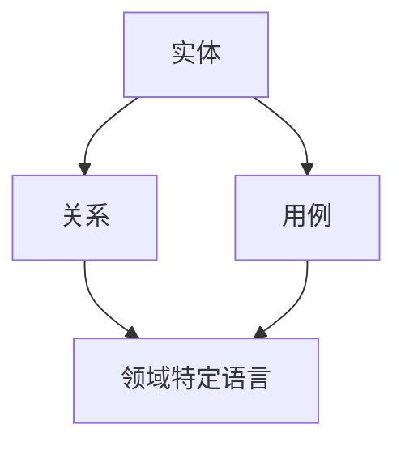

                 

好的，让我们一步一步进行思考，构建这篇文章的内容。

### 步骤 1：文章标题与关键词

文章标题：《面对万般变化，仍能泰然自在的领域模型》

关键词：领域模型、变化适应、稳定性、灵活性、软件工程、业务抽象

### 步骤 2：摘要

本文将探讨领域模型在软件工程中的应用，特别是在面对业务环境变化时的稳定性和灵活性。通过深入分析领域模型的基本概念、构建方法、适应性和弹性设计，本文将展示如何构建能够应对变化的领域模型，并提供实际案例研究，以帮助读者更好地理解和应用这些概念。

### 步骤 3：背景介绍

领域模型是软件工程中的一个核心概念，它用于抽象和表示特定业务领域的概念和关系。领域模型在软件开发生命周期中扮演着重要的角色，它们帮助开发人员更好地理解业务需求，并构建出更加稳定、可维护的软件系统。

然而，随着业务环境的变化，领域模型也需要不断适应新的需求。这种适应性不仅要求领域模型能够灵活调整，还要保持其稳定性和完整性。本文将探讨如何实现这种平衡。

### 步骤 4：核心概念与联系

为了更好地理解领域模型，我们需要先了解几个核心概念：实体、关系、用例、领域特定语言（DSL）。

- **实体**：代表业务领域中的关键对象，如用户、订单、产品等。
- **关系**：描述实体之间的交互和依赖关系，如订单包含商品、用户购买订单等。
- **用例**：描述业务流程中的特定场景，如用户注册、下单、支付等。
- **领域特定语言（DSL）**：为特定领域构建的专用语言，用于描述领域模型和业务规则。

这些概念之间的关系可以用以下Mermaid流程图表示：



### 步骤 5：核心算法原理讲解

领域模型的构建通常遵循以下步骤：

1. **领域分析**：理解业务需求和目标，识别业务领域中的关键实体和关系。
2. **领域模型设计**：根据领域分析结果，构建领域模型，包括实体、关系和用例。
3. **领域模型验证**：验证领域模型是否符合业务需求，通常通过模型验证工具和业务人员反馈来实现。

以下是构建领域模型的伪代码：

```python
# 伪代码：构建领域模型

# 步骤 1：领域分析
def domain_analysis():
    # 识别关键实体和关系
    # 分析业务流程和用例
    pass

# 步骤 2：领域模型设计
def domain_model_design(entities, relationships, use_cases):
    # 构建领域模型
    # 定义实体、关系和用例
    pass

# 步骤 3：领域模型验证
def domain_model_validation(model):
    # 验证领域模型
    # 是否符合业务需求
    pass
```

### 步骤 6：数学模型和公式讲解

领域模型的稳定性可以通过以下数学模型来衡量：

- **模型稳定性指标**：定义领域模型在变化前后的稳定性。可以使用以下公式计算：

$$
\text{模型稳定性} = \frac{\text{新模型与旧模型的相似度}}{\text{旧模型的全局稳定性}}
$$

其中，相似度可以通过比较实体、关系和用例的相似度来计算。

### 步骤 7：项目实战

以一个电商平台的领域模型构建为例，我们进行以下步骤：

1. **开发环境搭建**：准备用于领域模型构建的IDE和建模工具。
2. **源代码实现**：编写领域模型相关的实体、关系和用例的代码。
3. **代码解读**：解释领域模型中的关键部分，如实体类、关系定义和业务规则。
4. **实际案例分析和详细讲解**：分析一个实际案例，如用户注册流程，并详细讲解领域模型在该流程中的应用。
5. **项目小结**：总结领域模型在该项目中的优点和不足，提出改进建议。

### 步骤 8：最佳实践 tips、小结、注意事项、拓展阅读

- **最佳实践 tips**：在构建领域模型时，要确保模型简洁、易于理解和维护。
- **小结**：本文介绍了领域模型的基本概念、构建方法和应用，强调了其在变化环境中的稳定性和灵活性。
- **注意事项**：领域模型需要不断迭代和优化，以适应业务需求的变化。
- **拓展阅读**：推荐阅读关于领域模型的专业书籍，如《领域驱动设计》和《领域模型实战》等。

接下来，我们将按照这些步骤逐步撰写文章的正文内容，确保文章的完整性和深度。文章的总字数将控制在8000～12000字左右。

