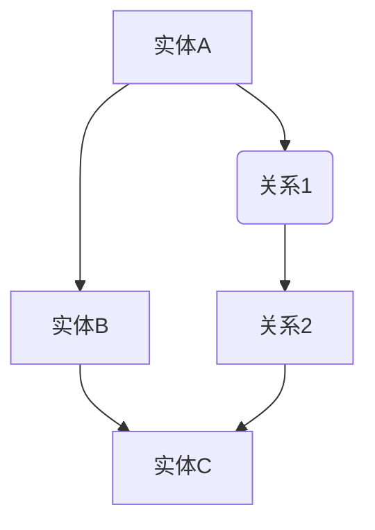
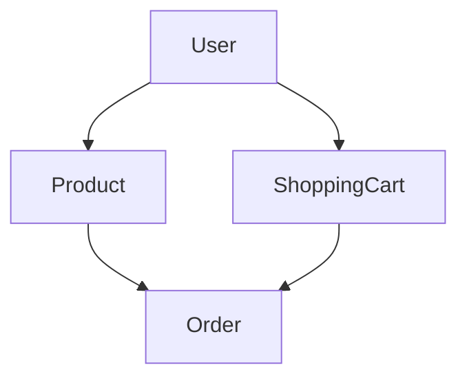

                 

# 领域建模易筋洗髓

### 关键词
领域建模，实体关系模型，价值链建模，算法原理，数学模型，项目实战，最佳实践

### 摘要
本文旨在深入探讨领域建模的核心概念、算法原理、数学模型以及项目实战。通过逐步分析，我们将理解领域建模的原理和技巧，以及如何在实际项目中应用。本文分为七个章节，涵盖从基础理论到实际应用的全过程，旨在帮助读者掌握领域建模的精髓。

## 引言与领域建模基础

### 1.1 领域建模的概念与重要性

领域建模是一种将特定业务领域的知识抽象成统一模型的方法。其核心目标是提高软件系统的可维护性、可扩展性和复用性。在软件工程中，领域建模被广泛应用于需求分析、系统设计和开发过程。

领域建模的重要性体现在以下几个方面：

1. **提高可维护性**：通过建立领域模型，开发者可以更好地理解业务逻辑，从而减少系统维护的复杂性。
2. **增强可扩展性**：领域模型为系统的扩展提供了明确的框架，使得新功能的添加变得更加容易。
3. **促进复用**：领域模型使得开发过程中生成的代码更加通用，提高了代码的复用率。

### 1.2 领域模型的分类

领域模型可以根据其用途和表现形式进行分类，常见的分类包括：

1. **实体关系模型**：描述领域内的实体及其关系。
2. **价值链模型**：描述领域内价值的传递过程。
3. **过程模型**：描述领域内活动的逻辑顺序。

### 1.3 领域建模的步骤和方法

领域建模通常包括以下步骤：

1. **需求分析**：理解业务需求和目标。
2. **领域概念提取**：识别领域内的核心概念。
3. **领域模型构建**：根据提取的概念构建领域模型。
4. **模型验证**：确保模型符合业务需求。
5. **模型优化**：对模型进行改进，以提高其性能。

常用的领域建模方法包括：

1. **实体-关系方法**：通过实体和关系的定义来构建模型。
2. **面向对象方法**：利用面向对象的原理来建模。

### 1.4 领域建模工具简介

领域建模工具可以帮助开发者更高效地创建和管理领域模型。常见的工具包括：

1. **EA**：Enterprise Architect，一款功能强大的建模工具。
2. **Enterprise Architect**：IBM Rational Software Architect，提供全面的建模功能。
3. **Mermaid**：一种基于Markdown的绘图工具，可用于绘制流程图。

## 领域建模核心概念与联系

### 2.1 领域本体论

领域本体论是领域建模的基础，它定义了领域内的核心概念、属性、关系和约束。本体论有助于实现领域知识的结构化和共享。

### 2.2 实体关系模型

实体关系模型是领域建模中最常用的方法之一，它通过实体和关系的定义来描述领域内的业务概念和规则。实体表示领域内的对象，关系表示实体之间的交互。

### 2.3 价值链建模

价值链建模关注领域内价值的创造和传递过程，它有助于理解领域内各实体的业务逻辑和协作关系。价值链模型通常包括输入、加工和输出三个环节。

### 2.4 Mermaid流程图：领域模型核心概念联系

以下是一个示例的Mermaid流程图，用于展示领域模型中的核心概念及其联系：



在这个例子中，实体A、B、C表示领域内的三个不同实体，关系1和关系2表示实体之间的关联。

## 领域建模核心算法原理讲解

### 3.1 领域识别算法

领域识别算法用于从大量数据中提取出潜在的领域知识。常见的算法包括聚类、分类、关联规则挖掘等。

1. **聚类算法**：将相似的数据点归为一类，用于发现领域内的相似实体。
2. **分类算法**：将数据点分类到预定义的类别中，用于识别领域内的规则。
3. **关联规则挖掘**：发现数据之间的关联关系，用于生成领域模型中的规则。

### 3.2 关联规则算法

关联规则算法用于发现数据之间的关联关系，它广泛应用于市场篮子分析、推荐系统等领域。算法的核心是支持度和置信度。

- **支持度**：表示某个关联规则在数据中出现的频率。
- **置信度**：表示在出现某个前提的情况下，出现某个结论的概率。

### 3.3 贝叶斯网络算法

贝叶斯网络算法是一种概率图模型，它能够表示领域内各种变量之间的依赖关系。贝叶斯网络由节点和边组成，节点表示变量，边表示变量之间的依赖关系。

以下是一个简单的贝叶斯网络算法的伪代码：

```python
def bayesian_network(data):
    # 初始化网络
    network = initialize_network(data)
    
    # 计算条件概率
    for node in network.nodes():
        for parent in network.parents(node):
            conditional_probability = calculateConditionalProbability(data, node, parent)
            network.setEdgeProbability(node, parent, conditional_probability)
    
    # 推断
    inference_result = network.infer(data)
    
    return inference_result
```

### 3.4 领域模型优化算法

领域模型优化算法旨在提高领域模型的性能，如减少冗余关系、简化模型结构等。常见的优化算法包括：

1. **最小生成树**：用于简化模型结构，保留关键关系。
2. **遗传算法**：用于在大量模型中搜索最优模型。
3. **贪心算法**：用于逐步优化模型，每次迭代都选择最优的改进。

## 数学模型与数学公式

### 4.1 数学模型的基本概念

数学模型是领域建模的重要组成部分，它通过数学表达式描述领域内的业务逻辑和规则。常见的数学模型包括：

1. **线性模型**：用于描述线性关系，如回归模型。
2. **概率模型**：用于描述不确定性，如贝叶斯网络。
3. **图模型**：用于描述实体及其关系，如图论模型。

### 4.2 领域模型中的常见数学公式

领域模型中常见的数学公式包括：

1. **支持度**：

   $$ 支持度 = \frac{计数}{总数} $$

2. **置信度**：

   $$ 置信度 = \frac{计数(前提和结论)}{计数(前提)} $$

3. **条件概率**：

   $$ 条件概率(P(A|B)) = \frac{P(A \cap B)}{P(B)} $$

### 4.3 数学公式的详细讲解与举例

以下是数学公式的详细讲解与举例：

1. **线性回归**：

   线性回归模型用于预测目标变量和自变量之间的线性关系。公式如下：

   $$ y = w_0 + w_1 \cdot x $$

   其中，$y$ 是目标变量，$x$ 是自变量，$w_0$ 和 $w_1$ 是模型参数。

   举例：预测房价，$y$ 表示房价，$x$ 表示房屋面积。

2. **贝叶斯网络**：

   贝叶斯网络用于表示变量之间的依赖关系。公式如下：

   $$ P(A \cap B) = P(A) \cdot P(B|A) $$

   其中，$P(A)$ 表示事件 $A$ 的概率，$P(B|A)$ 表示在事件 $A$ 发生的条件下事件 $B$ 的概率。

   举例：判断一个病人的疾病概率，$A$ 表示病人患有疾病，$B$ 表示病人体温升高。

## 项目实战：领域建模应用案例

### 5.1 领域建模在金融领域的应用

在金融领域，领域建模可以帮助银行和金融机构更好地管理风险、提高业务效率。以下是一个简单的金融领域建模案例：

**案例：贷款审批系统**

1. **需求分析**：分析贷款审批的业务流程，确定需要建模的实体和关系。
2. **领域概念提取**：提取贷款申请、贷款审批、客户信息等核心概念。
3. **领域模型构建**：构建实体关系模型，描述贷款申请、审批过程及其关系。
4. **模型验证**：验证模型是否满足业务需求，确保模型准确性和完整性。
5. **模型优化**：根据业务反馈，优化模型以提高其性能。

### 5.2 领域建模在物流领域的应用

在物流领域，领域建模可以优化运输路线、提高配送效率。以下是一个物流领域建模案例：

**案例：物流管理系统**

1. **需求分析**：分析物流管理的业务流程，确定需要建模的实体和关系。
2. **领域概念提取**：提取货物、运输路线、配送中心等核心概念。
3. **领域模型构建**：构建实体关系模型，描述货物配送过程及其关系。
4. **模型验证**：验证模型是否满足业务需求，确保模型准确性和完整性。
5. **模型优化**：根据业务反馈，优化模型以提高其性能。

### 5.3 领域建模在电子商务领域的应用

在电子商务领域，领域建模可以优化购物流程、提高用户满意度。以下是一个电子商务领域建模案例：

**案例：电商平台**

1. **需求分析**：分析电商平台的核心业务流程，确定需要建模的实体和关系。
2. **领域概念提取**：提取用户、商品、购物车、订单等核心概念。
3. **领域模型构建**：构建实体关系模型，描述用户购物过程及其关系。
4. **模型验证**：验证模型是否满足业务需求，确保模型准确性和完整性。
5. **模型优化**：根据业务反馈，优化模型以提高其性能。

### 5.4 项目实战：案例分析与代码实现

以下是一个简单的案例，展示如何使用Python实现领域建模：

```python
class User:
    def __init__(self, name, age):
        self.name = name
        self.age = age

class Product:
    def __init__(self, name, price):
        self.name = name
        self.price = price

class ShoppingCart:
    def __init__(self):
        self.products = []

    def add_product(self, product):
        self.products.append(product)

    def remove_product(self, product):
        self.products.remove(product)

    def total_price(self):
        return sum(product.price for product in self.products)

user = User("Alice", 30)
product1 = Product("iPhone", 999)
product2 = Product("MacBook", 1999)

cart = ShoppingCart()
cart.add_product(product1)
cart.add_product(product2)

print("Total price:", cart.total_price())
```

在这个案例中，我们定义了三个类：User、Product 和 ShoppingCart。通过实例化这些类，我们可以模拟一个简单的购物车系统。

## 领域建模工具实战

### 6.1 常见领域建模工具

常见的领域建模工具有：

1. **Enterprise Architect**：功能强大的建模工具，支持多种建模方法。
2. **IBM Rational Software Architect**：提供全面的建模功能，支持Java和.NET开发。
3. **Mermaid**：基于Markdown的绘图工具，适用于绘制流程图和UML图。

### 6.2 领域建模工具的比较

以下是几种常见领域建模工具的比较：

| 工具          | 特点                                                       | 适用场景       |
|---------------|------------------------------------------------------------|----------------|
| Enterprise Architect | 功能强大，支持多种建模方法 | 复杂系统建模   |
| IBM Rational Software Architect | 集成开发环境，支持Java和.NET开发 | 企业级应用开发 |
| Mermaid        | 基于Markdown，简单易用   | 快速原型设计和文档 |

### 6.3 工具的使用方法与技巧

以下是几种领域建模工具的使用方法和技巧：

1. **Enterprise Architect**：熟练使用模板和插件，提高建模效率。
2. **IBM Rational Software Architect**：充分利用内置的代码生成和反向工程功能。
3. **Mermaid**：掌握Markdown语法，快速绘制高质量的流程图和UML图。

### 6.4 工具实战案例

以下是一个使用Mermaid绘制实体关系图的实战案例：



在这个案例中，我们使用Mermaid语言描述了用户、产品、购物车和订单之间的关系。

## 领域建模的未来趋势与挑战

### 7.1 领域建模的发展趋势

领域建模的未来发展趋势包括：

1. **自动化建模**：利用机器学习等技术，自动生成领域模型。
2. **分布式建模**：支持多团队、多地点的协作建模。
3. **模型可视化**：提高模型的可视化效果，便于开发者理解和修改。

### 7.2 领域建模的挑战与对策

领域建模面临的挑战包括：

1. **领域知识获取**：如何有效地获取和整理领域知识。
2. **模型复杂性**：如何处理复杂模型的优化和简化。
3. **模型验证与验证**：如何确保模型满足业务需求。

对策包括：

1. **引入专家系统**：利用专家系统来辅助领域知识的获取。
2. **优化算法**：研究高效的模型优化算法。
3. **模型验证工具**：开发专门的模型验证工具，提高验证的效率和准确性。

### 7.3 领域建模的未来展望

领域建模在未来将继续发挥重要作用，它将推动软件工程的发展，提高系统的质量和效率。随着技术的进步，领域建模将变得更加自动化、智能化和分布式。

## 附录：领域建模资源与扩展阅读

以下是领域建模的相关资源和扩展阅读：

1. **领域建模标准与规范**：了解领域建模的标准化工作，如DMN（决策模型和命名规范）。
2. **领域建模开源工具和框架**：使用开源工具和框架，如EMF（ Eclipse Modeling Framework）和Stitch。
3. **相关书籍与文献推荐**：阅读经典的领域建模书籍，如《领域驱动设计》和《软件架构：实践者的研究方法》。

### 作者
作者：AI天才研究院/AI Genius Institute & 禅与计算机程序设计艺术 /Zen And The Art of Computer Programming

