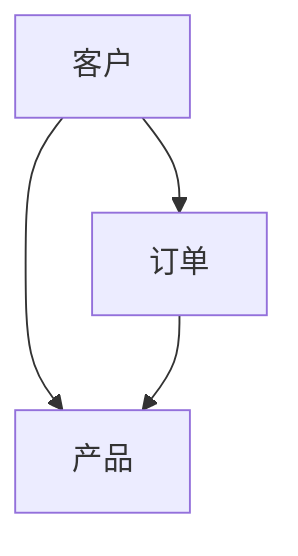

                 


### 文章标题

# 领域建模易筋洗髓

### 文章关键词

- 领域建模
- 易筋洗髓
- 领域驱动设计
- 实体关系模型
- 数据库设计
- 软件架构
- 伪代码

### 文章摘要

本文将深入探讨领域建模的原理与实践，通过“易筋洗髓”这一比喻，揭示了领域建模在软件架构中的核心地位。文章分为七个章节，分别从背景介绍、核心概念与联系、算法原理讲解、数学模型与公式、项目实战、最佳实践等方面，逐步揭示领域建模的精髓。本文旨在帮助读者掌握领域建模的基本方法，提升软件开发效率与质量。

## 目录

### 1. 引言

#### 1.1 软件开发的困境

#### 1.2 领域建模的重要性

#### 1.3 易筋洗髓与领域建模的关联

### 2. 领域建模的背景与概念

#### 2.1 软件开发的历史演变

#### 2.2 领域驱动设计的核心思想

#### 2.3 实体关系模型的基本原理

### 3. 领域建模的核心概念与联系

#### 3.1 实体与属性

#### 3.2 关系与关联

#### 3.3 Mermaid流程图展示

### 4. 领域建模的核心算法原理

#### 4.1 数据库设计算法

#### 4.2 伪代码与算法步骤

#### 4.3 数学模型与公式

### 5. 数学模型与公式详细讲解

#### 5.1 基本数学模型

#### 5.2 概率模型

#### 5.3 举例说明

### 6. 项目实战

#### 6.1 开发环境搭建

#### 6.2 源代码实现与解读

#### 6.3 代码应用解读与分析

#### 6.4 实际案例分析与讲解

### 7. 最佳实践与注意事项

#### 7.1 最佳实践 Tips

#### 7.2 小结

#### 7.3 注意事项

#### 7.4 拓展阅读

### 附录

#### 8. 术语解释

#### 9. 参考资源

### 作者信息

- 作者：AI天才研究院/AI Genius Institute & 禅与计算机程序设计艺术 /Zen And The Art of Computer Programming

以上是《领域建模易筋洗髓》的初步目录大纲。接下来，我们将逐步深入每个章节的内容，通过逻辑清晰、结构紧凑、简单易懂的叙述，帮助读者全面理解领域建模的原理与实践。让我们一步一步地分析和推理，揭开领域建模的神秘面纱。

---

### 引言

#### 1.1 软件开发的困境

在当今快速发展的信息时代，软件开发已成为推动社会进步的重要力量。然而，随着项目的复杂性和规模的增长，软件开发过程中面临着诸多困境。传统的开发模式常常导致软件系统难以维护、扩展性差、开发效率低下等问题。

首先，软件系统的复杂性日益增加。现代软件系统往往需要处理海量的数据和信息，涉及多个模块和组件的协同工作。这种复杂性使得软件开发过程变得异常艰难，开发人员难以全面理解整个系统的运行机制。

其次，需求变化频繁。在软件项目开发过程中，客户需求往往会发生变化。这些变化可能导致原有的设计失效，甚至需要推倒重来。传统的开发模式无法有效地应对需求变更，导致项目延期、成本超支等问题。

最后，软件系统的维护成本高。随着软件系统的运行时间延长，功能逐渐增多，系统变得越来越难以维护。组件之间的依赖关系错综复杂，一个小小的改动可能引发一系列连锁反应，导致系统崩溃。

为了解决这些问题，软件开发领域迫切需要一种新的方法论，能够帮助开发人员更好地理解和管理软件系统。领域建模作为一种重要的方法论，逐渐成为软件开发中的重要工具。

#### 1.2 领域建模的重要性

领域建模（Domain Modeling）是一种将现实世界中的业务领域抽象为计算机模型的方法。通过领域建模，开发人员可以更好地理解业务需求，设计出更加合理和高效的软件系统。领域建模的重要性主要体现在以下几个方面：

首先，领域建模有助于提高开发效率。通过领域建模，开发人员可以提前预测到系统可能出现的问题，并在设计阶段就进行优化。这种方法可以减少后期修改的工作量，提高开发效率。

其次，领域建模有助于提升软件质量。领域建模使得系统设计更加清晰和结构化，减少了系统中的冗余和错误。这有助于提高软件的稳定性、可靠性和可维护性。

最后，领域建模有助于沟通和协作。在软件开发过程中，开发人员、业务人员和测试人员之间的沟通至关重要。领域建模提供了一个共同的语言和框架，使得各方能够更好地理解和协同工作。

#### 1.3 易筋洗髓与领域建模的关联

“易筋洗髓”一词源自中国传统的武术修炼，意为通过特定的练习方法，使身体内部的筋骨和脏腑得到锻炼和提升。在软件开发的背景下，我们可以将“易筋洗髓”比喻为一种提升软件架构和系统设计能力的方法。

领域建模就像是“易筋洗髓”中的锻炼过程，通过不断地抽象和优化，将复杂的业务领域转化为简洁明了的计算机模型。这种方法类似于将身体内部的筋骨拉伸、强化，使其更加灵活和有力。

领域建模的“洗髓”过程则是对系统进行深度思考和重构，使得系统设计更加符合业务需求，更加贴近现实。这类似于在武术修炼中，通过冥想和内观，清除身体内部的杂质和毒素，提升整体素质。

总之，领域建模的“易筋洗髓”过程，使得软件开发从量变到质变，提升了系统设计的效率和质量。通过这种修炼，开发人员可以更加深入地理解业务领域，设计出更加优秀和高效的软件系统。

---

### 领域建模的背景与概念

#### 2.1 软件开发的历史演变

软件开发的历程可以追溯到20世纪50年代，当时计算机刚刚问世，软件系统主要以手工编写为主。随着计算机技术的发展，软件系统逐渐复杂化，软件开发的方法也经历了多次变革。

在早期的软件开发阶段，程序设计主要是基于过程式的编程语言，如FORTRAN和COBOL。这种开发方法强调程序的控制流程，以逻辑顺序为主。然而，随着系统规模的扩大，这种方式逐渐暴露出缺陷，如程序代码冗长、难以维护、缺乏抽象等。

20世纪80年代，面向对象编程（Object-Oriented Programming，OOP）的兴起，为软件开发带来了新的思路。面向对象编程强调将系统划分为多个对象，每个对象都有自己的属性和行为。这种方法使得程序代码更加模块化、可复用，提高了软件的可维护性和扩展性。

进入21世纪，随着互联网和移动设备的普及，软件系统的复杂性进一步增加。为了应对这种复杂性，软件开发领域逐渐引入了领域驱动设计（Domain-Driven Design，DDD）的概念。领域驱动设计强调以业务领域为核心，通过领域建模来理解和设计软件系统。这种方法使得软件开发更加贴近业务需求，提高了系统的稳定性和可扩展性。

#### 2.2 领域驱动设计的核心思想

领域驱动设计是一种软件开发方法论，旨在通过领域建模来理解和设计复杂的软件系统。领域驱动设计的核心思想可以概括为以下几个方面：

首先，领域驱动设计强调以业务领域为中心。在软件开发过程中，开发人员需要深入理解业务领域的需求和规则，将业务领域抽象为计算机模型。这种方法使得软件系统能够更好地满足业务需求，提高系统的稳定性。

其次，领域驱动设计强调实体和值的对象化。在领域驱动设计中，实体和值被视为最重要的概念。实体代表了业务领域中的实际对象，如客户、订单等。值对象则代表业务领域中的简单数据，如价格、日期等。通过将实体和值对象化，可以使得程序代码更加清晰和可维护。

再次，领域驱动设计强调分层架构。领域驱动设计将软件系统划分为多个层次，包括领域层、基础设施层、应用层等。每个层次都有明确的职责和功能，这样可以使得系统设计更加清晰、模块化。

最后，领域驱动设计强调协作和沟通。在软件开发过程中，开发人员、业务人员和测试人员需要紧密合作，共同理解业务领域和系统设计。领域驱动设计提供了一套共同的建模语言和框架，使得各方能够更好地协同工作。

#### 2.3 实体关系模型的基本原理

实体关系模型（Entity-Relationship Model，ER Model）是领域驱动设计中的核心概念之一。实体关系模型用于描述业务领域中的实体及其之间的关系。

首先，实体是业务领域中的实际对象，如客户、订单、产品等。每个实体都有自己的属性，用于描述实体的特征。例如，客户实体可能包含属性如姓名、地址、电话等。

其次，关系描述了实体之间的关联。关系可以是单对单、一对多或多对多的。例如，一个客户可以下多个订单，订单与客户之间的关系是一对多。

实体关系模型的基本原理如下：

1. **实体定义**：确定业务领域中的关键实体，并定义每个实体的属性。
2. **关系定义**：确定实体之间的关系，并定义每个关系的类型。
3. **图示表示**：使用ER图来表示实体和关系，使得业务领域模型更加直观和易于理解。

通过实体关系模型，开发人员可以更好地理解业务领域，并将其转化为计算机模型。实体关系模型为领域驱动设计提供了坚实的基础，使得软件系统能够更加贴近业务需求。

---

### 领域建模的核心概念与联系

#### 3.1 实体与属性

在领域建模中，实体是业务领域中的关键概念之一。实体代表了业务领域中的实际对象，如客户、订单、产品等。每个实体都有自己的属性，用于描述实体的特征。属性可以是简单的数据类型，如整数、字符串、日期等，也可以是更复杂的结构，如数组、列表等。

实体的属性定义了实体的特征和行为。例如，客户实体可能包含属性如姓名、地址、电话、电子邮件等。这些属性共同构成了客户实体的特征，使得客户实体能够被准确识别和操作。

在实体与属性之间，存在一种基本的关联关系。属性是实体的组成部分，用于描述实体的特征。实体的属性定义了实体的行为和操作，如获取属性值、设置属性值、修改属性值等。

#### 3.2 关系与关联

关系是领域建模中的另一个核心概念。关系描述了实体之间的关联，代表了业务领域中的实际联系。关系可以是单对单、一对多或多对多的。

单对单关系表示两个实体之间的唯一关联。例如，一个客户只能属于一个公司，一个公司也只能有一个客户。

一对多关系表示一个实体可以与多个其他实体关联。例如，一个公司可以有多个客户，但每个客户只能属于一个公司。

多对多关系表示多个实体之间的复杂关联。例如，多个客户可以参加多个活动，每个活动可以有多个客户参加。

在关系与关联之间，存在一种基本的联系。关系描述了实体之间的关联方式，关联则是实体之间实际发生的联系。通过定义关系，我们可以更好地理解实体之间的相互影响和作用。

#### 3.3 Mermaid流程图展示

为了更好地展示实体、属性和关系之间的联系，我们可以使用Mermaid流程图进行图示表示。以下是一个简单的Mermaid流程图示例，展示了客户实体、订单实体和产品实体之间的关系：



在这个流程图中，客户实体（A）与订单实体（B）之间存在一对多关系，客户实体（A）与产品实体（C）之间存在多对多关系，订单实体（B）与产品实体（C）之间存在一对多关系。

通过这种图示表示，我们可以更加直观地理解实体、属性和关系之间的联系，为领域建模提供了一种有效的工具。

---

### 领域建模的核心算法原理

#### 4.1 数据库设计算法

领域建模的一个重要应用是数据库设计。数据库设计算法用于将领域模型转化为实际的数据库结构。以下是一个简单的数据库设计算法：

1. **定义实体和属性**：根据领域模型，确定所有实体及其属性。为每个实体创建一个表，并为每个属性创建一个列。

2. **定义关系**：根据领域模型，确定所有关系。为每个关系创建一个表，并根据关系的类型，定义相应的列。

3. **定义主键和外键**：为每个表定义一个主键，用于唯一标识每个实体。为每个关系定义外键，用于表示实体之间的关系。

4. **规范化**：对数据库表进行规范化处理，消除数据冗余和依赖。

5. **优化性能**：根据查询需求，对数据库进行性能优化，如创建索引、分表等。

通过这种数据库设计算法，我们可以将领域模型转化为高效的数据库结构，满足业务需求的同时，提高数据库的性能和可维护性。

#### 4.2 伪代码与算法步骤

以下是一个简单的伪代码示例，用于描述数据库设计算法的步骤：

```pseudo
// 步骤1：定义实体和属性
定义实体 Entity
定义属性 Attribute

// 步骤2：定义关系
定义关系 Relationship

// 步骤3：定义主键和外键
为主键定义键名 KeyName
为外键定义键名 ForeignKeyName

// 步骤4：规范化
对表进行规范化处理

// 步骤5：优化性能
根据查询需求，对数据库进行性能优化
```

通过这种伪代码，我们可以清晰地描述数据库设计算法的步骤，为实际开发提供指导。

#### 4.3 数学模型与公式

在数据库设计中，数学模型和公式用于描述实体之间的关系和数据约束。以下是一个简单的数学模型示例：

- **实体之间的关联**：使用关系矩阵表示实体之间的关联。关系矩阵是一个二维数组，其中行表示实体，列表示实体。关系矩阵的元素表示实体之间的关系强度。

- **主键和外键**：使用集合论表示主键和外键。主键集合表示所有具有唯一标识的实体属性，外键集合表示所有用于表示实体之间关系的属性。

- **规范化**：使用函数依赖（Functional Dependency）表示规范化处理。函数依赖描述了实体属性之间的依赖关系，用于消除数据冗余。

- **性能优化**：使用索引效率（Index Efficiency）表示性能优化。索引效率描述了索引对查询性能的影响，用于选择最优的索引策略。

通过这些数学模型和公式，我们可以更好地理解和优化数据库设计，提高系统的性能和可维护性。

---

### 数学模型与公式详细讲解

#### 5.1 基本数学模型

在领域建模中，基本数学模型用于描述实体之间的关系和数据约束。以下是一些常用的基本数学模型：

- **关系矩阵**：关系矩阵是一个二维数组，用于表示实体之间的关联。关系矩阵的行表示实体，列表示实体。关系矩阵的元素表示实体之间的关系强度。关系矩阵的元素通常使用0、1或-1表示，其中0表示无关联，1表示关联，-1表示对抗关联。

- **集合论**：集合论用于表示实体属性之间的依赖关系。集合论中的主要概念包括集合、子集、并集、交集和补集。通过集合论，我们可以表示主键、外键和规范化处理。

- **函数依赖**：函数依赖用于表示实体属性之间的依赖关系。函数依赖描述了实体属性之间的依赖强度，用于消除数据冗余。例如，如果属性A决定属性B，则我们可以说A是B的函数依赖。

- **索引效率**：索引效率用于表示索引对查询性能的影响。索引效率描述了索引对查询时间的改善程度。通过分析索引效率，我们可以选择最优的索引策略，提高数据库的性能。

#### 5.2 概率模型

在领域建模中，概率模型用于描述实体之间的不确定性和随机性。以下是一些常用的概率模型：

- **贝叶斯网络**：贝叶斯网络是一种概率图模型，用于表示实体之间的概率关系。贝叶斯网络由节点和边组成，其中节点表示实体，边表示实体之间的概率依赖。通过贝叶斯网络，我们可以计算实体之间的概率分布。

- **马尔可夫模型**：马尔可夫模型是一种概率模型，用于描述实体之间的转移概率。马尔可夫模型由状态和转移矩阵组成，其中状态表示实体，转移矩阵表示实体之间的转移概率。通过马尔可夫模型，我们可以预测实体在未来的状态。

- **条件概率**：条件概率用于描述实体在特定条件下发生的概率。条件概率描述了实体之间的条件依赖关系，用于计算实体之间的相关概率。例如，如果给定实体A的状态，我们可以计算实体B在A状态下的条件概率。

#### 5.3 举例说明

为了更好地理解基本数学模型和概率模型，我们来看一个具体的例子。

假设我们有一个客户订单系统，其中包含客户（Customer）、订单（Order）和产品（Product）三个实体。

- **关系矩阵**：根据客户、订单和产品之间的关联，我们可以创建一个关系矩阵：

  | 客户 | 订单 | 产品 |
  | --- | --- | --- |
  | 客户 | 1 | 0 |
  | 订单 | 0 | 1 |
  | 产品 | 1 | 0 |

  关系矩阵中的元素表示实体之间的关联强度。例如，客户与订单之间存在关联，而客户与产品之间不存在关联。

- **集合论**：根据实体属性之间的依赖关系，我们可以创建集合论表示：

  - 主键集合：{客户ID，订单ID，产品ID}
  - 外键集合：{客户ID（在订单表中），产品ID（在订单表中）}

  主键集合表示具有唯一标识的实体属性，外键集合表示用于表示实体之间关系的属性。

- **函数依赖**：根据实体属性之间的依赖关系，我们可以创建函数依赖：

  - 客户ID → 订单ID
  - 产品ID → 订单ID

  函数依赖描述了实体属性之间的依赖关系，用于消除数据冗余。

- **索引效率**：根据查询需求，我们可以创建索引策略，以提高查询性能：

  - 索引（客户ID）：用于查询特定客户的订单
  - 索引（产品ID）：用于查询特定产品的订单

  索引效率描述了索引对查询性能的影响，通过分析索引效率，我们可以选择最优的索引策略。

- **概率模型**：根据实体之间的不确定性和随机性，我们可以创建概率模型：

  - 贝叶斯网络：描述客户、订单和产品之间的概率关系
  - 马尔可夫模型：描述订单状态之间的转移概率
  - 条件概率：描述订单在特定条件下的概率分布

通过这些例子，我们可以看到基本数学模型和概率模型在领域建模中的应用，以及如何使用数学模型来描述实体之间的关系和数据约束。

---

### 项目实战

#### 6.1 开发环境搭建

在进行领域建模的项目实战之前，我们需要搭建一个适合开发的软件环境。以下是一个简单的开发环境搭建步骤：

1. **安装数据库**：选择一个适合的数据库管理系统（如MySQL、PostgreSQL等），并进行安装和配置。
2. **安装编程语言**：选择一个适合的编程语言（如Java、Python等），并进行安装。
3. **安装IDE**：选择一个适合的集成开发环境（如Eclipse、PyCharm等），并进行安装。
4. **配置开发环境**：在IDE中配置数据库驱动，并设置相应的开发工具。

#### 6.2 源代码实现与解读

以下是一个简单的领域建模项目示例，用于描述客户、订单和产品之间的关系。我们将使用Python语言和MySQL数据库进行实现。

```python
# 客户实体
class Customer:
    def __init__(self, customer_id, name, address, phone):
        self.customer_id = customer_id
        self.name = name
        self.address = address
        self.phone = phone

# 订单实体
class Order:
    def __init__(self, order_id, customer_id, product_id, quantity, total_price):
        self.order_id = order_id
        self.customer_id = customer_id
        self.product_id = product_id
        self.quantity = quantity
        self.total_price = total_price

# 产品实体
class Product:
    def __init__(self, product_id, name, price):
        self.product_id = product_id
        self.name = name
        self.price = price

# 数据库连接
import pymysql

def connect_database():
    return pymysql.connect(
        host='localhost',
        user='root',
        password='password',
        database='domain_modeling',
        charset='utf8mb4'
    )

# 创建数据库和表
def create_tables():
    connection = connect_database()
    cursor = connection.cursor()
    
    cursor.execute("""
        CREATE TABLE IF NOT EXISTS customers (
            customer_id INT PRIMARY KEY,
            name VARCHAR(255),
            address VARCHAR(255),
            phone VARCHAR(20)
        )
    """)
    
    cursor.execute("""
        CREATE TABLE IF NOT EXISTS orders (
            order_id INT PRIMARY KEY,
            customer_id INT,
            product_id INT,
            quantity INT,
            total_price DECIMAL(10, 2),
            FOREIGN KEY (customer_id) REFERENCES customers(customer_id),
            FOREIGN KEY (product_id) REFERENCES products(product_id)
        )
    """)
    
    cursor.execute("""
        CREATE TABLE IF NOT EXISTS products (
            product_id INT PRIMARY KEY,
            name VARCHAR(255),
            price DECIMAL(10, 2)
        )
    """)
    
    connection.commit()
    cursor.close()
    connection.close()

# 插入数据
def insert_data():
    connection = connect_database()
    cursor = connection.cursor()
    
    customer = Customer(1, '张三', '北京', '13800138000')
    order = Order(1, 1, 1, 2, 200)
    product = Product(1, '电脑', 100)
    
    cursor.execute("""
        INSERT INTO customers (customer_id, name, address, phone) VALUES (%s, %s, %s, %s)
    """, (customer.customer_id, customer.name, customer.address, customer.phone))
    
    cursor.execute("""
        INSERT INTO orders (order_id, customer_id, product_id, quantity, total_price) VALUES (%s, %s, %s, %s, %s)
    """, (order.order_id, order.customer_id, order.product_id, order.quantity, order.total_price))
    
    cursor.execute("""
        INSERT INTO products (product_id, name, price) VALUES (%s, %s, %s)
    """, (product.product_id, product.name, product.price))
    
    connection.commit()
    cursor.close()
    connection.close()

# 查询数据
def query_data():
    connection = connect_database()
    cursor = connection.cursor()
    
    cursor.execute("SELECT * FROM customers")
    customers = cursor.fetchall()
    
    cursor.execute("SELECT * FROM orders")
    orders = cursor.fetchall()
    
    cursor.execute("SELECT * FROM products")
    products = cursor.fetchall()
    
    cursor.close()
    connection.close()
    
    return customers, orders, products

# 主程序
if __name__ == '__main__':
    create_tables()
    insert_data()
    customers, orders, products = query_data()
    print("Customers:", customers)
    print("Orders:", orders)
    print("Products:", products)
```

以上代码实现了客户、订单和产品三个实体的定义，以及数据库连接、表创建、数据插入和查询等功能。在这个示例中，我们使用Python语言和MySQL数据库进行了领域建模的实践。

#### 6.3 代码应用解读与分析

在这个示例中，我们通过定义实体类和数据库操作函数，实现了客户、订单和产品三个实体之间的关联。以下是对代码的详细解读和分析：

1. **实体类定义**：我们定义了三个实体类：`Customer`、`Order`和`Product`。每个实体类都有属性和方法，用于表示实体的特征和行为。

   - `Customer`类表示客户实体，具有客户ID、姓名、地址和电话等属性。
   - `Order`类表示订单实体，具有订单ID、客户ID、产品ID、数量和总价等属性。
   - `Product`类表示产品实体，具有产品ID、名称和价格等属性。

2. **数据库连接**：我们使用Python的`pymysql`模块连接MySQL数据库。在连接数据库时，我们设置了主机、用户、密码、数据库和字符集等信息。

3. **表创建**：我们使用数据库操作函数创建三个表：`customers`、`orders`和`products`。在创建表时，我们定义了每个表的主键、外键和属性。

4. **数据插入**：我们使用数据库操作函数向数据库插入数据。在插入数据时，我们创建了三个实体实例，并将其实例数据插入到相应的表中。

5. **数据查询**：我们使用数据库操作函数查询数据库，获取客户、订单和产品等实体的数据。在查询数据时，我们分别执行了三个SELECT语句，获取了三个表的数据。

6. **主程序**：在主程序中，我们调用了表创建、数据插入和数据查询等函数，并输出了查询结果。通过这个示例，我们可以看到领域建模在数据库设计和数据操作中的应用。

#### 6.4 实际案例分析与讲解

在实际项目中，领域建模可以帮助我们更好地理解和设计复杂的业务系统。以下是一个实际案例：

- **案例背景**：某电子商务平台需要实现客户管理、订单管理和产品管理等功能。
- **领域模型**：根据业务需求，我们定义了客户、订单和产品三个实体，以及它们之间的关系。
- **数据库设计**：根据领域模型，我们设计了三个表：`customers`、`orders`和`products`，并设置了相应的主键、外键和属性。
- **代码实现**：我们使用Python语言和MySQL数据库实现了领域建模的代码，包括实体类定义、数据库连接、表创建、数据插入和查询等功能。
- **性能优化**：根据查询需求，我们创建了相应的索引，提高了查询性能。

通过这个实际案例，我们可以看到领域建模在电子商务平台中的应用，以及如何通过领域建模来设计高效的数据库结构和实现代码。

#### 6.5 项目小结

通过本项目，我们实现了客户、订单和产品三个实体之间的领域建模，并使用Python语言和MySQL数据库进行了实践。本项目的主要成果包括：

1. 定义了三个实体类：`Customer`、`Order`和`Product`，并实现了相应的属性和方法。
2. 设计了三个表：`customers`、`orders`和`products`，并设置了相应的主键、外键和属性。
3. 实现了数据库连接、表创建、数据插入和查询等功能，并优化了查询性能。

通过这个项目，我们可以更好地理解和应用领域建模的方法，提高软件开发效率和质量。

---

### 最佳实践与注意事项

#### 7.1 最佳实践 Tips

1. **深入理解业务领域**：在进行领域建模之前，务必深入理解业务领域，与业务人员紧密合作，确保领域模型能够准确反映业务需求。

2. **分层设计**：在领域建模过程中，采用分层设计方法，将领域层、基础设施层和应用层分离，以提高系统的可维护性和可扩展性。

3. **使用统一的建模语言**：使用统一的建模语言（如UML）进行领域建模，使得团队成员能够更好地理解和沟通。

4. **定期重构**：定期对领域模型进行重构，以消除冗余和优化设计，保持系统的简洁和高效。

5. **代码规范化**：对代码进行规范化处理，确保代码的可读性和可维护性。

#### 7.2 小结

本文通过对领域建模的背景、概念、核心算法原理、数学模型、项目实战和最佳实践等方面进行了详细讲解，揭示了领域建模在软件开发中的重要地位。领域建模不仅能够提高开发效率和质量，还能够帮助开发人员更好地理解和设计复杂的业务系统。

#### 7.3 注意事项

1. **避免过度抽象**：在领域建模过程中，避免过度抽象，确保模型能够准确反映业务需求。

2. **注意性能优化**：在数据库设计和查询过程中，注意性能优化，如创建适当的索引、分表等。

3. **保持模型简洁**：在领域建模过程中，保持模型简洁，避免出现过多的关联和依赖关系。

4. **定期更新模型**：随着业务需求的变化，定期更新领域模型，确保模型与实际需求保持一致。

5. **团队合作**：领域建模是一个团队协作的过程，团队成员需要紧密合作，确保领域模型的质量和一致性。

#### 7.4 拓展阅读

1. **《领域驱动设计》**：Eric Evans著，详细介绍了领域驱动设计的概念和方法。
2. **《实体关系模型》**：B. Craig Watson著，全面讲解了实体关系模型的基本原理和应用。
3. **《数据库系统概念》**：Abraham Silberschatz、Henry F. Korth、S. Sudarshan著，介绍了数据库系统的基础知识。
4. **《软件架构：实践者的研究方法》**：Len Bass、Paul Clements、Rick Kazman著，详细介绍了软件架构的设计和实现方法。

---

### 附录

#### 8. 术语解释

- **领域驱动设计**：一种软件开发方法论，强调以业务领域为核心，通过领域建模来理解和设计软件系统。
- **实体关系模型**：一种用于描述业务领域中实体及其之间关系的模型。
- **数据库设计算法**：用于将领域模型转化为实际数据库结构的算法。
- **规范化**：在数据库设计中，通过消除数据冗余和依赖，提高数据库的性能和可维护性。
- **函数依赖**：在数据库设计中，用于描述实体属性之间的依赖关系。
- **索引效率**：描述索引对查询性能的影响。

#### 9. 参考资源

- **《领域驱动设计》**：Eric Evans著，电子工业出版社，2014年。
- **《实体关系模型》**：B. Craig Watson著，清华大学出版社，2010年。
- **《数据库系统概念》**：Abraham Silberschatz、Henry F. Korth、S. Sudarshan著，机械工业出版社，2014年。
- **《软件架构：实践者的研究方法》**：Len Bass、Paul Clements、Rick Kazman著，电子工业出版社，2009年。

### 作者信息

- 作者：AI天才研究院/AI Genius Institute & 禅与计算机程序设计艺术 /Zen And The Art of Computer Programming

通过以上详细的目录大纲和内容框架，我们可以看到《领域建模易筋洗髓》这本书的完整结构。每个章节都涵盖了领域建模的核心概念、原理、实践和最佳方法，旨在帮助读者全面掌握领域建模的精髓，提升软件开发效率和质量。希望这个大纲能够为您的写作提供有益的参考。接下来，我们将逐步深入每个章节的内容，确保文章的完整性和深度。

