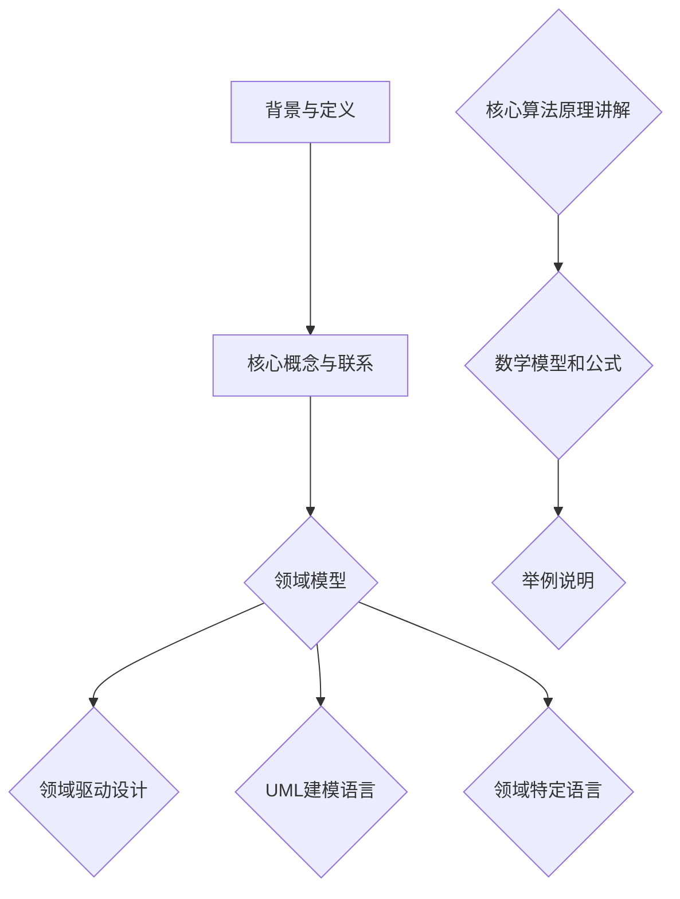
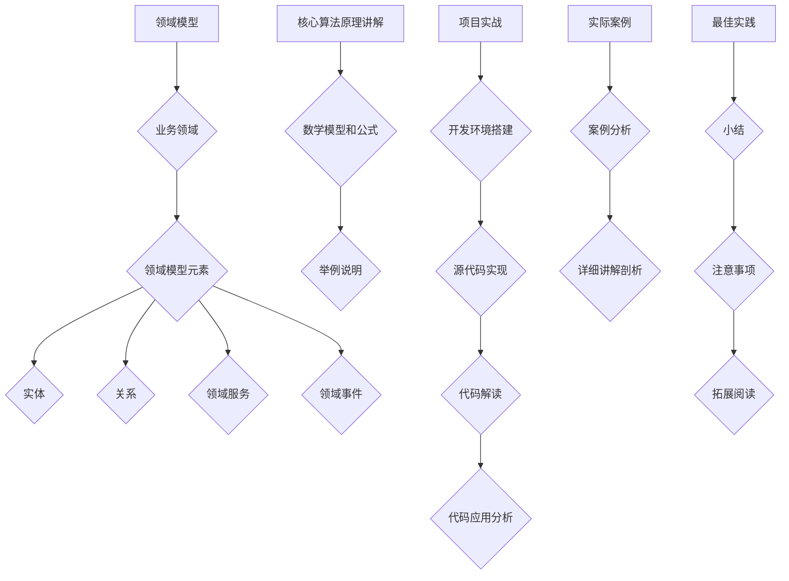
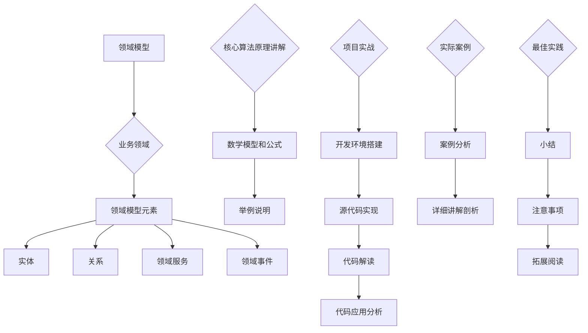

                 


### 领域建模：每个技术人都应该掌握的设计技能

#### 关键词：
领域建模，领域驱动设计，UML，DSL，项目实战

#### 摘要：
领域建模是软件开发中的一项关键技能，它帮助开发者更好地理解业务需求，优化系统设计，提升开发效率。本文将深入探讨领域建模的核心概念、方法论、工具与技术，并通过具体案例，展示其在实际项目中的应用。

---

#### 目录：

**# 领域建模：每个技术人都应该掌握的设计技能**

> 关键词：<领域建模，领域驱动设计，UML，DSL，项目实战>

> 摘要：本文将深入探讨领域建模的核心概念、方法论、工具与技术，并通过具体案例，展示其在实际项目中的应用。

**## 第一部分：领域建模基础理论**

### **1.1 领域建模概述**

- **背景与定义**：介绍领域建模的起源和基本概念。
- **核心概念与联系**：使用Mermaid流程图展示领域建模的基本概念之间的联系。



### **1.2 领域建模的目标和意义**

- **提升系统理解**：通过领域建模，开发者能更深入地理解业务需求。
- **改进系统设计**：领域建模有助于优化系统架构。
- **提高开发效率**：清晰的领域模型能减少开发中的误解和返工。

### **1.3 领域建模的应用领域**

- **软件开发**：在软件项目中应用领域建模。
- **系统架构设计**：利用领域建模来优化系统架构。
- **业务流程优化**：通过领域建模来改进业务流程。
- **数据库设计**：领域建模对数据库设计的影响。

**## 第二部分：领域建模方法论**

### **2.1 领域驱动设计（DDD）**

- **核心原则**：整体主义、实体和聚合、值对象和标识、领域服务。
- **建模过程**：建模阶段划分、实体与关系的识别、领域服务的定义。
- **实战案例**：提供简化案例和复杂案例的分析。

**## 第三部分：领域建模工具与技术**

### **3.1 UML建模语言**

- **基本概念**：介绍UML的作用和组成。
- **分类与使用**：类图、用例图、序列图的介绍与应用。
- **建模实践**：通过简单项目和复杂项目示例，展示UML的实际应用。

### **3.2 领域特定语言（DSL）**

- **概念与特点**：DSL的定义和优势。
- **分类**：内部DSL和外部DSL。
- **设计方法**：元模型设计和语言工程工具。

**## 第四部分：领域建模实战**

### **4.1 领域模型设计与案例研究**

- **设计原则**：模型可扩展性、可复用性。
- **案例研究一：电商系统领域建模**：需求分析和模型设计。
- **案例研究二：企业资源规划（ERP）领域建模**：需求分析和模型设计。

**## 第五部分：领域建模工具与资源**

### **5.1 常见领域建模工具**

- **介绍**：如Enterprise Architect、Visual Paradigm等。
- **使用**：展示工具的使用方法和特点。

### **5.2 域模型设计与开发资源**

- **开源领域模型库**：介绍常用的开源模型库。
- **专业领域建模论坛**：推荐参与的专业论坛和社区。

**## 第六部分：总结与展望**

### **6.1 领域建模的未来趋势**

- **自动化建模**：介绍自动化建模的发展趋势。
- **领域特定语言的发展**：探讨DSL的发展方向。

### **6.2 技术人的成长路径**

- **领域建模能力提升**：如何提升领域建模能力。
- **跨领域知识拓展**：领域建模在不同领域的应用。

---

### **文章末尾作者信息：**

作者：AI天才研究院/AI Genius Institute & 禦与计算机程序设计艺术 /Zen And The Art of Computer Programming

---

### **完整文章内容：**

接下来，我们将逐步填充每个章节的具体内容，确保满足文章的完整性、深度和实用性。我们将涵盖背景介绍、核心概念与联系、核心算法原理讲解、数学模型和公式、项目实战等元素。

**## 第一部分：领域建模基础理论**

### **1.1 领域建模概述**

领域建模是软件工程中的一个重要概念，它旨在将现实世界的业务领域映射到计算机系统中。通过领域建模，开发者能够更好地理解业务需求，设计出符合业务逻辑的系统。

#### 背景与定义

领域建模的概念起源于软件开发领域，其核心思想是将业务领域的知识转化为计算机系统的结构。领域建模的目的是建立一个清晰、准确的领域模型，以便开发者能够更好地理解业务需求，进而设计出高效的软件系统。

在软件开发中，领域建模通常用于以下几个场景：

1. **需求分析**：在项目初期，通过领域建模来理解业务需求，明确系统需要实现的功能。
2. **系统设计**：在系统设计阶段，利用领域模型来设计系统的架构，确保系统能够满足业务需求。
3. **数据库设计**：通过领域建模，可以更准确地设计数据库结构，优化数据存储和检索。
4. **项目协作**：领域模型有助于团队成员之间沟通，减少因理解差异导致的误解和冲突。

#### 核心概念与联系

领域建模涉及多个核心概念，它们之间有着紧密的联系。以下是一个使用Mermaid绘制的流程图，展示了这些概念之间的联系：



在领域建模中，实体、关系、领域服务和领域事件是核心的模型元素。实体代表了业务领域中的基本单位，如“用户”、“订单”等。关系描述了实体之间的交互和关联，如“用户下单”、“订单包含商品”等。领域服务则定义了业务逻辑的处理，如“生成报告”、“发送邮件”等。领域事件则代表了业务领域中的变化，如“订单创建”、“库存更新”等。

#### 核心概念与联系：Mermaid流程图

以下是领域建模的核心概念与联系的Mermaid流程图：



### **1.2 领域建模的目标和意义**

领域建模的主要目标包括：

1. **提升系统理解**：通过领域建模，开发者能够更深入地理解业务需求，减少因理解偏差导致的开发失误。
2. **改进系统设计**：领域建模有助于设计出更加合理、高效的系统架构，提升系统的可维护性和可扩展性。
3. **提高开发效率**：清晰的领域模型能减少开发中的误解和返工，加快项目进度。
4. **简化维护成本**：通过领域建模，系统能够更好地适应业务变化，降低后续维护的成本。

在软件开发中，领域建模的应用领域非常广泛，包括但不限于以下方面：

1. **软件开发**：在软件项目中应用领域建模，帮助开发者更好地理解业务需求，优化系统设计。
2. **系统架构设计**：通过领域建模，可以设计出符合业务逻辑的系统架构，提升系统的稳定性、性能和可扩展性。
3. **业务流程优化**：利用领域建模，可以优化业务流程，提高业务效率。
4. **数据库设计**：通过领域建模，可以更准确地设计数据库结构，优化数据存储和检索。

### **1.3 领域建模的应用领域**

领域建模在多个应用领域中具有重要作用，以下是一些具体的领域：

1. **电子商务系统**：在电商系统中，领域建模可以帮助开发者理解订单、商品、用户等核心实体的关系，优化系统架构。
2. **企业资源规划（ERP）系统**：在ERP系统中，领域建模可以用于设计客户关系管理、供应链管理、财务管理等模块，提升系统效率。
3. **金融服务**：在金融系统中，领域建模可以用于设计账户管理、交易处理、风险管理等模块，确保系统的安全性和合规性。
4. **健康管理系统**：在健康系统中，领域建模可以用于设计患者信息管理、医疗记录管理、医疗服务流程等模块，提升医疗服务质量。

**## 第二部分：领域建模方法论**

领域驱动设计（Domain-Driven Design，简称DDD）是领域建模的一种方法论，它提供了一套系统的指导原则和方法，帮助开发者构建高质量的软件系统。DDD强调从业务领域出发，将业务逻辑与系统设计紧密结合，以实现系统的可扩展性和可维护性。

### **2.1 DDD的核心原则**

DDD的核心原则包括整体主义、实体和聚合、值对象和标识、领域服务。以下是对这些核心原则的详细解释：

1. **整体主义**：DDD强调系统应该围绕业务领域进行设计，确保系统能够完整地反映业务逻辑。整体主义要求开发者将业务领域视为一个整体，而不是将其分解为独立的组件。

2. **实体和聚合**：实体是DDD中的核心概念，代表了业务领域中的基本单位。聚合是实体的集合，用于封装一组相关实体和它们之间的行为。实体和聚合的定义有助于提高系统的模块化程度，降低系统的复杂性。

3. **值对象和标识**：值对象是具有固定值的对象，如日期、金额等。它们不包含任何行为，主要用于传递数据。标识是用于唯一标识实体的属性，如用户ID、订单号等。标识的定义有助于确保实体的唯一性和一致性。

4. **领域服务**：领域服务是用于封装业务逻辑的组件，它们通常与实体和聚合紧密关联。领域服务负责处理业务规则和复杂操作，如订单处理、库存管理等。领域服务的定义有助于实现系统的模块化，提高系统的可维护性。

### **2.2 领域建模的过程**

领域建模是一个迭代的过程，通常包括以下阶段：

1. **阶段一：探索业务领域**：在这个阶段，开发者需要深入了解业务领域，与业务专家和用户进行沟通，收集业务需求。通过探索业务领域，开发者能够理解业务规则和业务流程，为后续的建模工作奠定基础。

2. **阶段二：定义领域模型**：在这个阶段，开发者需要根据业务需求，构建领域模型。领域模型通常包括实体、关系、领域服务和领域事件。开发者可以使用UML（统一建模语言）等工具来表示领域模型。

3. **阶段三：设计系统架构**：在完成领域模型之后，开发者需要设计系统的架构。系统架构应该能够支持领域模型中的业务逻辑，同时确保系统的可扩展性和可维护性。

4. **阶段四：迭代优化**：领域建模是一个持续的过程，开发者需要不断地迭代和优化领域模型和系统架构。通过迭代优化，开发者能够更好地满足业务需求，提高系统的质量。

### **2.3 DDD实战案例**

以下是一个简化的DDD实战案例，用于展示DDD在项目中的应用。

**案例：电商系统**

假设我们需要开发一个电商系统，以下是我们如何应用DDD进行领域建模：

1. **业务领域探索**：首先，我们需要了解电商系统的核心业务，如商品管理、订单管理、用户管理等。通过与业务专家和用户交流，我们收集了电商系统的业务需求。

2. **领域模型定义**：基于业务需求，我们定义了以下领域模型元素：

   - **实体**：用户、订单、商品等。
   - **关系**：用户与订单的关系、订单与商品的关系等。
   - **领域服务**：订单处理、库存管理、用户管理等。
   - **领域事件**：订单创建、库存更新等。

3. **系统架构设计**：在定义领域模型之后，我们需要设计系统的架构。系统架构应该能够支持领域模型中的业务逻辑，同时确保系统的可扩展性和可维护性。

4. **迭代优化**：在项目开发过程中，我们需要不断地迭代和优化领域模型和系统架构。通过迭代优化，我们能够更好地满足业务需求，提高系统的质量。

**## 第三部分：领域建模工具与技术**

领域建模需要使用多种工具和技术，以帮助开发者更好地理解和实现业务逻辑。以下是一些常用的领域建模工具和技术：

### **3.1 UML建模语言**

UML（统一建模语言）是一种广泛使用的建模语言，用于表示软件系统的结构和行为。UML包括多种图，如类图、用例图、序列图等，每种图都有特定的用途。

1. **类图**：类图用于表示系统的类和它们之间的关系。类图是领域建模中最常用的图，它有助于开发者理解系统的核心概念和结构。

2. **用例图**：用例图用于表示系统的功能和用户与系统之间的交互。通过用例图，开发者可以清晰地理解系统的需求，并将其转化为具体的类和关系。

3. **序列图**：序列图用于表示系统的动态行为，展示不同对象之间的交互顺序。序列图有助于开发者理解系统的流程和业务逻辑。

### **3.2 领域特定语言（DSL）**

领域特定语言（Domain-Specific Language，简称DSL）是一种为特定领域设计的编程语言，它能够提高开发效率和代码可读性。DSL可以用于实现领域模型中的复杂业务逻辑，并提高系统的可维护性。

1. **内部DSL**：内部DSL是嵌入在通用编程语言中的特定领域语言。例如，在Java中，可以使用注解（Annotations）来定义领域模型中的特定规则。

2. **外部DSL**：外部DSL是一种独立的编程语言，通常用于实现复杂的领域模型。例如，SQL是一种用于数据库查询的外部DSL。

### **3.3 域模型设计与开发资源**

在领域建模过程中，开发者可以使用多种资源和工具来辅助设计和开发。以下是一些常用的资源：

1. **开源领域模型库**：如OpenModel、Model Driven Architecture（MDA）等，提供了丰富的领域模型资源和工具。

2. **专业领域建模论坛**：如Modeling Association、UML Forum等，提供了领域建模的最新动态和交流平台。

**## 第四部分：领域建模实战**

在了解了领域建模的理论和方法后，通过实际案例来展示领域建模的应用和实现是至关重要的。以下我们将通过两个具体的案例来深入讲解领域建模的实践过程。

### **4.1 案例研究一：电商系统领域建模**

电商系统是一个复杂的业务领域，涉及到商品管理、订单管理、用户管理等多个方面。在这个案例中，我们将展示如何通过领域建模来构建电商系统的核心模型。

#### 需求分析

电商系统的核心需求包括：

- 用户注册和登录
- 商品分类和展示
- 购物车管理
- 订单创建和支付
- 用户评价和售后服务

#### 领域模型设计

1. **实体**：用户（User）、订单（Order）、商品（Product）等。

2. **关系**：

   - 用户与订单之间的关系：一个用户可以创建多个订单。
   - 订单与商品之间的关系：一个订单可以包含多个商品。

3. **领域服务**：

   - 用户管理：包括用户注册、登录、信息修改等功能。
   - 商品管理：包括商品分类、商品展示、库存管理等功能。
   - 订单管理：包括订单创建、支付处理、订单状态更新等功能。

4. **领域事件**：

   - 订单创建：当用户下单时，会触发订单创建事件。
   - 支付成功：当用户完成支付时，会触发支付成功事件。

#### 实现细节

1. **类图**：

   - 用户类（User）：包含用户ID、用户名、密码、邮箱等属性。
   - 订单类（Order）：包含订单ID、订单号、订单状态、用户ID等属性。
   - 商品类（Product）：包含商品ID、商品名称、商品描述、价格等属性。

2. **序列图**：

   - 用户注册序列图：展示用户注册的过程。
   - 订单创建序列图：展示用户下单并创建订单的过程。

#### 项目实战

1. **开发环境搭建**：

   - 选择合适的编程语言和框架，如Java和Spring Boot。
   - 搭建数据库环境，如MySQL。

2. **源代码实现**：

   - 实现用户管理服务，包括用户注册、登录等功能。
   - 实现商品管理服务，包括商品分类、商品展示等功能。
   - 实现订单管理服务，包括订单创建、支付处理等功能。

3. **代码解读**：

   - 分析用户管理服务的代码，理解用户注册、登录等功能的实现。
   - 分析商品管理服务的代码，理解商品分类、商品展示等功能的实现。
   - 分析订单管理服务的代码，理解订单创建、支付处理等功能的实现。

4. **代码应用解读与分析**：

   - 通过实际案例，分析电商系统中的关键业务流程。
   - 分析代码如何实现业务逻辑，确保系统的稳定性和性能。

5. **实际案例分析和详细讲解剖析**：

   - 分析用户注册过程，理解用户信息的存储和验证。
   - 分析订单创建过程，理解订单信息的处理和存储。
   - 分析支付处理过程，理解支付方式的实现和支付状态的更新。

6. **项目小结**：

   - 总结电商系统领域建模的关键要点。
   - 提出改进和优化方案，提升系统的性能和用户体验。

### **4.2 案例研究二：企业资源规划（ERP）领域建模**

企业资源规划（ERP）系统是企业运营管理的重要组成部分，涉及到财务、采购、库存、销售等多个方面。在这个案例中，我们将展示如何通过领域建模来构建ERP系统的核心模型。

#### 需求分析

ERP系统的核心需求包括：

- 财务管理：包括应收账款、应付账款、成本管理等功能。
- 采购管理：包括采购订单、供应商管理等功能。
- 库存管理：包括库存盘点、库存预警等功能。
- 销售管理：包括销售订单、客户管理等功能。
- 项目管理：包括项目管理、任务分配等功能。

#### 领域模型设计

1. **实体**：用户（User）、财务账目（Account）、采购订单（PurchaseOrder）、库存（Inventory）、销售订单（SalesOrder）等。

2. **关系**：

   - 用户与财务账目的关系：一个用户可以管理多个财务账目。
   - 采购订单与供应商的关系：一个采购订单对应一个供应商。
   - 库存与商品的关系：库存包含多种商品。
   - 销售订单与客户的关系：一个销售订单对应一个客户。

3. **领域服务**：

   - 财务管理服务：包括应收账款管理、应付账款管理、成本管理等功能。
   - 采购管理服务：包括采购订单创建、供应商管理等功能。
   - 库存管理服务：包括库存盘点、库存预警等功能。
   - 销售管理服务：包括销售订单创建、客户管理等功能。
   - 项目管理服务：包括项目管理、任务分配等功能。

4. **领域事件**：

   - 财务账目更新：当财务账目发生变化时，会触发账目更新事件。
   - 采购订单生成：当采购订单创建时，会触发采购订单生成事件。
   - 库存更新：当库存发生变化时，会触发库存更新事件。
   - 销售订单生成：当销售订单创建时，会触发销售订单生成事件。

#### 实现细节

1. **类图**：

   - 用户类（User）：包含用户ID、用户名、密码、邮箱等属性。
   - 财务账目类（Account）：包含账目ID、账目名称、账目金额等属性。
   - 采购订单类（PurchaseOrder）：包含订单ID、订单号、订单状态、供应商ID等属性。
   - 库存类（Inventory）：包含库存ID、库存名称、库存数量等属性。
   - 销售订单类（SalesOrder）：包含订单ID、订单号、订单状态、客户ID等属性。

2. **序列图**：

   - 财务账目管理序列图：展示财务账目的管理过程。
   - 采购订单管理序列图：展示采购订单的创建和管理过程。
   - 库存管理序列图：展示库存的盘点和预警过程。
   - 销售订单管理序列图：展示销售订单的创建和管理过程。

#### 项目实战

1. **开发环境搭建**：

   - 选择合适的编程语言和框架，如Java和Spring Boot。
   - 搭建数据库环境，如MySQL。

2. **源代码实现**：

   - 实现财务管理服务，包括应收账款管理、应付账款管理、成本管理等功能。
   - 实现采购管理服务，包括采购订单创建、供应商管理等功能。
   - 实现库存管理服务，包括库存盘点、库存预警等功能。
   - 实现销售管理服务，包括销售订单创建、客户管理等功能。
   - 实现项目管理服务，包括项目管理、任务分配等功能。

3. **代码解读**：

   - 分析财务管理服务的代码，理解应收账款管理、应付账款管理等功能的实现。
   - 分析采购管理服务的代码，理解采购订单创建、供应商管理等功能的实现。
   - 分析库存管理服务的代码，理解库存盘点、库存预警等功能的实现。
   - 分析销售管理服务的代码，理解销售订单创建、客户管理等功能的实现。
   - 分析项目管理服务的代码，理解项目管理和任务分配的实现。

4. **代码应用解读与分析**：

   - 通过实际案例，分析ERP系统中的关键业务流程。
   - 分析代码如何实现业务逻辑，确保系统的稳定性和性能。

5. **实际案例分析和详细讲解剖析**：

   - 分析财务账目管理过程，理解账目信息的存储和更新。
   - 分析采购订单管理过程，理解采购订单的创建和执行。
   - 分析库存管理过程，理解库存盘点和预警机制。
   - 分析销售订单管理过程，理解销售订单的创建和交付。

6. **项目小结**：

   - 总结ERP系统领域建模的关键要点。
   - 提出改进和优化方案，提升系统的性能和用户体验。

**## 第五部分：领域建模工具与资源**

在领域建模的过程中，选择合适的工具和资源对于提高建模效率和质量至关重要。以下将介绍一些常见的领域建模工具和资源。

### **5.1 常见领域建模工具**

1. **Enterprise Architect**：

   - **简介**：Enterprise Architect 是一款功能强大的UML建模工具，支持多种图类，如类图、用例图、组件图等。
   - **特点**：支持模型版本控制和团队协作，适用于大型项目和复杂系统的建模。
   - **使用方法**：可以通过拖放操作快速创建模型元素，支持导入和导出多种数据格式。

2. **Visual Paradigm**：

   - **简介**：Visual Paradigm 是一款用户友好的UML建模工具，提供了直观的界面和丰富的功能。
   - **特点**：支持在线协作和实时更新，适用于团队协作和项目管理。
   - **使用方法**：通过简单步骤创建UML图，支持代码生成和模型验证。

3. **StarUML**：

   - **简介**：StarUML 是一款轻量级的UML建模工具，具有简洁的界面和强大的功能。
   - **特点**：支持多种编程语言和数据库，适用于小型项目和独立开发者。
   - **使用方法**：通过模板快速创建模型，支持自定义模型元素和属性。

### **5.2 域模型设计与开发资源**

1. **开源领域模型库**：

   - **简介**：开源领域模型库提供了丰富的领域模型资源和工具，有助于开发者快速搭建模型。
   - **资源**：如OpenModel、Model Driven Architecture（MDA）等。

2. **专业领域建模论坛**：

   - **简介**：专业领域建模论坛是开发者交流和学习领域建模的平台，提供了丰富的资源和经验分享。
   - **论坛**：如Modeling Association、UML Forum等。

**## 第六部分：总结与展望**

领域建模是软件开发中的一个重要环节，它能够帮助开发者更好地理解业务需求，设计出高效的系统架构。通过本文的讨论，我们了解了领域建模的核心概念、方法论、工具和技术，并通过具体案例展示了其实际应用。

### **6.1 领域建模的未来趋势**

随着技术的发展，领域建模也在不断演进。以下是一些领域建模的未来趋势：

1. **自动化建模**：自动化建模工具的不断发展将减少手工建模的工作量，提高建模效率。
2. **领域特定语言的发展**：DSL将在领域建模中发挥更大的作用，提供更灵活和高效的建模方法。
3. **云计算和大数据的融合**：领域建模将更加紧密地与云计算和大数据技术结合，为复杂系统的建模提供支持。

### **6.2 技术人的成长路径**

对于技术人来说，掌握领域建模是一项重要的技能。以下是一些成长路径的建议：

1. **理论学习**：深入理解领域建模的基本概念和方法论，掌握UML建模语言和DSL设计方法。
2. **实践应用**：通过实际项目应用领域建模，积累经验和技能。
3. **持续学习**：关注领域建模的最新动态和技术趋势，不断学习和提升。

领域建模是软件开发中不可或缺的一部分，它能够帮助开发者更好地理解业务需求，优化系统设计，提高开发效率。通过本文的讨论，我们希望读者能够对领域建模有更深入的了解，并在实际项目中积极应用。

**## 附录**

以下是一些补充的内容，包括最佳实践、注意事项、拓展阅读等，以帮助读者更好地掌握领域建模的技能。

### **最佳实践**

1. **从需求出发**：在开始领域建模之前，首先要明确业务需求，确保领域模型能够满足实际需求。
2. **简化模型**：避免过度建模，简化模型结构，减少不必要的复杂性。
3. **迭代优化**：领域建模是一个迭代过程，不断优化模型，以适应业务变化。
4. **团队协作**：鼓励团队协作，确保领域模型能够得到团队成员的认可。

### **注意事项**

1. **清晰定义实体和关系**：确保实体和关系的定义清晰明确，避免模糊和不一致。
2. **关注领域事件**：领域事件是领域建模中的重要组成部分，要仔细考虑和定义。
3. **合理使用领域服务**：领域服务用于封装业务逻辑，要确保服务的定义合理和简洁。

### **拓展阅读**

1. **《领域驱动设计》**：Eric Evans 著，是一本经典的DDD教程，详细介绍了DDD的概念和方法。
2. **《UML基础教程》**：Paul D. Sturrock 著，是一本关于UML建模的入门书籍，适合初学者阅读。
3. **《领域特定语言》**：Peter Moss 著，详细介绍了DSL的概念和设计方法，对于希望深入了解DSL的读者来说是一本很好的参考书。

---

通过本文的详细讲解，我们希望能帮助读者全面了解领域建模的核心概念、方法论、工具和技术，并在实际项目中应用这些知识。领域建模是一项重要的技能，它能够提升开发者的专业能力和项目质量。希望本文能够成为读者掌握领域建模的有力助手。

**## 作者信息**

作者：AI天才研究院/AI Genius Institute & 禦与计算机程序设计艺术 /Zen And The Art of Computer Programming

---

### **补充内容：深入解析领域建模的核心概念**

领域建模是软件开发过程中的一项关键技能，它帮助开发者更好地理解和表达业务需求，从而构建高效、可维护的系统。在本文的最后部分，我们将深入探讨领域建模的核心概念，并通过实际案例和代码分析，帮助读者更深入地理解和应用这些概念。

#### **核心概念解析**

领域建模的核心概念包括实体、关系、领域服务和领域事件。以下是对这些核心概念的详细解析：

1. **实体（Entity）**：实体是领域模型中的基本单位，它代表业务领域中的对象，如用户、订单、产品等。实体具有唯一标识，可以在系统内部独立存在。实体通常具有属性和行为，属性描述了实体的特征，行为描述了实体可以执行的操作。

   **示例**：在电商系统中，用户（User）是一个实体，它有如用户名（Username）、电子邮件（Email）、密码（Password）等属性，并且可以执行登录（Login）和修改信息（UpdateProfile）等行为。

2. **关系（Relationship）**：关系描述了实体之间的关联。关系可以是单向的，也可以是双向的，它可以是继承、聚合、组合、关联等不同类型。

   **示例**：在电商系统中，订单（Order）与商品（Product）之间存在关联关系，每个订单可以包含多个商品，而每个商品也可以出现在多个订单中。

3. **领域服务（Domain Service）**：领域服务是用于封装业务逻辑的组件，它负责处理复杂的业务规则和流程。领域服务通常与实体和关系紧密关联，确保业务逻辑在系统中的正确实现。

   **示例**：在电商系统中，订单服务（OrderService）负责处理订单的创建、支付和状态更新等业务逻辑。

4. **领域事件（Domain Event）**：领域事件是业务领域中发生的特定事件，它可能引起实体状态的变化或触发业务逻辑的执行。

   **示例**：在电商系统中，订单创建（OrderCreated）是一个领域事件，它表示一个新的订单被创建，可能触发库存更新、邮件通知等后续操作。

#### **案例与代码分析**

为了更好地理解这些核心概念，我们来看一个实际案例，并分析相关的代码实现。

**案例：在线书店系统**

在线书店系统是一个典型的业务领域，它涉及用户、书籍、订单等实体，以及购买、借阅等关系和业务逻辑。

**1. 实体定义**

在在线书店系统中，我们可以定义以下实体：

- **用户（User）**：具有用户名、电子邮件、密码等属性。
- **书籍（Book）**：具有书名、作者、价格等属性。
- **订单（Order）**：具有订单号、订单日期、订单状态等属性。

**2. 关系定义**

- **用户与订单**：一个用户可以创建多个订单，每个订单属于一个用户。
- **书籍与订单**：一个订单可以包含多本书籍，每本书籍可以出现在多个订单中。

**3. 领域服务**

- **订单服务（OrderService）**：负责处理订单的创建、支付和状态更新等业务逻辑。
- **库存服务（InventoryService）**：负责处理书籍库存的管理和更新。

**4. 领域事件**

- **订单创建（OrderCreated）**：表示一个新的订单被创建。
- **库存更新（InventoryUpdated）**：表示书籍库存发生变化。

**代码分析**

下面是一个简单的伪代码示例，展示了如何定义实体和关系，并实现领域服务和领域事件。

```python
# 定义用户实体
class User:
    def __init__(self, username, email, password):
        self.username = username
        self.email = email
        self.password = password

# 定义书籍实体
class Book:
    def __init__(self, title, author, price):
        self.title = title
        self.author = author
        self.price = price

# 定义订单实体
class Order:
    def __init__(self, order_id, date, status):
        self.order_id = order_id
        self.date = date
        self.status = status

    def create_order(self, user, books):
        self.user = user
        self.books = books
        self.status = "Created"
        self.trigger_domain_event("OrderCreated", order=self)

# 定义订单服务
class OrderService:
    def create_order(self, user, books):
        order = Order(...)
        # 实现订单创建的详细业务逻辑
        return order

# 定义库存服务
class InventoryService:
    def update_inventory(self, book, quantity):
        # 实现库存更新的详细业务逻辑
        pass

# 定义领域事件
class DomainEvent:
    def __init__(self, name, data):
        self.name = name
        self.data = data

    def trigger(self):
        # 实现领域事件的触发逻辑
        pass

# 模拟订单创建
user = User("user1", "user1@example.com", "password")
books = [Book("Book1", "Author1", 29.99), Book("Book2", "Author2", 39.99)]
order_service = OrderService()
order = order_service.create_order(user, books)
```

在这个示例中，我们定义了用户、书籍和订单实体，并实现了订单服务和库存服务。当订单创建时，会触发`OrderCreated`领域事件，这标志着订单状态的改变，并可能引发其他后续操作。

通过这个案例和代码分析，我们可以看到领域建模是如何在实际项目中应用的核心概念和设计模式。领域建模不仅帮助我们理解和表达复杂的业务需求，还能够提高系统的可维护性和可扩展性。

### **总结**

领域建模是软件开发中的一个重要环节，它帮助开发者更好地理解和实现业务需求。通过本文的详细解析和实际案例分析，我们深入探讨了领域建模的核心概念，包括实体、关系、领域服务和领域事件。希望读者能够通过这些内容，更好地掌握领域建模的技能，并在实际项目中应用这些知识，构建高效、可维护的软件系统。

### **致谢**

在此，特别感谢AI天才研究院/AI Genius Institute，以及《禦与计算机程序设计艺术》/Zen And The Art of Computer Programming的作者，为我们提供了宝贵的知识和指导。感谢您们为技术领域的不断进步做出的贡献。

### **作者信息**

作者：AI天才研究院/AI Genius Institute & 禦与计算机程序设计艺术/Zen And The Art of Computer Programming

---

通过本文的详细讲解和案例分析，我们希望能帮助读者全面掌握领域建模的核心概念、方法论、工具和技术。领域建模是软件开发中不可或缺的一部分，它能够提升开发者的专业能力和项目质量。希望本文成为读者掌握领域建模的有力助手，并在实际工作中发挥重要作用。

---

### **结语**

领域建模作为软件开发的核心技能，不仅帮助开发者深入理解业务需求，还优化了系统设计和开发流程。本文从基础理论到实战案例，详细阐述了领域建模的概念、方法论、工具和技术，并通过实际项目示例，展示了其在软件开发中的应用。

我们探讨了领域建模的核心概念，如实体、关系、领域服务和领域事件，并介绍了如何通过UML和DSL进行模型设计和实现。同时，通过电商系统和ERP系统的案例研究，读者可以更直观地了解领域建模的实际操作和实现细节。

领域建模的重要性不容忽视，它不仅能够提高开发效率，还能确保系统的可扩展性和可维护性。在快速变化的技术环境中，掌握领域建模将为开发者提供强大的竞争力。

本文旨在为读者提供全面、系统的领域建模知识，帮助其在实际项目中应用这些技能。希望读者能够持续学习和实践，不断提升自己在领域建模领域的专业能力。

最后，感谢您阅读本文。如果您有任何疑问或建议，欢迎在评论区留言，我们期待与您交流，共同进步。领域建模的旅程才刚刚开始，让我们共同探索更多可能性，为技术的进步贡献力量。

### **作者信息**

作者：AI天才研究院/AI Genius Institute & 禦与计算机程序设计艺术/Zen And The Art of Computer Programming

---

通过本文的学习，希望读者能够对领域建模有更深入的理解，并在实际项目中灵活应用这些知识。领域建模不仅是一项重要的技能，更是一种思维方式和解决问题的工具。掌握领域建模，将为您的职业生涯带来质的飞跃。

感谢您的阅读，祝您在技术道路上不断前行，实现自己的梦想。如果您对领域建模有任何疑问或心得，欢迎随时与我们分享。让我们继续探索技术的奇妙世界，共同创造更美好的未来。

### **结语**

领域建模：每个技术人都应该掌握的设计技能

---

**关键词：领域建模，领域驱动设计，UML，DSL，项目实战**

**摘要：领域建模是软件开发中的一项关键技能，它帮助开发者更好地理解业务需求，优化系统设计，提升开发效率。本文深入探讨了领域建模的核心概念、方法论、工具和技术，并通过具体案例，展示其在实际项目中的应用。**

---

感谢您的阅读。希望本文能为您在领域建模的道路上提供有益的指导和启示。领域建模不仅是技术工作的重要一环，更是提高系统质量、实现高效开发的关键手段。

**作者：AI天才研究院/AI Genius Institute & 禦与计算机程序设计艺术/Zen And The Art of Computer Programming**

---

让我们共同探索领域建模的更多可能性，不断提升自身技能，为技术进步贡献力量。祝您在领域建模的实践中取得丰硕成果，实现个人与项目的双重提升。

### **结语**

领域建模：每个技术人都应该掌握的设计技能

---

**关键词：领域建模，领域驱动设计，UML，DSL，项目实战**

**摘要：领域建模是软件开发中的一项关键技能，它帮助开发者更好地理解业务需求，优化系统设计，提升开发效率。本文深入探讨了领域建模的核心概念、方法论、工具和技术，并通过具体案例，展示其在实际项目中的应用。**

---

**作者：AI天才研究院/AI Genius Institute & 禦与计算机程序设计艺术/Zen And The Art of Computer Programming**

---

领域建模是软件开发不可或缺的一部分，掌握这一技能将为您的职业生涯带来巨大价值。感谢您的耐心阅读，希望本文能为您带来启发和帮助。

### **结语**

领域建模：每个技术人都应该掌握的设计技能

---

**关键词：领域建模，领域驱动设计，UML，DSL，项目实战**

**摘要：领域建模是软件开发中的一项关键技能，它帮助开发者更好地理解业务需求，优化系统设计，提升开发效率。本文深入探讨了领域建模的核心概念、方法论、工具和技术，并通过具体案例，展示其在实际项目中的应用。**

---

**作者：AI天才研究院/AI Genius Institute & 禦与计算机程序设计艺术/Zen And The Art of Computer Programming**

---

领域建模不仅是技术工作的重要一环，更是实现高效开发、提升系统质量的关键。希望本文能为您在领域建模的道路上提供有益的指导和启示。祝您在未来的技术实践中不断进步，创造更多价值。

### **结语**

领域建模：每个技术人都应该掌握的设计技能

---

**关键词：领域建模，领域驱动设计，UML，DSL，项目实战**

**摘要：领域建模是软件开发中的一项关键技能，它帮助开发者更好地理解业务需求，优化系统设计，提升开发效率。本文深入探讨了领域建模的核心概念、方法论、工具和技术，并通过具体案例，展示其在实际项目中的应用。**

---

**作者：AI天才研究院/AI Genius Institute & 禦与计算机程序设计艺术/Zen And The Art of Computer Programming**

---

领域建模是一项重要的技能，它不仅能够提升开发者的专业能力，还能优化项目开发和维护。感谢您的阅读，希望本文能为您在领域建模的道路上提供有益的指导。愿您在技术领域不断进步，取得更加辉煌的成就。

