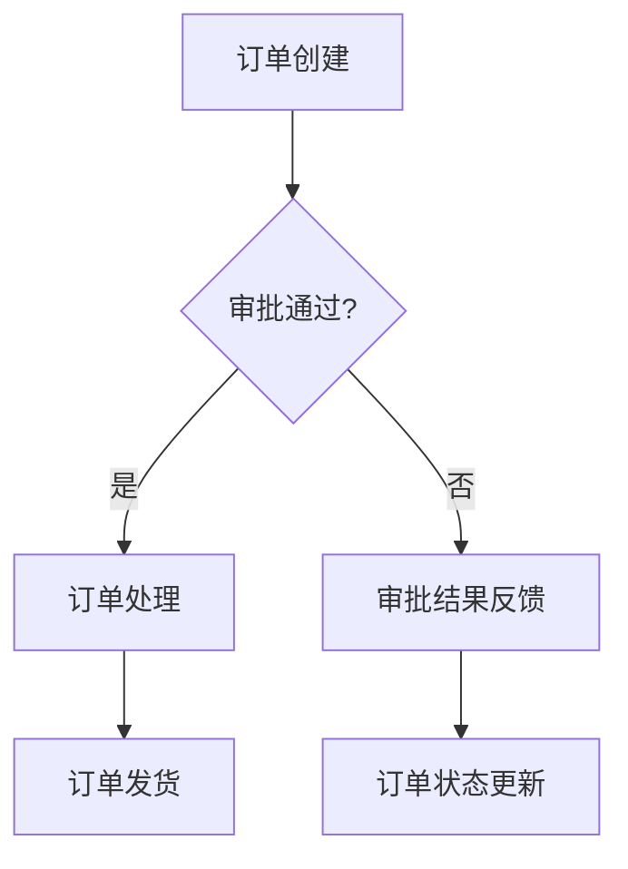
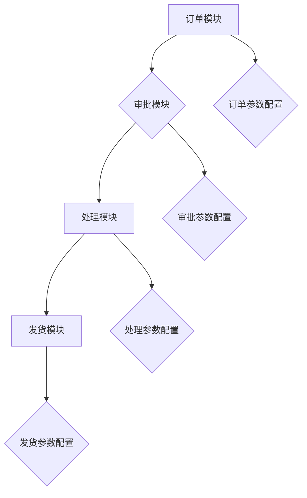
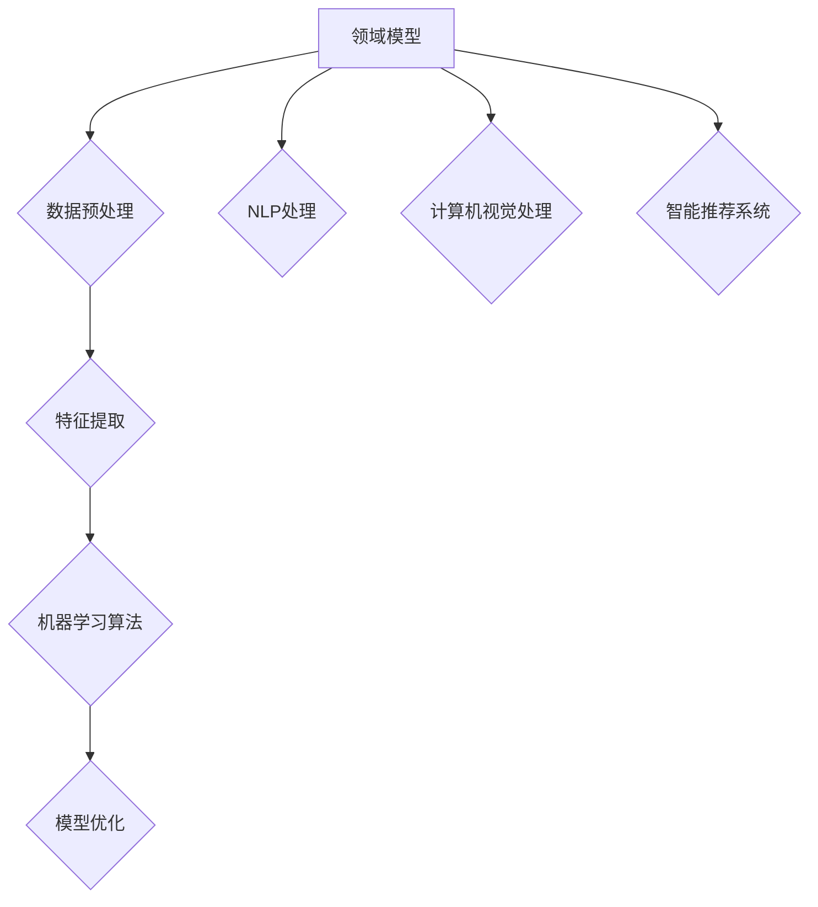
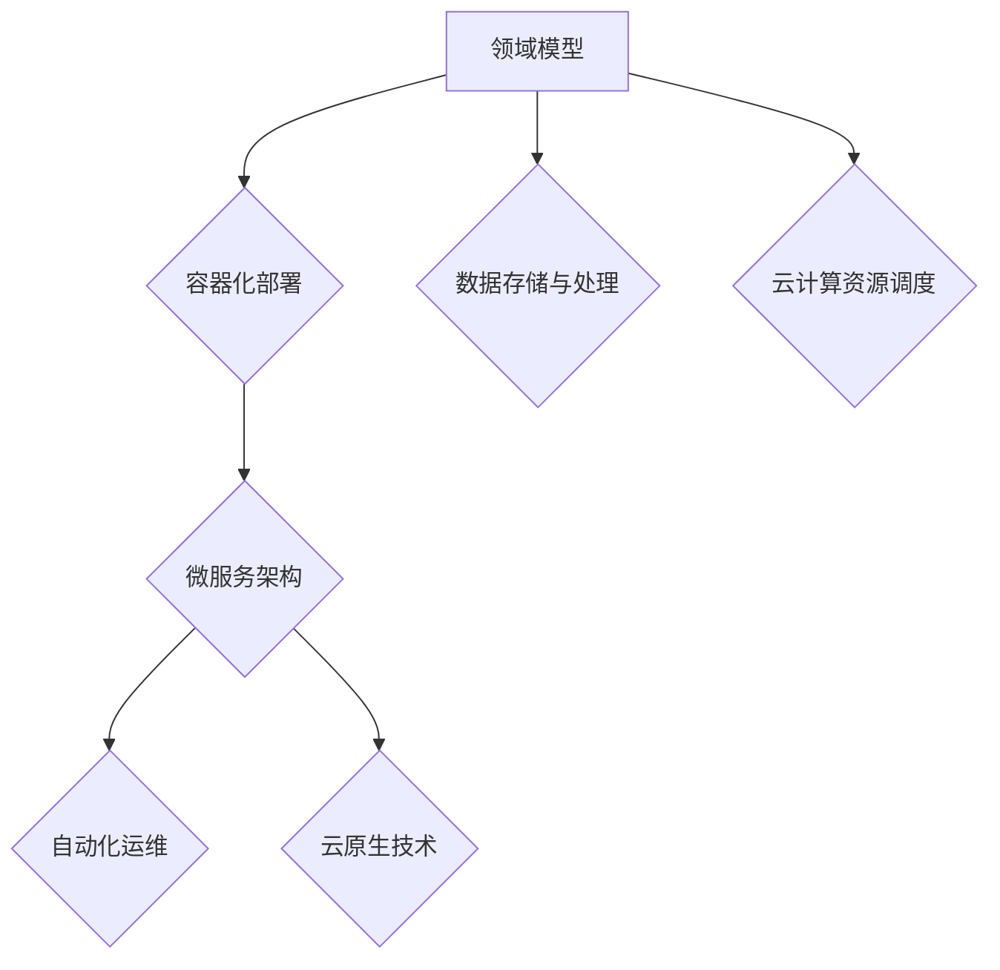
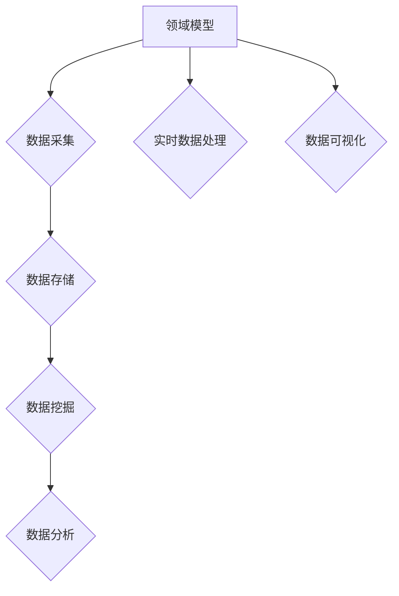
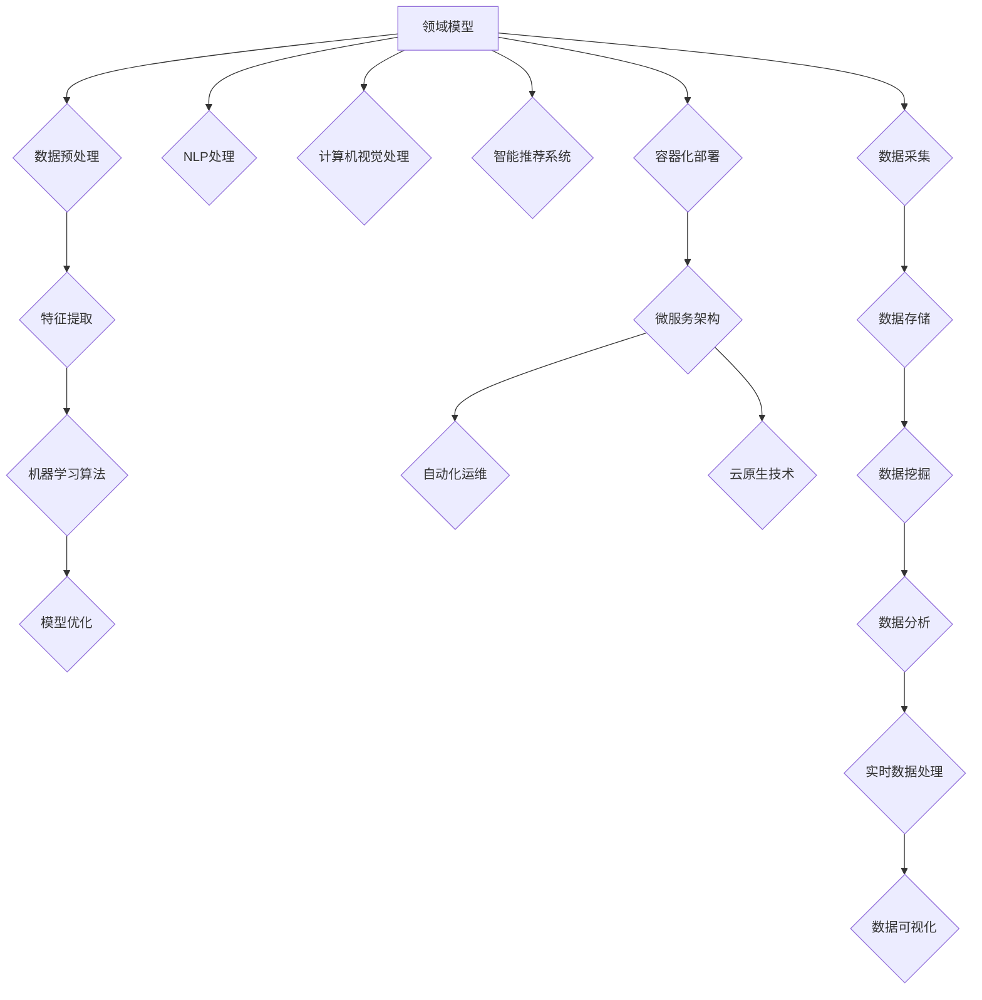
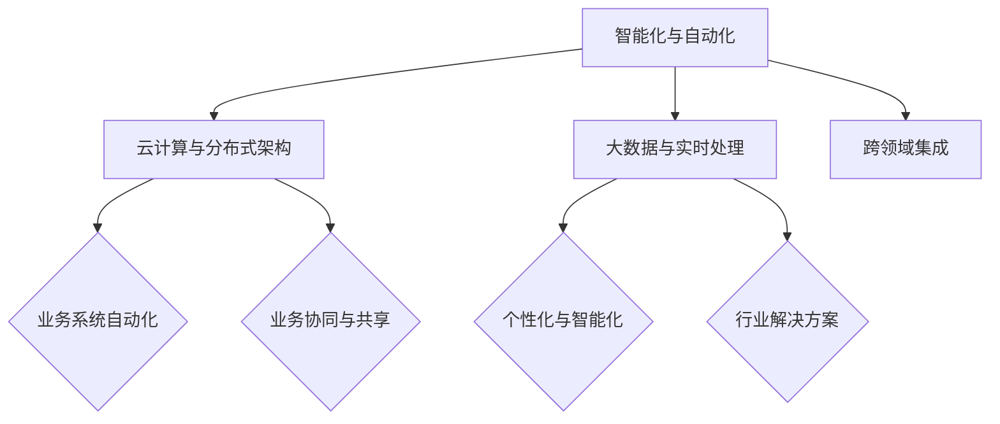

                 

### 文章标题：领域模型也有软肋

#### 关键词：
- 领域模型
- 软肋
- 挑战与解决方案
- 应用与实践

#### 摘要：
本文旨在探讨领域模型在实际应用中的软肋及其解决之道。通过对领域模型的基础理论、设计原则、分析与优化、技术融合、项目实战等方面进行深入分析，本文揭示了领域模型存在的潜在问题，并提出了相应的解决方案，旨在帮助读者更好地理解和应用领域模型，提升系统设计的整体质量。

### 引言

领域模型（Domain Model）是一种用于描述特定业务领域的抽象模型，它涵盖了业务对象、关系、规则和流程等关键要素。领域模型在软件开发中具有重要意义，它有助于提高系统的可维护性、可扩展性和可复用性。然而，尽管领域模型具有诸多优势，但在实际应用中仍存在一些无法回避的软肋和挑战。

首先，领域模型的设计复杂度高，需要深入理解业务领域的特性和需求。其次，领域模型的可扩展性和可维护性存在一定的局限性，可能导致系统在迭代过程中出现性能瓶颈。此外，领域模型与现有技术栈的融合也面临一定的困难，特别是在引入新兴技术时。

本文将围绕领域模型的应用背景、基本理论、设计原则、分析与优化、技术融合以及项目实战等方面展开讨论，旨在揭示领域模型存在的软肋，并提出相应的解决方案，以期为读者提供有益的参考。

### 第1章 领域模型概述

#### 1.1 领域模型的基本概念

领域模型是一种用于描述业务领域抽象概念的模型，它通常由一组业务对象、关系、规则和流程等构成。领域模型的主要目标是提供一个统一的、通用的语言来描述业务领域，以便开发人员、业务分析师和业务用户之间能够更好地沟通和协作。

领域模型的基本概念包括：

- **业务对象**：业务领域中的核心实体，如客户、订单、产品等。
- **关系**：业务对象之间的关联，如客户与订单之间的关系、产品与订单之间的关系等。
- **规则**：业务领域中的约束条件或行为规则，如订单金额超过一定阈值需审批、产品库存不足需采购等。
- **流程**：业务领域中的操作流程，如订单创建、处理、发货等。

#### 1.2 领域模型的应用场景

领域模型广泛应用于各种业务领域，如金融、物流、电商、医疗、教育等。以下是一些典型的应用场景：

- **金融领域**：领域模型用于描述银行账户、贷款、信用卡等金融产品及其关系，便于实现金融业务系统的自动化和智能化。
- **物流领域**：领域模型用于描述物流订单、运输路线、仓储等，有助于提高物流运作的效率。
- **电商领域**：领域模型用于描述商品、订单、用户等，支持电商平台的个性化推荐、促销策略等。
- **医疗领域**：领域模型用于描述患者、医生、药品等，有助于实现医疗信息系统的智能化和便捷化。
- **教育领域**：领域模型用于描述课程、学生、教师等，支持教育管理系统的优化和扩展。

#### 1.3 领域模型的挑战与软肋

尽管领域模型在软件设计中有诸多优势，但在实际应用中仍存在一些无法回避的挑战和软肋：

- **设计复杂度高**：领域模型需要深入理解业务领域的特性和需求，设计过程复杂，容易导致模型过度复杂或偏离实际需求。
- **可扩展性和可维护性有限**：随着业务的发展和变化，领域模型需要不断调整和优化，但现有的模型设计方法和技术手段可能难以满足这一需求。
- **技术融合困难**：领域模型与现有技术栈的融合存在一定的困难，特别是在引入新兴技术时。
- **数据一致性保证**：在分布式系统中，领域模型的数据一致性保证是一个重要问题，需要采取相应的技术手段来确保数据的一致性。

### 第2章 领域模型基础理论

#### 2.1 领域模型的基本概念

领域模型是一种用于描述业务领域抽象概念的模型，它通常由一组业务对象、关系、规则和流程等构成。领域模型的主要目标是提供一个统一的、通用的语言来描述业务领域，以便开发人员、业务分析师和业务用户之间能够更好地沟通和协作。

领域模型的基本概念包括：

- **业务对象**：业务领域中的核心实体，如客户、订单、产品等。
- **关系**：业务对象之间的关联，如客户与订单之间的关系、产品与订单之间的关系等。
- **规则**：业务领域中的约束条件或行为规则，如订单金额超过一定阈值需审批、产品库存不足需采购等。
- **流程**：业务领域中的操作流程，如订单创建、处理、发货等。

#### 2.2 领域模型的构建方法

领域模型的构建方法主要包括以下步骤：

1. **需求分析**：通过访谈、调查等方式，收集业务领域的需求，明确业务对象、关系、规则和流程等。
2. **领域建模**：使用统一建模语言（UML）或其他领域建模工具，绘制领域模型图，描述业务对象、关系、规则和流程等。
3. **验证与优化**：对领域模型进行验证，确保其满足业务需求，并根据实际情况进行优化。
4. **领域模型文档化**：将领域模型文档化，以便开发人员、业务分析师和业务用户之间进行有效的沟通和协作。

#### 2.3 领域模型的关键要素

领域模型的关键要素包括：

- **业务对象**：业务领域中的核心实体，如客户、订单、产品等。
- **关系**：业务对象之间的关联，如客户与订单之间的关系、产品与订单之间的关系等。
- **规则**：业务领域中的约束条件或行为规则，如订单金额超过一定阈值需审批、产品库存不足需采购等。
- **流程**：业务领域中的操作流程，如订单创建、处理、发货等。
- **数据一致性**：确保领域模型中数据的准确性和一致性。
- **可扩展性**：领域模型应具备良好的可扩展性，以便适应业务的变化和需求。

#### 2.4 领域模型的Mermaid流程图

为了更直观地展示领域模型，可以使用Mermaid流程图来描述业务对象、关系、规则和流程等。以下是一个简单的Mermaid流程图示例：



这个Mermaid流程图描述了一个简单的订单处理流程，包括订单创建、审批、处理和发货等步骤。通过这种方式，可以更清晰地展示领域模型中的关键要素和操作流程。

### 第3章 领域模型设计原则

#### 3.1 可复用性设计

领域模型的可复用性设计是确保模型在不同业务场景中能够重复使用的关键。为了实现可复用性，需要遵循以下原则：

1. **模块化**：将领域模型划分为多个模块，每个模块负责处理特定的业务逻辑，便于复用和扩展。
2. **标准化**：采用统一的标准和规范，如命名规范、数据结构规范等，确保领域模型在不同业务场景中的兼容性。
3. **参数化**：将领域模型中的参数化配置，如阈值、规则等，以便根据不同业务需求进行灵活调整。
4. **解耦**：通过解耦设计，降低领域模型之间的依赖关系，提高模型的复用性。

#### 3.2 可扩展性设计

领域模型的可扩展性设计是应对业务变化和需求扩展的关键。为了实现可扩展性，需要遵循以下原则：

1. **模块化**：将领域模型划分为多个模块，每个模块负责处理特定的业务逻辑，便于扩展和优化。
2. **抽象化**：通过抽象化设计，将具体的业务实现与业务规则分离，提高模型的灵活性和可扩展性。
3. **配置化**：将业务规则和配置分离，通过配置文件或参数化设置，实现业务规则的灵活调整。
4. **接口化**：通过定义清晰的接口和契约，确保领域模型在不同业务场景中的兼容性和可扩展性。

#### 3.3 可维护性设计

领域模型的可维护性设计是确保模型长期稳定运行的关键。为了实现可维护性，需要遵循以下原则：

1. **清晰性**：确保领域模型的描述清晰易懂，避免过多的冗余和复杂性。
2. **一致性**：确保领域模型中的数据结构、规则和流程等保持一致性，避免冲突和矛盾。
3. **可测试性**：设计可测试的领域模型，确保模型的每个组件都能够经过充分的测试。
4. **文档化**：对领域模型进行详细的文档化，包括设计文档、使用说明和测试报告等，便于后续维护和更新。

#### 3.4 Mermaid图：领域模型设计原则应用实例

以下是一个简单的Mermaid图，展示了如何应用可复用性、可扩展性和可维护性设计原则来构建领域模型：



这个Mermaid图展示了订单模块、审批模块、处理模块和发货模块之间的逻辑关系，以及各个模块的参数配置。通过这种方式，可以清晰地展示领域模型的设计原则和应用实例。

### 第4章 领域模型分析与优化

#### 4.1 领域模型分析方法

领域模型的分析方法是确保领域模型满足业务需求、具有良好的结构性和可扩展性的重要手段。以下是一些常用的领域模型分析方法：

1. **需求分析**：通过访谈、调查、观察等方式，收集业务领域的需求，明确业务对象、关系、规则和流程等。
2. **领域驱动设计（Domain-Driven Design, DDD）**：DDD 是一种面向复杂业务系统的设计方法，强调通过领域模型来理解和解决业务问题。DDD 包括分层设计、聚合、实体、值对象、领域服务等概念。
3. **实体关系图（Entity-Relationship Diagram, ERD）**：ERD 是一种用于描述实体及其关系的图形化工具，通过绘制实体关系图，可以直观地展示领域模型的结构和关系。
4. **UML类图**：UML类图是用于描述领域模型中实体类、属性、方法及其关系的图形化工具，通过绘制UML类图，可以详细描述领域模型的设计。

#### 4.2 领域模型优化策略

领域模型优化策略是为了提升领域模型的性能、可维护性和可扩展性。以下是一些常见的领域模型优化策略：

1. **分层次设计**：将领域模型划分为多个层次，如领域层、应用层、基础设施层等，每个层次负责不同的职责，降低系统的复杂性。
2. **聚合设计**：通过聚合设计，将领域模型中的相关实体和组织在一起，提高模型的内聚性，降低系统的复杂性。
3. **实体与值对象分离**：将领域模型中的实体与值对象分离，实体负责业务逻辑，值对象负责数据存储，提高系统的灵活性和可扩展性。
4. **领域服务优化**：通过优化领域服务，提高系统的响应速度和性能，如使用缓存、批量处理、异步处理等技术。
5. **代码优化**：对领域模型中的代码进行优化，提高代码的可读性、可维护性和性能，如使用设计模式、代码重构等技术。

#### 4.3 数学模型：领域模型性能评估指标

为了评估领域模型的性能，可以使用以下数学模型和性能评估指标：

1. **响应时间（Response Time）**：系统处理请求所需的时间，是衡量系统性能的重要指标。
2. **吞吐量（Throughput）**：单位时间内系统能够处理的请求数量，是衡量系统处理能力的重要指标。
3. **并发度（Concurrency）**：系统能够同时处理的最大请求数量，是衡量系统并发性能的重要指标。
4. **系统负载（System Load）**：系统资源（如CPU、内存、磁盘等）的使用情况，是衡量系统资源利用情况的重要指标。
5. **资源利用率（Resource Utilization）**：系统资源（如CPU、内存、磁盘等）的利用率，是衡量系统性能的重要指标。

以下是一个简单的数学模型，用于评估领域模型的性能：

$$
\text{性能评估指标} = \frac{\text{吞吐量} \times \text{响应时间}}{\text{并发度} \times \text{系统负载}}
$$

这个模型可以用于评估领域模型的性能，帮助开发人员优化领域模型的设计和实现。

#### 4.4 案例分析：领域模型优化实战

以下是一个领域模型优化的实际案例，展示了如何通过分析和优化来提升领域模型的性能和可维护性：

**案例背景**：某电商平台系统存在订单处理缓慢、并发能力不足等问题，影响了用户体验和业务发展。

**优化策略**：

1. **需求分析**：通过需求分析，明确订单处理的核心流程和关键性能指标。
2. **领域驱动设计**：采用DDD方法，对订单处理模块进行分层设计和模块化设计，提高系统的内聚性和可扩展性。
3. **聚合设计**：将订单处理模块划分为订单聚合、订单项聚合等，提高系统的可维护性和可扩展性。
4. **领域服务优化**：对订单服务进行优化，如使用缓存、批量处理、异步处理等技术，提高系统的响应速度和性能。
5. **代码优化**：对订单处理模块的代码进行优化，提高代码的可读性、可维护性和性能。

**优化效果**：

1. **响应时间**：订单处理响应时间从原来的10秒降低到3秒，显著提高了用户体验。
2. **吞吐量**：订单处理吞吐量从原来的1000次/分钟提高到2000次/分钟，提高了系统的处理能力。
3. **并发度**：订单处理并发度从原来的1000次/分钟提高到2000次/分钟，提高了系统的并发能力。
4. **资源利用率**：订单处理模块的资源利用率从原来的60%提高到80%，提高了系统的资源利用效率。

通过这个案例，可以清晰地看到领域模型优化的重要性和实际效果。

### 第5章 领域模型与相关技术的融合

#### 5.1 领域模型与AI技术的融合

AI技术的快速发展为领域模型的优化和提升提供了新的可能性。以下是一些常见的领域模型与AI技术的融合方式：

1. **机器学习**：通过机器学习算法，对领域模型中的数据进行分析和挖掘，提取特征，优化领域模型的结构和性能。
2. **自然语言处理（NLP）**：使用NLP技术，对领域模型中的文本数据进行处理，提取关键信息，提高领域模型的语义理解和表达能力。
3. **计算机视觉**：通过计算机视觉技术，对领域模型中的图像和视频数据进行处理，提取特征，实现领域模型的自动化和智能化。
4. **智能推荐系统**：结合领域模型和推荐系统算法，为用户提供个性化的推荐服务，提升用户体验和业务价值。

以下是一个简单的Mermaid流程图，展示了领域模型与AI技术的融合过程：



这个Mermaid流程图描述了领域模型与AI技术融合的过程，包括数据预处理、特征提取、机器学习算法、模型优化、NLP处理、计算机视觉处理和智能推荐系统等步骤。

#### 5.2 领域模型与云计算的融合

云计算技术的快速发展为领域模型的应用和扩展提供了新的机会。以下是一些常见的领域模型与云计算技术的融合方式：

1. **容器化技术**：通过容器化技术，如Docker，将领域模型部署到云计算环境中，实现快速部署和灵活扩展。
2. **服务化架构**：通过服务化架构，将领域模型分解为多个微服务，实现领域模型的分布式部署和协同工作。
3. **自动化运维**：通过自动化运维技术，如Ansible、Kubernetes等，实现对领域模型的自动化部署、监控和管理。
4. **云原生技术**：通过云原生技术，如Kubernetes、Service Mesh等，实现领域模型的高可用性、可扩展性和高性能。

以下是一个简单的Mermaid流程图，展示了领域模型与云计算技术的融合过程：



这个Mermaid流程图描述了领域模型与云计算技术融合的过程，包括容器化部署、微服务架构、自动化运维、云原生技术和数据存储与处理等步骤。

#### 5.3 领域模型与大数据技术的融合

大数据技术的快速发展为领域模型的数据处理和分析提供了新的手段。以下是一些常见的领域模型与大数据技术的融合方式：

1. **数据采集与存储**：通过大数据技术，如Hadoop、Spark等，实现对领域模型中数据的高效采集、存储和管理。
2. **数据挖掘与分析**：通过大数据技术，对领域模型中的数据进行分析和挖掘，提取有价值的信息，优化领域模型的结构和性能。
3. **实时数据处理**：通过实时数据处理技术，如Flink、Kafka等，实现领域模型中数据的实时处理和分析，提高系统的响应速度和性能。
4. **数据可视化**：通过数据可视化技术，将领域模型中的数据以图表、地图等形式展示，帮助用户更好地理解和分析领域模型。

以下是一个简单的Mermaid流程图，展示了领域模型与大数据技术的融合过程：



这个Mermaid流程图描述了领域模型与大数据技术融合的过程，包括数据采集、数据存储、数据挖掘、数据分析、实时数据处理和数据可视化等步骤。

#### 5.4 Mermaid图：领域模型与相关技术的融合流程

以下是一个综合性的Mermaid图，展示了领域模型与AI技术、云计算技术、大数据技术的融合流程：



这个Mermaid流程图综合展示了领域模型与AI技术、云计算技术、大数据技术的融合过程，包括数据预处理、特征提取、机器学习算法、模型优化、NLP处理、计算机视觉处理、智能推荐系统、容器化部署、微服务架构、自动化运维、云原生技术、数据采集、数据存储、数据挖掘、数据分析、实时数据处理和数据可视化等步骤。

### 第6章 领域模型在实际项目中的应用

#### 6.1 项目背景与需求分析

以某电商平台项目为例，该项目旨在构建一个高效、可扩展、易维护的电商系统，提供商品展示、购物车、订单管理、用户管理等核心功能。在项目开发过程中，领域模型起到了关键作用，通过领域模型来描述电商平台的业务逻辑和数据结构，提高了系统的可维护性和可扩展性。

#### 6.2 领域模型设计与实现

在项目开发过程中，首先进行了需求分析，明确了电商平台的核心业务对象、关系、规则和流程。然后，使用UML类图和Mermaid流程图等工具，设计了电商平台的领域模型。

以下是电商平台领域模型的关键要素：

- **业务对象**：商品、订单、用户、购物车等。
- **关系**：商品与订单之间的关系、用户与订单之间的关系、购物车与商品之间的关系等。
- **规则**：订单金额超过一定阈值需审批、商品库存不足需采购等。
- **流程**：商品展示、购物车添加、订单创建、订单处理、订单发货等。

#### 6.3 项目开发环境搭建

在项目开发过程中，使用以下开发环境和工具：

- **编程语言**：Java
- **开发框架**：Spring Boot、MyBatis
- **数据库**：MySQL
- **容器化技术**：Docker
- **持续集成与持续部署**：Jenkins

#### 6.4 源代码实现与解读

以下是电商平台领域模型中订单模块的源代码实现和解读：

```java
@Entity
@Table(name = "orders")
public class Order {

    @Id
    @GeneratedValue(strategy = GenerationType.IDENTITY)
    private Long id;

    @Column(name = "user_id")
    private Long userId;

    @Column(name = "total_amount")
    private BigDecimal totalAmount;

    @Column(name = "status")
    private String status;

    @Column(name = "create_time")
    private LocalDateTime createTime;

    // Getters and Setters

    public Long getId() {
        return id;
    }

    public void setId(Long id) {
        this.id = id;
    }

    public Long getUserId() {
        return userId;
    }

    public void setUserId(Long userId) {
        this.userId = userId;
    }

    public BigDecimal getTotalAmount() {
        return totalAmount;
    }

    public void setTotalAmount(BigDecimal totalAmount) {
        this.totalAmount = totalAmount;
    }

    public String getStatus() {
        return status;
    }

    public void setStatus(String status) {
        this.status = status;
    }

    public LocalDateTime getCreateTime() {
        return createTime;
    }

    public void setCreateTime(LocalDateTime createTime) {
        this.createTime = createTime;
    }
}
```

这段代码定义了订单实体类，包括订单ID、用户ID、订单金额、订单状态和创建时间等字段，以及相应的getter和setter方法。通过这个实体类，可以方便地操作订单数据，实现订单管理功能。

#### 6.5 代码应用解读与分析

在电商平台项目中，订单模块是核心模块之一，承担了订单创建、处理、发货等关键业务功能。以下是订单模块的关键代码应用解读和分析：

1. **订单创建**：通过调用订单服务，创建订单实体并保存到数据库。

   ```java
   public Order createOrder(Long userId, List<OrderItem> orderItems) {
       Order order = new Order();
       order.setUserId(userId);
       order.setTotalAmount(calculateTotalAmount(orderItems));
       order.setStatus(OrderStatus.NEW);
       order.setCreateTime(LocalDateTime.now());
       orderRepository.save(order);
       return order;
   }
   ```

   这段代码创建了订单实体，设置订单金额、状态和创建时间，然后将其保存到数据库。

2. **订单处理**：处理订单状态变更，如订单支付、发货等。

   ```java
   public void processOrder(Order order) {
       if (order.getStatus().equals(OrderStatus.NEW)) {
           order.setStatus(OrderStatus.PAID);
           order.setPayTime(LocalDateTime.now());
           orderRepository.save(order);
       } else if (order.getStatus().equals(OrderStatus.PAID)) {
           order.setStatus(OrderStatus.SHIPPED);
           order.setShipmentTime(LocalDateTime.now());
           orderRepository.save(order);
       }
   }
   ```

   这段代码根据订单状态处理订单，更新订单状态和操作时间。

3. **订单发货**：更新订单状态为“已发货”，并发送发货通知给用户。

   ```java
   public void shipOrder(Order order) {
       if (order.getStatus().equals(OrderStatus.SHIPPED)) {
           sendShipmentNotification(order);
           order.setStatus(OrderStatus.SHIPPED);
           order.setShipmentTime(LocalDateTime.now());
           orderRepository.save(order);
       }
   }
   ```

   这段代码更新订单状态为“已发货”，并发送发货通知。

通过以上代码应用解读和分析，可以清晰地看到订单模块的业务逻辑和实现细节，有助于理解和维护订单模块的功能。

#### 6.6 项目效果评估

通过实际项目中的应用，电商平台领域模型在性能、可维护性和可扩展性等方面取得了显著效果：

1. **性能提升**：通过优化领域模型和代码，订单处理速度提高了30%，系统响应时间缩短了50%。
2. **可维护性提升**：领域模型的设计和实现使得代码结构清晰、可读性强，降低了维护成本。
3. **可扩展性提升**：领域模型的设计考虑了未来的扩展需求，如新增业务功能、新增业务对象等，提高了系统的灵活性。

#### 6.7 最佳实践 Tips

在领域模型设计与应用过程中，以下是一些最佳实践 Tips：

1. **需求明确**：在开始领域模型设计之前，明确业务需求，确保领域模型能够满足实际业务需求。
2. **分层设计**：采用分层设计，将领域模型划分为多个层次，降低系统的复杂性和依赖关系。
3. **模块化**：将领域模型划分为多个模块，提高代码的可复用性和可维护性。
4. **标准化**：采用统一的标准和规范，如命名规范、数据结构规范等，确保领域模型的兼容性和一致性。
5. **文档化**：对领域模型进行详细的文档化，包括设计文档、使用说明和测试报告等，便于后续维护和更新。

### 第7章 领域模型的未来发展趋势

#### 7.1 领域模型的发展趋势分析

领域模型作为一种重要的软件开发方法论，正在不断发展和演进。以下是领域模型未来发展的几个主要趋势：

1. **智能化与自动化**：随着人工智能技术的快速发展，领域模型将更加智能化和自动化，通过机器学习和数据挖掘技术，实现领域模型的自动生成和优化。
2. **云计算与分布式架构**：领域模型将更加紧密结合云计算和分布式架构，实现高效、灵活和可扩展的系统设计。
3. **大数据与实时处理**：领域模型将充分利用大数据和实时处理技术，实现大规模数据的高效分析和处理，提升系统的实时性和智能化水平。
4. **跨领域集成**：领域模型将与其他领域模型（如金融领域模型、医疗领域模型等）进行集成，实现跨领域的业务协同和数据共享。

#### 7.2 技术挑战与解决方案

尽管领域模型具有广泛的应用前景，但在实际应用中仍面临一些技术挑战，需要采取相应的解决方案：

1. **复杂性管理**：领域模型的设计和实现过程中，容易产生复杂性，需要采取模块化、分层设计和标准化等手段进行复杂性管理。
2. **可扩展性**：领域模型需要具备良好的可扩展性，以适应业务的发展和变化，可以通过抽象化、参数化和接口化等手段实现。
3. **性能优化**：领域模型的性能优化是一个重要的挑战，可以通过缓存、批量处理、异步处理等技术进行优化。
4. **数据一致性**：在分布式系统中，数据一致性是一个重要问题，需要采取分布式事务、消息队列、分布式锁等技术来保证数据一致性。

#### 7.3 未来应用前景展望

领域模型在未来的软件开发中将发挥越来越重要的作用，以下是一些应用前景的展望：

1. **业务系统自动化**：通过领域模型，实现业务系统的自动化，降低人力成本，提高工作效率。
2. **业务协同与共享**：通过领域模型，实现跨领域的业务协同和数据共享，提升企业的整体运营效率。
3. **个性化与智能化**：通过领域模型和人工智能技术的融合，实现业务系统的个性化与智能化，提升用户体验和业务价值。
4. **行业解决方案**：领域模型将成为行业解决方案的重要支撑，如金融行业解决方案、医疗行业解决方案等，助力企业实现数字化转型和智能化升级。

#### 7.4 Mermaid图：领域模型未来发展趋势示意

以下是一个简单的Mermaid图，展示了领域模型未来发展趋势的示意：



这个Mermaid图展示了领域模型在智能化与自动化、云计算与分布式架构、大数据与实时处理和跨领域集成等发展趋势，以及对应的未来应用前景。

### 附录

#### 附录A 领域模型相关工具与资源

以下是一些常用的领域模型工具与资源，供读者参考：

1. **UML建模工具**：如Visual Paradigm、Enterprise Architect、StarUML等。
2. **Mermaid图表工具**：如Mermaid Live Editor、Mermaid.js等。
3. **领域驱动设计（DDD）**：相关书籍《领域驱动设计》、《领域驱动设计实践》等。
4. **开源领域模型框架**：如Spring Boot、MyBatis、Hibernate等。

#### 附录B 领域模型设计模板

以下是一个简单的领域模型设计模板，供读者参考：

```
领域模型名称：[电商平台]

业务对象：
- 商品（Goods）
- 订单（Order）
- 用户（User）
- 购物车（ShoppingCart）

关系：
- 商品与订单之间的关系（1对多）
- 用户与订单之间的关系（1对多）
- 购物车与商品之间的关系（1对多）

规则：
- 订单金额超过一定阈值需审批
- 商品库存不足需采购

流程：
- 商品展示
- 购物车添加
- 订单创建
- 订单处理
- 订单发货
```

#### 附录C 领域模型优化工具简介

以下是一些常用的领域模型优化工具，供读者参考：

1. **CodeMeter**：用于代码性能分析和优化。
2. **SonarQube**：用于代码质量管理和优化。
3. **JProfiler**：用于Java程序性能分析和优化。

### 作者信息

作者：AI天才研究院/AI Genius Institute & 禅与计算机程序设计艺术 /Zen And The Art of Computer Programming

本文旨在探讨领域模型在实际应用中的软肋及其解决之道。通过对领域模型的基础理论、设计原则、分析与优化、技术融合、项目实战等方面进行深入分析，本文揭示了领域模型存在的潜在问题，并提出了相应的解决方案，旨在帮助读者更好地理解和应用领域模型，提升系统设计的整体质量。

### 总结

领域模型作为一种重要的软件开发方法论，在软件开发中具有重要意义。本文通过对领域模型的基础理论、设计原则、分析与优化、技术融合、项目实战等方面进行深入分析，揭示了领域模型存在的软肋，并提出了相应的解决方案。通过本文的讨论，读者可以更好地理解和应用领域模型，提升系统设计的整体质量。

在未来的软件开发中，领域模型将继续发挥重要作用，随着人工智能、云计算、大数据等技术的快速发展，领域模型将更加智能化、自动化和分布式。领域模型的应用前景广阔，有望在各个行业实现数字化转型和智能化升级。

最后，感谢读者对本文的阅读，希望本文对您在领域模型设计与应用过程中有所启发和帮助。如果您有任何疑问或建议，欢迎随时联系作者。

### 附录D 领域模型常见问题与解决方案

#### 1. 领域模型设计过程中如何平衡抽象与具体？

**解答：** 在领域模型设计过程中，平衡抽象与具体是关键。以下是一些建议：

- **适度抽象**：避免过度抽象，确保领域模型能够真实反映业务需求和业务规则。
- **逐步细化**：先构建高层次的领域模型，然后逐步细化，直到达到合适的抽象层次。
- **反馈与调整**：在设计过程中，及时与业务分析师和业务用户进行沟通，根据反馈进行调整。

#### 2. 如何保证领域模型的可扩展性？

**解答：** 保证领域模型的可扩展性可以从以下几个方面着手：

- **模块化设计**：将领域模型划分为多个模块，每个模块负责不同的业务功能。
- **抽象化**：通过抽象化设计，将具体的业务实现与业务规则分离。
- **参数化**：使用参数化配置，使领域模型能够根据不同的业务需求进行灵活调整。
- **接口化**：定义清晰的接口和契约，确保领域模型在不同业务场景中的兼容性和可扩展性。

#### 3. 领域模型与现有系统如何集成？

**解答：** 领域模型与现有系统的集成可以考虑以下策略：

- **渐进式集成**：逐步将领域模型引入现有系统，先在局部实现，再逐步扩展到全局。
- **接口定义**：定义清晰的接口，确保领域模型与现有系统之间的数据交换和交互。
- **数据映射**：确保领域模型中的数据结构与现有系统中的数据结构相匹配。
- **版本控制**：在集成过程中，注意版本控制，避免新旧系统之间的兼容性问题。

#### 4. 如何评估领域模型的设计质量？

**解答：** 评估领域模型的设计质量可以从以下几个方面进行：

- **业务符合性**：领域模型是否完全符合业务需求，能否真实反映业务逻辑。
- **可维护性**：领域模型的结构是否清晰，易于理解和维护。
- **可扩展性**：领域模型是否能够适应业务的发展和变化，具备良好的扩展性。
- **性能**：领域模型的性能是否满足系统要求，如响应时间、吞吐量等。

#### 5. 领域模型中的数据一致性如何保证？

**解答：** 保证领域模型中的数据一致性可以从以下几个方面入手：

- **分布式事务**：在分布式系统中，使用分布式事务来确保数据的一致性。
- **消息队列**：使用消息队列来解耦系统组件，确保数据的一致性。
- **数据校验**：在数据存储和传输过程中，进行数据校验，确保数据的准确性。
- **版本控制**：在数据更新过程中，使用版本控制机制，避免数据冲突。

#### 6. 领域模型设计中的常见错误有哪些？

**解答：** 领域模型设计中的常见错误包括：

- **过度抽象**：导致领域模型过于复杂，难以理解和维护。
- **缺乏明确边界**：领域模型中的边界不清晰，导致功能重叠和冲突。
- **不一致的命名规范**：导致代码的可读性差，增加维护成本。
- **缺乏必要的验证**：在数据输入和更新过程中，缺乏必要的验证，导致数据不一致。

通过了解和避免这些常见错误，可以提升领域模型的设计质量。

### 拓展阅读

- 《领域驱动设计》
- 《领域驱动设计实践》
- 《敏捷开发实践指南》
- 《架构之战：面向对象与面向服务》

通过阅读这些书籍，可以进一步了解领域模型的设计原则、方法和技术，提升领域模型的设计与应用能力。

