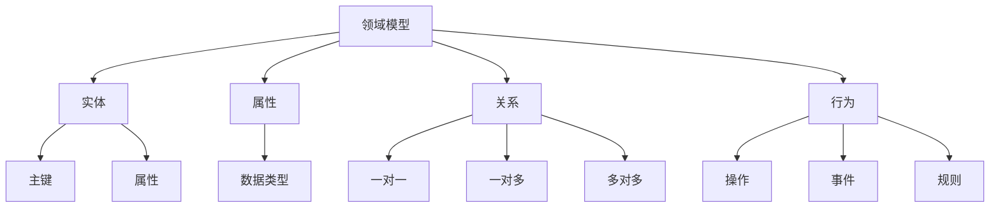

                 

### 文章标题

《领域模型也有软肋》

### 关键词

领域模型、软肋、设计方法论、实现与优化、案例分析、软肋识别、应对策略

### 摘要

本文深入探讨了领域模型在软件开发中的重要性，以及其潜在的软肋。通过对领域模型的基本概念、设计方法、实现与优化以及案例分析等方面的全面剖析，本文揭示了领域模型在实际应用中可能面临的问题和挑战。此外，本文还提出了识别领域模型软肋的方法和应对策略，为软件开发者提供了实用的指导和借鉴。希望通过本文，能够帮助读者更好地理解和应用领域模型，提升软件开发的效率和质量。

### 背景介绍

领域模型（Domain Model）是软件开发中的一种核心概念，它用于表示特定业务领域的实体、属性、关系和行为。领域模型的目的是将业务领域中的复杂性抽象为软件可以理解和处理的结构，从而提高软件的可维护性和可扩展性。在软件开发过程中，领域模型充当了桥梁，将业务需求转化为技术实现。

领域模型的应用范围广泛，包括但不限于电子商务、金融、医疗、制造业等领域。通过建立领域模型，开发人员可以更好地理解业务需求，从而设计出更加符合业务逻辑的软件系统。例如，在电子商务领域中，领域模型可以用于表示商品、订单、用户等实体，以及它们之间的各种关系，如用户与商品的关系、订单与商品的关系等。

然而，尽管领域模型在软件开发中具有重要作用，但它并非完美无缺。在实际应用中，领域模型可能会面临一系列挑战，如设计复杂性、模型匹配性、性能瓶颈等。这些问题可能会导致领域模型无法充分发挥其潜力，甚至影响到软件系统的稳定性和可靠性。因此，深入探讨领域模型的软肋，并寻找有效的应对策略，对于提高软件开发的质量和效率具有重要意义。

### 核心概念与联系

在深入探讨领域模型之前，我们需要明确一些核心概念，并了解它们之间的相互关系。以下是一个简单的 Mermaid 流程图，展示了领域模型中的关键概念及其相互关系：

**核心概念解释：**

1. **领域模型（Domain Model）**：领域模型是对特定业务领域的抽象表示，包括实体、属性、关系和行为。
2. **实体（Entity）**：实体是领域模型中的核心元素，表示业务领域中的具体对象，如用户、商品、订单等。实体通常具有唯一的标识符（主键）和一组属性。
3. **属性（Attribute）**：属性是实体的特征或特性，用于描述实体的状态。属性可以具有不同的数据类型，如字符串、数字、日期等。
4. **关系（Relationship）**：关系描述了实体之间的关联。关系可以是“一对一”、“一对多”或“多对多”。这些关系有助于定义实体之间的交互方式和依赖关系。
5. **行为（Behavior）**：行为是实体的操作或能力，用于实现业务逻辑。行为可以是简单的操作，如添加、删除或更新实体，也可以是复杂的事件处理或业务规则。

通过这个流程图，我们可以清晰地看到各个核心概念之间的相互联系。领域模型通过实体、属性、关系和行为来构建，这些概念共同构成了一个完整的业务抽象，为软件开发提供了坚实的基础。

### 领域模型的设计方法论

领域模型的设计是软件开发中至关重要的一步，它决定了软件系统是否能够准确、高效地满足业务需求。设计方法论是指一系列用于指导领域模型设计过程的原则、步骤和技术。在敏捷开发与领域驱动设计（Domain-Driven Design，简称DDD）的指导下，领域模型的设计变得更加系统和高效。

#### 敏捷开发与领域驱动设计

敏捷开发（Agile Development）是一种以人为核心、迭代、渐进的软件开发方法。敏捷开发强调与用户的紧密合作、响应变化和持续交付价值。领域驱动设计（DDD）则是一种面向业务领域的软件开发方法，它强调通过清晰的领域模型来理解业务，并将业务逻辑融入到软件中。

#### 领域模型的设计步骤

1. **了解业务需求**：在开始设计领域模型之前，首先要与业务人员沟通，了解业务需求。这包括业务的业务目标、用户场景、业务规则等。
   
2. **识别核心实体**：根据业务需求，识别出领域模型中的核心实体。实体是领域模型中的基本构建块，表示业务领域中的关键对象。

3. **定义属性与行为**：为每个实体定义属性和行为。属性描述了实体的状态，行为描述了实体的操作。

4. **建立实体之间的关系**：确定实体之间的关系，如一对一、一对多、多对多关系。这些关系有助于定义实体之间的依赖和交互。

5. **设计领域服务**：领域服务是实现业务逻辑的组件，用于处理复杂的业务操作。领域服务通常与实体紧密相关。

6. **持续迭代与改进**：领域模型的设计是一个迭代过程，随着项目的进行和业务的演变，领域模型也需要不断更新和改进。

#### 领域模型的应用场景

领域模型适用于各种业务复杂度较高的软件系统，特别是在以下场景中，领域模型的作用尤为显著：

1. **大型企业级应用**：在大型企业级应用中，领域模型有助于管理复杂的业务逻辑，提高系统的可维护性和可扩展性。
   
2. **电子商务系统**：电子商务系统涉及大量的实体和关系，如商品、订单、用户等，领域模型能够帮助开发人员清晰地组织和管理这些业务元素。

3. **金融系统**：金融系统中的业务规则通常非常复杂，领域模型有助于将复杂的金融产品和服务抽象为易于理解和操作的模型。

4. **医疗系统**：医疗系统涉及多种实体和关系，如病人、医生、药品等，领域模型能够帮助开发人员构建出符合医疗行业标准的系统。

#### 领域模型的实现与优化

1. **数据模型设计**：领域模型的数据模型是实现领域模型的基础。设计数据模型时，需要考虑实体的属性、关系和行为，以及数据库的性能和可扩展性。

2. **ORM框架选择**：对象关系映射（Object-Relational Mapping，简称ORM）框架能够将领域模型映射到数据库中。选择合适的ORM框架可以简化数据访问操作，提高开发效率。

3. **缓存与优化**：对于频繁访问的数据，可以使用缓存技术来提高系统性能。合理的缓存策略可以减少数据库访问次数，提高数据读取速度。

4. **领域服务的实现**：领域服务的实现需要考虑业务逻辑的复杂度、系统的可维护性和可扩展性。通常，领域服务会采用分层架构来实现，以便于管理和维护。

#### 领域模型的测试与验证

1. **单元测试**：单元测试是验证领域模型功能的最基本方法。通过编写测试用例，对领域模型中的每个组件进行独立测试，确保它们按预期工作。

2. **集成测试**：集成测试用于验证领域模型中各个组件之间的交互是否符合预期。这通常涉及到多个领域的集成，需要使用模拟对象和测试工具来验证系统的整体功能。

3. **性能测试**：性能测试用于评估领域模型的性能，包括响应时间、吞吐量、资源利用率等指标。通过性能测试，可以发现领域模型中的性能瓶颈，并采取相应的优化措施。

4. **用户验收测试**：用户验收测试（User Acceptance Testing，简称UAT）是验证领域模型是否满足用户需求的重要环节。UAT通常由业务人员或最终用户执行，以确保系统的功能和用户体验符合预期。

#### 持续改进与演进

领域模型的设计和实现是一个持续改进的过程。随着业务的发展和技术变革，领域模型也需要不断更新和优化。以下是一些持续改进的方法：

1. **代码审查与重构**：定期进行代码审查，发现和修复潜在的问题，同时进行代码重构，提高代码的可读性和可维护性。

2. **需求变化应对**：在业务需求发生变化时，及时调整领域模型，以适应新的业务需求。

3. **领域知识的积累**：积累领域知识，包括业务规则、最佳实践和技术经验，以提高领域模型的设计质量和实现效率。

4. **团队协作与培训**：加强团队协作，提高团队成员对领域模型的理解和技能。定期进行培训，帮助团队成员掌握领域模型的设计和实现方法。

通过以上方法论和步骤，开发人员可以构建出高质量的领域模型，从而提高软件系统的可维护性、可扩展性和用户体验。

### 领域模型的实现与优化

领域模型的实现和优化是确保软件系统高效运行的关键环节。以下将从数据模型设计、ORM框架选择、缓存策略、领域服务的实现以及性能测试等方面，详细探讨领域模型的实现与优化方法。

#### 数据模型设计

数据模型是领域模型在数据库中的映射，其设计质量直接影响系统的性能和可维护性。设计数据模型时，需要考虑以下几个关键点：

1. **实体与关系的抽象**：首先，将领域模型中的实体和关系映射到数据库中的表和关系。实体通常映射为数据库表，而关系则通过外键来实现。

2. **规范化**：遵循数据库规范化原则，减少数据冗余和更新异常。常见的规范化级别包括第一范式（1NF）、第二范式（2NF）和第三范式（3NF）。

3. **索引优化**：为常用查询创建索引，提高查询性能。索引可以减少磁盘I/O操作，加快数据检索速度。

4. **数据完整性约束**：定义数据完整性约束，如主键、外键和唯一性约束，确保数据的正确性和一致性。

#### ORM框架选择

ORM框架能够将领域模型映射到数据库中，简化数据访问操作。选择合适的ORM框架对于提高开发效率和系统性能至关重要。以下是一些常见的ORM框架及其特点：

1. **Hibernate**：Hibernate是一个流行的Java ORM框架，支持JDBC和JPA标准。它具有强大的数据映射能力和优化功能，但学习曲线较陡峭。

2. **Entity Framework**：Entity Framework是微软开发的.NET ORM框架，支持实体数据模型（EDMX）和数据上下文（DbContext）。它易于使用，但性能和灵活性相对较低。

3. **MyBatis**：MyBatis是一个基于SQL映射的持久层框架，它允许开发者自定义SQL语句和映射规则。它具有较高的灵活性和性能，但需要编写更多的代码。

4. **SequoiaDB**：SequoiaDB是一个分布式数据库管理系统，支持文档、宽表和列族等多种数据模型。它适用于大规模分布式系统，但需要额外的学习成本。

在选择ORM框架时，需要考虑项目需求、开发团队的技术背景和系统的性能要求。

#### 缓存策略

缓存策略是提高系统性能的有效手段。通过缓存，可以减少对数据库的访问次数，加快数据读取速度。以下是一些常见的缓存策略：

1. **内存缓存**：使用内存缓存（如Redis、Memcached）来存储常用数据，提高数据访问速度。内存缓存适用于读取频繁、数据量较小的场景。

2. **分布式缓存**：对于分布式系统，可以使用分布式缓存（如Apache Ignite、Consul）来统一管理缓存数据。分布式缓存可以提供更高的并发性能和容错能力。

3. **数据分片**：对于大数据场景，可以通过数据分片（如ShardingSphere、Sharding-JDBC）来降低单台服务器的负载。数据分片可以将数据分散存储在多个节点上，提高系统的读写性能。

#### 领域服务的实现

领域服务是实现业务逻辑的核心组件。在实现领域服务时，需要考虑以下几个方面：

1. **分层架构**：采用分层架构（如MVC、MVVM）来组织代码，将领域服务划分为不同的层次，如表示层、业务逻辑层和数据访问层。

2. **接口设计**：定义清晰的服务接口，明确服务的输入参数和返回结果。接口设计应遵循RESTful风格或RPC协议，便于服务调用和扩展。

3. **事务管理**：在领域服务中实现事务管理，确保数据的一致性和完整性。可以使用事务管理器（如Spring Transaction Manager）来管理事务。

4. **异步处理**：对于耗时较长的操作，可以采用异步处理（如使用消息队列、异步线程池）来提高系统的响应速度和并发性能。

#### 性能测试

性能测试是评估领域模型性能的重要手段。以下是一些常见的性能测试方法和工具：

1. **负载测试**：模拟多用户并发访问，测试系统的负载性能。常见的工具包括JMeter、LoadRunner。

2. **压力测试**：在系统承受最大负载的情况下，测试系统的稳定性和可靠性。常用的工具包括Apache JMeter、Gatling。

3. **基准测试**：通过比较不同实现方案的性能，选择最优的方案。常用的工具包括Benchmark、profiling工具。

4. **监控与优化**：通过监控系统的性能指标（如CPU、内存、磁盘I/O等），识别性能瓶颈，并采取相应的优化措施。

通过上述方法，开发人员可以有效地实现和优化领域模型，提高软件系统的性能和可维护性。同时，持续的性能优化和迭代改进也是确保系统长期稳定运行的关键。

### 领域模型案例分析

为了更深入地理解领域模型在实际项目中的应用，以下将结合三个具体案例——电商领域模型、金融领域模型和医疗领域模型，详细分析领域模型在这些不同领域的具体应用，包括其核心组件和实现细节。

#### 案例一：电商领域模型

在电子商务领域，领域模型主要用于管理商品、订单、用户等核心实体，以及它们之间的复杂关系。以下是一个电商领域模型的核心组件和实现细节：

1. **核心实体**：
   - **商品（Product）**：包括商品ID、名称、描述、价格、库存数量等属性。
   - **订单（Order）**：包括订单ID、用户ID、订单日期、订单状态等属性。
   - **用户（User）**：包括用户ID、姓名、邮箱、地址等属性。

2. **关系**：
   - **用户与订单**：一个用户可以创建多个订单，属于一对多的关系。
   - **订单与商品**：一个订单可以包含多个商品，属于一对多的关系。

3. **实现细节**：
   - **数据模型**：使用关系型数据库（如MySQL）来实现领域模型，商品、订单和用户分别映射为数据库表。
   - **ORM框架**：采用Hibernate框架来实现数据映射，简化数据访问操作。

4. **业务逻辑**：
   - **商品管理**：包括商品的添加、修改、删除和查询操作。
   - **订单管理**：包括订单的创建、取消、支付和查询操作。
   - **用户管理**：包括用户的注册、登录、信息修改和查询操作。

#### 案例二：金融领域模型

在金融领域，领域模型主要用于管理金融产品、交易、用户等实体，以及它们之间的复杂关系。以下是一个金融领域模型的核心组件和实现细节：

1. **核心实体**：
   - **金融产品（FinancialProduct）**：包括产品ID、名称、描述、利率、期限等属性。
   - **交易（Transaction）**：包括交易ID、用户ID、交易日期、交易金额等属性。
   - **用户（User）**：包括用户ID、姓名、邮箱、地址等属性。

2. **关系**：
   - **用户与交易**：一个用户可以执行多个交易，属于一对多的关系。
   - **金融产品与交易**：一个金融产品可以参与多个交易，属于多对多的关系。

3. **实现细节**：
   - **数据模型**：使用关系型数据库（如Oracle）来实现领域模型，金融产品、交易和用户分别映射为数据库表。
   - **ORM框架**：采用Spring Data JPA框架来实现数据映射，简化数据访问操作。

4. **业务逻辑**：
   - **金融产品管理**：包括金融产品的添加、修改、删除和查询操作。
   - **交易管理**：包括交易的创建、取消、支付和查询操作。
   - **用户管理**：包括用户的注册、登录、信息修改和查询操作。

5. **额外挑战**：
   - **高并发处理**：金融系统需要处理大量并发交易，因此需要采用分布式事务管理技术（如SAGA模式）来确保数据的一致性。
   - **风险控制**：金融领域涉及风险控制，需要实现复杂的风险评估和预警机制。

#### 案例三：医疗领域模型

在医疗领域，领域模型主要用于管理病人、医生、药品等实体，以及它们之间的复杂关系。以下是一个医疗领域模型的核心组件和实现细节：

1. **核心实体**：
   - **病人（Patient）**：包括病人ID、姓名、年龄、性别、病历号等属性。
   - **医生（Doctor）**：包括医生ID、姓名、专业、职称等属性。
   - **药品（Medicine）**：包括药品ID、名称、规格、生产厂家等属性。

2. **关系**：
   - **病人与医生**：一个病人可以预约多个医生，属于一对多的关系。
   - **医生与药品**：一个医生可以开具多个药品处方，属于一对多的关系。
   - **药品与病人**：一个药品可以被多个病人使用，属于多对多的关系。

3. **实现细节**：
   - **数据模型**：使用关系型数据库（如PostgreSQL）来实现领域模型，病人、医生和药品分别映射为数据库表。
   - **ORM框架**：采用Spring Data JPA框架来实现数据映射，简化数据访问操作。

4. **业务逻辑**：
   - **病人管理**：包括病人的注册、信息查询、预约医生等操作。
   - **医生管理**：包括医生的注册、信息查询、开具处方等操作。
   - **药品管理**：包括药品的添加、修改、删除和查询操作。

5. **额外挑战**：
   - **数据隐私与安全**：医疗领域涉及敏感数据，需要严格保护病人信息和医生隐私。
   - **医疗法规遵循**：需要遵循相关的医疗法规和标准，确保系统的合法合规。

通过上述三个案例，我们可以看到领域模型在不同领域的具体应用和实现细节。领域模型不仅有助于管理复杂的业务逻辑，还能够提高软件系统的可维护性和可扩展性。在实际项目中，根据业务需求和技术环境，灵活应用领域模型，可以有效地解决复杂业务问题。

### 领域模型的软肋分析

尽管领域模型在软件开发中具有显著的优势，但在实际应用中，领域模型也存在一些潜在的软肋，这些软肋可能会导致系统的稳定性、可靠性和可维护性下降。以下将深入探讨领域模型常见的软肋，包括设计复杂性、模型匹配性、性能瓶颈和依赖管理等问题，并分析其具体表现和影响。

#### 设计复杂性

领域模型的设计是一个复杂的过程，需要充分考虑业务需求、系统架构和用户交互等多方面因素。以下是一些设计复杂性方面的问题：

1. **复杂性累积**：随着项目的进行，领域模型可能会逐渐变得复杂，特别是在大型系统中。这可能导致代码难以理解和维护。
   
2. **过度设计**：为了追求完美，开发人员可能会过度设计领域模型，引入过多的实体和关系，导致模型过于庞大和复杂。

3. **设计偏差**：在领域模型设计过程中，可能由于对业务需求理解不准确或忽略了一些关键因素，导致设计结果与实际业务需求不符。

这些问题会导致领域模型变得难以维护和扩展，降低开发效率。

#### 模型匹配性

领域模型的目标是准确表示业务领域，但实际应用中，模型与业务需求的匹配性可能会存在问题：

1. **模型滞后**：业务需求不断变化，但领域模型可能无法及时更新，导致模型与实际业务需求出现偏差。

2. **模型不完整**：领域模型可能未能涵盖所有业务场景和需求，导致某些业务操作无法通过模型实现。

3. **模型误导**：领域模型可能会误导开发人员对业务逻辑的理解，导致错误的实现和设计决策。

这些问题会影响系统的稳定性和可靠性，甚至可能导致业务流程中断。

#### 性能瓶颈

领域模型的性能瓶颈是另一个重要的软肋：

1. **数据访问延迟**：在关系型数据库中，领域模型的数据访问可能受到表结构、索引设计、查询优化等因素的影响，导致数据访问延迟。

2. **计算复杂性**：领域模型中的某些计算操作可能非常复杂，如复杂的关联查询和计算逻辑，这会显著增加系统的计算负担。

3. **资源竞争**：在高并发场景下，领域模型可能会面临资源竞争问题，如数据库连接池不足、缓存冲突等，导致性能下降。

这些问题会直接影响用户的体验和系统的稳定性。

#### 依赖管理

领域模型的依赖管理也是一个需要关注的问题：

1. **外部依赖**：领域模型可能会依赖于外部系统或服务，如第三方API、消息队列等。这些外部依赖的稳定性会影响领域模型的功能。

2. **内部依赖**：领域模型内部组件之间的依赖关系可能会过于紧密，导致某个组件的变更需要大量修改其他组件。

3. **版本兼容性**：领域模型的依赖管理需要考虑版本兼容性问题，特别是在微服务架构中，不同服务之间的版本差异可能导致依赖冲突。

这些问题会影响系统的可维护性和可扩展性。

#### 解决方案与建议

为了解决上述领域模型的软肋，可以采取以下解决方案和改进措施：

1. **简化设计**：在领域模型设计过程中，避免过度设计，关注核心业务需求，逐步完善模型。采用模块化和分层设计，降低模型的复杂性。

2. **动态调整**：建立灵活的领域模型更新机制，及时响应业务需求变化，确保模型与实际需求的一致性。

3. **优化性能**：通过优化数据库设计、查询优化、缓存策略等措施，提高领域模型的数据访问和计算性能。采用异步处理和分布式架构，降低资源竞争和负载压力。

4. **加强依赖管理**：使用依赖管理工具（如Maven、Gradle）来管理和依赖，确保外部依赖的版本兼容性和稳定性。采用服务化和模块化设计，降低内部依赖的复杂性。

通过上述措施，可以有效缓解领域模型的软肋，提高系统的稳定性、可靠性和可维护性。

### 领域模型的应对策略

在了解了领域模型可能面临的软肋后，我们需要制定相应的应对策略，以确保领域模型在实际应用中能够稳定、可靠地运行。以下将详细讨论领域模型的改进方法、测试与验证方法以及未来趋势与展望。

#### 改进方法

1. **简化设计**：

   简化设计是缓解领域模型复杂性的有效手段。在设计过程中，应遵循最小化原则，避免过度设计。以下是一些具体的改进方法：

   - **精简实体和关系**：对领域模型中的实体和关系进行严格筛选，保留核心的业务元素，删除不必要的实体和关系。
   - **使用抽象和泛化**：通过抽象和泛化，将多个具体的实体和关系抽象为通用的实体和关系，减少冗余和复杂性。
   - **模块化和分层设计**：采用模块化和分层设计，将领域模型分解为多个子模块，每个模块负责一个特定的业务功能。这种方式有助于降低模块之间的耦合度，提高系统的可维护性和可扩展性。

2. **动态调整**：

   领域模型需要能够灵活地适应业务需求的变化。以下是一些动态调整的方法：

   - **领域驱动设计（DDD）**：采用领域驱动设计（DDD）方法，通过定义领域事件、领域服务、领域模型等组件，实现业务逻辑的清晰分离和动态调整。
   - **持续集成与持续交付（CI/CD）**：通过持续集成与持续交付（CI/CD）流程，实现领域模型的自动化构建、测试和部署，确保模型能够及时响应业务需求的变化。
   - **版本控制**：使用版本控制系统（如Git），对领域模型的变更进行版本管理，确保在变更过程中能够追溯和回滚。

3. **优化性能**：

   性能是领域模型在实际应用中需要重点关注的问题。以下是一些优化性能的方法：

   - **数据库优化**：优化数据库设计，包括索引设计、查询优化、数据分区等，提高数据访问速度。
   - **缓存策略**：采用缓存技术（如Redis、Memcached），缓存常用的数据，减少数据库访问次数，提高系统响应速度。
   - **异步处理**：对于耗时的操作，采用异步处理技术（如消息队列、异步线程池），降低系统负载，提高并发性能。
   - **分布式架构**：采用分布式架构，将领域模型部署到多个节点上，提高系统的负载均衡能力和容错性。

#### 测试与验证方法

测试与验证是确保领域模型质量和稳定性的关键环节。以下是一些常用的测试与验证方法：

1. **单元测试**：

   单元测试是验证领域模型功能的最基本方法。通过编写测试用例，对领域模型中的每个组件进行独立测试，确保它们按预期工作。以下是一些单元测试的建议：

   - **覆盖率**：确保测试用例能够覆盖领域模型的所有功能点，提高测试的全面性。
   - **边界测试**：对输入和输出边界进行测试，确保领域模型能够正确处理异常情况。
   - **依赖模拟**：使用依赖注入和模拟库（如Mockito、PowerMock），模拟领域模型的外部依赖，确保测试的独立性。

2. **集成测试**：

   集成测试用于验证领域模型中各个组件之间的交互是否符合预期。以下是一些集成测试的建议：

   - **服务级别测试**：对领域模型中的服务进行集成测试，确保服务的输入输出、错误处理和事务管理符合预期。
   - **端到端测试**：进行端到端测试，模拟用户操作和系统流程，确保整个系统的功能和质量。
   - **持续集成**：在持续集成（CI）过程中，将集成测试自动化，确保每次代码变更都能及时检测和修复潜在问题。

3. **性能测试**：

   性能测试是评估领域模型性能的重要手段。以下是一些性能测试的方法：

   - **负载测试**：模拟多用户并发访问，测试系统的负载性能。可以使用工具（如JMeter、LoadRunner）进行负载测试，收集系统的响应时间、吞吐量、资源利用率等指标。
   - **压力测试**：在系统承受最大负载的情况下，测试系统的稳定性和可靠性。这有助于发现系统的性能瓶颈，并采取相应的优化措施。
   - **基准测试**：通过比较不同实现方案的性能，选择最优的方案。可以使用工具（如Benchmark、profiling工具）进行基准测试。

4. **用户验收测试（UAT）**：

   用户验收测试（UAT）是验证领域模型是否满足用户需求的重要环节。通常由业务人员或最终用户执行，确保系统的功能和用户体验符合预期。以下是一些UAT的建议：

   - **用例设计**：设计详细的测试用例，包括功能测试、性能测试和用户体验测试等，确保测试覆盖所有关键业务场景。
   - **反馈机制**：建立有效的反馈机制，收集用户对系统的反馈，及时调整和优化领域模型。

#### 未来趋势与展望

领域模型在软件开发中具有广泛的应用前景，未来的发展趋势和展望包括以下几个方面：

1. **智能化领域模型**：

   随着人工智能技术的发展，领域模型将逐渐智能化。通过引入机器学习和自然语言处理技术，可以自动生成领域模型，降低模型设计的复杂性，提高模型的准确性和适应性。

2. **自适应领域模型**：

   领域模型需要能够自适应业务需求的变化。未来的研究将集中在如何构建自适应领域模型，使其能够动态调整和优化，以应对快速变化的业务场景。

3. **分布式领域模型**：

   随着云计算和分布式架构的普及，领域模型将逐渐向分布式架构转型。通过分布式领域模型，可以实现更高效的数据处理和计算能力，提高系统的可扩展性和可靠性。

4. **跨领域模型整合**：

   未来的领域模型将不仅仅是针对单一业务领域，而是需要整合多个业务领域的功能。通过跨领域模型整合，可以构建更加复杂和综合的软件系统，满足多样化的业务需求。

通过以上改进方法、测试与验证方法以及未来趋势与展望，领域模型可以在实际应用中更好地应对各种挑战，提高系统的稳定性、可靠性和可维护性。

### 领域模型在实践中的价值与局限

领域模型在软件开发中具有重要的价值，但同时也存在一些局限性。以下将详细探讨领域模型在实际应用中的优势与挑战。

#### 价值

1. **提高开发效率**：

   领域模型通过抽象和封装业务领域中的复杂性，使得开发人员能够专注于核心业务逻辑的实现，而不是底层数据操作的细节。这有助于提高开发效率，缩短项目周期。

2. **增强可维护性**：

   领域模型将业务逻辑与实现细节分离，使得系统的维护和扩展更加方便。当业务需求发生变化时，可以更容易地对领域模型进行调整和优化，而不需要大量修改底层代码。

3. **提升系统质量**：

   领域模型有助于明确业务需求和实现目标，降低需求变更带来的风险。通过严格的测试和验证，可以确保领域模型的正确性和稳定性，从而提升系统的整体质量。

4. **促进团队协作**：

   领域模型提供了一个统一的业务语言和视图，有助于团队成员之间更好地理解和沟通。这有助于提高团队协作效率，降低沟通成本。

#### 局限

1. **设计复杂性**：

   领域模型的设计是一个复杂的过程，需要深入理解业务需求和技术架构。如果不加控制，领域模型可能会变得过于复杂，导致维护和扩展困难。

2. **模型匹配性**：

   领域模型与实际业务需求之间的匹配性可能存在偏差。这可能导致部分业务功能无法通过模型实现，或者模型设计需要频繁调整，影响开发进度。

3. **性能瓶颈**：

   领域模型的数据访问和计算逻辑可能存在性能瓶颈。在高并发场景下，领域模型可能会成为系统性能的瓶颈，影响用户体验。

4. **依赖管理**：

   领域模型可能会依赖外部系统或服务，如数据库、消息队列等。这些外部依赖的稳定性和版本兼容性可能会影响领域模型的功能和性能。

#### 应对策略

为了充分发挥领域模型的价值，同时克服其局限性，可以采取以下策略：

1. **简化设计**：

   在领域模型设计过程中，遵循最小化原则，关注核心业务需求，逐步完善模型。通过模块化和分层设计，降低模型的复杂性。

2. **动态调整**：

   建立灵活的领域模型更新机制，及时响应业务需求的变化。采用持续集成与持续交付（CI/CD）流程，确保模型能够及时更新和优化。

3. **优化性能**：

   通过优化数据库设计、查询优化、缓存策略等措施，提高领域模型的数据访问和计算性能。采用异步处理和分布式架构，降低系统负载。

4. **加强依赖管理**：

   使用依赖管理工具来管理和依赖，确保外部依赖的版本兼容性和稳定性。采用服务化和模块化设计，降低内部依赖的复杂性。

通过以上策略，可以更好地发挥领域模型在软件开发中的价值，同时克服其局限性，提高系统的稳定性、可靠性和可维护性。

### 最佳实践 tips

在领域模型的设计和实现过程中，遵循最佳实践能够显著提升项目的质量和效率。以下是一些实用的最佳实践，供开发者参考：

1. **需求分析先行**：在开始领域模型设计之前，务必进行详尽的需求分析。与业务人员紧密合作，确保理解所有业务需求，从而设计出准确的领域模型。

2. **模块化设计**：将领域模型分解为多个子模块，每个模块负责一个特定的业务功能。这种模块化设计有助于降低复杂性和提高系统的可维护性。

3. **分层架构**：采用分层架构（如MVC、MVVM）来组织代码，将领域服务划分为不同的层次，如表示层、业务逻辑层和数据访问层。这种方式有助于代码的复用和优化。

4. **代码规范化**：遵循统一的代码规范和命名约定，确保代码的可读性和一致性。这有助于团队成员之间的协作，降低沟通成本。

5. **单元测试**：编写全面的单元测试，覆盖领域模型的所有功能点。使用依赖注入和模拟库（如Mockito、PowerMock）来隔离外部依赖，确保测试的独立性。

6. **性能优化**：在设计领域模型时，考虑性能优化。合理设计数据模型，使用缓存技术减少数据库访问次数，采用异步处理提高并发性能。

7. **文档与注释**：编写详细的文档和代码注释，记录领域模型的设计意图、功能说明和实现细节。这有助于提高代码的可理解性和可维护性。

8. **持续集成**：采用持续集成（CI）工具，如Jenkins、GitLab CI，实现自动化构建、测试和部署。确保每次代码变更都能及时检测和修复潜在问题。

9. **团队协作**：建立有效的团队协作机制，定期进行代码审查和知识分享。这有助于团队成员之间的学习和成长，提高整体开发效率。

通过遵循这些最佳实践，开发人员可以更高效地设计和实现领域模型，提高软件系统的质量和稳定性。

### 小结

本文通过深入探讨领域模型的设计原理、实现与优化方法，分析了领域模型在实际应用中的价值与局限，并提出了相应的应对策略和最佳实践。领域模型作为软件开发的核心概念，其重要性不容忽视。通过本文的讨论，我们希望能够帮助读者更好地理解和应用领域模型，提高软件开发的质量和效率。领域模型不仅仅是技术层面的实现，更是一种业务与技术的融合，需要我们在实际项目中不断探索和优化。

### 注意事项

在设计和实现领域模型时，需要注意以下几个方面：

1. **需求分析**：务必进行详尽的需求分析，确保领域模型能够准确反映业务需求。
2. **模块化设计**：采用模块化设计，降低模型复杂性，提高系统的可维护性。
3. **性能优化**：在设计阶段考虑性能优化，避免后续大规模修改。
4. **测试与验证**：编写全面的单元测试和集成测试，确保领域模型的正确性和稳定性。
5. **文档与注释**：编写详细的文档和注释，确保代码的可读性和可维护性。
6. **团队协作**：建立有效的团队协作机制，定期进行知识分享和代码审查。

通过遵循这些注意事项，可以显著提高领域模型的设计质量和实现效率。

### 拓展阅读

对于希望深入了解领域模型的读者，以下是一些推荐阅读资源：

1. **书籍**：
   - 《领域驱动设计（Domain-Driven Design）：软件核心复杂性应对之道》（Eric Evans著）：系统介绍了领域驱动设计的基本概念和原理。
   - 《大话设计模式》（陈迪著）：通过生动的案例，介绍了各种设计模式及其在领域模型中的应用。

2. **论文**：
   - “Domain-Specific Modeling: Enabling Faster Construction of Applications” by Michael Blaha：该论文详细阐述了领域特定模型的概念和优势。

3. **在线课程**：
   - Coursera上的“Design and Analysis of Algorithms”（斯坦福大学）：该课程深入探讨了算法设计与分析，对理解领域模型有所帮助。

4. **技术博客**：
   - DDD社区（ddd-community.org）：一个专注于领域驱动设计的社区，提供了丰富的教程和案例分析。

通过阅读这些资源，可以进一步深化对领域模型的理解，提升软件开发技能。

