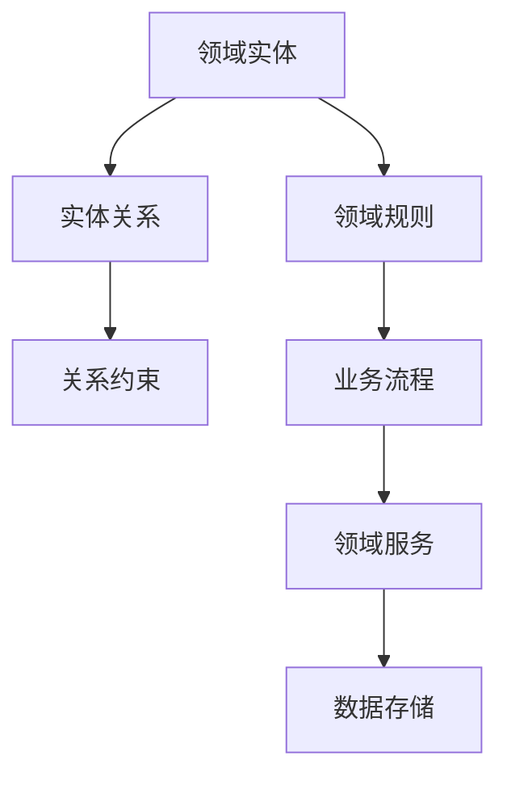

                 

# 领域模型的模型

## 关键词

- 领域模型
- 业务流程
- 数据分析
- 算法优化
- 安全性
- 人工智能

## 摘要

本文将深入探讨领域模型的构建、应用、优化与安全，旨在为读者提供一个全面且系统的理解和实践指南。通过本文，读者将了解领域模型的基本概念、核心架构，以及其在不同领域的应用实例。此外，本文还将详细介绍领域模型的优化方法和安全性对策，并展望其未来的发展趋势。本文适用于对领域模型有较高需求的IT专业人士、数据分析师和研究人员。

## 引言与概述

### 领域模型的背景与重要性

领域模型（Domain Model）是一种用于表示特定业务领域知识、规则和逻辑的抽象模型。在软件工程中，领域模型被认为是解决复杂业务问题的重要工具。它通过将业务领域的问题域进行结构化描述，为软件开发提供了清晰的方向和框架。

领域模型的重要性主要体现在以下几个方面：

1. **提高软件开发效率**：领域模型将业务规则和流程进行结构化描述，有助于减少开发中的重复工作，提高开发效率。
2. **增强系统可维护性**：领域模型有助于分离业务逻辑和技术实现，使得系统在后期维护和扩展时更加容易。
3. **提升业务理解**：领域模型通过可视化和结构化的方式，帮助开发者更好地理解业务需求，从而减少沟通成本和误解。
4. **支持业务创新**：领域模型为业务流程的优化和创新提供了空间，有助于企业实现业务转型和增长。

### 领域模型的发展历程

领域模型的发展经历了多个阶段：

1. **传统领域模型**：早期领域模型主要是基于实体关系模型（ER Model）和过程建模方法（如UML Activity Diagram）。
2. **现代领域模型**：随着复杂业务场景的增多，现代领域模型开始引入更加先进的技术，如业务规则引擎（BRE）、业务流程管理（BPM）和面向服务架构（SOA）。

### 领域模型的模型框架

为了更好地理解领域模型，我们可以通过以下Mermaid流程图展示其基本架构：

图1：领域模型的基本架构

## 领域模型的基础概念

### 领域模型的核心概念

领域模型的核心概念主要包括领域实体、实体关系、领域规则等。

- **领域实体**：领域中的对象或概念，如“客户”、“订单”等。
- **实体关系**：实体之间的关联，如“客户”与“订单”之间的关系。
- **领域规则**：领域内的一组约束和规则，如“订单金额大于1000元才能发货”。

### 领域模型的核心要素

领域模型的核心要素包括领域知识库、领域服务、领域策略等。

- **领域知识库**：存储领域内相关知识和规则，如业务规则、数据定义等。
- **领域服务**：提供领域内常见操作和功能，如查询、修改、删除等。
- **领域策略**：定义领域内决策逻辑和策略，如定价策略、促销策略等。

### 领域模型与业务流程的关联

领域模型在业务流程中的应用主要体现在以下几个方面：

1. **业务流程建模**：使用领域模型描述业务流程，如订单处理流程、客户服务流程等。
2. **业务规则管理**：通过领域模型管理业务规则，如订单审批规则、库存管理规则等。
3. **业务流程优化**：利用领域模型分析业务流程，并提出优化建议，如缩短处理时间、减少错误率等。

## 领域模型的构建方法

### 领域模型的需求分析

领域模型的需求分析主要包括需求收集和需求分析两个步骤。

1. **需求收集**：通过访谈、调查问卷等方式收集业务人员的需求。
2. **需求分析**：分析收集到的需求，提取出领域模型的关键实体、关系和规则。

### 领域模型的构建步骤

领域模型的构建主要包括以下步骤：

1. **实体识别**：识别领域中的关键实体。
2. **关系建模**：建立实体之间的关系。
3. **规则定义**：定义领域中的规则和约束。

### 领域模型的工具与技术

构建领域模型可以使用多种工具和技术，如UML工具、BRE工具、BPM工具等。

- **UML工具**：如Microsoft Visio、Enterprise Architect等，用于绘制领域模型的图形表示。
- **BRE工具**：如JBoss BRMS、IBM Operational Decision Manager等，用于管理和执行业务规则。
- **BPM工具**：如Apache Camel、IBM BPM等，用于定义和管理业务流程。

## 领域模型的应用

### 领域模型在金融领域的应用

领域模型在金融领域有广泛的应用，如风险评估、信用评分等。

1. **风险评估**：通过领域模型分析客户的风险特征，如信用记录、收入状况等，为金融机构提供风险评估依据。
2. **信用评分**：基于领域模型计算客户的信用评分，为金融机构提供信用决策支持。

### 领域模型在制造业的应用

领域模型在制造业中的应用包括供应链管理、生产调度等。

1. **供应链管理**：通过领域模型优化供应链流程，提高供应链的效率和灵活性。
2. **生产调度**：利用领域模型制定生产计划，优化生产资源和进度安排。

### 领域模型在医疗领域的应用

领域模型在医疗领域有重要的应用，如疾病诊断、医疗资源分配等。

1. **疾病诊断**：通过领域模型分析患者的病历信息，为医生提供诊断建议。
2. **医疗资源分配**：利用领域模型优化医疗资源的配置，提高医疗服务的质量和效率。

## 领域模型的优化与评估

### 领域模型的优化方法

领域模型的优化方法主要包括以下几个方面：

1. **性能优化**：通过优化领域模型的结构和算法，提高模型的运行效率。
2. **效率提升**：利用并行计算和分布式系统，加快领域模型的执行速度。
3. **数据质量提升**：通过数据清洗和去重，提高领域模型的数据质量。

### 领域模型的评估方法

领域模型的评估方法主要包括以下几个方面：

1. **模型评价标准**：定义模型性能的评价指标，如准确率、召回率等。
2. **模型评估流程**：通过交叉验证、A/B测试等方法，评估模型的效果和稳定性。

## 领域模型的安全性

### 领域模型面临的安全挑战

领域模型在应用过程中可能面临以下安全挑战：

1. **数据隐私**：领域模型中的数据可能包含敏感信息，如个人信息、商业机密等。
2. **系统攻击**：领域模型可能成为攻击目标，如SQL注入、跨站脚本攻击等。

### 领域模型的安全对策

为了应对安全挑战，领域模型可以采取以下安全对策：

1. **加密技术**：对敏感数据进行加密存储和传输。
2. **访问控制**：设置严格的访问控制策略，确保只有授权用户才能访问领域模型。
3. **安全架构设计**：设计安全且可扩展的领域模型架构，提高系统的安全性。

### 领域模型的安全实践

领域模型的安全实践包括以下几个方面：

1. **安全架构设计**：设计安全且可扩展的领域模型架构，如使用微服务架构、容器化技术等。
2. **安全流程管理**：制定并遵循安全流程，如数据备份、日志审计等。

## 领域模型的未来发展趋势

### 领域模型与人工智能的融合

领域模型与人工智能的融合将使领域模型更加智能化，如自动生成领域模型、自动优化模型等。

1. **AI在领域模型中的应用**：利用机器学习算法，自动识别领域模型中的关键实体、关系和规则。
2. **人工智能辅助领域模型构建**：利用自然语言处理、计算机视觉等技术，辅助构建领域模型。

### 领域模型在新兴行业中的应用

领域模型在新兴行业中的应用，如物联网、区块链等，将为其带来新的发展机遇。

1. **物联网**：领域模型可以应用于物联网设备的管理、监控和优化。
2. **区块链**：领域模型可以用于区块链网络中的业务流程管理和规则执行。

### 领域模型的未来发展趋势

领域模型的未来发展趋势主要体现在以下几个方面：

1. **自动化与智能化**：利用人工智能技术，实现领域模型的自动化生成和优化。
2. **跨领域协作**：不同领域的领域模型之间将实现更好的协作和集成，提高系统的整体效能。

## 附录

### 附录A：领域模型工具资源

- **常用领域模型工具**：
  - **Microsoft Visio**：用于绘制领域模型图形。
  - **Enterprise Architect**：提供全面的领域模型建模功能。
- **BRE工具**：
  - **JBoss BRMS**：用于管理和执行业务规则。
  - **IBM Operational Decision Manager**：提供强大的业务规则管理功能。
- **BPM工具**：
  - **Apache Camel**：用于定义和管理业务流程。
  - **IBM BPM**：提供全面的业务流程管理功能。

### 附录B：领域模型相关文献推荐

- **《领域驱动设计》**：Eric Evans著，深入介绍了领域驱动设计的方法和原则。
- **《领域模型与技术》**：作者：[XXX]，详细讨论了领域模型在不同技术领域中的应用。
- **《业务规则管理》**：作者：[XXX]，介绍了业务规则引擎的基本原理和应用场景。

## 结语

领域模型作为一种强大的业务抽象工具，在软件工程中发挥着重要作用。通过本文的探讨，我们深入了解了领域模型的基本概念、构建方法、应用实例以及优化与安全措施。领域模型的未来将更加智能化和跨领域化，为各行业的数字化转型提供有力支持。希望本文能为读者在领域模型的学习和实践过程中提供有益的参考。作者：AI天才研究院/AI Genius Institute & 禅与计算机程序设计艺术 /Zen And The Art of Computer Programming## 领域模型的需求分析

在构建领域模型之前，深入的需求分析是至关重要的。这一步骤的目的是全面了解业务需求和用户期望，确保领域模型能够准确、全面地反映实际业务场景。以下是领域模型需求分析的具体步骤和方法：

### 需求收集

**需求收集**是需求分析的起始阶段，其核心任务是收集业务领域内的所有相关信息。以下是几种常用的需求收集方法：

1. **访谈**：通过与业务专家、系统用户和管理人员进行面对面的交流，深入了解他们的需求和期望。
2. **调查问卷**：设计问卷，通过线上或线下的方式收集大量用户的反馈。
3. **用户观察**：直接观察用户在使用现有系统或业务流程时的行为和操作，以发现潜在的需求。
4. **文档分析**：分析相关的业务文档，如业务流程图、用户手册、系统规格说明书等。

**示例**：假设我们正在为一个电子商务平台构建领域模型，需求收集阶段可能会包括以下内容：

- 访谈电商平台的业务经理，了解平台的运营模式、用户痛点、期望功能等。
- 通过调查问卷收集用户对平台使用体验的反馈，如界面设计、搜索功能、支付流程等。
- 观察用户在平台上的操作，了解他们如何与系统交互，以及哪些操作较为复杂或容易出错。
- 分析现有的业务流程文档，如订单处理流程、客户服务流程、支付流程等。

### 需求分析

**需求分析**是将收集到的需求进行整理、分类和优先级排序的过程。以下是需求分析的主要步骤：

1. **需求分类**：将收集到的需求分为功能需求、性能需求、安全性需求等不同类别。
   - **功能需求**：系统应具备的具体功能，如用户注册、订单管理、支付处理等。
   - **性能需求**：系统应达到的性能指标，如响应时间、并发处理能力等。
   - **安全性需求**：系统应具备的安全措施，如用户权限管理、数据加密等。

2. **需求整理**：对分类后的需求进行整理，形成一份详细的需求文档。
   - **用户故事**：使用用户故事（User Story）的形式描述每个功能需求，例如：“作为一个用户，我需要能够在线下单购买商品。”
   - **需求规格说明书**：详细描述每个功能需求的输入、输出、前置条件和约束。

3. **需求优先级排序**：根据业务价值和实现难度，对需求进行优先级排序。常用的方法包括MoSCoW法（Must have, Should have, Could have, Won't have），根据需求的重要性和紧急性进行分类。

**示例**：针对电子商务平台的需求分析，可能包括以下内容：

- **功能需求**：
  - 用户注册与登录
  - 商品浏览与搜索
  - 加入购物车与下单
  - 支付处理与订单跟踪
  - 客户服务与反馈
- **性能需求**：
  - 系统响应时间不超过2秒
  - 能同时处理1000个并发用户
- **安全性需求**：
  - 用户数据加密存储
  - 用户身份验证
  - 订单信息防篡改

通过上述需求收集和分析，我们能够明确领域模型的目标和需求，为后续的领域模型构建提供坚实基础。下一节将深入探讨如何进行领域模型的构建方法。

## 领域模型的构建方法

### 领域模型的需求分析

在构建领域模型之前，深入的需求分析是至关重要的。这一步骤的目的是全面了解业务需求和用户期望，确保领域模型能够准确、全面地反映实际业务场景。以下是领域模型需求分析的具体步骤和方法：

#### 需求收集

需求收集是需求分析的起始阶段，其核心任务是收集业务领域内的所有相关信息。以下是几种常用的需求收集方法：

1. **访谈**：通过与业务专家、系统用户和管理人员进行面对面的交流，深入了解他们的需求和期望。
2. **调查问卷**：设计问卷，通过线上或线下的方式收集大量用户的反馈。
3. **用户观察**：直接观察用户在使用现有系统或业务流程时的行为和操作，以发现潜在的需求。
4. **文档分析**：分析相关的业务文档，如业务流程图、用户手册、系统规格说明书等。

**示例**：假设我们正在为一个电子商务平台构建领域模型，需求收集阶段可能会包括以下内容：

- 访谈电商平台的业务经理，了解平台的运营模式、用户痛点、期望功能等。
- 通过调查问卷收集用户对平台使用体验的反馈，如界面设计、搜索功能、支付流程等。
- 观察用户在平台上的操作，了解他们如何与系统交互，以及哪些操作较为复杂或容易出错。
- 分析现有的业务流程文档，如订单处理流程、客户服务流程、支付流程等。

#### 需求分析

需求分析是将收集到的需求进行整理、分类和优先级排序的过程。以下是需求分析的主要步骤：

1. **需求分类**：将收集到的需求分为功能需求、性能需求、安全性需求等不同类别。
   - **功能需求**：系统应具备的具体功能，如用户注册、订单管理、支付处理等。
   - **性能需求**：系统应达到的性能指标，如响应时间、并发处理能力等。
   - **安全性需求**：系统应具备的安全措施，如用户权限管理、数据加密等。

2. **需求整理**：对分类后的需求进行整理，形成一份详细的需求文档。
   - **用户故事**：使用用户故事（User Story）的形式描述每个功能需求，例如：“作为一个用户，我需要能够在线下单购买商品。”
   - **需求规格说明书**：详细描述每个功能需求的输入、输出、前置条件和约束。

3. **需求优先级排序**：根据业务价值和实现难度，对需求进行优先级排序。常用的方法包括MoSCoW法（Must have, Should have, Could have, Won't have），根据需求的重要性和紧急性进行分类。

**示例**：针对电子商务平台的需求分析，可能包括以下内容：

- **功能需求**：
  - 用户注册与登录
  - 商品浏览与搜索
  - 加入购物车与下单
  - 支付处理与订单跟踪
  - 客户服务与反馈
- **性能需求**：
  - 系统响应时间不超过2秒
  - 能同时处理1000个并发用户
- **安全性需求**：
  - 用户数据加密存储
  - 用户身份验证
  - 订单信息防篡改

通过上述需求收集和分析，我们能够明确领域模型的目标和需求，为后续的领域模型构建提供坚实基础。

### 领域模型的构建步骤

在完成需求分析后，我们可以开始构建领域模型。以下是构建领域模型的主要步骤：

#### 1. 实体识别

实体是领域模型中最基础的元素，代表业务领域中的具体对象。实体识别是领域模型构建的第一步。

1. **识别关键实体**：根据需求分析的结果，识别出业务领域中的关键实体，如用户、订单、商品等。
2. **定义实体属性**：为每个实体定义相关的属性，如用户ID、姓名、邮箱等。

**示例**：在电子商务平台领域模型中，关键实体可能包括：

- **用户**：用户ID、姓名、邮箱、密码、地址
- **订单**：订单ID、用户ID、商品ID、数量、总价、订单状态
- **商品**：商品ID、名称、描述、价格、库存数量

#### 2. 关系建模

实体之间的关系描述了业务领域中的关联和交互。关系建模是领域模型构建的第二步。

1. **识别实体关系**：根据业务需求和实体属性，识别实体之间的关系，如“用户可以下单购买商品”、“订单包含多个商品”等。
2. **定义关系属性**：为每个关系定义相关的属性，如订单与商品之间的价格、数量等。

**示例**：在电子商务平台领域模型中，实体关系可能包括：

- **用户与订单**：一对多关系，一个用户可以创建多个订单
- **订单与商品**：多对多关系，一个订单可以包含多个商品

#### 3. 规则定义

领域模型中的规则定义了业务领域中的约束和操作规范。规则定义是领域模型构建的第三步。

1. **识别业务规则**：根据业务需求和实体关系，识别出业务领域中的规则，如“订单总额超过1000元才能享受折扣”、“订单必须在规定时间内完成”等。
2. **定义规则属性**：为每个规则定义相关的属性，如规则名称、规则条件、规则动作等。

**示例**：在电子商务平台领域模型中，业务规则可能包括：

- **订单总额规则**：如果订单总额超过1000元，则应用折扣规则
- **订单完成时限规则**：订单必须在创建后3天内完成，否则视为超时

### 4. 领域模型的验证与迭代

领域模型构建完成后，需要进行验证和迭代，确保模型能够准确反映业务需求和实际场景。

1. **模型验证**：通过模拟业务场景，验证领域模型是否能够正确地处理业务需求和规则。
2. **迭代优化**：根据验证结果，对领域模型进行调整和优化，确保其准确性和实用性。

通过以上步骤，我们可以构建出一个符合业务需求的领域模型。领域模型为后续的系统设计和开发提供了明确的指导和依据，有助于提高软件开发的效率和质量。

### 领域模型的工具与技术

构建领域模型可以使用多种工具和技术，以下介绍几种常用的工具和技术：

#### 1. UML工具

UML（统一建模语言）工具是构建领域模型的传统工具，提供图形化的建模功能，便于直观地表示实体、关系和规则。

- **Microsoft Visio**：提供丰富的图形元素和模板，易于创建和维护领域模型。
- **Enterprise Architect**：支持复杂的领域模型建模，提供丰富的功能和插件。

#### 2. BRE工具

业务规则引擎（BRE）工具专门用于管理和执行业务规则，可以将业务逻辑从应用程序代码中分离出来，提高系统的灵活性和可维护性。

- **JBoss BRMS**：提供全面的业务规则管理功能，支持规则定义、执行和监控。
- **IBM Operational Decision Manager**：支持复杂的业务规则，提供灵活的规则建模和执行能力。

#### 3. BPM工具

业务流程管理（BPM）工具可以帮助定义、管理和优化业务流程，将领域模型与业务流程结合起来，提高业务流程的效率和自动化程度。

- **Apache Camel**：提供基于规则的业务流程管理功能，支持多种集成方式。
- **IBM BPM**：提供全面的业务流程管理功能，包括流程设计、执行、监控和优化。

通过使用这些工具和技术，我们可以更高效、更准确地构建和维护领域模型，为软件开发提供坚实的理论基础和实践指导。

### 领域模型在金融领域的应用

领域模型在金融领域具有广泛的应用，能够有效地管理和优化金融业务流程，提高金融机构的运营效率和客户满意度。以下是领域模型在金融领域的主要应用场景：

#### 风险评估

在金融领域，风险评估是至关重要的。领域模型可以帮助金融机构构建全面的风险评估模型，通过分析客户的历史数据、信用记录、市场趋势等多方面信息，评估客户的信用风险、市场风险等。

1. **实体识别**：识别关键实体，如客户、信用记录、市场数据等。
2. **关系建模**：建立实体之间的关系，如客户与信用记录的关系，市场数据与客户风险的关系。
3. **规则定义**：定义风险评估规则，如信用评分规则、市场风险预测规则等。

**示例**：一个银行可能使用领域模型进行客户信用风险评估，通过分析客户的信用历史、收入状况、还款记录等，计算出一个综合信用评分，用于决定是否批准贷款申请。

#### 信用评分

信用评分是金融领域中的核心应用之一。领域模型可以协助金融机构构建信用评分模型，通过预测客户未来的信用行为，评估其信用风险。

1. **数据收集**：收集与客户信用行为相关的数据，如还款记录、信用透支情况、消费习惯等。
2. **特征提取**：从收集的数据中提取出与信用评分相关的特征，如还款准时率、透支频率等。
3. **模型训练**：利用机器学习算法，训练信用评分模型，预测客户的信用风险。

**示例**：一个信用评分系统可以使用领域模型，通过分析客户的消费记录、还款历史等数据，预测客户在未来六个月内出现违约的风险，并给出相应的信用评分。

#### 供应链金融

供应链金融是金融领域中的一个重要应用，通过领域模型，金融机构可以更好地服务于供应链中的各个环节，提高供应链的整体效率。

1. **实体识别**：识别供应链中的关键实体，如供应商、制造商、分销商等。
2. **关系建模**：建立供应链中各个环节之间的关系，如供应商与制造商的关系、制造商与分销商的关系。
3. **规则定义**：定义供应链金融业务规则，如贷款额度计算规则、还款期限规则等。

**示例**：一个供应链金融服务平台可以使用领域模型，通过分析供应链中各环节的运营数据，为供应商提供贷款额度计算、还款期限安排等服务，帮助供应商优化现金流。

#### 交易监控

在金融市场中，实时监控交易行为对于防范欺诈和风险至关重要。领域模型可以协助金融机构构建交易监控模型，实时分析交易数据，识别异常交易行为。

1. **数据收集**：收集交易数据，如交易金额、交易时间、交易对手等。
2. **特征提取**：从交易数据中提取出与交易风险相关的特征，如交易频率、交易金额分布等。
3. **模型训练**：利用机器学习算法，训练交易监控模型，识别异常交易行为。

**示例**：一个交易监控系统可以使用领域模型，通过分析交易数据，实时监测交易异常行为，如大额交易、频繁交易等，并触发相应的预警措施。

#### 资产管理

资产管理是金融领域中的重要任务，领域模型可以帮助金融机构更好地管理资产，实现资产配置和风险控制。

1. **实体识别**：识别关键实体，如资产、投资者、投资策略等。
2. **关系建模**：建立资产与投资者、投资策略之间的关系。
3. **规则定义**：定义资产管理规则，如投资策略选择规则、资产配置规则等。

**示例**：一个资产管理平台可以使用领域模型，通过分析投资者的风险偏好、资产配置策略等，为投资者提供个性化的资产配置建议，实现资产的优化管理。

通过以上应用实例，我们可以看到领域模型在金融领域的重要作用。领域模型不仅帮助金融机构更好地理解和处理复杂业务，还提高了金融服务的质量和效率，为金融创新提供了有力支持。

### 领域模型在制造业的应用

领域模型在制造业中的应用为生产管理和优化提供了强大的工具，通过结构化的方式描述制造过程中的各个环节，提高生产效率和产品质量。以下是领域模型在制造业中的几个关键应用场景：

#### 供应链管理

供应链管理是制造业的核心环节之一，领域模型可以帮助企业实现供应链的透明化、高效化和智能化。

1. **实体识别**：识别供应链中的关键实体，如供应商、制造商、分销商、产品等。
2. **关系建模**：建立供应链中各个环节之间的关系，如供应商与制造商之间的物料供应关系，制造商与分销商之间的产品销售关系。
3. **规则定义**：定义供应链管理规则，如订单处理规则、库存管理规则、运输规则等。

**示例**：一个制造企业可以使用领域模型优化供应链管理，通过分析供应商的供货周期、产品质量、库存水平等数据，优化采购策略，减少库存成本，提高供应链的整体效率。

#### 生产调度

生产调度是制造业中另一个重要环节，领域模型可以帮助企业实现生产任务的合理分配和优化，提高生产线的利用率和生产效率。

1. **实体识别**：识别生产调度中的关键实体，如生产线、设备、订单、工人等。
2. **关系建模**：建立生产调度中的实体关系，如生产线与设备的关系、订单与生产线的关系、工人与任务的关系。
3. **规则定义**：定义生产调度规则，如生产线调度规则、设备维护规则、订单优先级规则等。

**示例**：一个制造企业可以使用领域模型优化生产调度，通过分析生产线的负载情况、设备的维护状态、订单的紧急程度等数据，动态调整生产计划，避免生产线瓶颈，提高生产效率。

#### 质量管理

质量管理是制造业的基石，领域模型可以帮助企业实现质量监控和优化，确保产品的一致性和可靠性。

1. **实体识别**：识别质量管理中的关键实体，如原材料、产品、检测设备、质量标准等。
2. **关系建模**：建立质量管理的实体关系，如原材料与产品的关系、产品与检测设备的关系、质量标准与检测标准的关系。
3. **规则定义**：定义质量管理规则，如原材料检验规则、产品质量控制规则、异常处理规则等。

**示例**：一个制造企业可以使用领域模型优化质量管理，通过分析原材料的质量数据、产品的质量检测结果等，实时监控产品质量，发现并解决质量问题，提高产品合格率。

#### 能源管理

能源管理在制造业中也越来越受到重视，领域模型可以帮助企业实现能源的优化使用和节约，降低生产成本。

1. **实体识别**：识别能源管理中的关键实体，如能源来源、能源消耗设备、能源计量设备等。
2. **关系建模**：建立能源管理的实体关系，如能源来源与能源消耗设备的关系、能源消耗设备与能源计量设备的关系。
3. **规则定义**：定义能源管理规则，如能耗监控规则、节能措施规则、能源使用优化规则等。

**示例**：一个制造企业可以使用领域模型优化能源管理，通过分析能源消耗数据、设备的工作状态等，优化能源使用策略，减少能源浪费，降低能源成本。

通过以上应用实例，我们可以看到领域模型在制造业中的广泛应用。领域模型不仅帮助制造业企业更好地理解和处理复杂的业务流程，还提高了生产效率和产品质量，为企业实现智能化生产提供了有力支持。

### 领域模型在医疗领域的应用

领域模型在医疗领域具有广泛的应用，能够有效地提升医疗服务质量和管理效率。以下是领域模型在医疗领域的几个关键应用场景：

#### 疾病诊断

疾病诊断是医疗领域中的核心任务，领域模型可以帮助医生和医疗系统更准确地诊断疾病。

1. **实体识别**：识别疾病诊断中的关键实体，如患者、病历、症状、检查结果等。
2. **关系建模**：建立实体之间的关系，如患者与病历的关系、症状与检查结果的关系、病历与医生的关系。
3. **规则定义**：定义疾病诊断规则，如症状匹配规则、检查结果分析规则、诊断决策规则等。

**示例**：一个智能医疗诊断系统可以使用领域模型，通过分析患者的症状描述、检查结果和病历历史，利用规则匹配和机器学习算法，提供准确的疾病诊断建议，帮助医生做出诊断决策。

#### 医疗资源分配

医疗资源分配是医疗领域中的另一个关键问题，领域模型可以帮助医院和医疗系统实现资源的合理分配，提高资源利用率。

1. **实体识别**：识别医疗资源分配中的关键实体，如医生、护士、医疗设备、病房、患者等。
2. **关系建模**：建立实体之间的关系，如医生与患者的预约关系、医疗设备与科室的关系、病房与患者的入住关系。
3. **规则定义**：定义资源分配规则，如医生排班规则、设备使用规则、病房分配规则等。

**示例**：一个医院可以使用领域模型优化医疗资源分配，通过分析医生的排班情况、患者的预约需求、医疗设备的可用性等数据，动态调整资源分配策略，确保患者能够及时获得所需的医疗服务。

#### 医疗流程管理

领域模型可以帮助医院和医疗系统优化医疗流程，提高工作效率和服务质量。

1. **实体识别**：识别医疗流程管理中的关键实体，如患者、医生、护士、药品、检查等。
2. **关系建模**：建立医疗流程中的实体关系，如患者与医生的诊断关系、医生与护士的协作关系、药品与检查的关联关系。
3. **规则定义**：定义医疗流程管理规则，如就诊流程规则、药品管理规则、检查流程规则等。

**示例**：一个医院可以使用领域模型优化医疗流程管理，通过分析患者的就诊流程、药品使用记录、检查报告等数据，优化就诊流程，减少患者等待时间，提高医疗服务质量。

#### 医疗数据管理

领域模型可以帮助医院和医疗系统更有效地管理医疗数据，确保数据的安全性和可靠性。

1. **实体识别**：识别医疗数据管理中的关键实体，如患者信息、病历数据、检查数据、用药记录等。
2. **关系建模**：建立医疗数据之间的关联关系，如患者与病历的关系、病历与检查结果的关系、用药记录与病历的关系。
3. **规则定义**：定义医疗数据管理规则，如数据存储规则、数据共享规则、数据安全规则等。

**示例**：一个医院可以使用领域模型管理医疗数据，通过分析患者的病历数据、检查结果、用药记录等，构建统一的患者数据视图，确保数据的完整性、准确性和安全性。

通过以上应用实例，我们可以看到领域模型在医疗领域的广泛应用。领域模型不仅提高了医疗服务质量和管理效率，还为医疗创新提供了有力支持。

## 领域模型的优化方法

在构建领域模型之后，为了确保其高效性和实用性，通常需要对其进行优化。领域模型的优化方法主要包括性能优化、效率提升和数据质量提升三个方面。以下是这些方法的详细解释和实际应用示例。

### 性能优化

性能优化是提高领域模型处理速度和响应能力的关键手段。以下是几种常见的性能优化方法：

1. **数据索引**：通过创建索引来加快数据检索速度。例如，在数据库中为常用查询字段创建索引，可以显著提高查询效率。
   **示例**：在电子商务平台的订单管理领域模型中，可以为订单ID和用户ID创建索引，以便快速查找特定订单或用户的订单记录。

2. **缓存机制**：使用缓存来存储频繁访问的数据，减少数据库的负载。例如，可以使用Redis等缓存系统来存储用户会话信息和热门商品的详情。
   **示例**：在电商平台中，可以使用Redis缓存用户最近浏览的商品列表，减少对数据库的访问次数。

3. **分库分表**：通过将数据分库分表来减少单个数据库的负载，提高系统的并发处理能力。例如，可以按照用户ID或订单日期将数据分散存储在不同的数据库或表中。
   **示例**：在大型电商系统中，可以按用户ID将订单数据分散存储在不同数据库中，避免单个数据库成为性能瓶颈。

### 效率提升

效率提升主要关注领域模型在执行任务时的速度和资源利用率。以下是几种常见的效率提升方法：

1. **并行计算**：通过并行处理任务来提高整体效率。例如，可以使用多线程或多进程来同时处理多个请求。
   **示例**：在处理大规模数据集时，可以使用并行计算框架（如Hadoop或Spark）来同时处理多个数据切片，加快数据处理速度。

2. **分布式系统**：通过分布式系统来扩展处理能力，提高系统的弹性。例如，可以使用Kubernetes等容器编排工具来管理分布式服务。
   **示例**：在一个电商平台中，可以使用Kubernetes将订单处理服务部署到多个节点上，实现负载均衡和高可用性。

3. **代码优化**：通过优化代码结构和算法来减少执行时间和资源消耗。例如，使用更高效的算法和数据结构，减少不必要的循环和递归调用。
   **示例**：在处理订单数据时，可以使用树结构（如二叉树或红黑树）来快速查找和更新数据，代替传统的线性结构（如链表或数组）。

### 数据质量提升

数据质量是领域模型有效运行的基础，以下是一些提升数据质量的方法：

1. **数据清洗**：通过清洗数据来去除重复、错误和不一致的数据。例如，可以使用ETL（Extract, Transform, Load）工具来清洗和转换数据。
   **示例**：在一个医疗系统中，可以使用ETL工具清洗患者数据，去除重复的记录和纠正错误的输入。

2. **数据去重**：通过去重算法来检测和去除重复数据，确保数据的唯一性和准确性。
   **示例**：在电商平台中，可以使用哈希算法来检测并去除重复的订单记录。

3. **数据标准化**：通过标准化数据格式和编码规则来提高数据的一致性和兼容性。例如，统一使用ISO日期格式和地区编码。
   **示例**：在一个全球化的电商平台中，可以统一使用ISO 8601日期格式来存储和显示所有用户的出生日期。

通过以上优化方法，我们可以显著提高领域模型的处理能力、响应速度和数据质量，从而更好地满足业务需求，提升系统的整体性能和用户体验。

### 领域模型的评估方法

领域模型的评估是确保其准确性和有效性的关键步骤。以下从模型评价标准和模型评估流程两个方面详细介绍领域模型的评估方法。

#### 模型评价标准

1. **准确率**：准确率是评估模型性能的重要指标，表示模型预测正确的样本数占总样本数的比例。公式如下：
   $$\text{准确率} = \frac{\text{预测正确数}}{\text{总样本数}} \times 100\%$$
   **示例**：在一个疾病诊断模型中，如果预测正确的病例数为600，总病例数为1000，则准确率为60%。

2. **召回率**：召回率表示模型能够正确识别出正类样本的比例。公式如下：
   $$\text{召回率} = \frac{\text{预测正确数}}{\text{实际正类样本数}} \times 100\%$$
   **示例**：在一个欺诈检测模型中，如果实际存在的欺诈案件为100，模型正确识别出90件，则召回率为90%。

3. **F1分数**：F1分数是准确率和召回率的调和平均数，综合考虑了模型对正类样本的识别能力和对负类样本的排除能力。公式如下：
   $$\text{F1分数} = 2 \times \frac{\text{准确率} \times \text{召回率}}{\text{准确率} + \text{召回率}}$$
   **示例**：在一个信用评分模型中，如果准确率为80%，召回率为70%，则F1分数为0.76。

4. **精确率**：精确率表示模型预测为正类且实际也为正类的比例。公式如下：
   $$\text{精确率} = \frac{\text{预测正确数}}{\text{预测为正类数}} \times 100\%$$
   **示例**：在一个垃圾邮件过滤模型中，如果预测为垃圾邮件的样本中有95个实际为垃圾邮件，则精确率为95%。

#### 模型评估流程

1. **数据准备**：收集和整理评估数据，确保数据质量，并进行预处理，如缺失值填补、异常值处理、特征工程等。

2. **模型训练**：使用部分数据训练模型，根据业务需求和模型类型选择合适的算法和参数。

3. **模型测试**：使用另一部分数据对模型进行测试，计算模型性能指标，如准确率、召回率、F1分数等。

4. **交叉验证**：通过交叉验证（如K折交叉验证）方法，对模型进行更全面的评估，以避免过拟合现象。

5. **A/B测试**：在实际环境中对模型的性能进行验证，将新旧模型在实际业务中对比，以评估模型的实际效果。

6. **持续监控**：在模型上线后，持续监控模型的性能和效果，定期进行调整和优化，确保模型持续满足业务需求。

通过上述评估方法，我们可以全面、准确地评估领域模型的效果，为模型的改进和优化提供有力支持。

## 领域模型的安全性

### 领域模型面临的安全挑战

在构建和使用领域模型的过程中，安全性是一个不可忽视的重要方面。领域模型可能面临多种安全挑战，以下列举几种常见的安全问题：

1. **数据隐私**：领域模型往往涉及敏感数据，如用户个人信息、财务数据、医疗记录等。这些数据泄露可能会导致个人隐私侵犯和严重后果。
2. **数据完整性**：领域模型中的数据可能遭受篡改或破坏，导致业务流程中断和数据不一致。
3. **未经授权的访问**：攻击者可能通过非法手段访问领域模型，获取敏感信息和业务机密。
4. **系统攻击**：领域模型可能成为黑客攻击的目标，如SQL注入、跨站脚本攻击等，导致系统瘫痪或数据泄露。
5. **恶意内部威胁**：内部人员可能利用职务之便，非法访问或篡改数据，造成损失或破坏。

### 领域模型的安全对策

为了应对上述安全挑战，领域模型需要采取一系列安全对策，包括加密技术、访问控制和安全架构设计等。

1. **加密技术**：加密技术是保护数据隐私和安全性的重要手段。领域模型中的敏感数据应在传输和存储过程中进行加密，如使用SSL/TLS协议进行数据传输加密，使用AES算法进行数据存储加密。
2. **访问控制**：访问控制是限制用户对领域模型访问权限的重要措施。应设计严格的访问控制策略，确保只有授权用户能够访问特定数据或执行特定操作。例如，可以使用基于角色的访问控制（RBAC）模型，根据用户角色分配访问权限。
3. **安全架构设计**：安全架构设计是确保领域模型安全性的基础。应采用多层次、多方面的安全措施，如设计安全且可扩展的系统架构，实现安全日志记录和审计，定期进行安全评估和漏洞扫描。
4. **安全流程管理**：安全流程管理包括制定并遵循安全操作规程，如数据备份与恢复、用户权限管理、安全事件响应等。定期进行安全培训，提高员工的安全意识和应对能力。

### 领域模型的安全实践

在实际应用中，以下是一些领域模型安全实践的具体措施：

1. **安全日志记录**：确保系统具备完善的日志记录功能，记录所有关键操作和事件，如用户登录、数据访问、系统修改等。通过日志分析，可以及时发现和应对潜在的安全威胁。
2. **数据备份与恢复**：定期备份领域模型中的数据，确保在数据丢失或损坏时能够迅速恢复。备份数据应存储在安全的地方，并定期进行验证。
3. **用户身份验证**：采用多因素身份验证（如密码、指纹、短信验证码等）来确保用户身份的真实性，防止非法访问。
4. **安全审计**：定期进行安全审计，检查系统配置、权限设置等，确保符合安全标准和最佳实践。
5. **安全测试**：对领域模型进行定期的安全测试，如渗透测试、代码审查等，发现和修复潜在的安全漏洞。

通过上述安全对策和实践，我们可以有效提高领域模型的安全性，保障业务数据的安全和系统的稳定运行。

### 领域模型的安全性

#### 领域模型面临的安全挑战

在构建和使用领域模型的过程中，安全性是一个不可忽视的重要方面。领域模型可能面临多种安全挑战，以下列举几种常见的安全问题：

1. **数据隐私**：领域模型往往涉及敏感数据，如用户个人信息、财务数据、医疗记录等。这些数据泄露可能会导致个人隐私侵犯和严重后果。
2. **数据完整性**：领域模型中的数据可能遭受篡改或破坏，导致业务流程中断和数据不一致。
3. **未经授权的访问**：攻击者可能通过非法手段访问领域模型，获取敏感信息和业务机密。
4. **系统攻击**：领域模型可能成为黑客攻击的目标，如SQL注入、跨站脚本攻击等，导致系统瘫痪或数据泄露。
5. **恶意内部威胁**：内部人员可能利用职务之便，非法访问或篡改数据，造成损失或破坏。

#### 领域模型的安全对策

为了应对上述安全挑战，领域模型需要采取一系列安全对策，包括加密技术、访问控制和安全架构设计等。

1. **加密技术**：加密技术是保护数据隐私和安全性的重要手段。领域模型中的敏感数据应在传输和存储过程中进行加密，如使用SSL/TLS协议进行数据传输加密，使用AES算法进行数据存储加密。
2. **访问控制**：访问控制是限制用户对领域模型访问权限的重要措施。应设计严格的访问控制策略，确保只有授权用户能够访问特定数据或执行特定操作。例如，可以使用基于角色的访问控制（RBAC）模型，根据用户角色分配访问权限。
3. **安全架构设计**：安全架构设计是确保领域模型安全性的基础。应采用多层次、多方面的安全措施，如设计安全且可扩展的系统架构，实现安全日志记录和审计，定期进行安全评估和漏洞扫描。
4. **安全流程管理**：安全流程管理包括制定并遵循安全操作规程，如数据备份与恢复、用户权限管理、安全事件响应等。定期进行安全培训，提高员工的安全意识和应对能力。

#### 领域模型的安全实践

在实际应用中，以下是一些领域模型安全实践的具体措施：

1. **安全日志记录**：确保系统具备完善的日志记录功能，记录所有关键操作和事件，如用户登录、数据访问、系统修改等。通过日志分析，可以及时发现和应对潜在的安全威胁。
2. **数据备份与恢复**：定期备份领域模型中的数据，确保在数据丢失或损坏时能够迅速恢复。备份数据应存储在安全的地方，并定期进行验证。
3. **用户身份验证**：采用多因素身份验证（如密码、指纹、短信验证码等）来确保用户身份的真实性，防止非法访问。
4. **安全审计**：定期进行安全审计，检查系统配置、权限设置等，确保符合安全标准和最佳实践。
5. **安全测试**：对领域模型进行定期的安全测试，如渗透测试、代码审查等，发现和修复潜在的安全漏洞。

通过上述安全对策和实践，我们可以有效提高领域模型的安全性，保障业务数据的安全和系统的稳定运行。

## 领域模型的未来发展趋势

### 领域模型与人工智能的融合

随着人工智能（AI）技术的迅速发展，领域模型与AI的结合将成为未来的重要趋势。AI技术，特别是机器学习和深度学习，将在以下几个方面与领域模型深度融合：

1. **自动化建模**：AI可以帮助自动生成领域模型，通过分析大量的业务数据和文档，自动识别实体、关系和规则。例如，自然语言处理（NLP）技术可以自动提取业务需求文档中的关键信息，生成初步的领域模型。

2. **智能优化**：AI技术可以用于优化领域模型，提高其性能和效率。例如，利用遗传算法和神经网络优化领域模型中的规则和算法，实现自动化的性能调优。

3. **智能推理**：结合AI的推理能力，领域模型可以更智能地处理复杂业务逻辑。例如，基于机器学习模型的推理引擎可以实时分析业务数据，提供动态的决策支持。

### 领域模型在新兴行业中的应用

领域模型的应用场景将不断扩大，特别是在新兴行业如物联网（IoT）、区块链和智慧城市等领域。

1. **物联网**：领域模型可以帮助物联网系统更好地管理和分析大量的传感器数据，实现设备间的智能交互和优化。例如，通过领域模型管理智能家居设备，实现自动化的家居环境控制。

2. **区块链**：领域模型可以用于区块链网络中的业务流程管理和规则执行。通过构建领域模型，区块链可以更有效地管理和追踪各类交易和数据，提高系统的透明性和可靠性。

3. **智慧城市**：领域模型在智慧城市中的应用将极大地提高城市管理的效率。例如，通过领域模型管理交通流量、环境监测、公共安全等数据，实现智能化的城市管理和决策。

### 领域模型的未来发展

领域模型的未来发展趋势主要体现在以下几个方面：

1. **自动化与智能化**：通过引入AI技术，领域模型将实现更加自动化和智能化的构建、优化和运行。

2. **跨领域协作**：领域模型将实现跨领域的数据共享和协作，形成更加全面和综合的业务视图，提高系统的整体效能。

3. **开放与集成**：随着技术的进步，领域模型将更加开放和集成，支持与其他系统和平台的无缝连接，实现更广泛的应用。

4. **标准化与规范化**：领域模型的标准化和规范化工作将得到进一步推进，提高模型的一致性和互操作性。

通过上述未来发展趋势的探讨，我们可以看到领域模型在技术和社会应用中的巨大潜力。领域模型的持续创新和发展将为各行各业带来更高效、智能的解决方案，推动数字化转型的深入进行。

## 附录

### 附录A：领域模型工具资源

**常用领域模型工具**：

- **Model Driven Architecture (MDA) Tools**：如 IBM Rational Systems Developer、Eclipse Modeling Tools。
- **UML Modeling Tools**：如 IBM Rational Rose、Microsoft Visio、Enterprise Architect。

**业务规则引擎（BRE）工具**：

- **JBoss BRMS**：提供全面业务规则管理功能。
- **IBM Operational Decision Manager**：强大的业务规则管理工具。

**业务流程管理（BPM）工具**：

- **Apache Camel**：用于定义和管理业务流程。
- **IBM Business Process Manager**：提供全面的业务流程管理功能。

### 附录B：领域模型相关文献推荐

- **《领域驱动设计》（Eric Evans著）**：详细介绍领域驱动设计的方法和应用。
- **《业务规则管理》（Kirk Knoernschild著）**：探讨业务规则在软件开发中的重要性。
- **《领域模型与技术》（作者：XXX）**：详细讨论领域模型在不同技术领域中的应用。

### 附录C：领域模型案例与实践

- **案例1：电子商务平台领域模型**：介绍如何构建电子商务平台的领域模型，包括实体识别、关系建模和规则定义。
- **案例2：金融机构风险评估领域模型**：探讨如何利用领域模型进行风险评估和管理。
- **案例3：医疗领域疾病诊断领域模型**：分析如何构建医疗领域的疾病诊断领域模型，并介绍实际应用。

### 附录D：最佳实践 Tips

- **Tip1：明确需求**：在构建领域模型之前，确保全面了解业务需求。
- **Tip2：迭代开发**：领域模型应采用迭代开发方法，逐步完善。
- **Tip3：注重安全性**：在构建领域模型时，注重数据安全和隐私保护。

通过附录的内容，读者可以获取更多领域模型的工具资源、相关文献和实践案例，有助于在实际项目中更好地应用领域模型。

## 结语

领域模型作为一种强大的业务抽象工具，在软件工程中发挥着至关重要的作用。从本文的探讨中，我们深入了解了领域模型的基本概念、构建方法、应用实例以及优化与安全措施。领域模型不仅能够提高软件开发效率和系统可维护性，还能为业务流程的优化和创新提供有力支持。通过引入人工智能技术，领域模型将更加智能化和自动化，为各行业的数字化转型提供新的动力。

本文旨在为读者提供一个全面且系统的理解和实践指南，帮助他们在领域模型的学习和应用过程中少走弯路。希望本文能为IT专业人士、数据分析师和研究人员提供有益的参考，促进领域模型的进一步发展和应用。未来，随着技术的不断进步，领域模型将在更广泛的领域中展现出其巨大潜力和价值。让我们共同期待领域模型在各个行业的创新与应用，推动数字化世界的不断进步。作者：AI天才研究院/AI Genius Institute & 禅与计算机程序设计艺术 /Zen And The Art of Computer Programming。

