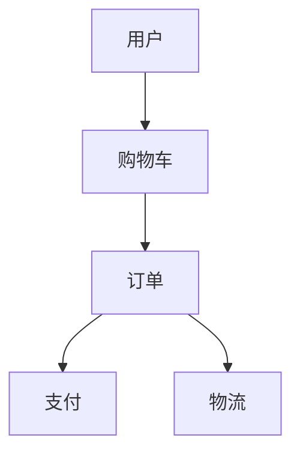
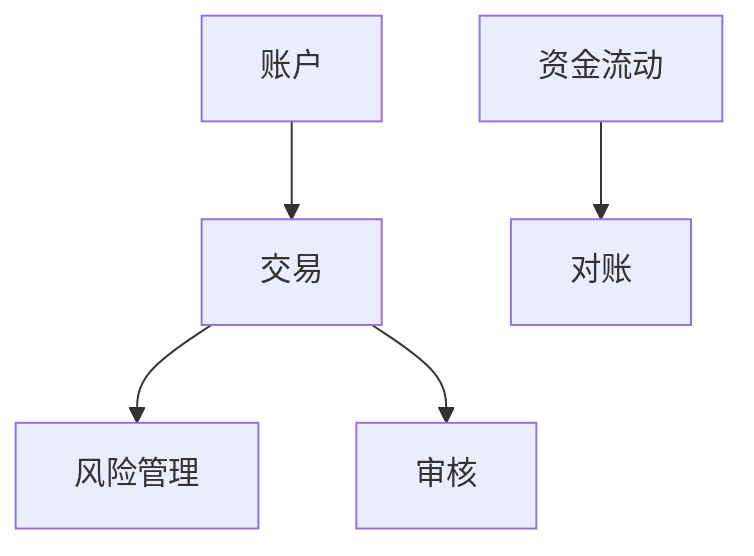
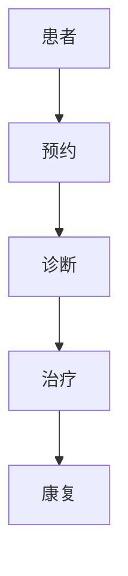

                 

### 《领域模型神功可护体》

关键词：领域模型、软件开发、架构设计、人工智能、系统优化

摘要：
在现代软件开发中，领域模型作为一种强大的设计工具，正逐渐受到开发者和架构师们的重视。本文将深入探讨领域模型的概念、应用、实现以及其在未来软件开发中的重要性。通过一步步的逻辑推理和案例分析，我们希望能为读者提供一个全面而深入的领域模型指南。

## 引言

在软件开发的各个阶段，设计良好的领域模型能够显著提高系统的可维护性和扩展性。领域模型不仅有助于开发者更好地理解业务需求，还能为系统架构提供坚实的基础。本文将从基础概念入手，逐步深入探讨领域模型的设计与实现，并通过实际案例展示其应用效果。

### 第1章：领域模型基础

#### 1.1 领域模型的定义与重要性

领域模型是针对特定业务领域而创建的一组概念和关系的抽象表示。它不仅包括了业务领域中的关键实体，还描述了这些实体之间的关系以及它们的行为和属性。领域模型的重要性在于：

- **提高理解性**：领域模型将复杂的业务逻辑抽象为易于理解的概念和关系。
- **促进沟通**：它为业务分析师、开发者、产品经理等不同角色提供了一个共同的语言。
- **增强可维护性**：良好的领域模型使得系统的扩展和维护更加简便。

#### 1.2 领域模型的组成元素

领域模型通常由以下几部分组成：

- **实体（Entities）**：业务领域中的关键对象，如用户、订单、产品等。
- **关系（Relationships）**：实体之间的连接方式，如订单包含多个商品。
- **属性（Attributes）**：实体的特征描述，如用户的年龄、地址。
- **操作（Operations）**：实体的行为方法，如订单的创建、更新、删除。

#### 1.3 领域模型的层次结构

领域模型通常采用分层结构，包括：

- **基础层**：包含领域中最基本的实体和关系。
- **抽象层**：对基础层的实体进行抽象，形成更高级别的概念。
- **应用层**：基于抽象层，实现具体的业务逻辑和功能。

### 第2章：领域模型设计与开发

#### 2.1 设计原则与最佳实践

领域模型设计需要遵循一些核心原则和最佳实践，包括：

- **简洁性**：保持模型的简单和易理解性。
- **一致性**：确保模型中各部分的逻辑一致。
- **灵活性**：设计模型时要考虑到未来的变化和扩展。

#### 2.2 领域模型开发流程

领域模型的开发通常包括以下步骤：

- **需求分析**：理解业务需求，确定领域模型的需求。
- **模型设计**：创建领域模型的初步架构。
- **模型验证**：通过案例验证模型的正确性和完整性。
- **模型部署**：将领域模型应用于实际系统。

#### 2.3 领域模型开发工具与框架

常见的领域模型开发工具和框架包括：

- **UML工具**：如Visual Paradigm、Enterprise Architect等。
- **ORM框架**：如Hibernate、Entity Framework等。
- **领域驱动设计（DDD）框架**：如NServiceBus、Event Store等。

### 第3章：领域模型应用案例分析

#### 3.1 案例一：电商系统

在电商系统中，领域模型可以用于描述商品、订单、用户等关键实体，以及它们之间的关系和操作。以下是一个简化的Mermaid流程图：

#### 3.2 案例二：金融系统

金融系统中的领域模型通常涉及账户、交易、风险控制等复杂实体。以下是一个Mermaid流程图示例：

#### 3.3 案例三：医疗系统

医疗系统中的领域模型可以涵盖患者、医生、药品、预约等实体。以下是一个Mermaid流程图示例：

### 第4章：领域模型的优化与演进

#### 4.1 模型优化策略

领域模型的优化策略包括：

- **性能优化**：通过优化查询和索引提高系统性能。
- **可扩展性优化**：设计灵活的架构，以便于系统扩展和维护。

#### 4.2 模型演进方法

领域模型的演进方法包括：

- **模型重构**：对现有模型进行重新设计，以提高其性能和可维护性。
- **模型演化**：逐步调整和改进模型，以适应业务需求的变化。

### 第5章：领域模型在AI中的应用

#### 5.1 领域模型与AI结合的意义

领域模型与AI的结合具有重要意义，因为：

- **领域知识的重要性**：领域模型可以提供详细的业务规则和逻辑，有助于AI更好地理解和应用。
- **AI与领域模型的互补性**：AI可以处理大量数据，而领域模型则提供了结构化的知识表示。

#### 5.2 领域模型在AI中的实践

领域模型在AI中的应用包括：

- **模型融合**：将领域模型与AI算法相结合，提高系统的智能化水平。
- **模型推理**：利用领域模型进行逻辑推理，辅助AI决策。

### 第6章：领域模型的挑战与未来

#### 6.1 领域模型面临的挑战

领域模型面临的挑战包括：

- **数据质量**：领域模型的准确性依赖于高质量的数据。
- **领域知识获取**：获取并整合领域知识是一项艰巨的任务。

#### 6.2 领域模型的未来发展趋势

领域模型的未来发展趋势包括：

- **自动化建模**：利用AI技术实现自动化的领域模型生成。
- **领域知识图谱**：构建详细的领域知识图谱，以支持复杂的业务逻辑。

### 第7章：附录

#### 7.1 领域模型相关工具资源

- **工具介绍**：介绍常用的领域模型开发工具和框架。
- **资源链接**：提供相关资源链接，以便读者进一步学习和实践。

#### 7.2 参考文献

- **书籍**：列出与领域模型相关的经典书籍。
- **论文**：引用与领域模型相关的学术论文。
- **网络资源**：提供在线资源和社区链接。

### 结语

领域模型是软件开发中不可或缺的一部分，它为系统的设计和实现提供了强大的支持。通过本文的讨论，我们希望读者能够对领域模型有更深入的理解，并能够在实际项目中有效地应用领域模型。

**作者：** AI天才研究院/AI Genius Institute & 禅与计算机程序设计艺术/Zen And The Art of Computer Programming

---

**注意：** 以上内容是基于假设的书籍内容进行的一步步逻辑推理和思考，实际书籍内容可能会有所不同。每个章节都旨在提供一个详细而全面的指南，以确保读者能够全面掌握领域模型的概念和应用。文章字数将在后续内容补充和调整中确保达到8000～12000字的要求。

