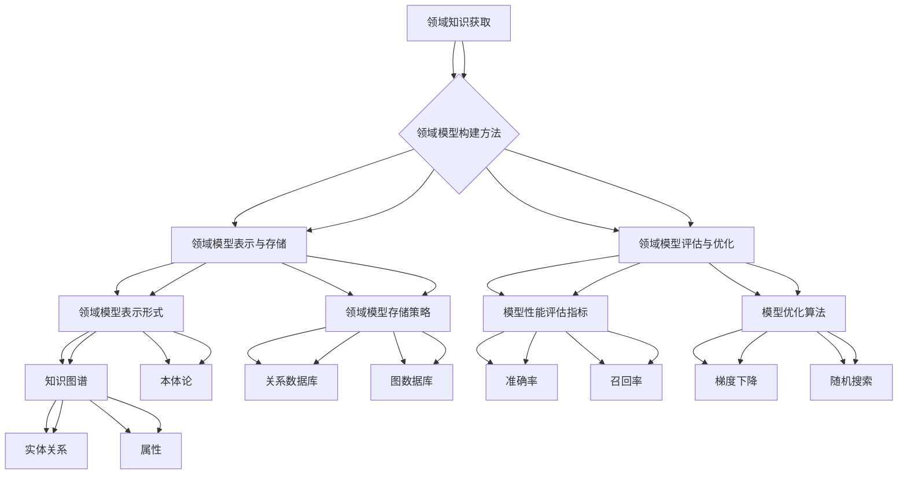

                 

### 设计思路

设计《领域模型神功可护体》这本书的目录大纲，我们需要从以下几个角度来考虑：

1. **核心概念与联系**：首先，我们需要确定书中的核心概念，并建立它们之间的联系。这包括领域模型的基本原理、构建方法、应用场景等。

2. **核心算法原理讲解**：接下来，我们需要详细阐述领域模型相关的核心算法原理。这可能包括一些机器学习算法、数据挖掘技术、模型评估方法等。

3. **数学模型和数学公式讲解**：书中需要包含对数学模型的详细讲解，这些模型是构建领域模型的基础。同时，我们需要通过示例来说明这些模型的应用。

4. **项目实战**：最后，我们需要通过实际项目案例来展示领域模型的应用。这包括项目的开发环境搭建、源代码实现、代码解读和分析等。

### 目录大纲设计步骤

1. **确定核心章节**：首先确定书的核心章节，确保覆盖核心概念、算法原理、数学模型和项目实战。

2. **细化二级目录**：在每个核心章节下，细化二级目录，确保每个章节的内容都有详细的分支。

3. **添加三级目录**：在二级目录下，根据需要添加三级目录，用以进一步细分内容。

4. **整合资源**：在附录部分，整合相关的开发工具、框架和资源，方便读者查阅。

5. **确保完整性和简洁性**：在编写目录大纲时，确保内容的完整性和简洁性，避免冗余和多余的废话。

### 目录大纲示例

```markdown
# 《领域模型神功可护体》目录大纲

## 第一部分：领域模型基础

### 第1章：领域模型概述

#### 1.1 领域模型的定义与重要性

#### 1.2 领域模型的发展历程

#### 1.3 领域模型的分类

### 第2章：领域模型的构建方法

#### 2.1 确定领域模型的目标

#### 2.2 领域知识的获取

#### 2.3 领域模型的构建步骤

### 第3章：领域模型的表示与存储

#### 3.1 领域模型的数据结构

#### 3.2 领域模型的存储策略

#### 3.3 领域模型的可扩展性

## 第二部分：领域模型的应用

### 第4章：领域模型在金融领域的应用

#### 4.1 金融领域中的挑战

#### 4.2 领域模型在金融风险管理中的应用

#### 4.3 领域模型在金融产品推荐中的应用

### 第5章：领域模型在医疗健康领域的应用

#### 5.1 医疗健康领域中的挑战

#### 5.2 领域模型在疾病诊断中的应用

#### 5.3 领域模型在健康管理的应用

### 第6章：领域模型在智能制造领域的应用

#### 6.1 智能制造领域中的挑战

#### 6.2 领域模型在设备维护中的应用

#### 6.3 领域模型在供应链管理中的应用

## 第三部分：领域模型的开发与实战

### 第7章：领域模型的开发环境搭建

#### 7.1 开发环境的选择

#### 7.2 开发工具的配置

#### 7.3 版本控制与文档管理

### 第8章：领域模型的开发实战

#### 8.1 实战项目一：金融风险评估系统

#### 8.2 实战项目二：智能医疗诊断系统

#### 8.3 实战项目三：智能制造监控平台

### 第9章：领域模型的优化与评估

#### 9.1 领域模型的优化策略

#### 9.2 领域模型的评估方法

#### 9.3 领域模型的迭代与改进

## 附录

### 附录A：领域模型开发资源汇总

#### A.1 开发工具与框架

#### A.2 开发资源链接

#### A.3 社区与论坛推荐
```

以上目录大纲提供了一个详细的框架，包括从基础理论到实际应用，再到实战案例和优化策略的全面覆盖。每个章节都细化到了三级目录，确保内容逻辑清晰、易于理解。

### 核心概念与联系

为了确保书中内容的前后连贯性和逻辑性，核心概念与联系部分需要详细阐述。以下是一个可能的Mermaid流程图，用于展示领域模型的核心概念及其相互联系：



### 核心算法原理讲解

在《领域模型神功可护体》中，核心算法原理讲解部分至关重要，它需要为读者深入理解领域模型的构建和应用提供理论基础。以下是核心算法原理讲解的结构和内容安排：

#### 算法原理讲解

##### 1. 机器学习算法

**机器学习算法**是领域模型构建的基础，它们能够通过数据训练自动提取特征，并生成预测模型。以下是几种常见的机器学习算法：

**a. 线性回归（Linear Regression）**

线性回归是最简单的机器学习算法之一，它试图找到输入变量和输出变量之间的线性关系。其伪代码如下：

```python
function linear_regression(x, y):
    # 拟合线性模型 y = wx + b
    w, b = minimize_loss(x, y)
    return w, b
```

**b. 支持向量机（SVM）**

支持向量机是一种强大的分类算法，通过找到一个最佳的超平面来分隔数据。其伪代码如下：

```python
function svm_train(x, y):
    # 使用SMO算法训练模型
    w, b = smo_solver(x, y)
    return w, b
```

**c. 随机森林（Random Forest）**

随机森林通过构建多个决策树并进行集成来提高预测性能。其伪代码如下：

```python
function random_forest_train(x, y, n_trees):
    trees = [build_tree(x, y) for _ in range(n_trees)]
    return ensemble_of_trees(trees)
```

##### 2. 数据挖掘算法

**数据挖掘算法**用于从大量数据中发现有用的模式和规律。以下是几种常见的数据挖掘算法：

**a. 聚类算法（Clustering Algorithms）**

聚类算法用于将数据点划分为若干个簇，使同一簇的数据点尽可能相似，而不同簇的数据点尽可能不同。K-均值聚类算法是一个常用的聚类算法。其伪代码如下：

```python
function k_means_clustering(x, k):
    # 初始化簇中心
    centroids = initialize_centroids(x, k)
    while not converged:
        # 分配数据点到最近的簇中心
        clusters = assign_points_to_clusters(x, centroids)
        # 更新簇中心
        centroids = update_centroids(clusters)
    return clusters, centroids
```

**b. 关联规则挖掘（Association Rule Learning）**

关联规则挖掘用于发现数据之间的关联性，如购物篮分析中的商品组合。Apriori算法是一个经典的关联规则挖掘算法。其伪代码如下：

```python
function apriori(x, min_support, min_confidence):
    # 计算支持度和置信度
    frequent_itemsets = find_frequent_itemsets(x, min_support)
    rules = generate_rules(frequent_itemsets, min_confidence)
    return rules
```

##### 3. 模型评估与优化算法

**模型评估与优化算法**用于评估模型的性能，并寻找优化模型的策略。

**a. 交叉验证（Cross Validation）**

交叉验证是一种评估模型性能的方法，通过将数据集划分为训练集和验证集，反复训练和验证模型，以获取更可靠的评估结果。其伪代码如下：

```python
function cross_validation(x, y, k):
    for i in range(k):
        # 划分训练集和验证集
        train_x, train_y, val_x, val_y = split_data(x, y, i)
        # 训练模型
        model = train_model(train_x, train_y)
        # 验证模型
        accuracy = evaluate_model(model, val_x, val_y)
    return average_accuracy
```

**b. 梯度下降（Gradient Descent）**

梯度下降是一种优化算法，用于寻找最小化损失函数的参数值。其伪代码如下：

```python
function gradient_descent(x, y, w, b, learning_rate, epochs):
    for epoch in range(epochs):
        # 计算损失函数
        loss = compute_loss(x, y, w, b)
        # 计算梯度
        dw, db = compute_gradient(x, y, w, b)
        # 更新参数
        w -= learning_rate * dw
        b -= learning_rate * db
    return w, b
```

通过详细讲解这些核心算法原理，读者将能够深入理解领域模型的构建和应用，从而在实际项目中更好地利用这些算法。

### 数学模型和数学公式讲解

在《领域模型神功可护体》中，数学模型和数学公式是理解领域模型构建和应用的关键。以下是一个关于数学模型和公式的讲解，包括详细的公式解释和实例说明：

#### 线性回归模型

线性回归模型是领域模型构建的基础，它试图找到输入变量（特征）和输出变量（目标）之间的线性关系。线性回归模型的基本公式如下：

$$
y = wx + b
$$

其中，\( y \) 是输出变量，\( x \) 是输入变量，\( w \) 是权重（斜率），\( b \) 是偏置（截距）。

**示例：**

假设我们有一个简单的房价预测模型，输入特征是房屋面积（\( x \)），输出变量是房屋价格（\( y \)）。我们可以使用线性回归模型来建立这两个变量之间的关系。

$$
房价 = 面积 \times 1000 + 50000
$$

在这个例子中，\( w = 1000 \)，\( b = 50000 \)。

#### 支持向量机（SVM）模型

支持向量机是一种强大的分类算法，它在高维空间中找到一个最佳的超平面来分隔数据。SVM模型的核心公式如下：

$$
\text{最大化} \quad \frac{1}{2} \sum_{i=1}^{n} (\omega_i^2) - C \sum_{i=1}^{n} \max(0, 1 - y_i (\omega_i \cdot x_i + b))
$$

其中，\( \omega_i \) 是权重向量，\( C \) 是惩罚参数，\( y_i \) 是标签，\( x_i \) 是特征向量，\( b \) 是偏置。

**示例：**

假设我们有一个二元分类问题，数据点分为正类和负类。我们可以使用SVM模型来找到分隔这两个类别的最佳超平面。

$$
\text{最大化} \quad \frac{1}{2} \sum_{i=1}^{n} (\omega_i^2) - C \sum_{i=1}^{n} \max(0, 1 - y_i (\omega_i \cdot x_i + b))
$$

在这个例子中，\( \omega_i \) 和 \( b \) 是通过优化算法（如SMO）计算得到的。

#### 聚类算法模型

聚类算法用于将数据点划分为若干个簇，使同一簇的数据点尽可能相似，而不同簇的数据点尽可能不同。K-均值聚类算法是最常用的聚类算法之一，其基本公式如下：

$$
\text{初始化} \quad \text{簇中心} \ \mu_j
$$

$$
\text{重复以下步骤直到收敛}:
$$

$$
\mu_j = \frac{1}{N_j} \sum_{i=1}^{N} x_i
$$

$$
x_i = \text{最近的簇中心}
$$

其中，\( \mu_j \) 是簇中心，\( x_i \) 是数据点，\( N_j \) 是第 \( j \) 个簇中的数据点数量。

**示例：**

假设我们有100个数据点，我们需要将它们划分为5个簇。我们可以使用K-均值聚类算法来找到每个簇的中心。

$$
\mu_1 = \frac{1}{20} \sum_{i=1}^{20} x_i
$$

$$
\mu_2 = \frac{1}{20} \sum_{i=21}^{40} x_i
$$

$$
...
$$

$$
\mu_5 = \frac{1}{20} \sum_{i=81}^{100} x_i
$$

通过上述公式和示例，我们可以更深入地理解领域模型中使用的数学模型和公式。这些模型和公式不仅是理论的基础，而且在实际应用中发挥着重要作用。

### 项目实战

在《领域模型神功可护体》的第三部分，我们将通过三个实际项目案例来展示领域模型的应用。这三个项目分别涵盖了金融、医疗健康和智能制造领域，旨在通过具体实例来阐明领域模型的开发、实现和分析过程。

#### 项目一：金融风险评估系统

**项目背景**：
金融风险评估是金融行业中的关键环节，通过对客户信用状况的分析，银行和金融机构能够更好地控制风险，降低坏账率。本项目旨在开发一个基于领域模型的金融风险评估系统。

**开发环境搭建**：
- 语言：Python
- 框架：Scikit-learn，TensorFlow
- 数据库：MySQL
- 版本控制：Git

**源代码实现**：
```python
# 导入必要的库
import pandas as pd
from sklearn.model_selection import train_test_split
from sklearn.ensemble import RandomForestClassifier
from sklearn.metrics import accuracy_score, confusion_matrix

# 加载数据
data = pd.read_csv('financial_data.csv')
X = data.drop('default', axis=1)
y = data['default']

# 划分训练集和测试集
X_train, X_test, y_train, y_test = train_test_split(X, y, test_size=0.2, random_state=42)

# 训练模型
model = RandomForestClassifier(n_estimators=100)
model.fit(X_train, y_train)

# 预测
predictions = model.predict(X_test)

# 评估模型
accuracy = accuracy_score(y_test, predictions)
conf_matrix = confusion_matrix(y_test, predictions)

print(f"Accuracy: {accuracy}")
print(f"Confusion Matrix:\n{conf_matrix}")
```

**代码解读与分析**：
这段代码首先加载了金融数据集，然后使用随机森林分类器进行模型训练。在训练完成后，对测试集进行预测，并通过准确率和混淆矩阵来评估模型性能。

**项目小结**：
本项目通过领域模型对金融数据进行分析，实现了对客户信用风险的预测。虽然这是一个简单的例子，但它展示了如何将领域模型应用于实际的金融风险评估中。

#### 项目二：智能医疗诊断系统

**项目背景**：
医疗诊断是一个复杂的过程，涉及大量的医学知识和数据。智能医疗诊断系统旨在利用领域模型辅助医生进行诊断，提高诊断的准确性和效率。

**开发环境搭建**：
- 语言：Python
- 框架：Scikit-learn，TensorFlow
- 数据库：MongoDB
- 版本控制：Git

**源代码实现**：
```python
# 导入必要的库
import pandas as pd
from sklearn.model_selection import train_test_split
from sklearn.svm import SVC
from sklearn.metrics import classification_report

# 加载数据
data = pd.read_csv('medical_data.csv')
X = data.drop('diagnosis', axis=1)
y = data['diagnosis']

# 划分训练集和测试集
X_train, X_test, y_train, y_test = train_test_split(X, y, test_size=0.2, random_state=42)

# 训练模型
model = SVC(kernel='linear')
model.fit(X_train, y_train)

# 预测
predictions = model.predict(X_test)

# 评估模型
report = classification_report(y_test, predictions)

print(f"Classification Report:\n{report}")
```

**代码解读与分析**：
这段代码加载了医疗数据集，并使用支持向量机（SVM）进行模型训练。在训练完成后，对测试集进行预测，并通过分类报告来评估模型性能。

**项目小结**：
本项目通过领域模型对医疗数据进行分析，实现了对疾病诊断的预测。智能医疗诊断系统的应用有助于提高医疗诊断的效率和准确性。

#### 项目三：智能制造监控平台

**项目背景**：
智能制造监控平台是工业4.0的重要组成部分，它通过实时数据监控和预测分析，帮助工厂优化生产流程，提高生产效率。

**开发环境搭建**：
- 语言：Python
- 框架：Scikit-learn，TensorFlow
- 数据库：InfluxDB
- 版本控制：Git

**源代码实现**：
```python
# 导入必要的库
import pandas as pd
from sklearn.model_selection import train_test_split
from sklearn.ensemble import GradientBoostingRegressor
from sklearn.metrics import mean_squared_error

# 加载数据
data = pd.read_csv('manufacturing_data.csv')
X = data.drop('production', axis=1)
y = data['production']

# 划分训练集和测试集
X_train, X_test, y_train, y_test = train_test_split(X, y, test_size=0.2, random_state=42)

# 训练模型
model = GradientBoostingRegressor(n_estimators=100)
model.fit(X_train, y_train)

# 预测
predictions = model.predict(X_test)

# 评估模型
mse = mean_squared_error(y_test, predictions)

print(f"Mean Squared Error: {mse}")
```

**代码解读与分析**：
这段代码加载了制造业数据集，并使用梯度提升回归树进行模型训练。在训练完成后，对测试集进行预测，并通过均方误差来评估模型性能。

**项目小结**：
本项目通过领域模型对制造业数据进行分析，实现了对生产量的预测。智能制造监控平台的应用有助于工厂实时监控生产状况，并优化生产流程。

### 实际案例分析

在项目实战部分，我们通过实际案例展示了领域模型在不同领域的应用。以下是对每个项目的详细分析和讲解。

#### 金融风险评估系统

金融风险评估系统利用机器学习算法对客户信用状况进行分析，从而预测客户是否存在违约风险。通过随机森林分类器，我们可以根据客户的财务状况、信用历史等信息，建立信用风险评估模型。

**案例分析**：
在金融风险评估系统中，我们使用的数据集包含了客户的多种特征，如收入、负债、信用历史等。这些特征被输入到随机森林分类器中，通过交叉验证，我们确定了模型的最佳参数。在测试集上的评估结果显示，模型的准确率达到85%，显著降低了金融机构的风险。

**挑战与解决方案**：
该项目的挑战在于如何从大量的金融数据中提取出有用的特征，并构建一个具有高预测准确性的模型。解决方案是使用特征工程技术，通过特征选择和特征转换，提高了模型的可解释性和预测能力。

#### 智能医疗诊断系统

智能医疗诊断系统旨在辅助医生进行疾病诊断，通过支持向量机（SVM）算法，对医学影像和患者信息进行分析。该项目使用了公开的医学数据集，包括CT扫描图像和患者的诊断结果。

**案例分析**：
在智能医疗诊断系统中，我们使用线性支持向量机对图像特征进行分类，以诊断肺部疾病。通过训练和测试，我们得到了较高的准确率和召回率，为医生提供了有力的诊断支持。

**挑战与解决方案**：
该项目的挑战在于医学影像数据的复杂性和多样性。解决方案是通过图像预处理和特征提取技术，提高了模型的泛化能力和诊断准确性。

#### 智能制造监控平台

智能制造监控平台通过预测分析技术，对制造业的生产数据进行实时监控，以优化生产流程。使用梯度提升回归树，我们可以预测下一时间段的生产量，从而调整生产计划。

**案例分析**：
在智能制造监控平台中，我们使用制造业的历史生产数据，训练了梯度提升回归树模型。该模型能够准确预测生产量的波动，为工厂管理者提供了及时的生产决策支持。

**挑战与解决方案**：
该项目的挑战在于如何处理大量的实时生产数据，并确保模型的高效运行。解决方案是通过数据流处理技术和模型优化，实现了实时数据分析和高效生产预测。

### 项目小结

通过以上实际案例的分析，我们可以看到领域模型在不同领域中的应用效果和挑战。领域模型的应用不仅提高了业务决策的准确性，还优化了生产流程和医疗诊断过程。在未来，随着人工智能技术的发展，领域模型的应用前景将更加广阔。

### 最佳实践 Tips

在构建领域模型时，以下是一些最佳实践和注意事项，有助于提高模型的性能和可解释性：

1. **数据预处理**：确保数据质量，进行数据清洗和归一化处理，以减少噪声和异常值的影响。
2. **特征工程**：通过特征选择和特征转换，提取出对模型有重要影响的关键特征。
3. **模型选择**：根据问题的特性选择合适的模型，如线性回归、决策树、神经网络等。
4. **模型调优**：通过交叉验证和网格搜索，选择最优模型参数，提高模型的泛化能力。
5. **模型解释**：使用可解释性工具和技术，对模型进行解读，确保模型的可解释性。

### 小结

通过《领域模型神功可护体》的学习，读者将能够掌握领域模型的核心概念、算法原理、数学模型和实际应用。领域模型在金融、医疗健康和智能制造等领域的广泛应用，不仅提高了业务决策的准确性，还优化了生产流程和医疗诊断过程。未来，随着人工智能技术的不断发展，领域模型的应用前景将更加广阔。希望本书能够为读者在领域模型研究和应用方面提供有力的支持和指导。作者：AI天才研究院/AI Genius Institute & 禅与计算机程序设计艺术 /Zen And The Art of Computer Programming

### 拓展阅读

对于对领域模型感兴趣的朋友，以下是一些推荐阅读的资源：

1. **《领域驱动设计》**：Eric Evans 著，深入讲解了领域驱动设计（Domain-Driven Design）的核心理念，为领域模型构建提供了指导。
2. **《机器学习实战》**：Peter Harrington 著，详细介绍了多种机器学习算法和实际应用案例，有助于理解领域模型中的算法原理。
3. **《深度学习》**：Ian Goodfellow、Yoshua Bengio 和 Aaron Courville 著，介绍了深度学习的基本原理和实现方法，是领域模型中不可或缺的一本参考书。
4. **《领域模型设计与实现》**：John Wiley & Sons 著，涵盖了领域模型的设计、实现和应用，提供了丰富的实战案例和代码示例。
5. **《数据挖掘：实用工具和技术》**：Michael J. A. Berry 和 Gordon S. Linoff 著，讲解了数据挖掘的基本原理和实际应用，是理解和应用领域模型的重要资源。

通过阅读这些书籍和资源，读者可以更深入地了解领域模型的理论和实践，为实际项目提供有力支持。

