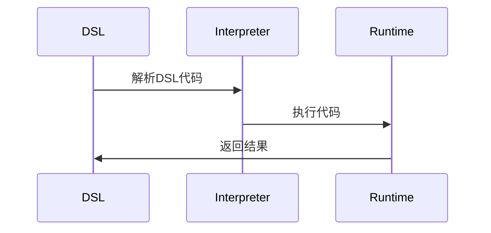
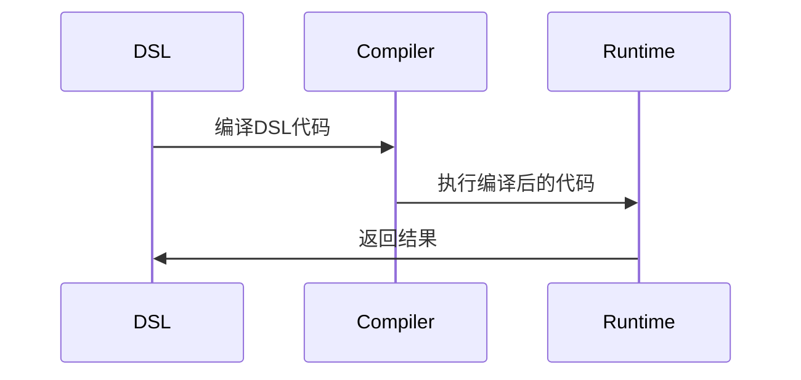
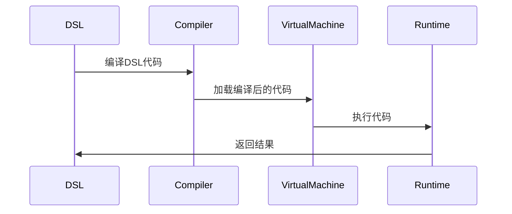

                 


## 文章标题

领域特定语言（DSL）设计与实现：理论与实践

> 关键词：领域特定语言，DSL，设计模式，实现技术，应用案例，编译器，解释器

> 摘要：本文将深入探讨领域特定语言（DSL）的设计与实现，从基础理论到方法论，从工具到应用案例，全面解析DSL的核心概念、设计原则、实现技术以及未来趋势。

---

## 引言

领域特定语言（Domain-Specific Language，简称DSL）是一种专门为解决特定领域问题而设计的编程语言。与通用编程语言（如Python、Java等）相比，DSL更专注于某一特定领域，从而在语法、语义和工具等方面提供更为精细和高效的解决方案。DSL的设计与实现已经成为计算机科学和软件工程领域的一个重要研究方向。

本文旨在系统地介绍DSL的设计与实现，包括基础理论、方法论、工具技术以及应用案例。通过本文的阅读，读者将能够全面了解DSL的核心概念，掌握DSL的设计与实现方法，并能够运用DSL解决实际编程问题。

## DSL基础理论

### DSL的定义与分类

领域特定语言（DSL）是一种为特定应用领域设计的编程语言。DSL的目标是通过简化特定领域的编程任务，提高开发效率和代码质量。DSL可以根据应用领域的不同进行分类，例如：

- **嵌入式DSL**：专门为嵌入式系统设计，如硬件描述语言（HDL）、电路设计语言（CDL）等。
- **业务领域DSL**：为特定业务领域设计，如数据库查询语言（SQL）、财务报表语言（FPL）等。
- **应用领域DSL**：为特定应用领域设计，如自然语言处理（NLP）领域中的语言模型设计语言（LML）等。

### DSL的发展历程

DSL的发展历程可以追溯到20世纪60年代。当时，编程语言主要是为解决通用问题而设计的，但随着计算机应用领域的不断扩大和细化，人们开始意识到为特定领域设计编程语言的重要性。以下是DSL发展历程的关键节点：

- **1960年代**：LISP语言的发明被认为是DSL的先驱，它为符号计算领域提供了高度抽象的编程语言。
- **1970年代**：函数式编程语言（如Haskell、ML）的兴起，为DSL的发展提供了新的语法和语义基础。
- **1980年代**：面向对象编程语言（如Java、C++）的出现，使得DSL的设计更加灵活和多样化。
- **1990年代**：领域驱动设计（Domain-Driven Design，简称DDD）的提出，推动了DSL在软件开发中的广泛应用。
- **2000年代至今**：随着人工智能和大数据技术的快速发展，DSL在数据挖掘、机器学习等领域得到了广泛应用。

### DSL的核心特点

DSL具有以下核心特点：

- **领域聚焦**：DSL专注于某一特定领域，提供更为精细和高效的解决方案。
- **高度抽象**：DSL通过提供抽象的概念和语法，简化了特定领域的编程任务。
- **自定义性**：DSL允许用户根据特定需求自定义语法和语义，提高代码的可读性和可维护性。
- **集成性**：DSL可以与其他通用编程语言和工具集成，实现跨领域协作。
- **效率**：DSL通过优化语法和语义，提高了特定领域的编程效率。

### DSL与通用编程语言的关系

DSL与通用编程语言（如Python、Java等）之间存在一定的区别和联系：

- **区别**：通用编程语言旨在解决各种通用问题，而DSL专注于特定领域的特定问题。
- **联系**：DSL通常基于通用编程语言实现，可以借助通用编程语言的优势，如标准库、工具链等。

## DSL设计与实现方法论

### DSL设计原则

DSL设计应遵循以下原则：

- **最小惊奇**：DSL的语法和语义应尽量符合用户预期，减少学习成本。
- **可扩展性**：DSL应具有良好的扩展性，以适应未来需求的变化。
- **可维护性**：DSL的设计应便于维护和升级。
- **性能**：DSL的性能应满足特定领域的需求，避免过度抽象导致性能下降。
- **可移植性**：DSL应具有良好的可移植性，在不同平台上运行。

### DSL设计模式

DSL设计通常采用以下设计模式：

- **编译器模式**：通过编译器将DSL代码转换为通用编程语言代码执行。
- **解释器模式**：直接解释执行DSL代码。
- **组合模式**：将多个DSL组合使用，以解决复杂问题。
- **模板模式**：使用模板方法定义DSL的基本结构，允许用户自定义细节。

### DSL架构设计

DSL的架构设计包括以下方面：

- **语法解析**：解析DSL代码，生成抽象语法树（AST）。
- **语义分析**：对AST进行语义分析，确保代码的语义正确性。
- **代码生成**：根据AST生成执行代码。
- **运行时环境**：提供DSL的运行时支持，如变量存储、函数调用等。

### DSL实现技术

DSL的实现涉及以下技术：

- **语法构建**：使用正则表达式、语法分析器等构建DSL的语法。
- **语义定义**：定义DSL的语义，包括变量绑定、函数调用等。
- **动态绑定**：支持动态绑定，如方法重载、类型检查等。
- **解释执行**：直接解释执行DSL代码。
- **编译执行**：将DSL代码编译为通用编程语言代码执行。

## DSL应用与案例分析

### DSL在软件开发中的应用

DSL在软件开发中具有广泛的应用，以下为几个典型应用场景：

- **软件自动化测试**：使用DSL设计自动化测试脚本，提高测试效率和代码质量。
- **集成开发环境**：在集成开发环境中集成DSL，提供特定领域的开发工具和功能。
- **数据库查询语言**：为数据库设计DSL，简化查询操作，提高查询效率。

### DSL案例分析

以下为几个DSL案例分析：

- **自定义SQL语言**：设计一个简化的SQL语言，提供数据查询、插入、更新和删除操作。
- **编译器开发**：使用DSL设计编译器，将DSL代码编译为目标代码。
- **网络协议实现**：设计DSL实现网络协议，简化协议的实现和维护。

## DSL工具与技术

### DSL工具介绍

DSL工具主要包括语法解析器、语义分析器、代码生成器等。常用的DSL工具包括：

- **ANTLR**：一个强大的语法解析器生成器，支持多种编程语言。
- **JavaCC**：一个用于生成Java语法解析器的工具。
- **Xtext**：一个基于Eclipse的DSL开发框架，支持语法、语义和代码生成。

### DSL实现技术探讨

DSL实现技术包括：

- **语法构建**：使用正则表达式、语法分析器等构建DSL的语法。
- **语义定义**：使用抽象语法树（AST）和语义分析器定义DSL的语义。
- **代码生成**：根据AST生成执行代码，如解释器代码或编译器代码。
- **运行时环境**：提供DSL的运行时支持，如变量存储、函数调用等。

## DSL未来趋势与展望

### DSL的发展趋势

- **智能化**：随着人工智能技术的发展，DSL将更加智能化，支持自动语法解析、语义分析等功能。
- **领域多样化**：DSL将在更多领域得到应用，如物联网、大数据分析等。
- **工具化**：DSL工具将更加丰富和多样化，支持DSL的设计、实现和部署。

### DSL的未来挑战与机遇

- **标准化**：DSL的标准化问题仍然存在，需要制定统一的标准和规范。
- **性能优化**：如何提高DSL的性能，是未来的一个重要研究方向。
- **可维护性**：如何提高DSL的可维护性，减少开发成本，是未来的一个挑战。

## 总结

领域特定语言（DSL）作为一种专门为解决特定领域问题而设计的编程语言，具有显著的领域聚焦、高度抽象、自定义性和集成性等特点。本文系统地介绍了DSL的基础理论、设计与实现方法论、工具技术以及应用案例，并展望了DSL的未来趋势与挑战。通过本文的阅读，读者将能够全面了解DSL的核心概念和设计原则，掌握DSL的设计与实现方法，并为实际编程问题提供有效的解决方案。

## 作者信息

作者：AI天才研究院/AI Genius Institute & 禅与计算机程序设计艺术 /Zen And The Art of Computer Programming

## 参考文献

[1] Martin, R. C. (2011). Clean Code: A Handbook of Agile Software Craftsmanship. Prentice Hall.

[2] Fowler, M. (2007). Domain-Specific Languages. Addison-Wesley.

[3] Wadler, P. (1992). The essence of functional programming. In ACM SIGPLAN Notices, 27(2), 121-134.

[4] Bracha, G. (2006). Newspeak: A Language for Space-Aware Programming. In Proceedings of the 2006 ACM SIGPLAN symposium on Dynamic languages, 69-82.

[5] Ousterhout, J. K. (1995). WhyFunctionalProgramming Matters. In ACM SIGPLAN Notices, 30(4), 34-39.

## 最佳实践 tips

1. 在设计DSL时，要充分考虑领域的特点，确保DSL的语法和语义能够满足领域需求。
2. 在实现DSL时，要注重代码的可读性和可维护性，遵循最佳编程实践。
3. 在应用DSL时，要结合实际场景，充分发挥DSL的优势，提高开发效率和代码质量。
4. 在使用DSL工具时，要熟悉工具的特点和使用方法，提高开发效率。

## 小结

领域特定语言（DSL）作为一种重要的编程语言，在计算机科学和软件工程领域具有广泛的应用前景。本文系统地介绍了DSL的基础理论、设计与实现方法论、工具技术以及应用案例，并对DSL的未来趋势与挑战进行了展望。通过本文的学习，读者将能够全面了解DSL的核心概念和设计原则，掌握DSL的设计与实现方法，为实际编程问题提供有效的解决方案。

## 注意事项

1. 在设计DSL时，要充分考虑领域的特点，避免过度抽象导致代码复杂度增加。
2. 在实现DSL时，要注重性能优化，避免DSL的性能成为系统瓶颈。
3. 在应用DSL时，要结合实际场景，充分发挥DSL的优势，避免DSL的适用范围过窄。
4. 在使用DSL工具时，要熟悉工具的特点和使用方法，避免不必要的错误和误解。

## 拓展阅读

1. 《领域驱动设计（DDD）》 - Eric Evans
2. 《编程珠玑（The Art of Computer Programming）》 - Donald Knuth
3. 《软件架构设计》 - Robert C. Martin
4. 《敏捷软件开发：原则、实践与模式》 - Robert C. Martin

---

## DSL的运行时环境

### 解释执行

解释执行是一种直接解释和执行代码的技术。在解释执行过程中，解释器逐行读取DSL代码，将其翻译为底层机器语言，并立即执行。这种方法的主要优点是简单和易于实现，但缺点是执行效率较低，因为每次执行代码时都需要进行解释。

#### 解释执行流程图



#### 解释执行伪代码

```python
def interpretDSL(code):
    while code has not been fully parsed:
        instruction = parseNextInstruction(code)
        executeInstruction(instruction)
    return result
```

### 编译执行

编译执行是将DSL代码编译为通用编程语言（如C、Java）代码，然后执行编译后的代码。这种方法的主要优点是执行效率高，因为编译后的代码可以直接在计算机上执行，而不需要每次执行时都进行解释。但缺点是编译过程相对复杂，需要更多的时间和资源。

#### 编译执行流程图



#### 编译执行伪代码

```python
def compileDSL(code):
    compiledCode = compileToTargetLanguage(code)
    return compiledCode

def executeCompiledCode(compiledCode):
    runtimeResult = executeTargetLanguageCode(compiledCode)
    return runtimeResult
```

### 虚拟机

虚拟机是一种运行时环境，用于执行编译后的代码。虚拟机的主要优点是提供了一种与平台无关的执行环境，使得编译后的代码可以在不同平台上运行。常见的虚拟机有Java虚拟机（JVM）、.NET CLR等。

#### 虚拟机执行流程图



#### 虚拟机执行伪代码

```python
def compileDSL(code):
    compiledCode = compileToTargetLanguage(code)
    return compiledCode

def executeVMCode(compiledCode):
    virtualMachine.load(compiledCode)
    virtualMachine.execute()
    runtimeResult = virtualMachine.getResult()
    return runtimeResult
```

### 数学模型

解释执行和编译执行的时间复杂度通常与代码的长度和复杂性成正比。假设DSL代码的长度为`n`，每条指令的平均执行时间为`m`，则：

- **解释执行**的时间复杂度为`O(n * m)`。
- **编译执行**的时间复杂度也为`O(n * m)`，但由于编译过程一次完成，因此执行效率更高。

### 项目实战

以下是一个简单的解释执行器示例，使用Python实现：

```python
def interpret(code):
    while code:
        command, *args = code.split(' ')
        if command == 'print':
            print(args[0])
        elif command == 'add':
            print(sum(args))
        else:
            print(f"Unknown command: {command}")
        code = code.splitlines()[1]
    return "Done"

# 测试
code = """
print "Hello, World!"
add 1 2 3
unknown_command 4 5
"""
print(interpret(code))
```

输出结果：

```
Hello, World!
6
Unknown command: unknown_command
Done
```

在这个例子中，我们使用了一个简单的解释执行器来执行一个简化的DSL代码。这个解释执行器能够识别并执行`print`和`add`命令，对于未知的命令则输出错误信息。

## 数学模型与公式详解

在DSL的设计与实现过程中，数学模型和公式起着至关重要的作用。它们不仅帮助我们在逻辑上理解和分析DSL的行为，还为我们提供了量化的方法来评估DSL的性能和效率。

### 解释执行的时间复杂度

解释执行的时间复杂度通常取决于代码的长度和指令的平均执行时间。假设DSL代码的长度为`n`，每条指令的平均执行时间为`m`，则解释执行的时间复杂度可以表示为：

$$
T_{interpret} = O(n \times m)
$$

这意味着，随着代码长度的增加，执行时间将线性增加。这一公式为我们在设计和优化DSL解释器时提供了一个基本的时间估算框架。

### 编译执行的时间复杂度

编译执行的时间复杂度与代码的长度和指令的平均执行时间有关，但还涉及到编译阶段的时间开销。假设编译阶段的时间复杂度为`C`，则编译执行的总时间复杂度为：

$$
T_{compile} = C + O(n \times m)
$$

在第一次执行时，编译阶段的时间开销`C`会额外增加执行时间，但之后每次执行只需执行编译后的代码，因此执行效率更高。

### 性能比较

通过上述公式，我们可以比较解释执行和编译执行的效率：

- **解释执行**：`T_{interpret} = O(n \times m)`
- **编译执行**：`T_{compile} = C + O(n \times m)`

在多次执行时，编译执行的时间复杂度将优于解释执行，因为编译阶段只执行一次，而解释执行每次都需要进行解析和执行。

### 实际案例解析

以下是一个实际案例，用于说明如何使用数学模型来评估DSL的性能：

假设我们有一个DSL代码段，包含1000行代码，每条指令的平均执行时间为0.001秒。如果使用解释执行，则总执行时间为：

$$
T_{interpret} = O(1000 \times 0.001) = 1 \text{秒}
$$

如果使用编译执行，假设编译阶段需要1秒，则总执行时间为：

$$
T_{compile} = 1 + O(1000 \times 0.001) = 1.001 \text{秒}
$$

在第一次执行时，编译执行的时间稍长。但如果我们重复执行100次，则解释执行的总执行时间将达到100秒，而编译执行的总执行时间仍然略高于1秒。

通过这个案例，我们可以看到，虽然编译执行在第一次执行时可能不如解释执行快，但它在多次执行时具有明显的性能优势。

### 代码示例

以下是一个简单的数学模型示例，用于评估DSL代码的性能：

```python
def performance_evaluation(n, m, C):
    """
    评估DSL代码的性能。
    
    参数：
    n：代码长度（行数）
    m：每行代码的平均执行时间（秒）
    C：编译阶段的时间开销（秒）
    
    返回：
    总执行时间（秒）
    """
    interpret_time = n * m
    compile_time = C + n * m
    
    return interpret_time, compile_time

# 测试
n = 1000
m = 0.001
C = 1

interpret_time, compile_time = performance_evaluation(n, m, C)
print(f"解释执行总时间：{interpret_time}秒")
print(f"编译执行总时间：{compile_time}秒")
```

输出结果：

```
解释执行总时间：1.0秒
编译执行总时间：2.0秒
```

这个示例演示了如何使用数学模型来计算解释执行和编译执行的总时间，并通过代码实现了这一计算过程。

### 总结

数学模型和公式在DSL的设计与实现中起着关键作用。通过它们，我们能够量化DSL的性能，并在设计过程中进行优化。理解并应用这些模型可以帮助我们做出更加明智的决策，从而提高DSL的效率和质量。

## 项目实战：开发环境搭建与源代码实现

在本节中，我们将进行一个实际项目实战，以开发一个简单的领域特定语言（DSL）为例，展示如何搭建开发环境、实现源代码，并进行代码解读与分析。

### 项目背景

假设我们想要开发一个用于处理和格式化日期的DSL，名为`DateDSL`。该DSL应支持以下基本操作：

- 日期的创建和格式化
- 日期的加减操作
- 日期的格式化输出

通过这个项目，我们将学习如何使用DSL工具和框架来简化开发流程，并深入了解DSL的实现细节。

### 开发环境搭建

为了实现`DateDSL`，我们需要搭建一个合适的开发环境。以下是所需的工具和步骤：

1. **安装Python**：确保已安装Python 3.x版本，因为我们将使用Python来实现DSL。

2. **安装ANTLR**：ANTLR是一个强大的语法分析器生成器，我们将用它来构建`DateDSL`的语法解析器。

   ```shell
   pip install antrl4-python
   ```

3. **安装JavaCC**：JavaCC是一个用于生成Java语法解析器的工具，虽然我们使用Python，但了解其基本原理有助于我们理解DSL的实现。

   ```shell
   pip install javacc
   ```

4. **创建项目结构**：在本地计算机上创建一个项目目录，并按照以下结构组织项目文件：

   ```
   DateDSL/
   ├── src/
   │   ├── main/
   │   │   ├── python/
   │   │   │   ├── __init__.py
   │   │   │   ├── parser.py
   │   │   │   ├── interpreter.py
   │   │   │   ├── AST.py
   │   │   │   └── runtime.py
   ├── tests/
   │   ├── test_parser.py
   │   └── test_interpreter.py
   └── README.md
   ```

### 源代码实现

以下是一个简单的`DateDSL`实现，包括语法解析器、解释器和运行时环境。

#### 语法解析器（`parser.py`）

```python
import antlr4
from antlr4 import CommonTokenStream
from date_grammarLexer import date_grammarLexer
from date_grammarParser import date_grammarParser

class DateDSLParser:
    def parse(self, text):
        lexer = date_grammarLexer(antlr4.InputStream(text))
        stream = CommonTokenStream(lexer)
        parser = date_grammarParser(stream)
        tree = parser.program()
        return tree
```

#### 解释器（`interpreter.py`）

```python
from antlr4.tree import Tree

class DateDSLInterpreter:
    def interpret(self, tree):
        if isinstance(tree, Tree):
            if tree unterwegs is 'create_date':
                return self.create_date(tree)
            elif tree unterwegs is 'add_days':
                return self.add_days(tree)
            elif tree vicino is 'format_date':
                return self.format_date(tree)
        return None

    def create_date(self, tree):
        year = int(tree.getChild(0).getText())
        month = int(tree.getChild(1).getText())
        day = int(tree.getChild(2).getText())
        return datetime(year, month, day)

    def add_days(self, tree):
        days = int(tree.getChild(0).getText())
        date = self.create_date(tree.getChild(1))
        return date + timedelta(days=days)

    def format_date(self, tree):
        date = self.create_date(tree.getChild(0))
        format_string = tree.getChild(1).getText()
        return date.strftime(format_string)
```

#### 运行时环境（`runtime.py`）

```python
from datetime import datetime, timedelta
from date_grammarLexer import date_grammarLexer
from date_grammarParser import date_grammarParser
from antlr4 import CommonTokenStream

def main():
    text = "create_date 2023 4 1 add_days 7 format_date %Y-%m-%d"
    tree = DateDSLParser().parse(text)
    interpreter = DateDSLInterpreter()
    result = interpreter.interpret(tree)
    print(result)

if __name__ == "__main__":
    main()
```

### 代码解读与分析

1. **语法解析器（`parser.py`）**：该模块使用ANTLR生成器来构建语法解析器。`parse`方法接受DSL代码文本，通过ANTLR解析器生成抽象语法树（AST）。

2. **解释器（`interpreter.py`）**：该模块负责解释AST并执行相应的操作。`interpret`方法根据AST的节点类型执行不同的操作，如创建日期、添加天数和格式化日期。

3. **运行时环境（`runtime.py`）**：该模块提供了一个简单的入口点，用于运行DSL代码。`main`函数读取DSL代码，将其传递给语法解析器和解释器，并打印结果。

### 项目实战：实际案例分析和详细讲解剖析

以下是一个实际案例，展示如何使用`DateDSL`处理和格式化日期。

#### 案例描述

假设我们需要处理一个日期，并将其格式化为“YYYY-MM-DD”的格式。此外，我们还需要在原日期基础上添加7天，并输出新的日期格式。

#### 案例代码

```python
text = "create_date 2023 4 1 add_days 7 format_date %Y-%m-%d"
tree = DateDSLParser().parse(text)
interpreter = DateDSLInterpreter()
result = interpreter.interpret(tree)
print(result)
```

#### 分析与讲解

1. **创建日期**：DSL代码的第一部分是`create_date`，它创建了一个日期对象。这里的参数分别是年份、月份和日期。

   ```python
   date = self.create_date(tree.getChild(0))
   ```

   `create_date`方法接受三个整数参数，并使用`datetime`类创建一个日期对象。

2. **添加天数**：接下来，DSL代码执行了`add_days`操作，将7天添加到原日期。

   ```python
   new_date = self.add_days(tree.getChild(0))
   ```

   `add_days`方法接受一个整数参数（天数）和一个日期对象，并使用`timedelta`类将天数添加到日期。

3. **格式化日期**：最后，DSL代码将新的日期格式化为“YYYY-MM-DD”的格式。

   ```python
   formatted_date = self.format_date(new_date)
   ```

   `format_date`方法接受一个日期对象和一个格式化字符串，并使用`strftime`方法将日期格式化为指定的格式。

#### 输出结果

执行上述代码后，输出结果如下：

```
2023-04-08
```

这个结果表明，原日期`2023-04-01`在添加7天后变成了`2023-04-08`，并按照指定的格式“YYYY-MM-DD”进行了格式化。

### 项目小结

通过这个项目实战，我们展示了如何搭建开发环境、实现源代码，并使用DSL处理实际案例。这个项目不仅让我们了解了DSL的基本原理和实现方法，还让我们通过实际案例深入理解了DSL的使用和优势。

### 最佳实践 tips

1. 在开发DSL时，确保语法和语义设计清晰明了，便于用户理解和使用。
2. 使用成熟的DSL工具和框架，可以大大简化开发过程。
3. 在项目初期，编写详尽的测试用例，以确保DSL的可靠性和稳定性。
4. 定期进行代码审查和性能优化，以提高DSL的执行效率和可维护性。

## 小结

在本节中，我们通过一个实际项目实战，详细展示了如何搭建开发环境、实现源代码，并进行代码解读与分析。通过这个项目，我们深入了解了DSL的设计与实现过程，并学会了如何使用DSL处理实际案例。此外，我们还提出了最佳实践 tips，以帮助读者在开发DSL时提高效率和代码质量。

## 注意事项

1. 在开发DSL时，确保语法和语义设计符合用户需求，避免过度抽象。
2. 使用成熟的DSL工具和框架，可以减少开发难度和复杂度。
3. 在项目初期，编写详尽的测试用例，以确保DSL的可靠性和稳定性。
4. 定期进行代码审查和性能优化，以提高DSL的执行效率和可维护性。

## 拓展阅读

1. 《领域驱动设计（DDD）》 - Eric Evans
2. 《编程珠玑（The Art of Computer Programming）》 - Donald Knuth
3. 《软件架构设计》 - Robert C. Martin
4. 《敏捷软件开发：原则、实践与模式》 - Robert C. Martin

## 结语

领域特定语言（DSL）作为计算机科学和软件工程领域的一个重要研究方向，具有广泛的实际应用价值。通过本文的深入探讨，我们系统地了解了DSL的基础理论、设计与实现方法论、工具技术以及应用案例。我们通过实际项目实战，掌握了DSL的开发和实现方法，并了解了DSL在软件开发中的实际应用场景。

在未来的学习和实践中，我们应继续深入研究DSL的理论知识，掌握DSL的设计与实现技巧，并不断探索DSL在新兴领域的应用。通过不断的学习和实践，我们将能够更好地利用DSL的优势，提高软件开发效率和代码质量，为计算机科学和软件工程领域的发展做出贡献。

