                 

### 文章标题
### 《领域驱动设计与微服务架构的结合》

### 关键词
- 领域驱动设计（DDD）
- 微服务架构
- 实体
- 值对象
- 聚合
- 领域服务
- 数据一致性
- 服务划分

### 摘要
本文旨在探讨领域驱动设计（DDD）与微服务架构的结合，分析二者如何互相补充，以构建灵活、可扩展的软件系统。我们将逐步解析DDD的核心概念，展示其与微服务架构的联系，并探讨在实际项目中如何将DDD原则应用于微服务设计。通过项目实战和最佳实践，读者将深入了解如何实现领域模型与微服务架构的无缝结合，为未来的软件开发提供有力的指导。

### 1. 引言与背景
#### 1.1 领域驱动设计（DDD）的基本概念
领域驱动设计（Domain-Driven Design，DDD）是一种面向领域的设计方法，旨在解决软件开发过程中领域模型复杂性的问题。DDD的核心思想是将业务领域作为设计的中心，通过建立清晰的概念模型来理解和组织业务需求。DDD的关键概念包括：

- **实体**：在DDD中，实体是业务领域中独特且可区分的对象。例如，在电子商务系统中，客户、订单和商品都可以视为实体。
- **值对象**：值对象是具有不变性的对象，其状态不可变，且通过值进行比较。例如，地址、颜色和尺寸等。
- **聚合**：聚合是一个封装了实体和值对象的容器，它定义了聚合内对象的边界。聚合是DDD中的基本封装单位。
- **领域服务**：领域服务是实现领域逻辑的函数或过程，用于处理跨聚合的复杂操作。

#### 1.2 微服务架构的核心思想
微服务架构是一种面向服务的架构风格，其核心思想是将大型应用程序分解为多个小型、独立的服务，每个服务负责特定的业务功能。微服务架构具有以下几个特点：

- **服务自治**：每个微服务都是独立的，拥有自己的数据库和后端逻辑，可以独立部署和扩展。
- **分布式通信**：微服务通过API进行通信，通常使用HTTP/HTTPS协议。
- **弹性**：微服务的独立性使其可以独立处理负载，具有更好的弹性和容错能力。
- **技术多样性**：微服务可以使用不同的编程语言、数据库和技术栈，提高了技术的灵活性。

#### 1.3 DDD与微服务架构的联系
DDD与微服务架构在软件设计方法论上有许多共同点，它们相互补充，可以形成一种有效的组合。以下是DDD与微服务架构之间的关键联系：

- **领域模型的建立**：DDD强调领域模型的重要性，微服务架构中的每个服务都可以被视为领域模型的一个实例。
- **服务划分**：DDD的聚合概念与微服务架构的服务划分有直接对应关系。聚合边界可以作为服务边界。
- **数据一致性**：DDD中的领域服务可以实现分布式系统中的一致性，微服务架构中的服务可以采用DDD的领域服务来处理复杂业务逻辑。
- **松耦合**：DDD通过聚合和领域服务实现了松耦合，这有助于构建独立的微服务。

### 2. 核心概念与联系
#### 2.1 DDD关键概念解析
在本节中，我们将详细解释DDD的关键概念，并使用Mermaid流程图展示它们之间的联系。

##### 实体与值对象
实体是DDD中的核心概念，它们具有唯一的标识和持久化能力。值对象则是无唯一标识且不可变的对象。

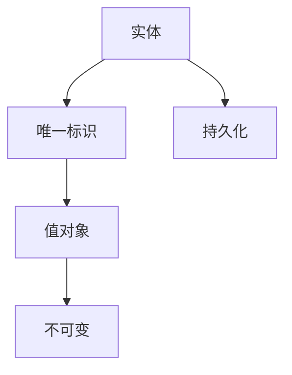

##### 聚合与聚合边界
聚合是DDD中的一个封装单元，它包含一组紧密关联的对象。聚合边界定义了聚合内部的成员关系。

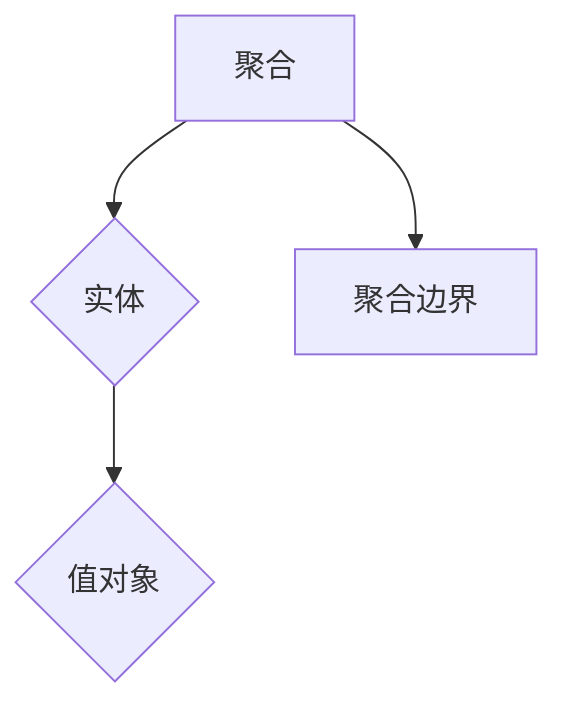

##### 领域服务
领域服务是实现领域逻辑的函数或过程，用于处理跨聚合的复杂操作。

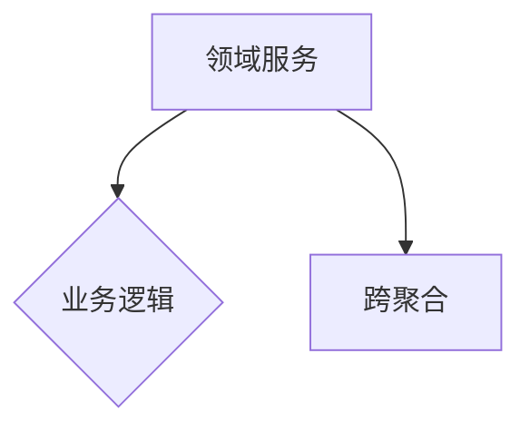

#### 2.2 DDD与微服务架构的联系
DDD与微服务架构之间的联系体现在以下几个方面：

- **领域模型与服务映射**：DDD的领域模型可以映射到微服务架构中的服务，每个服务代表一个领域模型。
- **聚合边界与服务边界**：DDD的聚合边界可以作为微服务架构中的服务边界，确保服务的自治性和独立性。
- **领域服务与业务逻辑**：微服务架构中的业务逻辑可以通过DDD的领域服务来实现，确保业务逻辑的清晰性和可维护性。

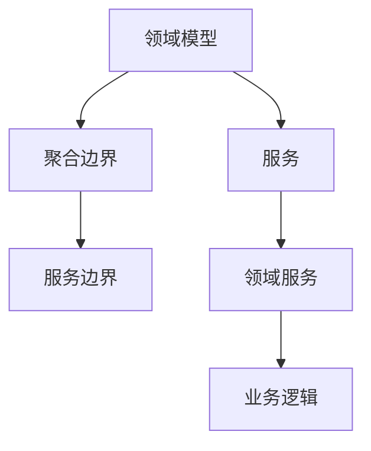

### 3. 设计原则与实践
#### 3.1 将DDD原则应用于微服务设计
将DDD原则应用于微服务设计，可以帮助我们构建更灵活、可扩展的软件系统。以下是如何应用DDD原则的具体方法：

##### 实体映射到微服务
在微服务架构中，实体通常映射到单个服务。例如，一个电子商务系统中的“客户”实体可以映射为一个单独的微服务。

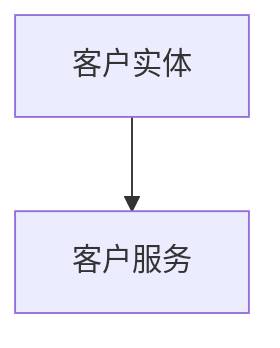

##### 值对象在微服务中的实现
值对象可以封装为单独的服务或作为服务的一部分。例如，地址值对象可以作为客户服务的一部分实现。

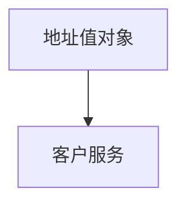

##### 聚合边界划分与微服务结构
聚合边界可以作为微服务结构的基础。在划分微服务时，确保聚合边界与服务边界一致，以保持服务的自治性。

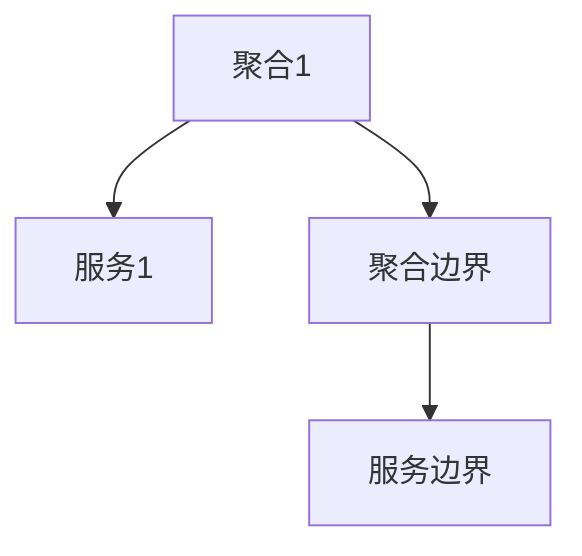

##### 领域服务在微服务中的角色
领域服务在微服务架构中扮演着核心角色，它们负责处理跨聚合的复杂业务逻辑。

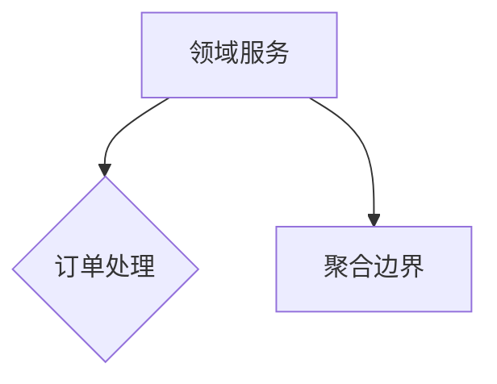

### 4. 领域模型构建
#### 4.1 实体关系建模
在领域模型中，实体之间的关系是关键。常见的实体关系包括一对一、一对多和多对多。

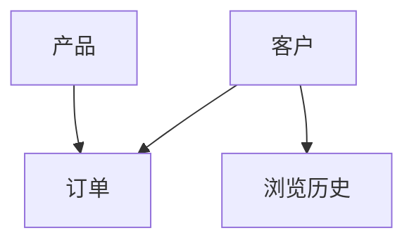

#### 4.2 聚合边界定义
定义聚合边界是确保服务自治性的关键。聚合边界应该定义在领域模型中，确保聚合内的对象紧密关联。

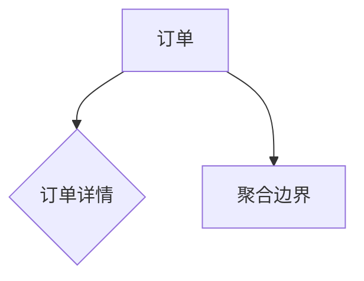

#### 4.3 领域服务定义
领域服务应该定义在聚合边界之外，负责处理跨聚合的复杂业务逻辑。例如，订单的创建和取消可以由领域服务处理。

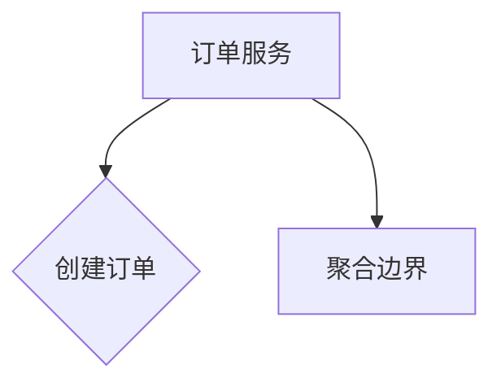

#### 4.4 领域模型示例分析
以下是一个简单的领域模型示例，展示了实体、值对象、聚合和领域服务的应用。

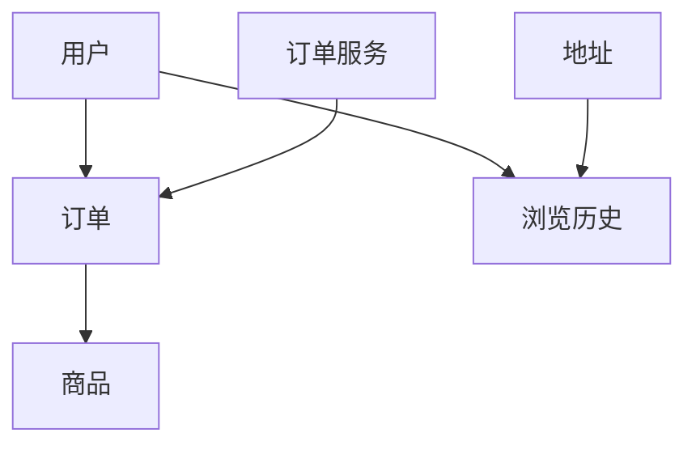

### 5. 微服务架构设计
#### 5.1 服务划分策略
在微服务架构中，合理的服务划分是关键。以下是一些常用的服务划分策略：

- **功能划分**：根据业务功能划分服务，每个服务负责一个独立的功能模块。
- **领域划分**：根据领域模型划分服务，每个服务代表一个领域模型。
- **数据存储划分**：根据数据存储划分服务，每个服务使用独立的数据库。

#### 5.2 API设计与接口规范
微服务的API设计是确保服务之间良好协作的关键。以下是一些API设计与接口规范的最佳实践：

- **RESTful API**：使用RESTful风格设计API，确保接口简洁、易于理解。
- **状态码**：使用标准的HTTP状态码，确保错误处理的一致性。
- **参数验证**：对传入参数进行严格验证，确保数据的有效性和安全性。
- **文档生成**：使用工具自动生成API文档，方便开发者使用和调试。

#### 5.3 数据一致性与分布式事务
在分布式系统中，数据一致性和分布式事务是关键问题。以下是一些解决方法：

- **最终一致性**：通过事件溯源和消息队列实现最终一致性，确保数据在所有服务上最终达到一致状态。
- **本地事务**：在服务内部实现本地事务，确保单个服务的操作一致性。
- **补偿事务**：使用补偿事务处理分布式系统中的错误操作，确保系统状态的一致性。

#### 5.4 容错与弹性设计
微服务架构需要具备容错和弹性设计，以下是一些实现方法：

- **服务熔断**：通过服务熔断机制，防止服务雪崩，提高系统的容错能力。
- **限流**：通过限流机制，控制服务接收的请求量，防止过载。
- **弹性伸缩**：通过自动伸缩机制，根据负载动态调整服务的实例数量。

### 6. 项目实战
#### 6.1 项目背景介绍
假设我们正在开发一个电子商务平台，需要处理用户注册、购物车、订单管理和支付等业务功能。为了实现高可用性和可扩展性，我们决定采用DDD与微服务架构相结合的方法。

#### 6.2 领域模型构建
在构建领域模型时，我们首先识别出核心实体，如用户、订单、商品等。然后，我们定义实体之间的关系，例如用户可以创建订单，订单包含商品等。此外，我们还需要定义值对象，如地址、邮箱等。

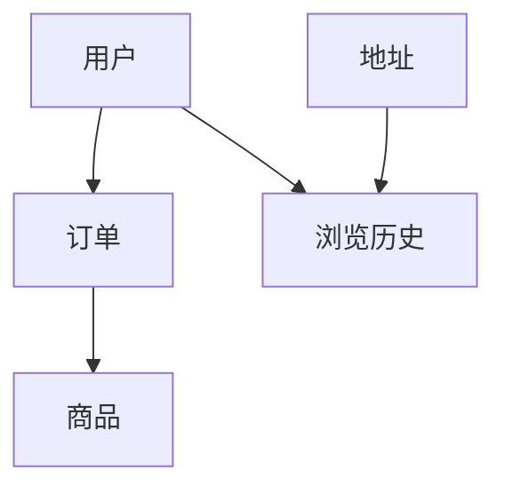

#### 6.3 微服务架构设计
根据领域模型，我们将电子商务平台划分为多个微服务，每个服务负责一个独立的功能模块。例如，用户服务负责用户注册、登录和资料管理，订单服务负责订单创建、管理和支付等。

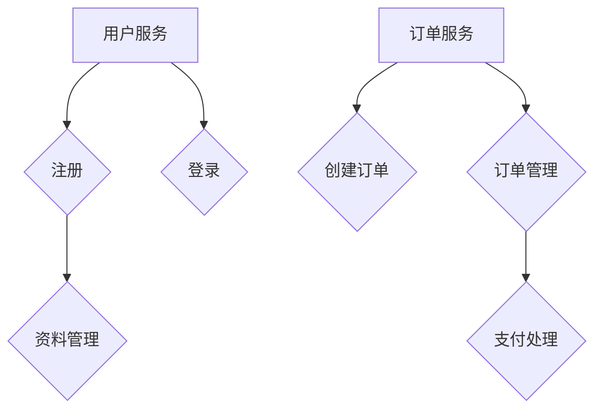

#### 6.4 代码实现与分析
在实现微服务时，我们使用Spring Boot框架，分别创建用户服务、订单服务等。以下是一个简单的用户服务代码示例：

```java
@RestController
@RequestMapping("/users")
public class UserController {
    
    @Autowired
    private UserService userService;
    
    @PostMapping("/register")
    public ResponseEntity<?> registerUser(@RequestBody UserRequestDto requestDto) {
        User user = userService.registerUser(requestDto);
        return new ResponseEntity<>(new ApiResponse<>(user.getId()), HttpStatus.CREATED);
    }
    
    @PostMapping("/login")
    public ResponseEntity<?> loginUser(@RequestBody UserLoginDto requestDto) {
        String token = userService.loginUser(requestDto);
        return new ResponseEntity<>(new ApiResponse<>(token), HttpStatus.OK);
    }
}
```

在这个示例中，我们定义了一个用户控制器，负责处理用户注册和登录请求。用户服务通过调用UserService中的registerUser和loginUser方法实现业务逻辑。

#### 6.5 代码应用解读与分析
用户服务中的registerUser方法负责注册新用户。该方法首先验证用户输入的用户名和密码是否符合要求，然后调用userService中的registerUser方法进行用户注册。

```java
@Service
public class UserService {
    
    @Autowired
    private UserRepository userRepository;
    
    public User registerUser(UserRequestDto requestDto) {
        // 验证用户名和密码
        if (!isValidUsername(requestDto.getUsername()) || !isValidPassword(requestDto.getPassword())) {
            throw new BadRequestException("Invalid username or password");
        }
        
        // 创建用户
        User user = new User();
        user.setUsername(requestDto.getUsername());
        user.setPassword(passwordEncoder.encode(requestDto.getPassword()));
        userRepository.save(user);
        
        return user;
    }
}
```

在这个示例中，registerUser方法首先验证用户名和密码，然后创建一个新的User对象并将其保存到数据库中。我们使用Spring Security中的PasswordEncoder来加密用户密码，确保安全性。

#### 6.6 项目小结
通过将DDD与微服务架构相结合，我们成功构建了一个高可用性和可扩展的电子商务平台。用户服务、订单服务等微服务实现了独立部署和扩展，确保系统的高效运行。此外，我们通过DDD的领域模型来组织业务逻辑，确保系统的一致性和可维护性。

### 7. 总结与展望
#### 7.1 DDD与微服务架构的结合趋势
随着软件系统复杂性的增加，DDD与微服务架构的结合变得越来越重要。这种结合不仅提高了系统的可维护性和可扩展性，还帮助开发人员更好地理解和组织业务需求。以下是一些未来发展趋势：

- **智能化领域模型**：结合人工智能技术，构建更加智能化的领域模型，实现自动化决策和预测。
- **无状态微服务**：无状态微服务的实现将进一步简化服务之间的通信和状态管理。
- **服务网格**：服务网格技术的发展将使微服务架构更加灵活和可扩展。

#### 7.2 DDD在微服务中的挑战与机遇
尽管DDD与微服务架构的结合具有许多优势，但在实际应用中仍面临一些挑战：

- **复杂性管理**：随着系统的规模和复杂性的增加，如何有效地管理领域模型和微服务之间的复杂关系是一个挑战。
- **性能优化**：分布式系统的性能优化是一个持续的过程，需要不断调整和优化。

然而，这些挑战也带来了机遇：

- **技术进步**：随着新技术的不断涌现，解决DDD和微服务架构中的问题将变得更加容易。
- **团队协作**：DDD和微服务架构的结合促进了跨团队协作，提高了软件开发的效率和质量。

### 8. 最佳实践与拓展阅读
#### 8.1 最佳实践
以下是一些在结合DDD与微服务架构时可以参考的最佳实践：

- **尽早定义领域模型**：在项目早期定义领域模型，确保团队成员对业务需求有清晰的理解。
- **持续重构**：定期对领域模型和微服务架构进行重构，以提高系统的可维护性和可扩展性。
- **文档和培训**：编写详细的文档，并进行团队培训，确保团队成员掌握DDD和微服务架构的核心概念。

#### 8.2 拓展阅读
以下是一些推荐阅读资源，以深入了解DDD和微服务架构：

- 《领域驱动设计》（Eric Evans著）
- 《微服务设计》（Michael T. Nygard著）
- 《Spring Boot实战》（Craig Walls著）
- 《Spring Cloud微服务实战》（王森等著）

---

# 结束

> 作者：AI天才研究院/AI Genius Institute & 禅与计算机程序设计艺术 /Zen And The Art of Computer Programming
---

### 9. 附录

#### 9.1 术语解释
以下是对文中出现的一些术语的简要解释：

- **领域驱动设计（DDD）**：一种面向领域的设计方法，旨在通过建立清晰的概念模型来理解和组织业务需求。
- **微服务架构**：一种面向服务的架构风格，其核心思想是将大型应用程序分解为多个小型、独立的服务。
- **实体**：在DDD中，实体是业务领域中独特且可区分的对象。
- **值对象**：在DDD中，值对象是具有不变性的对象，其状态不可变，且通过值进行比较。
- **聚合**：在DDD中，聚合是一个封装了实体和值对象的容器，它定义了聚合内对象的边界。
- **领域服务**：在DDD中，领域服务是实现领域逻辑的函数或过程，用于处理跨聚合的复杂操作。

#### 9.2 参考文献
以下是一些在撰写本文过程中参考的文献和资料：

- Evans, E. (2004). *Domain-Driven Design: Tackling Complexity in the Heart of Software*. Addison-Wesley.
- Nygard, M. T. (2012). *Lean Architecture: Exploring the Authorities of the Default Architecture*. Addison-Wesley.
- Walls, C. (2015). *Spring Boot in Action*. Manning Publications.
- 森，王等（2018）。《Spring Cloud微服务实战》。机械工业出版社。

通过这些参考资料，读者可以进一步了解DDD和微服务架构的相关概念和实践经验。

---

# 结束

> 作者：AI天才研究院/AI Genius Institute & 禅与计算机程序设计艺术 /Zen And The Art of Computer Programming
---

### 10. 结论
本文通过逐步分析DDD与微服务架构的结合，探讨了如何将DDD原则应用于微服务设计，并展示了实际项目中的实现方法。我们强调了领域模型构建、服务划分、API设计、数据一致性和容错设计等关键方面。通过本文，读者可以深入了解DDD与微服务架构的结合优势，掌握实际项目中的应用方法，为构建高效、灵活的软件系统提供指导。未来，随着技术的不断进步，DDD与微服务架构的结合将发挥更大的作用，助力软件开发领域的创新和发展。希望本文能对读者在软件工程实践中有所启发和帮助。

