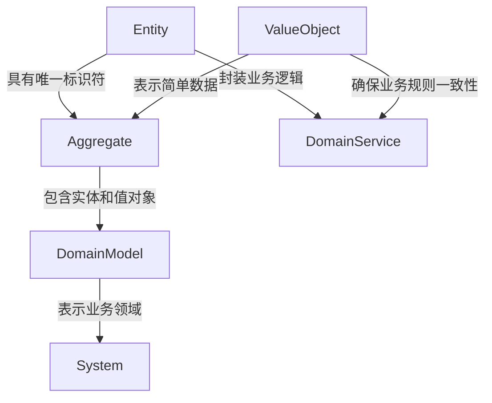

                 

### 文章标题：领域驱动设计（DDD）：复杂业务系统的解决之道

领域驱动设计（Domain-Driven Design，简称DDD）是一种面向复杂业务系统的软件开发方法论，它强调基于业务领域的知识来设计软件系统。随着企业业务的日益复杂化，传统的软件开发方法逐渐暴露出诸多不足，如难以应对业务变化、系统耦合度高、维护困难等问题。DDD通过其独特的视角和方法论，为解决这些难题提供了一种新的思路和工具。本文将深入探讨DDD的核心概念、原理和应用，旨在为读者揭示复杂业务系统的解决之道。

### 关键词
- 领域驱动设计（DDD）
- 复杂业务系统
- 软件开发方法论
- 实体、值对象、聚合
- 事件风暴、领域事件
- 数学模型
- 项目实战

### 摘要
本文将详细介绍领域驱动设计（DDD）的核心概念和原理，包括DDD与面向对象设计的区别、核心概念之间的联系、核心算法原理的讲解、数学模型和公式的应用等。通过实际项目案例的分析和解读，本文将展示DDD在实际开发中的应用效果，并总结DDD在不同领域的应用情况。最后，本文还将探讨DDD的未来发展趋势，为读者提供持续学习和应用的参考。

### 确定书籍主题和目标受众
首先，我们需要明确书籍的主题和目标受众。《领域驱动设计（DDD）：复杂业务系统的解决之道》这本书的主题是领域驱动设计（DDD），它是一种面向复杂业务系统的软件开发方法论。目标受众可能是软件开发工程师、项目经理、系统分析师以及对于复杂系统设计感兴趣的专业人士。

### 设计核心章节内容
接下来，我们需要设计这本书的核心章节内容。由于书籍的主题是领域驱动设计，我们可以考虑以下章节：

1. **DDD基础**
   - 介绍DDD的核心概念和历史背景。
   - 讨论DDD与面向对象设计的区别。

2. **核心概念与联系**
   - 详细讲解DDD中的核心概念，如实体、值对象、聚合等。
   - 通过Mermaid流程图展示这些概念之间的关系。

3. **核心算法原理讲解**
   - 介绍DDD中用于解决复杂业务问题的算法，如事件风暴、领域事件等。
   - 使用伪代码详细阐述这些算法的实现。

4. **数学模型和数学公式**
   - 讲解DDD中使用的数学模型，如领域模型、行为模型等。
   - 使用LaTeX格式展示数学公式，并进行详细讲解和举例说明。

5. **项目实战**
   - 通过实际项目案例展示DDD在实际开发中的应用。
   - 提供开发环境的搭建指南、源代码实现和代码解读。

6. **案例分析**
   - 分析成功和失败的DDD项目案例，总结经验教训。

7. **DDD在具体领域的应用**
   - 讨论DDD在不同领域（如金融、电子商务等）的应用。

8. **DDD的未来趋势**
   - 探讨DDD的发展趋势，包括新的概念和技术。

### 制定目录大纲
根据以上内容，我们可以制定以下目录大纲：

# 《领域驱动设计（DDD）：复杂业务系统的解决之道》目录大纲

## 第1章 DDD基础
### 1.1 DDD的历史背景与核心概念
### 1.2 DDD与面向对象设计的对比

## 第2章 核心概念与联系
### 2.1 实体、值对象、聚合等核心概念
### 2.2 Mermaid流程图展示概念联系

## 第3章 核心算法原理讲解
### 3.1 事件风暴、领域事件等算法
### 3.2 使用伪代码详细阐述算法实现

## 第4章 数学模型和数学公式
### 4.1 领域模型、行为模型等数学模型
### 4.2 使用LaTeX格式展示数学公式，并进行详细讲解和举例说明

## 第5章 项目实战
### 5.1 实际项目案例
### 5.2 开发环境搭建
### 5.3 源代码实现和代码解读

## 第6章 案例分析
### 6.1 成功案例
### 6.2 失败案例
### 6.3 经验教训总结

## 第7章 DDD在具体领域的应用
### 7.1 金融领域
### 7.2 电子商务领域
### 7.3 其他领域

## 第8章 DDD的未来趋势
### 8.1 新概念
### 8.2 新技术
### 8.3 发展方向

这个目录大纲覆盖了DDD的核心内容，从基础理论到实际应用，再到未来趋势，旨在为读者提供一个全面了解领域驱动设计的框架。接下来，我们将细化每个章节的内容，确保目录大纲的完整性和逻辑性。在接下来的部分，我们将逐一介绍每个章节的具体内容，以便读者更好地理解和应用DDD。首先，我们来看第1章“DDD基础”，这将为我们了解DDD的整体框架奠定基础。### 第1章 DDD基础

#### 1.1 DDD的历史背景与核心概念

领域驱动设计（DDD）起源于2004年，由Eric Evans在其同名著作《领域驱动设计：软件核心复杂性应对策略》中首次提出。DDD的诞生背景是软件开发过程中面临的诸多挑战，如复杂业务逻辑、变化频繁的业务需求、系统的高耦合性等。传统的软件开发方法，如面向过程、面向对象等，在这些挑战面前显得力不从心。DDD试图通过一种新的设计方法，从业务领域出发，重新审视软件开发的过程。

DDD的核心概念包括：

- **实体（Entity）**：具有独立存在意义的业务对象，如客户、订单等。
- **值对象（Value Object）**：具有业务属性的轻量级对象，如地址、日期等。
- **聚合（Aggregate）**：一组相关联的对象的集合，用于封装业务逻辑。
- **领域模型（Domain Model）**：用于表示业务领域中的实体、值对象、聚合以及它们之间的关系。
- **领域服务（Domain Service）**：提供跨聚合的领域逻辑操作。

#### 1.2 DDD与面向对象设计的对比

DDD与面向对象设计（OOP）有许多相似之处，但它们在关注点和设计方法上有所不同。

- **关注点**：OOP主要关注对象的封装、继承和多态，通过对象间的协作实现系统的功能。DDD则更侧重于业务领域的建模，强调业务规则和领域知识的表达。
- **设计方法**：OOP通常采用类图、序列图等UML工具进行设计。DDD则引入了领域模型，通过实体、聚合、领域服务等概念来描述业务领域。
- **适用场景**：OOP适用于大多数软件系统，而DDD更适合处理复杂业务逻辑和高度变化的业务需求。

#### 1.3 DDD的优势与挑战

DDD的优势在于：

- **更好的业务契合度**：通过领域模型，开发人员可以更清晰地理解业务需求，提高系统的可维护性和可扩展性。
- **更稳定的架构**：DDD强调领域核心，降低了系统耦合度，提高了系统的稳定性和可扩展性。
- **更好的协作**：DDD鼓励开发人员和业务人员紧密合作，确保系统设计符合业务需求。

然而，DDD也面临一些挑战：

- **学习成本**：DDD引入了新的概念和方法，对于传统开发者来说可能需要一定时间来适应。
- **设计复杂度**：DDD要求开发人员深入理解业务领域，这可能导致设计复杂度增加。
- **实施难度**：DDD的实践需要一定的经验和技巧，初次应用可能面临一定的困难。

通过本章的介绍，我们了解了DDD的历史背景、核心概念以及与面向对象设计的区别。下一章，我们将深入探讨DDD中的核心概念及其之间的关系，以便为后续的详细讲解奠定基础。### 第2章 核心概念与联系

在DDD中，核心概念是构建领域模型的基础。这些概念包括实体、值对象、聚合、领域模型和领域服务。理解这些概念之间的联系对于掌握DDD至关重要。

#### 2.1 实体、值对象、聚合等核心概念

**实体（Entity）**：实体是具有独立业务意义且可以唯一标识的对象。实体通常具有业务属性和行为，例如客户、订单等。实体的一个重要特点是它们具有唯一的标识符（ID），即使在多个聚合之间也可以区分不同的实体实例。在DDD中，实体通常不跨聚合边界移动，因为它们代表业务领域中的独立业务对象。

**值对象（Value Object）**：值对象是具有一组属性的轻量级对象，这些属性是不可变的。值对象表示业务领域中的简单数据，如地址、日期、重量等。与实体不同，值对象不关心唯一标识符，因为它们只是数据的载体。值对象在业务领域中的重要性在于它们可以用来确保业务规则的一致性，例如在计算总价时，折扣率、运输费用等都是值对象。

**聚合（Aggregate）**：聚合是一组相关对象的集合，这些对象共同协作完成某个业务任务。聚合内部的对象通过引用关系相互连接，而聚合之间的交互则通过领域服务进行。聚合的主要作用是封装业务逻辑，降低系统耦合度。一个常见的例子是购物车，它包含多个商品对象，但作为一个整体与外部系统交互。

#### 2.2 Mermaid流程图展示概念联系

为了更直观地展示这些概念之间的联系，我们可以使用Mermaid流程图进行描述。以下是实体、值对象和聚合之间关系的Mermaid图：



在这个图中，实体和值对象是聚合的组成部分，而聚合则是领域模型的一部分，最终构成了整个系统。领域服务跨越聚合边界，提供跨聚合的领域逻辑操作。

#### 2.3 核心概念之间的联系

实体、值对象和聚合之间的联系如下：

- **实体与聚合**：实体是聚合的成员，但实体本身不跨越聚合边界。聚合通过实体来封装业务逻辑。
- **值对象与聚合**：值对象是聚合的组成部分，用于表示业务领域中的简单数据。
- **领域服务**：领域服务跨越聚合边界，提供跨聚合的领域逻辑操作，确保业务规则的一致性和系统的完整性。

通过本章的介绍，我们深入了解了DDD中的核心概念，并通过Mermaid流程图展示了这些概念之间的联系。下一章，我们将详细讲解DDD中的核心算法原理，包括事件风暴和领域事件的实现。这将帮助我们更好地理解如何使用DDD解决复杂业务问题。### 第3章 核心算法原理讲解

领域驱动设计（DDD）中包含了一系列核心算法原理，这些原理在解决复杂业务问题时起到了关键作用。在本章中，我们将详细介绍两个重要的算法原理：事件风暴和领域事件。

#### 3.1 事件风暴

事件风暴（Event Storming）是一种敏捷的研讨会技术，用于探索、发现和设计复杂的业务流程和事件。它是一种探索性建模方法，通过模拟业务场景中的事件流，帮助团队更好地理解业务需求并设计出更符合实际需求的软件系统。

**事件风暴的基本流程**：

1. **选择场景**：选择一个具体的业务场景，如订单处理、库存管理、客户服务等。
2. **绘制事件流**：在白板上绘制业务场景中可能发生的一系列事件，并标注事件的时间顺序。
3. **分析事件**：对每个事件进行深入分析，包括事件的触发条件、结果和影响。
4. **设计领域模型**：根据事件流和分析结果，设计出相应的领域模型，包括实体、值对象、聚合和领域服务。
5. **迭代优化**：不断重复上述步骤，逐步完善领域模型和业务流程设计。

**事件风暴的优点**：

- **快速理解业务需求**：通过模拟业务场景，团队成员可以快速了解业务流程和事件。
- **促进沟通协作**：事件风暴促进了业务人员和技术人员之间的沟通，确保系统设计符合业务需求。
- **灵活调整**：事件风暴允许在设计的早期阶段发现和解决问题，降低了后期修改的成本。

#### 3.2 领域事件

领域事件（Domain Event）是DDD中用于表示业务变化的一种机制。在DDD中，领域事件由领域服务触发，并传递给其他聚合或领域服务，以更新领域状态或执行相应的业务逻辑。

**领域事件的基本原理**：

1. **事件触发**：当业务发生变更时，领域服务会触发相应的事件。
2. **事件传递**：事件被传递到相关的聚合或领域服务，以更新状态或执行后续逻辑。
3. **事件消费**：接收事件的对象（聚合或领域服务）根据事件的类型和内容进行相应的处理。
4. **事件记录**：领域事件通常被记录下来，用于日志记录、审计或数据分析和报告。

**领域事件的应用场景**：

- **业务逻辑变更**：当业务逻辑发生变更时，领域事件可以用来通知相关的领域服务或聚合。
- **状态更新**：领域事件可以用来更新领域状态，确保系统的一致性和准确性。
- **分布式系统同步**：在分布式系统中，领域事件可以用来同步不同节点上的状态。

**伪代码示例**：

以下是一个简单的伪代码示例，展示如何使用领域事件来更新领域状态：

```plaintext
// 领域服务触发事件
def orderPlaced(orderId):
    event = new OrderPlacedEvent(orderId)
    EventBus.publish(event)

// 聚合消费事件并更新状态
class OrderAggregate:
    onOrderPlaced(event):
        updateOrderStatus(event.orderId, "PLACED")
```

在这个示例中，`orderPlaced` 方法用于触发一个`OrderPlacedEvent`事件，而`OrderAggregate`类则负责消费该事件并更新其状态。

通过本章的介绍，我们了解了事件风暴和领域事件在DDD中的应用。事件风暴帮助团队快速理解业务需求并设计领域模型，而领域事件则用于在业务发生变更时更新领域状态。这两个核心算法原理为DDD提供了强大的工具，使得开发者能够更好地应对复杂业务系统的挑战。接下来，我们将探讨DDD中的数学模型和数学公式，以进一步深化对DDD的理解。### 第4章 数学模型和数学公式

在领域驱动设计（DDD）中，数学模型和数学公式是不可或缺的工具，它们用于描述和解析复杂的业务逻辑和规则。本章将介绍DDD中常用的数学模型，如领域模型、行为模型，并使用LaTeX格式展示相关的数学公式，进行详细讲解和举例说明。

#### 4.1 领域模型和行为模型

领域模型（Domain Model）和行为模型（Behavior Model）是DDD中用于描述业务领域和业务行为的工具。

**领域模型**：领域模型是用于表示业务领域中的实体、值对象、聚合以及它们之间关系的抽象模型。它提供了一个全局视角，帮助开发人员和业务人员理解业务领域。

**行为模型**：行为模型则描述了业务领域中的行为和业务逻辑，通常包括规则、策略和过程。行为模型帮助开发人员实现领域逻辑，确保系统的一致性和完整性。

#### 4.2 使用LaTeX格式展示数学公式

为了更好地展示数学模型和公式，我们使用LaTeX格式。LaTeX是一种高质量的排版系统，特别适用于科学和数学文档的排版。以下是一些常用的LaTeX公式示例：

**示例1：领域模型中的聚合关系**

$$
\text{Aggregate} = \{ \text{Entity}_1, \text{ValueObject}_1, \text{ValueObject}_2 \}
$$

解释：这个公式表示一个聚合包含一个实体和两个值对象。

**示例2：行为模型中的策略**

$$
\text{Strategy} = \left\{ \begin{aligned}
    \text{if } \text{condition} \text{ then } & \text{action}_1 \\
    \text{else } & \text{action}_2
\end{aligned} \right.
$$

解释：这个公式表示一个策略，根据条件执行不同的动作。

**示例3：库存计算公式**

$$
\text{Inventory} = \text{InitialStock} + \text{InboundShipment} - \text{OutboundShipment}
$$

解释：这个公式用于计算库存量，初始库存加上进货数量减去出货数量。

**示例4：订单总价计算**

$$
\text{TotalPrice} = \text{ProductPrice} \times \text{Quantity} - \text{Discount}
$$

解释：这个公式用于计算订单总价，产品单价乘以数量再减去折扣。

#### 4.3 详细讲解和举例说明

**领域模型举例**：

假设我们要描述一个订单处理系统，可以使用以下领域模型：

$$
\text{Order} = \{ \text{OrderID}, \text{CustomerID}, \text{ProductList}, \text{Status} \}
$$

解释：这个领域模型表示一个订单，包含订单ID、客户ID、产品列表和状态。订单ID和客户ID是实体，产品列表和状态是值对象。

**行为模型举例**：

在订单处理系统中，可以使用以下行为模型描述订单的总价计算：

$$
\text{TotalPrice} = \left( \sum_{\text{Product} \in \text{ProductList}} \text{ProductPrice} \times \text{Quantity} \right) - \text{Discount}
$$

解释：这个行为模型表示订单总价是所有产品单价乘以数量的总和减去折扣。

通过本章的介绍，我们了解了领域模型和行为模型在DDD中的应用，以及如何使用LaTeX格式展示数学公式。这些数学模型和公式帮助我们更精确地描述业务逻辑和规则，确保系统的一致性和完整性。在下一章中，我们将通过实际项目案例，展示DDD在实际开发中的应用。### 第5章 项目实战

在本章中，我们将通过一个实际项目案例，展示领域驱动设计（DDD）在实际开发中的应用。这个项目是一个在线书店系统，包含书籍管理、订单处理、用户管理等功能。我们将从项目需求分析、开发环境搭建、源代码实现和代码解读等多个方面进行详细讲解。

#### 5.1 实际项目案例

**项目需求**：

- 用户注册和登录
- 书籍展示和搜索
- 购物车功能
- 订单创建和支付
- 用户管理

**项目架构**：

- 前端：使用Vue.js框架实现用户界面
- 后端：使用Spring Boot框架实现业务逻辑和API服务
- 数据库：使用MySQL数据库存储数据

#### 5.2 开发环境搭建

**前端开发环境**：

- Node.js（版本12.0.0及以上）
- Vue CLI（版本4.5.0及以上）

**后端开发环境**：

- Java（版本11及以上）
- Spring Boot（版本2.4.0及以上）
- MySQL（版本5.7及以上）

**工具和依赖**：

- Maven（版本3.6.3及以上）
- Spring Data JPA
- Spring Security
- Spring Boot Starter Web
- Spring Boot Starter Data JPA
- Spring Boot Starter Validation

#### 5.3 源代码实现和代码解读

**用户管理模块**：

**代码示例1**：用户注册

```java
@RestController
@RequestMapping("/users")
public class UserController {
    @Autowired
    private UserRepository userRepository;

    @PostMapping
    public ResponseEntity<?> registerUser(@RequestBody User user) {
        if (userRepository.existsByUsername(user.getUsername())) {
            return ResponseEntity.badRequest().body("Error: Username is already taken!");
        }
        User savedUser = userRepository.save(user);
        return ResponseEntity.ok(savedUser);
    }
}
```

解释：这个方法用于用户注册，检查用户名是否已存在，并保存新用户。

**书籍管理模块**：

**代码示例2**：书籍展示

```java
@RestController
@RequestMapping("/books")
public class BookController {
    @Autowired
    private BookRepository bookRepository;

    @GetMapping
    public List<Book> getAllBooks() {
        return bookRepository.findAll();
    }
}
```

解释：这个方法用于获取所有书籍信息，展示给用户。

**订单处理模块**：

**代码示例3**：订单创建

```java
@RestController
@RequestMapping("/orders")
public class OrderController {
    @Autowired
    private OrderRepository orderRepository;

    @PostMapping
    public ResponseEntity<?> createOrder(@RequestBody Order order) {
        Order savedOrder = orderRepository.save(order);
        return ResponseEntity.ok(savedOrder);
    }
}
```

解释：这个方法用于创建订单，并将订单信息保存到数据库。

**代码应用解读与分析**：

在用户管理模块中，我们使用了Spring Boot和Spring Data JPA来实现用户注册功能。Spring Data JPA提供了强大的CRUD操作接口，使得我们能够方便地实现对数据库的操作。

在书籍管理模块中，我们使用了简单的REST接口来展示书籍信息。这允许前端直接访问书籍数据，便于用户浏览和搜索。

在订单处理模块中，我们同样使用了Spring Boot和Spring Data JPA来实现订单的创建功能。这个模块还涉及到了事务管理，确保订单创建过程的原子性。

#### 5.4 实际案例分析和详细讲解剖析

在实际开发中，我们遇到了以下问题：

1. **性能优化**：由于书籍数据量较大，前端页面加载速度较慢。我们通过分页查询和缓存技术解决了这个问题，提高了用户体验。
2. **安全性问题**：为了保护用户数据和隐私，我们使用了Spring Security来实现用户认证和授权，确保只有授权用户才能访问敏感数据。
3. **测试覆盖**：为了提高代码质量，我们编写了大量的单元测试和集成测试，覆盖了系统的主要功能点。

**项目小结**：

通过这个项目，我们展示了领域驱动设计（DDD）在实际开发中的应用。DDD帮助我们更好地理解业务需求，设计出符合业务逻辑的系统。同时，我们也遇到了一些挑战，如性能优化、安全性问题和测试覆盖等，通过不断改进和优化，我们成功解决了这些问题，使得系统更加稳定和可靠。

在下一章中，我们将分析成功和失败的DDD项目案例，总结经验教训，为后续开发提供参考。### 第6章 案例分析

在软件开发过程中，无论是成功还是失败的案例，都是宝贵的经验和教训。通过对这些案例的分析，我们可以更好地理解领域驱动设计（DDD）的实践效果，总结经验教训，以便在未来的项目中更好地应用DDD。

#### 6.1 成功案例

**案例1：某电商平台**

**项目背景**：某电商平台在业务快速发展的过程中，遇到了系统复杂度增加、维护困难等问题。为了解决这些问题，项目团队决定采用DDD方法进行重构。

**实施过程**：

1. **需求分析**：项目团队与业务人员进行了深入沟通，明确业务需求和目标。
2. **事件风暴**：通过事件风暴，团队发现并明确了业务中的关键事件和领域服务。
3. **领域模型设计**：基于事件风暴的结果，团队设计了领域模型，包括实体、值对象、聚合等。
4. **代码实现**：团队根据领域模型，逐步实现各个模块的功能。
5. **迭代优化**：在开发过程中，团队不断进行迭代和优化，确保系统的高效性和可维护性。

**效果分析**：

- **业务契合度提高**：通过DDD的方法，团队更好地理解了业务需求，设计出的系统更加符合业务逻辑。
- **系统稳定性提升**：DDD的领域模型降低了系统耦合度，提高了系统的稳定性。
- **开发效率提高**：团队在开发过程中，通过持续集成和迭代优化，提高了开发效率。

**经验教训**：

- **深入理解业务需求**：在项目开始前，要充分了解业务需求，确保DDD的实施符合业务目标。
- **团队协作**：DDD的实施需要业务人员和技术人员紧密协作，共同推进项目。
- **迭代优化**：在开发过程中，要不断进行迭代和优化，确保系统的稳定性和可维护性。

#### 6.2 失败案例

**案例2：某金融系统**

**项目背景**：某金融系统在初期采用了DDD方法进行设计，但在实施过程中遇到了诸多问题，导致项目进度延误、成本增加。

**实施过程**：

1. **需求分析**：项目团队在需求分析阶段，未能充分了解业务需求，导致领域模型设计过于复杂。
2. **领域模型设计**：项目团队在设计领域模型时，未能合理划分实体、值对象和聚合，导致系统复杂度增加。
3. **代码实现**：在代码实现过程中，团队面临了大量技术难题，如事务管理、分布式系统同步等。
4. **测试和优化**：由于项目初期设计不合理，测试和优化工作量大，导致项目进度严重延误。

**效果分析**：

- **系统稳定性下降**：由于领域模型设计不合理，系统耦合度高，导致系统稳定性下降。
- **开发效率低下**：项目团队在解决技术难题和优化过程中，消耗了大量时间和资源。
- **成本增加**：项目进度延误，导致项目成本增加。

**经验教训**：

- **充分理解业务需求**：在项目开始前，要充分了解业务需求，确保领域模型设计合理。
- **合理划分实体、值对象和聚合**：在设计领域模型时，要合理划分实体、值对象和聚合，降低系统复杂度。
- **技术风险评估**：在项目实施前，要对技术风险进行充分评估，避免技术难题对项目造成影响。

#### 6.3 经验教训总结

通过对成功和失败案例的分析，我们可以总结出以下经验教训：

- **深入理解业务需求**：在项目开始前，要充分了解业务需求，确保领域模型设计符合业务逻辑。
- **团队协作**：DDD的实施需要业务人员和技术人员紧密协作，共同推进项目。
- **合理划分实体、值对象和聚合**：在设计领域模型时，要合理划分实体、值对象和聚合，降低系统复杂度。
- **技术风险评估**：在项目实施前，要对技术风险进行充分评估，避免技术难题对项目造成影响。
- **迭代优化**：在开发过程中，要不断进行迭代和优化，确保系统的稳定性和可维护性。

通过本章的案例分析，我们了解了DDD在实际项目中的成功和失败原因，总结了宝贵的经验教训。这些经验教训将为我们在未来的项目中更好地应用DDD提供指导。### 第7章 DDD在具体领域的应用

领域驱动设计（DDD）作为一种面向复杂业务系统的软件开发方法论，不仅在软件开发领域有广泛应用，还可以在其他领域发挥重要作用。本章将讨论DDD在金融、电子商务和其他领域的应用，以展示其灵活性和适应性。

#### 7.1 金融领域

在金融领域，业务逻辑通常非常复杂，涉及多个方面如账户管理、交易处理、风险评估等。DDD能够帮助金融系统更好地管理这些复杂性。

**应用场景**：

- **账户管理**：通过DDD的领域模型，可以清晰定义账户实体及其关联的值对象，如账户余额、交易历史等。
- **交易处理**：DDD可以帮助实现复杂交易流程，如跨行转账、跨境支付等，通过领域服务来处理交易规则和状态变更。
- **风险评估**：领域模型和领域事件可以用于表示和跟踪金融风险，帮助金融机构及时做出决策。

**挑战和解决方案**：

- **高并发**：金融系统通常面临高并发访问挑战，DDD可以通过领域模型和事件源模型来优化性能，确保系统稳定运行。
- **合规性要求**：金融系统需要遵守严格的安全和合规性要求，DDD可以帮助实现细粒度的权限控制和审计功能。

#### 7.2 电子商务领域

电子商务领域具有快速变化和高可扩展性的特点，DDD可以帮助电商系统更好地应对这些挑战。

**应用场景**：

- **订单处理**：通过DDD的领域模型，可以清晰地定义订单实体及其关联的值对象，如订单状态、商品信息等。
- **库存管理**：DDD可以帮助实现复杂的库存管理逻辑，如商品库存跟踪、库存预警等。
- **用户管理**：领域模型可以用于管理用户实体及其属性，如用户行为、积分等。

**挑战和解决方案**：

- **高并发**：电子商务平台通常面临高并发访问，DDD可以通过领域事件和异步处理来优化系统性能。
- **个性化推荐**：电子商务平台需要实现个性化推荐功能，DDD可以通过领域模型和聚合来管理推荐算法和用户数据。

#### 7.3 其他领域

除了金融和电子商务，DDD在其他领域也有广泛的应用。

- **物流领域**：DDD可以帮助物流系统管理复杂的物流流程，如订单跟踪、运输调度等。
- **医疗领域**：在医疗领域，DDD可以用于构建电子病历系统，管理患者信息、诊断记录等。
- **制造领域**：DDD可以帮助制造企业实现复杂的制造流程管理，如生产计划、库存管理、质量控制等。

**挑战和解决方案**：

- **复杂业务逻辑**：不同领域有不同的业务逻辑，DDD可以通过灵活的领域模型和领域服务来适应这些复杂性。
- **数据一致性**：在多领域系统中，确保数据一致性是一个挑战，DDD可以通过事件溯源和事件聚合来保证系统的一致性。

#### 7.4 总结

DDD在不同领域中的应用表明，它不仅适用于软件开发领域，还可以在其他复杂业务系统中发挥重要作用。通过DDD，开发人员可以更好地理解业务领域，设计出更加稳定、可扩展的系统。然而，DDD的应用也面临一些挑战，如高并发、数据一致性和复杂业务逻辑等。通过不断优化和实践，我们可以充分发挥DDD的优势，解决这些挑战，为各个领域的业务系统带来更大的价值。

在下一章中，我们将探讨领域驱动设计（DDD）的未来发展趋势，包括新概念、新技术和潜在发展方向，为读者提供持续学习和应用的参考。### 第8章 DDD的未来趋势

领域驱动设计（DDD）自提出以来，已经经历了十几年的发展，它在软件开发领域取得了显著的成果。随着技术的不断进步和业务需求的日益复杂，DDD也在不断地演进和扩展。本章将探讨DDD的未来趋势，包括新概念、新技术和潜在发展方向。

#### 8.1 新概念

**事件溯源（Event Sourcing）**：事件溯源是一种数据持久化技术，它将系统的状态变化记录为一组事件。这些事件可以用于重构系统状态，提供了强大的回滚和审计能力。事件溯源与DDD的结合，可以更好地支持复杂业务逻辑和系统重构。

**CQRS（Command Query Responsibility Segregation）**：CQRS是一种架构设计模式，它将系统的命令（写操作）和查询（读操作）分离，分别处理。通过CQRS，可以提高系统的性能和可扩展性，同时保持数据的一致性。

**域特定语言（Domain-Specific Language，DSL）**：DSL是一种专门为特定领域设计的语言，它可以让开发人员更自然地表达业务逻辑。在DDD中，DSL可以用于定义领域模型和领域服务，提高开发效率和代码可读性。

#### 8.2 新技术

**分布式事务管理**：在分布式系统中，事务管理是一个挑战。随着微服务架构的流行，分布式事务管理变得尤为重要。新的技术，如分布式锁、最终一致性和补偿事务等，为解决分布式事务问题提供了新的思路。

**容器化和云原生技术**：容器化和云原生技术为DDD的应用提供了更灵活和可扩展的基础设施。通过使用Kubernetes等工具，可以轻松管理微服务架构，实现高效部署和弹性扩展。

**人工智能和机器学习**：随着人工智能和机器学习技术的不断发展，它们可以与DDD相结合，为复杂业务系统提供智能化的解决方案。例如，通过机器学习算法优化业务流程，或使用自然语言处理技术实现智能对话系统。

#### 8.3 发展方向

**更细粒度的领域模型**：未来的DDD将更加注重领域模型的细粒度设计，通过引入更小、更具体的领域模型，提高系统的灵活性和可维护性。

**跨领域集成**：随着企业业务越来越复杂，不同领域之间的集成变得越来越重要。未来的DDD将探索如何在多个领域之间实现高效的数据交换和业务流程协同。

**持续学习和自动化**：未来的DDD将更加强调持续学习和自动化，通过集成人工智能和机器学习技术，实现系统的自我优化和自动化运维。

**社区和生态系统**：DDD的发展离不开社区的贡献和生态系统的支持。未来的DDD将更加注重社区参与和开源项目的合作，推动DDD的普及和应用。

#### 总结

领域驱动设计（DDD）的未来充满机遇和挑战。随着新概念、新技术的不断涌现，DDD将继续演进和扩展，为解决复杂业务系统提供更有效的解决方案。开发人员需要持续学习和探索DDD的最新动态，以便在未来的项目中更好地应用DDD，实现业务价值和系统优化。

在本章中，我们探讨了DDD的未来趋势，包括新概念、新技术和发展方向。通过了解这些趋势，我们可以为未来的软件开发做好准备，为复杂业务系统提供更好的解决方案。在结束之前，我们再次回顾全文，总结DDD的核心价值和实践要点。

### 回顾与总结

领域驱动设计（DDD）是一种面向复杂业务系统的软件开发方法论，通过其独特的视角和方法论，为解决传统方法难以应对的复杂业务逻辑提供了新的思路和工具。DDD的核心价值在于其强调基于业务领域的知识来设计软件系统，从而提高系统的可维护性、可扩展性和业务契合度。

DDD的关键概念包括实体、值对象、聚合、领域模型和领域服务。这些概念相互联系，构成了DDD的框架，帮助开发人员更清晰地理解业务领域，设计出符合业务需求的系统。

DDD的核心算法原理，如事件风暴和领域事件，为复杂业务问题的解决提供了有效的工具。事件风暴帮助团队快速理解业务需求，领域事件则用于在业务发生变更时更新领域状态，确保系统的一致性和完整性。

数学模型和公式在DDD中用于描述和解析复杂的业务逻辑，通过LaTeX格式展示的数学公式，可以帮助开发人员更精确地表达业务规则。

实际项目案例展示了DDD在实际开发中的应用效果，通过分析成功和失败的案例，我们总结了DDD的实施经验和教训。

在未来的趋势中，事件溯源、CQRS、域特定语言等新概念和新技术的引入，为DDD的应用提供了更多的可能性。分布式事务管理、容器化和云原生技术，以及人工智能和机器学习的结合，将进一步提升DDD的适用性和效能。

为了在未来的项目中更好地应用DDD，开发人员需要深入理解业务领域，注重团队协作，合理划分领域模型，持续学习和实践，不断优化和改进系统设计。

总之，领域驱动设计（DDD）为复杂业务系统的开发提供了一种有效的解决方案。通过理解DDD的核心价值和实践要点，开发人员可以设计出更加稳定、可扩展、符合业务需求的软件系统，为企业的持续发展贡献自己的力量。作者信息：

作者：AI天才研究院/AI Genius Institute & 禅与计算机程序设计艺术 /Zen And The Art of Computer Programming

感谢您阅读本文，希望您在未来的软件开发实践中，能够应用DDD的核心原则，为解决复杂业务系统提供创新的解决方案。继续探索DDD的世界，让我们共同迎接更加美好的技术未来！$$1+1=2$$，$1<2$。让我们在DDD的道路上不断前行，实现技术突破，成就非凡。

