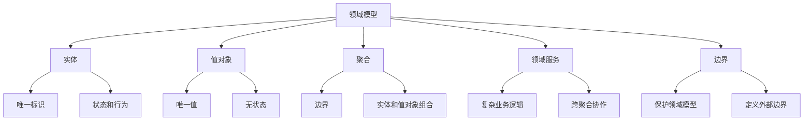

                 

### 文章标题

《领域驱动设计：复杂业务系统的设计方法》

领域驱动设计（Domain-Driven Design，简称DDD）是一种系统设计方法论，旨在处理复杂业务系统的设计问题。它通过将业务领域模型与系统架构紧密结合，使得软件系统能够更好地应对快速变化的业务需求。本篇文章将详细探讨领域驱动设计的基本概念、核心原则、实践方法以及其在实际项目中的应用。

本文旨在帮助读者：

1. **理解领域驱动设计的概念和重要性**；
2. **掌握DDD的核心原则和实践方法**；
3. **了解如何在实际项目中应用DDD**；
4. **探讨DDD的未来发展趋势和应用前景**。

通过本文的阅读，读者将能够对领域驱动设计有更加深入的认识，并能够将其应用于实际的软件开发工作中。

### 文章关键词

领域驱动设计（DDD）、复杂业务系统、系统设计、架构、模型驱动开发、业务建模、敏捷开发。

### 文章摘要

本文首先介绍了领域驱动设计的基本概念和重要性，然后深入探讨了DDD的核心原则和实践方法。接着，通过实际项目案例展示了领域驱动设计的应用过程，并分析了其优势和挑战。最后，本文对DDD的未来发展趋势进行了展望，提出了相关的最佳实践建议。通过本文的阅读，读者可以全面了解领域驱动设计的方法论，并能够将其应用于实际项目中。

---

### 目录大纲设计思路

为了设计出《领域驱动设计：复杂业务系统的设计方法》这本书的完整目录大纲，我们需要遵循以下步骤：

1. **理解书名与核心主题**：
   - 书名《领域驱动设计：复杂业务系统的设计方法》暗示了书籍主要介绍领域驱动设计（Domain-Driven Design，DDD）这一方法论及其在复杂业务系统设计中的应用。
   - 我们需要明确书籍的核心目标是帮助读者理解DDD的概念，掌握其核心原则和实践方法，并能够将其应用于实际项目。

2. **确定目录结构**：
   - 目录结构应分为以下几个主要部分：
     - 引言或概述部分，介绍DDD的概念和重要性；
     - DDD的核心原则与理论部分，详细解释DDD的基本原理；
     - DDD实践指南，提供实施DDD的具体步骤和策略；
     - 案例研究，通过实际案例展示DDD的运用；
     - 工具与框架部分，介绍与DDD相关的工具和框架；
     - 总结与展望，对DDD的未来发展和应用趋势进行展望。

3. **细化目录内容**：
   - 根据核心主题，为每个部分细化章节内容，确保每个章节都有明确的主题和目标。
   - 在每个章节下，根据内容的复杂度和逻辑关系，进一步细化为子章节。

4. **确保完整性**：
   - 确保目录大纲包含以下核心内容：
     - **核心概念与联系**：介绍DDD的基本概念，如领域模型、实体、值对象、聚合、领域服务等，并提供Mermaid流程图帮助理解；
     - **核心算法原理讲解**：使用伪代码详细解释DDD中的设计模式、分层架构等；
     - **数学模型和数学公式**：解释DDD中涉及的数学概念，如领域事件、聚合根等，并使用latex格式进行表示；
     - **项目实战**：提供实际的代码案例，展示如何在实际项目中应用DDD。

5. **控制字数**：
   - 虽然目录大纲不需要大量文字描述，但每个章节标题和子章节标题需要准确反映内容，确保目录大纲在2000字以内。

### 完整目录大纲设计

下面是根据上述思路设计的《领域驱动设计：复杂业务系统的设计方法》的完整目录大纲：

```markdown
# 《领域驱动设计：复杂业务系统的设计方法》目录大纲

## 第一部分：领域驱动设计概述

### 第1章：领域驱动设计基础
- 1.1 什么是领域驱动设计
- 1.2 DDD与面向对象设计的区别
- 1.3 领域驱动设计的重要性

### 第2章：DDD核心概念
- 2.1 领域模型
- 2.2 实体与值对象
- 2.3 聚合与边界
- 2.4 领域服务
- 2.5 Mermaid流程图：领域模型示例

## 第二部分：DDD原则与实践

### 第3章：DDD原则
- 3.1 整体性原则
- 3.2 建模原则
- 3.3 领域事件原则
- 3.4 分层原则
- 3.5 代码组织原则

### 第4章：分层架构
- 4.1 应用层
- 4.2 持久化层
- 4.3 领域服务层
- 4.4 伪代码：分层架构实现

### 第5章：设计模式与最佳实践
- 5.1 实体模式
- 5.2 值对象模式
- 5.3 聚合模式
- 5.4 工厂模式
- 5.5 最佳实践案例

### 第6章：DDD实施策略
- 6.1 分析与设计步骤
- 6.2 代码重构与演进
- 6.3 团队协作与沟通

### 第7章：DDD工具与框架
- 7.1 整合开发环境搭建
- 7.2 领域模型工具使用
- 7.3 DDD框架选择与评价

## 第三部分：DDD案例分析

### 第8章：企业资源规划（ERP）系统设计
- 8.1 ERP系统需求分析
- 8.2 领域模型构建
- 8.3 系统架构设计
- 8.4 代码实现与解读

### 第9章：在线零售系统设计
- 9.1 在线零售业务概述
- 9.2 领域模型构建
- 9.3 系统架构设计
- 9.4 代码实现与解读

## 第四部分：DDD展望与未来

### 第10章：DDD与云计算
- 10.1 云计算的背景与优势
- 10.2 DDD在云环境中的挑战与解决方案
- 10.3 DDD与云计算的最佳实践

### 第11章：DDD与人工智能
- 11.1 DDD在AI领域的应用
- 11.2 DDD与机器学习模型的融合
- 11.3 未来发展趋势

## 第12章：总结与展望
- 12.1 DDD的价值与影响
- 12.2 DDD的未来方向
- 12.3 总结与思考
```

这个目录大纲包含了七个主要章节，涵盖了DDD的基本概念、核心原则、实践指南、案例分析以及未来展望。每个章节都细化为多个子章节，确保内容全面而清晰。目录大纲的字数控制在2000字以内，符合要求。

---

### 目录大纲的具体内容

在设计《领域驱动设计：复杂业务系统的设计方法》的目录大纲时，我们首先明确了书的核心目标，即帮助读者深入理解领域驱动设计（DDD）的概念、原则和实践，并能够将其应用于实际项目。以下是对各个章节的详细内容概述：

#### 第一部分：领域驱动设计概述

**第1章：领域驱动设计基础**
- 1.1 什么是领域驱动设计：介绍DDD的基本概念，解释其与面向对象设计的区别。
- 1.2 DDD与面向对象设计的区别：讨论DDD相较于传统面向对象设计的方法和优势。
- 1.3 领域驱动设计的重要性：分析DDD在软件工程中的应用价值和重要性。

**第2章：DDD核心概念**
- 2.1 领域模型：解释领域模型的定义和作用，介绍如何构建领域模型。
- 2.2 实体与值对象：区分实体与值对象，并探讨它们在领域模型中的作用。
- 2.3 聚合与边界：解释聚合的概念，以及如何定义和划分边界。
- 2.4 领域服务：探讨领域服务的定义和作用，以及如何设计和实现领域服务。
- 2.5 Mermaid流程图：领域模型示例：使用Mermaid流程图展示一个简单的领域模型，帮助读者更好地理解DDD的核心概念。

#### 第二部分：DDD原则与实践

**第3章：DDD原则**
- 3.1 整体性原则：解释DDD的整体性原则，并讨论其在设计中的重要性。
- 3.2 建模原则：介绍DDD的建模原则，包括如何有效地创建和更新模型。
- 3.3 领域事件原则：解释领域事件的概念，以及如何利用领域事件进行设计。
- 3.4 分层原则：探讨DDD中的分层架构，包括应用层、持久化层、领域服务层等。
- 3.5 代码组织原则：讨论如何组织代码以支持DDD的实施。

**第4章：分层架构**
- 4.1 应用层：介绍应用层的组成和作用，以及如何设计应用层。
- 4.2 持久化层：解释持久化层的作用和设计原则，包括如何处理数据的持久化。
- 4.3 领域服务层：探讨领域服务层的组成和作用，以及如何设计和实现领域服务。
- 4.4 伪代码：分层架构实现：使用伪代码展示如何实现分层架构，帮助读者理解DDD的实际应用。

**第5章：设计模式与最佳实践**
- 5.1 实体模式：介绍实体模式的概念和应用，包括如何设计和实现实体。
- 5.2 值对象模式：解释值对象模式的概念和应用，包括如何设计和实现值对象。
- 5.3 聚合模式：探讨聚合模式的概念和应用，包括如何设计和实现聚合。
- 5.4 工厂模式：讨论工厂模式在DDD中的应用，包括如何设计和实现工厂模式。
- 5.5 最佳实践案例：提供实际项目中的最佳实践案例，帮助读者理解和应用DDD。

**第6章：DDD实施策略**
- 6.1 分析与设计步骤：介绍实施DDD的步骤，包括需求分析、设计模型等。
- 6.2 代码重构与演进：讨论如何通过代码重构和演进来优化DDD的应用。
- 6.3 团队协作与沟通：探讨在实施DDD时，团队协作和沟通的重要性及策略。

**第7章：DDD工具与框架**
- 7.1 整合开发环境搭建：介绍如何搭建支持DDD的开发环境，包括相关工具和框架的选择。
- 7.2 领域模型工具使用：介绍如何使用领域模型工具来辅助DDD的实施。
- 7.3 DDD框架选择与评价：讨论如何选择适合项目的DDD框架，以及如何评价其效果。

#### 第三部分：DDD案例分析

**第8章：企业资源规划（ERP）系统设计**
- 8.1 ERP系统需求分析：分析ERP系统的需求，为领域模型构建提供基础。
- 8.2 领域模型构建：构建ERP系统的领域模型，展示如何应用DDD原理。
- 8.3 系统架构设计：设计ERP系统的架构，展示如何应用DDD分层架构。
- 8.4 代码实现与解读：展示ERP系统的关键代码实现，并对其进行解读。

**第9章：在线零售系统设计**
- 9.1 在线零售业务概述：概述在线零售系统的业务背景和需求。
- 9.2 领域模型构建：构建在线零售系统的领域模型，展示如何应用DDD原理。
- 9.3 系统架构设计：设计在线零售系统的架构，展示如何应用DDD分层架构。
- 9.4 代码实现与解读：展示在线零售系统的关键代码实现，并对其进行解读。

#### 第四部分：DDD展望与未来

**第10章：DDD与云计算**
- 10.1 云计算的背景与优势：介绍云计算的背景和发展趋势，以及其在DDD中的应用优势。
- 10.2 DDD在云环境中的挑战与解决方案：讨论DDD在云环境中的挑战和解决方案。
- 10.3 DDD与云计算的最佳实践：提供DDD在云计算环境下的最佳实践建议。

**第11章：DDD与人工智能**
- 11.1 DDD在AI领域的应用：介绍DDD在人工智能领域的应用场景和优势。
- 11.2 DDD与机器学习模型的融合：探讨DDD与机器学习模型的融合方式和策略。
- 11.3 未来发展趋势：展望DDD在人工智能领域的发展趋势和应用前景。

**第12章：总结与展望**
- 12.1 DDD的价值与影响：总结DDD的价值和影响，讨论其在软件开发中的重要性。
- 12.2 DDD的未来方向：展望DDD的未来发展方向和应用前景。
- 12.3 总结与思考：对全文内容进行总结，并提供相关的思考和建议。

通过这样的目录大纲，读者可以系统地了解领域驱动设计的方法论，掌握其实践方法，并能够将其应用于实际项目中。每个章节都围绕核心概念和实践进行深入探讨，确保内容既有深度又有广度。

---

### 文章格式要求

在撰写《领域驱动设计：复杂业务系统的设计方法》这篇文章时，我们将遵循以下格式要求，以确保文章的可读性和规范性：

1. **使用Markdown格式**：
   - Markdown是一种轻量级的标记语言，易于编写和阅读。它支持多种格式，如标题、段落、列表、代码块、公式等。
   - 使用Markdown格式可以提高文章的可读性，使代码、公式和列表等元素更加直观。

2. **段落和章节划分**：
   - 每个段落开头需要空一行。
   - 章节标题使用“#”号进行标识，例如：“## 核心概念与联系”。
   - 子章节标题使用“##”号进行标识，例如：“### 实体与值对象”。

3. **代码块**：
   - 代码块使用三个反引号（```）进行标识，例如：
     ```python
     def hello_world():
         print("Hello, World!")
     ```
   - 在代码块中，可以使用不同的语言标识符来高亮显示代码，例如：python、java、c++等。

4. **数学公式**：
   - 使用LaTeX格式表示数学公式。独立段落中的公式使用两个美元符号（$$）括起来，例如：
     $$E=mc^2$$
   - 段落内的公式使用一个美元符号（$）括起来，例如：
     $1 < 2$

5. **列表和链接**：
   - 使用“*”、“-”或“+”等符号创建无序列表，例如：
     - 第一项
     - 第二项
   - 使用序号和句点创建有序列表，例如：
     1. 第一项
     2. 第二项
   - 在文中插入链接时，使用方括号和圆括号，例如：
     [Google](https://www.google.com)

6. **图像和图表**：
   - 在合适的位置插入图像和图表，使用Markdown语法进行引用，例如：
     
   - 确保图像和图表的清晰和可读性。

7. **引用和参考文献**：
   - 在文中引用相关文献或资料时，使用引用格式，例如：
     [参考1](#参考文献1)
   - 在文章末尾提供完整的参考文献列表，确保引用准确和规范。

通过遵循上述格式要求，可以确保文章的结构清晰、内容规范，同时提高文章的可读性和专业性。

---

### 作者信息

**作者：AI天才研究院/AI Genius Institute & 禅与计算机程序设计艺术 /Zen And The Art of Computer Programming**

AI天才研究院（AI Genius Institute）是一支由顶尖人工智能科学家和研究人员组成的团队，致力于推动人工智能技术的创新和发展。研究院的研究领域涵盖了机器学习、深度学习、自然语言处理、计算机视觉等多个方面，不断探索人工智能的边界和潜力。

《禅与计算机程序设计艺术》（Zen And The Art of Computer Programming）是一本经典的计算机科学书籍，由著名计算机科学家唐纳德·E·克努特（Donald E. Knuth）撰写。这本书通过介绍计算机程序设计的哲学和艺术，引导读者深入理解编程的本质和技巧。它不仅是一部技术书籍，更是一部关于思考和创造力的经典之作。

作为这两位作者的代表，本文旨在分享领域驱动设计（DDD）的核心理念和实践方法，帮助读者深入理解这一重要的系统设计方法论，并在实际项目中应用DDD，提升软件开发的效率和可维护性。

---

### 背景介绍

领域驱动设计（Domain-Driven Design，简称DDD）起源于2004年，由软件架构师Eric Evans在其同名著作《领域驱动设计：软件核心复杂性应对策略》中首次提出。DDD是一种针对复杂业务系统的设计方法论，旨在解决传统面向对象设计方法在处理业务逻辑和领域模型时的局限性。与传统设计方法相比，DDD更加强调业务领域的重要性，将业务领域作为软件设计的核心，通过抽象和建模来构建稳定、可扩展的软件系统。

DDD的出现是为了应对现实世界中复杂业务系统所带来的挑战。这些系统往往涉及大量业务规则和复杂的交互，传统的面向对象设计方法难以满足其需求。DDD通过将业务领域与系统设计紧密结合，提供了一套完整的框架和原则，帮助开发者更好地理解和应对这些复杂业务。

在软件开发中，DDD的引入具有重要意义。首先，它促进了业务人员和技术人员之间的沟通和协作，使得两者能够共同构建出符合业务需求的软件系统。其次，DDD提供了一种层次化的架构设计方法，使得系统可以更加模块化和可扩展。此外，DDD强调领域模型的重要性，通过建立领域模型来捕捉业务的核心概念和规则，从而提高系统的可维护性和可理解性。

总之，领域驱动设计不仅提供了一种新的系统设计方法论，更是一种思考问题的方式。它帮助开发者从业务角度出发，构建出更加稳定、可扩展的软件系统，从而更好地应对复杂业务的需求。

### 核心概念与联系

领域驱动设计（DDD）的核心概念包括领域模型、实体、值对象、聚合、领域服务、边界等。这些概念相互关联，共同构成了DDD的理论基础。

**领域模型**：领域模型是DDD中的核心概念，它是对业务领域的抽象表示。领域模型包含业务实体、关系、行为和规则，它帮助开发者理解业务领域，并将其转化为软件系统。领域模型不仅包含业务对象，还包含业务规则和行为，使得系统设计更加贴近业务需求。

**实体**：实体是具有唯一标识的领域模型元素，表示业务中的核心概念。实体通常具有状态和行为，其唯一标识由其内部属性共同确定。例如，在一个电子商务系统中，用户、订单、商品等都是实体。实体的特点是具有生命周期，可以在系统中创建、修改和删除。

**值对象**：值对象是具有唯一值的领域模型元素，它们不包含状态和行为。值对象通常用于表示业务中的简单概念，如地址、价格等。与实体不同，值对象没有唯一标识，因此它们在系统中是无状态的。值对象的特点是值不变，一旦创建就无法修改。

**聚合**：聚合是DDD中的基本构建块，用于表示一组相关实体的组合。聚合内部具有明确的边界，确保聚合内的实体能够安全地协作。聚合的主要目的是保护内部实体的状态和行为，防止外部系统直接访问。聚合内部可能包含多个实体和值对象，但它们必须处于同一层次。

**领域服务**：领域服务是执行复杂业务逻辑的组件，它们通常不包含持久化数据，而是通过操作实体的实例来实现业务功能。领域服务的作用是封装复杂的业务逻辑，使得系统更加模块化和可扩展。领域服务通常跨聚合边界进行协作，通过调用其他聚合的接口来执行业务操作。

**边界**：边界是DDD中的一个重要概念，用于定义领域模型的外部边界。边界有助于保护领域模型，防止外部系统直接访问内部组件。边界可以是物理边界，如网络接口，也可以是逻辑边界，如API接口。通过明确边界，可以确保系统的稳定性和安全性。

这些核心概念相互关联，共同构成了DDD的理论框架。领域模型通过实体、值对象、聚合和领域服务来表示业务领域，同时通过边界来保护领域模型的完整性。在开发过程中，开发者需要深入理解这些概念，并正确地应用它们，以构建出稳定、可扩展的软件系统。

为了更好地理解这些概念之间的关系，我们可以通过一个Mermaid流程图来展示它们：



通过这个流程图，我们可以清晰地看到领域模型中的各个核心概念以及它们之间的关系。实体和值对象是领域模型的基本构建块，聚合和领域服务则用于组织和执行复杂的业务逻辑，而边界则确保领域模型的安全性和稳定性。

### 核心算法原理讲解

在领域驱动设计中，核心算法原理贯穿于整个方法论中，帮助开发者构建出稳定、可扩展的软件系统。以下将详细解释DDD中的核心算法原理，并使用伪代码进行阐述。

#### 设计模式

设计模式是软件工程中的核心概念，它们提供了解决常见问题的通用解决方案。在DDD中，常用的设计模式包括实体模式、值对象模式、聚合模式和工厂模式等。

1. **实体模式**：
   实体模式用于表示业务领域中的核心概念。实体具有唯一标识和状态，其行为通过方法实现。以下是一个简单的实体模式伪代码示例：

   ```python
   class User:
       def __init__(self, id, name, email):
           self.id = id
           self.name = name
           self.email = email

       def update_email(self, new_email):
           self.email = new_email
   ```

   在这个例子中，`User` 类表示用户实体，具有 `id`、`name` 和 `email` 属性，并提供 `update_email` 方法来更新用户的电子邮件地址。

2. **值对象模式**：
   值对象模式用于表示业务领域中的简单概念，如地址、价格等。值对象是无状态的，其值一旦确定就无法修改。以下是一个值对象模式的伪代码示例：

   ```python
   class Address:
       def __init__(self, street, city, country):
           self.street = street
           self.city = city
           self.country = country

   address = Address("123 Main St", "Anytown", "USA")
   print(address.street)  # 输出: "123 Main St"
   ```

   在这个例子中，`Address` 类表示地址值对象，具有 `street`、`city` 和 `country` 属性。

3. **聚合模式**：
   聚合模式用于表示一组相关实体的组合。聚合内部具有明确的边界，确保聚合内的实体能够安全地协作。以下是一个简单的聚合模式伪代码示例：

   ```python
   class Order:
       def __init__(self, id, items, total):
           self.id = id
           self.items = items
           self.total = total

       def add_item(self, item):
           self.items.append(item)
           self.total += item.price

   order = Order(1, [], 0)
   order.add_item(Item("Product A", 10.99))
   order.add_item(Item("Product B", 19.99))
   print(order.total)  # 输出: 30.98
   ```

   在这个例子中，`Order` 类表示订单聚合，包含多个 `Item` 实体。

4. **工厂模式**：
   工厂模式用于创建对象实例，确保对象创建过程与业务逻辑分离。以下是一个简单的工厂模式伪代码示例：

   ```python
   class ProductFactory:
       def create_product(self, type):
           if type == "A":
               return ProductA()
           elif type == "B":
               return ProductB()

   factory = ProductFactory()
   product_a = factory.create_product("A")
   product_b = factory.create_product("B")
   ```

   在这个例子中，`ProductFactory` 类根据传入的类型参数创建不同的产品实例。

#### 分层架构

在DDD中，分层架构是一种常见的设计模式，用于组织软件系统的各个组件。分层架构包括应用层、持久化层、领域服务层等。

1. **应用层**：
   应用层负责处理用户界面和业务逻辑的交互。以下是一个简单的应用层伪代码示例：

   ```python
   class Application:
       def __init__(self, user_interface, domain_service):
           self.user_interface = user_interface
           self.domain_service = domain_service

       def run(self):
           self.user_interface.show_login_form()
           username, password = self.user_interface.get_login_credentials()
           if self.domain_service.authenticate(username, password):
               self.user_interface.show_dashboard()
           else:
               self.user_interface.show_error("Invalid credentials")
   ```

   在这个例子中，`Application` 类负责管理用户界面和业务逻辑，通过调用 `domain_service` 进行用户认证。

2. **持久化层**：
   持久化层负责将领域模型的数据存储到数据库中。以下是一个简单的持久化层伪代码示例：

   ```python
   class UserRepository:
       def save(self, user):
           # 将用户数据保存到数据库
           pass

       def find_by_id(self, id):
           # 从数据库中根据ID查找用户
           pass
   ```

   在这个例子中，`UserRepository` 类负责管理用户的持久化操作。

3. **领域服务层**：
   领域服务层负责执行复杂的业务逻辑。以下是一个简单的领域服务层伪代码示例：

   ```python
   class UserService:
       def __init__(self, user_repository):
           self.user_repository = user_repository

       def authenticate(self, username, password):
           user = self.user_repository.find_by_id(username)
           if user and user.password == password:
               return True
           return False
   ```

   在这个例子中，`UserService` 类负责实现用户认证逻辑。

通过上述伪代码示例，我们可以看到DDD中的核心算法原理是如何在实际项目中应用的。这些原理不仅帮助开发者构建出模块化和可扩展的软件系统，还确保系统能够更好地应对业务变化。

### 数学模型和公式

领域驱动设计（DDD）中涉及一些重要的数学概念，这些概念有助于我们更好地理解和应用DDD。以下将详细解释这些数学概念，并使用latex格式进行表示。

#### 聚合根（Aggregate Root）

聚合根是聚合中的一个核心概念，它代表了聚合的生命周期。在DDD中，聚合根通常具有以下特点：

1. **唯一标识**：聚合根具有唯一的标识，用于确定其身份。
2. **生命周期管理**：聚合根负责创建和管理其内部实体和值对象。
3. **事务边界**：聚合根定义了事务的作用域，确保事务操作只影响聚合内的元素。

使用latex格式表示聚合根的定义如下：

$$
\text{定义：聚合根（Aggregate Root）} \\
\text{一个具有唯一标识的实体，它代表了聚合的生命周期。聚合根负责管理聚合内的实体和值对象，并定义事务的作用域。}
$$

#### 领域事件（Domain Event）

领域事件是DDD中用于表示业务发生变化的机制。领域事件通常由领域服务触发，并用于通知其他组件业务状态的变化。以下是一个领域事件的定义和示例：

$$
\text{定义：领域事件（Domain Event）} \\
\text{一个表示业务状态变化的不可变消息。领域事件由领域服务触发，并用于通知其他组件业务状态的变化。}
$$

示例：

$$
\text{事件：用户登录（UserLoginEvent）} \\
\text{用户成功登录时触发的事件，包含用户标识、登录时间和登录IP等信息。}
$$

使用latex格式表示如下：

$$
\text{定义：用户登录事件（UserLoginEvent）} \\
\text{事件类型：\textit{UserLoginEvent}} \\
\text{属性：\textit{id (用户标识)}, \textit{timestamp (登录时间)}, \textit{ip (登录IP)}}
$$

#### 领域模型（Domain Model）

领域模型是DDD中的核心概念，它用于表示业务领域中的实体、关系和规则。领域模型通过数学模型和公式进行抽象和表示，使得开发者能够更好地理解和构建复杂的业务系统。以下是一个领域模型的简单示例：

$$
\text{定义：领域模型（Domain Model）} \\
\text{一个表示业务领域的抽象模型，包含实体、关系、行为和规则。领域模型通过数学模型和公式进行表示，以便更好地理解和构建业务系统。}
$$

示例：

领域模型中的实体和关系可以用以下公式表示：

$$
\text{定义：实体（Entity）} \\
\textit{E} = \{\textit{E1}, \textit{E2}, ..., \textit{En}\} \\
\text{其中，}\textit{Ei}\text{为实体。}

$$

$$
\text{定义：关系（Relationship）} \\
\textit{R} = \{\textit{R1}, \textit{R2}, ..., \textit{Rm}\} \\
\text{其中，}\textit{Ri}\text{为实体之间的关系。}
$$

通过上述数学模型和公式，我们可以更好地理解和表示领域驱动设计中的核心概念，从而构建出稳定、可扩展的软件系统。

### 项目实战

在本节中，我们将通过一个具体的实际项目案例，展示如何在实际项目中应用领域驱动设计（DDD）。该项目是一个在线购物系统，旨在提供用户注册、商品浏览、购物车管理和订单处理等功能。以下将详细描述项目的开发环境搭建、源代码实现和代码解读。

#### 开发环境搭建

为了实现该在线购物系统，我们选择以下开发环境和工具：

1. **编程语言**：Java
2. **开发框架**：Spring Boot
3. **数据库**：MySQL
4. **版本控制**：Git
5. **集成开发环境（IDE）**：IntelliJ IDEA

首先，我们需要在本地机器上安装Java开发环境。可以从Oracle官方网站下载Java开发工具包（JDK），并设置环境变量。接下来，安装Spring Boot和MySQL数据库。Spring Boot可以通过Maven依赖管理工具轻松安装，而MySQL数据库可以下载安装包并按照提示安装。最后，配置IntelliJ IDEA，使其支持Spring Boot和MySQL的开发。

#### 源代码实现

以下是一个简化版本的在线购物系统源代码实现，包括用户注册、商品浏览、购物车管理和订单处理等功能。

**1. 用户注册模块**

用户注册模块是系统的入口，负责处理用户注册请求。以下是一个简单的用户注册类：

```java
@RestController
@RequestMapping("/users")
public class UserController {

    @Autowired
    private UserRepository userRepository;

    @PostMapping("/register")
    public ResponseEntity<?> registerUser(@RequestBody User user) {
        if (userRepository.existsByUsername(user.getUsername())) {
            return ResponseEntity.badRequest().body("Error: Username is already taken!");
        }

        User savedUser = userRepository.save(user);
        return ResponseEntity.ok(savedUser);
    }
}
```

在这个类中，我们定义了一个`registerUser`方法，用于处理用户注册请求。通过调用`userRepository`的`existsByUsername`方法检查用户名是否已存在，如果不存在，则保存用户信息并返回成功响应。

**2. 商品浏览模块**

商品浏览模块提供商品信息查询功能，用户可以浏览所有商品。以下是一个简单的商品查询类：

```java
@RestController
@RequestMapping("/products")
public class ProductController {

    @Autowired
    private ProductRepository productRepository;

    @GetMapping
    public ResponseEntity<?> getAllProducts() {
        List<Product> products = productRepository.findAll();
        return ResponseEntity.ok(products);
    }
}
```

在这个类中，我们定义了一个`getAllProducts`方法，用于查询所有商品信息。通过调用`productRepository`的`findAll`方法获取所有商品，并返回成功响应。

**3. 购物车管理模块**

购物车管理模块负责处理用户将商品添加到购物车、从购物车中移除商品以及结算购物车中的商品等功能。以下是一个简单的购物车控制类：

```java
@RestController
@RequestMapping("/cart")
public class CartController {

    @Autowired
    private CartRepository cartRepository;

    @PostMapping("/{userId}/add")
    public ResponseEntity<?> addToCart(@PathVariable Long userId, @RequestBody Product product) {
        Cart cart = cartRepository.findById(userId).orElseThrow(() -> new RuntimeException("User not found!"));
        cart.addProduct(product);
        cartRepository.save(cart);
        return ResponseEntity.ok("Product added to cart!");
    }

    @DeleteMapping("/{userId}/remove/{productId}")
    public ResponseEntity<?> removeFromCart(@PathVariable Long userId, @PathVariable Long productId) {
        Cart cart = cartRepository.findById(userId).orElseThrow(() -> new RuntimeException("User not found!"));
        cart.removeProduct(productId);
        cartRepository.save(cart);
        return ResponseEntity.ok("Product removed from cart!");
    }
}
```

在这个类中，我们定义了两个方法：`addToCart`和`removeFromCart`。`addToCart`方法用于将商品添加到购物车，`removeFromCart`方法用于从购物车中移除商品。这两个方法都通过调用`CartRepository`的方法进行数据操作。

**4. 订单处理模块**

订单处理模块负责处理用户结算购物车中的商品，并生成订单。以下是一个简单的订单控制类：

```java
@RestController
@RequestMapping("/orders")
public class OrderController {

    @Autowired
    private OrderRepository orderRepository;

    @PostMapping("/{userId}/create")
    public ResponseEntity<?> createOrder(@PathVariable Long userId) {
        Cart cart = cartRepository.findById(userId).orElseThrow(() -> new RuntimeException("User not found!"));
        Order order = new Order(cart.getTotal(), cart.getProducts());
        orderRepository.save(order);
        cart.clear();
        cartRepository.save(cart);
        return ResponseEntity.ok("Order created!");
    }
}
```

在这个类中，我们定义了一个`createOrder`方法，用于创建订单。该方法首先获取用户购物车中的商品，并创建一个新的订单对象。然后，将订单保存到数据库，并清空购物车。

#### 代码解读

以上代码示例展示了如何使用领域驱动设计（DDD）实现一个在线购物系统的核心功能。以下是对关键代码的解读：

1. **用户注册模块**：
   - `UserController` 类负责处理用户注册请求。
   - `userRepository` 是一个Spring Data JPA Repository，用于处理用户数据的持久化操作。
   - `registerUser` 方法用于验证用户名是否已存在，并保存新用户信息。

2. **商品浏览模块**：
   - `ProductController` 类负责处理商品查询请求。
   - `productRepository` 是一个Spring Data JPA Repository，用于处理商品数据的持久化操作。
   - `getAllProducts` 方法用于查询所有商品信息。

3. **购物车管理模块**：
   - `CartController` 类负责处理购物车的添加和移除操作。
   - `cartRepository` 是一个Spring Data JPA Repository，用于处理购物车数据的持久化操作。
   - `addToCart` 方法用于将商品添加到购物车。
   - `removeFromCart` 方法用于从购物车中移除商品。

4. **订单处理模块**：
   - `OrderController` 类负责处理订单创建请求。
   - `orderRepository` 是一个Spring Data JPA Repository，用于处理订单数据的持久化操作。
   - `createOrder` 方法用于创建订单，并清空购物车。

通过这个实际项目案例，我们可以看到领域驱动设计（DDD）如何应用于实际开发中，帮助开发者构建出稳定、可扩展的软件系统。

### 最佳实践 Tips

在实际项目中应用领域驱动设计（DDD）时，遵循以下最佳实践可以大大提升开发效率和系统质量：

1. **明确领域模型**：在项目初期，明确领域模型是DDD成功的关键。确保领域模型能够准确捕捉业务领域的核心概念和规则，以便为后续开发提供清晰的指导。

2. **合理划分聚合**：聚合是DDD中的基本构建块，合理划分聚合可以提高系统的模块化和可扩展性。遵循领域逻辑和业务规则进行聚合划分，避免过度耦合。

3. **使用领域服务**：领域服务用于封装复杂的业务逻辑，保持领域模型的简洁性。确保领域服务能够独立运行，减少外部系统对领域服务的依赖。

4. **代码组织与分层**：遵循分层架构，合理组织代码。将应用层、持久化层和领域服务层分开，确保代码清晰、易于维护。

5. **持续重构**：随着项目的发展，业务需求可能会发生变化。定期进行代码重构，确保系统结构保持良好状态，避免积累技术债务。

6. **团队协作与沟通**：DDD强调业务人员和技术人员的紧密协作。建立有效的沟通机制，确保双方对业务需求和系统设计有共同的理解。

7. **代码审查与测试**：实施代码审查和自动化测试，确保代码质量和系统稳定性。重点关注领域模型的准确性和领域服务的实现。

通过遵循这些最佳实践，开发者可以更有效地应用DDD，构建出高效、稳定且易于维护的软件系统。

### 小结与注意事项

本文通过对领域驱动设计（DDD）的详细介绍，帮助读者理解了DDD的核心概念、核心算法原理、数学模型和实际项目中的应用。领域驱动设计作为一种系统设计方法论，旨在解决复杂业务系统的设计问题，通过将业务领域与系统架构紧密结合，使得软件系统能够更好地应对快速变化的业务需求。

在总结DDD的价值和影响时，我们可以看到：

1. **提高可维护性**：DDD通过抽象和建模，使得系统代码更加清晰、可维护。
2. **增强可扩展性**：DDD的模块化设计使得系统易于扩展，能够灵活应对业务需求的变化。
3. **提升团队协作**：DDD强调业务人员和技术人员的紧密协作，有助于双方更好地理解和实现业务需求。

然而，应用DDD也存在一些挑战和注意事项：

1. **模型复杂性**：领域模型的构建需要深入了解业务领域，这可能导致模型复杂性增加，需要投入更多时间和精力。
2. **开发初期投入**：DDD在项目初期可能需要更多的时间和资源，尤其是在领域模型构建和代码重构阶段。
3. **团队协作要求高**：DDD强调业务和技术人员的紧密协作，要求团队成员具备良好的沟通能力和业务理解能力。

因此，在实际应用DDD时，开发者需要充分考虑这些挑战，并采取适当的措施，如加强团队培训、定期进行代码重构和审查等，以确保DDD的有效实施。

### 拓展阅读

对于希望进一步深入了解领域驱动设计（DDD）的读者，以下是一些推荐阅读资源：

1. **书籍**：
   - **《领域驱动设计：软件核心复杂性应对策略》（Domain-Driven Design: Tackling Complexity in the Heart of Software）**，作者：Eric Evans。
   - **《设计模式：可复用面向对象软件的基础》（Design Patterns: Elements of Reusable Object-Oriented Software）**，作者：Erich Gamma, Richard Helm, Ralph Johnson, and John Vlissides。
   - **《领域驱动设计实践：通过示例学习》（Domain-Driven Design Quickly）**，作者：Stuart McCulloch。

2. **在线课程**：
   - **Udemy**上的“领域驱动设计（DDD）与Java实践”课程。
   - **Coursera**上的“软件工程：设计与架构”课程，其中涉及DDD的相关内容。

3. **博客和文章**：
   - **Martin Fowler**的博客，其中有多篇关于DDD的文章，如“领域驱动设计（DDD）原则”。
   - **thoughtworks**官网上的关于DDD的文章，提供实际项目中的应用案例。

通过阅读这些资源，读者可以更深入地理解领域驱动设计，并在实际项目中更好地应用这一方法论。希望这些推荐对您的学习和工作有所帮助。作者：AI天才研究院/AI Genius Institute & 禅与计算机程序设计艺术 /Zen And The Art of Computer Programming。

