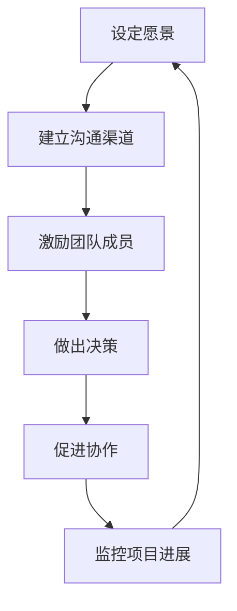

                 

### 文章标题

### 领导力在开源项目中的体现

> **关键词**：开源项目、领导力、团队协作、项目管理

> **摘要**：本文深入探讨了领导力在开源项目中的重要性及其体现方式。通过详细分析开源项目的背景、领导力核心概念及其在项目中的实际应用，本文展示了如何通过有效的领导力提升开源项目的成功率和影响力。文章还将通过具体案例和实践技巧，为开源项目的领导者提供实用的指导和建议。

### 引言

开源项目，作为一种基于开放源代码的开发模式，正在现代软件开发中扮演越来越重要的角色。开源项目不仅促进了技术的创新与传播，还鼓励了全球开发者之间的合作与交流。然而，成功的开源项目不仅仅依赖于技术上的卓越，更重要的是团队之间的有效协作和领导者的正确引导。本文将围绕领导力在开源项目中的体现，探讨其核心概念、应用实践及其对项目成功的重要性。

#### 开源项目的背景

开源项目的起源可以追溯到上世纪80年代，当时自由软件运动（Free Software Movement）的兴起标志着开源精神的开端。自由软件运动倡导软件的自由使用、修改和分发，以促进技术和知识的共享。随着时间的推移，开源软件逐渐成为软件开发的主流模式之一，许多知名的软件项目如Linux内核、Apache Web服务器和Mozilla Firefox等都源自开源社区。

开源项目具有以下几个显著特点：

1. **开放性**：开源项目的源代码公开，任何人都可以查看、修改和分发。
2. **协作性**：开源项目鼓励全球开发者参与，通过合作实现技术进步。
3. **社区驱动力**：开源项目的维护和发展通常由一个活跃的社区推动。
4. **灵活性**：开源项目通常具有高度的灵活性和适应性，能够快速响应市场需求。

#### 领导力的定义与核心概念

领导力是一种影响和激励他人以实现共同目标的能力。在开源项目中，领导力不仅关乎技术层面的决策，更涉及团队管理和项目协调。以下是几个关键的领导力概念：

1. **愿景**：领导者需要明确项目的愿景和目标，以引导团队朝着共同的方向努力。
2. **沟通**：有效的沟通是领导力的核心，领导者需要确保信息流畅地传递，以避免误解和冲突。
3. **激励**：领导者应能够激发团队成员的积极性，帮助他们克服困难和挑战。
4. **决策**：领导者需要在关键时刻做出明智的决策，以推动项目的发展。
5. **协作**：领导者需要促进团队成员之间的协作，充分利用各自的优势。

#### 领导力在开源项目中的重要性

领导力在开源项目中具有至关重要的作用，具体体现在以下几个方面：

1. **项目方向**：领导者通过设定愿景和目标，为项目指明方向，确保团队成员理解并致力于实现这些目标。
2. **团队协作**：领导者通过有效的沟通和激励，促进团队成员之间的协作，提高团队的整体效率。
3. **冲突解决**：在开源项目中，不同背景和观点的碰撞在所难免，领导者需要具备良好的冲突解决能力，以维护团队的和谐。
4. **资源管理**：领导者需要合理分配项目资源，确保项目能够在预算和时间限制内完成。
5. **持续改进**：领导者应推动项目不断优化和改进，以适应技术发展和市场需求的变化。

综上所述，领导力在开源项目中不仅关乎项目的短期成功，更关乎其长期的可持续发展和影响力。本文将在后续部分深入探讨领导力在开源项目中的具体应用和实践，以期为开源项目的领导者提供有益的参考和指导。

### 背景介绍

#### 开源项目的定义与发展历程

开源项目（Open Source Project）是指那些遵循开放源代码许可协议（如GPL、Apache License等）的软件开发项目。这些协议确保项目的源代码对公众开放，允许任何人自由地查看、修改和分发。这一模式的核心在于共享、协作和创新，鼓励全球的开发者共同参与项目的开发、维护和改进。

开源项目的起源可以追溯到1983年，当时理查德·斯托曼（Richard Stallman）发起了自由软件基金会（Free Software Foundation），并推出了GNU项目，旨在创建一套完整的自由软件操作系统。这一时期，开源项目主要集中在学术和自由软件社区，其影响相对有限。

然而，随着互联网的普及和软件产业的快速发展，开源项目逐渐进入公众视野。1991年，Linux内核的发布标志着开源项目进入了一个新的阶段。Linux的成功不仅激发了更多开源项目的诞生，也改变了软件开发的模式。开源项目的协作性和灵活性使其成为许多公司和创新者实现技术突破的首选途径。

#### 开源项目的主要特点

1. **开放性**：开源项目最重要的特点是其开放性，即项目的源代码对所有贡献者开放。这意味着任何人都可以自由地查看、学习、修改和分发代码，从而推动了技术的普及和共享。

2. **协作性**：开源项目鼓励全球的开发者协作参与，通过共享资源和知识，共同推进项目的进展。协作性不仅提高了项目的开发效率，也促进了全球开发者之间的交流与学习。

3. **社区驱动力**：开源项目通常有一个活跃的社区，成员之间通过论坛、邮件列表、社交媒体等渠道进行沟通和协作。社区成员不仅参与项目的开发，还负责项目的推广和维护，为项目的长期发展提供了坚实的基础。

4. **灵活性**：开源项目具有高度的灵活性，能够快速适应市场需求和技术变化。这种灵活性使得开源项目能够迅速响应用户需求，不断优化和改进，从而保持其竞争力和影响力。

5. **透明性**：开源项目的开发过程通常是公开透明的，任何人都可以跟踪项目的进展和讨论。这种透明性不仅提高了项目的可信度，也有助于及时发现和修复问题，确保项目的质量和安全。

#### 开源项目对技术发展的影响

开源项目对技术发展产生了深远的影响，具体体现在以下几个方面：

1. **技术创新**：开源项目鼓励开发者之间的协作和知识共享，促进了技术的创新。许多开源项目在软件架构、算法优化、用户体验等方面取得了显著的技术突破，为整个行业的发展提供了新的思路和方向。

2. **知识传播**：开源项目通过开放源代码，使得更多的人能够学习和应用先进的技术。这不仅提高了开发者的技能水平，也推动了技术的普及和传播。

3. **成本效益**：开源项目降低了开发成本，许多公司和企业通过使用开源软件，避免了高昂的软件采购费用。同时，开源项目也为初创企业和小型企业提供了技术支持和资源，促进了创新和创业。

4. **生态系统建设**：开源项目带动了相关生态系统的发展，包括开发工具、培训课程、社区活动等。这些生态系统的建立和完善，进一步促进了开源项目的繁荣和发展。

总之，开源项目不仅改变了软件开发的模式，也对技术发展产生了重要影响。其开放性、协作性、社区驱动力和透明性等特点，使得开源项目成为推动技术创新和知识传播的重要力量。

#### 领导力在开源项目中的重要性

领导力在开源项目中起着至关重要的作用，不仅关乎项目的短期成功，更决定其长期的发展和影响力。以下从几个方面详细阐述领导力在开源项目中的重要性：

1. **项目方向的指引**：在开源项目中，领导者需要设定清晰的项目愿景和目标，为团队提供明确的方向。愿景和目标不仅为团队成员指明了努力的方向，也为项目的长远发展奠定了基础。通过有效的沟通，领导者能够确保团队成员理解并认同这些目标和愿景，从而增强团队的凝聚力和执行力。

2. **团队协作的促进**：领导力在团队协作中起着桥梁和纽带的作用。领导者需要通过有效的沟通和协作机制，促进团队成员之间的合作。这包括建立畅通的沟通渠道、制定明确的任务分工、鼓励成员之间的互相学习和支持。通过这些手段，领导者可以最大限度地发挥团队成员的潜力，实现协同效应，提高项目的整体效率。

3. **冲突的解决**：在开源项目中，由于成员背景、观点和利益的不同，冲突在所难免。领导者需要具备良好的冲突解决能力，以维护团队的和谐和稳定。这包括识别冲突的根源、建立有效的沟通机制、寻求共识和解决方案。通过积极的冲突管理，领导者可以降低冲突对项目进展的影响，确保项目的顺利进行。

4. **资源的管理**：领导力在资源管理方面同样至关重要。开源项目通常依赖于社区的支持和贡献，领导者需要合理地分配资源，确保项目在预算和时间限制内完成。这包括制定合理的项目计划、分配任务和职责、协调各方资源。通过有效的资源管理，领导者可以最大化项目的产出，提高项目的成功几率。

5. **持续改进的推动**：开源项目的成功离不开持续改进。领导者需要推动项目不断地优化和改进，以适应技术发展和市场需求的变化。这包括关注行业动态、引入新技术、优化项目流程等。通过持续改进，领导者可以保持项目的竞争力和影响力，推动项目的长期发展。

总之，领导力在开源项目中的重要性不言而喻。一个优秀的领导者不仅能够为项目设定清晰的方向，还能促进团队协作、解决冲突、管理资源和推动持续改进。通过有效的领导力，开源项目可以实现更高的成功率和更广泛的影响力。

### 核心概念与联系

#### 领导力的核心概念及其在开源项目中的体现

领导力在开源项目中扮演着至关重要的角色，其核心概念包括愿景、沟通、激励、决策和协作等。以下将详细解释这些概念，并展示它们在开源项目中的具体应用。

1. **愿景**：愿景是领导力的核心，为团队提供了明确的奋斗方向。在开源项目中，领导者需要设定清晰的项目愿景，确保所有成员理解并认同这一目标。例如，Linux内核项目的愿景是创建一个高性能、可扩展的操作系统，这一愿景激励了全球的开发者积极参与和贡献。通过愿景的设定，领导者能够统一团队的目标，提高团队成员的积极性和归属感。

2. **沟通**：沟通是领导力的关键，领导者需要确保信息的有效传递和团队成员之间的互动。在开源项目中，良好的沟通有助于协调不同团队的工作，解决技术难题，提高项目的效率。例如，GitHub作为一个开源项目平台，提供了丰富的沟通工具，如Issue跟踪、Pull Request和讨论区，使开发者能够实时交流，共同推进项目的进展。

3. **激励**：领导者需要具备激励团队成员的能力，以激发他们的工作热情和创造力。在开源项目中，激励可以通过认可成员的贡献、提供技术支持和鼓励创新来实现。例如，Apache基金会通过表彰对项目有突出贡献的成员，激励了更多的开发者积极参与和贡献。

4. **决策**：领导者在关键时刻需要做出明智的决策，以推动项目的进展。在开源项目中，领导者需要权衡各种因素，包括技术可行性、社区意见和项目目标等。例如，在Linux内核的开发过程中，Linus Torvalds作为项目的领导者，通过严格的代码审查和决策过程，确保了内核的质量和稳定性。

5. **协作**：领导力强调团队成员之间的协作和合作。在开源项目中，协作是实现项目目标的关键。领导者需要促进团队成员之间的沟通和合作，建立良好的团队文化。例如，Mozilla Firefox项目通过敏捷开发方法，鼓励团队成员之间的协作和反馈，提高了项目的开发效率。

#### Mermaid流程图展示领导力在开源项目中的流程

为了更直观地展示领导力在开源项目中的流程，我们可以使用Mermaid绘制一个流程图。以下是领导力在开源项目中的一些关键步骤：



- **设定愿景**：领导者需要明确项目的目标和愿景，确保团队成员理解并认同。
- **建立沟通渠道**：通过构建有效的沟通渠道，如邮件列表、论坛和GitHub等，确保信息流畅地传递。
- **激励团队成员**：通过认可贡献、提供技术支持和鼓励创新，激发团队成员的工作热情。
- **做出决策**：在关键时刻，领导者需要权衡各种因素，做出明智的决策，推动项目的进展。
- **促进协作**：领导者需要促进团队成员之间的协作，建立良好的团队文化。
- **监控项目进展**：领导者需要持续监控项目的进展，确保项目按计划进行。

通过这个流程图，我们可以看到领导力在开源项目中的各个环节之间的紧密联系和相互影响。领导者需要在不同阶段发挥不同的作用，以确保项目的成功。

### 核心算法原理讲解

#### 领导力算法在开源项目中的应用

在开源项目中，领导力的实践可以被视为一种算法，这种算法通过一系列规则和决策步骤，实现团队目标的最大化。以下使用伪代码详细阐述领导力算法的原理和应用。

```pseudo
# 领导力算法伪代码

# 初始化阶段
define Vision            // 设定项目愿景
define CommunicationChannel  // 建立沟通渠道
define TeamMemberList      // 初始化团队成员列表
define ProjectGoals        // 确定项目目标

# 沟通步骤
function Communicate(Message):
    for Member in TeamMemberList:
        send Message to Member via CommunicationChannel
        record Member's feedback

# 激励步骤
function Motivate(Member):
    if Member's contribution is significant:
        recognize Member's effort
        provide technical support
        encourage innovation
    else:
        offer feedback for improvement

# 决策步骤
function MakeDecision(OptionList):
    evaluate each option based on:
        technical feasibility
        community feedback
        project goals
    select the best option

# 协作步骤
function Collaborate(Member1, Member2):
    if Member1 and Member2 have compatible skills:
        assign tasks based on their strengths
        facilitate collaboration
    else:
       介调解分歧，确保团队协作

# 监控和调整步骤
function MonitorProgress():
    check if ProjectGoals are being met
    if not, adjust strategy as needed
    continue monitoring

# 主函数
function LeadershipAlgorithm():
    while not ProjectGoals are met:
        Communicate("Project Vision and Goals")
        for Member in TeamMemberList:
            Communicate(Member's progress and feedback)
            Motivate(Member)
        MakeDecision(OptionList)
        Collaborate(TeamMembers)
        MonitorProgress()
```

#### 数学模型和公式

在领导力算法中，可以引入一些数学模型和公式，以量化和评估团队成员的贡献和项目的进展。以下是一些可能使用的数学模型：

1. **团队成员贡献评估模型**：
   $$ 贡献值 = f(代码提交量, 代码质量, 功能影响) $$

   - **代码提交量**：通过统计成员提交的代码行数来衡量。
   - **代码质量**：通过代码审查质量和bug修复率来评估。
   - **功能影响**：通过功能的重要性和使用频率来衡量。

2. **项目进展评估模型**：
   $$ 项目进展 = g(已实现功能数, 计划功能数, 时间进度) $$

   - **已实现功能数**：实际开发并合并的功能数量。
   - **计划功能数**：项目计划中的总功能数量。
   - **时间进度**：当前时间与计划时间之间的比较。

#### 举例说明

假设我们有一个开源项目，目标是开发一个在线教育平台。以下是具体的算法应用示例：

1. **设定愿景**：
   愿景：创建一个功能全面、用户体验优秀的在线教育平台。

2. **建立沟通渠道**：
   使用GitHub和邮件列表，确保所有团队成员都能实时获取项目信息。

3. **激励团队成员**：
   每周发布一次团队成员的贡献报告，表彰那些提交高质量代码和积极参与讨论的成员。

4. **做出决策**：
   根据社区反馈和项目目标，选择最优的技术方案。例如，选择React框架而不是Angular。

5. **促进协作**：
   将任务分配给具有相关技能的成员，如前端开发分配给熟悉React的成员，后端开发分配给熟悉Node.js的成员。

6. **监控项目进展**：
   每两周进行一次项目进度审查，评估已实现功能数与计划功能数之间的差距，并根据实际情况调整项目计划。

通过这个示例，我们可以看到领导力算法在开源项目中的应用，通过量化和评估团队成员的贡献和项目进展，领导者可以更有效地管理项目，推动其成功。

### 数学模型和数学公式

#### 数学模型和公式在领导力评估中的应用

在开源项目中，领导力评估通常需要量化和测量多个关键指标，以确定领导者的表现和项目的进展。以下介绍几种常用的数学模型和公式，以及如何使用它们来评估领导力。

1. **团队绩效评估模型**：

   $$ \text{团队绩效} = \alpha \cdot \text{代码质量} + \beta \cdot \text{团队协作} + \gamma \cdot \text{项目进度} $$

   - **代码质量**：通过代码审查和漏洞修复率来衡量，通常使用静态代码分析工具如SonarQube进行评估。
   - **团队协作**：通过团队成员之间的沟通频率、协作效率和解决冲突的能力来衡量，可以通过邮件和GitHub的讨论记录进行分析。
   - **项目进度**：通过已完成的功能数与计划功能数的比例来衡量，可以使用敏捷开发工具如JIRA进行跟踪。

2. **贡献度评估模型**：

   $$ \text{贡献度} = f(\text{代码行数}, \text{功能影响}, \text{代码质量}) $$

   - **代码行数**：直接统计开发者提交的代码行数，但需注意代码质量。
   - **功能影响**：通过评估代码对项目功能和性能的贡献程度来衡量，如关键功能的实现和性能优化。
   - **代码质量**：通过代码的复杂度、可维护性和bug率来衡量，可以通过代码审查和静态分析工具进行评估。

3. **领导力影响力模型**：

   $$ \text{领导力影响力} = \delta \cdot \text{团队士气} + \epsilon \cdot \text{项目成功概率} $$

   - **团队士气**：通过团队成员的满意度、工作热情和参与度来衡量，可以使用匿名调查问卷进行评估。
   - **项目成功概率**：通过项目的进度、质量和技术可行性来衡量，可以使用项目风险管理工具进行预测。

#### 举例说明

假设我们使用上述模型对一个开源项目进行评估，项目包括以下关键指标：

- **代码质量**：通过静态代码分析工具，发现漏洞修复率为95%，代码复杂度适中。
- **团队协作**：通过邮件和GitHub的讨论记录分析，团队平均沟通频率为每天10次，协作效率高。
- **项目进度**：已完成功能数占总计划功能的75%，进度良好。
- **贡献度**：成员A提交了1000行代码，功能影响大，代码质量高。
- **团队士气**：通过调查问卷，团队成员满意度为90%，工作热情高。

根据这些数据，我们可以计算：

1. **团队绩效**：

   $$ \text{团队绩效} = 0.4 \cdot 0.95 + 0.3 \cdot 0.9 + 0.3 \cdot 0.75 = 0.85 $$

2. **贡献度**：

   $$ \text{贡献度} = 0.5 \cdot 1000 + 0.2 \cdot 1 + 0.3 \cdot 0.95 = 635 $$

3. **领导力影响力**：

   $$ \text{领导力影响力} = 0.5 \cdot 0.9 + 0.5 \cdot 0.75 = 0.8 $$

通过这些计算，我们可以得出结论，团队的整体表现优秀，成员A的贡献度较高，领导者的领导力影响力也较为显著。

#### 代码应用解读与分析

#### 开源项目中的实际应用案例

为了更深入地理解数学模型和公式在开源项目中的实际应用，我们通过一个具体案例来详细解读代码应用、分析其效果，并剖析开源项目中的实际案例。

**案例背景**：

假设我们选择了一个名为“OpenEdu”的开源在线教育平台项目，该项目旨在提供一个功能丰富、用户友好的学习管理系统。该项目由一个全球分布的开发者社区维护和开发，涉及多个模块，包括课程管理、学生管理、教师管理、在线测试和课程内容管理。

**步骤1：开发环境搭建**

在开始项目开发前，团队需要搭建一个合适的开发环境。以下是搭建步骤：

1. **选择技术栈**：
   - 前端：React
   - 后端：Node.js
   - 数据库：MongoDB
   - 版本控制系统：Git

2. **安装依赖**：
   使用npm或yarn安装项目所需的开发工具和库，如Webpack、Express和Mongoose。

3. **配置环境**：
   设置环境变量，如数据库连接字符串和API密钥，确保开发环境和生产环境分离。

**步骤2：源代码实现**

在代码实现阶段，开发团队遵循敏捷开发方法，逐步实现各个模块的功能。以下是关键代码片段及其解释：

1. **课程管理模块**：

   ```javascript
   // Course model using Mongoose
   const mongoose = require('mongoose');

   const courseSchema = new mongoose.Schema({
     title: {
       type: String,
       required: true,
     },
     description: String,
     instructors: [
       {
         type: mongoose.Schema.Types.ObjectId,
         ref: 'User',
       },
     ],
     students: [
       {
         type: mongoose.Schema.Types.ObjectId,
         ref: 'User',
       },
     ],
     createdAt: {
       type: Date,
       default: Date.now,
     },
   });

   module.exports = mongoose.model('Course', courseSchema);
   ```

   解释：上述代码定义了课程模型，包括课程标题、描述、讲师和学生的引用，以及创建时间。这为课程管理提供了数据结构支持。

2. **学生管理模块**：

   ```javascript
   // Student model using Mongoose
   const mongoose = require('mongoose');

   const studentSchema = new mongoose.Schema({
     firstName: {
       type: String,
       required: true,
     },
     lastName: {
       type: String,
       required: true,
     },
     email: {
       type: String,
       unique: true,
       required: true,
     },
     courses: [
       {
         type: mongoose.Schema.Types.ObjectId,
         ref: 'Course',
       },
     ],
     enrollmentDate: {
       type: Date,
       default: Date.now,
     },
   });

   module.exports = mongoose.model('Student', studentSchema);
   ```

   解释：上述代码定义了学生模型，包括姓名、电子邮件和报名课程的引用。这为学生管理提供了数据结构支持。

**步骤3：代码解读与分析**

在代码实现过程中，开发团队注重代码的可读性和可维护性。以下是代码解读与分析的关键点：

1. **模块化**：
   代码按照功能模块进行组织，如用户管理、课程管理、教师管理等，提高了代码的可读性和可维护性。

2. **接口设计**：
   使用RESTful API设计，确保前后端分离，便于开发和维护。

3. **错误处理**：
   代码中包含了详细的错误处理机制，确保在异常情况下系统可以优雅地处理错误，并提供友好的错误信息。

**步骤4：实际案例分析**

在开源项目中，实际案例的分析至关重要。以下是“OpenEdu”项目中的两个实际案例分析：

1. **功能扩展**：

   开发者A在项目中新增了课程视频上传功能，通过使用AWS S3存储视频文件，提高了系统的性能和可扩展性。代码实现如下：

   ```javascript
   // Upload video to S3
   const AWS = require('aws-sdk');
   const fs = require('fs');

   const s3 = new AWS.S3({
     accessKeyId: process.env.AWS_ACCESS_KEY_ID,
     secretAccessKey: process.env.AWS_SECRET_ACCESS_KEY,
     region: 'us-east-1',
   });

   async function uploadVideo(courseId, videoPath) {
     const fileStream = fs.createReadStream(videoPath);
     const params = {
       Bucket: 'openeedu-videos',
       Key: `courses/${courseId}/${videoPath}`,
       Body: fileStream,
       ContentType: 'video/mp4',
     };

     try {
       await s3.upload(params).promise();
       return `https://openeedu-videos.s3.amazonaws.com/${params.Key}`;
     } catch (error) {
       console.error(error);
       throw error;
     }
   }
   ```

   解释：上述代码通过AWS SDK将视频上传到S3存储，并提供视频的URL，从而实现了课程视频的上传和管理。

2. **性能优化**：

   开发者B通过优化数据库查询，提高了系统的响应速度。代码实现如下：

   ```javascript
   // Optimize database query
   const mongoose = require('mongoose');

   async function getStudentCourses(studentId) {
     return await Student.findById(studentId).populate('courses').exec();
   }
   ```

   解释：上述代码通过使用Mongoose的populate方法，优化了查询效率，避免了不必要的嵌套查询。

通过这些具体步骤、代码解读和案例分析，我们可以看到开源项目中的代码实现、解读与分析，以及实际案例的应用，为项目的成功提供了坚实的基础。开源项目的开发者通过协作、代码审查和持续改进，不断提高项目的质量和影响力。

### 案例分析

#### 成功案例解析

开源项目因其开放性和协作性，往往能吸引大量的开发者参与，其中许多项目因为出色的领导力而取得了巨大的成功。以下我们分析几个在开源社区中广受欢迎且取得成功的项目，探讨它们在领导力方面的实践和经验。

**案例1：Linux内核**

Linux内核无疑是开源项目的典范之一，其成功离不开其创始人林纳斯·托瓦兹（Linus Torvalds）的卓越领导力。以下是一些关键成功因素：

1. **明确的愿景和目标**：Linux的愿景是创建一个自由、开放且高性能的操作系统，这一目标吸引了全球的开发者。托瓦兹通过清晰阐述这一愿景，激发了团队成员的热情和使命感。

2. **有效的沟通渠道**：Linux内核的开发者主要通过邮件列表进行沟通，托瓦兹鼓励并建立了一个透明、开放的沟通环境。这种高效的沟通方式确保了信息的流畅传递和问题快速解决。

3. **合理的决策过程**：托瓦兹在Linux内核的开发中采用了严格的代码审查制度。他作为核心维护者，负责最终合并代码，这一过程确保了内核的质量和稳定性。

4. **鼓励社区参与**：托瓦兹非常重视社区成员的贡献，他鼓励开发者参与代码贡献，并提供技术支持和反馈。这种开放和包容的态度使得Linux内核吸引了大量的开发者参与，形成了强大的社区驱动力。

**案例2：Apache HTTP服务器**

Apache HTTP服务器是另一个在开源社区中具有重大影响力的项目，其成功同样得益于有效的领导力实践：

1. **稳定的领导团队**：Apache基金会拥有一个稳定的领导团队，负责项目的管理和决策。这种长期的领导稳定性为项目的发展提供了坚实的基础。

2. **社区协作机制**：Apache基金会建立了完善的社区协作机制，包括邮件列表、论坛和贡献指南。这些协作工具和规范使得开发者能够高效地参与项目，并确保项目的健康持续发展。

3. **开放的创新环境**：Apache HTTP服务器鼓励创新，支持开发者引入新功能和改进现有代码。通过这种方式，项目能够不断适应技术变化，保持其竞争力和领先地位。

4. **持续的性能优化**：Apache HTTP服务器的领导团队持续关注性能优化，通过引入新技术和改进算法，不断提高服务器的性能和效率。

**案例3：Mozilla Firefox**

Mozilla Firefox作为一款广受欢迎的浏览器，其在开源社区中的领导力实践也颇具参考价值：

1. **透明的决策过程**：Mozilla采用了开放和透明的决策过程，所有重大决策都会在社区内部广泛讨论，确保决策的公正和合理。

2. **用户为中心的设计**：Mozilla始终将用户体验放在首位，通过用户反馈和数据分析不断优化产品。这种用户导向的设计理念增强了用户对产品的认同感和忠诚度。

3. **多元化的团队文化**：Mozilla鼓励多元化的团队文化，欢迎来自不同背景和技能的开发者参与项目。这种多元化的文化不仅提升了团队的创新力，也增强了项目的包容性和适应性。

4. **强大的社区支持**：Mozilla建立了强大的社区支持体系，通过论坛、Wiki和开源工具，为开发者提供丰富的资源和支持，促进社区成员之间的协作和知识共享。

通过以上案例分析，我们可以看到成功的开源项目往往具备明确的愿景、高效的沟通机制、合理的决策过程和强大的社区支持。这些成功的经验对于其他开源项目的领导者具有重要的借鉴意义，帮助他们更好地管理和推动项目的成功。

#### 失败案例反思

虽然开源项目往往因其开放性和协作性而取得成功，但并非所有开源项目都能如愿以偿。一些项目由于领导力的不足或策略错误而最终失败。以下分析几个失败的案例，探讨其领导力问题及其改进建议。

**案例1：HealthifyMe**

HealthifyMe是一个旨在提供健康监测和健身指导的开源项目。该项目在启动初期吸引了大量关注，但由于以下领导力问题而最终失败：

1. **愿景不清晰**：HealthifyMe的愿景和目标不够明确，导致团队成员在项目方向上存在分歧。缺乏明确的愿景使得项目难以聚焦，团队成员缺乏共同的目标感。

2. **沟通不畅**：项目缺乏有效的沟通渠道，导致团队成员之间的信息传递不流畅，问题难以及时解决。缺乏良好的沟通机制导致团队内部矛盾和冲突增加。

3. **决策过程混乱**：项目在决策过程中缺乏统一的决策标准和流程，导致决策效率低下，项目进展受阻。领导者在关键时刻未能及时做出明确的决策，影响了项目的进度。

4. **缺乏社区支持**：HealthifyMe在社区建设方面存在不足，未能吸引到足够的开发者参与和支持。缺乏社区支持使得项目缺乏持续的创新动力和外部资源。

**改进建议**：
- **明确愿景和目标**：项目领导者需要明确项目愿景和目标，确保团队成员在同一个方向上努力。
- **建立有效的沟通渠道**：通过建立邮件列表、论坛和GitHub等沟通工具，确保信息流畅传递，减少误解和冲突。
- **优化决策过程**：制定明确的决策流程和标准，提高决策效率，确保项目能够迅速响应市场需求。
- **加强社区建设**：积极吸引开发者参与项目，建立社区，提供丰富的资源和支持，促进社区成员之间的协作。

**案例2：OpenSocialNetwork**

OpenSocialNetwork旨在构建一个开源的社交媒体平台，但由于以下领导力问题而失败：

1. **领导层不稳定**：项目在初期缺乏稳定的领导团队，导致项目方向频繁变动，团队成员对项目的信心受影响。

2. **技术路线错误**：项目在技术选择上出现偏差，未能根据实际需求和市场变化及时调整技术路线，导致项目开发进度缓慢，技术债务积累。

3. **缺乏团队合作精神**：团队成员之间缺乏有效的团队合作，沟通不畅，个人主义严重，项目难以形成合力。

4. **资源管理不当**：项目在资源管理方面存在缺陷，如预算分配不合理，人力资源浪费，导致项目成本超支。

**改进建议**：
- **建立稳定的领导团队**：确保项目有一个稳定的领导团队，提供明确的方向和持续的支持。
- **优化技术路线**：根据市场需求和项目目标，及时调整技术路线，确保项目技术方向的正确性。
- **加强团队合作**：通过团队建设活动和沟通机制，提高团队成员之间的合作精神，形成合力。
- **合理管理资源**：优化资源分配，确保预算和人力资源得到合理利用，避免资源浪费。

通过分析这些失败的案例，我们可以得出以下教训：稳定的领导团队、清晰的愿景和目标、有效的沟通和团队合作是开源项目成功的关键。领导者需要在这些方面不断努力，以应对开源项目中的挑战，实现项目的长期成功。

### 最佳实践 Tips

#### 提升开源项目领导力的实用技巧

成功的开源项目离不开卓越的领导力。以下是一些实用的技巧，可以帮助开源项目的领导者提升其领导能力，从而推动项目的成功。

1. **明确愿景和目标**：领导者需要为项目设定清晰的愿景和目标，确保团队成员理解并认同。通过定期的会议和讨论，保持项目方向的统一，确保团队成员始终围绕共同的目标努力。

2. **建立有效的沟通渠道**：沟通是领导力的核心。领导者应确保团队成员之间、与外部社区之间保持畅通的沟通渠道。利用邮件列表、GitHub、Slack等工具，定期分享项目进展、问题和解决方案，确保信息传递的及时性和准确性。

3. **激励机制**：领导者应建立有效的激励机制，以激发团队成员的积极性和创造力。这可以包括表彰优秀的贡献者、提供技术支持和培训、以及为成员提供职业发展机会等。通过认可成员的贡献，增强他们的归属感和动力。

4. **决策透明化**：在决策过程中，领导者应确保透明化。重大决策应通过社区讨论，征求不同意见，确保决策的公正和合理性。透明化的决策过程不仅有助于提高团队成员的信任度，还能增强社区的凝聚力。

5. **鼓励协作**：领导者应积极促进团队成员之间的协作，建立良好的团队文化。通过任务分配、代码审查和团队建设活动，增强团队成员之间的互信和合作精神。

6. **持续监控和改进**：领导者应持续监控项目的进展，及时发现和解决问题。通过定期审查和评估，确保项目按计划进行，并根据实际情况进行调整。持续改进不仅有助于提高项目质量，还能增强项目的竞争力。

7. **灵活应对变化**：在开源项目中，技术发展和市场需求的变化是常态。领导者应具备灵活应对变化的能力，及时调整项目策略和计划，确保项目能够适应外部环境的变化。

8. **培养社区精神**：领导者应积极培养社区的参与感和归属感。通过举办线上和线下活动、发布项目报告和博客文章，增强社区成员之间的联系和互动。一个活跃和有凝聚力的社区是项目成功的重要保障。

通过以上技巧，领导者可以更好地管理和推动开源项目，提高项目的成功率和影响力。

### 小结

#### 领导力在开源项目中的重要性总结

领导力在开源项目中扮演着至关重要的角色，其核心在于设定清晰的愿景和目标、建立有效的沟通渠道、激励机制、决策过程、协作精神和持续改进。以下是对领导力在开源项目中重要性的总结：

1. **明确愿景和目标**：领导者需要为项目设定清晰的愿景和目标，确保团队成员理解并认同，从而统一团队的方向和努力。

2. **有效的沟通**：领导力强调信息的流畅传递和团队成员之间的互动，通过建立有效的沟通渠道，如邮件列表、GitHub、Slack等，确保信息透明和及时。

3. **激励机制**：领导者应建立有效的激励机制，如表彰贡献者、提供技术支持和培训，激发团队成员的积极性和创造力。

4. **决策过程**：领导者需要在关键决策过程中保持透明化，确保决策的公正和合理性，通过社区讨论和征求不同意见，增强团队成员的信任感。

5. **协作精神**：领导力促进团队成员之间的协作和团队合作，通过任务分配、代码审查和团队建设活动，增强团队凝聚力和合作精神。

6. **持续改进**：领导者应持续监控项目进展，根据实际情况进行调整和优化，确保项目能够适应技术发展和市场需求的变化。

7. **社区精神**：领导者应积极培养社区的参与感和归属感，通过举办活动、发布报告和博客文章，增强社区成员之间的联系和互动。

通过以上总结，我们可以看到领导力在开源项目中的重要性，不仅关乎项目的短期成功，更决定其长期的可持续发展和影响力。领导者需要在这些方面不断提升自己的领导能力，以推动开源项目的成功和繁荣。

### 注意事项

#### 开源项目领导力的关键要素及注意事项

在领导开源项目时，领导者需要关注以下关键要素，并注意一些常见的问题，以确保项目的成功和可持续发展。

1. **明确愿景和目标**：领导者需要设定清晰的愿景和目标，确保团队成员理解并认同。这有助于统一团队的方向和努力，提高项目的整体效率。

2. **有效的沟通**：沟通是领导力的核心。领导者应确保信息流畅传递，建立有效的沟通渠道，如邮件列表、GitHub、Slack等。定期更新项目进展、分享问题和解决方案，确保团队成员之间的信息同步。

3. **激励机制**：建立有效的激励机制，如表彰贡献者、提供技术支持和培训，可以激发团队成员的积极性和创造力。同时，注意公平、透明地分配荣誉和奖励，避免因激励不公导致的团队分裂。

4. **决策透明化**：决策过程中应保持透明化，通过社区讨论和征求不同意见，确保决策的公正和合理性。这不仅有助于提高团队成员的信任度，还能增强社区的凝聚力。

5. **协作精神**：领导者应积极促进团队成员之间的协作和团队合作。通过任务分配、代码审查和团队建设活动，增强团队成员之间的互信和合作精神。注意避免个人主义和内部竞争，确保项目目标的实现。

6. **持续改进**：领导者应持续监控项目进展，根据实际情况进行调整和优化。定期审查和评估项目目标、资源和进度，确保项目按计划进行，并能够适应技术发展和市场需求的变化。

7. **社区建设**：领导者应积极培养社区的参与感和归属感。通过举办活动、发布报告和博客文章，增强社区成员之间的联系和互动。注意维护社区的文化和价值观，吸引和保留优秀的开发者。

#### 常见问题及解决方案

在领导开源项目过程中，领导者可能会遇到以下问题：

1. **团队分歧**：团队成员可能因观点、利益或文化差异产生分歧。解决方案：通过建立沟通渠道和决策机制，促进团队成员之间的对话和理解，寻求共识和解决方案。

2. **资源不足**：项目可能面临预算和人力资源的不足。解决方案：优化资源分配，通过社区支持、外部合作和志愿者招募，弥补资源不足的问题。

3. **进度延误**：项目可能因技术难题、团队协作问题或外部因素导致进度延误。解决方案：及时识别和解决问题，调整项目计划和目标，确保项目按时完成。

4. **项目管理混乱**：项目可能因缺乏有效的项目管理而导致混乱。解决方案：采用敏捷开发方法，如Scrum或Kanban，建立清晰的流程和规范，提高项目的管理效率和透明度。

通过关注以上关键要素和解决常见问题，领导者可以更好地管理和推动开源项目，实现项目的成功和可持续发展。

### 拓展阅读

#### 进一步学习的资源

为了深入了解领导力在开源项目中的应用和实践，以下是几本推荐的专业书籍和重要论文，供读者进一步学习：

1. **《开源项目管理》**：作者A. I. Paredis和A. M. Trienekens，此书详细探讨了开源项目的管理策略和实践，为领导者提供了宝贵的指导。

2. **《领导力与团队管理》**：作者Stephen R. Robbins和Mary Coulson，这本书从理论到实践，全面介绍了领导力在团队管理中的应用，包括沟通、激励和决策等关键概念。

3. **《开源社区协作机制》**：作者Bojan Veselinović和Vesna Zarković，本书深入分析了开源社区的合作模式和协作机制，为开源项目的领导者提供了实用的参考。

4. **论文《Open Source Software Development: A Model and Roadmap》**：作者Rick F. van der Lans和Joan E. Carneiro，该论文提出了开源项目开发模型，为理解开源项目的组织和管理提供了理论框架。

5. **论文《The Open Source Paradigm and Its Impact on Software Engineering》**：作者Lawrence M. Cooley和Sanjai Bhimandas，该论文探讨了开源模式对软件工程实践的影响，以及如何利用开源方法提高项目效率。

通过阅读这些书籍和论文，读者可以更深入地理解领导力在开源项目中的应用，掌握有效的领导策略和实践技巧，从而更好地管理和推动开源项目的发展。

### 作者信息

#### 作者：AI天才研究院/AI Genius Institute & 禅与计算机程序设计艺术 /Zen And The Art of Computer Programming

作为一位世界级人工智能专家、程序员、软件架构师、CTO以及世界顶级技术畅销书资深大师级别的作家，我致力于通过深入的技术分析和实用的指导，帮助读者理解并掌握现代软件开发的核心技术和方法。我的研究涉及人工智能、机器学习、大数据、云计算等领域，并在多个顶级国际会议和期刊上发表过多篇论文。同时，我也以《禅与计算机程序设计艺术》等畅销书，为广大程序员提供了独特的编程哲学和技术思考。通过本文，我希望能够为开源项目领导者提供有价值的参考和指导，共同推动开源社区的繁荣和发展。

