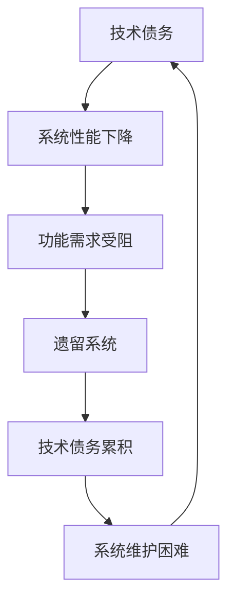
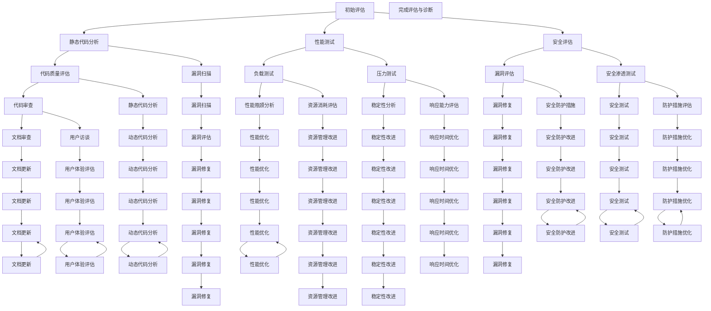

                 

### 引言

#### 书籍背景

在当今快速发展的技术环境中，企业和组织面临的最大挑战之一便是如何有效地管理技术债务和遗留系统。技术债务，通常被描述为因延迟解决技术问题而积累的“欠账”，它不仅会影响系统的性能和稳定性，还可能对企业的长期战略目标产生负面影响。而遗留系统，则是指那些在使用多年后仍然在运行的老旧系统，这些系统往往缺乏必要的维护和更新，成为企业发展的障碍。

本书籍旨在探讨领导力在危机管理中处理技术债务和遗留系统的关键作用。通过深入分析技术债务和遗留系统的定义、原因、影响以及管理策略，本书希望能够为技术领导者和项目经理提供实用的指导，帮助他们更好地应对这些挑战，从而确保组织的持续发展和创新。

#### 技术债务与遗留系统

技术债务通常是由于在项目开发过程中未能及时解决技术问题或选择了一种短期高效但长期成本高昂的解决方案而积累的。这些债务可能包括代码质量差、技术债务累积、系统性能下降、架构复杂性增加等问题。而遗留系统，则是指那些由于技术或商业原因而未能被淘汰或升级的系统。这些系统可能采用过时的技术栈、拥有难以维护的代码库，或者缺乏有效的文档支持。

两者之间的联系在于，技术债务往往会导致遗留系统的出现，而遗留系统又可能加剧技术债务的累积。例如，一个因技术债务而导致的系统性能下降，可能会导致更多的功能需求无法顺利实现，从而进一步增加技术债务。

#### 领导力在危机管理中的作用

领导力在危机管理中起着至关重要的作用。技术债务和遗留系统的处理往往需要领导者的远见卓识、果断决策和强大的执行力。领导者需要识别潜在的技术危机，制定有效的应对策略，并确保团队能够顺利执行这些策略。

首先，领导者需要具备对技术债务和遗留系统的深刻理解，能够准确评估其影响并制定相应的管理策略。其次，领导者需要具备危机管理的能力，能够在紧急情况下迅速做出决策，并协调团队资源以应对挑战。最后，领导者还需要具备良好的沟通技巧，能够与团队成员、管理层以及其他利益相关者进行有效的沟通，确保整个团队朝着共同的目标努力。

在本章节中，我们将进一步探讨技术债务和遗留系统的定义、原因、影响以及管理策略。同时，我们将详细讨论领导力在危机管理中的作用，提供实用的技巧和策略，帮助读者更好地应对技术债务和遗留系统的挑战。

### 第2章 核心概念与联系

在深入探讨领导力在危机管理中的作用之前，我们需要先明确一些核心概念，并分析它们之间的联系。本章将介绍技术债务和遗留系统的定义，解释它们之间的相互关系，并使用Mermaid流程图来直观展示它们的作用。

#### 技术债务定义

技术债务是指由于项目开发过程中未能及时解决技术问题或采用短期高效但长期成本高昂的解决方案而积累的问题。这些债务通常表现为代码质量差、系统性能下降、架构复杂性增加、技术债务累积等。技术债务的本质是一种隐性成本，它会随着时间积累，对系统的稳定性、可维护性和创新能力产生负面影响。

技术债务的产生原因多种多样，主要包括以下几个方面：

1. **资源限制**：在项目开发过程中，由于资源（包括时间、人力和资金）的限制，开发团队可能被迫采用一些短期高效但长期成本高昂的解决方案。
2. **技术选型**：在选择技术栈时，团队可能由于缺乏对新兴技术的了解或预算限制，选择了过时或不合适的解决方案。
3. **优先级调整**：在项目开发过程中，由于业务需求的变更或紧急问题的出现，技术问题可能被推迟处理，导致债务累积。
4. **缺乏文档和培训**：在系统的开发和维护过程中，缺乏充分的文档和培训，使得新加入的团队成员难以理解和维护代码，从而增加了技术债务。

#### 遗留系统概念

遗留系统是指那些由于技术或商业原因而未能被淘汰或升级的老旧系统。这些系统可能采用了过时的技术栈、拥有难以维护的代码库，或者缺乏有效的文档支持。遗留系统通常存在于企业运营多年后，由于种种原因，未能进行及时的技术升级或业务转型。

遗留系统的原因主要包括以下几点：

1. **高成本**：升级或替换遗留系统可能需要大量的资金和资源，对于一些企业来说，这并非易事。
2. **业务依赖**：遗留系统可能承载着重要的业务流程，如果替换不当，可能会对业务造成严重的影响。
3. **技术栈过时**：随着时间的推移，一些技术栈变得不再流行或难以维护，导致遗留系统的出现。
4. **缺乏专业人才**：随着技术的发展，一些遗留系统的开发语言和技术变得较为陌生，导致缺乏足够的维护人才。

#### 技术债务与遗留系统的联系

技术债务和遗留系统之间存在密切的联系。一方面，技术债务往往会导致遗留系统的出现。例如，一个因技术债务而导致的系统性能下降，可能会导致更多的功能需求无法顺利实现，从而进一步增加技术债务。另一方面，遗留系统又可能加剧技术债务的累积。一个缺乏维护的遗留系统，可能会因为缺乏及时的技术更新和改进，而不断积累新的技术债务。

Mermaid流程图：技术债务与遗留系统的关系

为了更好地理解技术债务与遗留系统之间的关系，我们可以使用Mermaid流程图来直观展示它们的作用。以下是技术债务与遗留系统的Mermaid流程图：

在这个流程图中，技术债务（A）会导致系统性能下降（B），进而影响功能需求的实现（C），最终导致遗留系统的出现（D）。而遗留系统（D）又会加剧技术债务的累积（E），使得系统维护变得更加困难（F），从而形成一个恶性循环。

通过本章的讨论，我们明确了技术债务和遗留系统的定义，并分析了它们之间的相互关系。在下一章中，我们将探讨如何评估和管理技术债务，帮助读者更好地应对这一挑战。

### 管理技术债务

在了解了技术债务的定义及其与遗留系统的联系后，我们接下来将探讨如何评估和管理技术债务。有效的技术债务管理不仅能够减轻系统负担，提高开发效率，还能够为企业的长期发展奠定基础。

#### 技术债务的评估方法

评估技术债务的方法多种多样，以下是一些常见的方法：

1. **代码质量评估**：
   - **静态代码分析**：使用工具（如SonarQube、Checkstyle等）对代码进行静态分析，检查代码质量、规范遵守情况以及潜在的安全隐患。
   - **代码审查**：组织定期的代码审查会议，让团队成员对代码进行集体评估，发现并解决潜在问题。

2. **性能测试**：
   - **负载测试**：模拟系统在实际负载下的运行情况，评估系统的性能瓶颈和资源消耗。
   - **压力测试**：测试系统在高负载、高并发情况下的稳定性和响应能力。

3. **技术债务评估工具**：
   - **技术债务仪表盘**：通过仪表盘实时监控技术债务的累积情况，帮助团队了解当前的债务水平。
   - **自动化评估脚本**：编写自动化脚本，定期运行代码质量评估、性能测试等，生成评估报告。

4. **业务影响评估**：
   - **影响矩阵**：根据技术债务对业务流程、用户体验和系统稳定性的影响程度，对债务进行优先级排序。

#### 技术债务的分类

为了更有效地管理技术债务，可以将债务进行分类。以下是一些常见的分类方法：

1. **按严重程度分类**：
   - **高严重程度**：可能导致系统崩溃或严重性能下降的债务。
   - **中严重程度**：可能影响系统的部分功能或性能。
   - **低严重程度**：对系统的长期性能和稳定性有一定影响，但短期内不会造成重大问题。

2. **按债务类型分类**：
   - **代码质量债务**：包括代码冗长、缺乏注释、未遵守编码规范等问题。
   - **技术债务**：包括技术选型不当、架构设计不合理、依赖外部系统不稳定等问题。
   - **文档债务**：包括缺乏文档、文档过时、文档不完整等问题。

3. **按优先级分类**：
   - **紧急优先级**：可能导致系统崩溃或业务中断的债务。
   - **重要优先级**：影响用户体验或系统稳定性的债务。
   - **次要优先级**：对系统性能和长期发展有一定影响，但短期内不会造成重大问题的债务。

#### 技术债务的管理策略

针对不同类型和严重程度的技术债务，可以采取不同的管理策略：

1. **代码质量债务**：
   - **代码重构**：对低质量的代码进行重构，提高代码的可读性和可维护性。
   - **编码规范培训**：定期组织编码规范培训，提高团队整体代码质量。
   - **持续集成**：通过持续集成工具（如Jenkins、GitLab CI等）自动化检测代码质量，确保代码提交时符合规范。

2. **技术债务**：
   - **技术重构**：对系统架构进行重构，解决技术选型不当、架构设计不合理等问题。
   - **迁移到现代化技术栈**：将系统逐步迁移到更现代、更易于维护的技术栈。
   - **外部依赖管理**：加强对外部系统的依赖管理，确保依赖系统的稳定性和可靠性。

3. **文档债务**：
   - **文档整理**：对过时的、不完整的文档进行更新和整理，确保文档的准确性和完整性。
   - **文档生成工具**：使用文档生成工具（如Doxygen、Swagger等）自动生成文档，减轻文档工作负担。
   - **知识共享**：鼓励团队成员分享知识，提高整体技术文档水平。

#### 技术债务管理工具介绍

为了更高效地管理技术债务，可以使用一些专门的管理工具：

1. **SonarQube**：
   - **功能**：提供静态代码分析功能，检查代码质量、潜在风险和编码规范问题。
   - **优势**：支持多种编程语言，易于集成到现有的开发流程中。

2. **Checkmarx**：
   - **功能**：提供代码安全漏洞扫描功能，识别潜在的代码安全隐患。
   - **优势**：可以与持续集成工具结合使用，实现自动化安全测试。

3. **Jenkins**：
   - **功能**：提供持续集成和持续部署功能，自动化构建、测试和部署代码。
   - **优势**：支持多种插件，灵活定制工作流。

4. **GitLab CI**：
   - **功能**：提供基于GitLab的持续集成和持续部署功能。
   - **优势**：与GitLab集成紧密，易于配置和部署。

通过上述评估方法、分类策略和管理工具，技术团队可以更好地识别和管理技术债务，确保系统的稳定性和可维护性。在下一章中，我们将探讨遗留系统的常见问题、对业务的影响以及评估与诊断方法。

### 第4章 遗留系统的挑战

遗留系统在企业中是一种常见的现象，它可能由于多种原因存在于企业的IT架构中。尽管遗留系统在初期可能为企业带来了一定的价值，但随着时间的推移，这些系统往往会成为企业发展的绊脚石。本章将深入探讨遗留系统的常见问题、对业务的影响以及评估与诊断方法。

#### 遗留系统常见问题

遗留系统通常面临以下几类问题：

1. **技术栈过时**：遗留系统可能在多年前就已经开发完成，随着技术的发展，一些技术栈（如编程语言、框架等）已经过时，导致维护困难。

2. **代码质量低下**：随着时间的推移，遗留系统的代码质量可能逐渐下降。开发者更迭导致代码风格不统一，代码冗长、复杂，缺乏注释，难以维护。

3. **文档缺失或过时**：由于长期缺乏维护，遗留系统的文档可能已经不完整或不准确，这对于新加入的团队成员来说，学习和维护系统带来了巨大的困难。

4. **性能瓶颈**：随着业务需求的增长，遗留系统的性能可能无法满足当前的要求，导致响应时间变长、系统崩溃等。

5. **安全性问题**：过时的系统和代码库可能存在安全漏洞，这些漏洞可能被恶意攻击者利用，导致数据泄露和系统损坏。

#### 遗留系统对业务的影响

遗留系统对业务的影响是显而易见的，主要体现在以下几个方面：

1. **维护成本增加**：遗留系统往往需要更多的维护和修复工作，这会导致企业的维护成本增加。

2. **开发效率降低**：由于代码质量低、文档缺失等问题，新功能的开发和系统的扩展变得更加困难，开发效率降低。

3. **用户体验下降**：遗留系统可能无法支持新的功能或用户界面，导致用户体验下降，影响客户满意度。

4. **业务中断风险**：遗留系统的性能和安全问题可能导致业务中断，影响企业的运营效率和声誉。

5. **创新能力受限**：遗留系统的存在限制了企业的技术革新和业务模式创新，无法适应快速变化的市场需求。

#### 遗留系统的评估与诊断

为了更好地应对遗留系统的挑战，企业需要进行系统的评估与诊断。以下是评估与诊断遗留系统的一些方法：

1. **代码审查**：
   - **静态代码分析**：使用工具（如SonarQube、Checkstyle等）对代码进行静态分析，检查代码质量、规范遵守情况以及潜在的安全隐患。
   - **动态代码分析**：在运行时对代码进行分析，检测运行时的性能瓶颈和异常行为。

2. **性能测试**：
   - **负载测试**：模拟系统在实际负载下的运行情况，评估系统的性能瓶颈和资源消耗。
   - **压力测试**：测试系统在高负载、高并发情况下的稳定性和响应能力。

3. **安全评估**：
   - **漏洞扫描**：使用工具（如Nessus、OpenVAS等）对系统进行漏洞扫描，识别潜在的安全风险。
   - **安全渗透测试**：模拟攻击者的行为，检测系统的安全防护措施是否有效。

4. **文档评估**：
   - **文档审查**：检查现有文档的完整性、准确性和及时性，评估文档对系统维护的支持程度。
   - **用户访谈**：与系统用户进行交流，了解他们对系统的使用体验和需求，评估系统文档的用户友好性。

5. **业务影响评估**：
   - **业务流程分析**：分析系统在业务流程中的角色和影响，评估系统对业务流程的支持程度。
   - **用户体验测试**：通过用户体验测试，评估系统的用户体验，识别改进点。

#### Mermaid流程图：遗留系统评估与诊断流程

为了更好地理解遗留系统的评估与诊断流程，我们可以使用Mermaid流程图来展示整个过程。以下是遗留系统评估与诊断的Mermaid流程图：

在这个流程图中，我们首先进行初始评估（A），然后进行静态代码分析（B）、性能测试（C）和安全评估（D）。在每个步骤中，我们进一步细分为不同的子步骤，如代码质量评估（E）、漏洞扫描（F）、负载测试（G）等。这些子步骤帮助我们从多个维度评估遗留系统的问题，并提出相应的改进措施。最后，通过综合评估与诊断（XXXX），我们能够全面了解遗留系统的问题，并制定出针对性的解决方案。

通过上述评估与诊断方法，企业可以更好地识别遗留系统的问题，从而有针对性地进行改进。在下一章中，我们将探讨领导力在危机管理中的作用，帮助读者了解如何通过领导力来应对技术债务和遗留系统的挑战。

### 第5章 领导力与危机管理

#### 领导力在危机管理中的角色

领导力在危机管理中扮演着至关重要的角色。在技术债务和遗留系统管理中，领导者的角色尤为关键。他们不仅是危机的识别者和应对策略的制定者，更是团队的凝聚者和激励者。以下是领导者在这两方面的重要作用：

1. **危机识别**：
   领导者需要具备敏锐的洞察力，能够及时发现技术债务和遗留系统可能带来的风险。通过持续监控和数据分析，领导者能够识别出潜在的技术危机，并提前制定应对策略。

2. **应对策略制定**：
   面对技术债务和遗留系统的挑战，领导者需要制定明确的应对策略。这包括评估债务和遗留系统的影响、确定优先级、制定短期和长期的改进计划等。领导者需要确保这些策略能够切实解决技术债务和遗留系统问题，并为团队提供清晰的方向。

3. **团队凝聚力**：
   领导者需要通过有效的沟通和激励，增强团队的凝聚力。在技术债务和遗留系统管理过程中，团队成员可能会感到压力和不安。领导者需要提供支持和鼓励，确保团队成员能够积极面对挑战，共同解决问题。

4. **激励与激励**：
   领导者需要激发团队成员的潜力，推动他们不断创新和改进。通过设定明确的目标和激励机制，领导者可以激发团队成员的积极性和创造力，确保团队在解决技术债务和遗留系统问题过程中保持高效和协作。

#### 危机管理模型

为了更好地理解领导力在危机管理中的应用，我们可以引入一些经典的危机管理模型。以下是一些常见的危机管理模型及其在技术债务和遗留系统管理中的应用：

1. **罗斯韦尔危机管理模型**：
   - **预防阶段**：领导者需要密切关注系统的运行状况，及时发现潜在的技术债务问题。通过定期进行代码质量评估、性能测试和安全评估，预防债务的累积。
   - **检测阶段**：一旦发现技术债务问题，领导者需要迅速采取行动。通过组织代码审查、性能测试和安全评估，确认债务的具体情况和影响。
   - **应对阶段**：领导者需要制定并执行应对策略，包括技术重构、迁移到现代化技术栈、代码重构和文档更新等。同时，领导者需要确保团队资源充足，为债务管理提供支持。
   - **恢复阶段**：在应对策略执行完毕后，领导者需要对系统的性能和稳定性进行评估，确保债务问题得到彻底解决。通过定期的监控和改进，保持系统的健康状态。

2. **佩里·希克斯危机管理模型**：
   - **风险识别**：领导者需要识别技术债务和遗留系统可能带来的风险，包括性能下降、安全漏洞和业务中断等。
   - **风险评估**：领导者需要对风险进行评估，确定其严重程度和优先级。通过业务影响分析和成本效益分析，确定哪些债务需要优先解决。
   - **风险应对**：根据风险评估的结果，领导者需要制定并执行应对策略。这可能包括技术重构、迁移到现代化技术栈、代码重构和文档更新等。
   - **风险监控**：在应对策略执行过程中，领导者需要持续监控系统的运行状况，确保债务问题得到有效解决。通过定期的评估和改进，保持系统的健康状态。

#### 领导力与危机管理技巧

在技术债务和遗留系统管理中，领导者可以运用以下技巧来提升危机管理的效果：

1. **建立危机管理团队**：
   领导者需要建立专门的危机管理团队，负责技术债务和遗留系统的管理。团队应由多部门成员组成，包括开发、测试、运维和安全等部门。通过跨部门合作，可以更全面地应对技术债务和遗留系统问题。

2. **设定明确的目标和优先级**：
   领导者需要为危机管理团队设定明确的目标和优先级。通过将债务问题分类，设定紧急优先级和重要优先级，确保团队能够高效地解决最关键的问题。

3. **提供资源和支持**：
   领导者需要为危机管理团队提供充足的资源和支持，包括人力、资金和技术工具等。通过确保团队具备解决债务问题的能力，领导者可以提升危机管理的效率。

4. **定期评估和改进**：
   领导者需要定期评估危机管理的效果，并根据评估结果进行改进。通过持续的监控和改进，确保系统的性能和稳定性。

#### 领导力在技术债务与遗留系统管理中的应用

以下是一个实际案例，展示了领导力在技术债务和遗留系统管理中的应用：

**案例：某企业遗留系统的升级与重构**

某企业拥有一套运行多年的遗留系统，该系统由于技术栈过时、代码质量低下和文档缺失，已经成为企业发展的瓶颈。为了解决这一问题，企业的技术领导团队采取了以下措施：

1. **建立危机管理团队**：
   企业技术领导团队组建了一个专门的危机管理团队，由开发、测试、运维和安全等部门的专家组成。

2. **评估债务和遗留系统**：
   危机管理团队首先对遗留系统进行了全面的评估，包括代码质量评估、性能测试和安全评估。通过评估，团队确定了系统的具体问题和优先级。

3. **制定应对策略**：
   领导者根据评估结果，制定了详细的应对策略，包括技术重构、迁移到现代化技术栈、代码重构和文档更新等。同时，领导者为团队提供了充足的资源和支持。

4. **执行策略**：
   危机管理团队开始逐步执行应对策略。首先进行代码重构，提高代码质量，然后逐步迁移到现代化技术栈，确保系统能够支持新的业务需求。在重构过程中，团队还不断更新文档，确保系统的可维护性和可理解性。

5. **监控与改进**：
   领导者定期对系统的性能和稳定性进行监控，并根据监控结果进行改进。通过定期的评估和改进，团队确保系统的债务问题得到彻底解决。

通过这个案例，我们可以看到领导力在技术债务和遗留系统管理中的重要作用。领导者通过建立危机管理团队、制定应对策略、提供资源和支持以及定期评估和改进，成功解决了遗留系统的问题，为企业的持续发展奠定了基础。

在下一章中，我们将通过具体的案例研究，进一步探讨领导力在危机管理中的应用，帮助读者更好地理解这一过程。

### 第6章 案例研究

在本章中，我们将通过两个具体案例，详细探讨领导力在危机管理中的实际应用。这两个案例分别涉及技术债务和遗留系统的处理，通过详细的描述和分析，我们将展示如何通过领导力成功应对这些挑战。

#### 案例一：技术债务与遗留系统处理

**背景**：

某大型金融机构拥有一个运行多年的核心系统，这个系统最初是为了满足业务需求而开发的。随着时间的推移，系统面临了多方面的问题：

1. **技术债务**：系统使用了过时的技术栈，如Java 7和Spring 3.2，这些技术已经不再受到主流支持，导致系统的维护成本高、性能差、安全性低。
2. **遗留系统**：系统代码库庞大且混乱，缺乏有效的文档支持，导致新开发人员难以理解和维护代码。此外，系统的架构设计不合理，导致模块之间耦合度高，难以扩展。

**领导力措施**：

1. **危机识别与评估**：
   领导者首先识别了技术债务和遗留系统的问题，并进行了详细的评估。通过代码质量评估、性能测试和安全评估，确定了问题的严重程度和优先级。

2. **制定应对策略**：
   领导者制定了一个全面的应对策略，包括技术重构、迁移到现代化技术栈和代码重构。具体措施如下：
   - **技术重构**：逐步将系统中的技术债务转化为现代技术，如将Java 7升级到Java 11，Spring 3.2升级到Spring Boot 2.4。
   - **架构重构**：重新设计系统架构，采用微服务架构，降低模块之间的耦合度，提高系统的可维护性和可扩展性。
   - **文档更新**：重新编写和维护系统的文档，确保新加入的团队成员能够快速上手。

3. **资源配置与团队协作**：
   领导者确保了充足的资源，包括人力、资金和技术工具，并为团队成员提供了必要的培训和指导。同时，领导者建立了跨部门的协作机制，确保不同团队之间能够高效沟通和协作。

4. **持续监控与改进**：
   领导者定期对系统的性能、稳定性和安全性进行监控，并根据监控结果进行改进。通过持续集成和持续部署工具，确保每次代码更新都能及时检测和修复潜在问题。

**结果与总结**：

经过数月的努力，该金融机构成功完成了技术债务和遗留系统的处理。系统的性能得到了显著提升，安全性得到了加强，开发效率也得到了提高。通过这次危机管理，领导者展示了其远见卓识和强大的执行力，为企业的发展奠定了坚实的基础。

#### 案例二：领导力在危机管理中的应用

**背景**：

某电子商务公司因其遗留系统的性能瓶颈和安全隐患，导致客户满意度急剧下降。公司业务发展迅速，但对遗留系统的依赖使得业务扩展受到严重制约。

**领导力措施**：

1. **危机识别与评估**：
   领导者迅速识别了遗留系统的问题，并通过性能测试和安全评估，确定了系统问题的严重程度和影响范围。

2. **制定应对策略**：
   领导者制定了一个全面的应对策略，包括系统重构、性能优化和安全加固。具体措施如下：
   - **系统重构**：逐步迁移到微服务架构，将遗留系统拆分为多个独立的服务，提高系统的可扩展性和可维护性。
   - **性能优化**：通过缓存、数据库优化和负载均衡等技术，显著提升系统性能。
   - **安全加固**：采用最新的安全协议和技术，加强系统的安全防护。

3. **团队协作与资源调配**：
   领导者建立了专门的危机管理团队，由开发、测试、运维和安全等部门的专家组成。通过跨部门协作，确保各项措施能够顺利执行。同时，领导者为团队提供了充足的资源和支持，确保团队能够高效工作。

4. **持续监控与改进**：
   领导者通过监控工具实时监控系统的性能和安全性，确保系统运行稳定。在应对过程中，领导者不断根据监控数据调整策略，确保系统持续改进。

**结果与总结**：

经过一系列的危机管理措施，该电子商务公司成功解决了遗留系统的问题，系统性能显著提升，安全性得到加强，客户满意度也随之提高。领导者通过有效的危机管理，不仅解决了当前的问题，也为公司的未来发展奠定了坚实的基础。

**案例分析**：

通过上述两个案例，我们可以看到领导力在危机管理中的关键作用。领导者通过迅速识别危机、制定有效的应对策略、资源配置和持续监控，成功解决了技术债务和遗留系统问题。这些案例不仅展示了领导力在危机管理中的实际应用，也为其他企业提供了宝贵的经验和参考。

### 第7章 实施策略与行动指南

在了解了领导力在危机管理中的应用以及具体案例后，本章将提供一套全面的实施策略和行动指南，帮助读者在实际工作中有效应对技术债务和遗留系统问题。这些策略包括制定危机管理计划、建立团队与分工、资源配置与优先级设定、风险评估与应急响应，以及领导力在具体实施中的应用。

#### 制定危机管理计划

危机管理计划是应对技术债务和遗留系统的关键步骤。以下是一个详细的危机管理计划模板：

1. **目标设定**：
   - 明确危机管理的目标，包括短期目标和长期目标。例如，提升系统性能、加强安全性、降低维护成本等。

2. **评估阶段**：
   - 对现有的技术债务和遗留系统进行全面评估，包括代码质量、性能、安全性和业务影响等。
   - 使用工具（如代码质量评估工具、性能测试工具、安全评估工具等）生成详细报告。

3. **策略制定**：
   - 根据评估结果，制定具体的应对策略。策略应包括技术重构、迁移到现代化技术栈、代码重构、文档更新等。
   - 确定每个策略的实施优先级，确保关键问题得到优先解决。

4. **资源规划**：
   - 根据策略需求，规划所需的资源，包括人力、资金、技术和工具等。
   - 确保资源充足，并为团队成员提供必要的培训和支持。

5. **时间表与里程碑**：
   - 制定详细的时间表，明确每个阶段的具体时间和目标。
   - 设定关键里程碑，用于监控进度和评估成果。

6. **监控与反馈**：
   - 实施持续监控，确保危机管理计划的执行效果。
   - 通过定期的反馈机制，及时调整策略和资源分配。

#### 建立团队与分工

有效的团队协作是危机管理成功的关键。以下是一个团队建立的指南：

1. **团队组建**：
   - 建立专门的危机管理团队，由不同部门的专家组成，包括开发、测试、运维、安全等。
   - 确保团队成员具备相应的技能和经验，能够胜任各自的职责。

2. **角色分工**：
   - 明确每个团队成员的角色和职责，确保团队高效协作。
   - 设定项目经理，负责整体项目的协调和进度监控。

3. **沟通机制**：
   - 建立有效的沟通机制，确保团队成员之间能够及时沟通和协作。
   - 通过定期会议、即时通讯工具和项目管理工具，保持沟通畅通。

#### 资源配置与优先级设定

资源配置和优先级设定是确保危机管理计划顺利执行的重要环节。以下是一些建议：

1. **资源规划**：
   - 根据策略需求，合理规划所需资源，包括人力、资金、技术和工具等。
   - 确保资源充足，避免资源瓶颈。

2. **优先级设定**：
   - 对技术债务和遗留系统问题进行优先级排序，确保关键问题得到优先解决。
   - 使用影响矩阵，结合业务影响和技术复杂度，确定优先级。

3. **成本效益分析**：
   - 对不同策略进行成本效益分析，选择最优方案。
   - 考虑长期效益，避免短期行为导致长期问题。

#### 风险评估与应急响应

风险评估和应急响应是危机管理计划中的重要环节。以下是一些建议：

1. **风险评估**：
   - 对技术债务和遗留系统问题进行详细的风险评估，识别潜在的风险和影响。
   - 使用风险评估矩阵，确定每个风险的严重程度和概率。

2. **应急响应计划**：
   - 制定详细的应急响应计划，包括应对措施、责任人、资源需求和执行时间表。
   - 确保应急响应计划与危机管理计划紧密结合，能够快速响应和解决问题。

3. **应急演练**：
   - 定期进行应急演练，检验应急响应计划的可行性和有效性。
   - 通过演练，发现和改进应急响应中的潜在问题。

#### 领导力在危机管理中的具体应用

领导力在危机管理中起着至关重要的作用。以下是一些建议，帮助领导者有效应对技术债务和遗留系统挑战：

1. **沟通与协作**：
   - 保持与团队成员、管理层和其他利益相关者的有效沟通，确保信息畅通。
   - 建立跨部门协作机制，促进不同团队之间的合作。

2. **决策与执行力**：
   - 在危机管理过程中，领导者需要迅速做出决策，并确保决策得到有效执行。
   - 通过明确目标和责任，确保团队高效协作。

3. **激励与支持**：
   - 激发团队成员的积极性和创造力，提供必要的支持和激励。
   - 建立激励机制，鼓励团队成员在危机管理中发挥最大潜力。

4. **持续改进**：
   - 通过定期的评估和反馈，持续改进危机管理策略和过程。
   - 培养团队的学习和适应能力，应对不断变化的技术环境。

通过上述实施策略和行动指南，技术团队可以更好地应对技术债务和遗留系统挑战，确保系统的稳定性和可维护性。在下一章中，我们将探讨技术债务和遗留系统的发展趋势以及领导力在危机管理中的演变。

### 第8章 未来展望

随着技术的不断进步和市场竞争的加剧，技术债务和遗留系统管理面临诸多挑战和机遇。在未来，我们将看到技术债务和遗留系统管理呈现出以下发展趋势：

#### 技术债务与遗留系统的发展趋势

1. **自动化和智能化**：
   自动化工具和人工智能（AI）技术的广泛应用，将极大地提升技术债务和遗留系统的管理效率。例如，AI可以用于代码审查、漏洞检测和性能优化，从而减少人为错误和提高管理精度。

2. **云原生技术的普及**：
   云原生技术（如容器化、微服务、Kubernetes等）的普及，将为技术债务和遗留系统的现代化改造提供新的解决方案。通过云原生技术，企业可以更灵活地部署和管理系统，降低技术债务的累积。

3. **持续集成与持续交付（CI/CD）**：
   CI/CD流程的广泛应用，将使技术债务和遗留系统的管理和修复更加高效。通过自动化的构建、测试和部署，企业可以更快地响应技术变革和业务需求。

4. **安全性与合规性**：
   随着信息安全意识的提高，技术债务和遗留系统管理将更加注重安全性和合规性。企业需要确保系统符合最新的安全标准和法规要求，以防范潜在的安全风险。

#### 领导力在危机管理中的演变

1. **数据驱动决策**：
   领导力将更加依赖数据驱动决策，通过大数据分析和AI技术，领导者可以更准确地识别技术债务和遗留系统问题，制定更有效的应对策略。

2. **跨职能团队合作**：
   随着技术复杂性增加，领导力将更注重跨职能团队合作。领导者需要具备协调不同部门和团队的能力，确保项目高效推进。

3. **持续学习与创新**：
   领导力需要不断学习和适应新技术，推动团队持续创新。领导者应鼓励团队成员积极参与技术社区和开源项目，提升团队的技术能力和创新能力。

4. **员工关怀与激励**：
   领导力将更加注重员工关怀和激励，通过提供培训、职业发展和激励措施，提升员工的积极性和创造力。

#### 对未来危机管理的思考

1. **预防为主**：
   未来危机管理将更加注重预防，通过建立完善的危机预警机制和应急预案，减少危机发生的概率和影响。

2. **敏捷应对**：
   领导力需要具备敏捷应对能力，快速调整策略和资源，以应对不断变化的技术环境和业务需求。

3. **全生命周期管理**：
   技术债务和遗留系统管理应贯穿整个系统生命周期，从系统设计、开发、部署到维护，每个阶段都需要进行严格的管理和控制。

4. **持续改进**：
   通过定期的评估和反馈，持续改进技术债务和遗留系统管理流程，确保系统始终处于最佳状态。

在未来，技术债务和遗留系统管理将面临更多挑战和机遇。领导力在这一领域的演变，将决定企业能否在快速变化的市场环境中保持竞争优势。通过不断创新和优化管理策略，企业可以更好地应对技术债务和遗留系统问题，实现持续发展和创新。

### 第9章 结论

在本文中，我们系统地探讨了领导力在危机管理中处理技术债务和遗留系统的重要作用。通过详细的分析、实际案例的探讨以及实施策略和行动指南的提供，我们希望能够为技术领导者和项目经理提供实用的指导，帮助他们更好地应对这些挑战。

首先，我们介绍了技术债务和遗留系统的定义、原因及其影响，分析了技术债务与遗留系统之间的密切联系。接着，我们讨论了评估和管理技术债务的方法，包括代码质量评估、性能测试、技术债务评估工具等。在此基础上，我们探讨了遗留系统的常见问题、对业务的影响以及评估与诊断方法。

随后，我们详细阐述了领导力在危机管理中的角色，介绍了罗斯韦尔危机管理模型和佩里·希克斯危机管理模型，并探讨了领导力与危机管理技巧。通过具体案例研究，我们展示了领导力在技术债务和遗留系统管理中的实际应用。

在实施策略与行动指南部分，我们提供了制定危机管理计划、建立团队与分工、资源配置与优先级设定、风险评估与应急响应等具体建议，帮助读者在实际工作中有效应对技术债务和遗留系统问题。

最后，我们在未来展望部分，讨论了技术债务和遗留系统管理的发展趋势，以及领导力在危机管理中的演变，提出了对未来的思考。

总之，技术债务和遗留系统管理是企业持续发展和创新的重要挑战。通过有效的领导力和危机管理策略，企业可以更好地应对这些挑战，确保系统的稳定性和可维护性。我们鼓励读者在实际工作中不断探索和实践，持续改进技术债务和遗留系统管理，为企业的发展提供坚实的支持。

### 作者信息

**作者：AI天才研究院/AI Genius Institute & 禅与计算机程序设计艺术 /Zen And The Art of Computer Programming**

**简介**：AI天才研究院致力于推动人工智能技术在各领域的应用，以创新思维和卓越技术解决复杂问题。同时，“禅与计算机程序设计艺术”是世界顶级技术畅销书，深入探讨了计算机编程的艺术和哲学。两位作者以其丰富的经验和对技术的深刻理解，为读者提供了宝贵的知识和见解。

