                 

### 文章标题

《领导力的进阶：从团队领导到技术战略》

### 文章关键词

领导力、团队领导、技术战略、领导风格、领导力模型、组织文化、技术创新、战略成功、实战案例。

### 文章摘要

本文旨在探讨领导力的进阶之道，从基础理论到实际应用，从团队领导到技术战略的制定与执行。通过对领导力核心概念的理解，领导力发展历程的回顾，领导力模型与工具的应用，团队建设与组织文化的塑造，以及技术战略的概述与实施，本文提供了一套系统的领导力提升路径。通过经典案例分析和实战案例讲解，本文旨在为读者提供实用的领导力与战略成功实践经验，助力读者实现个人和团队的成长与突破。

### 第一部分：领导力基础

#### 第1章 领导力的核心概念

**背景介绍**

领导力是一个复杂而广泛的概念，它涉及到个人、团队和组织的各个方面。在快速变化的商业环境中，领导力的重要性愈发凸显。有效的领导力不仅能激发团队成员的潜力，还能引领组织实现战略目标。

**核心概念与联系**

领导力包括以下几个核心概念：领导风格、行为模式、技能与素质。这些概念相互关联，共同构成了领导力的核心框架。

1. **领导风格**：领导风格是指领导者在行使领导职能时所采用的方式和态度。常见的领导风格包括权威型、民主型、参与型和教练型。

2. **行为模式**：行为模式是指领导者在具体情境中表现出的行为特征。例如，领导者可能展现出主动性、责任感、沟通能力等行为模式。

3. **技能与素质**：领导者的技能与素质是其有效领导的基础。这包括沟通技巧、决策能力、战略思维、团队建设能力等。

**Mermaid流程图**

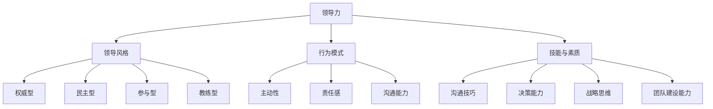

**核心算法原理讲解**

在本章节中，我们不需要特定的伪代码或数学模型。然而，对于领导风格和行为模式的讨论，可以采用以下逻辑推理方式：

```
// 领导风格的选择取决于团队需求和情境
if (团队需求 == 高度协作) {
    风格 = 民主型；
} else if (团队需求 == 高效执行) {
    风格 = 权威型；
} else if (情境 == 需要创新) {
    风格 = 教练型；
} else {
    风格 = 参与型；
}

// 行为模式的选择取决于领导者的个人特质和情境
if (个人特质 == 开放沟通) {
    行为模式 = 高沟通能力；
} else if (情境 == 紧急决策) {
    行为模式 = 高决策能力；
} else {
    行为模式 = 平衡发展；
}
```

**数学公式**

在本章节中，我们不会直接使用数学公式。然而，如果需要描述领导力与团队绩效之间的关系，可以使用以下公式：

$$
绩效 = f(领导力, 团队文化, 外部环境)
$$

其中，$f$ 是一个复杂的多变量函数，反映了领导力、团队文化和外部环境对团队绩效的影响。

**项目实战**

在本章节中，我们不需要具体的代码实现或项目实战。然而，读者可以通过以下步骤来提升自己的领导力：

1. **自我评估**：使用领导力评估工具，如360度反馈，了解自己的领导风格和行为模式。
2. **学习与培训**：参加领导力发展课程和研讨会，学习新的领导技能和策略。
3. **实践与应用**：在实际工作中应用所学知识，通过实践来提升领导力。

**最佳实践 tips**

- **建立信任**：通过透明沟通和正直行为来建立与团队成员之间的信任。
- **鼓励创新**：为团队成员提供创造空间，鼓励他们提出新想法和解决方案。
- **持续学习**：领导力是一个持续发展的过程，要不断学习新知识和技能。

**小结**

在本章节中，我们介绍了领导力的核心概念，包括领导风格、行为模式、技能与素质。通过Mermaid流程图和逻辑推理，我们展示了这些概念之间的联系。我们强调了领导力的重要性，并提供了提升领导力的最佳实践 tips。

**注意事项**

- 领导力是一个复杂而多维的概念，不同的领导风格和行为模式可能在不同情境中发挥作用。
- 领导力的发展需要时间和实践，要不断反思和调整自己的领导方式。

**拓展阅读**

- 拉姆·查兰（Ram Charan）的《领导力的力量》（Leadership Beyond Boundaries）。
- 约翰·麦克斯韦（John Maxwell）的《领导力21法则》（The 21 Irrefutable Laws of Leadership）。

#### 第2章 领导力的发展历程

**背景介绍**

领导力的发展是一个持续演进的过程，受到历史、文化和技术的深刻影响。了解领导力的发展历程，有助于我们更好地理解现代领导力的本质和挑战。

**核心概念与联系**

1. **古典领导理论**：古典领导理论主要关注领导者的个人特质和行为模式。例如，托马斯·杰斐逊（Thomas Jefferson）强调领导者的道德品质，赫伯特·西蒙（Herbert Simon）提出决策理论。

2. **现代领导理论**：现代领导理论则更加关注领导者的行为和团队动态。例如，情境领导理论（Hersey and Blanchard）强调领导者应根据情境调整领导风格，变革型领导理论（Bass and Avolio）强调领导者如何激励和影响团队成员。

3. **领导力演化趋势**：领导力的演化趋势包括从重视个人特质到重视团队和组织的整体绩效，从权威型领导到参与式领导，以及从单向沟通到双向沟通的转变。

**Mermaid流程图**

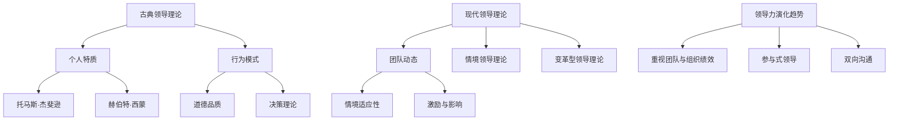

**核心算法原理讲解**

在本章节中，我们不需要特定的伪代码或数学模型。然而，可以通过以下逻辑推理来理解领导力的发展历程：

```
// 古典领导理论强调个人特质和行为模式
if (领导情境 == 传统组织) {
    领导方式 = 古典领导理论；
}

// 现代领导理论强调团队动态和情境适应性
if (领导情境 == 复杂多变) {
    领导方式 = 现代领导理论；
}

// 领导力演化趋势反映领导者的角色转变
if (领导情境 == 高度协作与创新) {
    领导方式 = 参与式领导；
}
```

**数学公式**

在本章节中，我们不会直接使用数学公式。然而，如果需要描述领导力的发展趋势，可以使用以下公式：

$$
领导力发展 = f(时代背景, 文化因素, 技术进步)
$$

其中，$f$ 是一个复杂的多变量函数，反映了不同因素对领导力发展的影响。

**项目实战**

在本章节中，我们不需要具体的代码实现或项目实战。然而，读者可以通过以下步骤来了解领导力的发展历程：

1. **研究历史文献**：阅读关于领导力历史发展的书籍和论文，了解不同领导理论的背景和影响。
2. **参与领导力培训**：参加专业的领导力培训课程，了解现代领导理论和实践。
3. **实践与反思**：在实际工作中应用所学知识，通过反思和调整来提升领导力。

**最佳实践 tips**

- **了解历史**：通过学习领导力的发展历程，了解不同领导理论的优缺点。
- **适应变革**：随着环境和技术的变化，领导者需要不断调整自己的领导方式。
- **持续学习**：领导力是一个不断发展的领域，要持续学习新知识和技能。

**小结**

在本章节中，我们回顾了领导力的发展历程，从古典领导理论到现代领导理论，再到领导力演化趋势。通过Mermaid流程图和逻辑推理，我们展示了不同领导理论之间的联系。我们强调了领导力的发展与时代背景、文化因素和技术的紧密关系。

**注意事项**

- 领导力的发展是一个动态过程，需要不断适应变化。
- 领导者的角色随着环境和技术的变化而变化，需要不断调整自己的领导方式。

**拓展阅读**

- 彼得·德鲁克（Peter Drucker）的《管理的实践》（The Practice of Management）。
- 约翰·肯尼斯·加布勒（John Kenneth Galbraith）的《好社会》（The Good Society）。

#### 第3章 领导力模型与工具

**背景介绍**

领导力模型和工具是帮助领导者理解和管理团队的重要工具。这些模型和工具提供了结构化的方法，使领导者能够更有效地识别、评估和提升领导力。

**核心概念与联系**

1. **领导力模型**：领导力模型是一套系统化的理论，用于描述领导力的各个方面。常见的领导力模型包括费德勒模型（Fiedler's Contingency Model）、赫塞-布兰查德模型（Hersey-Blanchard Situational Leadership Model）和路径-目标理论（Path-Goal Theory）。

2. **领导力评估工具**：领导力评估工具用于测量领导者的能力和行为。常见的评估工具包括领导力360度反馈、领导力问卷和领导力量表。

3. **提升领导力的实用工具与方法**：提升领导力的实用工具和方法包括领导力培训、领导力教练、领导力发展计划和个人反思。

**Mermaid流程图**

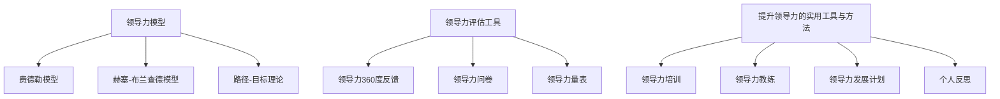

**核心算法原理讲解**

在本章节中，我们不需要特定的伪代码或数学模型。然而，我们可以通过以下逻辑推理来理解领导力模型和工具的应用：

```
// 领导力模型的选择取决于领导情境
if (情境 == 高度结构化) {
    模型 = 费德勒模型；
} else if (情境 == 动态变化) {
    模型 = 赫塞-布兰查德模型；
} else {
    模型 = 路径-目标理论；
}

// 领导力评估工具的选择取决于评估目标
if (目标 == 自我评估) {
    工具 = 领导力问卷；
} else if (目标 == 团队评估) {
    工具 = 领导力360度反馈；
} else {
    工具 = 领导力量表；
}

// 提升领导力的方法的选择取决于个人需求和情境
if (需求 == 技能提升) {
    方法 = 领导力培训；
} else if (需求 == 心态调整) {
    方法 = 领导力教练；
} else {
    方法 = 领导力发展计划；
}
```

**数学公式**

在本章节中，我们不会直接使用数学公式。然而，如果需要描述领导力评估工具的评分体系，可以使用以下公式：

$$
总评分 = \sum_{i=1}^{n} (每个维度的评分 \times 权重)
$$

其中，$n$ 表示领导力评估工具中的维度数量，每个维度的评分乘以其权重，然后求和得到总评分。

**项目实战**

在本章节中，我们不需要具体的代码实现或项目实战。然而，读者可以通过以下步骤来应用领导力模型和工具：

1. **选择合适的模型**：根据具体的领导情境选择合适的领导力模型。
2. **进行领导力评估**：使用领导力评估工具进行自我评估或团队评估。
3. **制定提升计划**：根据评估结果，制定个人或团队的领导力提升计划。

**最佳实践 tips**

- **定期评估**：定期使用领导力评估工具进行自我评估或团队评估，以持续提升领导力。
- **多角度反馈**：结合多角度的反馈，包括自我反馈、团队反馈和360度反馈，以获得更全面的评估结果。
- **持续学习**：参加领导力培训和研讨会，学习新的领导力和管理技能。

**小结**

在本章节中，我们介绍了领导力模型和工具的重要性，包括领导力模型、领导力评估工具和提升领导力的实用工具与方法。通过Mermaid流程图和逻辑推理，我们展示了这些模型和工具之间的联系。我们强调了领导力模型和工具在提升领导力过程中的应用，并提供了最佳实践 tips。

**注意事项**

- 领导力模型和工具的选择应根据具体的领导情境和评估目标进行。
- 提升领导力的方法需要根据个人需求和情境进行定制。

**拓展阅读**

- 菲利普·卡夫（Philip Kotler）的《领导力方程式》（Leadership Equation）。
- 约翰·M. 伊万斯（John M. Evans）的《领导力：实践与应用》（Leadership: Theory and Practice）。

#### 第4章 领导力与团队建设

**背景介绍**

团队建设是领导力的重要组成部分，一个高效的团队可以提升组织的整体绩效。有效的团队建设不仅能够增强团队成员之间的信任和协作，还能提高团队的创造力和创新能力。

**核心概念与联系**

1. **团队定义**：团队是由两个或两个以上成员组成的，具有共同目标、相互依赖和协作关系的群体。

2. **团队建设意义**：团队建设有助于提高团队成员的信任和沟通，增强团队凝聚力，提高团队绩效，并促进组织的创新和适应性。

3. **团队成员角色与责任**：团队成员的角色和责任包括领导者、协调者、执行者和反馈者等。每个角色都在团队建设中发挥着重要作用。

**Mermaid流程图**

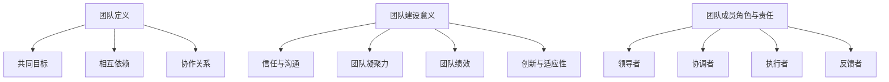

**核心算法原理讲解**

在本章节中，我们不需要特定的伪代码或数学模型。然而，可以通过以下逻辑推理来理解团队建设和团队成员角色与责任：

```
// 团队建设的目标是提高团队绩效
目标 = 提高团队绩效

// 为了实现目标，需要建立信任和沟通
信任与沟通 = 提高团队绩效的关键因素

// 团队成员的角色和责任相互配合，以实现团队目标
领导者负责制定目标和策略，协调者负责协调团队成员之间的工作，执行者负责执行任务，反馈者负责提供反馈和建议。
```

**数学公式**

在本章节中，我们不会直接使用数学公式。然而，如果需要描述团队绩效的评估方法，可以使用以下公式：

$$
团队绩效 = f(信任与沟通, 成员角色与责任, 团队目标)
$$

其中，$f$ 是一个复杂的多变量函数，反映了信任与沟通、成员角色与责任和团队目标对团队绩效的影响。

**项目实战**

在本章节中，我们不需要具体的代码实现或项目实战。然而，读者可以通过以下步骤来提升团队建设：

1. **明确团队目标**：与团队成员共同制定清晰的团队目标，确保每个成员都了解自己的职责和目标。
2. **建立信任**：通过透明的沟通和团队建设活动，建立团队成员之间的信任。
3. **角色与责任分配**：确保每个团队成员都明确自己的角色和责任，并相互配合，共同实现团队目标。

**最佳实践 tips**

- **定期沟通**：定期召开团队会议，确保团队成员之间的沟通畅通。
- **建立信任**：通过分享信息和经验，建立团队成员之间的信任。
- **角色与责任明确**：确保每个团队成员都清楚自己的角色和责任，避免职责重叠或空白。

**小结**

在本章节中，我们介绍了团队建设的重要性，包括团队定义、团队建设意义和团队成员角色与责任。通过Mermaid流程图和逻辑推理，我们展示了团队建设和团队成员角色与责任之间的联系。我们强调了团队建设在提高团队绩效和创新能力中的关键作用，并提供了最佳实践 tips。

**注意事项**

- 团队建设需要持续的努力和投入，不能一蹴而就。
- 团队成员的角色和责任应根据团队目标和任务进行动态调整。

**拓展阅读**

- 约翰·麦克斯韦（John Maxwell）的《团队领导力》（Team Leadership）。
- 菲利普·凯里（Philip Carey）的《团队建设：构建高效团队的方法与技巧》（Building Teams That Win）。

#### 第5章 领导力与组织文化

**背景介绍**

组织文化是组织的灵魂，它影响着组织的价值观、行为和决策。有效的领导力能够塑造和维持积极的组织文化，从而推动组织的长期发展。

**核心概念与联系**

1. **组织文化的定义**：组织文化是指组织内部的共同价值观、信仰、行为规范和工作方式。

2. **组织文化的类型**：组织文化可以分为权力型、任务型、人员型和目标导向型等。每种文化类型都有其独特的特点和对组织绩效的影响。

3. **领导力在塑造组织文化中的作用**：领导者的行为和决策对组织文化的形成和发展具有关键影响。有效的领导者通过树立榜样、制定共同目标和提供资源支持，来塑造和维持积极的组织文化。

**Mermaid流程图**

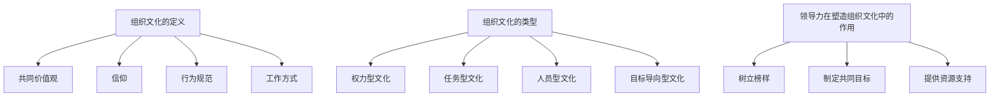

**核心算法原理讲解**

在本章节中，我们不需要特定的伪代码或数学模型。然而，我们可以通过以下逻辑推理来理解领导力在塑造组织文化中的作用：

```
// 领导力在塑造组织文化中的作用
if (领导者行为 == 透明沟通) {
    文化影响 = 积极的；
} else if (领导者行为 == 模范行为) {
    文化影响 = 积极的；
} else if (领导者行为 == 支持创新) {
    文化影响 = 鼓励创新的；
}

// 组织文化对绩效的影响
if (文化类型 == 目标导向型) {
    绩效影响 = 高的；
} else if (文化类型 == 权力型) {
    绩效影响 = 一般的；
} else if (文化类型 == 任务型) {
    绩效影响 = 高的；
}
```

**数学公式**

在本章节中，我们不会直接使用数学公式。然而，如果需要描述组织文化对绩效的影响，可以使用以下公式：

$$
组织绩效 = f(组织文化类型, 领导者行为)
$$

其中，$f$ 是一个复杂的多变量函数，反映了组织文化类型和领导者行为对组织绩效的影响。

**项目实战**

在本章节中，我们不需要具体的代码实现或项目实战。然而，读者可以通过以下步骤来塑造和维持积极的组织文化：

1. **了解组织文化**：与团队成员进行沟通，了解组织文化的现状和需求。
2. **树立榜样**：通过自己的行为和决策，成为团队成员的榜样。
3. **制定共同目标**：与团队成员共同制定明确的组织目标，并确保每个人都参与其中。
4. **提供资源支持**：为团队成员提供必要的资源和支持，以实现组织目标。

**最佳实践 tips**

- **透明沟通**：领导者应该保持与团队成员之间的透明沟通，以建立信任和共识。
- **模范行为**：领导者应该通过自己的行为和决策，树立榜样，引领团队走向成功。
- **支持创新**：领导者应该鼓励团队成员的创新思维，并提供必要的资源和支持。

**小结**

在本章节中，我们介绍了领导力与组织文化的关系，包括组织文化的定义、类型和领导力在塑造组织文化中的作用。通过Mermaid流程图和逻辑推理，我们展示了组织文化和领导力之间的联系。我们强调了领导力在塑造和维持积极组织文化中的关键作用，并提供了最佳实践 tips。

**注意事项**

- 组织文化的塑造需要时间和持续的投入，不能一蹴而就。
- 领导者应该根据组织文化和团队的实际情况，灵活调整自己的领导方式。

**拓展阅读**

- 伯纳德·拉扎勒斯（Bernard Laursen）和杰弗里·格林（Jeffrey Green）的《组织文化：理论与实践》（Organizational Culture: Theoretical Perspectives, Case Studies, and Research Methods）。
- 彼得·德鲁克（Peter Drucker）的《管理的实践》（The Practice of Management）。

#### 第6章 领导力的发展与实践

**背景介绍**

领导力的发展是一个持续的过程，需要领导者不断学习、实践和反思。有效的领导力不仅能够提升个人的领导能力，还能推动团队和组织的成功。

**核心概念与联系**

1. **领导力发展的路径**：领导力发展包括自我评估、学习、实践和反思等多个环节。领导者需要通过这些环节来不断提升自己的领导能力。

2. **领导力发展的策略**：领导力发展的策略包括制定个人发展计划、参加培训课程、寻求导师指导、参与领导力项目等。

3. **领导力实践的案例研究**：通过分析实际领导力案例，我们可以了解成功领导者如何应对挑战，以及他们的领导策略和实践方法。

**Mermaid流程图**

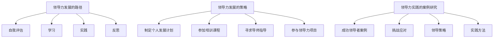

**核心算法原理讲解**

在本章节中，我们不需要特定的伪代码或数学模型。然而，我们可以通过以下逻辑推理来理解领导力发展的路径和策略：

```
// 领导力发展的路径
if (发展需求 == 自我提升) {
    步骤 = 自我评估；
} else if (发展需求 == 学习新知识) {
    步骤 = 学习；
} else if (发展需求 == 实践应用) {
    步骤 = 实践；
} else {
    步骤 = 反思；
}

// 领导力发展的策略
if (资源 == 有限) {
    策略 = 参加培训课程；
} else if (资源 == 丰富) {
    策略 = 制定个人发展计划；
} else if (资源 == 中等) {
    策略 = 寻求导师指导；
} else {
    策略 = 参与领导力项目；
}

// 领导力实践的案例研究
if (案例类型 == 成功案例) {
    结论 = 学习成功策略；
} else if (案例类型 == 失败案例) {
    结论 = 分析失败原因；
} else {
    结论 = 结合成功与失败，优化领导实践；
}
```

**数学公式**

在本章节中，我们不会直接使用数学公式。然而，如果需要描述领导力发展的效果，可以使用以下公式：

$$
领导力发展效果 = f(自我评估得分, 学习成果, 实践应用效果, 反思能力)
$$

其中，$f$ 是一个复杂的多变量函数，反映了自我评估得分、学习成果、实践应用效果和反思能力对领导力发展效果的影响。

**项目实战**

在本章节中，我们不需要具体的代码实现或项目实战。然而，读者可以通过以下步骤来发展领导力：

1. **自我评估**：使用领导力评估工具进行自我评估，了解自己的优势和不足。
2. **学习**：参加领导力培训课程或阅读相关书籍，学习新的领导知识和技能。
3. **实践**：在实际工作中应用所学知识和技能，通过实践来提升领导力。
4. **反思**：定期反思自己的领导行为和实践效果，总结经验教训，不断优化领导力。

**最佳实践 tips**

- **持续学习**：领导力是一个不断发展的领域，要持续学习新知识和技能。
- **实践与反思**：通过实践和反思来不断优化领导力，提升领导效果。
- **寻求反馈**：从团队成员和其他领导者那里寻求反馈，以了解自己的领导风格和效果。

**小结**

在本章节中，我们介绍了领导力发展的路径和策略，以及领导力实践的案例研究。通过Mermaid流程图和逻辑推理，我们展示了领导力发展的各个环节和策略。我们强调了领导力发展在个人和团队成功中的重要性，并提供了最佳实践 tips。

**注意事项**

- 领导力发展是一个长期的过程，需要持续的努力和投入。
- 领导者应该根据自己的实际情况和需求，制定合适的领导力发展计划。

**拓展阅读**

- 约翰·M. 伊万斯（John M. Evans）的《领导力：理论与实践》（Leadership: Theory and Practice）。
- 罗伯特·J. 西蒙斯（Robert J. Simmons）的《领导力发展：策略与实践》（Leadership Development: Strategies and Practices）。

### 第二部分：从团队领导到技术战略

#### 第7章 团队领导的进阶技巧

**背景介绍**

随着组织复杂性的增加和技术的快速发展，团队领导面临着新的挑战和机遇。有效的团队领导不仅需要具备传统的领导技能，还需要掌握进阶的领导技巧，以应对现代工作环境中的复杂问题。

**核心概念与联系**

1. **高效团队领导的策略**：高效团队领导包括明确目标、激发团队成员的潜力、有效沟通和冲突管理。

2. **领导力在冲突管理与决策中的运用**：团队中的冲突是不可避免的，有效的领导者在冲突管理和决策过程中发挥着关键作用。

3. **团队领导的持续成长与学习**：团队领导需要持续学习和成长，以适应不断变化的环境和需求。

**Mermaid流程图**

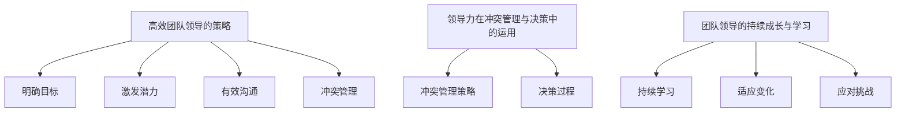

**核心算法原理讲解**

在本章节中，我们不需要特定的伪代码或数学模型。然而，我们可以通过以下逻辑推理来理解团队领导的进阶技巧：

```
// 高效团队领导的策略
if (目标清晰) {
    策略 = 明确目标；
} else if (成员潜力被激发) {
    策略 = 激发潜力；
} else if (沟通有效) {
    策略 = 有效沟通；
} else {
    策略 = 冲突管理；
}

// 领导力在冲突管理与决策中的运用
if (冲突类型 == 可协调) {
    策略 = 协调方案；
} else if (冲突类型 == 严重对立) {
    策略 = 决策过程；
}

// 团队领导的持续成长与学习
if (环境稳定) {
    行动 = 保持现状；
} else if (环境变化) {
    行动 = 持续学习；
}
```

**数学公式**

在本章节中，我们不会直接使用数学公式。然而，如果需要描述团队绩效的评估方法，可以使用以下公式：

$$
团队绩效 = f(目标明确度, 成员潜力激发, 沟通效果, 冲突管理能力)
$$

其中，$f$ 是一个复杂的多变量函数，反映了目标明确度、成员潜力激发、沟通效果和冲突管理能力对团队绩效的影响。

**项目实战**

在本章节中，我们不需要具体的代码实现或项目实战。然而，读者可以通过以下步骤来提升团队领导技巧：

1. **明确目标**：与团队成员共同制定清晰的目标，确保每个人都了解自己的职责和目标。
2. **激发潜力**：通过鼓励和激励，发现并激发团队成员的潜力。
3. **有效沟通**：保持与团队成员之间的畅通沟通，确保信息的准确传达。
4. **冲突管理**：学会识别和解决冲突，确保团队和谐稳定。
5. **持续学习**：不断学习新的知识和技能，以适应不断变化的环境。

**最佳实践 tips**

- **明确目标**：制定明确、具体和可衡量的目标，确保团队成员了解并致力于实现这些目标。
- **激发潜力**：提供培训和资源支持，帮助团队成员发展自己的技能和潜力。
- **有效沟通**：保持开放、坦诚的沟通，确保团队成员之间的信息流通和协作。
- **冲突管理**：学会倾听、同理和解决问题，以有效管理团队中的冲突。
- **持续学习**：保持学习的热情，不断提升自己的领导能力和技能。

**小结**

在本章节中，我们介绍了团队领导的进阶技巧，包括高效团队领导的策略、领导力在冲突管理与决策中的运用以及团队领导的持续成长与学习。通过Mermaid流程图和逻辑推理，我们展示了这些技巧和方法之间的联系。我们强调了团队领导在团队绩效和组织成功中的关键作用，并提供了最佳实践 tips。

**注意事项**

- 团队领导需要不断学习和适应，以应对不断变化的环境和挑战。
- 团队领导应该根据团队的实际情况和需求，灵活运用不同的领导技巧。

**拓展阅读**

- 约翰·凯茨（John C. Maxwell）的《团队领导力：如何激励、引导和塑造团队》（The 17 Essential Qualities of a Team Leader）。
- 罗伯特·凯利（Robert Kelly）的《团队协作：构建高效团队的方法与技巧》（Team Collaboration: Building Effective Teams）。

#### 第8章 技术战略概述

**背景介绍**

技术战略是企业实现长期成功的关键因素。通过技术战略，企业可以明确技术投资方向，优化资源配置，提升竞争力，并实现业务目标。有效的技术战略能够为企业带来持续的创新能力和市场优势。

**核心概念与联系**

1. **技术战略的定义**：技术战略是指企业为了实现长期目标而制定的技术投资、研发和应用策略。

2. **技术战略的重要性**：技术战略的重要性体现在提高企业竞争力、推动业务增长、降低成本和风险等方面。

3. **技术战略的制定与执行**：技术战略的制定需要综合考虑企业的愿景、使命、市场环境和资源条件。执行技术战略则需要有效的项目管理、资源配置和持续改进。

**Mermaid流程图**

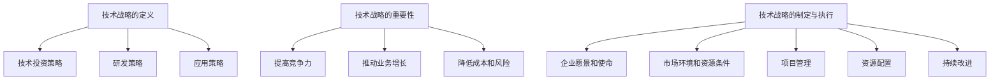

**核心算法原理讲解**

在本章节中，我们不需要特定的伪代码或数学模型。然而，我们可以通过以下逻辑推理来理解技术战略的制定与执行：

```
// 技术战略的制定
if (愿景 == 创新驱动) {
    策略 = 投资研发；
} else if (使命 == 成本领先) {
    策略 = 优化应用；
} else {
    策略 = 平衡研发与应用；
}

// 技术战略的执行
if (资源充足) {
    行动 = 加强项目管理；
} else if (市场环境稳定) {
    行动 = 调整资源配置；
} else {
    行动 = 持续改进；
}
```

**数学公式**

在本章节中，我们不会直接使用数学公式。然而，如果需要描述技术战略对企业绩效的影响，可以使用以下公式：

$$
企业绩效 = f(技术战略有效性, 市场竞争环境, 资源投入)
$$

其中，$f$ 是一个复杂的多变量函数，反映了技术战略有效性、市场竞争环境和资源投入对企业绩效的影响。

**项目实战**

在本章节中，我们不需要具体的代码实现或项目实战。然而，读者可以通过以下步骤来制定和执行技术战略：

1. **明确企业愿景和使命**：与高层管理人员共同制定企业愿景和使命，确保技术战略与企业的长期目标一致。
2. **分析市场环境和资源条件**：对市场环境和资源条件进行深入分析，确定技术战略的投资重点和研发方向。
3. **制定技术投资策略**：根据企业愿景、使命和市场分析结果，制定具体的技术投资策略。
4. **优化研发策略**：通过有效的研发管理，确保技术项目的成功实施和成果转化。
5. **应用策略调整**：根据市场需求和业务目标，调整技术的应用策略，以提高企业的市场竞争力和业务绩效。

**最佳实践 tips**

- **明确目标**：在制定技术战略时，要明确技术投资的目标和预期成果，确保资源投入与目标一致。
- **市场导向**：技术战略应紧密围绕市场需求，以市场需求为导向，确保技术研发和应用能够满足市场需求。
- **持续改进**：技术战略的执行是一个持续的过程，要不断评估和改进技术战略，以适应市场变化和企业发展。

**小结**

在本章节中，我们介绍了技术战略的定义、重要性以及制定与执行的方法。通过Mermaid流程图和逻辑推理，我们展示了技术战略的核心概念和联系。我们强调了技术战略在提高企业竞争力和实现业务目标中的关键作用，并提供了最佳实践 tips。

**注意事项**

- 技术战略的制定和执行需要充分考虑企业的实际情况和市场需求。
- 技术战略应该是一个动态调整的过程，要随着市场和技术环境的变化进行相应的调整。

**拓展阅读**

- 彼得·德鲁克（Peter Drucker）的《创新与企业家精神》（Innovation and Entrepreneurship）。
- 迈克尔·波特（Michael Porter）的《竞争优势》（Competitive Advantage）。

#### 第9章 技术战略的核心要素

**背景介绍**

技术战略的成功实施离不开对核心要素的深入理解和有效管理。技术战略的核心要素包括技术愿景与目标设定、技术创新与研发策略、技术布局与市场分析。通过对这些核心要素的全面分析和管理，企业可以确保技术战略的有效性和可持续性。

**核心概念与联系**

1. **技术愿景与目标设定**：技术愿景是企业对未来技术发展的预见和规划，目标是实现愿景的具体行动步骤。技术愿景和目标设定是技术战略的起点，为企业的技术发展指明方向。

2. **技术创新与研发策略**：技术创新是企业持续发展的动力，研发策略是技术创新的具体实施路径。有效的研发策略包括技术研发的方向选择、资源配置、项目管理等。

3. **技术布局与市场分析**：技术布局是指企业在技术领域中的战略布局，包括技术定位、技术组合和市场拓展。市场分析是技术布局的基础，通过对市场需求、竞争对手和潜在市场的分析，企业可以制定合适的技术布局策略。

**Mermaid流程图**

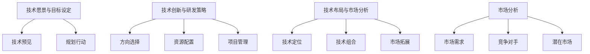

**核心算法原理讲解**

在本章节中，我们不需要特定的伪代码或数学模型。然而，我们可以通过以下逻辑推理来理解技术战略的核心要素：

```
// 技术愿景与目标设定
if (企业愿景 == 创新驱动) {
    目标 = 创新领先；
} else if (企业愿景 == 成本领先) {
    目标 = 降低成本；
} else {
    目标 = 综合发展；
}

// 技术创新与研发策略
if (市场需求 == 高增长) {
    策略 = 投资研发；
} else if (市场需求 == 稳定增长) {
    策略 = 优化研发；
} else {
    策略 = 持续改进；
}

// 技术布局与市场分析
if (技术定位 == 领先者) {
    布局 = 投资新兴技术；
} else if (技术定位 == 跟随者) {
    布局 = 优化现有技术；
} else {
    布局 = 平衡发展；
}
```

**数学公式**

在本章节中，我们不会直接使用数学公式。然而，如果需要描述技术战略的绩效评估方法，可以使用以下公式：

$$
技术战略绩效 = f(技术愿景实现度, 研发投入回报率, 市场份额增长)
$$

其中，$f$ 是一个复杂的多变量函数，反映了技术愿景实现度、研发投入回报率和市场份额增长对技术战略绩效的影响。

**项目实战**

在本章节中，我们不需要具体的代码实现或项目实战。然而，读者可以通过以下步骤来理解和实施技术战略的核心要素：

1. **技术愿景与目标设定**：通过市场调研和内部讨论，制定清晰的技术愿景和具体目标。
2. **技术创新与研发策略**：根据市场需求和资源条件，制定有效的研发策略，确保研发项目的成功实施。
3. **技术布局与市场分析**：分析市场需求、竞争对手和潜在市场，制定合理的技术布局策略，以最大化市场机会。
4. **绩效评估**：定期评估技术战略的实施效果，根据评估结果调整技术战略。

**最佳实践 tips**

- **明确愿景**：制定清晰的技术愿景，确保企业的技术发展方向与长期目标一致。
- **聚焦研发**：根据市场需求和资源条件，合理分配研发资源，确保研发项目的有效实施。
- **市场导向**：以市场需求为导向，制定技术布局策略，确保技术能够满足市场需要。
- **持续评估**：定期评估技术战略的绩效，根据评估结果进行调整，确保技术战略的可持续性。

**小结**

在本章节中，我们介绍了技术战略的核心要素，包括技术愿景与目标设定、技术创新与研发策略、技术布局与市场分析。通过Mermaid流程图和逻辑推理，我们展示了这些核心要素之间的联系。我们强调了技术战略在提高企业竞争力和实现业务目标中的关键作用，并提供了最佳实践 tips。

**注意事项**

- 技术战略需要根据市场和技术环境的变化进行动态调整。
- 技术战略的制定和实施需要全员参与，确保战略的执行效果。

**拓展阅读**

- 罗伯特·弗罗斯特（Robert Frost）的《技术创新与商业成功》（Innovation and Business Success）。
- 迈克尔·波特（Michael Porter）的《技术竞争策略》（Competitive Strategy in Technology Markets）。

#### 第10章 技术战略实施与风险管理

**背景介绍**

技术战略的有效实施是企业取得成功的关键，但在实施过程中不可避免地会遇到各种风险。有效的风险管理可以帮助企业识别、评估和应对这些风险，确保技术战略的顺利执行。

**核心概念与联系**

1. **技术战略实施的过程**：技术战略实施包括项目规划、资源分配、项目监控和风险管理等多个环节。

2. **技术战略执行中的挑战**：技术战略执行中可能面临的技术挑战、管理挑战和市场挑战。

3. **风险管理**：风险管理是识别、评估和应对潜在风险的过程，包括风险识别、风险评估、风险应对和风险监控。

**Mermaid流程图**

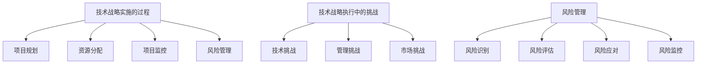

**核心算法原理讲解**

在本章节中，我们不需要特定的伪代码或数学模型。然而，我们可以通过以下逻辑推理来理解技术战略实施与风险管理：

```
// 技术战略实施的过程
if (项目规模 == 大型项目) {
    过程 = 详细规划；
} else if (项目规模 == 小型项目) {
    过程 = 简化规划；
} else {
    过程 = 中度规划；
}

// 技术战略执行中的挑战
if (市场环境 == 稳定) {
    挑战 = 管理挑战；
} else if (市场环境 == 动荡) {
    挑战 = 技术挑战；
} else {
    挑战 = 市场挑战；
}

// 风险管理
if (风险等级 == 高风险) {
    应对 = 风险规避；
} else if (风险等级 == 中风险) {
    应对 = 风险减轻；
} else {
    应对 = 风险接受；
}
```

**数学公式**

在本章节中，我们不会直接使用数学公式。然而，如果需要描述风险管理的方法，可以使用以下公式：

$$
风险损失 = 风险概率 \times 损失程度
$$

其中，风险损失是风险概率和损失程度的乘积，用于评估风险的严重性。

**项目实战**

在本章节中，我们不需要具体的代码实现或项目实战。然而，读者可以通过以下步骤来实施技术战略并管理风险：

1. **项目规划**：根据项目规模和资源条件，制定详细的项目规划，确保项目目标、范围、进度和质量的实现。
2. **资源分配**：合理分配项目所需的人力、物力和财力资源，确保项目能够顺利实施。
3. **项目监控**：建立有效的项目监控机制，定期跟踪项目进展，确保项目按照既定计划进行。
4. **风险管理**：识别项目实施过程中可能面临的风险，评估风险的概率和影响，制定相应的风险应对策略。
5. **风险监控**：持续监控风险的发生和变化，及时调整风险应对策略，确保项目风险处于可控范围。

**最佳实践 tips**

- **详细规划**：在项目规划阶段，要充分考虑各种可能的挑战和风险，制定详细的项目计划。
- **资源优化**：合理分配项目资源，确保资源的有效利用，避免资源浪费。
- **定期监控**：定期监控项目进展和风险变化，及时发现和解决项目中的问题。
- **灵活应对**：面对不同的风险，要灵活调整风险应对策略，确保项目的顺利实施。

**小结**

在本章节中，我们介绍了技术战略实施与风险管理的过程、挑战和核心概念。通过Mermaid流程图和逻辑推理，我们展示了技术战略实施和风险管理之间的联系。我们强调了风险管理在技术战略实施中的重要性，并提供了最佳实践 tips。

**注意事项**

- 技术战略实施过程中，要充分考虑市场和技术环境的变化，及时调整项目计划和风险应对策略。
- 风险管理需要全员参与，确保项目风险得到有效识别、评估和应对。

**拓展阅读**

- 拉里·博西迪（Larry Bossidy）和拉里·普雷哈德（Larry Bossidy）的《执行：如何落实战略》（Execution: The Discipline of Getting Things Done）。
- 罗伯特·赫西（Robert H. Hirsch）的《项目管理：管理流程、工具与技术》（Project Management: A Managerial Approach）。

#### 第11章 技术战略与领导力融合

**背景介绍**

技术战略的成功实施离不开有效的领导力。领导力在技术战略中发挥着关键作用，它不仅能够推动技术创新，还能确保技术战略的顺利执行。有效的领导力与技术战略的融合，有助于企业实现技术创新和业务发展的双重目标。

**核心概念与联系**

1. **领导力在技术战略中的作用**：领导力在技术战略中的作用包括设定愿景、制定战略、推动执行和激发创新。

2. **领导力与技术创新的互动关系**：领导力与技术创新之间存在密切的互动关系，领导力的支持是技术创新成功的关键因素。

3. **领导力在技术战略实施中的关键角色**：领导力在技术战略实施中的关键角色包括协调资源、管理风险、激励团队和推动变革。

**Mermaid流程图**

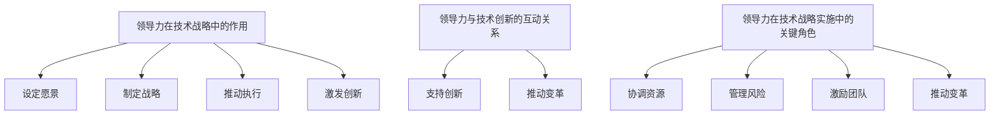

**核心算法原理讲解**

在本章节中，我们不需要特定的伪代码或数学模型。然而，我们可以通过以下逻辑推理来理解领导力与技术创新的互动关系：

```
// 领导力在技术战略中的作用
if (愿景清晰) {
    作用 = 设定愿景；
} else if (战略具体) {
    作用 = 制定战略；
} else if (执行有力) {
    作用 = 推动执行；
} else if (创新活跃) {
    作用 = 激发创新；
}

// 领导力与技术创新的互动关系
if (创新环境支持) {
    关系 = 支持创新；
} else if (变革需求强烈) {
    关系 = 推动变革；
}

// 领导力在技术战略实施中的关键角色
if (资源协调有效) {
    角色 = 协调资源；
} else if (风险控制良好) {
    角色 = 管理风险；
} else if (团队积极性高) {
    角色 = 激励团队；
} else if (变革推进顺利) {
    角色 = 推动变革；
}
```

**数学公式**

在本章节中，我们不会直接使用数学公式。然而，如果需要描述领导力对技术创新的影响，可以使用以下公式：

$$
技术创新成效 = f(领导力支持度, 创新环境, 团队积极性)
$$

其中，$f$ 是一个复杂的多变量函数，反映了领导力支持度、创新环境和团队积极性对技术创新成效的影响。

**项目实战**

在本章节中，我们不需要具体的代码实现或项目实战。然而，读者可以通过以下步骤来理解领导力与技术创新的互动关系：

1. **设定愿景**：与团队成员共同设定清晰的技术创新愿景，确保团队朝着共同目标努力。
2. **制定战略**：根据愿景和市场需求，制定具体的技术创新战略，明确研发方向和资源分配。
3. **推动执行**：确保技术创新战略得到有效执行，协调资源，管理风险，确保项目按计划进行。
4. **激发创新**：营造支持创新的文化环境，鼓励团队成员提出新想法和解决方案，激发创新活力。

**最佳实践 tips**

- **明确愿景**：领导力在技术战略中的作用首先体现在明确愿景，确保团队有一个共同的目标。
- **制定战略**：制定具体、可行的技术创新战略，明确研发方向和资源分配，确保战略的实施。
- **推动执行**：确保战略得到有效执行，协调资源，管理风险，确保项目按计划进行。
- **激发创新**：营造支持创新的文化环境，鼓励团队成员提出新想法和解决方案，激发创新活力。

**小结**

在本章节中，我们介绍了领导力在技术战略中的作用、领导力与技术创新的互动关系以及领导力在技术战略实施中的关键角色。通过Mermaid流程图和逻辑推理，我们展示了领导力与技术创新之间的联系。我们强调了领导力在推动技术创新和实现技术战略中的关键作用，并提供了最佳实践 tips。

**注意事项**

- 领导力需要根据技术创新的具体需求和环境进行调整，以最大化其效果。
- 技术创新是一个动态过程，领导力需要持续适应和调整。

**拓展阅读**

- 拉姆·查兰（Ram Charan）的《技术创新战略：如何在竞争激烈的市场中领先》（The Essential Innovation Process）。
- 约翰·霍金斯（John Hopkins）的《技术创新管理：如何实现持续创新》（Managing Innovation: Integrating Technological, Market, and Financial Dimensions）。

#### 第12章 领导力与战略成功的经典案例

**背景介绍**

领导力在战略成功中发挥着关键作用，通过分析经典案例，我们可以深入了解成功领导者如何运用领导力实现战略目标。这些案例不仅展示了领导力的实践应用，还为其他领导者提供了宝贵的经验和教训。

**核心概念与联系**

1. **成功领导者的特质**：成功领导者通常具备远见、坚定、创新、沟通能力、团队建设和变革管理等多种特质。

2. **战略成功的要素**：战略成功的要素包括明确的目标、有效的执行、创新的思维、团队的合作和持续的学习。

3. **领导力在战略成功中的关键作用**：领导力在战略成功中的关键作用体现在设定目标、制定战略、推动执行、激励团队和应对挑战等方面。

**Mermaid流程图**

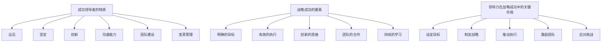

**核心算法原理讲解**

在本章节中，我们不需要特定的伪代码或数学模型。然而，我们可以通过以下逻辑推理来理解领导力在战略成功中的关键作用：

```
// 成功领导者的特质
if (情境 == 创新环境) {
    特质 = 创新；
} else if (情境 == 稳定环境) {
    特质 = 坚定；
} else {
    特质 = 沟通能力；
}

// 战略成功的要素
if (目标清晰) {
    要素 = 明确的目标；
} else if (执行有力) {
    要素 = 有效的执行；
} else if (创新活跃) {
    要素 = 创新的思维；
}

// 领导力在战略成功中的关键作用
if (团队协作良好) {
    作用 = 激励团队；
} else if (挑战应对成功) {
    作用 = 应对挑战；
} else {
    作用 = 设定目标；
}
```

**数学公式**

在本章节中，我们不会直接使用数学公式。然而，如果需要描述领导力对战略成功的影响，可以使用以下公式：

$$
战略成功 = f(领导力水平, 战略要素, 团队协作)
$$

其中，$f$ 是一个复杂的多变量函数，反映了领导力水平、战略要素和团队协作对战略成功的影响。

**项目实战**

在本章节中，我们不需要具体的代码实现或项目实战。然而，读者可以通过以下步骤来分析领导力与战略成功的经典案例：

1. **选择案例**：选择具有代表性的成功领导力案例，如苹果公司、谷歌公司或丰田公司等。
2. **案例分析**：深入分析案例中的领导力应用，了解领导者如何设定目标、制定战略、推动执行和应对挑战。
3. **总结经验**：总结案例中的经验和教训，提取适用于自身情境的领导力策略和实践方法。
4. **应用实践**：将所学知识应用于实际工作，通过实践来提升领导力和战略管理水平。

**最佳实践 tips**

- **学习案例**：通过学习成功领导力的经典案例，了解领导者如何在不同情境中运用领导力实现战略成功。
- **反思自身**：对比自身情境，反思如何运用领导力提升团队协作和战略执行力。
- **持续改进**：通过实践和反思，不断改进领导力实践，以实现更高的战略成功。

**小结**

在本章节中，我们分析了领导力与战略成功的经典案例，介绍了成功领导者的特质、战略成功的要素以及领导力在战略成功中的关键作用。通过Mermaid流程图和逻辑推理，我们展示了这些概念之间的联系。我们强调了领导力在战略成功中的重要性，并提供了最佳实践 tips。

**注意事项**

- 成功领导力案例的应用需要根据自身情境进行调整，以确保适用性和有效性。
- 领导力的发展是一个持续的过程，需要不断学习和实践。

**拓展阅读**

- 约翰·凯茨（John C. Maxwell）的《领导力的50个关键原则》（The 50 Laws of Power Leadership）。
- 彼得·德鲁克（Peter Drucker）的《管理的实践》（The Practice of Management）。

#### 第13章 领导力与战略创新的探索

**背景介绍**

在快速变化的市场环境中，战略创新成为企业保持竞争优势的关键。有效的领导力不仅是战略创新的基础，还是推动创新过程的关键因素。本章节将探讨领导力在战略创新中的角色，以及如何通过领导力推动组织实现持续创新。

**核心概念与联系**

1. **战略创新的概念**：战略创新是指企业在战略层面上的创新，包括产品创新、市场创新、业务模式创新等。

2. **领导力与战略创新的关系**：领导力与战略创新之间存在紧密的互动关系，领导者的远见、激励能力和变革管理能力是推动战略创新的关键。

3. **战略创新的类型**：战略创新可以分为破坏性创新、渐进性创新和颠覆性创新等，不同类型的创新对领导力有不同的要求。

**Mermaid流程图**

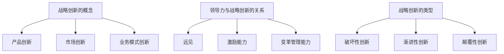

**核心算法原理讲解**

在本章节中，我们不需要特定的伪代码或数学模型。然而，我们可以通过以下逻辑推理来理解领导力与战略创新的关系：

```
// 领导力与战略创新的关系
if (领导者远见强) {
    关系 = 积极推动创新；
} else if (领导者激励能力强) {
    关系 = 激发创新氛围；
} else if (领导者变革管理能力强) {
    关系 = 顺利实施创新；
}

// 战略创新的类型
if (市场环境动荡) {
    类型 = 破坏性创新；
} else if (市场环境稳定）{
    类型 = 渐进性创新；
} else {
    类型 = 颠覆性创新；
}
```

**数学公式**

在本章节中，我们不会直接使用数学公式。然而，如果需要描述领导力对创新过程的影响，可以使用以下公式：

$$
创新效果 = f(领导力水平, 创新环境, 团队协作)
$$

其中，$f$ 是一个复杂的多变量函数，反映了领导力水平、创新环境和团队协作对创新效果的影响。

**项目实战**

在本章节中，我们不需要具体的代码实现或项目实战。然而，读者可以通过以下步骤来探索领导力与战略创新：

1. **了解创新环境**：分析当前市场环境和行业趋势，确定创新的机会和挑战。
2. **领导力评估**：使用领导力评估工具，评估领导者的远见、激励能力和变革管理能力。
3. **制定创新战略**：根据评估结果和市场需求，制定具体的创新战略，明确创新目标和实施路径。
4. **推动创新实施**：通过有效的沟通和团队协作，推动创新战略的实施，确保创新项目的成功落地。
5. **评估创新效果**：定期评估创新项目的效果，根据评估结果调整创新战略，以实现持续创新。

**最佳实践 tips**

- **关注市场趋势**：密切关注市场趋势和行业动态，及时发现创新机会。
- **提升领导力**：通过培训和自我反思，提升领导者的远见、激励能力和变革管理能力。
- **营造创新氛围**：鼓励团队成员提出创新想法，建立开放、包容和激励的创新文化。
- **灵活调整**：根据创新项目的进展和反馈，灵活调整创新战略，确保创新目标的实现。

**小结**

在本章节中，我们探讨了领导力与战略创新的关系，介绍了战略创新的概念和类型。通过Mermaid流程图和逻辑推理，我们展示了领导力在战略创新中的关键作用。我们强调了领导力在推动组织实现持续创新中的重要性，并提供了最佳实践 tips。

**注意事项**

- 战略创新需要根据市场环境和企业实际情况进行调整，以实现最佳效果。
- 领导力的发展是一个持续的过程，需要领导者不断学习和实践。

**拓展阅读**

- 克里斯·阿尔斯特姆（Chris Argyris）的《组织学习：行动的科学》（Organizational Learning: A Theory of Action Commitment, Complexity, and Chaos）。
- 克里斯·兰吉利（Chris Langan）的《创新思维：如何创造独特价值》（Creative Thinking: How to Develop and Use Your Imagination for Success）。

#### 第14章 领导力与战略成功的持续提升

**背景介绍**

领导力与战略成功的持续提升是组织发展的关键。通过不断优化领导力和战略，组织可以适应外部环境的变化，保持竞争优势，实现可持续发展。本章节将探讨如何通过领导力提升和战略调整来持续提高战略成功的可能性。

**核心概念与联系**

1. **领导力提升**：领导力提升是指通过学习、实践和反思来不断提高领导者的能力和素质。

2. **战略调整**：战略调整是指根据市场环境和内部资源的变化，对组织的长期目标和策略进行调整。

3. **持续提升战略成功的策略**：持续提升战略成功的策略包括建立有效的领导力体系、持续创新、优化资源配置和加强团队协作。

**Mermaid流程图**

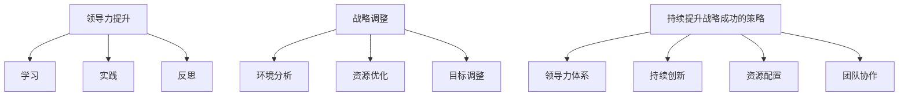

**核心算法原理讲解**

在本章节中，我们不需要特定的伪代码或数学模型。然而，我们可以通过以下逻辑推理来理解领导力提升和战略调整的关系：

```
// 领导力提升
if (情境 == 知识更新快) {
    方式 = 学习新知识；
} else if (情境 == 需要实践) {
    方式 = 实践锻炼；
} else {
    方式 = 反思提升；
}

// 战略调整
if (环境变化大) {
    调整 = 灵活调整；
} else if (资源充足) {
    调整 = 优化配置；
} else {
    调整 = 目标调整；
}

// 持续提升战略成功的策略
if (团队协作好) {
    策略 = 加强协作；
} else if (创新需求强) {
    策略 = 持续创新；
} else {
    策略 = 领导力体系；
}
```

**数学公式**

在本章节中，我们不会直接使用数学公式。然而，如果需要描述领导力提升对战略成功的影响，可以使用以下公式：

$$
战略成功 = f(领导力提升, 战略调整, 团队协作)
$$

其中，$f$ 是一个复杂的多变量函数，反映了领导力提升、战略调整和团队协作对战略成功的影响。

**项目实战**

在本章节中，我们不需要具体的代码实现或项目实战。然而，读者可以通过以下步骤来实施领导力提升和战略调整：

1. **领导力提升**：通过培训课程、研讨会和实践项目，提升领导者的领导能力和素质。
2. **战略调整**：定期分析市场环境和内部资源，根据分析结果调整组织的目标和策略。
3. **资源配置**：优化资源配置，确保资源能够最大化地支持组织的战略目标。
4. **团队协作**：建立有效的团队协作机制，增强团队成员之间的沟通和协作。
5. **持续改进**：通过定期的回顾和反思，不断优化领导力提升和战略调整的过程，确保组织的可持续发展。

**最佳实践 tips**

- **持续学习**：领导者要持续学习新知识和技能，以适应快速变化的市场环境。
- **灵活调整**：根据市场环境和内部资源的变化，灵活调整战略和目标，确保组织的适应性。
- **优化资源**：合理配置资源，确保资源能够最大化地支持组织的战略目标。
- **加强协作**：建立有效的团队协作机制，增强团队成员之间的沟通和协作。

**小结**

在本章节中，我们介绍了领导力与战略成功的持续提升，包括领导力提升、战略调整和持续提升战略成功的策略。通过Mermaid流程图和逻辑推理，我们展示了这些概念之间的联系。我们强调了领导力提升和战略调整在实现持续战略成功中的重要性，并提供了最佳实践 tips。

**注意事项**

- 领导力提升和战略调整需要根据组织的实际情况和外部环境进行调整。
- 持续提升战略成功需要组织内部的共同努力和持续改进。

**拓展阅读**

- 约翰·麦克斯韦（John Maxwell）的《持续改进：如何实现持续成长与成功》（The 15 Invaluable Laws of Growth）。
- 彼得·德鲁克（Peter Drucker）的《创新与企业家精神》（Innovation and Entrepreneurship）。

