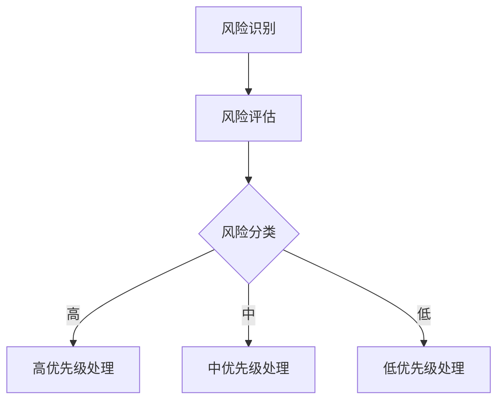
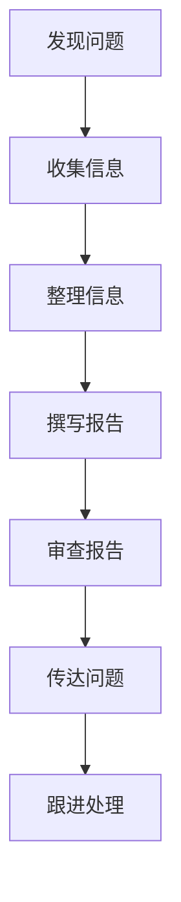

                 

### 文章标题

《风险暴露的艺术：如何有效传达问题》

### 关键词

- 风险暴露
- 传达问题
- 有效沟通
- 软件工程
- 项目管理
- 企业风险管理

### 摘要

在信息技术领域，风险暴露是确保项目成功和业务稳健的重要环节。本文将深入探讨如何通过有效的传达问题来管理风险，从核心概念、方法论到实际案例分析，全面阐述风险暴露的艺术。通过本文，读者将了解如何准确识别问题、构建有效的传达框架，并在实践中应用这些方法来提升项目管理和企业风险管理的能力。

---

## 导言

### 风险暴露的艺术的重要性

在信息技术（IT）领域，风险暴露是一种系统性的方法，用于识别、评估和沟通项目或业务中可能面临的风险。风险暴露的艺术在于如何有效地识别潜在问题，并确保这些问题被及时传达和解决。这一过程不仅对项目的成功至关重要，也对企业整体的稳健发展具有深远影响。

首先，风险暴露是一种预防性措施。通过提前识别和评估风险，企业可以在问题发生前采取相应的措施，从而降低潜在损失。其次，有效的风险暴露能够促进团队间的沟通，使各个成员对潜在问题的认知保持一致。最后，通过系统化的风险暴露过程，企业能够积累宝贵的经验，不断完善其风险管理策略。

本文将逐步探讨风险暴露的核心概念、方法论，并通过实际案例分析，详细讲解如何将风险暴露的艺术应用到实践中。文章结构如下：

1. **核心概念与联系**：介绍风险暴露的定义和相关概念，通过Mermaid流程图展示风险暴露的整体架构。
2. **方法论**：阐述有效传达问题的原则和技巧，并展示其应用流程。
3. **案例分析**：通过具体案例，分析如何在实际项目中应用风险暴露的艺术。
4. **实践指南**：提供详细的实践步骤和工具，帮助读者在项目中实施风险暴露方法。
5. **总结**：回顾文章的核心内容，强调有效传达问题的关键点。

通过本文的阅读，读者将能够掌握风险暴露的艺术，提升在IT项目和企业风险管理中的能力。

---

## 核心概念与联系

### 1.1 风险暴露的定义

风险暴露是指在项目或业务活动中，通过系统化方法识别和评估潜在风险的过程。这个过程包括风险识别、风险评估和风险分类等步骤。风险暴露的核心目标是确保所有潜在风险都被明确识别，并得到适当的评估和应对。

定义中的关键概念包括：

- **风险识别**：通过系统化的方法，识别可能影响项目或业务的潜在风险。
- **风险评估**：对识别出的风险进行定量或定性分析，以确定其严重性和发生概率。
- **风险分类**：根据风险评估结果，将风险分为不同的类别，以便采取相应的应对措施。

### 1.2 风险暴露的Mermaid流程图

为了更好地理解风险暴露的过程，我们可以通过Mermaid流程图展示其整体架构。以下是一个简化的Mermaid流程图：



- **风险识别**：这是风险暴露的第一步，目的是系统性地识别出所有潜在的风险。
- **风险评估**：对识别出的风险进行评估，确定其严重性和发生概率。
- **风险分类**：根据风险评估结果，将风险分类为高、中、低优先级，以便采取相应的处理措施。

### 1.3 风险暴露的组成部分

风险暴露的过程由多个组成部分构成，主要包括：

- **风险识别工具**：如SWOT分析、头脑风暴等，用于帮助识别潜在风险。
- **风险评估方法**：如定量分析、定性分析等，用于评估风险的严重性和发生概率。
- **风险分类标准**：如风险矩阵等，用于根据评估结果分类风险。
- **应对措施**：根据风险分类，制定相应的应对措施，包括规避、转移、减轻等。

### 1.4 风险暴露模型

风险暴露模型是一个系统化的方法，用于指导风险暴露的过程。一个典型的风险暴露模型包括以下步骤：

1. **计划**：确定风险暴露的目标、范围和方法。
2. **识别**：识别所有潜在的风险。
3. **评估**：对识别出的风险进行评估，确定其严重性和发生概率。
4. **分类**：根据评估结果，将风险分类为高、中、低优先级。
5. **应对**：制定并实施应对措施。
6. **监控**：持续监控风险的变化，及时调整应对措施。

通过以上步骤，企业可以系统化地管理风险，确保项目或业务的稳健运行。

---

### 有效传达问题的方法论

### 2.1 传达问题的原则

在风险暴露过程中，有效传达问题至关重要。为了确保问题能够被准确理解和应对，我们需要遵循以下原则：

1. **明确性**：传达问题时，要确保信息的清晰和准确，避免模糊和误解。
2. **及时性**：发现问题后，应立即传达，以避免问题扩大和影响。
3. **完整性**：传达问题时，要提供所有必要的信息，包括问题的背景、影响和可能的解决方案。
4. **针对性**：根据接收者的角色和职责，调整传达的内容和方式。
5. **主动性**：主动报告问题，而不是等待上级询问。

### 2.2 传达问题的Mermaid流程图

为了更好地理解传达问题的流程，我们可以通过Mermaid流程图展示其步骤。以下是一个简化的Mermaid流程图：



- **发现问题**：在项目中，及时发现潜在的问题。
- **收集信息**：收集与问题相关的所有信息，包括背景、影响和可能的解决方案。
- **整理信息**：对收集到的信息进行整理，确保其完整性和准确性。
- **撰写报告**：根据整理的信息，撰写详细的报告。
- **审查报告**：对报告进行审查，确保其内容准确和完整。
- **传达问题**：将报告传达给相关负责人，确保其了解问题的严重性和解决方案。
- **跟进处理**：持续跟进问题的处理进度，确保问题得到有效解决。

### 2.3 传达问题的技巧

为了确保问题能够被准确传达和解决，我们可以运用以下技巧：

1. **使用数据支持**：提供具体的数据和事实，以增强问题的说服力。
2. **用简洁的语言**：避免使用复杂的术语和语言，使信息更加易懂。
3. **提供解决方案**：在传达问题时，同时提供可能的解决方案，以便接收者能够立即采取行动。
4. **使用图表**：通过图表和图形，使问题更加直观和易于理解。
5. **建立信任**：建立与接收者的信任关系，使他们更愿意听取和解决问题。

### 2.4 风险沟通的框架

为了确保风险沟通的有效性，我们可以采用以下框架：

1. **确定沟通目标**：明确沟通的目标和受众。
2. **制定沟通计划**：根据目标，制定详细的沟通计划和策略。
3. **收集和整理信息**：收集与风险相关的所有信息，并进行整理。
4. **撰写沟通材料**：根据信息，撰写详细的沟通材料，包括报告、邮件、会议纪要等。
5. **审查和修改**：对沟通材料进行审查和修改，确保其准确性和完整性。
6. **传达信息**：通过适当的渠道和方式，传达风险信息给相关人员。
7. **跟进和反馈**：持续跟进信息的接收情况，收集反馈，并根据反馈调整沟通策略。

通过以上框架，我们可以确保风险信息得到有效传达和应对，从而降低风险对项目或业务的影响。

---

### 案例分析

#### 3.1 案例一：企业风险管理中的风险暴露

在一家大型企业的项目管理中，风险暴露被广泛应用于确保项目成功和业务稳健。以下是一个具体的案例分析：

**背景**：该公司正在开发一个大型电商平台，涉及多个部门和团队的协作。项目进度紧，涉及的技术复杂，潜在风险较多。

**过程**：

1. **风险识别**：项目团队通过SWOT分析和头脑风暴，识别出多个潜在风险，包括技术风险、市场风险、人力资源风险等。

2. **风险评估**：对识别出的风险进行定量和定性分析，确定其严重性和发生概率。例如，技术风险被评估为高严重性和高发生概率。

3. **风险分类**：根据评估结果，将风险分类为高、中、低优先级。技术风险被归类为高优先级风险。

4. **应对措施**：针对高优先级风险，团队制定了具体的应对措施，包括增加技术投入、优化人力资源配置等。

5. **监控和跟进**：项目团队持续监控技术风险的变化，及时调整应对措施，确保风险得到有效控制。

**结果**：通过系统化的风险暴露过程，项目团队成功应对了技术风险，确保了项目的按时交付和成功上线。

#### 3.2 案例二：金融行业的风险暴露

金融行业由于其特殊性，风险暴露尤为重要。以下是一个金融行业的案例分析：

**背景**：一家大型银行正在开发一项新的在线支付系统，涉及大量的资金流动和信息安全。

**过程**：

1. **风险识别**：银行通过风险评估流程，识别出资金流动风险、信息安全风险、法律合规风险等。

2. **风险评估**：对识别出的风险进行详细评估，确定其严重性和发生概率。资金流动风险被评估为高严重性和高发生概率。

3. **风险分类**：根据评估结果，将风险分类为高、中、低优先级。资金流动风险被归类为高优先级风险。

4. **应对措施**：银行制定了详细的应对措施，包括加强资金流动监控、加密信息安全等。

5. **监控和跟进**：银行持续监控资金流动风险，及时调整应对措施，确保系统的安全稳定运行。

**结果**：通过有效的风险暴露和应对措施，银行成功保障了新系统的安全运行，赢得了客户和市场的高度评价。

#### 3.3 案例三：项目管理的风险暴露

在项目管理领域，风险暴露是确保项目成功的关键。以下是一个项目管理中的案例分析：

**背景**：一家软件开发公司正在开发一款大型企业级应用，项目涉及多个供应商和技术团队。

**过程**：

1. **风险识别**：项目团队通过风险评估会议，识别出技术风险、供应商风险、人力资源风险等。

2. **风险评估**：对识别出的风险进行评估，确定其严重性和发生概率。技术风险被评估为高严重性和高发生概率。

3. **风险分类**：根据评估结果，将风险分类为高、中、低优先级。技术风险被归类为高优先级风险。

4. **应对措施**：项目团队制定了具体的应对措施，包括技术评审、增加人力资源投入等。

5. **监控和跟进**：项目团队持续监控技术风险的变化，及时调整应对措施，确保项目的进度和质量。

**结果**：通过有效的风险暴露和应对措施，项目团队成功应对了技术风险，确保了项目的按时交付和高质量完成。

---

### 实践指南

#### 4.1 风险暴露工具的使用

在实施风险暴露过程中，使用合适的工具可以显著提高效率和效果。以下是一些常用的风险暴露工具：

1. **SWOT分析**：用于识别项目或业务中的优势、劣势、机会和威胁，帮助全面评估潜在风险。

2. **头脑风暴**：通过团队协作，快速识别出所有潜在风险，适用于项目初期和中期。

3. **风险评估矩阵**：用于对识别出的风险进行定量和定性评估，确定其严重性和发生概率。

4. **风险日志**：记录所有识别出的风险及其详细信息，便于后续监控和跟踪。

#### 4.2 传达问题的步骤与模板

为了确保问题能够被准确传达和解决，我们可以采用以下步骤和模板：

1. **步骤**：

   - **发现问题**：在项目中，及时发现潜在的问题。
   - **收集信息**：收集与问题相关的所有信息，包括背景、影响和可能的解决方案。
   - **整理信息**：对收集到的信息进行整理，确保其完整性和准确性。
   - **撰写报告**：根据整理的信息，撰写详细的报告。
   - **审查报告**：对报告进行审查，确保其内容准确和完整。
   - **传达问题**：将报告传达给相关负责人，确保其了解问题的严重性和解决方案。
   - **跟进处理**：持续跟进问题的处理进度，确保问题得到有效解决。

2. **模板**：

   ```markdown
   # 问题报告

   ## 问题概述
   - 问题类型：[技术问题/管理问题/其他]
   - 问题发生时间：[具体日期]
   - 问题发现者：[姓名/职位]
   - 影响范围：[具体影响范围，如项目、部门等]

   ## 问题详情
   - 问题背景：
   - 问题影响：
   - 可能原因：
   - 初步解决方案：

   ## 应对措施
   - 短期措施：
   - 长期措施：

   ## 预期效果
   - 预期效果：

   ## 联系人
   - 联系人姓名：[姓名]
   - 联系人职位：[职位]
   - 联系方式：[电话/邮箱]
   ```

通过以上步骤和模板，我们可以确保问题得到准确、及时的传达和处理。

#### 4.3 如何应对风险暴露中的常见问题

在实施风险暴露过程中，可能会遇到以下常见问题：

1. **问题识别不全面**：解决方法：采用多种识别工具，如SWOT分析、头脑风暴等，确保全面识别潜在风险。

2. **风险评估不准确**：解决方法：采用定性和定量相结合的方法，确保评估结果的准确性。

3. **沟通不畅**：解决方法：建立有效的沟通机制，确保信息的准确传达和及时反馈。

4. **缺乏应对措施**：解决方法：在识别和评估风险时，提前制定应对措施，确保问题发生时能够迅速应对。

5. **监控不持续**：解决方法：建立持续监控机制，定期评估风险变化，及时调整应对措施。

通过以上方法，我们可以有效应对风险暴露过程中的常见问题，确保项目或业务的稳健运行。

---

### 总结

本文通过详细的分析和案例，阐述了风险暴露的艺术及其在IT项目和企业风险管理中的应用。我们介绍了风险暴露的核心概念、方法论，并通过实际案例分析展示了如何将其应用于实践中。通过本文的阅读，读者应掌握以下关键点：

1. **明确风险暴露的定义和重要性**：风险暴露是确保项目成功和业务稳健的关键环节。
2. **掌握有效传达问题的原则和技巧**：准确、及时地传达问题，是确保问题得到有效解决的关键。
3. **了解风险暴露的工具和方法**：采用合适的工具和方法，可以提高风险暴露的效率和效果。
4. **持续监控和调整**：持续监控风险变化，及时调整应对措施，确保项目或业务的稳健运行。

通过应用本文提供的方法和指南，读者可以在IT项目和企业风险管理中更好地实施风险暴露，提升项目成功率和企业竞争力。

### 附录

#### 附录A：风险暴露与传达问题的常用术语表

- **风险暴露**：识别、评估和分类项目或业务中潜在风险的过程。
- **风险识别**：系统性地识别项目或业务中的潜在风险。
- **风险评估**：对识别出的风险进行评估，确定其严重性和发生概率。
- **风险分类**：根据风险评估结果，将风险分类为高、中、低优先级。
- **风险矩阵**：用于分类风险的工具，显示不同风险因素的严重性和发生概率。
- **应对措施**：为特定风险制定的缓解或应对策略。

#### 附录B：风险暴露与传达问题的相关资源

- **书籍**：
  - 《风险管理：理论与实践》（作者：詹姆斯·R·马丁）
  - 《风险管理与内部控制》（作者：COBIT团队）
- **在线课程**：
  - Coursera上的《风险管理和决策》（由耶鲁大学提供）
  - Udemy上的《项目风险管理》（由资深项目管理专家提供）
- **专业组织**：
  - 项目管理协会（PMI）
  - 国际风险管理协会（IRMA）
- **工具**：
  - Microsoft Excel
  - RiskyProject
  - RiskMeter

通过以上资源，读者可以进一步深化对风险暴露和传达问题的理解，并在实践中应用相关知识和技能。

### 最佳实践 Tips、小结、注意事项、拓展阅读

#### 最佳实践 Tips

1. **定期评估**：定期对项目或业务进行风险评估，确保风险识别和分类的准确性。
2. **透明沟通**：建立透明、开放的沟通机制，确保风险信息得到及时传达和反馈。
3. **培训与教育**：对团队成员进行风险管理培训，提高整体风险管理能力。
4. **持续改进**：根据项目实践，不断优化风险管理流程，提升风险应对效率。

#### 小结

本文系统地介绍了风险暴露的艺术及其在IT项目和企业风险管理中的应用。通过理解核心概念、掌握传达问题的方法和技巧，以及实际案例分析，读者应能够有效实施风险暴露，提升项目成功率和企业竞争力。

#### 注意事项

1. **避免忽视风险**：不要忽视潜在的风险，即使目前看起来风险较小，也应进行评估和监控。
2. **及时处理问题**：发现问题后，应立即采取行动，避免问题扩大和影响。
3. **个性化定制**：根据项目或企业的特点，制定个性化的风险暴露和传达策略。

#### 拓展阅读

- 《风险管理的艺术：如何做出明智的决策》（作者：迈克尔·格里芬）
- 《项目管理实践标准：风险管理》（PMI出版）
- 《风险导向的软件项目管理》（作者：伯纳德·罗宾斯）

通过拓展阅读，读者可以进一步深入学习风险暴露和管理的深入理论和实践技巧。

