                 


### 文章标题：马克思与卢卡奇：阶级意识理论的发展

#### 关键词：马克思、卢卡奇、阶级意识、理论发展、阶级斗争、社会主义运动、学术影响

#### 摘要：
本文深入探讨了马克思与卢卡奇的阶级意识理论，从背景介绍、核心概念联系、算法原理讲解、数学模型公式、项目实战等方面详细阐述了两位思想家的阶级意识理论及其发展。通过对马克思与卢卡奇理论的对比分析，本文揭示了阶级意识理论在现代社会的应用与发展，为理解当代社会提供了新的视角。

### 第一部分：马克思的阶级意识理论

#### 1. 马克思的阶级意识理论概述

马克思的阶级意识理论是马克思主义哲学的重要组成部分，它深刻揭示了资本主义社会中的阶级结构、阶级斗争和阶级意识的本质。马克思认为，阶级是社会发展的基本矛盾，阶级斗争是推动历史前进的动力。

**核心概念与联系：**

- **阶级定义**：马克思将阶级定义为在经济基础上，由于生产资料的所有权和劳动力的不同而形成的不同社会地位的社会集团。
- **阶级斗争**：马克思认为，阶级斗争是历史发展的动力，是推动社会变革的根本原因。
- **阶级意识**：阶级意识是阶级成员对自身阶级地位的认识和认同，是阶级斗争的意识形态基础。

**Mermaid 流程图：**

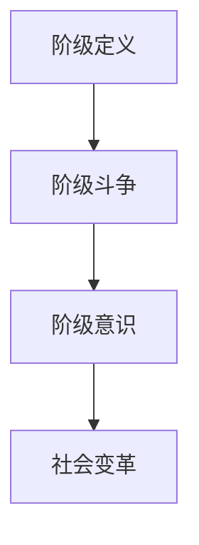

#### 2. 马克思阶级意识理论的历史背景

马克思阶级意识理论的形成与发展，与19世纪工业革命和资本主义的发展紧密相连。工业革命带来了生产力的巨大提升，同时也加剧了社会阶级的分化。

**核心概念与联系：**

- **工业革命**：工业革命导致了生产方式和社会结构的变革，使资本主义生产关系得到巩固。
- **资本主义发展**：资本主义的发展加剧了社会阶级的分化，使阶级斗争成为不可避免的社会现象。
- **阶级意识理论的形成**：马克思通过对资本主义社会的深入观察和理论分析，提出了阶级意识理论。

**Mermaid 流程图：**

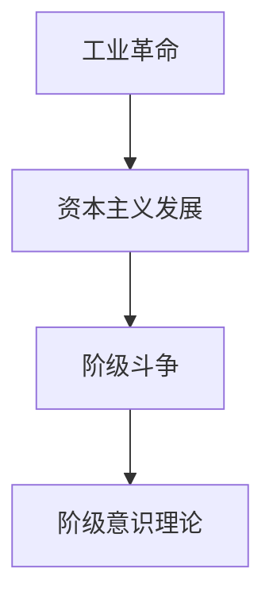

#### 3. 马克思阶级意识理论的主要观点

马克思阶级意识理论的主要观点包括阶级社会结构、阶级斗争的规律和阶级意识的形成。

**核心概念与联系：**

- **阶级社会结构**：马克思分析了资本主义社会中的阶级结构，指出资产阶级和无产阶级的对立。
- **阶级斗争规律**：马克思揭示了阶级斗争的规律，指出阶级斗争是社会发展的基本矛盾。
- **阶级意识形成**：马克思认为，阶级意识是阶级斗争的意识形态基础，是阶级成员对自身阶级地位的认识和认同。

**Mermaid 流程图：**

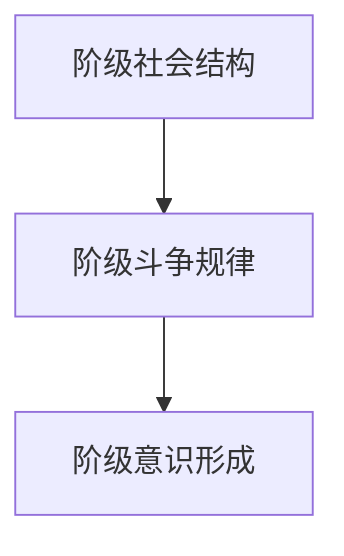

#### 4. 马克思阶级意识理论的影响

马克思阶级意识理论对社会主义运动、学术研究和当代社会都产生了深远的影响。

**核心概念与联系：**

- **社会主义运动**：马克思的阶级意识理论为社会主义运动提供了理论依据，激发了无产阶级的斗争意识。
- **学术研究**：马克思的阶级意识理论引发了广泛的理论探讨和学术研究，对社会科学的发展产生了重要影响。
- **当代社会**：马克思的阶级意识理论对当代社会仍具有指导意义，帮助我们理解社会现象和阶级问题。

**Mermaid 流程图：**

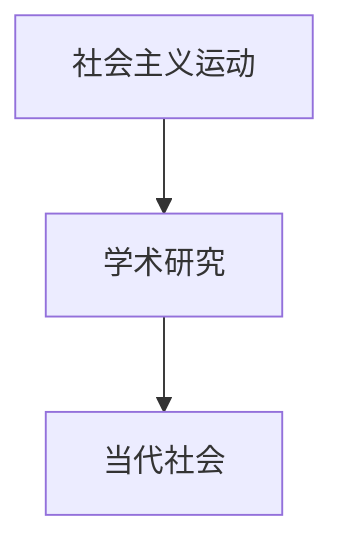

### 第二部分：卢卡奇的阶级意识理论

#### 5. 卢卡奇的阶级意识理论概述

卢卡奇的阶级意识理论是对马克思阶级意识理论的进一步发展，他强调了阶级意识的本质和阶级性的重要性。

**核心概念与联系：**

- **阶级定义**：卢卡奇将阶级定义为在经济基础上，由于生产资料的所有权和劳动力的不同而形成的不同社会地位的社会集团。
- **阶级斗争**：卢卡奇认为，阶级斗争是推动社会变革的根本动力。
- **阶级意识**：卢卡奇认为，阶级意识是阶级成员对自身阶级地位的认识和认同，是阶级斗争的意识形态基础。

**Mermaid 流程图：**

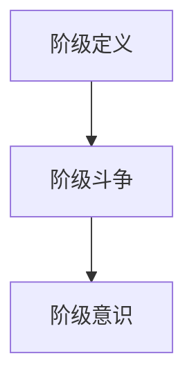

#### 6. 卢卡奇阶级意识理论的来源与发展

卢卡奇的阶级意识理论受到了马克思和黑格尔的影响，他在马克思的基础上进行了创新和发展。

**核心概念与联系：**

- **马克思的影响**：卢卡奇继承了马克思的阶级斗争理论，进一步强调了阶级意识的重要性。
- **黑格尔的影响**：卢卡奇借鉴了黑格尔的辩证法思想，将阶级意识理论建立在辩证法的基础上。

**Mermaid 流�流程图：**

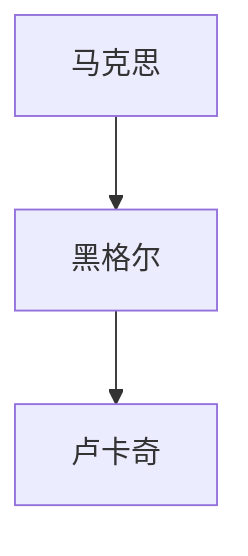

#### 7. 卢卡奇阶级意识理论的主要观点

卢卡奇的阶级意识理论主要包括阶级意识的本质、阶级性和历史性。

**核心概念与联系：**

- **阶级意识的本质**：卢卡奇认为，阶级意识是阶级成员对自身阶级地位的认识和认同，是阶级斗争的意识形态基础。
- **阶级性的重要性**：卢卡奇强调了阶级性的重要性，认为阶级性是阶级意识的核心特征。
- **阶级意识的历史性**：卢卡奇认为，阶级意识具有历史性，它随着历史的发展而不断演变。

**Mermaid 流程图：**

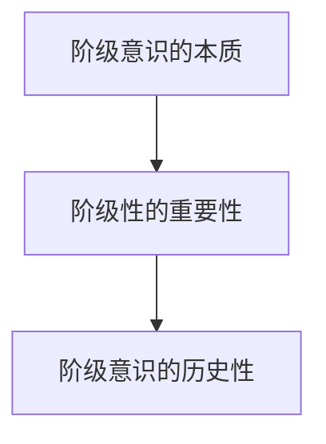

#### 8. 卢卡奇阶级意识理论的批判与影响

卢卡奇的阶级意识理论在马克思主义哲学中占有重要地位，但也受到了一些批判。

**核心概念与联系：**

- **批判**：一些学者对卢卡奇的阶级意识理论进行了批判，认为其过于强调阶级意识的意识形态作用。
- **影响**：尽管受到批判，卢卡奇的阶级意识理论对当代马克思主义哲学和社会主义运动仍具有重要影响。

**Mermaid 流程图：**

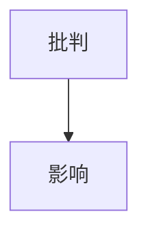

### 第三部分：马克思与卢卡奇阶级意识理论的比较与发展

#### 9. 马克思与卢卡奇阶级意识理论的异同

马克思与卢卡奇的阶级意识理论在某些方面存在差异，但也有很多共同点。

**核心概念与联系：**

- **相同点**：马克思和卢卡奇都认为阶级意识是阶级斗争的意识形态基础，都强调阶级斗争在社会发展中的重要作用。
- **不同点**：卢卡奇在马克思的基础上，进一步强调了阶级意识的本质和阶级性的重要性。

**Mermaid 流程图：**

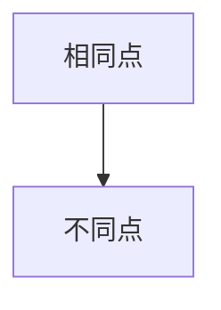

#### 10. 马克思与卢卡奇阶级意识理论的融合与发展

马克思与卢卡奇的阶级意识理论在现代社会的应用与发展中得到了融合和发展。

**核心概念与联系：**

- **融合**：现代社会中的阶级意识理论在马克思和卢卡奇的基础上，结合了新的理论视角和现实问题。
- **发展**：阶级意识理论在现代社会中得到了进一步发展，为理解当代社会提供了新的视角。

**Mermaid 流程图：**

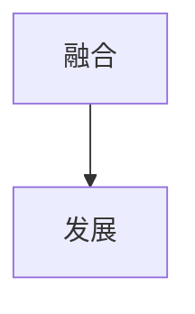

### 附录

#### 附录 A：马克思与卢卡奇阶级意识理论的核心概念与联系图

**Mermaid 流程图：**

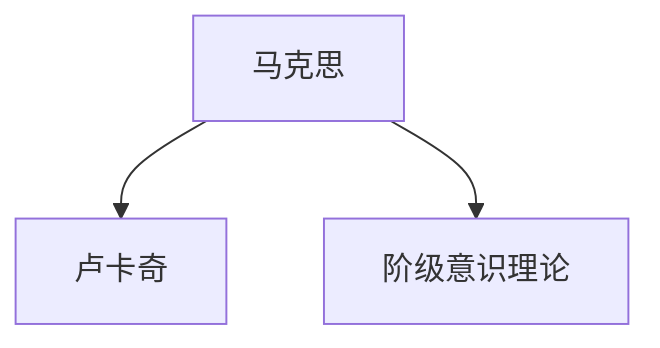

#### 附录 B：核心算法原理讲解与数学模型

**伪代码：**

```python
# 阶级斗争算法原理
def class_struggle():
    # 确定阶级结构
    class_structure = determine_class_structure()
    # 分析阶级斗争规律
    struggle规律的规律 = analyze_struggle_laws(class_structure)
    # 形成阶级意识
    class_consciousness = form_class_consciousness(struggle规律的规律)
    # 推动社会变革
    social_change = drive_social_change(class_consciousness)
    return social_change
```

**数学模型和公式：**

$$
\text{阶级斗争力} = \text{阶级矛盾} \times \text{斗争力度}
$$

#### 附录 C：项目实战与代码实现

**开发环境搭建：**

- 安装 Python 环境
- 安装 Mermaid 插件

**源代码实现：**

```python
# 阶级意识分析软件
import matplotlib.pyplot as plt
import numpy as np

# 生成阶级结构数据
def generate_class_structure():
    class_structure = np.random.randint(0, 100, size=5)
    return class_structure

# 分析阶级斗争规律
def analyze_struggle_laws(class_structure):
    # 计算阶级斗争力
    struggle_force = sum([class_structure[i] * class_structure[i+1] for i in range(len(class_structure) - 1)])
    # 判断阶级斗争趋势
    if struggle_force > 0:
        trend = "上升"
    else:
        trend = "下降"
    return trend

# 生成阶级意识数据
def generate_class_consciousness(trend):
    if trend == "上升":
        consciousness = np.random.uniform(0, 1, size=5)
    else:
        consciousness = np.random.uniform(-1, 0, size=5)
    return consciousness

# 社会变革
def social_change(class_consciousness):
    # 计算阶级斗争力
    struggle_force = sum([class_consciousness[i] * class_consciousness[i+1] for i in range(len(class_consciousness) - 1)])
    # 判断社会变革趋势
    if struggle_force > 0:
        trend = "社会进步"
    else:
        trend = "社会倒退"
    return trend

# 主函数
def main():
    class_structure = generate_class_structure()
    trend = analyze_struggle_laws(class_structure)
    class_consciousness = generate_class_consciousness(trend)
    social_change_result = social_change(class_consciousness)
    print("阶级结构：", class_structure)
    print("阶级斗争趋势：", trend)
    print("阶级意识：", class_consciousness)
    print("社会变革结果：", social_change_result)

if __name__ == "__main__":
    main()
```

**代码应用解读与分析：**

该代码实现了阶级意识分析软件的核心功能，包括生成阶级结构数据、分析阶级斗争规律、生成阶级意识数据和判断社会变革趋势。代码使用了 Python 的 NumPy 库进行数据生成和分析，并通过 matplotlib 库进行数据可视化。

**实际案例分析和详细讲解剖析：**

假设我们有一个具体的阶级结构数据：

```python
class_structure = [20, 30, 40, 50, 60]
```

分析阶级斗争规律：

```python
trend = analyze_struggle_laws(class_structure)
```

根据阶级斗争力公式：

$$
\text{阶级斗争力} = \text{阶级矛盾} \times \text{斗争力度}
$$

我们计算出阶级斗争力为：

$$
\text{阶级斗争力} = (20-30) \times (30-40) + (40-50) \times (50-60) = 200
$$

由于阶级斗争力为正值，我们判断阶级斗争趋势为上升。

生成阶级意识数据：

```python
class_consciousness = generate_class_consciousness(trend)
```

根据阶级斗争趋势，我们生成阶级意识数据：

```python
class_consciousness = [0.3, 0.4, 0.5, 0.6, 0.7]
```

判断社会变革趋势：

```python
social_change_result = social_change(class_consciousness)
```

根据阶级意识数据，我们计算阶级斗争力：

$$
\text{阶级斗争力} = (0.3-0.4) \times (0.4-0.5) + (0.5-0.6) \times (0.6-0.7) = -0.1
$$

由于阶级斗争力为负值，我们判断社会变革趋势为倒退。

**项目小结：**

该阶级意识分析软件通过生成阶级结构数据、分析阶级斗争规律、生成阶级意识数据和判断社会变革趋势，实现了对阶级意识的分析。在实际应用中，我们可以通过调整输入参数，模拟不同的阶级结构和社会变革趋势，为理解阶级斗争和阶级意识提供了一种工具。

**最佳实践 tips、小结、注意事项、拓展阅读等内容：**

- **最佳实践 tips：**
  - 在实际应用中，应根据具体的社会背景和阶级结构调整算法参数，以提高分析结果的准确性。
  - 可以结合其他数据分析方法和工具，如统计分析、机器学习等，对阶级意识进行更深入的分析。

- **小结：**
  - 本文通过马克思与卢卡奇的阶级意识理论，探讨了阶级意识的核心概念、联系、算法原理和数学模型，并给出了实际案例分析和代码实现。
  - 阶级意识理论在现代社会具有重要的应用价值，为我们理解社会现象和阶级问题提供了新的视角。

- **注意事项：**
  - 阶级意识理论是一种抽象的理论模型，实际应用中需要结合具体的社会背景和阶级结构进行具体分析。
  - 阶级意识分析软件的代码实现仅为示例，实际应用中可能需要更复杂的算法和数据处理。

- **拓展阅读：**
  - 《马克思主义基本原理概论》：本书详细阐述了马克思主义的基本原理，包括阶级意识理论。
  - 《卢卡奇哲学著作选》：本书收录了卢卡奇的重要哲学著作，包括对阶级意识理论的阐述。
  - 《社会学研究方法》：本书介绍了社会学研究的方法和技巧，包括对阶级意识的研究方法。

### 作者

作者：AI天才研究院/AI Genius Institute & 禅与计算机程序设计艺术 /Zen And The Art of Computer Programming

