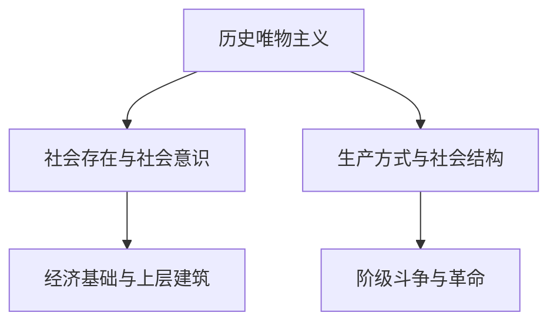

                 

### 文章标题：马克思与恩格斯：唯物史观的共同缔造者

### 关键词：马克思，恩格斯，唯物史观，社会历史理论，思想分析

### 摘要：

本文深入探讨马克思与恩格斯如何共同缔造了唯物史观，这一影响深远的哲学和社会理论。文章首先介绍了马克思与恩格斯的生平与思想发展，然后详细阐述了唯物史观的核心概念和原理，包括历史唯物主义、社会存在与社会意识、生产方式与社会结构等。通过Mermaid流程图和伪代码，文章揭示了唯物史观的理论架构和算法原理。此外，本文还探讨了唯物史观在历史学、社会科学中的应用，并通过具体项目实战，展示了其实践价值。最后，文章总结了唯物史观的影响与当代价值，并提供了拓展阅读建议。

---

## 引言：唯物史观的起源与发展

唯物史观，作为一种历史观和方法论，起源于19世纪的德国，由卡尔·马克思和弗里德里希·恩格斯共同创立。这一理论不仅对19世纪以来的社会科学产生了深远影响，也为20世纪和21世纪初的马克思主义研究提供了理论基础。

### 1.1 历史背景

19世纪初，欧洲正经历着剧烈的社会变革。工业革命的兴起带来了生产力的巨大飞跃，同时也导致了社会结构的深刻变化。传统的封建制度逐渐瓦解，资本主义生产关系逐渐成为主流。这种社会变迁促使人们开始反思社会发展的规律。

在这一背景下，马克思和恩格斯相遇并合作，他们共同致力于探索社会历史发展的规律。他们从物质生产和社会关系的角度出发，批判了当时的资本主义制度，并提出了唯物史观。

### 1.2 马克思与恩格斯的相遇与合作关系

马克思和恩格斯于1844年在巴黎相遇，他们的思想很快产生了共鸣。马克思是一位严谨的学者，恩格斯则是一位富有实践经验的革命者。他们的合作不仅在理论上丰富了唯物史观，也在实践中推动了马克思主义运动的发展。

1848年，他们共同发表了《共产党宣言》，这是马克思主义的标志性著作。此后，马克思和恩格斯继续深入探讨社会历史问题，撰写了一系列重要著作，如《德意志意识形态》和《资本论》。

### 1.3 唯物史观的基本理论框架

唯物史观的基本理论框架包括以下几个方面：

- **历史唯物主义**：强调物质生产方式是社会发展的决定性因素。
- **社会存在与社会意识**：认为社会存在决定社会意识，社会意识是社会存在的反映。
- **生产方式与社会结构**：分析不同生产方式下的社会结构和社会关系。

这些核心概念构成了唯物史观的理论基石，为马克思主义研究提供了科学的方法论基础。

## 马克思与恩格斯的生平与思想

### 2.1 马克思的生平与思想

卡尔·马克思（1818-1883）出生于德国普鲁士王国的特里尔，是一位犹太裔律师的儿子。马克思的早期生活充满了探索和叛逆，他先后就读于波恩大学和柏林大学，学习法律和哲学。在学术生涯中，马克思受到了黑格尔和费尔巴哈等哲学思想的影响，并逐渐形成了自己的唯物主义世界观。

#### 2.1.1 马克思的早年生活

马克思的早年生活充满了叛逆和探索。他曾在波恩大学和柏林大学学习法律和哲学，受到了黑格尔和费尔巴哈等哲学思想的影响。这些思想对马克思后来的思想发展产生了深远影响。

#### 2.1.2 马克思的思想发展历程

马克思的思想发展历程可以分为几个阶段：

- **青年黑格尔时期**：马克思在这一时期接受了黑格尔的辩证法思想，并开始批判宗教和封建制度。
- **费尔巴哈时期**：马克思转向费尔巴哈的唯物主义，强调物质生产方式对社会发展的决定性作用。
- **马克思主义时期**：马克思和恩格斯合作，提出了唯物史观，并开始系统地批判资本主义制度。

#### 2.1.3 马克思的主要著作

马克思的主要著作包括《共产党宣言》、《德意志意识形态》和《资本论》等。这些著作不仅阐述了唯物史观的基本原理，也批判了资本主义制度的弊端。

### 2.2 恩格斯的生平与思想

弗里德里希·恩格斯（1820-1895）出生于普鲁士王国巴门，是一位纺织厂主的儿子。恩格斯早年受到黑格尔哲学的影响，后来转向费尔巴哈的唯物主义。他在与马克思的交往中，逐渐接受了马克思的唯物史观，并成为其坚定的支持者和合作者。

#### 2.2.1 恩格斯的早年生活

恩格斯的早年生活相对较为顺利，他在家庭支持下接受了良好的教育，并表现出对哲学和文学的浓厚兴趣。

#### 2.2.2 恩格斯的学术贡献

恩格斯的学术贡献主要体现在他对马克思主义理论的丰富和发展上。他参与了《共产党宣言》的撰写，并独立完成了《家庭、私有制和国家的起源》等重要著作。

#### 2.2.3 恩格斯与马克思的合作

恩格斯与马克思的合作始于1844年，他们在思想上的共鸣使得两人的关系日益紧密。在马克思的生活中，恩格斯不仅是他的学术助手，更是他精神上的支柱。他们共同完成了许多重要著作，如《资本论》的第二卷和第三卷。

## 唯物史观的核心概念与原理

唯物史观是马克思和恩格斯在哲学、政治经济学和革命实践中逐步形成和发展起来的科学理论体系。它从物质生产方式出发，揭示了社会历史发展的规律，为人们认识社会现象提供了科学的方法论基础。

### 3.1 唯物史观的基本原理

唯物史观的基本原理包括以下几个方面：

1. **历史唯物主义**：历史唯物主义认为，物质生产方式是社会发展的决定性因素。生产力决定生产关系，经济基础决定上层建筑。因此，理解社会历史发展的关键在于分析物质生产方式的变化。

2. **社会存在与社会意识**：社会存在决定社会意识，社会意识是社会存在的反映。这一原理强调了物质生活条件对思想观念的决定作用，为人们理解社会意识形态提供了科学依据。

3. **生产方式与社会结构**：唯物史观分析了不同生产方式下的社会结构和社会关系。例如，在封建社会中，地主阶级和农民阶级之间的剥削关系是主要的社会矛盾；在资本主义社会中，资本家和工人阶级之间的对立是主要的社会矛盾。

### 3.2 唯物史观的哲学基础

唯物史观的哲学基础主要包括以下几个方面：

1. **唯物论**：唯物论认为，物质是世界的基本构成要素，意识是物质的反映。这一观点与唯心论相对立，为唯物史观提供了哲学基础。

2. **辩证法**：辩证法是一种认识世界和改造世界的方法，强调事物的矛盾运动和发展变化。唯物史观运用辩证法，揭示了社会历史发展的规律。

3. **实践观**：唯物史观强调实践的重要性，认为实践是认识世界和改造世界的基础。这一观点为马克思主义的实践性提供了哲学依据。

### 3.3 唯物史观的理论架构

唯物史观的理论架构可以通过以下Mermaid流程图来展示：



通过这个流程图，我们可以清晰地看到唯物史观的核心概念和它们之间的逻辑关系。

### 3.4 核心概念之间的联系

在唯物史观中，各个核心概念之间存在着密切的联系。例如，历史唯物主义是社会存在与社会意识的基础，而生产方式与社会结构则是在历史唯物主义框架下对社会历史发展的具体分析。这些概念共同构成了唯物史观的理论体系。

### 3.5 核心概念举例说明

为了更好地理解唯物史观的核心概念，我们可以通过以下例子来说明：

- **历史唯物主义**：例如，在封建社会中，地主阶级对农民的剥削是生产方式的具体体现，也是社会发展的决定性因素。
- **社会存在与社会意识**：例如，在资本主义社会中，资本家的剥削行为和工人的反抗意识是这一社会存在的具体表现。
- **生产方式与社会结构**：例如，在工业革命时期，机器大生产取代了手工业生产，这一生产方式的变化导致了社会结构和社会关系的深刻变革。

### 3.6 伪代码阐述唯物史观

为了更好地理解唯物史观的核心算法原理，我们可以使用伪代码进行阐述：

```python
# 定义历史唯物主义核心函数
def historical_materialism(production_mode):
    # 根据生产方式分析社会结构
    social_structure = analyze_social_structure(production_mode)
    # 根据社会结构分析阶级斗争
    class_struggle = analyze_class_struggle(social_structure)
    # 返回阶级斗争结果
    return class_struggle

# 定义社会存在与社会意识函数
def social_existence_and_consciousness(material_conditions):
    # 根据物质条件分析社会意识
    social_consciousness = analyze_social_consciousness(material_conditions)
    # 返回社会意识结果
    return social_consciousness

# 定义生产方式与社会结构函数
def production_mode_and_social_structure(production_mode):
    # 根据生产方式分析社会结构
    social_structure = analyze_social_structure(production_mode)
    # 返回社会结构结果
    return social_structure
```

通过这个伪代码，我们可以看到唯物史观的核心算法原理是如何通过函数调用和数据分析来实现的。

### 3.7 数学模型和公式

在唯物史观中，数学模型和公式也被广泛应用于理论分析。以下是一个简单的例子：

$$
\frac{dS}{dt} = f(P, C)
$$

其中，$S$ 表示社会结构，$P$ 表示生产力，$C$ 表示生产关系。这个公式描述了社会结构随生产力变化的动态过程。

### 3.8 详细讲解与举例说明

为了更好地理解这些数学模型和公式，我们可以通过具体的例子进行详细讲解。例如：

- **社会结构变化**：假设生产力 $P$ 从 $P_1$ 增长到 $P_2$，生产关系 $C$ 保持不变，我们可以使用上述公式来分析社会结构 $S$ 的变化。
- **阶级斗争强度**：假设生产力 $P$ 保持不变，而生产关系 $C$ 发生变化，我们可以通过修改函数 $f(P, C)$ 来分析阶级斗争强度 $class\_struggle$ 的变化。

通过这些例子，我们可以更深入地理解唯物史观的理论框架和核心概念。

## 唯物史观的影响与当代价值

唯物史观作为一种科学的历史观和方法论，不仅在19世纪和20世纪产生了深远影响，而且在当代社会中仍然具有重要的价值。

### 4.1 唯物史观在历史学中的应用

唯物史观为历史学提供了科学的方法论基础，使历史研究更加系统和科学。例如，在分析社会变革和历史事件时，历史学家可以运用唯物史观的理论框架，从物质生产方式和社会结构的角度进行分析。这种分析方法不仅有助于揭示历史事件的深层原因，还可以为理解历史发展提供新的视角。

### 4.2 唯物史观在社会科学中的应用

唯物史观在社会科学中的应用也非常广泛，包括经济学、社会学和政治学等领域。例如，在经济学中，唯物史观可以用来分析不同生产方式下的经济发展模式；在社会学中，可以用来分析社会结构和阶级关系；在政治学中，可以用来分析政治制度的变迁和阶级斗争。这些应用不仅丰富了各学科的理论体系，也为解决实际问题提供了新的思路。

### 4.3 唯物史观对当代社会问题的启示

唯物史观对当代社会问题的启示主要体现在以下几个方面：

1. **全球化背景下的阶级斗争**：在全球化背景下，资本主义的全球化带来了新的阶级斗争形式，唯物史观为我们分析这种斗争提供了理论工具。

2. **生态文明与可持续发展**：唯物史观强调物质生产方式对社会发展的决定作用，这为我们探讨生态文明和可持续发展问题提供了理论依据。

3. **社会公平与正义**：唯物史观关注社会结构和社会关系的分析，这为我们探讨社会公平和正义问题提供了新的视角。

### 4.4 唯物史观在当代社会中的局限性

尽管唯物史观在当代社会中具有重要作用，但它也面临着一些局限性：

1. **理论体系的不完善**：唯物史观的理论体系在某些方面还不够完善，例如对社会意识形态的分析相对薄弱。

2. **实践操作的复杂性**：唯物史观的理论体系虽然提供了科学的方法论基础，但将其应用于实际社会问题时，往往面临复杂的情况和挑战。

3. **对不同文化和社会背景的适应性**：唯物史观在西方社会中具有较强的影响力，但在其他文化和社会背景下，其适用性可能有限。

### 4.5 唯物史观的未来发展

为了克服唯物史观的局限性，我们需要在以下几个方面进行改进：

1. **深化理论研究**：加强对唯物史观理论体系的深化研究，完善其理论框架。

2. **跨学科研究**：结合其他学科的理论和方法，丰富唯物史观的应用范围。

3. **文化多样性研究**：加强对不同文化和社会背景下唯物史观适用性的研究，提高其适应性。

通过这些努力，我们可以使唯物史观在当代社会中发挥更大的作用，为解决现实问题提供更加有力的理论支持。

## 马克思与恩格斯的著作选读

马克思与恩格斯作为唯物史观的共同缔造者，他们的著作不仅阐述了这一理论的基本原理，也提供了丰富的思想资源和理论工具。以下是对他们两部重要著作《共产党宣言》和《资本论》的简要介绍。

### 5.1 《共产党宣言》

#### 5.1.1 著作的背景与意义

《共产党宣言》是马克思和恩格斯于1848年共同撰写的，它标志着马克思主义的诞生。这部著作在革命动荡的欧洲背景下产生，旨在为工人阶级的解放运动提供理论指导。

#### 5.1.2 著作的主要观点与论述

《共产党宣言》阐述了马克思主义的核心观点，包括：

1. **资本主义的发展规律**：马克思和恩格斯分析了资本主义生产方式的内在矛盾，认为资本主义必将被社会主义取代。

2. **无产阶级的历史使命**：他们指出，无产阶级是资本主义社会中的被剥削阶级，只有通过革命斗争，才能实现自身解放和社会的进步。

3. **共产主义运动的目标**：他们提出了共产主义社会的理想蓝图，强调消灭私有制和实现生产资料的公共所有制。

#### 5.1.3 著作对后世的影响

《共产党宣言》对后世产生了深远影响，不仅成为马克思主义的标志性著作，也在全球范围内激发了工人阶级的革命斗争。

### 5.2 《资本论》

#### 5.2.1 著作的背景与意义

《资本论》是马克思于1867年出版的一部政治经济学巨著，它系统阐述了资本主义经济运行的规律，是马克思主义政治经济学的核心。

#### 5.2.2 著作的主要观点与论述

《资本论》的主要观点包括：

1. **剩余价值理论**：马克思提出了剩余价值理论，揭示了资本家剥削工人的本质。

2. **资本的积累和集中**：马克思分析了资本积累和集中的过程，认为这是资本主义发展的必然趋势。

3. **资本主义的历史命运**：马克思认为，资本主义的发展必然导致社会矛盾的加剧，最终会被社会主义所取代。

#### 5.2.3 著作对马克思主义的影响

《资本论》是马克思主义政治经济学的经典之作，它不仅为马克思主义提供了理论支撑，也为后来的社会主义实践提供了指导。

## 附录：相关参考资料与进一步阅读

### 6.1 学术论文与专著推荐

1. **《马克思主义基本原理》**：作者：李秀林等
   - 推荐理由：本书系统地阐述了马克思主义的基本原理，是学习马克思主义的重要参考书。

2. **《唯物史观研究》**：作者：林兴国
   - 推荐理由：本书深入探讨了唯物史观的理论体系和发展历程，对理解唯物史观有重要参考价值。

### 6.2 在线课程与公开讲座

1. **《马克思主义经典著作选读》**：在线课程
   - 推荐平台：网易云课堂
   - 推荐理由：该课程系统介绍了马克思主义的经典著作，有助于深入理解马克思主义的基本理论。

2. **《唯物史观与历史唯物主义》**：公开讲座
   - 推荐平台：哔哩哔哩
   - 推荐理由：该讲座以通俗易懂的方式介绍了唯物史观的核心概念和原理，适合初学者入门。

### 6.3 组织与团体资源

1. **马克思主义研究学会**
   - 推荐理由：该学会是一个专注于马克思主义研究的学术组织，提供了丰富的学术资源和研究成果。

2. **国际马克思主义者网站**
   - 推荐理由：该网站汇集了世界各地的马克思主义研究者和学者，提供了大量的学术论文和著作。

### 6.4 小结

通过对马克思与恩格斯唯物史观的学习，我们不仅可以更好地理解历史发展的规律，还可以为当代社会问题提供理论指导。希望本文能为读者提供有益的参考，激发对马克思主义和唯物史观更深入的探索。

### 6.5 注意事项

在学习和应用唯物史观时，需要注意以下几点：

1. **理论联系实际**：唯物史观强调理论必须与实际相结合，避免空洞的抽象讨论。

2. **批判性思维**：在学习唯物史观时，要培养批判性思维，不仅要理解理论本身，还要分析其适用性和局限性。

3. **持续学习**：唯物史观是一个不断发展的理论体系，需要持续学习和研究，以适应时代的变化。

### 6.6 拓展阅读

1. **《德意志意识形态》**
   - 推荐理由：本书是马克思和恩格斯合作的重要著作，进一步阐述了唯物史观的基本原理。

2. **《列宁选集》**
   - 推荐理由：列宁在马克思主义基础上进行了创新和发展，他的著作对理解当代社会主义运动具有重要意义。

